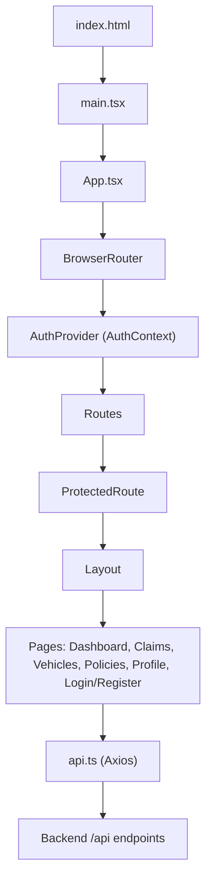
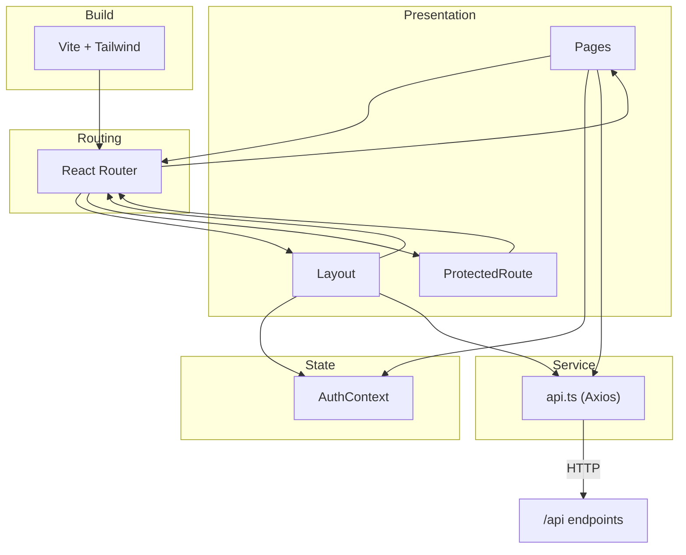
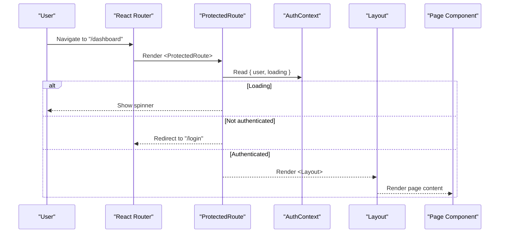
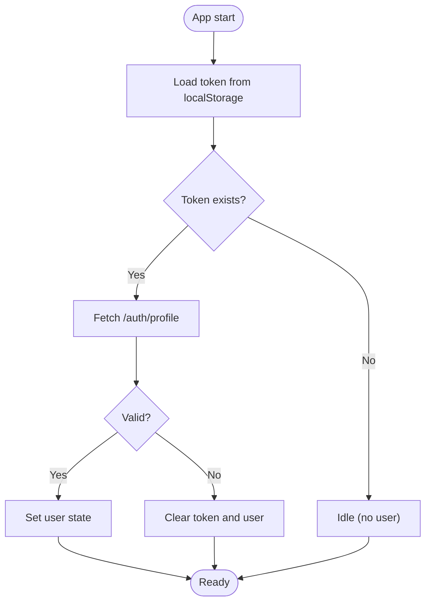
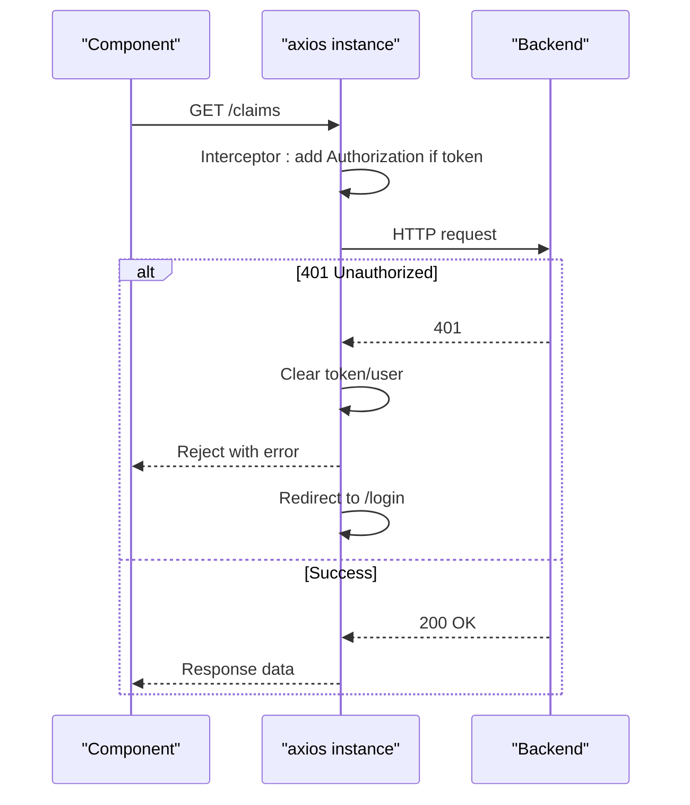
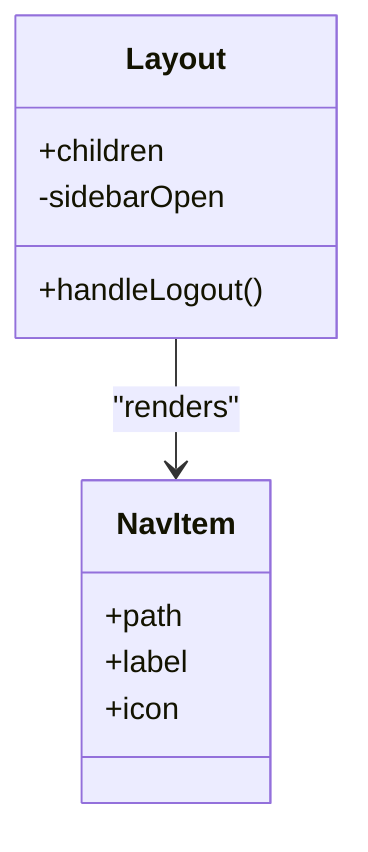
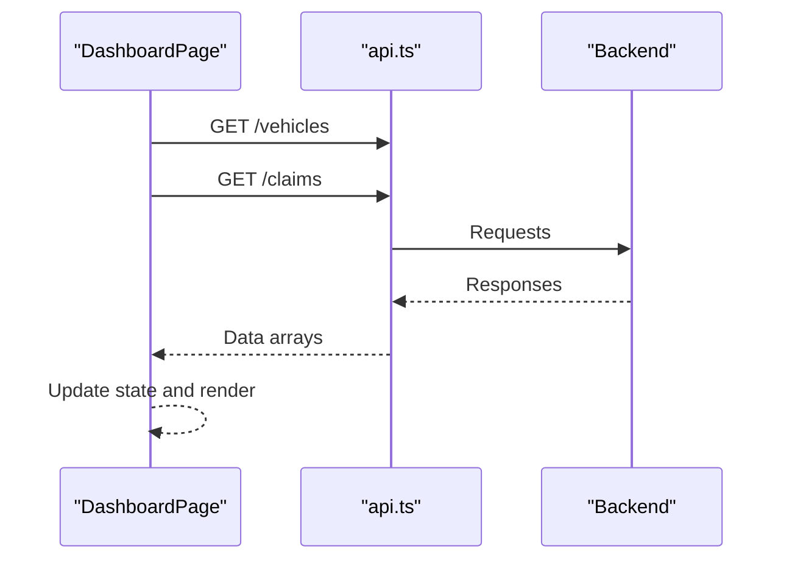
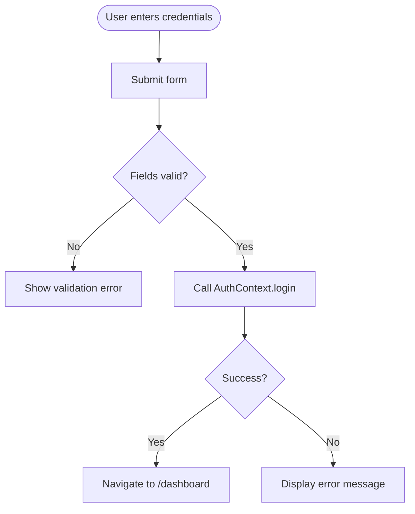
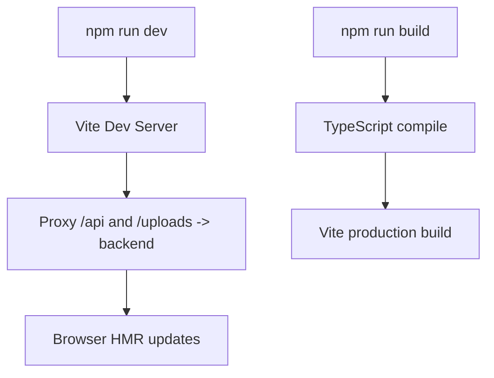
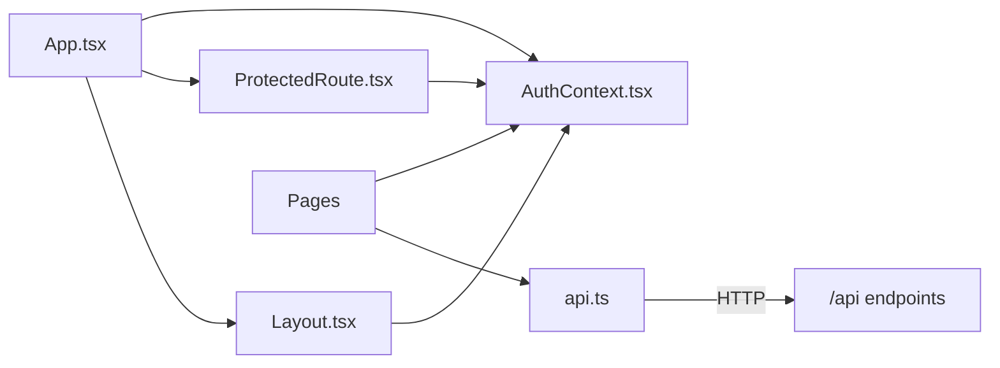

# Frontend Architecture

<cite>
**Referenced Files in This Document**
- [App.tsx](file://frontend/src/App.tsx)
- [main.tsx](file://frontend/src/main.tsx)
- [AuthContext.tsx](file://frontend/src/context/AuthContext.tsx)
- [api.ts](file://frontend/src/services/api.ts)
- [Layout.tsx](file://frontend/src/components/Layout.tsx)
- [ProtectedRoute.tsx](file://frontend/src/components/ProtectedRoute.tsx)
- [DashboardPage.tsx](file://frontend/src/pages/DashboardPage.tsx)
- [ClaimsPage.tsx](file://frontend/src/pages/ClaimsPage.tsx)
- [LoginPage.tsx](file://frontend/src/pages/LoginPage.tsx)
- [index.html](file://frontend/index.html)
- [vite.config.ts](file://frontend/vite.config.ts)
- [package.json](file://frontend/package.json)
- [index.ts (types)](file://frontend/src/types/index.ts)
</cite>

## Table of Contents
1. [Introduction](#introduction)
2. [Project Structure](#project-structure)
3. [Core Components](#core-components)
4. [Architecture Overview](#architecture-overview)
5. [Detailed Component Analysis](#detailed-component-analysis)
6. [Dependency Analysis](#dependency-analysis)
7. [Performance Considerations](#performance-considerations)
8. [Troubleshooting Guide](#troubleshooting-guide)
9. [Conclusion](#conclusion)
10. [Appendices](#appendices)

## Introduction
This document describes the frontend architecture of the Smart Vehicle Insurance Claim System built with React and TypeScript. It covers component hierarchy, routing, state management via React Context, API service layer using Axios, styling with Tailwind CSS, form handling and validation patterns, build configuration with Vite, development workflow including hot module replacement, responsive design considerations, and accessibility practices.

## Project Structure
The application is a single-page app bootstrapped by Vite and React. The entry point renders the root React tree and configures global providers and routes. Pages are grouped under pages/, shared UI and layout logic under components/, authentication state under context/, and HTTP client abstraction under services/. Types are centralized for consistency across modules.

**Diagram sources**
- [index.html:1-14](file://frontend/index.html#L1-L14)
- [main.tsx:1-11](file://frontend/src/main.tsx#L1-L11)
- [App.tsx:1-39](file://frontend/src/App.tsx#L1-L39)
- [AuthContext.tsx:1-82](file://frontend/src/context/AuthContext.tsx#L1-L82)
- [Layout.tsx:1-176](file://frontend/src/components/Layout.tsx#L1-L176)
- [api.ts:1-33](file://frontend/src/services/api.ts#L1-L33)

**Section sources**
- [index.html:1-14](file://frontend/index.html#L1-L14)
- [main.tsx:1-11](file://frontend/src/main.tsx#L1-L11)
- [App.tsx:1-39](file://frontend/src/App.tsx#L1-L39)

## Core Components
- App: Configures routing, wraps all routes with AuthProvider and ProtectedRoute where needed, and defines navigation to dashboard, claims, vehicles, policies, profile, login, and register.
- Layout: Provides consistent shell with sidebar navigation, mobile header, bottom nav on small screens, user info, and sign-out action. Uses Tailwind utility classes for responsive behavior.
- ProtectedRoute: Guards protected routes by checking authentication state; shows a loading spinner while auth initializes and redirects unauthenticated users to login.
- AuthContext: Manages user session, token persistence, login/register/logout/profile update flows, and initialization from stored token.
- api: Centralized Axios instance with base URL, default headers, request interceptor to attach Authorization bearer token, and response interceptor to handle 401 by clearing session and redirecting to login.

Key responsibilities:
- Routing and navigation orchestration
- Authentication state and lifecycle
- Shared UI shell and responsive navigation
- Secure HTTP requests with automatic token injection and error handling

**Section sources**
- [App.tsx:1-39](file://frontend/src/App.tsx#L1-L39)
- [Layout.tsx:1-176](file://frontend/src/components/Layout.tsx#L1-L176)
- [ProtectedRoute.tsx:1-21](file://frontend/src/components/ProtectedRoute.tsx#L1-L21)
- [AuthContext.tsx:1-82](file://frontend/src/context/AuthContext.tsx#L1-L82)
- [api.ts:1-33](file://frontend/src/services/api.ts#L1-L33)

## Architecture Overview
The frontend follows a layered architecture:
- Presentation Layer: React components organized as pages and reusable layout/UI elements.
- State Layer: React Context for authentication and global user/session state.
- Service Layer: Axios-based HTTP client with interceptors for token injection and error handling.
- Routing Layer: React Router for declarative navigation and route protection.
- Build Layer: Vite with plugins for React and Tailwind, dev server proxy to backend.

**Diagram sources**
- [App.tsx:1-39](file://frontend/src/App.tsx#L1-L39)
- [AuthContext.tsx:1-82](file://frontend/src/context/AuthContext.tsx#L1-L82)
- [api.ts:1-33](file://frontend/src/services/api.ts#L1-L33)
- [vite.config.ts:1-21](file://frontend/vite.config.ts#L1-L21)

## Detailed Component Analysis

### Routing and Navigation
- Routes define public and protected paths. Public: login, register. Protected: dashboard, vehicles, policies, claims, profile. Redirects root to dashboard.
- ProtectedRoute ensures only authenticated users can access protected routes and displays a loading indicator during auth initialization.
- Layout provides persistent navigation and integrates with React Router for active states and navigation actions.

**Diagram sources**
- [App.tsx:15-35](file://frontend/src/App.tsx#L15-L35)
- [ProtectedRoute.tsx:4-20](file://frontend/src/components/ProtectedRoute.tsx#L4-L20)
- [AuthContext.tsx:17-36](file://frontend/src/context/AuthContext.tsx#L17-L36)

**Section sources**
- [App.tsx:15-35](file://frontend/src/App.tsx#L15-L35)
- [ProtectedRoute.tsx:4-20](file://frontend/src/components/ProtectedRoute.tsx#L4-L20)

### Authentication and Global State (AuthContext)
- Initializes user state from localStorage token and validates by fetching profile.
- Provides login, register, logout, and updateProfile functions that call the API and persist tokens and user data.
- Exposes a custom hook to consume context safely within components.

**Diagram sources**
- [AuthContext.tsx:17-36](file://frontend/src/context/AuthContext.tsx#L17-L36)

**Section sources**
- [AuthContext.tsx:17-66](file://frontend/src/context/AuthContext.tsx#L17-L66)

### API Service Layer (Axios)
- Base URL set to /api; default JSON content type.
- Request interceptor attaches Authorization header when token exists.
- Response interceptor handles 401 by clearing session and redirecting to login.

**Diagram sources**
- [api.ts:1-33](file://frontend/src/services/api.ts#L1-L33)

**Section sources**
- [api.ts:1-33](file://frontend/src/services/api.ts#L1-L33)

### Layout and Responsive Design
- Desktop: fixed left sidebar with navigation links and user info.
- Mobile: top header with menu toggle, overlay sidebar, and bottom tab bar for primary sections.
- Uses Tailwind responsive utilities to adapt layout across breakpoints.

**Diagram sources**
- [Layout.tsx:6-12](file://frontend/src/components/Layout.tsx#L6-L12)
- [Layout.tsx:14-176](file://frontend/src/components/Layout.tsx#L14-L176)

**Section sources**
- [Layout.tsx:14-176](file://frontend/src/components/Layout.tsx#L14-L176)

### Page Components and Data Flow
- DashboardPage: Fetches vehicles and claims concurrently, displays stats, quick actions, and recent claims list.
- ClaimsPage: Lists claims with status filter and severity indicators; navigates to claim details.
- LoginPage: Handles form submission, calls AuthContext login, navigates to dashboard on success, and shows errors.

**Diagram sources**
- [DashboardPage.tsx:14-27](file://frontend/src/pages/DashboardPage.tsx#L14-L27)
- [api.ts:1-33](file://frontend/src/services/api.ts#L1-L33)

**Section sources**
- [DashboardPage.tsx:14-27](file://frontend/src/pages/DashboardPage.tsx#L14-L27)
- [ClaimsPage.tsx:27-30](file://frontend/src/pages/ClaimsPage.tsx#L27-L30)
- [LoginPage.tsx:14-27](file://frontend/src/pages/LoginPage.tsx#L14-L27)

### Form Handling and Validation Patterns
- Controlled inputs with local state for email/password fields.
- Submit handler prevents default, sets loading state, calls authentication function, and handles errors.
- Basic HTML validation attributes ensure required fields; additional validation can be added per page.

**Diagram sources**
- [LoginPage.tsx:14-27](file://frontend/src/pages/LoginPage.tsx#L14-L27)

**Section sources**
- [LoginPage.tsx:14-27](file://frontend/src/pages/LoginPage.tsx#L14-L27)

### Styling Approach
- Tailwind CSS integrated via Vite plugin for utility-first styling.
- Consistent use of spacing, typography, colors, and responsive modifiers across components.
- Custom theme colors referenced via semantic names (e.g., primary-*) defined elsewhere in the project’s styles.

**Section sources**
- [vite.config.ts:1-21](file://frontend/vite.config.ts#L1-L21)
- [Layout.tsx:25-176](file://frontend/src/components/Layout.tsx#L25-L176)

### Build Configuration and Development Workflow
- Vite configured with React and Tailwind plugins.
- Dev server proxies /api and /uploads to backend at localhost:5000 to avoid CORS issues during development.
- Scripts include dev, build, lint, and preview commands.

**Diagram sources**
- [vite.config.ts:6-20](file://frontend/vite.config.ts#L6-L20)
- [package.json:6-11](file://frontend/package.json#L6-L11)

**Section sources**
- [vite.config.ts:6-20](file://frontend/vite.config.ts#L6-L20)
- [package.json:6-11](file://frontend/package.json#L6-L11)

### Accessibility Considerations
- Semantic HTML structure with proper headings and link semantics.
- Focus styles applied via Tailwind focus utilities for interactive elements.
- Icons used alongside text labels for clarity; consider adding aria-labels where icons convey meaning alone.
- Ensure color contrast meets WCAG guidelines for status badges and text.

[No sources needed since this section provides general guidance]

## Dependency Analysis
High-level dependencies among core modules:

**Diagram sources**
- [App.tsx:1-39](file://frontend/src/App.tsx#L1-L39)
- [AuthContext.tsx:1-82](file://frontend/src/context/AuthContext.tsx#L1-L82)
- [ProtectedRoute.tsx:1-21](file://frontend/src/components/ProtectedRoute.tsx#L1-L21)
- [Layout.tsx:1-176](file://frontend/src/components/Layout.tsx#L1-L176)
- [api.ts:1-33](file://frontend/src/services/api.ts#L1-L33)

**Section sources**
- [App.tsx:1-39](file://frontend/src/App.tsx#L1-L39)
- [AuthContext.tsx:1-82](file://frontend/src/context/AuthContext.tsx#L1-L82)
- [ProtectedRoute.tsx:1-21](file://frontend/src/components/ProtectedRoute.tsx#L1-L21)
- [Layout.tsx:1-176](file://frontend/src/components/Layout.tsx#L1-L176)
- [api.ts:1-33](file://frontend/src/services/api.ts#L1-L33)

## Performance Considerations
- Concurrent data fetching on dashboard using parallel requests reduces load time.
- Token and user state persisted in localStorage to avoid repeated logins and enable quick app startup.
- ProtectedRoute shows a lightweight spinner during auth initialization to improve perceived performance.
- Consider lazy-loading heavy page components and code-splitting routes for large applications.

[No sources needed since this section provides general guidance]

## Troubleshooting Guide
Common issues and resolutions:
- 401 Unauthorized responses: The API interceptor clears stored token and user, then redirects to login. Verify backend token validation and ensure the token is present in requests.
- Network or CORS errors in development: Confirm Vite dev server proxy settings target the correct backend URL.
- Authentication state not initializing: Check localStorage for token presence and ensure the profile endpoint is reachable.

**Section sources**
- [api.ts:19-30](file://frontend/src/services/api.ts#L19-L30)
- [AuthContext.tsx:22-36](file://frontend/src/context/AuthContext.tsx#L22-L36)
- [vite.config.ts:8-19](file://frontend/vite.config.ts#L8-L19)

## Conclusion
The frontend architecture leverages React Router for navigation, React Context for authentication state, and an Axios-based API layer with interceptors for secure and robust HTTP communication. Tailwind CSS enables consistent, responsive UI through utility classes. Vite provides a fast development experience with HMR and a simple proxy setup for backend integration. The modular structure separates concerns effectively, making the codebase maintainable and scalable.

[No sources needed since this section summarizes without analyzing specific files]

## Appendices

### Type Model Summary
Centralized types define domain entities such as User, Vehicle, InsurancePolicy, Claim, and related structures, ensuring type safety across components and services.

**Section sources**
- [index.ts (types):1-149](file://frontend/src/types/index.ts#L1-L149)