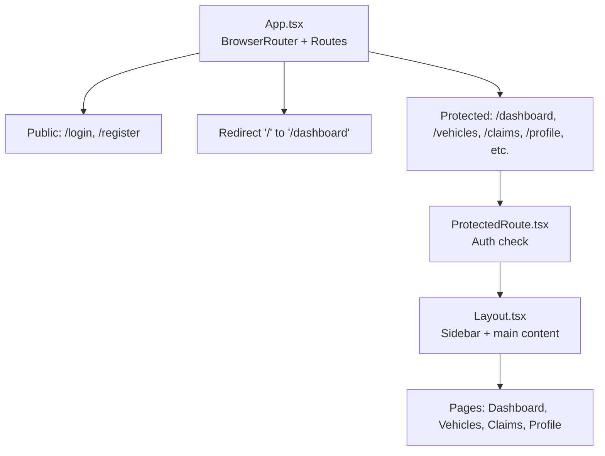
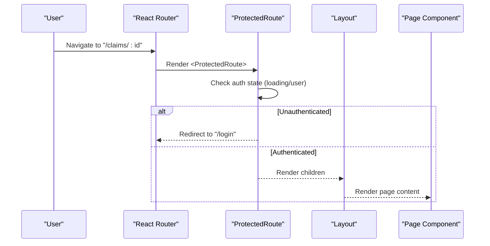
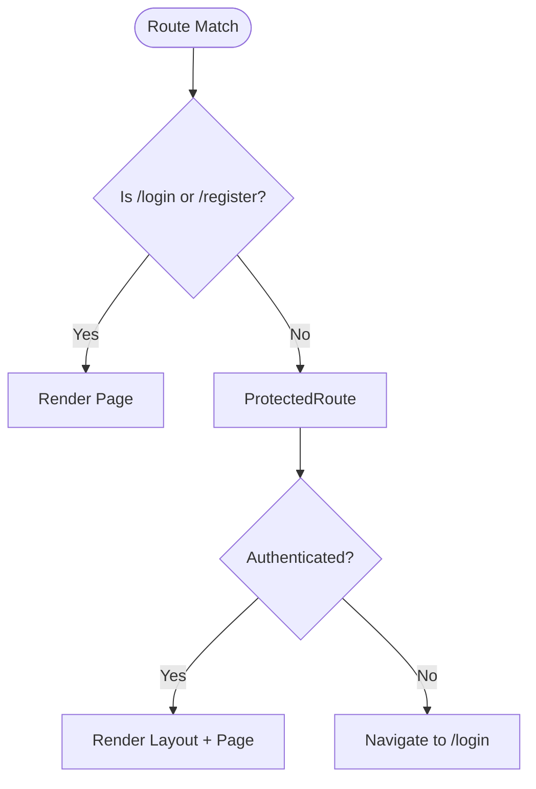
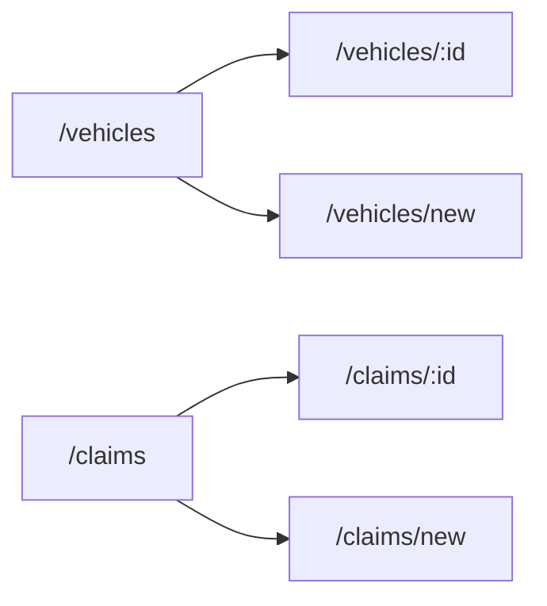
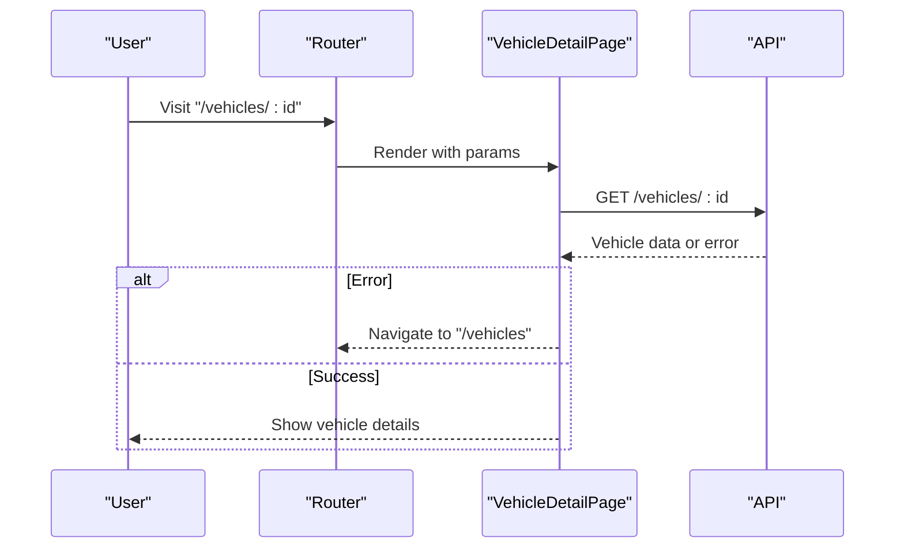
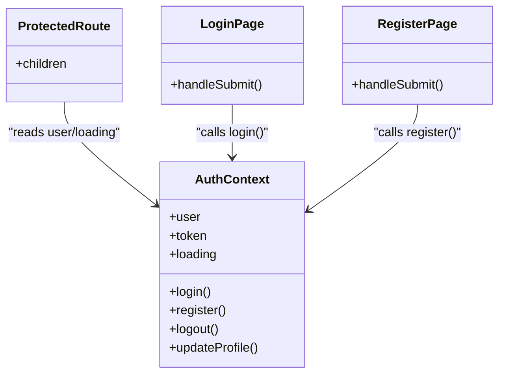
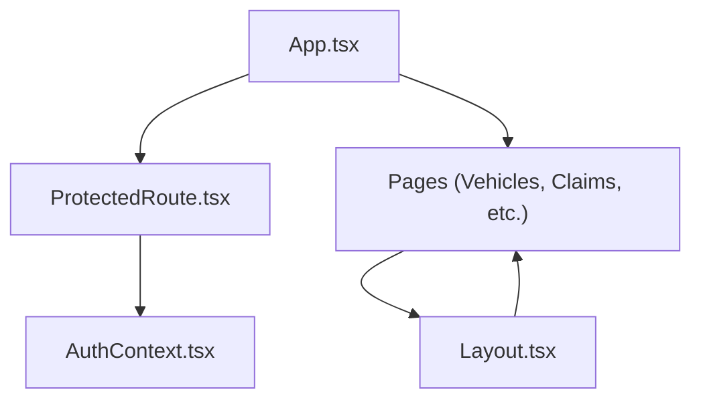

# Routing & Navigation

<cite>
**Referenced Files in This Document**
- [App.tsx](file://frontend/src/App.tsx)
- [ProtectedRoute.tsx](file://frontend/src/components/ProtectedRoute.tsx)
- [AuthContext.tsx](file://frontend/src/context/AuthContext.tsx)
- [Layout.tsx](file://frontend/src/components/Layout.tsx)
- [VehiclesPage.tsx](file://frontend/src/pages/VehiclesPage.tsx)
- [ClaimsPage.tsx](file://frontend/src/pages/ClaimsPage.tsx)
- [ClaimDetailPage.tsx](file://frontend/src/pages/ClaimDetailPage.tsx)
- [LoginPage.tsx](file://frontend/src/pages/LoginPage.tsx)
- [RegisterPage.tsx](file://frontend/src/pages/RegisterPage.tsx)
- [DashboardPage.tsx](file://frontend/src/pages/DashboardPage.tsx)
</cite>

## Table of Contents
1. Introduction
2. Project Structure
3. Core Components
4. Architecture Overview
5. Detailed Component Analysis
6. Dependency Analysis
7. Performance Considerations
8. Troubleshooting Guide
9. Conclusion

## Introduction
This document explains the routing and navigation system implemented with React Router in the Smart Vehicle Insurance Claim System. It covers public and protected routes, nested routing patterns for hierarchical data (vehicles and claims), programmatic navigation, route parameters, query strings, authentication integration via a context provider, and best practices for deep linking and browser history behavior.

## Project Structure
The application uses a single top-level router that declares all routes and wraps protected routes with an authorization guard. Public routes include login and register; all other routes are protected by a wrapper component that checks authentication state from a global context.

**Diagram sources**
- [App.tsx:17-33](file://frontend/src/App.tsx#L17-L33)
- [ProtectedRoute.tsx:4-19](file://frontend/src/components/ProtectedRoute.tsx#L4-L19)
- [Layout.tsx:14-149](file://frontend/src/components/Layout.tsx#L14-L149)

**Section sources**
- [App.tsx:17-33](file://frontend/src/App.tsx#L17-L33)

## Core Components
- Router configuration: Centralized in the app entry, declaring public and protected routes and a root redirect.
- Protected route guard: Wraps authenticated sections and redirects unauthenticated users to login.
- Authentication context: Provides user state, token persistence, and actions used by guards and pages.
- Layout: Shared shell with navigation links and active state based on current location.

Key responsibilities:
- App.tsx defines route paths and associates elements with each path.
- ProtectedRoute.tsx reads auth state and enforces access control.
- AuthContext.tsx manages login/register/logout and persists tokens.
- Layout.tsx renders sidebar navigation and highlights the active section using the current pathname.

**Section sources**
- [App.tsx:17-33](file://frontend/src/App.tsx#L17-L33)
- [ProtectedRoute.tsx:4-19](file://frontend/src/components/ProtectedRoute.tsx#L4-L19)
- [AuthContext.tsx:17-72](file://frontend/src/context/AuthContext.tsx#L17-L72)
- [Layout.tsx:14-149](file://frontend/src/components/Layout.tsx#L14-L149)

## Architecture Overview
The routing architecture separates concerns between route declaration, access control, and UI layout:

- BrowserRouter encapsulates the entire app and provides routing context.
- Routes are grouped into public and protected sets.
- Protected routes render a shared Layout that includes navigation and page content.
- Pages use React Router hooks for navigation and parameter handling.

**Diagram sources**
- [App.tsx:17-33](file://frontend/src/App.tsx#L17-L33)
- [ProtectedRoute.tsx:4-19](file://frontend/src/components/ProtectedRoute.tsx#L4-L19)
- [Layout.tsx:14-149](file://frontend/src/components/Layout.tsx#L14-L149)

## Detailed Component Analysis

### Route Configuration and Access Control
- Public routes:
  - Login and Register are accessible without authentication.
- Root redirect:
  - The root path redirects to the dashboard.
- Protected routes:
  - All feature routes are wrapped with the protected route component to enforce authentication.

Navigation behavior:
- Programmatic navigation after successful login or registration navigates to the dashboard.
- Protected routes redirect unauthenticated users back to login.

**Diagram sources**
- [App.tsx:20-31](file://frontend/src/App.tsx#L20-L31)
- [ProtectedRoute.tsx:4-19](file://frontend/src/components/ProtectedRoute.tsx#L4-L19)
- [LoginPage.tsx:14-26](file://frontend/src/pages/LoginPage.tsx#L14-L26)
- [RegisterPage.tsx:13-25](file://frontend/src/pages/RegisterPage.tsx#L13-L25)

**Section sources**
- [App.tsx:20-31](file://frontend/src/App.tsx#L20-L31)
- [ProtectedRoute.tsx:4-19](file://frontend/src/components/ProtectedRoute.tsx#L4-L19)
- [LoginPage.tsx:14-26](file://frontend/src/pages/LoginPage.tsx#L14-L26)
- [RegisterPage.tsx:13-25](file://frontend/src/pages/RegisterPage.tsx#L13-L25)

### Nested Routing Patterns for Hierarchical Data
- Vehicles:
  - List view at /vehicles.
  - Detail view at /vehicles/:id.
  - Add vehicle form at /vehicles/new.
- Claims:
  - List view at /claims.
  - New claim form at /claims/new.
  - Detail view at /claims/:id.

These routes demonstrate a consistent pattern: a collection route paired with a detail route using dynamic segments.

**Diagram sources**
- [App.tsx:24-30](file://frontend/src/App.tsx#L24-L30)

**Section sources**
- [App.tsx:24-30](file://frontend/src/App.tsx#L24-L30)

### Programmatic Navigation and Links
- Declarative navigation:
  - Link components are used throughout for static and dynamic URLs (e.g., navigating to vehicle details or claim details).
- Programmatic navigation:
  - useNavigate is used to navigate after form submissions or actions (e.g., after adding a vehicle or logging in).
- Back navigation:
  - Pages provide “Back” buttons that programmatically navigate to parent lists.

Examples in code:
- Navigating to a newly created resource’s detail page after submission.
- Redirecting to the dashboard after successful authentication.
- Returning to previous lists from detail views.

**Section sources**
- [VehiclesPage.tsx:127-138](file://frontend/src/pages/VehiclesPage.tsx#L127-L138)
- [VehiclesPage.tsx:66-71](file://frontend/src/pages/VehiclesPage.tsx#L66-L71)
- [LoginPage.tsx:14-26](file://frontend/src/pages/LoginPage.tsx#L14-L26)
- [RegisterPage.tsx:13-25](file://frontend/src/pages/RegisterPage.tsx#L13-L25)
- [ClaimDetailPage.tsx:84-86](file://frontend/src/pages/ClaimDetailPage.tsx#L84-L86)

### Route Parameters Handling
- Dynamic segments:
  - Vehicle detail uses a URL segment to identify the vehicle.
  - Claim detail uses a URL segment to identify the claim.
- Parameter usage:
  - Pages read parameters from the URL to fetch and display the correct resource.
  - If fetching fails, pages navigate back to their respective list views.

**Diagram sources**
- [VehiclesPage.tsx:56-64](file://frontend/src/pages/VehiclesPage.tsx#L56-L64)
- [ClaimDetailPage.tsx:7-25](file://frontend/src/pages/ClaimDetailPage.tsx#L7-L25)

**Section sources**
- [VehiclesPage.tsx:56-64](file://frontend/src/pages/VehiclesPage.tsx#L56-L64)
- [ClaimDetailPage.tsx:7-25](file://frontend/src/pages/ClaimDetailPage.tsx#L7-L25)

### Query String Management
- Filtering:
  - The claims list supports filtering by status via a query string parameter.
- Pre-population:
  - The new claim flow can be pre-populated with a vehicle identifier passed via query string from the vehicle detail page.

Behavior:
- Changing the filter updates the query string and triggers a re-fetch of claims.
- Passing a vehicleId in the query string allows the new claim form to target a specific vehicle.

**Section sources**
- [ClaimsPage.tsx:27-30](file://frontend/src/pages/ClaimsPage.tsx#L27-L30)
- [VehiclesPage.tsx:101-104](file://frontend/src/pages/VehiclesPage.tsx#L101-L104)

### Integration with Authentication Context
- Global auth state:
  - The context maintains user, token, and loading state, and exposes login, register, logout, and profile update functions.
- Route protection:
  - The protected route component reads the context to determine if a user is authenticated and shows a loading indicator while initializing auth state.
- Post-auth navigation:
  - After login or registration, the app navigates to the dashboard.

**Diagram sources**
- [AuthContext.tsx:5-13](file://frontend/src/context/AuthContext.tsx#L5-L13)
- [ProtectedRoute.tsx:4-19](file://frontend/src/components/ProtectedRoute.tsx#L4-L19)
- [LoginPage.tsx:14-26](file://frontend/src/pages/LoginPage.tsx#L14-L26)
- [RegisterPage.tsx:13-25](file://frontend/src/pages/RegisterPage.tsx#L13-L25)

**Section sources**
- [AuthContext.tsx:17-72](file://frontend/src/context/AuthContext.tsx#L17-L72)
- [ProtectedRoute.tsx:4-19](file://frontend/src/components/ProtectedRoute.tsx#L4-L19)
- [LoginPage.tsx:14-26](file://frontend/src/pages/LoginPage.tsx#L14-L26)
- [RegisterPage.tsx:13-25](file://frontend/src/pages/RegisterPage.tsx#L13-L25)

### Navigation State Preservation and Active States
- Active link highlighting:
  - The layout determines the active navigation item by comparing the current pathname with known paths.
- Sidebar and mobile navigation:
  - Both desktop and mobile navigation reflect the current route and allow quick switching.

**Section sources**
- [Layout.tsx:40-57](file://frontend/src/components/Layout.tsx#L40-L57)
- [Layout.tsx:112-130](file://frontend/src/components/Layout.tsx#L112-L130)
- [Layout.tsx:153-171](file://frontend/src/components/Layout.tsx#L153-L171)

### Deep Linking and Browser History
- Deep linking:
  - All feature routes are directly addressable via URLs, including dynamic segments for vehicles and claims.
- Browser history:
  - Navigation uses standard browser history APIs through React Router, enabling back/forward behavior and shareable URLs.
- Redirects:
  - The root path redirects to the dashboard, ensuring a consistent starting point.

**Section sources**
- [App.tsx:22-31](file://frontend/src/App.tsx#L22-L31)
- [VehiclesPage.tsx:35-48](file://frontend/src/pages/VehiclesPage.tsx#L35-L48)
- [ClaimsPage.tsx:64-92](file://frontend/src/pages/ClaimsPage.tsx#L64-L92)

### SEO Considerations
- Client-side routing:
  - Since this is a client-side SPA, search engine indexing depends on server rendering or prerendering strategies not shown here.
- Shareable URLs:
  - Deep links to vehicles and claims enable sharing and bookmarking, which improves discoverability when combined with SSR or static generation.

[No sources needed since this section provides general guidance]

### Lazy Loading Strategies for Code Splitting
- Current implementation:
  - Routes are imported directly in the router configuration.
- Recommendation:
  - For large applications, consider lazy-loading route components to reduce initial bundle size and improve load performance.

[No sources needed since this section provides general guidance]

## Dependency Analysis
The routing layer depends on:
- React Router for route matching and navigation.
- Authentication context for access control.
- Layout for shared UI and navigation.
- Pages for content and interactions.

**Diagram sources**
- [App.tsx:17-33](file://frontend/src/App.tsx#L17-L33)
- [ProtectedRoute.tsx:4-19](file://frontend/src/components/ProtectedRoute.tsx#L4-L19)
- [AuthContext.tsx:17-72](file://frontend/src/context/AuthContext.tsx#L17-L72)
- [Layout.tsx:14-149](file://frontend/src/components/Layout.tsx#L14-L149)

**Section sources**
- [App.tsx:17-33](file://frontend/src/App.tsx#L17-L33)
- [ProtectedRoute.tsx:4-19](file://frontend/src/components/ProtectedRoute.tsx#L4-L19)
- [AuthContext.tsx:17-72](file://frontend/src/context/AuthContext.tsx#L17-L72)
- [Layout.tsx:14-149](file://frontend/src/components/Layout.tsx#L14-L149)

## Performance Considerations
- Initial load:
  - All routes are bundled together; consider lazy loading for large pages to reduce initial payload.
- Navigation transitions:
  - Use declarative Link components where possible to avoid unnecessary re-renders.
- Data fetching:
  - Fetch data only when necessary and handle errors gracefully to prevent navigation loops.

[No sources needed since this section provides general guidance]

## Troubleshooting Guide
Common issues and resolutions:
- Redirect loops:
  - Ensure the protected route correctly handles loading states and does not redirect before auth initialization completes.
- Incorrect parameter parsing:
  - Verify that dynamic segments match route definitions and that pages read parameters consistently.
- Query string mismatches:
  - Confirm that filters and pre-population logic parse query parameters accurately.

**Section sources**
- [ProtectedRoute.tsx:4-19](file://frontend/src/components/ProtectedRoute.tsx#L4-L19)
- [VehiclesPage.tsx:56-64](file://frontend/src/pages/VehiclesPage.tsx#L56-L64)
- [ClaimsPage.tsx:27-30](file://frontend/src/pages/ClaimsPage.tsx#L27-L30)

## Conclusion
The routing system uses a clear separation between public and protected routes, centralized route configuration, and a robust authentication guard. It supports nested routing for vehicles and claims, programmatic navigation, and query-based filtering. While the current setup imports routes directly, adopting lazy loading can further optimize performance. Deep linking and standard browser history behavior ensure shareable and navigable URLs across the application.