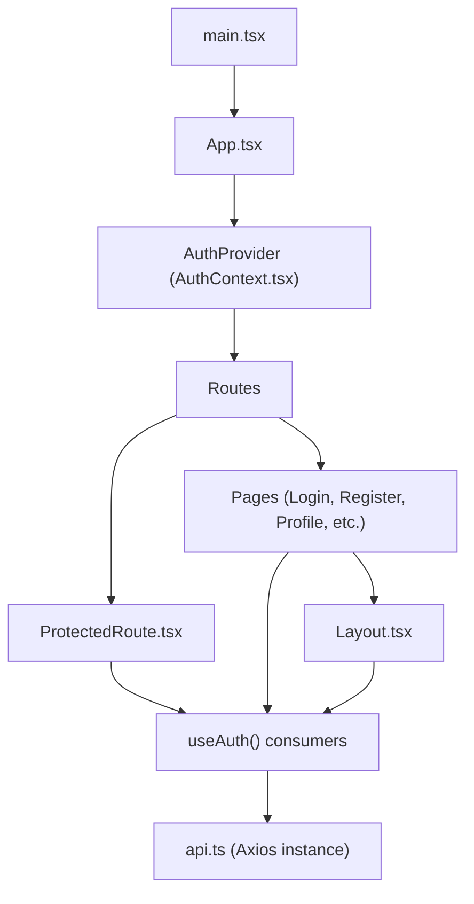
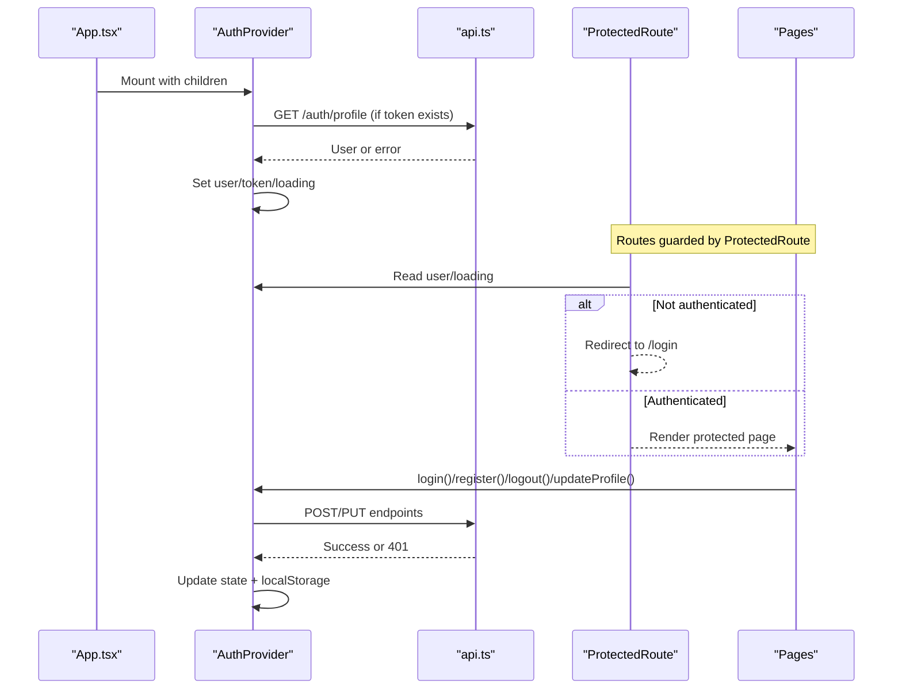
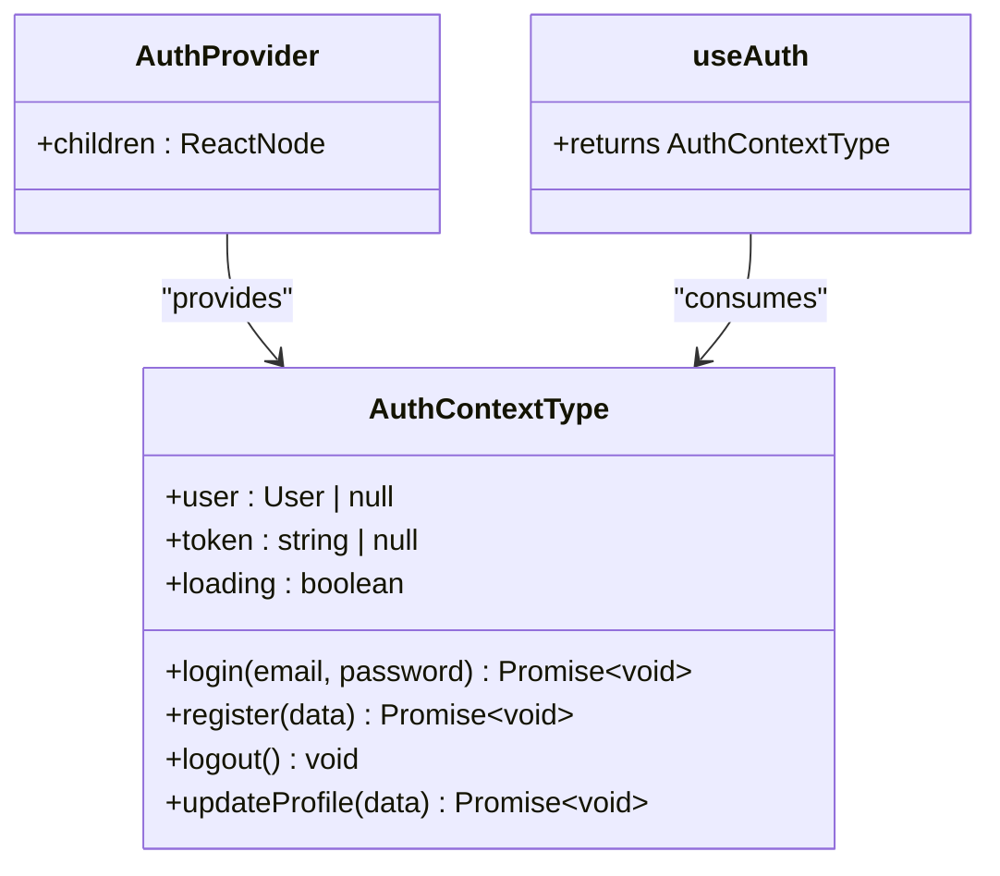
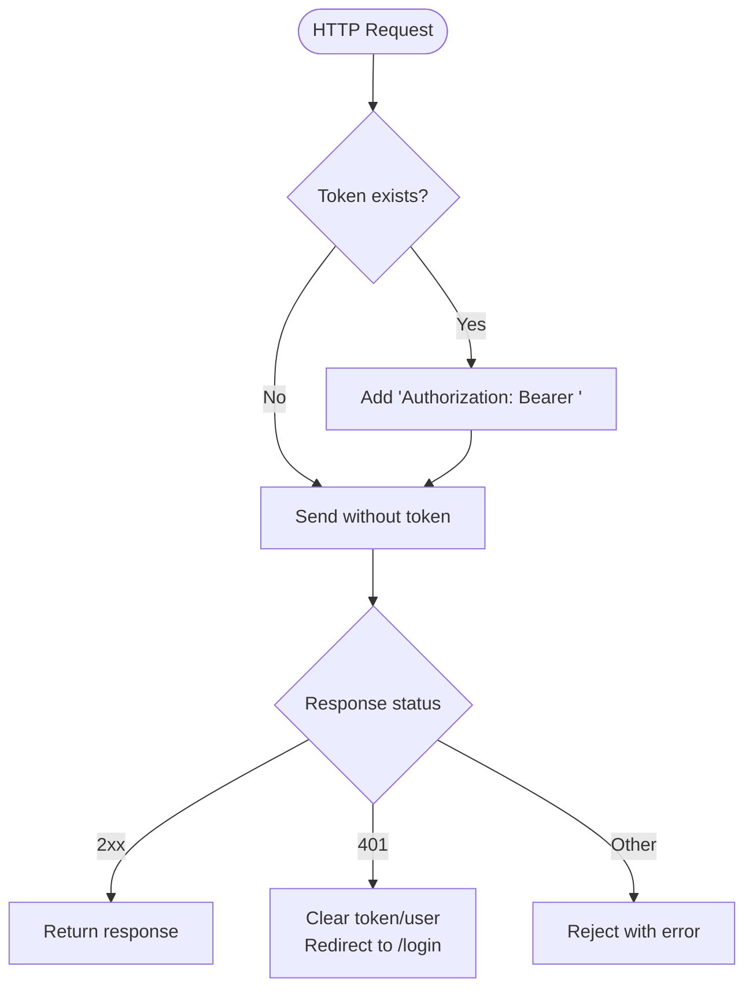
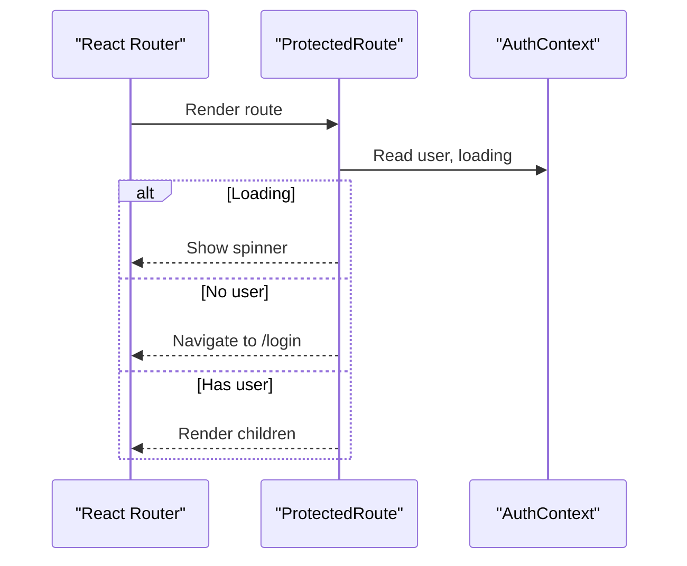
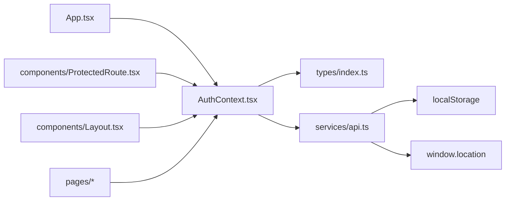
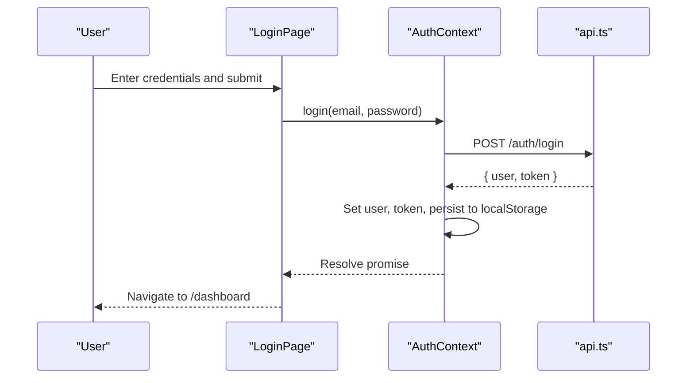
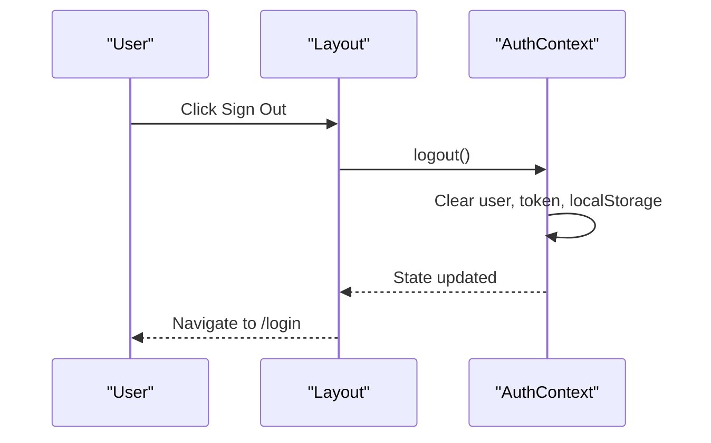

# State Management

<cite>
**Referenced Files in This Document**
- [AuthContext.tsx](file://frontend/src/context/AuthContext.tsx)
- [api.ts](file://frontend/src/services/api.ts)
- [index.ts](file://frontend/src/types/index.ts)
- [App.tsx](file://frontend/src/App.tsx)
- [ProtectedRoute.tsx](file://frontend/src/components/ProtectedRoute.tsx)
- [Layout.tsx](file://frontend/src/components/Layout.tsx)
- [LoginPage.tsx](file://frontend/src/pages/LoginPage.tsx)
- [RegisterPage.tsx](file://frontend/src/pages/RegisterPage.tsx)
- [ProfilePage.tsx](file://frontend/src/pages/ProfilePage.tsx)
</cite>

## Table of Contents
1. [Introduction](#introduction)
2. [Project Structure](#project-structure)
3. [Core Components](#core-components)
4. [Architecture Overview](#architecture-overview)
5. [Detailed Component Analysis](#detailed-component-analysis)
6. [Dependency Analysis](#dependency-analysis)
7. [Performance Considerations](#performance-considerations)
8. [Troubleshooting Guide](#troubleshooting-guide)
9. [Conclusion](#conclusion)
10. [Appendices](#appendices)

## Introduction
This document explains the state management implementation for authentication using React Context API in the Smart Vehicle Insurance Claim System. It covers how user session state, login status, and profile information are maintained globally, how they are synchronized with the backend, and how components consume and update this state safely and efficiently. It also includes best practices to avoid unnecessary re-renders, strategies for type safety with TypeScript, and debugging techniques for complex flows.

## Project Structure
The authentication state is centralized in a single context provider and consumed across protected routes and UI components. The application bootstraps the provider at the root level so all pages can access authenticated state consistently.

**Diagram sources**
- [App.tsx:15-35](file://frontend/src/App.tsx#L15-L35)
- [AuthContext.tsx:17-73](file://frontend/src/context/AuthContext.tsx#L17-L73)
- [ProtectedRoute.tsx:4-20](file://frontend/src/components/ProtectedRoute.tsx#L4-L20)
- [Layout.tsx:14-23](file://frontend/src/components/Layout.tsx#L14-L23)
- [api.ts:1-33](file://frontend/src/services/api.ts#L1-L33)

**Section sources**
- [App.tsx:15-35](file://frontend/src/App.tsx#L15-L35)
- [AuthContext.tsx:17-73](file://frontend/src/context/AuthContext.tsx#L17-L73)

## Core Components
- AuthContextProvider: Holds global state for user, token, loading, and exposes actions for login, register, logout, and profile updates. It initializes from persisted token and validates it on mount.
- useAuth hook: Provides typed access to the context with runtime guard to ensure usage inside a provider.
- ProtectedRoute: Guards routes based on authentication state and loading.
- Layout: Displays user info and triggers logout.
- Pages: Login, Register, and Profile consume auth actions and display feedback.
- api: Axios instance that injects Authorization header and handles 401 by clearing local storage and redirecting to login.

Key responsibilities:
- Centralized state ownership in AuthContext
- Synchronization with backend via api
- Persistence via localStorage for token and user
- Type safety through shared TypeScript interfaces

**Section sources**
- [AuthContext.tsx:5-81](file://frontend/src/context/AuthContext.tsx#L5-L81)
- [ProtectedRoute.tsx:4-20](file://frontend/src/components/ProtectedRoute.tsx#L4-L20)
- [Layout.tsx:14-23](file://frontend/src/components/Layout.tsx#L14-L23)
- [LoginPage.tsx:6-27](file://frontend/src/pages/LoginPage.tsx#L6-L27)
- [RegisterPage.tsx:6-26](file://frontend/src/pages/RegisterPage.tsx#L6-L26)
- [ProfilePage.tsx:5-28](file://frontend/src/pages/ProfilePage.tsx#L5-L28)
- [api.ts:10-30](file://frontend/src/services/api.ts#L10-L30)
- [index.ts:1-149](file://frontend/src/types/index.ts#L1-L149)

## Architecture Overview
The authentication flow uses React Context as the single source of truth for user session state. On app start, the provider checks for an existing token and fetches the current profile if present. Subsequent actions (login/register/logout/updateProfile) update both in-memory state and persistent storage. Protected routes prevent unauthenticated access, while layout and pages consume the context to render UI and trigger actions.

**Diagram sources**
- [AuthContext.tsx:22-66](file://frontend/src/context/AuthContext.tsx#L22-L66)
- [ProtectedRoute.tsx:4-20](file://frontend/src/components/ProtectedRoute.tsx#L4-L20)
- [api.ts:10-30](file://frontend/src/services/api.ts#L10-L30)
- [App.tsx:15-35](file://frontend/src/App.tsx#L15-L35)

## Detailed Component Analysis

### Authentication Context (AuthProvider and useAuth)
- State model: user, token, loading
- Initialization: Reads token from localStorage; if present, fetches profile to validate session and populate user
- Actions:
  - login(email, password): authenticates, sets user and token, persists token and user
  - register(data): creates account, sets user and token, persists token and user
  - logout(): clears user, token, and local storage
  - updateProfile(data): updates server-side profile and refreshes user in memory
- Consumer pattern: useAuth returns typed context with a guard to ensure usage within provider

**Diagram sources**
- [AuthContext.tsx:5-81](file://frontend/src/context/AuthContext.tsx#L5-L81)

**Section sources**
- [AuthContext.tsx:5-81](file://frontend/src/context/AuthContext.tsx#L5-L81)

### API Interceptors and Error Handling
- Request interceptor: Attaches Authorization header using stored token
- Response interceptor: On 401, clears token and user from localStorage and redirects to login
- Base URL configured for relative API calls

**Diagram sources**
- [api.ts:10-30](file://frontend/src/services/api.ts#L10-L30)

**Section sources**
- [api.ts:1-33](file://frontend/src/services/api.ts#L1-L33)

### Protected Route Guard
- Renders a loading indicator while auth initializes
- Redirects unauthenticated users to login
- Renders protected content when authenticated

**Diagram sources**
- [ProtectedRoute.tsx:4-20](file://frontend/src/components/ProtectedRoute.tsx#L4-L20)

**Section sources**
- [ProtectedRoute.tsx:4-20](file://frontend/src/components/ProtectedRoute.tsx#L4-L20)

### Layout Integration
- Displays current user’s initials and name/email
- Triggers logout and navigates to login on sign out

**Section sources**
- [Layout.tsx:14-23](file://frontend/src/components/Layout.tsx#L14-L23)

### Page-Level Usage Examples
- LoginPage: Calls login, navigates to dashboard on success, shows errors
- RegisterPage: Calls register, navigates to dashboard on success, shows errors
- ProfilePage: Initializes form from user, calls updateProfile, shows success/error states

**Section sources**
- [LoginPage.tsx:6-27](file://frontend/src/pages/LoginPage.tsx#L6-L27)
- [RegisterPage.tsx:6-26](file://frontend/src/pages/RegisterPage.tsx#L6-L26)
- [ProfilePage.tsx:5-28](file://frontend/src/pages/ProfilePage.tsx#L5-L28)

## Dependency Analysis
- App wraps all routes with AuthProvider, making context available globally
- ProtectedRoute depends on AuthContext to enforce access control
- Pages and Layout depend on AuthContext for user data and actions
- AuthContext depends on api for network operations and types for shape validation
- api depends on localStorage for token persistence and window navigation for redirects

**Diagram sources**
- [App.tsx:15-35](file://frontend/src/App.tsx#L15-L35)
- [AuthContext.tsx:17-73](file://frontend/src/context/AuthContext.tsx#L17-L73)
- [ProtectedRoute.tsx:4-20](file://frontend/src/components/ProtectedRoute.tsx#L4-L20)
- [Layout.tsx:14-23](file://frontend/src/components/Layout.tsx#L14-L23)
- [api.ts:10-30](file://frontend/src/services/api.ts#L10-L30)
- [index.ts:1-149](file://frontend/src/types/index.ts#L1-L149)

**Section sources**
- [App.tsx:15-35](file://frontend/src/App.tsx#L15-L35)
- [AuthContext.tsx:17-73](file://frontend/src/context/AuthContext.tsx#L17-L73)
- [ProtectedRoute.tsx:4-20](file://frontend/src/components/ProtectedRoute.tsx#L4-L20)
- [Layout.tsx:14-23](file://frontend/src/components/Layout.tsx#L14-L23)
- [api.ts:10-30](file://frontend/src/services/api.ts#L10-L30)
- [index.ts:1-149](file://frontend/src/types/index.ts#L1-L149)

## Performance Considerations
- Avoid unnecessary re-renders:
  - Memoize derived values in consuming components using useMemo where appropriate
  - Use stable function references for callbacks passed to child components (e.g., memoize handlers)
  - Prefer selective consumption: only read needed fields from context in deeply nested components
- Minimize context size:
  - Keep context value minimal; consider splitting contexts if state grows large
  - Defer heavy computations off the critical path
- Network efficiency:
  - Leverage axios interceptors to centralize token handling and error responses
  - Avoid redundant profile fetches; rely on provider initialization and successful mutations
- Persistence strategy:
  - Persist only necessary items (token and user) to reduce storage overhead
  - Ensure cleanup on logout to prevent stale state

[No sources needed since this section provides general guidance]

## Troubleshooting Guide
Common issues and resolutions:
- Token invalid or expired:
  - The API interceptor clears token and user on 401 and redirects to login
  - Verify that tokens are correctly set during login/register and removed on logout
- Uninitialized loading state:
  - ProtectedRoute shows a spinner until auth initializes; ensure provider mounts before rendering protected routes
- Profile not updating:
  - updateProfile updates local user state after successful PUT; verify server response shape matches types
- Navigation loops:
  - Ensure ProtectedRoute logic runs after loading completes to avoid premature redirects

Debugging tips:
- Inspect localStorage for token and user entries
- Check browser network tab for requests to /auth endpoints
- Add console logs around context actions to trace state transitions
- Validate types by ensuring server responses conform to defined interfaces

**Section sources**
- [api.ts:19-30](file://frontend/src/services/api.ts#L19-L30)
- [ProtectedRoute.tsx:4-20](file://frontend/src/components/ProtectedRoute.tsx#L4-L20)
- [AuthContext.tsx:22-66](file://frontend/src/context/AuthContext.tsx#L22-L66)

## Conclusion
The Smart Vehicle Insurance Claim System implements a robust authentication state management layer using React Context API. The AuthProvider centralizes user session state, synchronizes with the backend, and persists essential data for resilience. Protected routes enforce access control, while pages and layout consume context to deliver a cohesive user experience. With careful attention to performance, type safety, and error handling, the system maintains predictable and efficient state flows throughout the application lifecycle.

[No sources needed since this section summarizes without analyzing specific files]

## Appendices

### Data Models and Type Safety
- Shared TypeScript interfaces define shapes for User, AuthResponse, and related entities, ensuring compile-time safety across context and API layers.

**Section sources**
- [index.ts:1-149](file://frontend/src/types/index.ts#L1-L149)

### Example Flows

#### Login Flow

**Diagram sources**
- [LoginPage.tsx:14-27](file://frontend/src/pages/LoginPage.tsx#L14-L27)
- [AuthContext.tsx:38-45](file://frontend/src/context/AuthContext.tsx#L38-L45)
- [api.ts:10-17](file://frontend/src/services/api.ts#L10-L17)

#### Logout Flow

**Diagram sources**
- [Layout.tsx:20-23](file://frontend/src/components/Layout.tsx#L20-L23)
- [AuthContext.tsx:56-61](file://frontend/src/context/AuthContext.tsx#L56-L61)