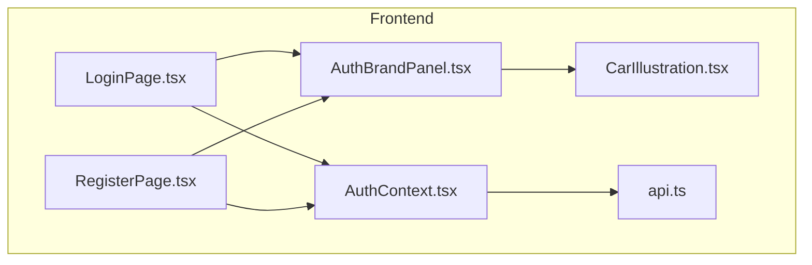
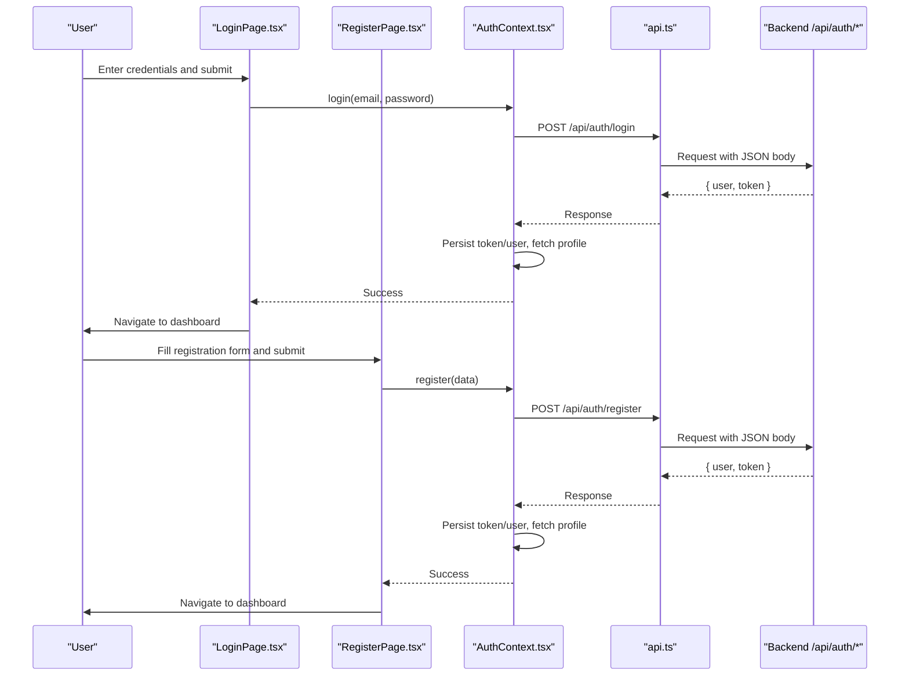
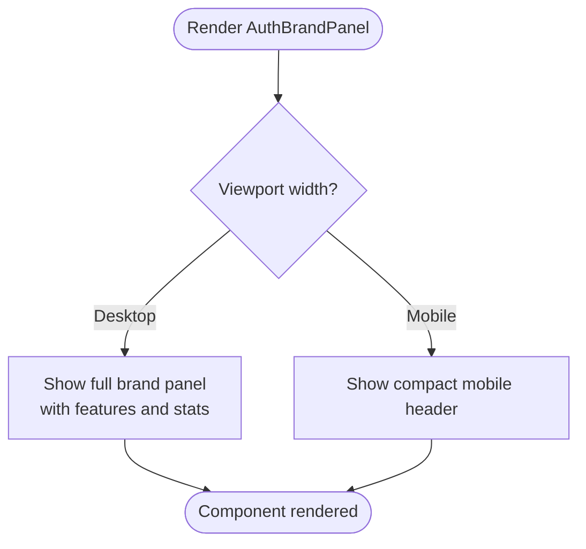
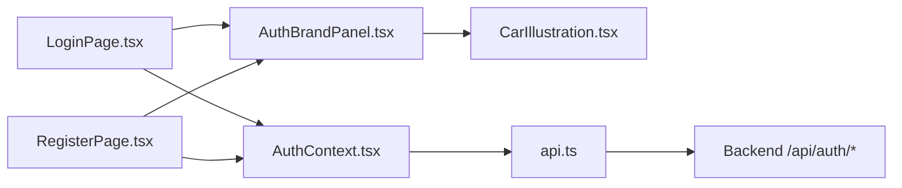

# Auth Brand Panel Component

<cite>
**Referenced Files in This Document**
- [AuthBrandPanel.tsx](file://frontend/src/components/AuthBrandPanel.tsx)
- [CarIllustration.tsx](file://frontend/src/components/CarIllustration.tsx)
- [LoginPage.tsx](file://frontend/src/pages/LoginPage.tsx)
- [RegisterPage.tsx](file://frontend/src/pages/RegisterPage.tsx)
- [AuthContext.tsx](file://frontend/src/context/AuthContext.tsx)
- [api.ts](file://frontend/src/services/api.ts)
- [index.ts (types)](file://frontend/src/types/index.ts)
- [auth.ts (backend)](file://backend/src/routes/auth.ts)
</cite>

## Table of Contents
1. [Introduction](#introduction)
2. [Project Structure](#project-structure)
3. [Core Components](#core-components)
4. [Architecture Overview](#architecture-overview)
5. [Detailed Component Analysis](#detailed-component-analysis)
6. [Dependency Analysis](#dependency-analysis)
7. [Performance Considerations](#performance-considerations)
8. [Troubleshooting Guide](#troubleshooting-guide)
9. [Conclusion](#conclusion)

## Introduction
This document explains the Auth Brand Panel component and its role within the Smart Vehicle Insurance Claim System’s frontend. The component provides a consistent, branded visual panel for user-facing authentication pages (Login and Register). It includes a desktop split-screen brand area and a compact mobile header to maintain visual identity across devices. It is paired with the application’s authentication context and API layer to deliver a cohesive sign-in/sign-up experience.

## Project Structure
The Auth Brand Panel lives under the frontend components directory and is reused by both Login and Register pages. It depends on a shared car illustration component and uses Tailwind utility classes for styling. Authentication state and network requests are handled by a React context and an Axios-based API client that manages tokens and redirects on 401 responses.

**Diagram sources**
- [LoginPage.tsx:31-37](file://frontend/src/pages/LoginPage.tsx#L31-L37)
- [RegisterPage.tsx:35-42](file://frontend/src/pages/RegisterPage.tsx#L35-L42)
- [AuthBrandPanel.tsx:1-103](file://frontend/src/components/AuthBrandPanel.tsx#L1-L103)
- [CarIllustration.tsx:1-45](file://frontend/src/components/CarIllustration.tsx#L1-L45)
- [AuthContext.tsx:1-101](file://frontend/src/context/AuthContext.tsx#L1-L101)
- [api.ts:1-40](file://frontend/src/services/api.ts#L1-L40)

**Section sources**
- [AuthBrandPanel.tsx:1-103](file://frontend/src/components/AuthBrandPanel.tsx#L1-L103)
- [LoginPage.tsx:1-129](file://frontend/src/pages/LoginPage.tsx#L1-L129)
- [RegisterPage.tsx:1-133](file://frontend/src/pages/RegisterPage.tsx#L1-L133)

## Core Components
- AuthBrandPanel: Renders the branded side panel for desktop and a compact mobile header. Includes feature highlights, trust stats, and a car illustration.
- CarIllustration: Reusable SVG illustration used consistently across auth and dashboard areas.
- LoginPage and RegisterPage: Compose the AuthBrandPanel and handle form submission via AuthContext.
- AuthContext: Provides login/register/logout/profile update methods, persists token/user, and fetches full profile after auth.
- api.ts: Centralized Axios instance that attaches Authorization headers and handles 401 redirects.

Key responsibilities:
- Visual consistency across auth flows
- Responsive layout (desktop split-screen vs mobile header)
- Integration with authentication flow without handling business logic

**Section sources**
- [AuthBrandPanel.tsx:1-103](file://frontend/src/components/AuthBrandPanel.tsx#L1-L103)
- [CarIllustration.tsx:1-45](file://frontend/src/components/CarIllustration.tsx#L1-L45)
- [LoginPage.tsx:1-129](file://frontend/src/pages/LoginPage.tsx#L1-L129)
- [RegisterPage.tsx:1-133](file://frontend/src/pages/RegisterPage.tsx#L1-L133)
- [AuthContext.tsx:1-101](file://frontend/src/context/AuthContext.tsx#L1-L101)
- [api.ts:1-40](file://frontend/src/services/api.ts#L1-L40)

## Architecture Overview
The auth UI architecture centers around reusable branding and a centralized auth context. Pages compose the brand panel and delegate authentication actions to the context, which communicates with the backend via the API client.

**Diagram sources**
- [LoginPage.tsx:15-28](file://frontend/src/pages/LoginPage.tsx#L15-L28)
- [RegisterPage.tsx:15-27](file://frontend/src/pages/RegisterPage.tsx#L15-L27)
- [AuthContext.tsx:47-73](file://frontend/src/context/AuthContext.tsx#L47-L73)
- [api.ts:11-24](file://frontend/src/services/api.ts#L11-L24)
- [auth.ts:11-67](file://backend/src/routes/auth.ts#L11-L67)
- [auth.ts:69-113](file://backend/src/routes/auth.ts#L69-L113)

## Detailed Component Analysis

### AuthBrandPanel
- Purpose: Provide a consistent, branded visual panel for user authentication screens.
- Desktop behavior: Displays a gradient background, subtle dot pattern overlay, brand logo/title, headline copy, car illustration, feature list, and trust stats. Hidden on small screens.
- Mobile behavior: Exposes a compact header above forms to preserve branding on narrow viewports.
- Dependencies: Uses icons from a UI icon library and the shared CarIllustration component.
- Styling approach: Tailwind utility classes for responsive design, gradients, spacing, and typography.

**Diagram sources**
- [AuthBrandPanel.tsx:13-88](file://frontend/src/components/AuthBrandPanel.tsx#L13-L88)
- [AuthBrandPanel.tsx:91-102](file://frontend/src/components/AuthBrandPanel.tsx#L91-L102)

**Section sources**
- [AuthBrandPanel.tsx:1-103](file://frontend/src/components/AuthBrandPanel.tsx#L1-L103)

### CarIllustration
- Purpose: Shared decorative SVG illustration to reinforce brand identity across auth and dashboard sections.
- Usage: Imported by AuthBrandPanel and other UI areas to maintain consistent visuals.

**Section sources**
- [CarIllustration.tsx:1-45](file://frontend/src/components/CarIllustration.tsx#L1-L45)

### LoginPage integration
- Composes AuthBrandPanel and AuthMobileBrand.
- Handles email/password input, error display, loading state, and navigation upon successful login via AuthContext.

**Section sources**
- [LoginPage.tsx:1-129](file://frontend/src/pages/LoginPage.tsx#L1-L129)

### RegisterPage integration
- Composes AuthBrandPanel and AuthMobileBrand.
- Manages multi-field registration form, validation feedback, loading state, and navigation upon success via AuthContext.

**Section sources**
- [RegisterPage.tsx:1-133](file://frontend/src/pages/RegisterPage.tsx#L1-L133)

### AuthContext integration
- Provides login/register functions that call the backend endpoints and persist session data.
- Fetches full user profile after authentication to keep UI state consistent.
- Handles logout by clearing persisted state.

**Section sources**
- [AuthContext.tsx:1-101](file://frontend/src/context/AuthContext.tsx#L1-L101)

### API client behavior
- Attaches Authorization header using stored token.
- Automatically clears token/user and redirects to login on 401 responses.
- Ensures correct Content-Type for JSON and FormData.

**Section sources**
- [api.ts:1-40](file://frontend/src/services/api.ts#L1-L40)

## Dependency Analysis
The Auth Brand Panel has minimal direct dependencies but is part of a broader auth flow:

**Diagram sources**
- [LoginPage.tsx:31-37](file://frontend/src/pages/LoginPage.tsx#L31-L37)
- [RegisterPage.tsx:35-42](file://frontend/src/pages/RegisterPage.tsx#L35-L42)
- [AuthBrandPanel.tsx:1-103](file://frontend/src/components/AuthBrandPanel.tsx#L1-L103)
- [CarIllustration.tsx:1-45](file://frontend/src/components/CarIllustration.tsx#L1-L45)
- [AuthContext.tsx:1-101](file://frontend/src/context/AuthContext.tsx#L1-L101)
- [api.ts:1-40](file://frontend/src/services/api.ts#L1-L40)
- [auth.ts:11-113](file://backend/src/routes/auth.ts#L11-L113)

**Section sources**
- [AuthBrandPanel.tsx:1-103](file://frontend/src/components/AuthBrandPanel.tsx#L1-L103)
- [AuthContext.tsx:1-101](file://frontend/src/context/AuthContext.tsx#L1-L101)
- [api.ts:1-40](file://frontend/src/services/api.ts#L1-L40)
- [auth.ts:11-113](file://backend/src/routes/auth.ts#L11-L113)

## Performance Considerations
- Rendering efficiency: The brand panel is static content; it does not trigger re-renders during form interactions.
- Network calls: AuthContext performs one additional profile fetch after login/register to enrich user state; this is lightweight and improves UI consistency.
- Token handling: The API client centralizes token attachment and 401 handling, reducing redundant checks in components.
- Image assets: The car illustration is an inline SVG, avoiding extra HTTP requests and ensuring crisp rendering at any scale.

[No sources needed since this section provides general guidance]

## Troubleshooting Guide
Common issues and resolutions related to the auth flow and brand panel usage:

- Invalid credentials or server errors during login/register:
  - Symptoms: Error message displayed on the form.
  - Resolution: Verify backend availability and credentials; check network tab for response details.
  - Relevant code paths: Form submission handlers and error display in pages; backend validation and error responses.

- Unauthorized redirect loop:
  - Symptoms: Automatic redirect to login after navigating to protected routes.
  - Cause: Expired or missing token; API client clears storage and redirects on 401.
  - Resolution: Ensure token persistence and re-authentication; verify environment configuration for API base URL.

- Inconsistent user data after login/register:
  - Symptom: Partial user info shown until refresh.
  - Cause: Initial response may be minimal; AuthContext fetches full profile afterward.
  - Resolution: Rely on AuthContext; avoid assuming immediate full profile availability.

- Mobile branding not visible:
  - Symptom: Missing brand header on small screens.
  - Cause: Incorrect viewport or CSS class misconfiguration.
  - Resolution: Confirm responsive breakpoints and ensure AuthMobileBrand is included in page layouts.

**Section sources**
- [LoginPage.tsx:15-28](file://frontend/src/pages/LoginPage.tsx#L15-L28)
- [RegisterPage.tsx:15-27](file://frontend/src/pages/RegisterPage.tsx#L15-L27)
- [AuthContext.tsx:22-36](file://frontend/src/context/AuthContext.tsx#L22-L36)
- [api.ts:26-37](file://frontend/src/services/api.ts#L26-L37)
- [auth.ts:11-67](file://backend/src/routes/auth.ts#L11-L67)
- [auth.ts:69-113](file://backend/src/routes/auth.ts#L69-L113)

## Conclusion
The Auth Brand Panel component delivers a consistent, responsive brand experience for user authentication flows while remaining decoupled from authentication logic. It integrates cleanly with the AuthContext and API client to support seamless login and registration experiences. Its modular design allows reuse across multiple pages and ensures visual coherence throughout the application.

[No sources needed since this section summarizes without analyzing specific files]