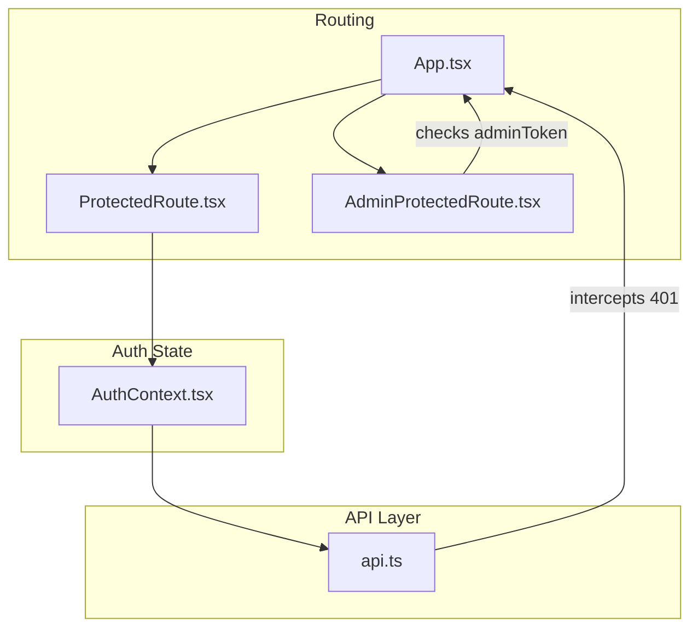
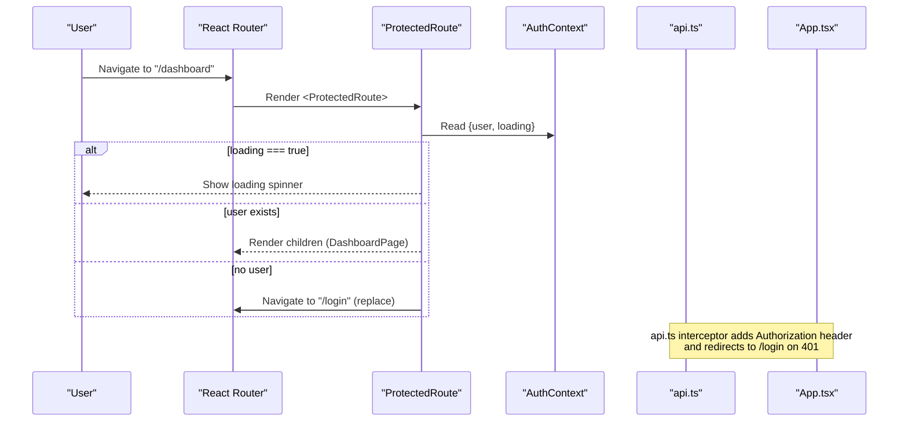
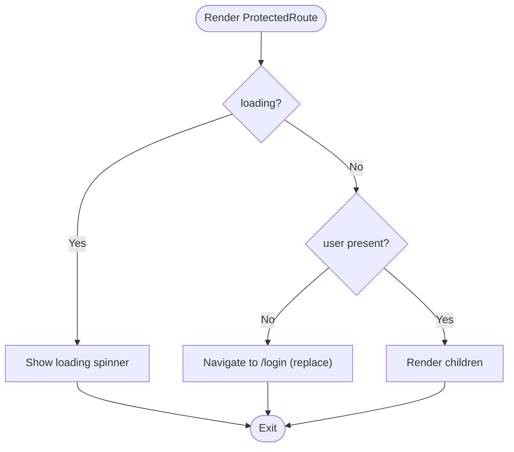
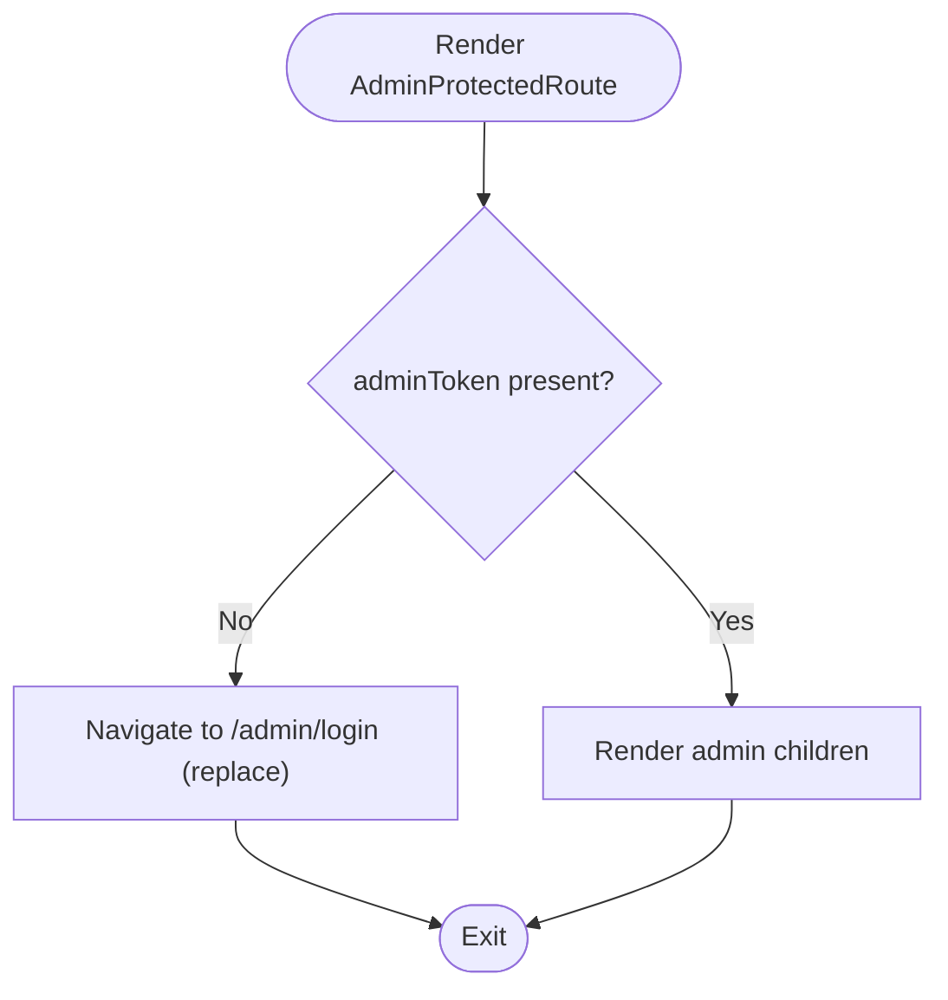

# Authentication Routes

<cite>
**Referenced Files in This Document**
- [ProtectedRoute.tsx](file://frontend/src/components/ProtectedRoute.tsx)
- [AdminProtectedRoute.tsx](file://frontend/src/components/AdminProtectedRoute.tsx)
- [AuthContext.tsx](file://frontend/src/context/AuthContext.tsx)
- [App.tsx](file://frontend/src/App.tsx)
- [api.ts](file://frontend/src/services/api.ts)
- [index.ts (types)](file://frontend/src/types/index.ts)
- [LoginPage.tsx](file://frontend/src/pages/LoginPage.tsx)
- [AdminLoginPage.tsx](file://frontend/src/pages/admin/AdminLoginPage.tsx)
</cite>

## Table of Contents
1. Introduction
2. Project Structure
3. Core Components
4. Architecture Overview
5. Detailed Component Analysis
6. Dependency Analysis
7. Performance Considerations
8. Troubleshooting Guide
9. Conclusion
10. Appendices

## Introduction
This document explains how the application protects routes based on user authentication and roles using two route guards:
- ProtectedRoute for regular users
- AdminProtectedRoute for administrative access

It covers how these components integrate with AuthContext, handle loading states, implement redirect logic, and manage errors. It also provides usage examples, custom props interfaces, and best practices for role-based routing in React applications.

## Project Structure
The authentication routing is implemented in the frontend under src/components and integrated via React Router in App.tsx. The AuthContext manages user state and token lifecycle, while API interceptors enforce session validity.



**Diagram sources**
- [App.tsx:23-50](file://frontend/src/App.tsx#L23-L50)
- [ProtectedRoute.tsx:1-21](file://frontend/src/components/ProtectedRoute.tsx#L1-L21)
- [AdminProtectedRoute.tsx:1-8](file://frontend/src/components/AdminProtectedRoute.tsx#L1-L8)
- [AuthContext.tsx:1-82](file://frontend/src/context/AuthContext.tsx#L1-L82)
- [api.ts:1-40](file://frontend/src/services/api.ts#L1-L40)

**Section sources**
- [App.tsx:23-50](file://frontend/src/App.tsx#L23-L50)
- [ProtectedRoute.tsx:1-21](file://frontend/src/components/ProtectedRoute.tsx#L1-L21)
- [AdminProtectedRoute.tsx:1-8](file://frontend/src/components/AdminProtectedRoute.tsx#L1-L8)
- [AuthContext.tsx:1-82](file://frontend/src/context/AuthContext.tsx#L1-L82)
- [api.ts:1-40](file://frontend/src/services/api.ts#L1-L40)

## Core Components
- ProtectedRoute: Guards regular user routes by checking authenticated user from AuthContext. Shows a loading spinner while auth state initializes and redirects unauthenticated users to /login.
- AdminProtectedRoute: Guards admin routes by checking for an admin token stored in localStorage. Redirects to /admin/login if missing.

Key behaviors:
- Loading state handling in ProtectedRoute prevents UI flicker during initial auth check.
- Redirect logic uses react-router-dom’s Navigate component with replace to avoid history stack buildup.
- AdminProtectedRoute relies on a separate admin session mechanism (adminToken).

**Section sources**
- [ProtectedRoute.tsx:1-21](file://frontend/src/components/ProtectedRoute.tsx#L1-L21)
- [AdminProtectedRoute.tsx:1-8](file://frontend/src/components/AdminProtectedRoute.tsx#L1-L8)

## Architecture Overview
The routing architecture combines React Router with context-driven authentication and API-level session enforcement.



**Diagram sources**
- [ProtectedRoute.tsx:1-21](file://frontend/src/components/ProtectedRoute.tsx#L1-L21)
- [AuthContext.tsx:17-36](file://frontend/src/context/AuthContext.tsx#L17-L36)
- [api.ts:11-37](file://frontend/src/services/api.ts#L11-L37)
- [App.tsx:23-50](file://frontend/src/App.tsx#L23-L50)

## Detailed Component Analysis

### ProtectedRoute
Responsibilities:
- Access AuthContext to read user and loading state.
- While loading is true, render a centered spinner to indicate initialization.
- If no authenticated user, redirect to /login using Replace navigation.
- Otherwise, render the protected child routes.

Integration points:
- Uses useAuth hook from AuthContext.
- Relies on react-router-dom’s Navigate for redirection.

Usage example:
- Wrap any user-only route with ProtectedRoute in App.tsx to ensure only authenticated users can access it.

Props interface:
- children: React.ReactNode

Behavioral flow:


**Diagram sources**
- [ProtectedRoute.tsx:4-19](file://frontend/src/components/ProtectedRoute.tsx#L4-L19)

**Section sources**
- [ProtectedRoute.tsx:1-21](file://frontend/src/components/ProtectedRoute.tsx#L1-L21)

### AdminProtectedRoute
Responsibilities:
- Check for adminToken in localStorage.
- If absent, redirect to /admin/login using Replace navigation.
- If present, render protected admin children.

Integration points:
- Directly reads localStorage; does not depend on AuthContext.
- Used in App.tsx to protect admin routes.

Usage example:
- Wrap admin routes with AdminProtectedRoute in App.tsx to restrict access to administrators.

Props interface:
- children: React.ReactNode

Behavioral flow:


**Diagram sources**
- [AdminProtectedRoute.tsx:3-6](file://frontend/src/components/AdminProtectedRoute.tsx#L3-L6)

**Section sources**
- [AdminProtectedRoute.tsx:1-8](file://frontend/src/components/AdminProtectedRoute.tsx#L1-L8)

### AuthContext Integration
AuthContext provides:
- user, token, and loading state.
- login, register, logout, updateProfile methods.
- Automatic initialization: if a token exists in localStorage, it fetches the profile to validate the session.

How ProtectedRoute uses it:
- Reads user and loading to decide whether to show a spinner or redirect.

Error handling:
- On invalid/expired token, the API interceptor clears tokens and navigates to /login, ensuring consistent session management.

**Section sources**
- [AuthContext.tsx:17-36](file://frontend/src/context/AuthContext.tsx#L17-L36)
- [AuthContext.tsx:38-66](file://frontend/src/context/AuthContext.tsx#L38-L66)
- [api.ts:11-37](file://frontend/src/services/api.ts#L11-L37)

### Route Registration in App.tsx
App.tsx demonstrates how to wrap routes:
- Regular routes are wrapped with ProtectedRoute and Layout.
- Admin routes are wrapped with AdminProtectedRoute and AdminLayout.
- Public routes like /login, /register remain unprotected.

Examples:
- Dashboard and other user pages are protected via ProtectedRoute.
- Admin dashboard and related pages are protected via AdminProtectedRoute.

**Section sources**
- [App.tsx:23-50](file://frontend/src/App.tsx#L23-L50)

## Dependency Analysis
Component relationships and data flows:

```mermaid
graph LR
PR["ProtectedRoute.tsx"] --> AC["AuthContext.tsx"]
PR --> RR["react-router-dom (Navigate)"]
ARP["AdminProtectedRoute.tsx] --> LS["localStorage (adminToken)"]
ARP --> RR
AC --> API["api.ts"]
API --> |interceptor| RR
APP["App.tsx"] --> PR
APP --> ARP
```

**Diagram sources**
- [ProtectedRoute.tsx:1-21](file://frontend/src/components/ProtectedRoute.tsx#L1-L21)
- [AdminProtectedRoute.tsx:1-8](file://frontend/src/components/AdminProtectedRoute.tsx#L1-L8)
- [AuthContext.tsx:1-82](file://frontend/src/context/AuthContext.tsx#L1-L82)
- [api.ts:1-40](file://frontend/src/services/api.ts#L1-L40)
- [App.tsx:23-50](file://frontend/src/App.tsx#L23-L50)

**Section sources**
- [ProtectedRoute.tsx:1-21](file://frontend/src/components/ProtectedRoute.tsx#L1-L21)
- [AdminProtectedRoute.tsx:1-8](file://frontend/src/components/AdminProtectedRoute.tsx#L1-L8)
- [AuthContext.tsx:1-82](file://frontend/src/context/AuthContext.tsx#L1-L82)
- [api.ts:1-40](file://frontend/src/services/api.ts#L1-L40)
- [App.tsx:23-50](file://frontend/src/App.tsx#L23-L50)

## Performance Considerations
- Minimize re-renders: ProtectedRoute depends on AuthContext values; ensure those values change only when necessary to avoid unnecessary route guard evaluations.
- Avoid heavy work in route guards: Keep guards lightweight; move expensive checks to AuthContext initialization or dedicated services.
- Use replace navigation: Both guards use replace to prevent back-button issues and reduce history stack growth.
- Centralize token handling: api.ts interceptor ensures consistent behavior across all requests, reducing duplication in guards.

[No sources needed since this section provides general guidance]

## Troubleshooting Guide
Common issues and resolutions:
- Infinite redirect loop: Occurs if a protected route is accessed without proper authentication. Ensure login sets the correct token and that AuthContext initializes correctly.
- Unprotected admin routes: Verify AdminProtectedRoute wraps all admin routes and that adminToken is set after successful admin login.
- Session expired mid-session: api.ts interceptor clears tokens and redirects to /login on 401 responses. Confirm backend returns 401 for invalid tokens.
- Loading state stuck: If ProtectedRoute shows spinner indefinitely, check AuthContext initialization and network calls to /auth/profile.

Relevant code paths:
- Login flow sets tokens and navigates to protected routes.
- Admin login validates isAdmin flag and stores adminToken before navigating.

**Section sources**
- [AuthContext.tsx:17-36](file://frontend/src/context/AuthContext.tsx#L17-L36)
- [api.ts:26-37](file://frontend/src/services/api.ts#L26-L37)
- [LoginPage.tsx:14-27](file://frontend/src/pages/LoginPage.tsx#L14-L27)
- [AdminLoginPage.tsx:13-32](file://frontend/src/pages/admin/AdminLoginPage.tsx#L13-L32)

## Conclusion
ProtectedRoute and AdminProtectedRoute provide clear separation between user and admin access control. AuthContext centralizes user session state and lifecycle, while API interceptors enforce token validity globally. Wrapping routes with these guards ensures secure access patterns and predictable redirects. For scalable role-based routing, consider extending these guards to support granular role checks and centralized policy evaluation.

[No sources needed since this section summarizes without analyzing specific files]

## Appendices

### Usage Examples
- Protecting a user route:
  - Wrap the route element with ProtectedRoute in App.tsx to require authentication.
- Protecting an admin route:
  - Wrap the route element with AdminProtectedRoute in App.tsx to require admin privileges.

**Section sources**
- [App.tsx:23-50](file://frontend/src/App.tsx#L23-L50)

### Custom Props Interfaces
- ProtectedRoute props:
  - children: React.ReactNode
- AdminProtectedRoute props:
  - children: React.ReactNode

**Section sources**
- [ProtectedRoute.tsx:4-5](file://frontend/src/components/ProtectedRoute.tsx#L4-L5)
- [AdminProtectedRoute.tsx:3-4](file://frontend/src/components/AdminProtectedRoute.tsx#L3-L4)

### Best Practices for Role-Based Routing
- Centralize authentication state in a context (AuthContext) to avoid prop drilling and inconsistent state.
- Keep route guards minimal and focused on authorization checks.
- Use replace navigation to prevent history stack bloat and improve UX.
- Handle loading states explicitly to avoid UI flicker during initialization.
- Enforce token validation at the API layer to catch unauthorized requests early.
- Separate user and admin sessions where appropriate (e.g., adminToken vs token) to maintain clear boundaries.
- Validate roles server-side even when client-side guards are in place.

[No sources needed since this section provides general guidance]