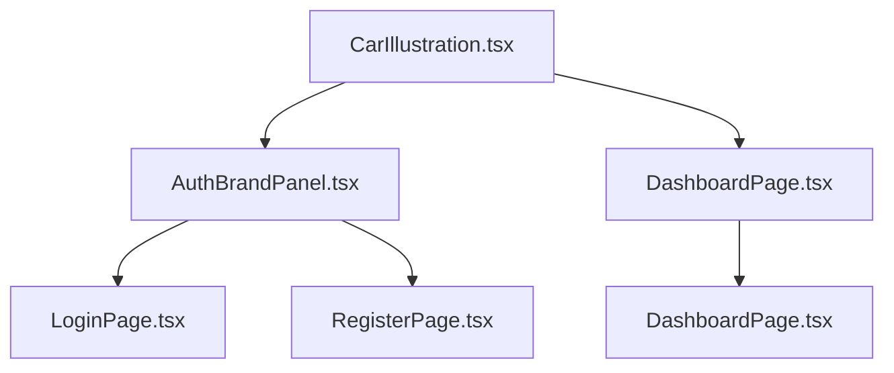
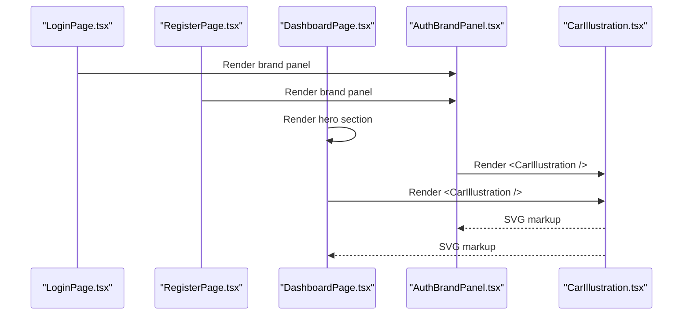
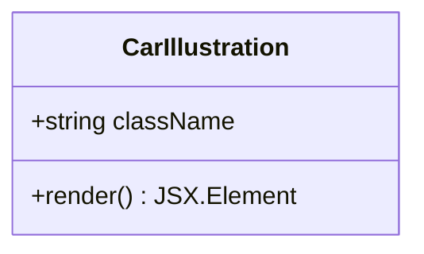
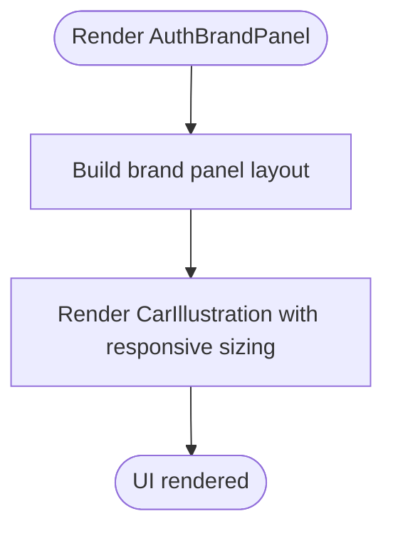
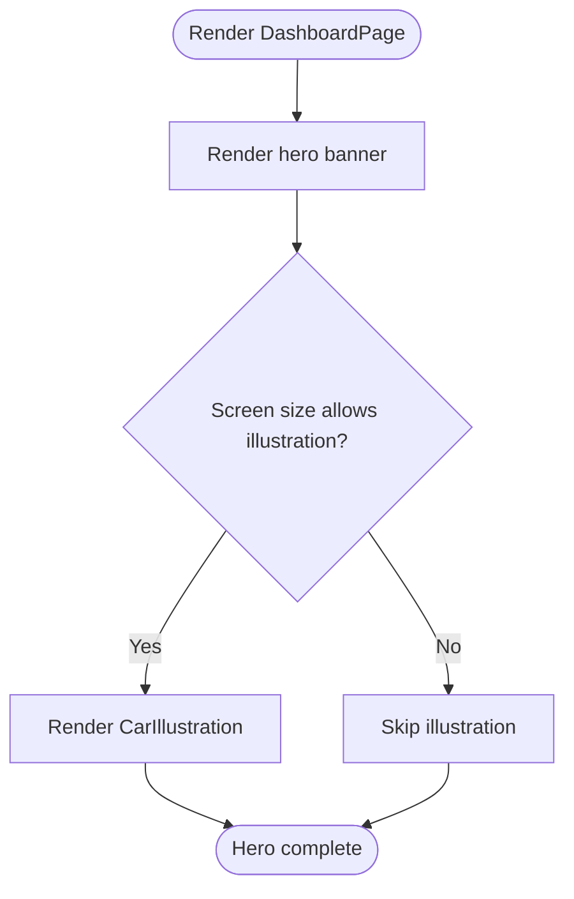
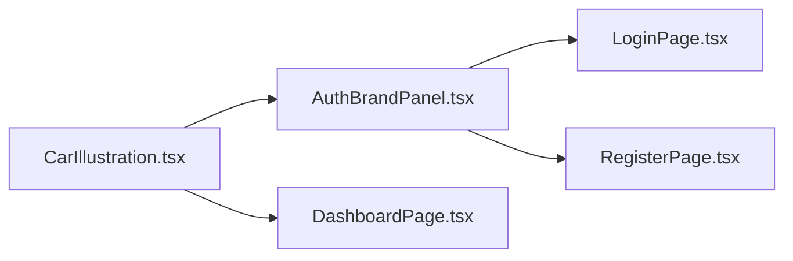

# Car Illustration Component

<cite>
**Referenced Files in This Document**
- [CarIllustration.tsx](file://frontend/src/components/CarIllustration.tsx)
- [AuthBrandPanel.tsx](file://frontend/src/components/AuthBrandPanel.tsx)
- [DashboardPage.tsx](file://frontend/src/pages/DashboardPage.tsx)
- [LoginPage.tsx](file://frontend/src/pages/LoginPage.tsx)
- [RegisterPage.tsx](file://frontend/src/pages/RegisterPage.tsx)
</cite>

## Table of Contents
1. [Introduction](#introduction)
2. [Project Structure](#project-structure)
3. [Core Components](#core-components)
4. [Architecture Overview](#architecture-overview)
5. [Detailed Component Analysis](#detailed-component-analysis)
6. [Dependency Analysis](#dependency-analysis)
7. [Performance Considerations](#performance-considerations)
8. [Troubleshooting Guide](#troubleshooting-guide)
9. [Conclusion](#conclusion)

## Introduction
The Car Illustration component is a lightweight, reusable SVG-based visual asset used to reinforce the brand identity across user-facing screens. It renders a stylized side-view car illustration with subtle motion lines and window reflections. The component is intentionally pure and stateless: it accepts only a className prop and returns an accessible SVG element. It is consumed by the authentication brand panel and the dashboard hero to maintain consistent visual branding without introducing runtime dependencies or performance overhead.

## Project Structure
The component lives under frontend/src/components and is imported by:
- AuthBrandPanel (used on Login and Register pages)
- DashboardPage (used in the dashboard hero banner)

**Diagram sources**
- [CarIllustration.tsx:1-45](file://frontend/src/components/CarIllustration.tsx#L1-L45)
- [AuthBrandPanel.tsx:1-103](file://frontend/src/components/AuthBrandPanel.tsx#L1-L103)
- [DashboardPage.tsx:1-262](file://frontend/src/pages/DashboardPage.tsx#L1-L262)
- [LoginPage.tsx:1-129](file://frontend/src/pages/LoginPage.tsx#L1-L129)
- [RegisterPage.tsx:1-133](file://frontend/src/pages/RegisterPage.tsx#L1-L133)

**Section sources**
- [CarIllustration.tsx:1-45](file://frontend/src/components/CarIllustration.tsx#L1-L45)
- [AuthBrandPanel.tsx:1-103](file://frontend/src/components/AuthBrandPanel.tsx#L1-L103)
- [DashboardPage.tsx:1-262](file://frontend/src/pages/DashboardPage.tsx#L1-L262)
- [LoginPage.tsx:1-129](file://frontend/src/pages/LoginPage.tsx#L1-L129)
- [RegisterPage.tsx:1-133](file://frontend/src/pages/RegisterPage.tsx#L1-L133)

## Core Components
- CarIllustration: A presentational React component that renders an inline SVG with semantic attributes for accessibility. It supports external styling via a className prop and has no internal state or side effects.
- Consumers:
  - AuthBrandPanel: Embeds the illustration within the left panel of the split-screen auth layout.
  - DashboardPage: Places the illustration in the dashboard hero area as a decorative accent.

Key characteristics:
- Pure rendering: No props beyond className; deterministic output.
- Accessibility: Includes role="img" and aria-label for screen readers.
- Styling: Fully controlled by Tailwind classes applied at the call site.

**Section sources**
- [CarIllustration.tsx:1-45](file://frontend/src/components/CarIllustration.tsx#L1-L45)
- [AuthBrandPanel.tsx:40-53](file://frontend/src/components/AuthBrandPanel.tsx#L40-L53)
- [DashboardPage.tsx:92-94](file://frontend/src/pages/DashboardPage.tsx#L92-L94)

## Architecture Overview
At a high level, the illustration is a static asset embedded directly in the UI tree. There are no network calls, no state management, and no business logic. Its role is purely visual and thematic.

**Diagram sources**
- [LoginPage.tsx:30-33](file://frontend/src/pages/LoginPage.tsx#L30-L33)
- [RegisterPage.tsx:35-38](file://frontend/src/pages/RegisterPage.tsx#L35-L38)
- [DashboardPage.tsx:92-94](file://frontend/src/pages/DashboardPage.tsx#L92-L94)
- [AuthBrandPanel.tsx:49-53](file://frontend/src/components/AuthBrandPanel.tsx#L49-L53)
- [CarIllustration.tsx:3-44](file://frontend/src/components/CarIllustration.tsx#L3-L44)

## Detailed Component Analysis

### CarIllustration Component
- Purpose: Provide a consistent, lightweight car illustration across multiple pages.
- Props: className (optional string) for styling control.
- Rendering: Returns an inline SVG with:
  - Accessible attributes (role="img", aria-label).
  - Decorative elements: road line, motion lines, body path, windows, shine, door handles, lights, flash badge, wheels.
- Complexity: O(1) render cost; minimal DOM nodes; no re-renders unless parent changes.

**Diagram sources**
- [CarIllustration.tsx:3-44](file://frontend/src/components/CarIllustration.tsx#L3-L44)

**Section sources**
- [CarIllustration.tsx:1-45](file://frontend/src/components/CarIllustration.tsx#L1-L45)

### AuthBrandPanel Integration
- Usage: Renders the illustration inside the desktop-only brand panel with responsive sizing and drop shadow.
- Behavior: No additional logic; purely visual composition alongside marketing copy and feature list.

**Diagram sources**
- [AuthBrandPanel.tsx:40-53](file://frontend/src/components/AuthBrandPanel.tsx#L40-L53)

**Section sources**
- [AuthBrandPanel.tsx:1-103](file://frontend/src/components/AuthBrandPanel.tsx#L1-L103)

### DashboardPage Integration
- Usage: Displays the illustration in the dashboard hero banner as a decorative accent on larger screens.
- Behavior: Wrapped in a container with animation and opacity; scales to full width within its grid cell.

**Diagram sources**
- [DashboardPage.tsx:92-94](file://frontend/src/pages/DashboardPage.tsx#L92-L94)

**Section sources**
- [DashboardPage.tsx:1-262](file://frontend/src/pages/DashboardPage.tsx#L1-L262)

### LoginPage and RegisterPage
- Both pages include the AuthBrandPanel, which in turn includes the CarIllustration. They do not import the illustration directly.
- Result: Consistent branding across login and registration flows.

**Section sources**
- [LoginPage.tsx:30-33](file://frontend/src/pages/LoginPage.tsx#L30-L33)
- [RegisterPage.tsx:35-38](file://frontend/src/pages/RegisterPage.tsx#L35-L38)

## Dependency Analysis
- Direct imports:
  - AuthBrandPanel imports CarIllustration.
  - DashboardPage imports CarIllustration.
- Indirect usage:
  - LoginPage and RegisterPage use AuthBrandPanel, thus indirectly using CarIllustration.
- Coupling:
  - Low coupling: CarIllustration has no dependencies other than React and CSS classes.
  - High cohesion: All visual logic is encapsulated within the component.

**Diagram sources**
- [CarIllustration.tsx:1-45](file://frontend/src/components/CarIllustration.tsx#L1-L45)
- [AuthBrandPanel.tsx:1-103](file://frontend/src/components/AuthBrandPanel.tsx#L1-L103)
- [DashboardPage.tsx:1-262](file://frontend/src/pages/DashboardPage.tsx#L1-L262)
- [LoginPage.tsx:1-129](file://frontend/src/pages/LoginPage.tsx#L1-L129)
- [RegisterPage.tsx:1-133](file://frontend/src/pages/RegisterPage.tsx#L1-L133)

**Section sources**
- [CarIllustration.tsx:1-45](file://frontend/src/components/CarIllustration.tsx#L1-L45)
- [AuthBrandPanel.tsx:1-103](file://frontend/src/components/AuthBrandPanel.tsx#L1-L103)
- [DashboardPage.tsx:1-262](file://frontend/src/pages/DashboardPage.tsx#L1-L262)
- [LoginPage.tsx:1-129](file://frontend/src/pages/LoginPage.tsx#L1-L129)
- [RegisterPage.tsx:1-133](file://frontend/src/pages/RegisterPage.tsx#L1-L133)

## Performance Considerations
- Zero runtime dependencies: Inline SVG avoids extra network requests.
- Minimal DOM: Fewer nodes mean faster paint and lower memory footprint.
- Stateless: No re-renders triggered by internal state; only updates when parent re-renders.
- Responsive: Sizing handled via Tailwind classes at the consumer level, keeping the component flexible and efficient.

[No sources needed since this section provides general guidance]

## Troubleshooting Guide
- Illustration not visible:
  - Ensure the parent container has sufficient height and is not hidden by CSS (e.g., display:none or overflow:hidden without proper sizing).
  - Verify className is passed correctly and not overriding visibility.
- Accessibility concerns:
  - Confirm the root element has role="img" and aria-label set (already provided by the component).
- Branding inconsistencies:
  - If colors or sizes look off, check the className applied by the consumer (AuthBrandPanel or DashboardPage).
- Mobile behavior:
  - On small screens, some consumers may hide the illustration; verify media queries in the consuming components if you expect it to always show.

**Section sources**
- [CarIllustration.tsx:3-44](file://frontend/src/components/CarIllustration.tsx#L3-L44)
- [AuthBrandPanel.tsx:49-53](file://frontend/src/components/AuthBrandPanel.tsx#L49-L53)
- [DashboardPage.tsx:92-94](file://frontend/src/pages/DashboardPage.tsx#L92-L94)

## Conclusion
The Car Illustration component is a focused, accessible, and performant visual building block that reinforces brand identity across key user journeys. Its simplicity ensures easy maintenance, predictable rendering, and seamless integration into both authentication flows and the dashboard. By centralizing the illustration in a single component, the codebase maintains consistency and reduces duplication while keeping performance optimal.