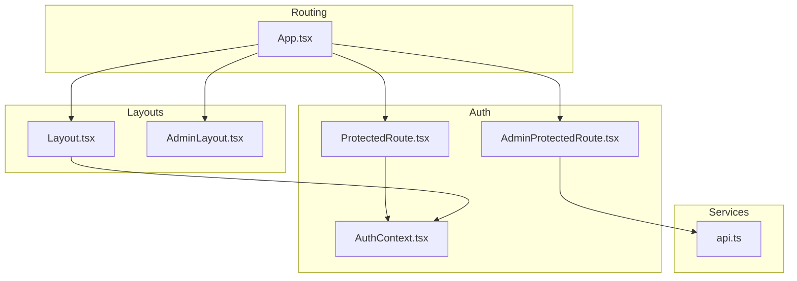
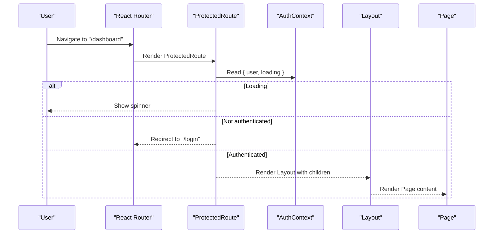
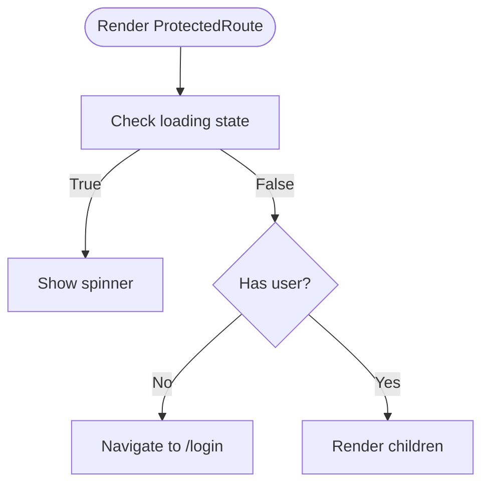
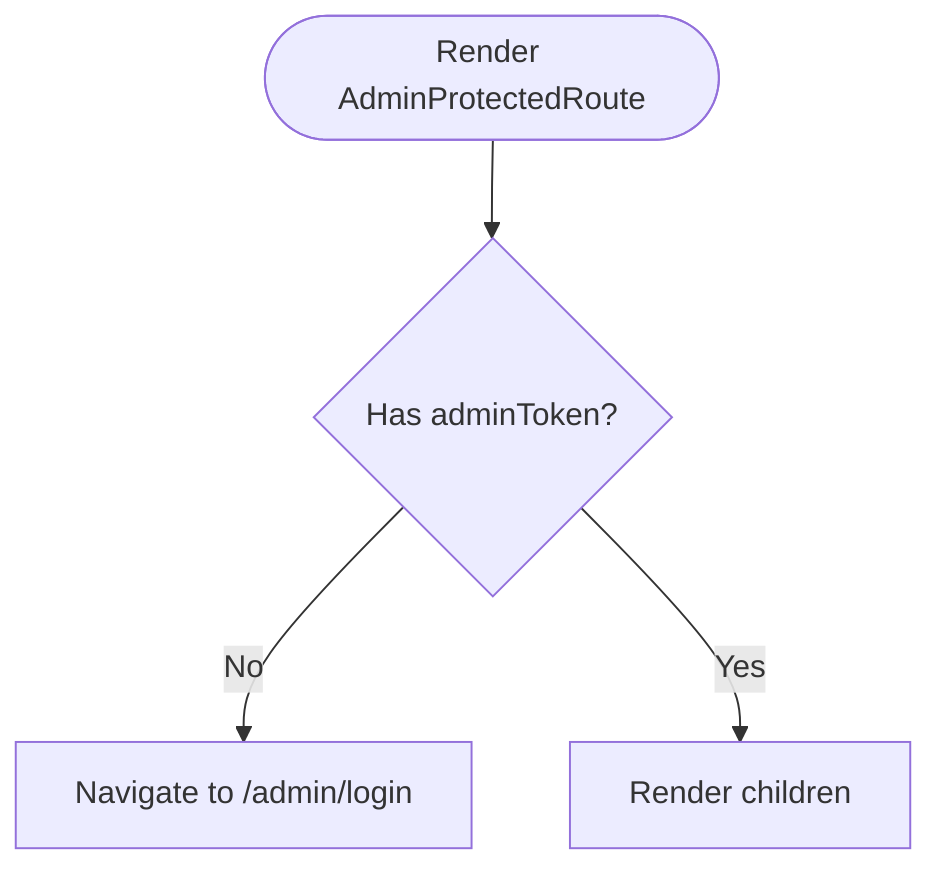
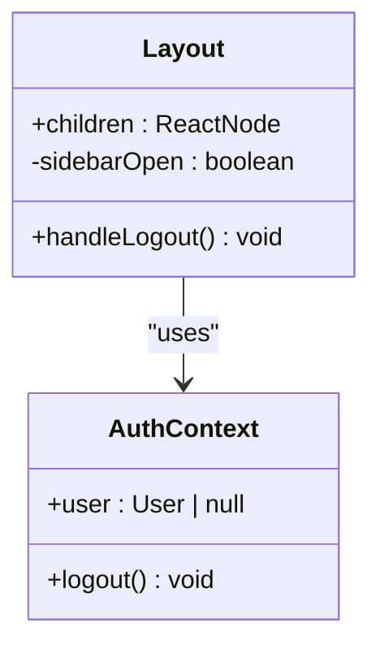
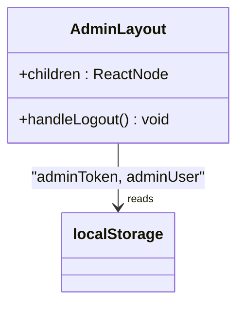
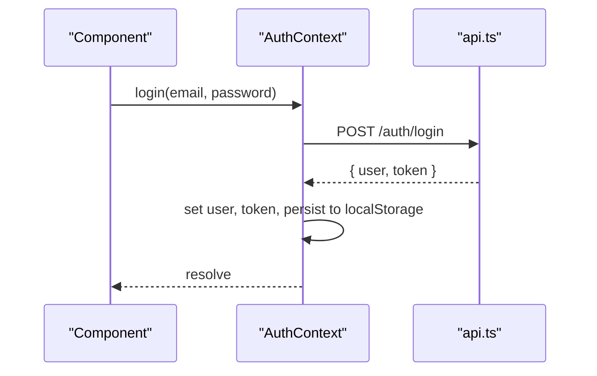
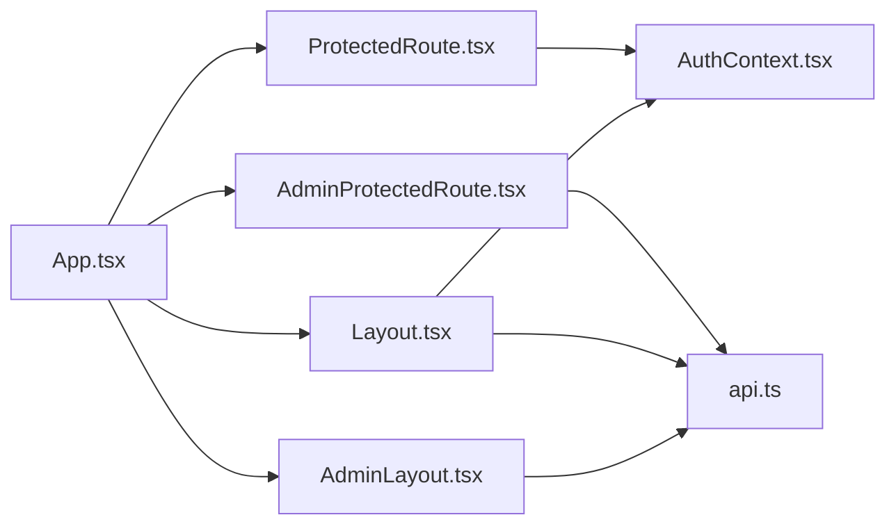

# Components Library

<cite>
**Referenced Files in This Document**
- [ProtectedRoute.tsx](file://frontend/src/components/ProtectedRoute.tsx)
- [AdminProtectedRoute.tsx](file://frontend/src/components/AdminProtectedRoute.tsx)
- [Layout.tsx](file://frontend/src/components/Layout.tsx)
- [AdminLayout.tsx](file://frontend/src/components/AdminLayout.tsx)
- [AuthContext.tsx](file://frontend/src/context/AuthContext.tsx)
- [App.tsx](file://frontend/src/App.tsx)
- [api.ts](file://frontend/src/services/api.ts)
- [index.ts (types)](file://frontend/src/types/index.ts)
- [index.css](file://frontend/src/index.css)
</cite>

## Table of Contents
1. [Introduction](#introduction)
2. [Project Structure](#project-structure)
3. [Core Components](#core-components)
4. [Architecture Overview](#architecture-overview)
5. [Detailed Component Analysis](#detailed-component-analysis)
6. [Dependency Analysis](#dependency-analysis)
7. [Performance Considerations](#performance-considerations)
8. [Troubleshooting Guide](#troubleshooting-guide)
9. [Conclusion](#conclusion)
10. [Appendices](#appendices)

## Introduction
This document describes the reusable UI and architectural components that provide authentication-based routing, consistent page layouts for user and admin areas, and shared styling patterns. It explains component props interfaces, event handling patterns, customization options, usage examples, Tailwind CSS styling approaches, accessibility considerations, and how to compose new components following established patterns.

## Project Structure
The frontend organizes reusable components under src/components, context state management under src/context, and routes are configured in App.tsx using React Router. Authentication state is provided via a context provider, and protected routes ensure only authenticated users or admins can access specific pages. Layouts encapsulate navigation and chrome around page content.

**Diagram sources**
- [App.tsx:23-51](file://frontend/src/App.tsx#L23-L51)
- [ProtectedRoute.tsx:1-21](file://frontend/src/components/ProtectedRoute.tsx#L1-L21)
- [AdminProtectedRoute.tsx:1-8](file://frontend/src/components/AdminProtectedRoute.tsx#L1-L8)
- [Layout.tsx:1-176](file://frontend/src/components/Layout.tsx#L1-L176)
- [AdminLayout.tsx:1-74](file://frontend/src/components/AdminLayout.tsx#L1-L74)
- [AuthContext.tsx:1-82](file://frontend/src/context/AuthContext.tsx#L1-L82)
- [api.ts:1-36](file://frontend/src/services/api.ts#L1-L36)

**Section sources**
- [App.tsx:23-51](file://frontend/src/App.tsx#L23-L51)
- [ProtectedRoute.tsx:1-21](file://frontend/src/components/ProtectedRoute.tsx#L1-L21)
- [AdminProtectedRoute.tsx:1-8](file://frontend/src/components/AdminProtectedRoute.tsx#L1-L8)
- [Layout.tsx:1-176](file://frontend/src/components/Layout.tsx#L1-L176)
- [AdminLayout.tsx:1-74](file://frontend/src/components/AdminLayout.tsx#L1-L74)
- [AuthContext.tsx:1-82](file://frontend/src/context/AuthContext.tsx#L1-L82)
- [api.ts:1-36](file://frontend/src/services/api.ts#L1-L36)

## Core Components
- ProtectedRoute: Guards user-facing routes by checking authentication state from AuthContext. Renders a loading spinner while auth initializes, redirects unauthenticated users to login, and otherwise renders children.
- AdminProtectedRoute: Guards admin routes by checking for an admin token stored in localStorage. Redirects to admin login if missing.
- Layout: Provides the main application shell with desktop sidebar, mobile header, mobile overlay sidebar, and bottom navigation. Integrates logout and displays user info.
- AdminLayout: Provides the admin panel shell with a dark sidebar, navigation items, and logout behavior.

Props Interfaces
- ProtectedRoute: accepts children as ReactNode. No additional props required.
- AdminProtectedRoute: accepts children as ReactNode. No additional props required.
- Layout: accepts children as ReactNode. Uses internal state for mobile menu toggling and integrates with AuthContext for user data and logout.
- AdminLayout: accepts children as ReactNode. Reads admin user info from localStorage and provides logout.

Event Handling Patterns
- Logout: Both layouts trigger logout actions; user layout calls context logout and navigates to login; admin layout clears admin token and navigates to admin login.
- Navigation: Links use react-router-dom Link with active state detection based on current pathname.
- Mobile Menu: Toggles visibility of overlay sidebar using local state.

Customization Options
- Navigation items are defined as arrays within each layout, making it easy to add or reorder links.
- Styling uses Tailwind utility classes and custom theme tokens for brand colors.
- Branding text and icons can be updated directly in the layout files.

Usage Examples
- Wrap protected user pages with ProtectedRoute and Layout in route definitions.
- Wrap admin pages with AdminProtectedRoute and AdminLayout in route definitions.

Styling Approach
- Tailwind CSS with custom theme variables for primary, danger, success, and warning palettes.
- Responsive design with mobile-first utilities and breakpoints for desktop sidebar vs. mobile overlays.

Accessibility Considerations
- Use semantic elements like nav, aside, main for structure.
- Ensure interactive elements have accessible labels and focus states.
- Provide keyboard support for toggles and navigation.

**Section sources**
- [ProtectedRoute.tsx:1-21](file://frontend/src/components/ProtectedRoute.tsx#L1-L21)
- [AdminProtectedRoute.tsx:1-8](file://frontend/src/components/AdminProtectedRoute.tsx#L1-L8)
- [Layout.tsx:1-176](file://frontend/src/components/Layout.tsx#L1-L176)
- [AdminLayout.tsx:1-74](file://frontend/src/components/AdminLayout.tsx#L1-L74)
- [index.css:1-39](file://frontend/src/index.css#L1-L39)

## Architecture Overview
Authentication and routing flow:
- App sets up BrowserRouter and AuthProvider.
- Routes wrap protected pages with appropriate guards and layouts.
- ProtectedRoute checks AuthContext for user presence and loading state.
- AdminProtectedRoute checks localStorage for adminToken.
- api.ts attaches Authorization headers and handles 401 by clearing tokens and redirecting to login.

**Diagram sources**
- [App.tsx:23-51](file://frontend/src/App.tsx#L23-L51)
- [ProtectedRoute.tsx:1-21](file://frontend/src/components/ProtectedRoute.tsx#L1-L21)
- [AuthContext.tsx:17-36](file://frontend/src/context/AuthContext.tsx#L17-L36)
- [Layout.tsx:14-23](file://frontend/src/components/Layout.tsx#L14-L23)

**Section sources**
- [App.tsx:23-51](file://frontend/src/App.tsx#L23-L51)
- [ProtectedRoute.tsx:1-21](file://frontend/src/components/ProtectedRoute.tsx#L1-L21)
- [AdminProtectedRoute.tsx:1-8](file://frontend/src/components/AdminProtectedRoute.tsx#L1-L8)
- [AuthContext.tsx:17-36](file://frontend/src/context/AuthContext.tsx#L17-L36)
- [api.ts:7-33](file://frontend/src/services/api.ts#L7-L33)

## Detailed Component Analysis

### ProtectedRoute
Purpose:
- Ensures only authenticated users can access wrapped routes.
- Shows a loading indicator while authentication state initializes.
- Redirects unauthenticated users to login.

Props:
- children: ReactNode

Behavior:
- Reads user and loading from AuthContext.
- If loading, returns a centered spinner.
- If no user, navigates to /login with replace.
- Otherwise renders children.

Error Handling:
- Relies on AuthContext initialization and api interceptor for 401 handling.

Tailwind Styling:
- Uses responsive and animation utilities for spinner and background.

Accessibility:
- Spinner conveys loading state visually; consider adding aria-live region for screen readers.

**Diagram sources**
- [ProtectedRoute.tsx:4-19](file://frontend/src/components/ProtectedRoute.tsx#L4-L19)

**Section sources**
- [ProtectedRoute.tsx:1-21](file://frontend/src/components/ProtectedRoute.tsx#L1-L21)
- [AuthContext.tsx:17-36](file://frontend/src/context/AuthContext.tsx#L17-L36)

### AdminProtectedRoute
Purpose:
- Ensures only administrators can access admin routes.
- Checks for adminToken in localStorage.

Props:
- children: ReactNode

Behavior:
- If adminToken is missing, redirects to /admin/login with replace.
- Otherwise renders children.

Error Handling:
- No explicit error handling; relies on backend validation and API interceptors.

Tailwind Styling:
- No direct styling; delegates to AdminLayout.

Accessibility:
- Redirects should not block keyboard navigation; ensure proper focus management on redirected pages.

**Diagram sources**
- [AdminProtectedRoute.tsx:3-7](file://frontend/src/components/AdminProtectedRoute.tsx#L3-L7)

**Section sources**
- [AdminProtectedRoute.tsx:1-8](file://frontend/src/components/AdminProtectedRoute.tsx#L1-L8)

### Layout (User Shell)
Purpose:
- Provides consistent navigation and chrome for user pages.
- Handles logout and displays user information.
- Supports desktop sidebar and mobile overlay/bottom navigation.

Props:
- children: ReactNode

State:
- sidebarOpen: boolean for mobile menu toggle.

Navigation:
- Defines navItems array with path, label, and icon references.
- Highlights active link based on current pathname.

Logout:
- Calls logout from AuthContext and navigates to /login.

Tailwind Styling:
- Uses responsive classes for layout switching.
- Custom theme tokens for brand colors.

Accessibility:
- Semantic nav and aside elements.
- Buttons have clear labels; consider adding aria-expanded for collapsible sections.

**Diagram sources**
- [Layout.tsx:14-23](file://frontend/src/components/Layout.tsx#L14-L23)
- [AuthContext.tsx:5-13](file://frontend/src/context/AuthContext.tsx#L5-L13)

**Section sources**
- [Layout.tsx:1-176](file://frontend/src/components/Layout.tsx#L1-L176)
- [AuthContext.tsx:17-66](file://frontend/src/context/AuthContext.tsx#L17-L66)

### AdminLayout (Admin Shell)
Purpose:
- Provides consistent navigation and chrome for admin pages.
- Displays admin name and supports logout.

Props:
- children: ReactNode

Navigation:
- Defines navItems array for admin routes.
- Highlights active link based on current pathname.

Logout:
- Removes adminToken from localStorage and navigates to /admin/login.

Tailwind Styling:
- Dark sidebar theme with brand color accents.

Accessibility:
- Semantic nav and aside elements; ensure focus management when navigating.

**Diagram sources**
- [AdminLayout.tsx:11-18](file://frontend/src/components/AdminLayout.tsx#L11-L18)

**Section sources**
- [AdminLayout.tsx:1-74](file://frontend/src/components/AdminLayout.tsx#L1-L74)

### AuthContext
Purpose:
- Manages authentication state (user, token, loading).
- Provides login, register, logout, and profile update functions.
- Initializes session by validating token on mount.

Key Methods:
- login(email, password): authenticates and stores token/user.
- register(data): registers user and stores token/user.
- logout(): clears state and storage.
- updateProfile(data): updates user profile.

Error Handling:
- On invalid token during init, clears token and storage.
- API interceptor handles 401 by clearing tokens and redirecting to login.

Tailwind Styling:
- None directly; used by components for state.

Accessibility:
- Error messages should be surfaced to users via UI components.

**Diagram sources**
- [AuthContext.tsx:38-45](file://frontend/src/context/AuthContext.tsx#L38-L45)
- [api.ts:7-20](file://frontend/src/services/api.ts#L7-L20)

**Section sources**
- [AuthContext.tsx:1-82](file://frontend/src/context/AuthContext.tsx#L1-L82)
- [api.ts:1-36](file://frontend/src/services/api.ts#L1-L36)

## Dependency Analysis
- ProtectedRoute depends on AuthContext for user and loading state.
- AdminProtectedRoute depends on localStorage for adminToken.
- Layout depends on AuthContext for user and logout.
- AdminLayout depends on localStorage for adminToken and adminUser.
- App configures routes and composes guards and layouts.
- api.ts adds Authorization headers and handles 401 globally.

**Diagram sources**
- [App.tsx:23-51](file://frontend/src/App.tsx#L23-L51)
- [ProtectedRoute.tsx:1-21](file://frontend/src/components/ProtectedRoute.tsx#L1-L21)
- [AdminProtectedRoute.tsx:1-8](file://frontend/src/components/AdminProtectedRoute.tsx#L1-L8)
- [Layout.tsx:1-176](file://frontend/src/components/Layout.tsx#L1-L176)
- [AdminLayout.tsx:1-74](file://frontend/src/components/AdminLayout.tsx#L1-L74)
- [AuthContext.tsx:1-82](file://frontend/src/context/AuthContext.tsx#L1-L82)
- [api.ts:1-36](file://frontend/src/services/api.ts#L1-L36)

**Section sources**
- [App.tsx:23-51](file://frontend/src/App.tsx#L23-L51)
- [ProtectedRoute.tsx:1-21](file://frontend/src/components/ProtectedRoute.tsx#L1-L21)
- [AdminProtectedRoute.tsx:1-8](file://frontend/src/components/AdminProtectedRoute.tsx#L1-L8)
- [Layout.tsx:1-176](file://frontend/src/components/Layout.tsx#L1-L176)
- [AdminLayout.tsx:1-74](file://frontend/src/components/AdminLayout.tsx#L1-L74)
- [AuthContext.tsx:1-82](file://frontend/src/context/AuthContext.tsx#L1-L82)
- [api.ts:1-36](file://frontend/src/services/api.ts#L1-L36)

## Performance Considerations
- Minimize re-renders by keeping layout state local and avoiding unnecessary prop drilling.
- Use memoization for expensive computations in layouts if needed.
- Avoid heavy operations in render paths; defer to effects or event handlers.
- Leverage React Router’s efficient rendering and guards to prevent unnecessary work.

[No sources needed since this section provides general guidance]

## Troubleshooting Guide
Common Issues:
- Redirect loops: Ensure ProtectedRoute and AdminProtectedRoute conditions match your auth strategy and that tokens are correctly persisted.
- Unauthorized redirects: The api interceptor clears tokens and redirects to login on 401; verify backend responses and token validity.
- Layout not rendering: Confirm routes wrap pages with correct guards and layouts in App.tsx.

Debugging Tips:
- Check localStorage for token and adminToken values.
- Inspect network requests for Authorization headers and status codes.
- Validate AuthContext initialization and loading state.

**Section sources**
- [api.ts:22-33](file://frontend/src/services/api.ts#L22-L33)
- [ProtectedRoute.tsx:7-19](file://frontend/src/components/ProtectedRoute.tsx#L7-L19)
- [AdminProtectedRoute.tsx:3-7](file://frontend/src/components/AdminProtectedRoute.tsx#L3-L7)
- [AuthContext.tsx:22-36](file://frontend/src/context/AuthContext.tsx#L22-L36)

## Conclusion
The components library establishes a robust foundation for authentication-based routing and consistent layouts across user and admin experiences. ProtectedRoute and AdminProtectedRoute enforce access control, while Layout and AdminLayout provide cohesive shells with navigation and branding. Tailwind CSS and custom theme tokens enable flexible styling, and AuthContext centralizes authentication state and actions. Following these patterns ensures maintainable, accessible, and scalable UI development.

[No sources needed since this section summarizes without analyzing specific files]

## Appendices

### Props Interfaces Summary
- ProtectedRoute: children: ReactNode
- AdminProtectedRoute: children: ReactNode
- Layout: children: ReactNode
- AdminLayout: children: ReactNode

**Section sources**
- [ProtectedRoute.tsx:4-5](file://frontend/src/components/ProtectedRoute.tsx#L4-L5)
- [AdminProtectedRoute.tsx:3-4](file://frontend/src/components/AdminProtectedRoute.tsx#L3-L4)
- [Layout.tsx:14-15](file://frontend/src/components/Layout.tsx#L14-L15)
- [AdminLayout.tsx:11-12](file://frontend/src/components/AdminLayout.tsx#L11-L12)

### Styling and Theme
- Tailwind CSS imported with custom theme variables for brand colors.
- Consistent spacing, typography, and color usage across layouts.

**Section sources**
- [index.css:1-39](file://frontend/src/index.css#L1-L39)

### Data Types Used
- User, Claim, Vehicle, InsurancePolicy, and related types define the shape of data used across components and pages.

**Section sources**
- [index.ts (types):1-150](file://frontend/src/types/index.ts#L1-L150)