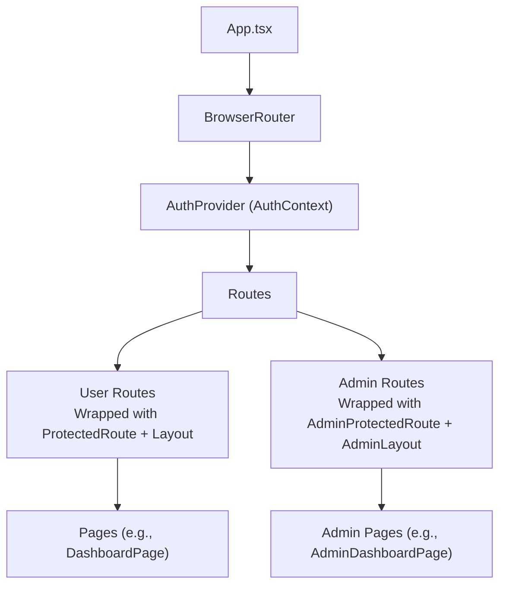
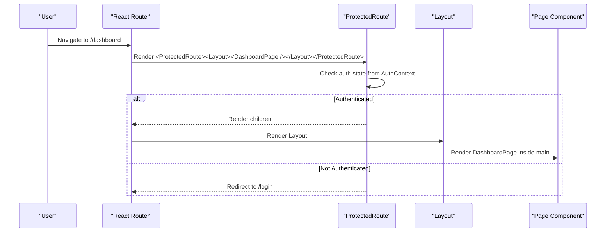
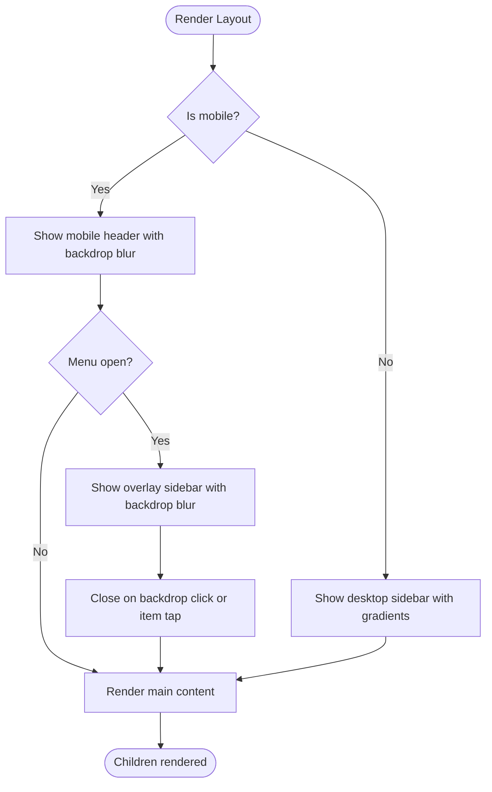
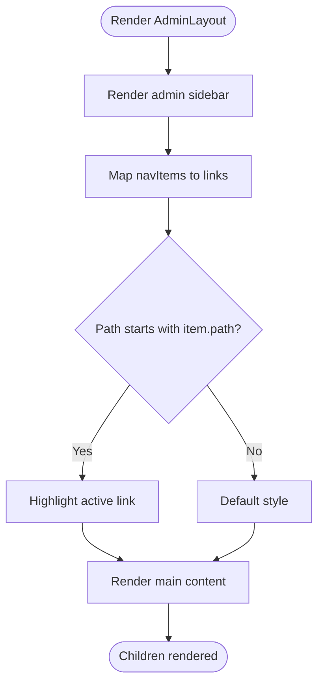
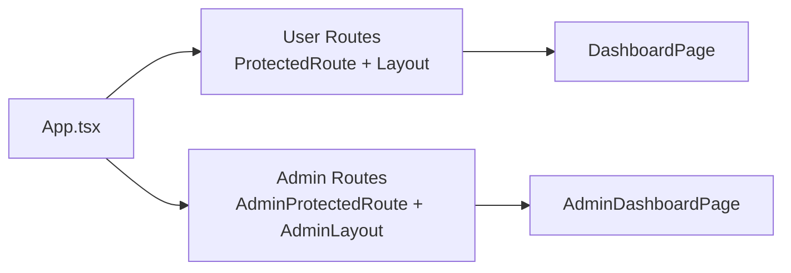
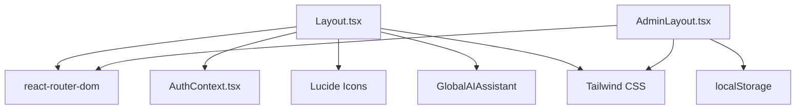

# Layout Components

<cite>
**Referenced Files in This Document**
- [Layout.tsx](file://frontend/src/components/Layout.tsx)
- [AdminLayout.tsx](file://frontend/src/components/AdminLayout.tsx)
- [App.tsx](file://frontend/src/App.tsx)
- [AuthContext.tsx](file://frontend/src/context/AuthContext.tsx)
- [ProtectedRoute.tsx](file://frontend/src/components/ProtectedRoute.tsx)
- [AdminProtectedRoute.tsx](file://frontend/src/components/AdminProtectedRoute.tsx)
- [index.css](file://frontend/src/index.css)
- [DashboardPage.tsx](file://frontend/src/pages/DashboardPage.tsx)
- [AdminDashboardPage.tsx](file://frontend/src/pages/admin/AdminDashboardPage.tsx)
</cite>

## Update Summary
**Changes Made**
- Updated Layout component analysis to reflect modern design patterns including gradient backgrounds, enhanced shadows, and improved responsive behavior
- Enhanced mobile responsiveness documentation with backdrop blur effects and improved user profile sections
- Added comprehensive coverage of gradient active states and rounded corner implementations
- Updated styling approach section to include modern Tailwind CSS techniques
- Enhanced troubleshooting guide with new responsive design considerations

## Table of Contents
1. Introduction
2. Project Structure
3. Core Components
4. Architecture Overview
5. Detailed Component Analysis
6. Dependency Analysis
7. Performance Considerations
8. Troubleshooting Guide
9. Conclusion
10. Appendices

## Introduction
This document explains the layout components that provide consistent page structure and navigation patterns for user-facing pages and administrative interfaces. It focuses on:
- The main Layout component for authenticated users with modern design patterns
- The AdminLayout component for administrators with collapsible sidebar functionality
- How they integrate with routing, authentication, and responsive design
- Styling approaches using Tailwind CSS with gradients, shadows, and modern UI patterns
- Practical guidance to extend layouts, add custom navigation elements, and maintain consistent UI patterns across sections

## Project Structure
The frontend uses React Router to wrap routes with appropriate layouts and protection:
- User routes are wrapped with ProtectedRoute and Layout
- Admin routes are wrapped with AdminProtectedRoute and AdminLayout
- Global styles define a primary color palette used by both layouts

**Diagram sources**
- [App.tsx:35-72](file://frontend/src/App.tsx#L35-L72)
- [AuthContext.tsx:17-91](file://frontend/src/context/AuthContext.tsx#L17-L91)

**Section sources**
- [App.tsx:35-72](file://frontend/src/App.tsx#L35-L72)
- [index.css:3-35](file://frontend/src/index.css#L3-L35)

## Core Components
- **Layout**: Provides a modern, responsive interface with persistent desktop sidebar, mobile header with backdrop blur, bottom navigation, and enhanced user profile area with gradient avatar backgrounds. Integrates with AuthContext for sign-out and displays active navigation based on current route. Features gradient backgrounds, enhanced shadows, and rounded corners throughout.
- **AdminLayout**: Provides a dark-themed admin sidebar with collapsible functionality, admin-specific navigation, and a simple logout flow using local storage. Includes smooth transitions and responsive design patterns.

Both components render their respective children inside a main content area and use Tailwind CSS for responsive behavior and modern styling with gradients, shadows, and smooth transitions.

**Section sources**
- [Layout.tsx:15-187](file://frontend/src/components/Layout.tsx#L15-L187)
- [AdminLayout.tsx:15-93](file://frontend/src/components/AdminLayout.tsx#L15-L93)

## Architecture Overview
The application separates concerns between routing, authentication, and layout:
- App defines routes and chooses which layout to apply per section
- ProtectedRoute ensures only authenticated users access user routes
- AdminProtectedRoute ensures only admins access admin routes
- Layout and AdminLayout encapsulate shared chrome (sidebar, branding, navigation) so pages focus on content

**Diagram sources**
- [App.tsx:41-49](file://frontend/src/App.tsx#L41-L49)
- [ProtectedRoute.tsx:4-20](file://frontend/src/components/ProtectedRoute.tsx#L4-L20)
- [Layout.tsx:15-187](file://frontend/src/components/Layout.tsx#L15-L187)
- [DashboardPage.tsx:8-142](file://frontend/src/pages/DashboardPage.tsx#L8-L142)

## Detailed Component Analysis

### Layout (User-Facing) - Enhanced Design
Responsibilities:
- Modern desktop sidebar with gradient backgrounds, enhanced shadows, and rounded corners
- Mobile header with backdrop blur effect and hamburger toggle
- Bottom navigation bar for quick access on small screens
- Active link highlighting with gradient backgrounds and smooth transitions
- Enhanced user profile section with gradient avatar backgrounds
- Sign out integration via AuthContext

Key behaviors:
- Navigation items are defined centrally and reused for desktop, mobile overlay, and bottom nav
- Active state is computed using the current pathname with gradient highlighting
- Sidebar open/close state is managed locally for mobile overlay with backdrop blur
- Logout triggers context logout and navigates to login
- Responsive breakpoints ensure optimal viewing across all devices

Responsive design:
- Desktop: fixed left sidebar with gradient logo and shadow effects
- Mobile: top header with backdrop blur; slide-in overlay sidebar with smooth animations; bottom tab bar for top-level sections
- Enhanced mobile experience with proper spacing and touch-friendly interactions

Styling:
- Uses Tailwind utility classes for spacing, colors, and layout
- Leverages custom primary color tokens defined globally
- Implements modern design patterns including gradients, shadows, and rounded corners
- Consistent hover and active states improve usability

Extensibility:
- Add new navigation items by updating the central navItems array
- To add a new section, include it in navItems and ensure the path matches your route
- For additional user actions in the sidebar, add buttons or dropdowns near the profile section
- Maintain consistency with existing gradient and shadow patterns

**Diagram sources**
- [Layout.tsx:26-187](file://frontend/src/components/Layout.tsx#L26-L187)

**Section sources**
- [Layout.tsx:7-13](file://frontend/src/components/Layout.tsx#L7-L13)
- [Layout.tsx:15-187](file://frontend/src/components/Layout.tsx#L15-L187)
- [AuthContext.tsx:17-100](file://frontend/src/context/AuthContext.tsx#L17-L100)

### AdminLayout (Administrative Interface) - Enhanced Functionality
Responsibilities:
- Dark-themed sidebar with collapsible functionality and smooth transitions
- Displays admin name derived from local storage
- Simple logout clears admin token and redirects to admin login
- Responsive design with adaptive sidebar width

Key behaviors:
- Navigation items are defined centrally for consistency
- Active link highlighting based on current pathname with background color changes
- Collapsible sidebar with smooth width transitions
- Logout removes adminToken from localStorage and navigates to admin login

Responsive design:
- Fixed sidebar with main content offset; suitable for desktop-first admin workflows
- Collapsible sidebar adapts to different screen sizes
- Smooth transitions enhance user experience

Styling:
- Uses Tailwind utilities and global primary color tokens
- Dark theme via gray-900 background and lighter text variants
- Consistent hover and active states improve usability

Extensibility:
- Add new admin sections by updating the navItems array
- To add admin-only features, place them under /admin/* routes and wrap with AdminProtectedRoute
- Maintain consistent styling patterns with existing dark theme

**Diagram sources**
- [AdminLayout.tsx:5-13](file://frontend/src/components/AdminLayout.tsx#L5-L13)
- [AdminLayout.tsx:15-93](file://frontend/src/components/AdminLayout.tsx#L15-L93)

**Section sources**
- [AdminLayout.tsx:5-13](file://frontend/src/components/AdminLayout.tsx#L5-L13)
- [AdminLayout.tsx:15-93](file://frontend/src/components/AdminLayout.tsx#L15-L93)

### Routing and Protection Integration
- User routes are protected by ProtectedRoute and wrapped with Layout
- Admin routes are protected by AdminProtectedRoute and wrapped with AdminLayout
- App centralizes route definitions and layout composition

**Diagram sources**
- [App.tsx:41-61](file://frontend/src/App.tsx#L41-L61)
- [ProtectedRoute.tsx:4-20](file://frontend/src/components/ProtectedRoute.tsx#L4-L20)
- [AdminProtectedRoute.tsx:3-7](file://frontend/src/components/AdminProtectedRoute.tsx#L3-L7)

**Section sources**
- [App.tsx:41-61](file://frontend/src/App.tsx#L41-L61)
- [ProtectedRoute.tsx:4-20](file://frontend/src/components/ProtectedRoute.tsx#L4-L20)
- [AdminProtectedRoute.tsx:3-7](file://frontend/src/components/AdminProtectedRoute.tsx#L3-L7)

## Dependency Analysis
- Layout depends on:
  - React Router hooks for navigation and location
  - AuthContext for user data and logout
  - Lucide icons for visual cues
  - GlobalAIAssistant component for AI chat functionality
- AdminLayout depends on:
  - React Router hooks for navigation
  - Local storage for admin session management
  - Lucide icons for visual cues
- Both layouts depend on Tailwind CSS and global theme tokens for consistent styling

**Diagram sources**
- [Layout.tsx:1-5](file://frontend/src/components/Layout.tsx#L1-L5)
- [AdminLayout.tsx:1-3](file://frontend/src/components/AdminLayout.tsx#L1-L3)
- [index.css:3-35](file://frontend/src/index.css#L3-L35)

**Section sources**
- [Layout.tsx:1-5](file://frontend/src/components/Layout.tsx#L1-L5)
- [AdminLayout.tsx:1-3](file://frontend/src/components/AdminLayout.tsx#L1-L3)
- [index.css:3-35](file://frontend/src/index.css#L3-L35)

## Performance Considerations
- Keep navItems centralized to avoid re-renders caused by inline arrays
- Use route-based code splitting at the page level to reduce initial bundle size
- Avoid heavy computations in layout render paths; offload to effects or memoized values where needed
- Prefer stable icon imports and reuse to minimize overhead
- Utilize CSS transitions and transforms for smooth animations instead of JavaScript animations
- Implement proper responsive breakpoints to optimize rendering performance

## Troubleshooting Guide
Common issues and resolutions:
- Links not highlighting correctly: Ensure route paths match those in navItems and that pathname checks use startsWith consistently
- Sign out does not redirect: Verify logout calls context logout and navigates to the correct route
- Admin logout fails: Confirm adminToken is removed from localStorage and navigation goes to /admin/login
- Mobile sidebar not closing: Ensure overlay backdrop click handler closes the sidebar and that navigation items close it on selection
- Gradient backgrounds not displaying: Verify Tailwind CSS configuration includes custom color tokens
- Backdrop blur effects not working: Ensure browser supports backdrop-filter property
- Responsive layout issues: Check viewport meta tag and breakpoint configurations

**Section sources**
- [Layout.tsx:21-24](file://frontend/src/components/Layout.tsx#L21-L24)
- [Layout.tsx:102-151](file://frontend/src/components/Layout.tsx#L102-L151)
- [AdminLayout.tsx:20-23](file://frontend/src/components/AdminLayout.tsx#L20-L23)

## Conclusion
The Layout and AdminLayout components establish a consistent, modern, and responsive shell for user and admin experiences. They centralize navigation, integrate with authentication, and leverage Tailwind CSS with modern design patterns including gradients, shadows, and smooth transitions. By extending the navItems arrays and following the established patterns, you can add new sections while maintaining consistency across the application. The enhanced design patterns provide a polished user experience with improved visual hierarchy and interaction feedback.

## Appendices

### Extending Layouts and Adding Custom Navigation
- Add a new navigation item:
  - Update the navItems array in the relevant layout file
  - Ensure the path aligns with your route definition in App
  - Optionally add an icon from the existing icon set
  - Follow existing gradient and shadow patterns for consistency
- Add a custom action in the sidebar:
  - Insert a button or link near the profile/logout area
  - For user flows, use AuthContext methods; for admin flows, manage local storage and navigate accordingly
  - Apply consistent styling with rounded corners and hover effects
- Maintain consistent UI patterns:
  - Follow existing spacing, typography, and color tokens
  - Use the same active-state logic pattern for new links
  - Implement proper responsive behavior for all screen sizes

**Section sources**
- [Layout.tsx:7-13](file://frontend/src/components/Layout.tsx#L7-L13)
- [AdminLayout.tsx:5-13](file://frontend/src/components/AdminLayout.tsx#L5-L13)
- [App.tsx:41-61](file://frontend/src/App.tsx#L41-L61)

### Responsive Design Patterns Used
- Desktop: fixed sidebar with gradient backgrounds and shadow effects
- Mobile: top header with backdrop blur, slide-in overlay sidebar with smooth animations, and bottom tab navigation for key sections
- Consistent padding and margins across breakpoints for readability
- Touch-friendly interactions with proper sizing and spacing
- Adaptive content layout that works seamlessly across device types

**Section sources**
- [Layout.tsx:26-187](file://frontend/src/components/Layout.tsx#L26-L187)

### Styling Approach with Tailwind CSS
- Global theme tokens define primary, danger, success, and warning palettes with extended color ranges
- Layouts use utility classes for layout, spacing, and states with modern design patterns
- Consistent hover and active states improve usability with smooth transitions
- Gradient backgrounds and enhanced shadows create visual depth and hierarchy
- Rounded corners and proper spacing contribute to a modern, polished appearance
- Backdrop blur effects enhance mobile user experience

**Section sources**
- [index.css:3-35](file://frontend/src/index.css#L3-L35)
- [Layout.tsx:26-187](file://frontend/src/components/Layout.tsx#L26-L187)
- [AdminLayout.tsx:36-93](file://frontend/src/components/AdminLayout.tsx#L36-L93)

### Modern Design Patterns Implementation
- **Gradient Backgrounds**: Used throughout the layout for logos, active states, and avatar backgrounds
- **Enhanced Shadows**: Applied strategically to create depth and visual hierarchy
- **Rounded Corners**: Consistent border-radius usage for modern card-like appearances
- **Backdrop Blur Effects**: Implemented in mobile headers for frosted glass effects
- **Smooth Transitions**: CSS transitions for interactive elements and layout changes
- **Responsive Gradients**: Dynamic gradient applications based on active states and screen sizes

**Section sources**
- [Layout.tsx:32-38](file://frontend/src/components/Layout.tsx#L32-L38)
- [Layout.tsx:50-54](file://frontend/src/components/Layout.tsx#L50-L54)
- [Layout.tsx:65-67](file://frontend/src/components/Layout.tsx#L65-L67)
- [Layout.tsx:84-99](file://frontend/src/components/Layout.tsx#L84-L99)