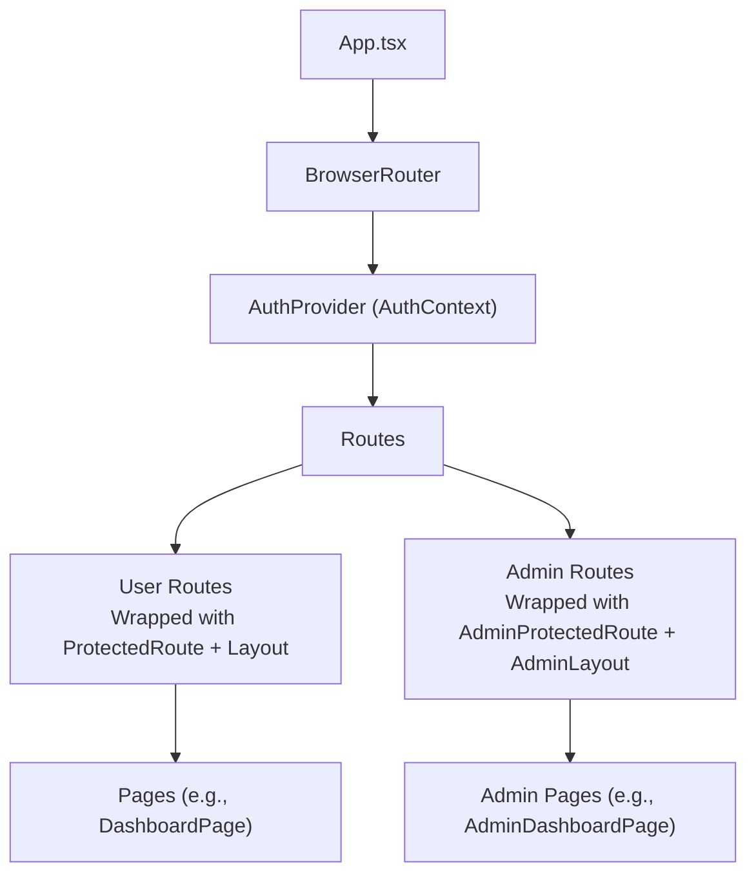
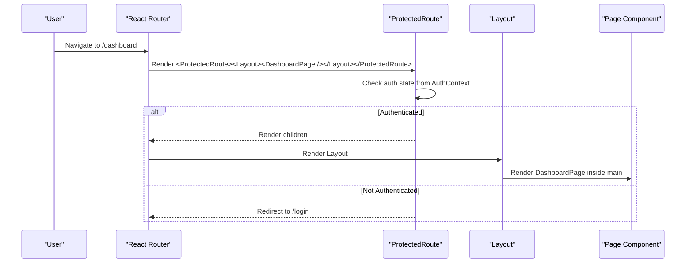
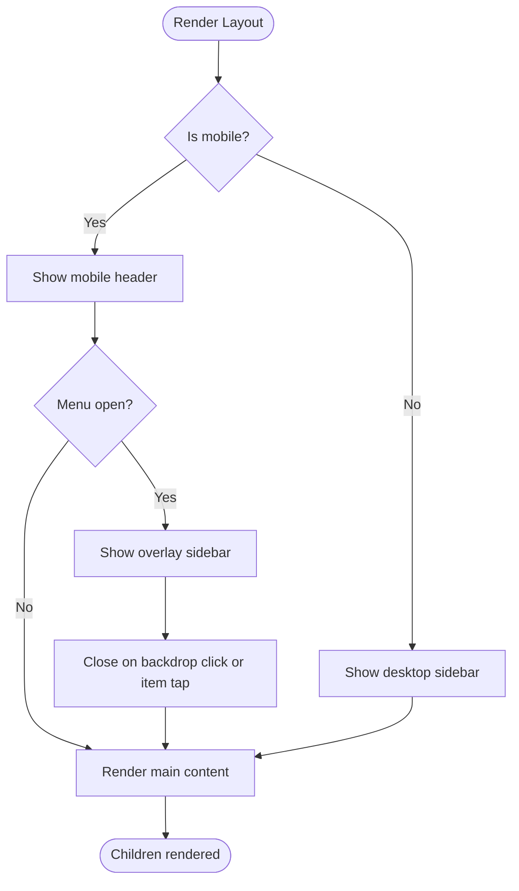
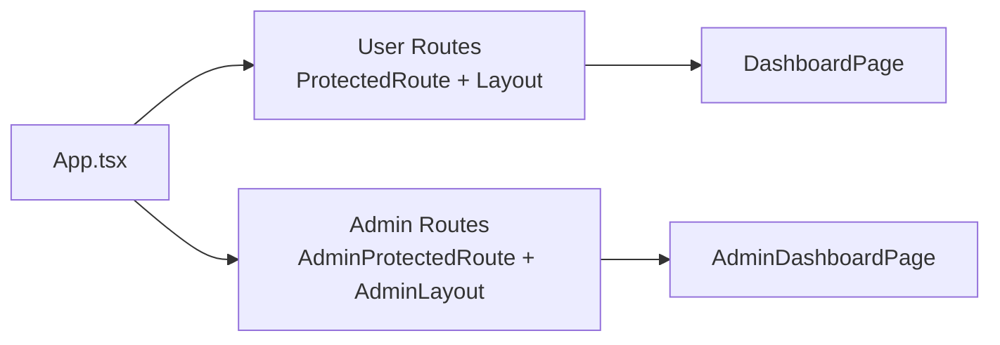
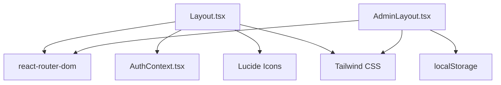

# Layout Components

<cite>
**Referenced Files in This Document**
- [Layout.tsx](file://frontend/src/components/Layout.tsx)
- [AdminLayout.tsx](file://frontend/src/components/AdminLayout.tsx)
- [App.tsx](file://frontend/src/App.tsx)
- [AuthContext.tsx](file://frontend/src/context/AuthContext.tsx)
- [ProtectedRoute.tsx](file://frontend/src/components/ProtectedRoute.tsx)
- [AdminProtectedRoute.tsx](file://frontend/src/components/AdminProtectedRoute.tsx)
- [index.css](file://frontend/src/index.css)
- [DashboardPage.tsx](file://frontend/src/pages/DashboardPage.tsx)
- [AdminDashboardPage.tsx](file://frontend/src/pages/admin/AdminDashboardPage.tsx)
</cite>

## Table of Contents
1. Introduction
2. Project Structure
3. Core Components
4. Architecture Overview
5. Detailed Component Analysis
6. Dependency Analysis
7. Performance Considerations
8. Troubleshooting Guide
9. Conclusion
10. Appendices

## Introduction
This document explains the layout components that provide consistent page structure and navigation patterns for user-facing pages and administrative interfaces. It focuses on:
- The main Layout component for authenticated users
- The AdminLayout component for administrators
- How they integrate with routing, authentication, and responsive design
- Styling approaches using Tailwind CSS
- Practical guidance to extend layouts, add custom navigation elements, and maintain consistent UI patterns across sections

## Project Structure
The frontend uses React Router to wrap routes with appropriate layouts and protection:
- User routes are wrapped with ProtectedRoute and Layout
- Admin routes are wrapped with AdminProtectedRoute and AdminLayout
- Global styles define a primary color palette used by both layouts

**Diagram sources**
- [App.tsx:23-51](file://frontend/src/App.tsx#L23-L51)
- [AuthContext.tsx:17-72](file://frontend/src/context/AuthContext.tsx#L17-L72)

**Section sources**
- [App.tsx:23-51](file://frontend/src/App.tsx#L23-L51)
- [index.css:3-27](file://frontend/src/index.css#L3-L27)

## Core Components
- Layout: Provides a persistent sidebar, mobile header, bottom navigation, and user profile area for regular users. Integrates with AuthContext for sign-out and displays active navigation based on current route.
- AdminLayout: Provides a dark-themed admin sidebar, admin-specific navigation, and a simple logout flow using local storage.

Both components render their respective children inside a main content area and use Tailwind CSS for responsive behavior and styling.

**Section sources**
- [Layout.tsx:14-176](file://frontend/src/components/Layout.tsx#L14-L176)
- [AdminLayout.tsx:11-74](file://frontend/src/components/AdminLayout.tsx#L11-L74)

## Architecture Overview
The application separates concerns between routing, authentication, and layout:
- App defines routes and chooses which layout to apply per section
- ProtectedRoute ensures only authenticated users access user routes
- AdminProtectedRoute ensures only admins access admin routes
- Layout and AdminLayout encapsulate shared chrome (sidebar, branding, navigation) so pages focus on content

**Diagram sources**
- [App.tsx:31-39](file://frontend/src/App.tsx#L31-L39)
- [ProtectedRoute.tsx:4-20](file://frontend/src/components/ProtectedRoute.tsx#L4-L20)
- [Layout.tsx:14-176](file://frontend/src/components/Layout.tsx#L14-L176)
- [DashboardPage.tsx:8-142](file://frontend/src/pages/DashboardPage.tsx#L8-L142)

## Detailed Component Analysis

### Layout (User-Facing)
Responsibilities:
- Persistent desktop sidebar with navigation items and user profile
- Mobile header with hamburger toggle and overlay sidebar
- Bottom navigation bar for quick access on small screens
- Active link highlighting based on current route
- Sign out integration via AuthContext

Key behaviors:
- Navigation items are defined centrally and reused for desktop, mobile overlay, and bottom nav
- Active state is computed using the current pathname
- Sidebar open/close state is managed locally for mobile overlay
- Logout triggers context logout and navigates to login

Responsive design:
- Desktop: fixed left sidebar with main content offset
- Mobile: top header with menu button; slide-in overlay sidebar; bottom tab bar for top-level sections

Styling:
- Uses Tailwind utility classes for spacing, colors, and layout
- Leverages custom primary color tokens defined globally

Extensibility:
- Add new navigation items by updating the central navItems array
- To add a new section, include it in navItems and ensure the path matches your route
- For additional user actions in the sidebar, add buttons or dropdowns near the profile section

**Diagram sources**
- [Layout.tsx:25-173](file://frontend/src/components/Layout.tsx#L25-L173)

**Section sources**
- [Layout.tsx:6-12](file://frontend/src/components/Layout.tsx#L6-L12)
- [Layout.tsx:14-176](file://frontend/src/components/Layout.tsx#L14-L176)
- [AuthContext.tsx:17-82](file://frontend/src/context/AuthContext.tsx#L17-L82)

### AdminLayout (Administrative Interface)
Responsibilities:
- Dark-themed sidebar with admin navigation
- Displays admin name derived from local storage
- Simple logout clears admin token and redirects to admin login

Key behaviors:
- Navigation items are defined centrally for consistency
- Active link highlighting based on current pathname
- Logout removes adminToken from localStorage and navigates to admin login

Responsive design:
- Fixed sidebar with main content offset; suitable for desktop-first admin workflows

Styling:
- Uses Tailwind utilities and global primary color tokens
- Dark theme via gray-900 background and lighter text variants

Extensibility:
- Add new admin sections by updating the navItems array
- To add admin-only features, place them under /admin/* routes and wrap with AdminProtectedRoute

**Diagram sources**
- [AdminLayout.tsx:4-9](file://frontend/src/components/AdminLayout.tsx#L4-L9)
- [AdminLayout.tsx:11-74](file://frontend/src/components/AdminLayout.tsx#L11-L74)

**Section sources**
- [AdminLayout.tsx:4-9](file://frontend/src/components/AdminLayout.tsx#L4-L9)
- [AdminLayout.tsx:11-74](file://frontend/src/components/AdminLayout.tsx#L11-L74)

### Routing and Protection Integration
- User routes are protected by ProtectedRoute and wrapped with Layout
- Admin routes are protected by AdminProtectedRoute and wrapped with AdminLayout
- App centralizes route definitions and layout composition

**Diagram sources**
- [App.tsx:23-51](file://frontend/src/App.tsx#L23-L51)
- [ProtectedRoute.tsx:4-20](file://frontend/src/components/ProtectedRoute.tsx#L4-L20)
- [AdminProtectedRoute.tsx:3-7](file://frontend/src/components/AdminProtectedRoute.tsx#L3-L7)

**Section sources**
- [App.tsx:23-51](file://frontend/src/App.tsx#L23-L51)
- [ProtectedRoute.tsx:4-20](file://frontend/src/components/ProtectedRoute.tsx#L4-L20)
- [AdminProtectedRoute.tsx:3-7](file://frontend/src/components/AdminProtectedRoute.tsx#L3-L7)

## Dependency Analysis
- Layout depends on:
  - React Router hooks for navigation and location
  - AuthContext for user data and logout
  - Lucide icons for visual cues
- AdminLayout depends on:
  - React Router hooks for navigation
  - Local storage for admin session management
  - Lucide icons for visual cues
- Both layouts depend on Tailwind CSS and global theme tokens for consistent styling

**Diagram sources**
- [Layout.tsx:1-4](file://frontend/src/components/Layout.tsx#L1-L4)
- [AdminLayout.tsx:1-2](file://frontend/src/components/AdminLayout.tsx#L1-L2)
- [index.css:3-27](file://frontend/src/index.css#L3-L27)

**Section sources**
- [Layout.tsx:1-4](file://frontend/src/components/Layout.tsx#L1-L4)
- [AdminLayout.tsx:1-2](file://frontend/src/components/AdminLayout.tsx#L1-L2)
- [index.css:3-27](file://frontend/src/index.css#L3-L27)

## Performance Considerations
- Keep navItems centralized to avoid re-renders caused by inline arrays
- Use route-based code splitting at the page level to reduce initial bundle size
- Avoid heavy computations in layout render paths; offload to effects or memoized values where needed
- Prefer stable icon imports and reuse to minimize overhead

[No sources needed since this section provides general guidance]

## Troubleshooting Guide
Common issues and resolutions:
- Links not highlighting correctly: Ensure route paths match those in navItems and that pathname checks use startsWith consistently
- Sign out does not redirect: Verify logout calls context logout and navigates to the correct route
- Admin logout fails: Confirm adminToken is removed from localStorage and navigation goes to /admin/login
- Mobile sidebar not closing: Ensure overlay backdrop click handler closes the sidebar and that navigation items close it on selection

**Section sources**
- [Layout.tsx:20-23](file://frontend/src/components/Layout.tsx#L20-L23)
- [Layout.tsx:96-143](file://frontend/src/components/Layout.tsx#L96-L143)
- [AdminLayout.tsx:15-18](file://frontend/src/components/AdminLayout.tsx#L15-L18)

## Conclusion
The Layout and AdminLayout components establish a consistent, responsive shell for user and admin experiences. They centralize navigation, integrate with authentication, and leverage Tailwind CSS for a cohesive design system. By extending the navItems arrays and following the established patterns, you can add new sections while maintaining consistency across the application.

[No sources needed since this section summarizes without analyzing specific files]

## Appendices

### Extending Layouts and Adding Custom Navigation
- Add a new navigation item:
  - Update the navItems array in the relevant layout file
  - Ensure the path aligns with your route definition in App
  - Optionally add an icon from the existing icon set
- Add a custom action in the sidebar:
  - Insert a button or link near the profile/logout area
  - For user flows, use AuthContext methods; for admin flows, manage local storage and navigate accordingly
- Maintain consistent UI patterns:
  - Follow existing spacing, typography, and color tokens
  - Use the same active-state logic pattern for new links

**Section sources**
- [Layout.tsx:6-12](file://frontend/src/components/Layout.tsx#L6-L12)
- [AdminLayout.tsx:4-9](file://frontend/src/components/AdminLayout.tsx#L4-L9)
- [App.tsx:23-51](file://frontend/src/App.tsx#L23-L51)

### Responsive Design Patterns Used
- Desktop: fixed sidebar with main content offset
- Mobile: top header with menu toggle, slide-in overlay sidebar, and bottom tab navigation for key sections
- Consistent padding and margins across breakpoints for readability

**Section sources**
- [Layout.tsx:25-173](file://frontend/src/components/Layout.tsx#L25-L173)

### Styling Approach with Tailwind CSS
- Global theme tokens define primary, danger, success, and warning palettes
- Layouts use utility classes for layout, spacing, and states
- Consistent hover and active states improve usability

**Section sources**
- [index.css:3-27](file://frontend/src/index.css#L3-L27)
- [Layout.tsx:25-173](file://frontend/src/components/Layout.tsx#L25-L173)
- [AdminLayout.tsx:28-74](file://frontend/src/components/AdminLayout.tsx#L28-L74)