# Frontend Documentation

<cite>
**Referenced Files in This Document**
- [main.tsx](file://frontend/src/main.tsx)
- [App.tsx](file://frontend/src/App.tsx)
- [index.html](file://frontend/index.html)
- [package.json](file://frontend/package.json)
- [vite.config.ts](file://frontend/vite.config.ts)
- [index.css](file://frontend/src/index.css)
- [AuthContext.tsx](file://frontend/src/context/AuthContext.tsx)
- [ProtectedRoute.tsx](file://frontend/src/components/ProtectedRoute.tsx)
- [AdminProtectedRoute.tsx](file://frontend/src/components/AdminProtectedRoute.tsx)
- [Layout.tsx](file://frontend/src/components/Layout.tsx)
- [AdminLayout.tsx](file://frontend/src/components/AdminLayout.tsx)
- [api.ts](file://frontend/src/services/api.ts)
- [adminApi.ts](file://frontend/src/services/adminApi.ts)
- [uploadUrl.ts](file://frontend/src/utils/uploadUrl.ts)
- [types/index.ts](file://frontend/src/types/index.ts)
- [LoginPage.tsx](file://frontend/src/pages/LoginPage.tsx)
- [RegisterPage.tsx](file://frontend/src/pages/RegisterPage.tsx)
- [DashboardPage.tsx](file://frontend/src/pages/DashboardPage.tsx)
- [ClaimDetailPage.tsx](file://frontend/src/pages/ClaimDetailPage.tsx)
- [PoliciesPage.tsx](file://frontend/src/pages/PoliciesPage.tsx)
- [AdminLoginPage.tsx](file://frontend/src/pages/admin/AdminLoginPage.tsx)
- [AdminClaimDetailPage.tsx](file://frontend/src/pages/admin/AdminClaimDetailPage.tsx)
- [AdminDocumentsPage.tsx](file://frontend/src/pages/admin/AdminDocumentsPage.tsx)
- [AdminPoliciesPage.tsx](file://frontend/src/pages/admin/AdminPoliciesPage.tsx)
</cite>

## Update Summary
**Changes Made**
- Added comprehensive policy management system with user-facing and admin interfaces
- Implemented new PoliciesPage.tsx with policy activation flow showing existing policies alongside available built-in plans
- Added AdminPoliciesPage.tsx for template management with CRUD operations for insurance plan templates
- Enhanced navigation to include Policy pages in both user and admin layouts
- Integrated policy template system with backend API endpoints for plan management
- Updated routing configuration to support new policy management features

## Table of Contents
1. [Introduction](#introduction)
2. [Project Structure](#project-structure)
3. [Core Components](#core-components)
4. [Architecture Overview](#architecture-overview)
5. [Detailed Component Analysis](#detailed-component-analysis)
6. [Policy Management System](#policy-management-system)
7. [Dependency Analysis](#dependency-analysis)
8. [Performance Considerations](#performance-considering)
9. [Troubleshooting Guide](#troubleshooting-guide)
10. [Conclusion](#conclusion)
11. [Appendices](#appendices)

## Introduction
This document provides comprehensive frontend documentation for the React-based user interface of Flash Claim, a modern vehicle insurance claim management system. The application features consistent "Flash Claim" branding across all user-facing components, including headers, login pages, registration pages, and admin interfaces. It covers component hierarchy, routing with React Router, state management via Context API, API integration using Axios, styling with Tailwind CSS, responsive design, accessibility considerations, composition patterns, prop interfaces, event handling, error boundaries, build configuration with Vite, and centralized URL resolution utilities for file uploads. **Updated** The system now includes a comprehensive policy management feature allowing users to activate insurance plans and administrators to manage policy templates.

## Project Structure
The frontend is a Vite + React application using TypeScript, Tailwind CSS, and React Router. The entry point renders the root App inside StrictMode, which configures routing, authentication context, and protected routes. Layouts wrap page components to provide consistent navigation and Flash Claim branding. Services encapsulate HTTP calls with Axios interceptors for token injection and error handling. Types define shared data models used across pages and services. A centralized utility handles URL resolution for uploaded files across different environments.

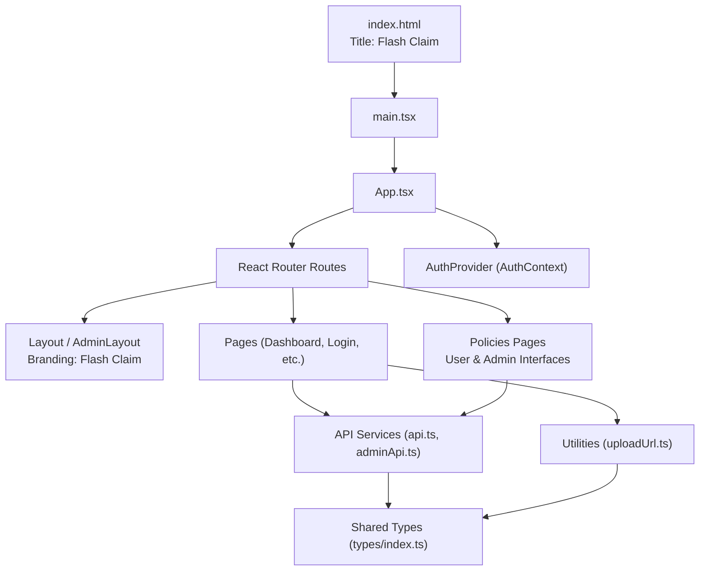

**Diagram sources**
- [index.html:7](file://frontend/index.html#L7)
- [main.tsx:1-11](file://frontend/src/main.tsx#L1-L11)
- [App.tsx:1-75](file://frontend/src/App.tsx#L1-L75)
- [Layout.tsx:33-34](file://frontend/src/components/Layout.tsx#L33-L34)
- [AdminLayout.tsx:36-37](file://frontend/src/components/AdminLayout.tsx#L36-L37)
- [api.ts:1-36](file://frontend/src/services/api.ts#L1-L36)
- [adminApi.ts:1-26](file://frontend/src/services/adminApi.ts#L1-L26)
- [uploadUrl.ts:1-16](file://frontend/src/utils/uploadUrl.ts#L1-L16)
- [types/index.ts:1-270](file://frontend/src/types/index.ts#L1-L270)

**Section sources**
- [index.html:1-14](file://frontend/index.html#L1-L14)
- [main.tsx:1-11](file://frontend/src/main.tsx#L1-L11)
- [App.tsx:1-75](file://frontend/src/App.tsx#L1-L75)

## Core Components
- Authentication Context: Centralized state for user session, token persistence, login/register/logout/profile updates.
- Protected Routes: Guarded routes that enforce authentication for regular users and admins.
- Layouts: Shared chrome for user and admin areas, including navigation and Flash Claim branding with responsive behavior.
- API Services: Axios instances with interceptors for authorization headers and unified error handling.
- Utilities: Centralized functions for common operations like URL resolution for uploaded files.
- Types: Shared TypeScript interfaces for domain entities and responses.

Key responsibilities:
- AuthContext manages lifecycle of auth state and persists tokens locally.
- ProtectedRoute and AdminProtectedRoute ensure only authenticated users access sensitive routes.
- Layout and AdminLayout provide consistent UI shells with Flash Claim branding and navigation.
- api.ts and adminApi.ts centralize HTTP concerns and redirect on unauthorized errors.
- uploadUrl.ts provides centralized URL resolution for uploaded files across environments.
- types/index.ts defines contracts for requests/responses across the app.

**Section sources**
- [AuthContext.tsx:1-82](file://frontend/src/context/AuthContext.tsx#L1-L82)
- [ProtectedRoute.tsx:1-21](file://frontend/src/components/ProtectedRoute.tsx#L1-L21)
- [AdminProtectedRoute.tsx:1-8](file://frontend/src/components/AdminProtectedRoute.tsx#L1-L8)
- [Layout.tsx:1-180](file://frontend/src/components/Layout.tsx#L1-L180)
- [AdminLayout.tsx:1-94](file://frontend/src/components/AdminLayout.tsx#L1-L94)
- [api.ts:1-36](file://frontend/src/services/api.ts#L1-L36)
- [adminApi.ts:1-26](file://frontend/src/services/adminApi.ts#L1-L26)
- [uploadUrl.ts:1-16](file://frontend/src/utils/uploadUrl.ts#L1-L16)
- [types/index.ts:1-270](file://frontend/src/types/index.ts#L1-L270)

## Architecture Overview
The application uses a layered architecture:
- Presentation Layer: Pages and reusable layouts render UI with Flash Claim branding and handle user interactions.
- State Layer: Context API holds global auth state; local component state handles UI specifics.
- Service Layer: Axios services abstract backend communication with centralized interceptors.
- Utility Layer: Centralized functions provide common operations like URL resolution.
- Data Contracts: Shared TypeScript types ensure consistency between UI and API payloads.

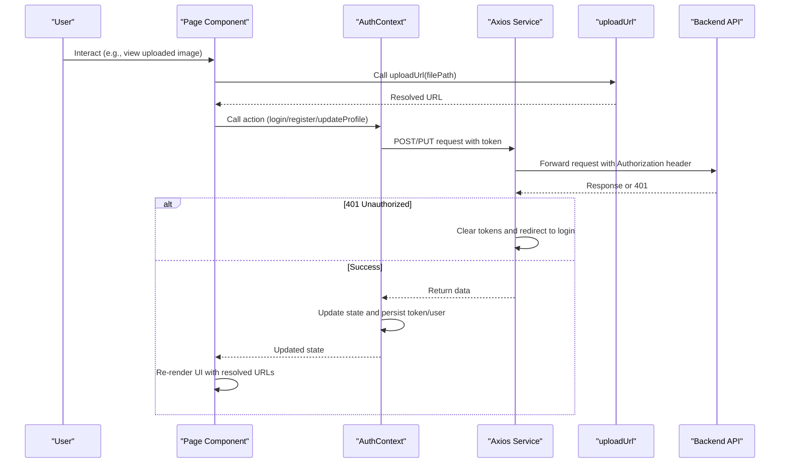

**Diagram sources**
- [AuthContext.tsx:17-66](file://frontend/src/context/AuthContext.tsx#L17-L66)
- [api.ts:7-33](file://frontend/src/services/api.ts#L7-L33)
- [adminApi.ts:5-23](file://frontend/src/services/adminApi.ts#L5-L23)
- [uploadUrl.ts:11-15](file://frontend/src/utils/uploadUrl.ts#L11-L15)

## Detailed Component Analysis

### Routing and Navigation
- Root router wraps the app with BrowserRouter and AuthProvider.
- Public routes: login, register, admin login.
- Protected user routes: dashboard, vehicles, policies, claims, profile.
- Protected admin routes: admin dashboard, users, claims, documents, policies.
- Redirects: root path redirects to dashboard; admin root redirects to admin login.

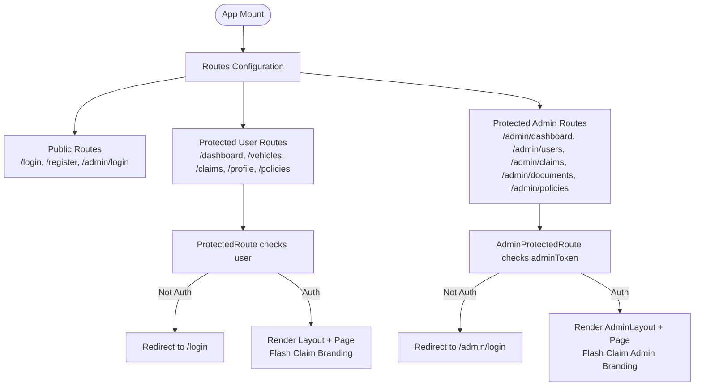

**Diagram sources**
- [App.tsx:37-60](file://frontend/src/App.tsx#L37-L60)
- [ProtectedRoute.tsx:4-20](file://frontend/src/components/ProtectedRoute.tsx#L4-L20)
- [AdminProtectedRoute.tsx:3-7](file://frontend/src/components/AdminProtectedRoute.tsx#L3-L7)

**Section sources**
- [App.tsx:1-75](file://frontend/src/App.tsx#L1-L75)

### Authentication and Global State
- AuthContext exposes user, token, loading, and actions: login, register, logout, updateProfile.
- On mount, if a token exists, it fetches the current profile to hydrate state.
- Login/Register store token and user in localStorage and update context.
- Logout clears context and storage.
- Profile updates refresh user state from server response.

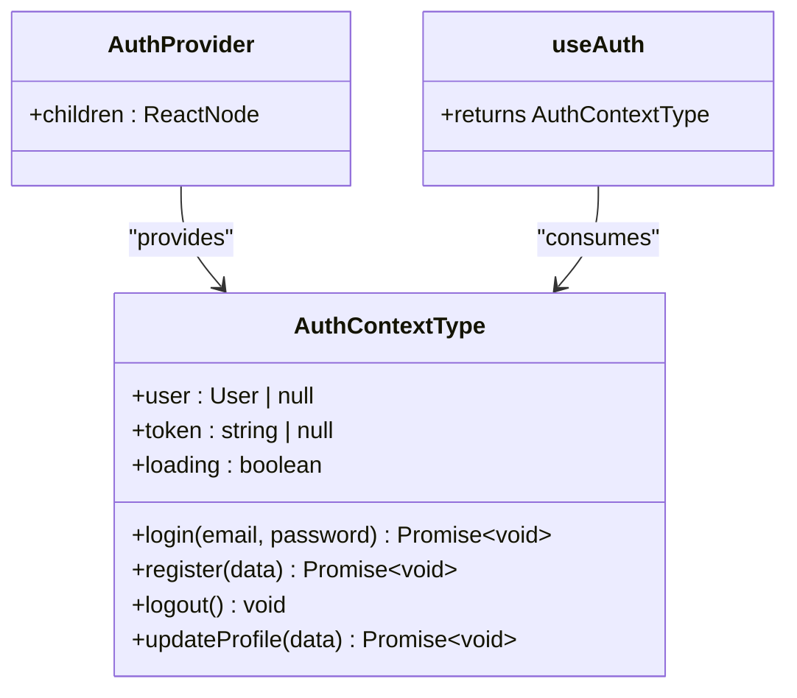

**Diagram sources**
- [AuthContext.tsx:5-15](file://frontend/src/context/AuthContext.tsx#L5-L15)
- [AuthContext.tsx:17-82](file://frontend/src/context/AuthContext.tsx#L17-L82)

**Section sources**
- [AuthContext.tsx:1-82](file://frontend/src/context/AuthContext.tsx#L1-L82)

### Layouts and UI Shell
- User Layout: Desktop sidebar with navigation, mobile header with hamburger menu, bottom nav for quick actions, and main content area. Uses active route detection and responsive breakpoints. Features Flash Claim branding with "Smart Claims" tagline.
- Admin Layout: Fixed dark sidebar with admin navigation and logout flow clearing admin token. Features Flash Claim branding with "Admin Panel" subtitle.

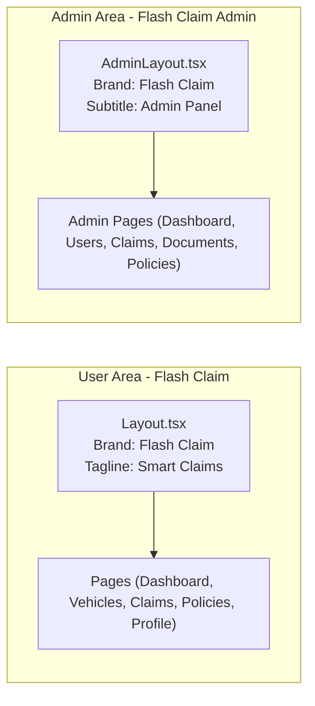

**Diagram sources**
- [Layout.tsx:33-34](file://frontend/src/components/Layout.tsx#L33-L34)
- [AdminLayout.tsx:36-37](file://frontend/src/components/AdminLayout.tsx#L36-L37)

**Section sources**
- [Layout.tsx:1-180](file://frontend/src/components/Layout.tsx#L1-L180)
- [AdminLayout.tsx:1-94](file://frontend/src/components/AdminLayout.tsx#L1-L94)

### API Integration Patterns
- Base URLs: User API at /api, Admin API at /api/admin.
- Request Interceptors: Attach Bearer token from localStorage; set Content-Type unless FormData.
- Response Interceptors: On 401/403, clear tokens and redirect to appropriate login pages.
- Usage: Pages call service methods directly; AuthContext performs auth flows.

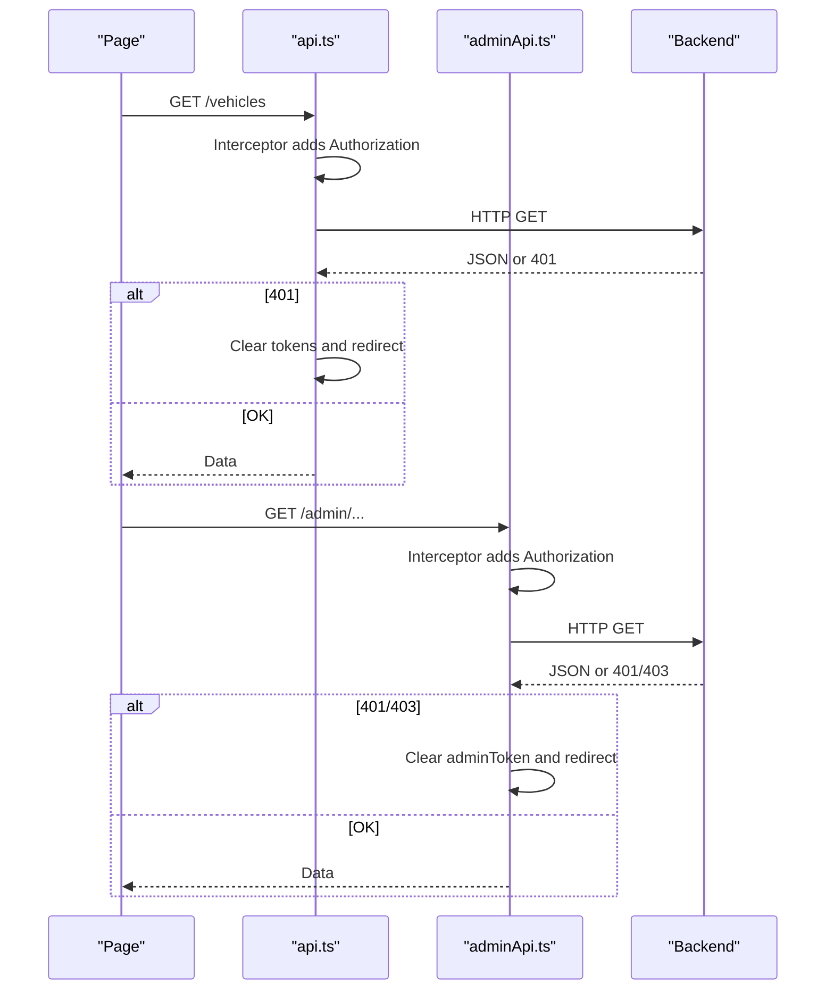

**Diagram sources**
- [api.ts:1-36](file://frontend/src/services/api.ts#L1-L36)
- [adminApi.ts:1-26](file://frontend/src/services/adminApi.ts#L1-L26)

**Section sources**
- [api.ts:1-36](file://frontend/src/services/api.ts#L1-L36)
- [adminApi.ts:1-26](file://frontend/src/services/adminApi.ts#L1-L26)

### Centralized URL Resolution Utilities
- uploadUrl Function: Centralized utility for resolving stored upload paths to full URLs.
- Environment Handling: Automatically handles differences between development (Vite proxy) and production (Railway backend).
- Absolute Path Support: Preserves already absolute URLs without modification.
- Null Safety: Handles null, undefined, and empty string inputs gracefully.

The uploadUrl utility addresses environment-specific differences:
- Development: Uses Vite proxy to forward /uploads → localhost:5000, so relative paths work as-is.
- Production: Prepends VITE_API_URL (Railway backend origin) so browser fetches files directly from Railway, not from Vercel.

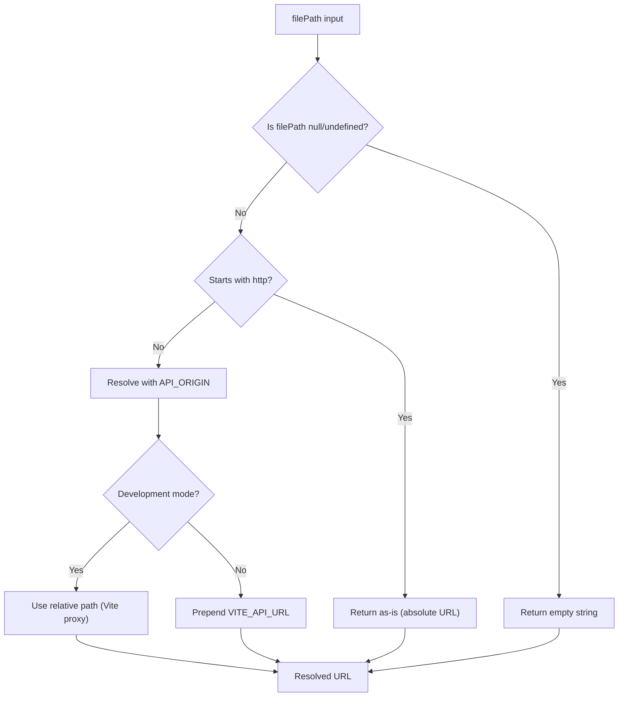

**Diagram sources**
- [uploadUrl.ts:11-15](file://frontend/src/utils/uploadUrl.ts#L11-L15)
- [vite.config.ts:16-26](file://frontend/vite.config.ts#L16-L26)

**Section sources**
- [uploadUrl.ts:1-16](file://frontend/src/utils/uploadUrl.ts#L1-L16)
- [vite.config.ts:16-26](file://frontend/vite.config.ts#L16-L26)

### File Upload Integration in Components
Components integrate the uploadUrl utility for displaying uploaded files:
- ClaimDetailPage: Uses uploadUrl for claim images and document thumbnails.
- AdminClaimDetailPage: Uses uploadUrl for damage assessment images and document previews.
- AdminDocumentsPage: Uses uploadUrl for document thumbnails in the review interface.

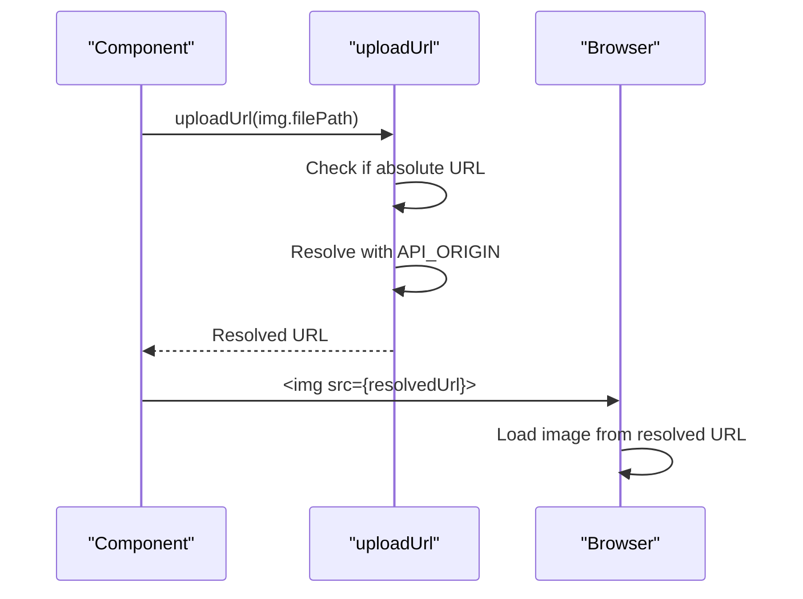

**Diagram sources**
- [ClaimDetailPage.tsx:180](file://frontend/src/pages/ClaimDetailPage.tsx#L180)
- [AdminClaimDetailPage.tsx:215](file://frontend/src/pages/admin/AdminClaimDetailPage.tsx#L215)
- [AdminDocumentsPage.tsx:116](file://frontend/src/pages/admin/AdminDocumentsPage.tsx#L116)
- [uploadUrl.ts:11-15](file://frontend/src/utils/uploadUrl.ts#L11-L15)

**Section sources**
- [ClaimDetailPage.tsx:180](file://frontend/src/pages/ClaimDetailPage.tsx#L180)
- [AdminClaimDetailPage.tsx:215](file://frontend/src/pages/admin/AdminClaimDetailPage.tsx#L215)
- [AdminDocumentsPage.tsx:116](file://frontend/src/pages/admin/AdminDocumentsPage.tsx#L116)

### Styling Approach and Responsive Design
- Tailwind CSS v4 via @tailwindcss/vite plugin.
- Custom theme colors defined in index.css for primary, danger, success, warning palettes.
- Responsive utilities used throughout layouts (hidden lg:flex, sm:p-6, etc.).
- Consistent spacing, typography, and color usage across components.
- Flash Claim branding consistently applied across all user-facing components.

**Section sources**
- [vite.config.ts:1-21](file://frontend/vite.config.ts#L1-L21)
- [index.css:1-39](file://frontend/src/index.css#L1-L39)
- [Layout.tsx:25-176](file://frontend/src/components/Layout.tsx#L25-L176)
- [AdminLayout.tsx:28-90](file://frontend/src/components/AdminLayout.tsx#L28-L90)

### Accessibility Considerations
- Semantic HTML elements (nav, main, aside).
- Keyboard-friendly interactive elements (links, buttons).
- Focus indicators via Tailwind focus classes.
- Descriptive labels and accessible icons paired with text where needed.
- Consider adding ARIA attributes for dynamic overlays (mobile sidebar) and status messages.

### Error Handling and Boundaries
- Axios response interceptors handle 401/403 by clearing tokens and redirecting to login.
- Page-level try/catch blocks display user-friendly errors (e.g., LoginPage).
- Loading states prevent race conditions during auth initialization.
- Note: No explicit React ErrorBoundary wrapper is present in the analyzed files; consider adding one for unhandled exceptions.

**Section sources**
- [api.ts:22-33](file://frontend/src/services/api.ts#L22-L33)
- [adminApi.ts:14-23](file://frontend/src/services/adminApi.ts#L14-L23)
- [LoginPage.tsx:14-27](file://frontend/src/pages/LoginPage.tsx#L14-L27)
- [ProtectedRoute.tsx:7-13](file://frontend/src/components/ProtectedRoute.tsx#L7-L13)

### Build Configuration and Development Workflow
- Vite dev server with proxy rules for /api and /uploads to backend at localhost:5000.
- Scripts: dev, build (TypeScript check then Vite build), lint, preview.
- Plugins: React and Tailwind CSS integrated via Vite plugins.
- Entry: index.html loads main.tsx which mounts React app into #root.
- Environment variables: VITE_API_URL configured for different deployment targets.
- Application title set to "Flash Claim" in index.html.

**Section sources**
- [vite.config.ts:1-21](file://frontend/vite.config.ts#L1-L21)
- [package.json:6-10](file://frontend/package.json#L6-L10)
- [index.html:1-14](file://frontend/index.html#L1-L14)
- [main.tsx:1-11](file://frontend/src/main.tsx#L1-L11)

## Policy Management System

### User Policy Activation Flow
The user-facing PoliciesPage provides a comprehensive interface for managing insurance policies:

- **Existing Policies Display**: Shows user's current policies with status indicators (active/expired)
- **Available Plans Section**: Displays built-in insurance plans grouped by coverage type
- **Plan Activation**: One-click activation of available plans with confirmation dialog
- **Policy Deletion**: Ability to remove policies with confirmation prompts

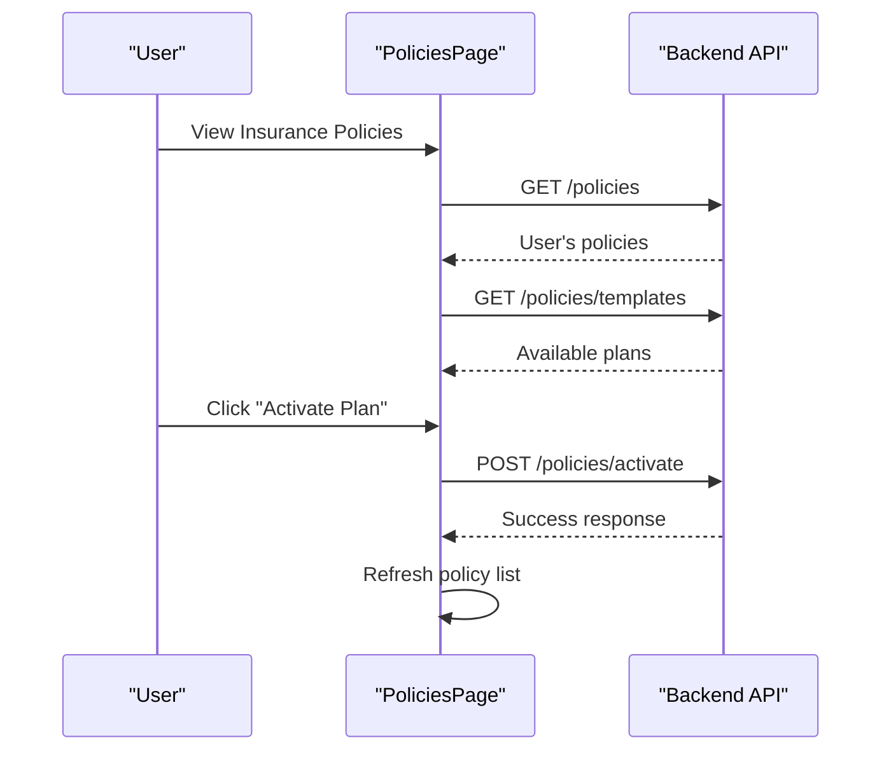

**Diagram sources**
- [PoliciesPage.tsx:13-21](file://frontend/src/pages/PoliciesPage.tsx#L13-L21)
- [PoliciesPage.tsx:25-37](file://frontend/src/pages/PoliciesPage.tsx#L25-L37)

### Admin Template Management
The AdminPoliciesPage provides complete CRUD functionality for managing insurance plan templates:

- **Template Creation**: Form-based creation of new insurance plans with validation
- **Template Editing**: Edit existing plans with pre-populated form fields
- **Active/Inactive Toggle**: Control plan availability to users
- **Template Deletion**: Remove plans with safety warnings about existing policies

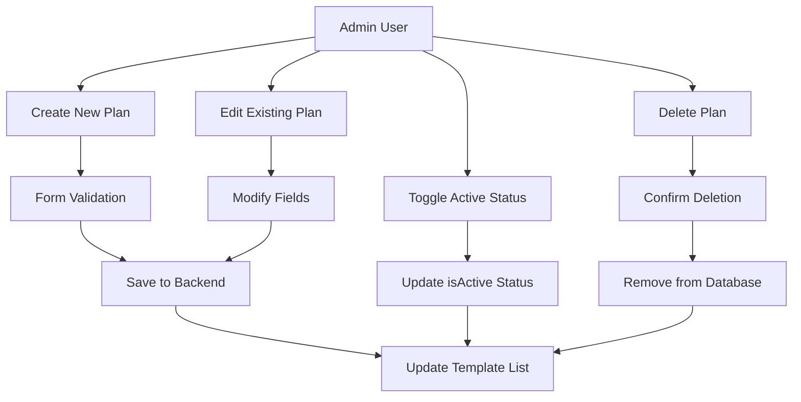

**Diagram sources**
- [AdminPoliciesPage.tsx:62-97](file://frontend/src/pages/admin/AdminPoliciesPage.tsx#L62-L97)
- [AdminPoliciesPage.tsx:99-117](file://frontend/src/pages/admin/AdminPoliciesPage.tsx#L99-L117)

### Policy Data Models
The system uses comprehensive TypeScript interfaces to ensure type safety:

- **PolicyTemplate**: Defines the structure for built-in insurance plans
- **InsurancePolicy**: Represents user-activated policies
- **Enhanced User Model**: Includes latest policy information for admin views

Key fields include coverage type, deductible amounts, annual fees, coverage percentages, and validity periods.

**Section sources**
- [types/index.ts:61-89](file://frontend/src/types/index.ts#L61-L89)
- [PoliciesPage.tsx:1-132](file://frontend/src/pages/PoliciesPage.tsx#L1-L132)
- [AdminPoliciesPage.tsx:1-268](file://frontend/src/pages/admin/AdminPoliciesPage.tsx#L1-L268)

### Navigation Integration
Both user and admin layouts have been updated to include Policy navigation:

- **User Layout**: Added "Policies" link in main navigation with FileText icon
- **Admin Layout**: Added "Policies" link in admin navigation with ShieldCheck icon
- **Responsive Design**: Navigation adapts to mobile and desktop views seamlessly

**Section sources**
- [Layout.tsx:7-13](file://frontend/src/components/Layout.tsx#L7-L13)
- [AdminLayout.tsx:5-13](file://frontend/src/components/AdminLayout.tsx#L5-L13)

## Dependency Analysis
High-level dependencies among core modules:

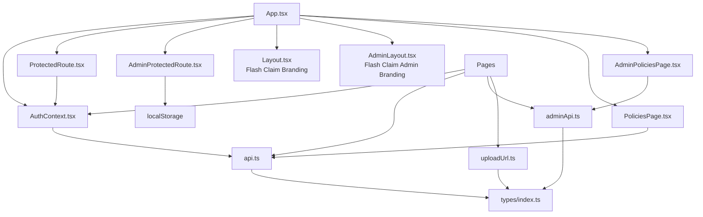

**Diagram sources**
- [App.tsx:1-75](file://frontend/src/App.tsx#L1-L75)
- [AuthContext.tsx:1-82](file://frontend/src/context/AuthContext.tsx#L1-L82)
- [ProtectedRoute.tsx:1-21](file://frontend/src/components/ProtectedRoute.tsx#L1-L21)
- [AdminProtectedRoute.tsx:1-8](file://frontend/src/components/AdminProtectedRoute.tsx#L1-L8)
- [Layout.tsx:1-180](file://frontend/src/components/Layout.tsx#L1-L180)
- [AdminLayout.tsx:1-94](file://frontend/src/components/AdminLayout.tsx#L1-L94)
- [PoliciesPage.tsx:1-132](file://frontend/src/pages/PoliciesPage.tsx#L1-L132)
- [AdminPoliciesPage.tsx:1-268](file://frontend/src/pages/admin/AdminPoliciesPage.tsx#L1-L268)
- [api.ts:1-36](file://frontend/src/services/api.ts#L1-L36)
- [adminApi.ts:1-26](file://frontend/src/services/adminApi.ts#L1-L26)
- [uploadUrl.ts:1-16](file://frontend/src/utils/uploadUrl.ts#L1-L16)
- [types/index.ts:1-270](file://frontend/src/types/index.ts#L1-L270)

**Section sources**
- [App.tsx:1-75](file://frontend/src/App.tsx#L1-L75)
- [types/index.ts:1-270](file://frontend/src/types/index.ts#L1-L270)

## Performance Considerations
- Use code splitting and lazy loading for heavy pages to reduce initial bundle size.
- Leverage React.memo for expensive components when necessary.
- Debounce search inputs and pagination for large lists.
- Optimize images and assets; consider lazy loading images.
- Keep network requests minimal; batch where possible.
- Monitor bundle size and tree-shaking effectiveness.
- Centralized URL resolution reduces redundant logic across components.
- **Policy Management**: Efficient data fetching with parallel API calls for policies and templates.

## Troubleshooting Guide
Common issues and resolutions:
- Unauthorized redirects: Occur when backend returns 401/403; tokens are cleared and user redirected to login. Verify token presence and expiration handling.
- CORS or proxy misconfiguration: Ensure Vite dev proxy targets match backend endpoints. Confirm changeOrigin settings.
- Form submission errors: Check try/catch blocks and error messages displayed in UI. Validate input fields and required attributes.
- Mobile sidebar not closing: Ensure overlay click handlers are bound and state toggles correctly.
- Image loading issues: Verify uploadUrl is properly imported and filePath values are correct. Check environment variable configuration for production deployments.
- Branding inconsistencies: Ensure all user-facing components display "Flash Claim" branding consistently.
- **Policy Issues**: Verify policy template IDs are valid and active before attempting activation. Check backend API endpoints for proper error handling.

**Section sources**
- [api.ts:22-33](file://frontend/src/services/api.ts#L22-L33)
- [adminApi.ts:14-23](file://frontend/src/services/adminApi.ts#L14-L23)
- [LoginPage.tsx:14-27](file://frontend/src/pages/LoginPage.tsx#L14-L27)
- [vite.config.ts:8-19](file://frontend/vite.config.ts#L8-L19)
- [uploadUrl.ts:11-15](file://frontend/src/utils/uploadUrl.ts#L11-L15)

## Conclusion
The frontend is structured around a clear separation of concerns: routing and layout orchestration with Flash Claim branding, centralized authentication state, robust API integration with interceptors, centralized URL resolution utilities for file uploads, and consistent styling with Tailwind CSS. **Updated** The addition of comprehensive policy management capabilities enhances the system's ability to handle insurance plan activation and administration. The modular design supports scalability and maintainability. Adding error boundaries and further performance optimizations will enhance resilience and user experience. The recent branding update to "Flash Claim" provides a more focused and memorable identity for the vehicle insurance claim management system.

## Appendices

### Key Data Models
- User, Vehicle, InsurancePolicy, PolicyTemplate, Claim, Document, ChatMessage, and related types define the domain model used across pages and services.

**Section sources**
- [types/index.ts:1-270](file://frontend/src/types/index.ts#L1-L270)

### Example Page Workflows

#### Dashboard Data Fetch
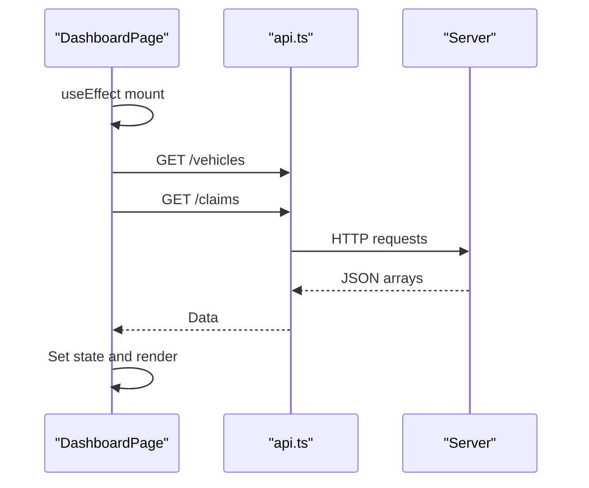

**Diagram sources**
- [DashboardPage.tsx:14-27](file://frontend/src/pages/DashboardPage.tsx#L14-L27)
- [api.ts:1-36](file://frontend/src/services/api.ts#L1-L36)

**Section sources**
- [DashboardPage.tsx:1-142](file://frontend/src/pages/DashboardPage.tsx#L1-L142)

### Upload URL Resolution Examples

#### Image Display Pattern
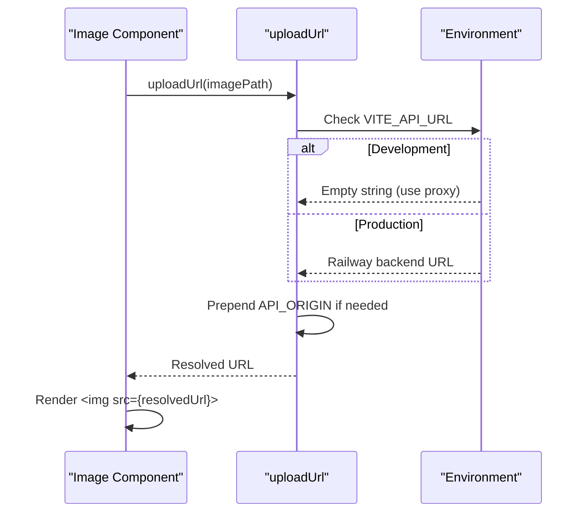

**Diagram sources**
- [uploadUrl.ts:9-15](file://frontend/src/utils/uploadUrl.ts#L9-L15)
- [vite.config.ts:16-26](file://frontend/vite.config.ts#L16-L26)

**Section sources**
- [uploadUrl.ts:1-16](file://frontend/src/utils/uploadUrl.ts#L1-L16)
- [ClaimDetailPage.tsx:180](file://frontend/src/pages/ClaimDetailPage.tsx#L180)
- [AdminClaimDetailPage.tsx:215](file://frontend/src/pages/admin/AdminClaimDetailPage.tsx#L215)
- [AdminDocumentsPage.tsx:116](file://frontend/src/pages/admin/AdminDocumentsPage.tsx#L116)

### Flash Claim Branding Implementation Details

#### Flash Claim Branding Locations
The Flash Claim branding has been consistently applied across all user-facing components:

- **Application Title**: "Flash Claim" in index.html
- **User Layout**: "Flash Claim" with "Smart Claims" tagline in desktop and mobile views
- **Admin Layout**: "Flash Claim" with "Admin Panel" subtitle
- **Login Page**: "Flash Claim" with shield icon branding
- **Registration Page**: "Flash Claim" with shield icon branding  
- **Admin Login**: "Flash Claim" with "Admin Portal" subtitle

**Updated** All branding elements now consistently display "Flash Claim" instead of the previous "FastClaim" branding, providing a more cohesive and professional user experience across the entire application.

**Section sources**
- [index.html:7](file://frontend/index.html#L7)
- [Layout.tsx:33-34](file://frontend/src/components/Layout.tsx#L33-L34)
- [AdminLayout.tsx:36-37](file://frontend/src/components/AdminLayout.tsx#L36-L37)
- [LoginPage.tsx:35](file://frontend/src/pages/LoginPage.tsx#L35)
- [RegisterPage.tsx:37](file://frontend/src/pages/RegisterPage.tsx#L37)
- [AdminLoginPage.tsx:43](file://frontend/src/pages/admin/AdminLoginPage.tsx#L43)

### Policy Management Implementation Details

#### Policy Activation Flow
The policy activation system provides a seamless user experience:

- **Template Discovery**: Users can browse available insurance plans grouped by coverage type
- **Activation Process**: One-click activation with confirmation dialog showing plan details
- **Status Management**: Real-time updates showing active vs expired policies
- **Error Handling**: User-friendly error messages for failed activations

#### Admin Template Management
Administrators have comprehensive control over insurance plan templates:

- **CRUD Operations**: Full create, read, update, delete functionality for plan templates
- **Validation**: Comprehensive form validation ensuring data integrity
- **Status Control**: Ability to toggle plan availability for users
- **Usage Tracking**: Display of active policy counts per template

**Section sources**
- [PoliciesPage.tsx:25-37](file://frontend/src/pages/PoliciesPage.tsx#L25-L37)
- [AdminPoliciesPage.tsx:62-97](file://frontend/src/pages/admin/AdminPoliciesPage.tsx#L62-L97)
- [App.tsx:44](file://frontend/src/App.tsx#L44)
- [App.tsx:57](file://frontend/src/App.tsx#L57)