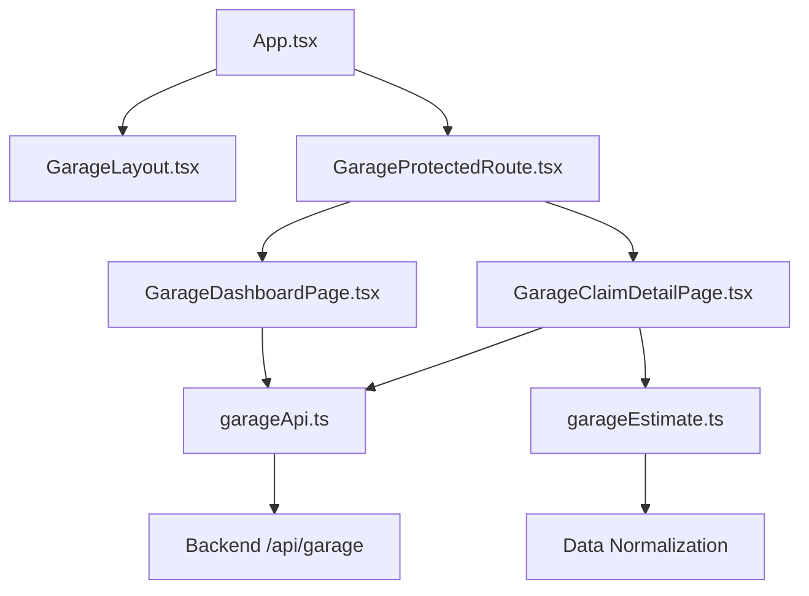
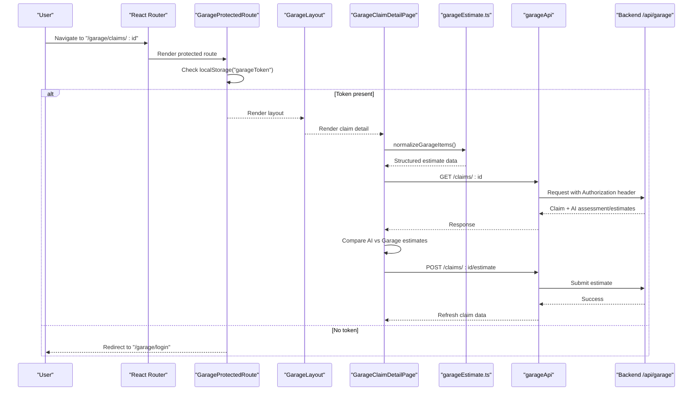
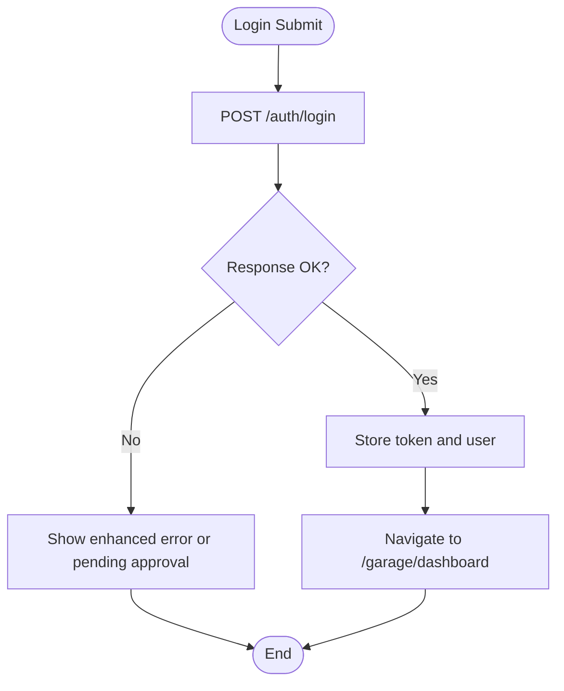
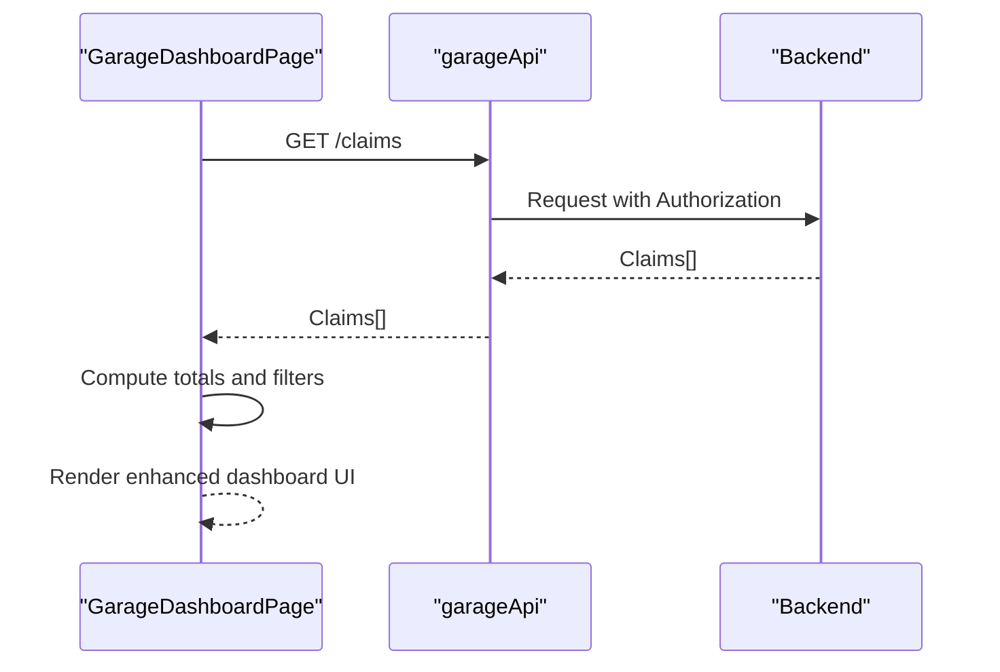
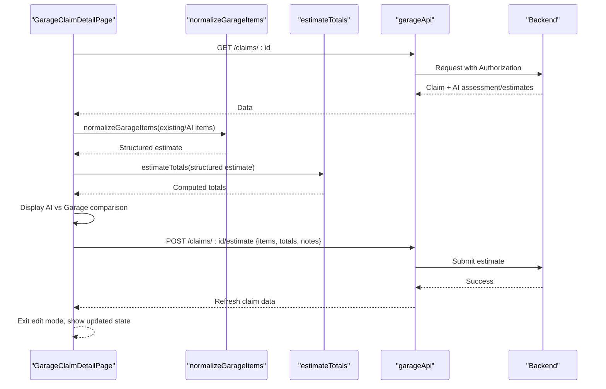
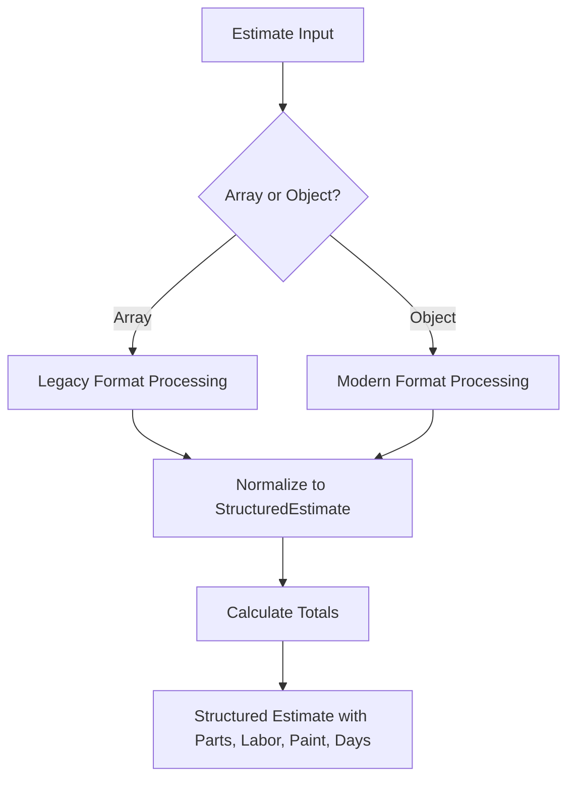
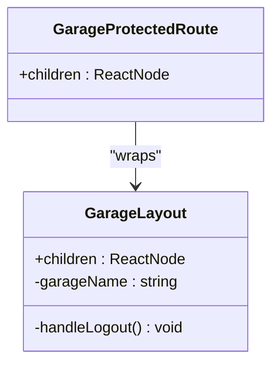
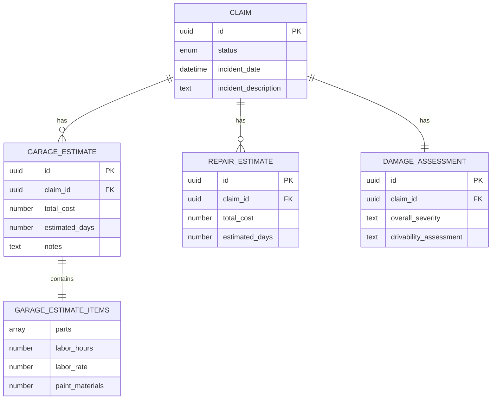
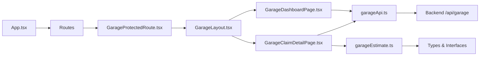

# Garage Frontend Interface

<cite>
**Referenced Files in This Document**
- [App.tsx](file://frontend/src/App.tsx)
- [main.tsx](file://frontend/src/main.tsx)
- [package.json](file://frontend/package.json)
- [GarageDashboardPage.tsx](file://frontend/src/pages/garage/GarageDashboardPage.tsx)
- [GarageClaimDetailPage.tsx](file://frontend/src/pages/garage/GarageClaimDetailPage.tsx)
- [GarageLoginPage.tsx](file://frontend/src/pages/garage/GarageLoginPage.tsx)
- [GarageRegisterPage.tsx](file://frontend/src/pages/garage/GarageRegisterPage.tsx)
- [GarageLayout.tsx](file://frontend/src/components/GarageLayout.tsx)
- [GarageProtectedRoute.tsx](file://frontend/src/components/GarageProtectedRoute.tsx)
- [garageApi.ts](file://frontend/src/services/garageApi.ts)
- [garageEstimate.ts](file://frontend/src/utils/garageEstimate.ts)
- [AuthContext.tsx](file://frontend/src/context/AuthContext.tsx)
- [index.ts](file://frontend/src/types/index.ts)
</cite>

## Update Summary
**Changes Made**
- Enhanced Garage Claim Detail Page with AI vs Garage estimate comparison interface
- Added comprehensive data normalization utilities for handling legacy and current estimate formats
- Improved estimate editing workflow with better user experience and real-time calculations
- Implemented structured estimate processing with normalized labor rates and paint materials
- Enhanced visual comparison between AI-generated and garage-submitted estimates

## Table of Contents
1. [Introduction](#introduction)
2. [Project Structure](#project-structure)
3. [Core Components](#core-components)
4. [Architecture Overview](#architecture-overview)
5. [Detailed Component Analysis](#detailed-component-analysis)
6. [Dependency Analysis](#dependency-analysis)
7. [Performance Considerations](#performance-considerations)
8. [Troubleshooting Guide](#troubleshooting-guide)
9. [Conclusion](#conclusion)

## Introduction
This document describes the Garage Frontend Interface for the Smart Vehicle Insurance Claim System. It focuses on how garage users authenticate, navigate, view assigned claims, and submit repair estimates. The interface is built with React, TypeScript, Vite, Tailwind CSS, and React Router. Authentication and routing are handled via context and route guards, while API calls to the backend are centralized through an Axios instance configured for the garage tenant.

**Updated** Recent improvements include enhanced AI vs garage estimate comparison, improved data normalization utilities, better estimate editing workflows, and enhanced responsive design across all garage portal pages.

## Project Structure
The frontend is organized by feature areas:
- Pages: User-facing screens grouped by role (user, admin, garage). Garage pages include login, registration, dashboard, and claim detail.
- Components: Shared UI shells and route guards, including a dedicated garage layout and protected route wrapper.
- Services: HTTP clients for different roles; the garage client handles token injection and 401/403 handling.
- Utils: Specialized utilities for garage estimate processing and data normalization.
- Context: Global authentication state for regular users (not used by garage flows).
- Types: Shared TypeScript interfaces for claims, vehicles, estimates, and garage entities.

**Diagram sources**
- [App.tsx:30-66](file://frontend/src/App.tsx#L30-L66)
- [GarageLayout.tsx:9-72](file://frontend/src/components/GarageLayout.tsx#L9-L72)
- [GarageProtectedRoute.tsx:3-7](file://frontend/src/components/GarageProtectedRoute.tsx#L3-L7)
- [GarageDashboardPage.tsx:13-119](file://frontend/src/pages/garage/GarageDashboardPage.tsx#L13-L119)
- [GarageClaimDetailPage.tsx:19-355](file://frontend/src/pages/garage/GarageClaimDetailPage.tsx#L19-L355)
- [garageEstimate.ts:1-49](file://frontend/src/utils/garageEstimate.ts#L1-L49)
- [garageApi.ts:1-31](file://frontend/src/services/garageApi.ts#L1-L31)

**Section sources**
- [App.tsx:30-66](file://frontend/src/App.tsx#L30-L66)
- [package.json:1-32](file://frontend/package.json#L1-L32)

## Core Components
- Garage Layout: Provides sidebar navigation, logout, and displays the current garage name from local storage.
- Garage Protected Route: Guards routes by checking for a stored garage token; redirects to login if missing.
- Garage API Client: Centralized Axios instance that injects Authorization headers and clears session on 401/403.
- Garage Dashboard Page: Lists all assigned claims, highlights pending review items, and shows summary metrics with enhanced responsive design.
- Garage Claim Detail Page: Displays vehicle and incident details, AI assessment when available, and allows editing/submission of repair estimates with AI vs garage comparison.
- Garage Estimate Utilities: Handles data normalization for both legacy and current estimate formats, providing consistent structure for processing.
- Garage Login/Register Pages: Handle authentication and registration flows with improved error handling, pending approval states, and better mobile responsiveness.

**Updated** All garage portal pages now feature consistent styling with dark theme support, improved mobile responsiveness, enhanced user interface elements including better status indicators and progress feedback, and advanced estimate comparison features.

**Section sources**
- [GarageLayout.tsx:9-72](file://frontend/src/components/GarageLayout.tsx#L9-L72)
- [GarageProtectedRoute.tsx:3-7](file://frontend/src/components/GarageProtectedRoute.tsx#L3-L7)
- [garageApi.ts:1-31](file://frontend/src/services/garageApi.ts#L1-L31)
- [GarageDashboardPage.tsx:13-119](file://frontend/src/pages/garage/GarageDashboardPage.tsx#L13-L119)
- [GarageClaimDetailPage.tsx:19-355](file://frontend/src/pages/garage/GarageClaimDetailPage.tsx#L19-L355)
- [garageEstimate.ts:1-49](file://frontend/src/utils/garageEstimate.ts#L1-L49)
- [GarageLoginPage.tsx:6-105](file://frontend/src/pages/garage/GarageLoginPage.tsx#L6-L105)
- [GarageRegisterPage.tsx:6-144](file://frontend/src/pages/garage/GarageRegisterPage.tsx#L6-L144)

## Architecture Overview
The garage portal uses role-based routing and a dedicated API client. On first load, App sets up routes and wraps garage routes with a protected component that enforces authentication. Garage pages call the garage API client which automatically attaches tokens and handles unauthorized responses by clearing local storage and redirecting to login. The claim detail page now includes sophisticated estimate comparison and data normalization capabilities.

**Diagram sources**
- [App.tsx:58-63](file://frontend/src/App.tsx#L58-L63)
- [GarageProtectedRoute.tsx:3-7](file://frontend/src/components/GarageProtectedRoute.tsx#L3-L7)
- [GarageLayout.tsx:9-72](file://frontend/src/components/GarageLayout.tsx#L9-L72)
- [GarageClaimDetailPage.tsx:21-35](file://frontend/src/pages/garage/GarageClaimDetailPage.tsx#L21-L35)
- [garageEstimate.ts:17-39](file://frontend/src/utils/garageEstimate.ts#L17-L39)
- [garageApi.ts:7-14](file://frontend/src/services/garageApi.ts#L7-L14)

## Detailed Component Analysis

### Garage Authentication Flow
- Login: Submits credentials to the garage auth endpoint, stores token and user info, then navigates to the dashboard. Errors include a special "pending approval" message path with enhanced visual feedback.
- Register: Submits garage details; success indicates account creation with pending admin approval and provides clear next steps.
- Protected Routes: Any attempt to access garage routes without a valid token redirects to login.

**Updated** Enhanced error handling with visual distinction between regular errors and pending approval states, improved loading states, and better mobile responsiveness.

**Diagram sources**
- [GarageLoginPage.tsx:14-33](file://frontend/src/pages/garage/GarageLoginPage.tsx#L14-L33)
- [garageApi.ts:16-28](file://frontend/src/services/garageApi.ts#L16-L28)

**Section sources**
- [GarageLoginPage.tsx:6-105](file://frontend/src/pages/garage/GarageLoginPage.tsx#L6-L105)
- [GarageRegisterPage.tsx:6-144](file://frontend/src/pages/garage/GarageRegisterPage.tsx#L6-L144)
- [GarageProtectedRoute.tsx:3-7](file://frontend/src/components/GarageProtectedRoute.tsx#L3-L7)

### Garage Dashboard
- Loads all assigned claims and computes summary metrics (total, pending review, estimated).
- Highlights claims awaiting review and provides quick links to claim details.
- Uses status colors to visually differentiate claim states with enhanced responsive design.
- Features improved mobile layout with grid-based statistics cards and better spacing.

**Updated** Enhanced dashboard with responsive grid layout, improved visual hierarchy, better mobile responsiveness, and enhanced status indicators with color-coded badges.

**Diagram sources**
- [GarageDashboardPage.tsx:17-19](file://frontend/src/pages/garage/GarageDashboardPage.tsx#L17-L19)
- [garageApi.ts:7-14](file://frontend/src/services/garageApi.ts#L7-L14)

**Section sources**
- [GarageDashboardPage.tsx:13-119](file://frontend/src/pages/garage/GarageDashboardPage.tsx#L13-L119)

### Enhanced Garage Claim Detail and Estimate Submission
- Fetches claim details, pre-populating estimate items from either existing garage estimate or AI-generated estimate using normalized data structure.
- Computes totals for parts, labor, paint materials, and estimated days with real-time updates.
- Allows adding/removing items, editing fields, and submitting the final estimate.
- Shows AI assessment when available and warns if it is still pending.
- **New Feature**: Displays AI vs Garage estimate comparison with cost differences and day estimates.

**Diagram sources**
- [GarageClaimDetailPage.tsx:21-35](file://frontend/src/pages/garage/GarageClaimDetailPage.tsx#L21-L35)
- [garageEstimate.ts:17-39](file://frontend/src/utils/garageEstimate.ts#L17-L39)
- [garageEstimate.ts:41-48](file://frontend/src/utils/garageEstimate.ts#L41-L48)
- [GarageClaimDetailPage.tsx:67-79](file://frontend/src/pages/garage/GarageClaimDetailPage.tsx#L67-L79)
- [garageApi.ts:7-14](file://frontend/src/services/garageApi.ts#L7-L14)

**Section sources**
- [GarageClaimDetailPage.tsx:19-355](file://frontend/src/pages/garage/GarageClaimDetailPage.tsx#L19-L355)

### Garage Estimate Utilities and Data Normalization
- **New Utility Module**: Provides standardized processing for both legacy array-based estimates and current object-based estimates.
- **Legacy Format Support**: Converts old format where labor hours/rate and paint materials were stored per item into unified structure.
- **Current Format Support**: Processes modern format with separate parts list, labor hours, labor rate, and paint materials.
- **Real-time Calculations**: Computes total costs, labor costs, and estimated days based on input changes.
- **Default Values**: Applies sensible defaults like DEFAULT_LABOR_RATE (Rs. 3500/hour) when values are missing.

**Diagram sources**
- [garageEstimate.ts:17-39](file://frontend/src/utils/garageEstimate.ts#L17-L39)
- [garageEstimate.ts:41-48](file://frontend/src/utils/garageEstimate.ts#L41-L48)

**Section sources**
- [garageEstimate.ts:1-49](file://frontend/src/utils/garageEstimate.ts#L1-L49)

### Garage Layout and Navigation
- Renders a fixed sidebar with navigation links for Dashboard and Claims.
- Displays the logged-in garage name from local storage and provides a sign-out action that clears session and redirects to login.

**Diagram sources**
- [GarageLayout.tsx:9-72](file://frontend/src/components/GarageLayout.tsx#L9-L72)
- [GarageProtectedRoute.tsx:3-7](file://frontend/src/components/GarageProtectedRoute.tsx#L3-L7)

**Section sources**
- [GarageLayout.tsx:9-72](file://frontend/src/components/GarageLayout.tsx#L9-L72)

### Data Models Used by Garage Pages
- Claim, GarageEstimate, RepairEstimate, DamageAssessment, and related types define the shape of data displayed and submitted by garage pages.
- **Enhanced**: New structured estimate format supporting both legacy and current data structures with normalized labor rates and paint materials.

**Diagram sources**
- [index.ts:131-198](file://frontend/src/types/index.ts#L131-L198)
- [garageEstimate.ts:8-13](file://frontend/src/utils/garageEstimate.ts#L8-L13)

**Section sources**
- [index.ts:131-198](file://frontend/src/types/index.ts#L131-L198)

## Dependency Analysis
- Routing: App defines routes for garage login, register, dashboard, and claim detail. Garage routes are wrapped with GarageProtectedRoute and rendered inside GarageLayout.
- Auth State: Regular user auth is managed via AuthContext; garage auth is handled locally via localStorage and the garage API interceptor.
- API Layer: garageApi centralizes base URL configuration, Authorization header injection, and 401/403 handling.
- Utils Layer: garageEstimate provides data normalization and calculation utilities for consistent estimate processing.
- UI Dependencies: Tailwind CSS for styling, Lucide icons for visuals, React Router for navigation.

**Diagram sources**
- [App.tsx:30-66](file://frontend/src/App.tsx#L30-L66)
- [GarageProtectedRoute.tsx:3-7](file://frontend/src/components/GarageProtectedRoute.tsx#L3-L7)
- [GarageLayout.tsx:9-72](file://frontend/src/components/GarageLayout.tsx#L9-L72)
- [GarageDashboardPage.tsx:17-19](file://frontend/src/pages/garage/GarageDashboardPage.tsx#L17-L19)
- [GarageClaimDetailPage.tsx:21-35](file://frontend/src/pages/garage/GarageClaimDetailPage.tsx#L21-L35)
- [garageEstimate.ts:1-49](file://frontend/src/utils/garageEstimate.ts#L1-L49)
- [garageApi.ts:1-31](file://frontend/src/services/garageApi.ts#L1-L31)

**Section sources**
- [App.tsx:30-66](file://frontend/src/App.tsx#L30-L66)
- [garageApi.ts:1-31](file://frontend/src/services/garageApi.ts#L1-L31)
- [garageEstimate.ts:1-49](file://frontend/src/utils/garageEstimate.ts#L1-L49)
- [AuthContext.tsx:17-82](file://frontend/src/context/AuthContext.tsx#L17-L82)

## Performance Considerations
- Minimize re-renders: Use memoization for computed totals in claim detail to avoid unnecessary recalculations.
- Efficient list rendering: Ensure stable keys for claim lists to optimize reconciliation.
- Network requests: Debounce or coalesce repeated requests where applicable; leverage caching strategies at the service layer if needed.
- Image loading: Lazy-load images in galleries to reduce initial payload and improve perceived performance.
- **Updated** Responsive design optimizations ensure optimal performance across different screen sizes and devices.
- **New**: Data normalization utilities provide efficient processing of both legacy and current estimate formats without redundant calculations.

## Troubleshooting Guide
- Unauthorized access: If a request returns 401/403, the garage API interceptor clears local storage and redirects to login. Verify token presence and validity before making requests.
- Pending approval: Login may return a specific message indicating the garage account is pending admin approval. In this case, inform the user to wait for approval with enhanced visual feedback.
- Missing data: If claim detail does not show AI assessment or estimates, ensure backend has processed assessments and estimates; fallback behavior allows manual entry.
- Navigation issues: Confirm routes are correctly defined in App and that protected routes are wrapping the intended components.
- **Updated** Enhanced error handling provides better user feedback for common issues including network errors, authentication problems, and form validation failures.
- **New**: Estimate normalization issues - if estimates don't display correctly, verify that the data format matches expected structure (either legacy array format or modern object format).

**Section sources**
- [garageApi.ts:16-28](file://frontend/src/services/garageApi.ts#L16-L28)
- [GarageLoginPage.tsx:25-32](file://frontend/src/pages/garage/GarageLoginPage.tsx#L25-L32)
- [GarageClaimDetailPage.tsx:108-110](file://frontend/src/pages/garage/GarageClaimDetailPage.tsx#L108-L110)
- [garageEstimate.ts:17-39](file://frontend/src/utils/garageEstimate.ts#L17-L39)

## Conclusion
The Garage Frontend Interface provides a focused, secure, and efficient experience for garage users to manage assigned claims and submit repair estimates. Recent improvements include enhanced AI vs garage estimate comparison, comprehensive data normalization utilities, improved estimate editing workflows, enhanced responsive design, consistent styling across all garage portal pages, better mobile responsiveness, and improved user interface elements. The interface leverages React Router for navigation, a dedicated API client for authenticated requests, clear UI patterns for dashboards and detailed workflows, and sophisticated estimate processing capabilities. The design supports both AI-assisted insights and manual adjustments, ensuring flexibility and accuracy in the estimation process with enhanced user experience across all devices. The new garageEstimate utilities provide robust handling of both legacy and current data formats, making the system more maintainable and future-proof.