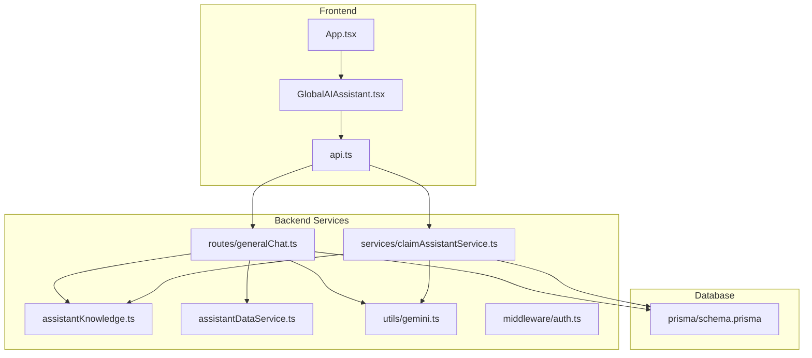
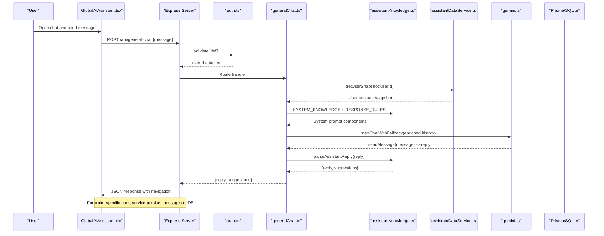
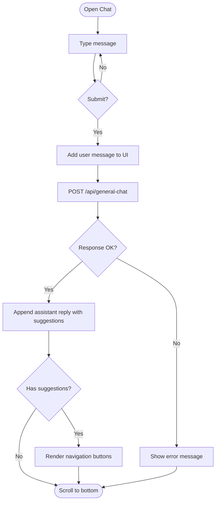
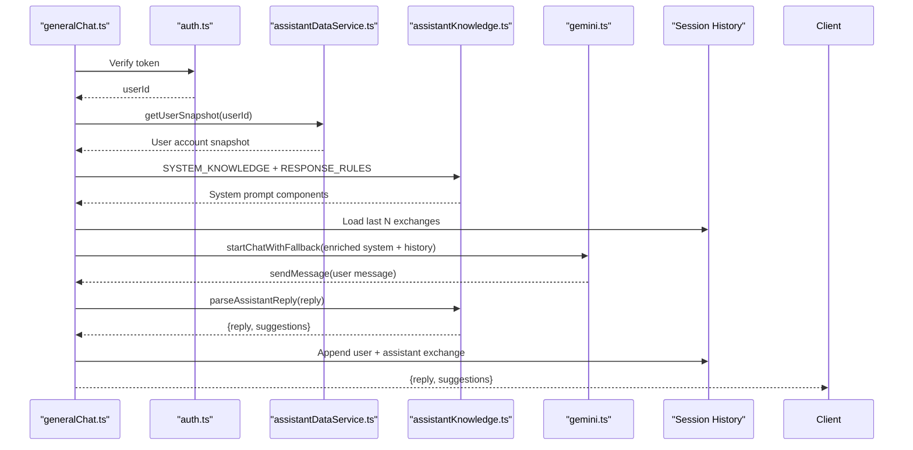
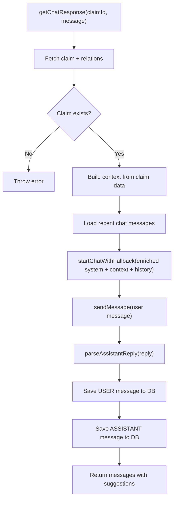
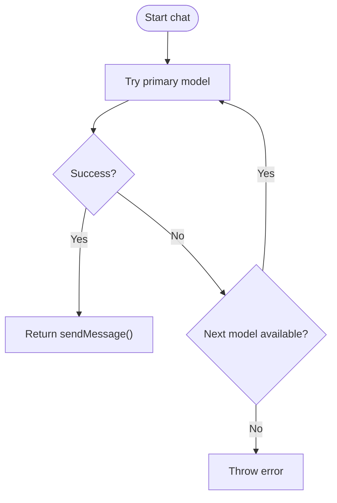
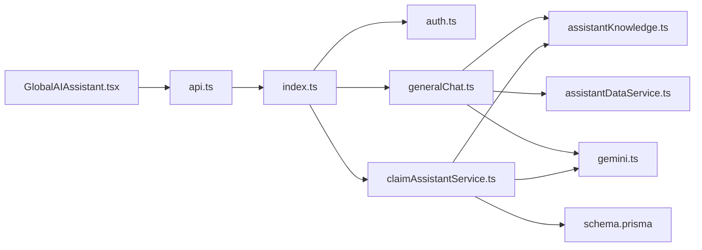

# Global AI Assistant

<cite>
**Referenced Files in This Document**
- [index.ts](file://backend/src/index.ts)
- [generalChat.ts](file://backend/src/routes/generalChat.ts)
- [claimAssistantService.ts](file://backend/src/services/claimAssistantService.ts)
- [assistantKnowledge.ts](file://backend/src/services/assistantKnowledge.ts)
- [assistantDataService.ts](file://backend/src/services/assistantDataService.ts)
- [gemini.ts](file://backend/src/utils/gemini.ts)
- [auth.ts](file://backend/src/middleware/auth.ts)
- [schema.prisma](file://backend/prisma/schema.prisma)
- [GlobalAIAssistant.tsx](file://frontend/src/components/GlobalAIAssistant.tsx)
- [api.ts](file://frontend/src/services/api.ts)
- [App.tsx](file://frontend/src/App.tsx)
- [package.json](file://backend/package.json)
</cite>

## Update Summary
**Changes Made**
- Added comprehensive knowledge base system with Flash Claim platform information
- Integrated user data context for personalized responses
- Implemented secure navigation suggestion system with route validation
- Enhanced both general chat and claim-specific assistants with contextual awareness
- Updated frontend to display interactive navigation suggestions

## Table of Contents
1. [Introduction](#introduction)
2. [Project Structure](#project-structure)
3. [Core Components](#core-components)
4. [Architecture Overview](#architecture-overview)
5. [Detailed Component Analysis](#detailed-component-analysis)
6. [Knowledge Base System](#knowledge-base-system)
7. [User Data Context Integration](#user-data-context-integration)
8. [Navigation Suggestions System](#navigation-suggestions-system)
9. [Dependency Analysis](#dependency-analysis)
10. [Performance Considerations](#performance-considerations)
11. [Troubleshooting Guide](#troubleshooting-guide)
12. [Conclusion](#conclusion)

## Introduction
This document explains the enhanced Global AI Assistant integrated into a vehicle insurance claim system. The assistant now provides intelligent, context-aware responses through two modes:
- General chat for policyholders to ask questions about claims, documents, processes, and their personal account data
- Claim-specific chat that uses stored claim context (vehicle, policy, damage assessment, repair estimate, payout, documents, and conversation history) to provide personalized guidance

The assistant features a comprehensive knowledge base containing detailed information about Flash Claim's architecture, policyholder pages, claim lifecycle, and common scenarios. It includes real-time user data context and offers secure navigation suggestions to guide users through the application.

The frontend exposes a floating chat widget that communicates with backend endpoints protected by authentication. The backend integrates Google Gemini models with a robust fallback strategy and persists claim-related conversations in the database.

## Project Structure
The application is split into a TypeScript Express backend and a React frontend. Key areas relevant to the enhanced Global AI Assistant include:
- Backend entrypoint and route registration
- Authentication middleware
- Knowledge base service with system prompts and response rules
- User data context service providing read-only account snapshots
- General chat route with in-memory session history and navigation suggestions
- Claim assistant service using Gemini with fallback
- Database schema including chat messages
- Frontend chat component with navigation suggestion display

**Diagram sources**
- [index.ts:28-51](file://backend/src/index.ts#L28-L51)
- [generalChat.ts:1-73](file://backend/src/routes/generalChat.ts#L1-L73)
- [claimAssistantService.ts:1-121](file://backend/src/services/claimAssistantService.ts#L1-L121)
- [assistantKnowledge.ts:1-189](file://backend/src/services/assistantKnowledge.ts#L1-L189)
- [assistantDataService.ts:1-135](file://backend/src/services/assistantDataService.ts#L1-L135)
- [gemini.ts:1-142](file://backend/src/utils/gemini.ts#L1-L142)
- [schema.prisma:194-207](file://backend/prisma/schema.prisma#L194-L207)
- [GlobalAIAssistant.tsx:1-181](file://frontend/src/components/GlobalAIAssistant.tsx#L1-L181)
- [api.ts:1-40](file://frontend/src/services/api.ts#L1-L40)
- [App.tsx:30-67](file://frontend/src/App.tsx#L30-L67)

**Section sources**
- [index.ts:28-51](file://backend/src/index.ts#L28-L51)
- [App.tsx:30-67](file://frontend/src/App.tsx#L30-L67)

## Core Components
- **Enhanced Frontend Chat Widget**: A floating UI that opens a chat panel, sends user messages, displays assistant replies with navigation suggestions, and clears history. It attaches an auth token via an Axios interceptor and renders interactive navigation buttons.
- **Knowledge Base Service**: Provides comprehensive system knowledge about Flash Claim's architecture, policyholder pages, claim lifecycle, and common scenarios, along with strict response formatting rules.
- **User Data Context Service**: Generates read-only snapshots of authenticated user's vehicles, policies, and claims for personalized responses.
- **General Chat Route**: Protects endpoints with JWT, maintains per-user in-memory conversation history, fetches live user data, and calls Gemini with enriched system prompts.
- **Claim Assistant Service**: Builds rich context from the claim's related entities and persists both user and assistant messages to the database.
- **Gemini Integration**: Provides model cascade fallback and retry logic for resilience against rate limits or transient errors.
- **Authentication Middleware**: Validates Bearer tokens and attaches userId to requests.
- **Database Schema**: Defines ChatMessage and related entities used to store and retrieve conversation context.

**Section sources**
- [GlobalAIAssistant.tsx:24-181](file://frontend/src/components/GlobalAIAssistant.tsx#L24-L181)
- [api.ts:7-24](file://frontend/src/services/api.ts#L7-L24)
- [assistantKnowledge.ts:24-132](file://backend/src/services/assistantKnowledge.ts#L24-L132)
- [assistantDataService.ts:9-135](file://backend/src/services/assistantDataService.ts#L9-L135)
- [generalChat.ts:15-73](file://backend/src/routes/generalChat.ts#L15-L73)
- [claimAssistantService.ts:12-121](file://backend/src/services/claimAssistantService.ts#L12-L121)
- [gemini.ts:52-139](file://backend/src/utils/gemini.ts#L52-L139)
- [auth.ts:5-22](file://backend/src/middleware/auth.ts#L5-L22)
- [schema.prisma:194-207](file://backend/prisma/schema.prisma#L194-L207)

## Architecture Overview
The enhanced assistant follows a layered architecture with integrated knowledge base and user context:
- **Presentation Layer (React)**: Renders the chat widget with navigation suggestions and handles user interactions.
- **API Layer (Express)**: Routes protect sensitive operations, validate inputs, orchestrate services, and integrate user context.
- **Service Layer**: Encapsulates business logic, including knowledge base management, user data context assembly, and conversation persistence.
- **Knowledge Base Layer**: Provides standardized system knowledge and response formatting rules.
- **AI Integration Layer**: Communicates with Google Gemini, handling retries and fallbacks.
- **Data Layer**: Prisma ORM over SQLite stores users, claims, policies, vehicles, documents, and chat messages.

**Diagram sources**
- [GlobalAIAssistant.tsx:38-53](file://frontend/src/components/GlobalAIAssistant.tsx#L38-L53)
- [api.ts:11-24](file://frontend/src/services/api.ts#L11-L24)
- [index.ts:43-51](file://backend/src/index.ts#L43-L51)
- [auth.ts:5-22](file://backend/src/middleware/auth.ts#L5-L22)
- [generalChat.ts:23-59](file://backend/src/routes/generalChat.ts#L23-L59)
- [assistantDataService.ts:9-135](file://backend/src/services/assistantDataService.ts#L9-L135)
- [assistantKnowledge.ts:158-189](file://backend/src/services/assistantKnowledge.ts#L158-L189)
- [gemini.ts:97-139](file://backend/src/utils/gemini.ts#L97-L139)

## Detailed Component Analysis

### Enhanced Frontend Chat Widget
- **Responsibilities**:
  - Toggle chat panel visibility and auto-scroll to latest messages.
  - Send user messages to the backend and display assistant responses with navigation suggestions.
  - Provide quick question prompts and clear conversation history.
  - Render interactive navigation buttons that close the chat and navigate to specified routes.
- **State management**:
  - Local state tracks open/closed, messages array with suggestions, input text, and loading indicator.
- **API integration**:
  - Uses an Axios instance that automatically attaches Bearer tokens and handles 401 redirects.
  - Processes navigation suggestions from backend responses.
- **UX considerations**:
  - Shows typing indicators while waiting for responses.
  - Supports clearing history via a DELETE request.
  - Displays navigation suggestions as clickable buttons below assistant messages.

**Diagram sources**
- [GlobalAIAssistant.tsx:38-53](file://frontend/src/components/GlobalAIAssistant.tsx#L38-L53)
- [GlobalAIAssistant.tsx:130-144](file://frontend/src/components/GlobalAIAssistant.tsx#L130-L144)
- [api.ts:11-24](file://frontend/src/services/api.ts#L11-L24)

**Section sources**
- [GlobalAIAssistant.tsx:24-181](file://frontend/src/components/GlobalAIAssistant.tsx#L24-L181)
- [api.ts:11-24](file://frontend/src/services/api.ts#L11-L24)

### Enhanced General Chat Route
- **Security**: Protected by JWT middleware; requires Authorization header.
- **Session history**: Maintains per-user in-memory history limited to a fixed number of exchanges to control memory usage.
- **Context enrichment**: Fetches live user data and combines it with system knowledge and response rules.
- **Prompting**: Injects comprehensive system prompt defining scope, tone, user context, and navigation guidelines, then appends prior exchanges before calling Gemini.
- **Response processing**: Parses assistant replies to extract navigation suggestions and strips markdown emphasis.
- **Persistence**: General chat does not persist messages to the database; it relies on in-memory storage per session.

**Diagram sources**
- [generalChat.ts:23-59](file://backend/src/routes/generalChat.ts#L23-L59)
- [assistantDataService.ts:9-135](file://backend/src/services/assistantDataService.ts#L9-L135)
- [assistantKnowledge.ts:24-132](file://backend/src/services/assistantKnowledge.ts#L24-L132)
- [auth.ts:5-22](file://backend/src/middleware/auth.ts#L5-L22)
- [gemini.ts:97-139](file://backend/src/utils/gemini.ts#L97-L139)

**Section sources**
- [generalChat.ts:15-73](file://backend/src/routes/generalChat.ts#L15-L73)

### Enhanced Claim Assistant Service
- **Context assembly**:
  - Retrieves claim details along with vehicle, policy, damage assessment, repair estimate, insurance payout, documents, and recent chat messages.
  - Constructs a structured context string summarizing status, vehicle info, incident details, coverage, damages, costs, and document verification statuses.
  - Integrates shared knowledge base for consistent system understanding.
- **Conversation history**:
  - Loads recent messages and converts roles to match Gemini format.
- **AI interaction**:
  - Starts a chat session with enriched system prompt including claim context and shared knowledge, then sends the user message.
- **Response processing**:
  - Parses assistant replies to extract navigation suggestions and strip markdown emphasis.
- **Persistence**:
  - Saves both user and assistant messages to the database linked to the claim.

**Diagram sources**
- [claimAssistantService.ts:12-121](file://backend/src/services/claimAssistantService.ts#L12-L121)
- [assistantKnowledge.ts:158-189](file://backend/src/services/assistantKnowledge.ts#L158-L189)
- [schema.prisma:194-207](file://backend/prisma/schema.prisma#L194-L207)

**Section sources**
- [claimAssistantService.ts:12-121](file://backend/src/services/claimAssistantService.ts#L12-L121)
- [schema.prisma:194-207](file://backend/prisma/schema.prisma#L194-L207)

### Gemini Integration with Fallback
- **Model cascade**:
  - Attempts multiple models in order of preference, logging when fallback is used.
- **Retry logic**:
  - Retries once per model on retryable errors (e.g., rate limits, server errors) with exponential backoff.
- **Chat sessions**:
  - Initializes a chat with provided history and returns a sendMessage function that also includes retry logic.

**Diagram sources**
- [gemini.ts:52-91](file://backend/src/utils/gemini.ts#L52-L91)
- [gemini.ts:97-139](file://backend/src/utils/gemini.ts#L97-L139)

**Section sources**
- [gemini.ts:52-91](file://backend/src/utils/gemini.ts#L52-L91)
- [gemini.ts:97-139](file://backend/src/utils/gemini.ts#L97-L139)

### Authentication Middleware
- Validates presence and format of Authorization header.
- Verifies JWT and attaches userId to the request object.
- Returns 401 for missing or invalid tokens.

**Section sources**
- [auth.ts:5-22](file://backend/src/middleware/auth.ts#L5-L22)

### Database Schema Highlights
- **ChatMessage**: Stores role, content, and timestamps per claim.
- **Related entities**: User, Vehicle, InsurancePolicy, Claim, DamageAssessment, RepairEstimate, InsurancePayout, Document are all referenced by the claim assistant to build context.

**Section sources**
- [schema.prisma:10-25](file://backend/prisma/schema.prisma#L10-L25)
- [schema.prisma:73-100](file://backend/prisma/schema.prisma#L73-L100)
- [schema.prisma:125-166](file://backend/prisma/schema.prisma#L125-L166)
- [schema.prisma:182-207](file://backend/prisma/schema.prisma#L182-L207)

## Knowledge Base System
The enhanced assistant features a comprehensive knowledge base that provides consistent information about the Flash Claim platform across all chat interactions.

### System Knowledge
The knowledge base contains detailed information about:
- **Platform overview**: Flash Claim is a vehicle insurance claims platform used in Sri Lanka with three main user types: policyholders, insurance company administrators, and garages.
- **System architecture**: React 19 + Vite + Tailwind CSS v4 frontend, Express 5 REST API backend with Prisma ORM on SQLite, JWT authentication, and Google Gemini AI integration.
- **Main policyholder pages**: Dashboard, vehicles management, policies, claims workflow, and profile management.
- **Vehicle registration and AI detection**: Process for adding vehicles with automatic make/model/year/color/license plate detection.
- **Insurance policies**: Policy structure, coverage types, deductibles, and relationship to vehicles.
- **Claim lifecycle**: Complete workflow from DRAFT through COMPLETED status with detailed explanations of each stage.
- **AI damage analysis**: How Gemini examines photos to identify damages, assess severity, and generate repair estimates.
- **Garage estimates**: Process for garage inspection and cost estimation.
- **Payout calculation**: Formula for determining final claimable amounts based on estimates, deductibles, and coverage.
- **Documents and verification**: Types of required documents and AI verification process.
- **Account management**: Registration, login, and profile editing procedures.
- **Common error messages**: Explanations of typical error conditions and how to resolve them.

### Response Rules
Strict formatting guidelines ensure consistent output:
- Plain text only with no Markdown emphasis
- Specific bullet and numbering formats
- Money formatted as Rs. with proper localization
- Concise, warm, and concrete responses
- Read-only access to user data with clear boundaries

### Navigation Guidelines
Guidelines for suggesting appropriate navigation shortcuts:
- Maximum of 3 suggestions per response
- Only allowed routes from a predefined whitelist
- Action-oriented labels like "Go to Dashboard" or "Check your Claims"
- Contextual relevance to user's current query

**Section sources**
- [assistantKnowledge.ts:24-132](file://backend/src/services/assistantKnowledge.ts#L24-L132)
- [assistantKnowledge.ts:117-132](file://backend/src/services/assistantKnowledge.ts#L117-L132)

## User Data Context Integration
The assistant now has access to real-time user data to provide personalized responses based on the authenticated user's account information.

### User Snapshot Generation
The `getUserSnapshot` function creates a comprehensive read-only view of the authenticated user's data:
- **User account**: Name, email, phone, NIC, member since date
- **Vehicles**: All registered vehicles with make, model, year, color, license plate, type, verification status, valuation, and associated policy information
- **Insurance policies**: All policies with provider name, policy number, coverage type, deductible, coverage percentage, premium amount, validity dates, and associated vehicle information
- **Recent claims**: Up to 10 most recent claims with status, incident details, vehicle information, estimates, and payout information

### Security Design
The user data context is designed with security as a priority:
- **Read-only access**: The module only performs find operations, never create/update/delete
- **Hard-scoped queries**: All database queries are scoped to the authenticated user ID
- **No write paths**: Even if the prompt is manipulated, there are no write operations available
- **Sanitized output**: Data is formatted as plain text for safe inclusion in system prompts

### Personalized Responses
With access to user data, the assistant can:
- Answer questions about specific vehicles, policies, and claims with real numbers
- Provide status updates on active claims
- Guide users through claim filing based on their vehicle and policy availability
- Explain coverage details specific to their policies
- Reference actual claim amounts, dates, and locations

**Section sources**
- [assistantDataService.ts:9-135](file://backend/src/services/assistantDataService.ts#L9-L135)
- [generalChat.ts:26-35](file://backend/src/routes/generalChat.ts#L26-L35)

## Navigation Suggestions System
The enhanced assistant includes a sophisticated navigation suggestion system that provides actionable next steps to users.

### Suggestion Generation
Navigation suggestions are generated through a secure parsing process:
- **Model instructions**: The AI is instructed to include navigation suggestions in a specific format at the end of responses
- **Format specification**: Suggestions follow the pattern `NAV: Label|/route; Label|/route`
- **Maximum limit**: Up to 3 suggestions per response to avoid overwhelming users
- **Contextual relevance**: Suggestions are tailored to the user's current query and situation

### Security Validation
A comprehensive validation system ensures navigation safety:
- **Route whitelisting**: Only predefined routes are allowed (`/dashboard`, `/vehicles`, `/policies`, `/claims`, `/profile`, `/login`, `/register`)
- **Path sanitization**: Routes must match strict patterns preventing path traversal attacks
- **No external links**: Only internal application routes are permitted
- **Duplicate prevention**: Each route appears only once per response

### Frontend Integration
The frontend renders navigation suggestions as interactive elements:
- **Visual design**: Suggestions appear as styled buttons below assistant messages
- **Interaction**: Clicking a suggestion closes the chat and navigates to the specified route
- **Accessibility**: Proper button semantics and keyboard navigation support
- **Responsive layout**: Works across different screen sizes

### Allowed Routes
The system supports navigation to key application areas:
- `/dashboard` - Overview of vehicles, active claims, and policy summary
- `/vehicles` - Registered vehicles management
- `/vehicles/new` - Add new vehicle with AI detection
- `/policies` - Insurance policies overview
- `/claims` - All claims and their statuses
- `/claims/new` - File a new claim
- `/profile` - Personal details management
- `/login` and `/register` - Authentication flows

**Section sources**
- [assistantKnowledge.ts:147-189](file://backend/src/services/assistantKnowledge.ts#L147-L189)
- [GlobalAIAssistant.tsx:130-144](file://frontend/src/components/GlobalAIAssistant.tsx#L130-L144)
- [generalChat.ts:47-59](file://backend/src/routes/generalChat.ts#L47-L59)

## Dependency Analysis
- **Frontend depends on**:
  - Axios-based API client that injects auth headers and handles 401 redirects.
  - React components for UI and routing.
  - Navigation suggestions rendering and click handlers.
- **Backend depends on**:
  - Express routes mounted under /api.
  - JWT middleware for protecting endpoints.
  - Knowledge base service for system prompts and response formatting.
  - User data context service for personalized responses.
  - Gemini utility for AI responses with fallback.
  - Prisma client for database access.

**Diagram sources**
- [GlobalAIAssistant.tsx:1-181](file://frontend/src/components/GlobalAIAssistant.tsx#L1-L181)
- [api.ts:1-40](file://frontend/src/services/api.ts#L1-L40)
- [index.ts:28-51](file://backend/src/index.ts#L28-L51)
- [auth.ts:5-22](file://backend/src/middleware/auth.ts#L5-L22)
- [generalChat.ts:1-73](file://backend/src/routes/generalChat.ts#L1-L73)
- [claimAssistantService.ts:1-121](file://backend/src/services/claimAssistantService.ts#L1-L121)
- [assistantKnowledge.ts:1-189](file://backend/src/services/assistantKnowledge.ts#L1-L189)
- [assistantDataService.ts:1-135](file://backend/src/services/assistantDataService.ts#L1-L135)
- [gemini.ts:1-142](file://backend/src/utils/gemini.ts#L1-L142)
- [schema.prisma:1-256](file://backend/prisma/schema.prisma#L1-L256)

**Section sources**
- [package.json:20-31](file://backend/package.json#L20-L31)
- [index.ts:28-51](file://backend/src/index.ts#L28-L51)

## Performance Considerations
- **Gemini fallback reduces latency spikes** and improves reliability by switching models on failures.
- **In-memory session history is bounded** to prevent unbounded growth (limited to 20 exchanges).
- **Claim assistant loads only recent messages** to keep context manageable (last 20 messages).
- **User data context is fetched per request** but uses efficient parallel queries with Promise.all.
- **Static file serving for uploads** is configured with a size limit on JSON parsing to avoid large payloads.
- **Navigation suggestions are parsed efficiently** with regex patterns and set-based deduplication.
- **Knowledge base is loaded once** and reused across all assistant interactions.

## Troubleshooting Guide
- **Missing environment variables**:
  - The server validates required env vars at startup and exits if any are missing. Ensure JWT_SECRET, GEMINI_API_KEY, DATABASE_URL, and optionally CORS_ORIGIN and UPLOAD_DIR are set.
- **Authentication errors**:
  - 401 responses indicate missing or invalid tokens. Check that the frontend attaches Authorization headers and that tokens are valid.
- **Gemini failures**:
  - Errors like rate limits or server errors trigger retries and fallbacks. If all models fail, the request will error out. Review logs for model usage and error messages.
- **Database connectivity**:
  - Health endpoint checks DB reachability. Use it to verify connectivity during deployment.
- **Navigation suggestion issues**:
  - If suggestions don't appear, check that the AI response includes properly formatted NAV lines and that routes are in the allowed list.
- **User data context problems**:
  - If personalized responses seem incorrect, verify that the user is properly authenticated and that the user data context service can access the required database records.

**Section sources**
- [index.ts:18-25](file://backend/src/index.ts#L18-L25)
- [index.ts:53-61](file://backend/src/index.ts#L53-L61)
- [auth.ts:5-22](file://backend/src/middleware/auth.ts#L5-L22)
- [gemini.ts:27-41](file://backend/src/utils/gemini.ts#L27-L41)
- [gemini.ts:52-91](file://backend/src/utils/gemini.ts#L52-L91)
- [gemini.ts:97-139](file://backend/src/utils/gemini.ts#L97-L139)

## Conclusion
The enhanced Global AI Assistant represents a significant advancement in conversational AI capabilities for the Flash Claim platform. By integrating a comprehensive knowledge base, real-time user data context, and secure navigation suggestions, the assistant now provides intelligent, personalized, and actionable support to policyholders throughout their insurance journey.

The system successfully combines several advanced features:
- **Context-aware responses** based on user's actual account data and claim status
- **Consistent platform knowledge** ensuring accurate information about Flash Claim's features and workflows
- **Secure navigation assistance** guiding users to relevant application sections
- **Robust AI integration** with fallback mechanisms for reliability
- **Rich user experience** with interactive navigation suggestions in the frontend

The modular architecture allows for easy extension and maintenance, while the security-focused design ensures that sensitive user data remains protected. The assistant serves as a powerful tool for improving user engagement, reducing support burden, and enhancing the overall customer experience in the vehicle insurance claims process.