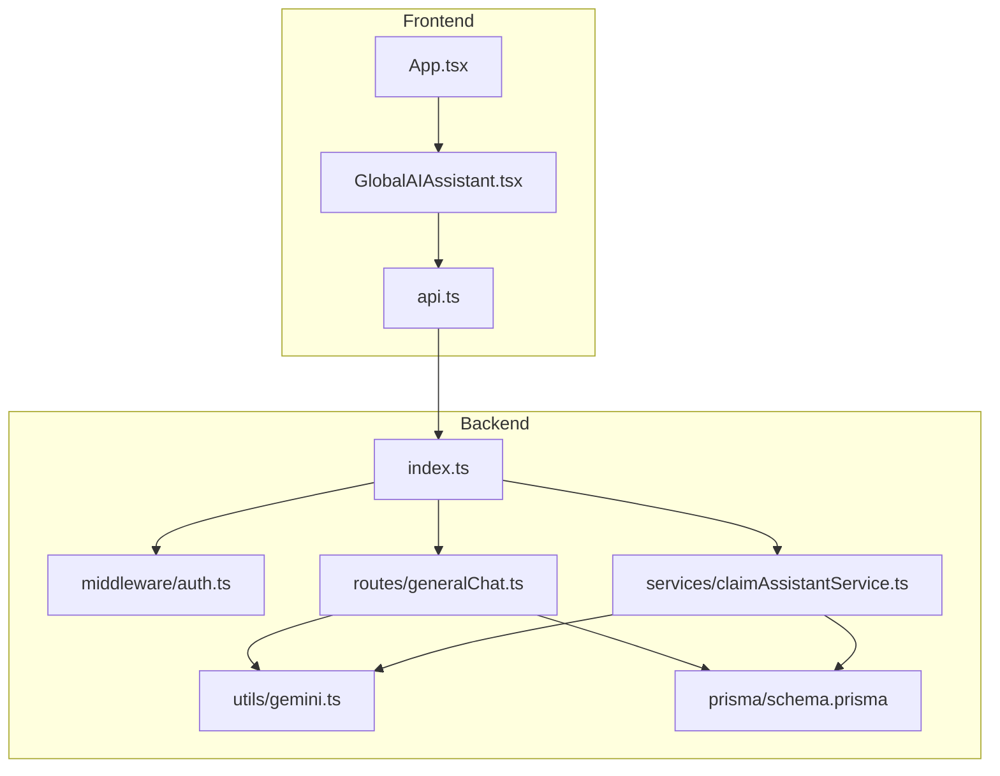
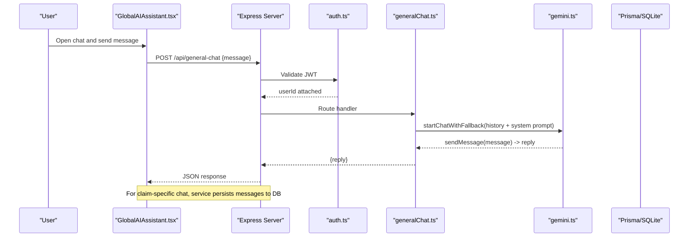
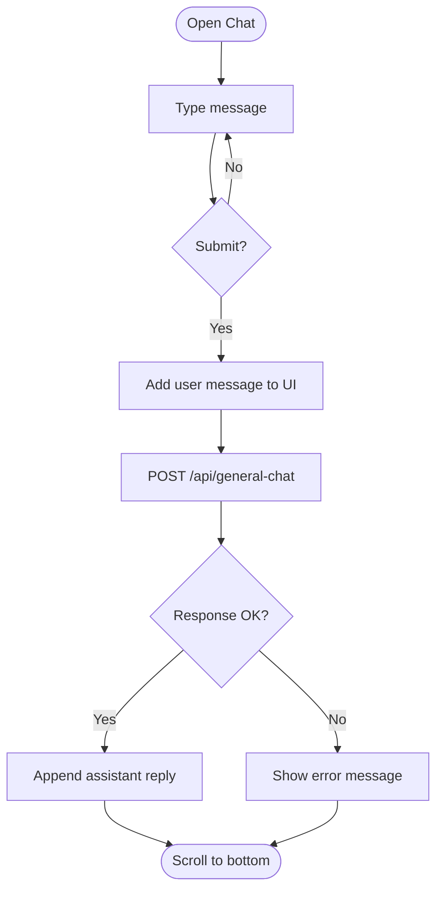
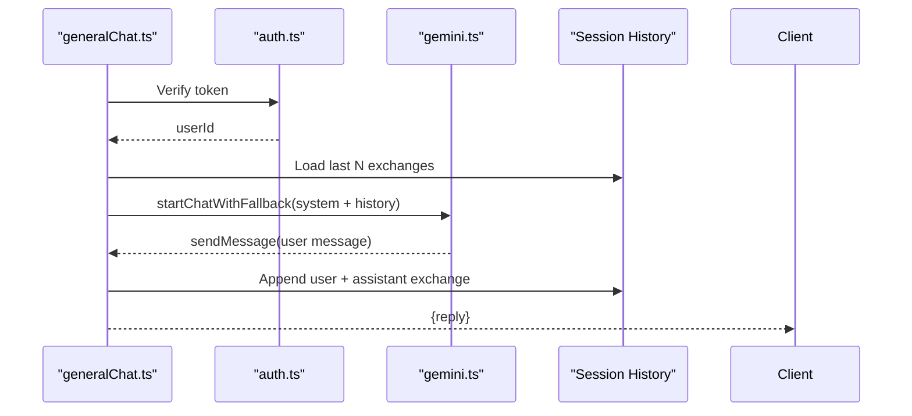
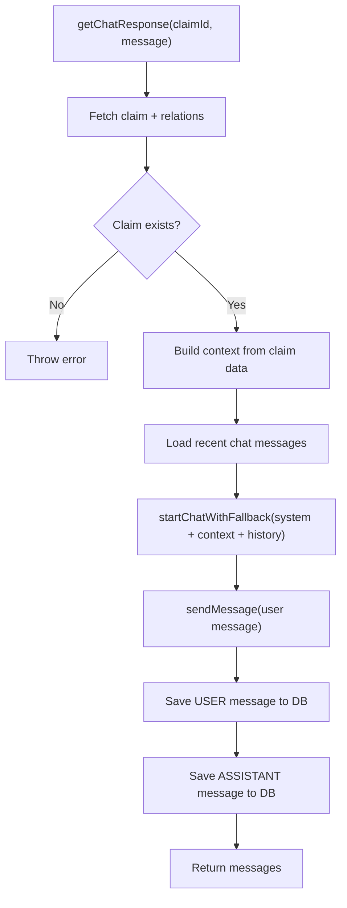
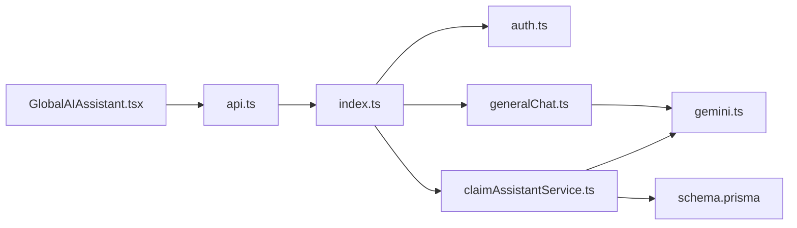

# Global AI Assistant

<cite>
**Referenced Files in This Document**
- [index.ts](file://backend/src/index.ts)
- [generalChat.ts](file://backend/src/routes/generalChat.ts)
- [claimAssistantService.ts](file://backend/src/services/claimAssistantService.ts)
- [gemini.ts](file://backend/src/utils/gemini.ts)
- [auth.ts](file://backend/src/middleware/auth.ts)
- [schema.prisma](file://backend/prisma/schema.prisma)
- [GlobalAIAssistant.tsx](file://frontend/src/components/GlobalAIAssistant.tsx)
- [api.ts](file://frontend/src/services/api.ts)
- [App.tsx](file://frontend/src/App.tsx)
- [package.json](file://backend/package.json)
</cite>

## Table of Contents
1. [Introduction](#introduction)
2. [Project Structure](#project-structure)
3. [Core Components](#core-components)
4. [Architecture Overview](#architecture-overview)
5. [Detailed Component Analysis](#detailed-component-analysis)
6. [Dependency Analysis](#dependency-analysis)
7. [Performance Considerations](#performance-considerations)
8. [Troubleshooting Guide](#troubleshooting-guide)
9. [Conclusion](#conclusion)

## Introduction
This document explains the Global AI Assistant integrated into a vehicle insurance claim system. The assistant provides two modes:
- General chat for policyholders to ask questions about claims, documents, and processes.
- Claim-specific chat that uses stored claim context (vehicle, policy, damage assessment, repair estimate, payout, documents, and conversation history) to provide personalized guidance.

The frontend exposes a floating chat widget that communicates with backend endpoints protected by authentication. The backend integrates Google Gemini models with a robust fallback strategy and persists claim-related conversations in the database.

## Project Structure
The application is split into a TypeScript Express backend and a React frontend. Key areas relevant to the Global AI Assistant include:
- Backend entrypoint and route registration
- Authentication middleware
- General chat route with in-memory session history
- Claim assistant service using Gemini with fallback
- Database schema including chat messages
- Frontend chat component and API client

**Diagram sources**
- [index.ts:28-51](file://backend/src/index.ts#L28-L51)
- [generalChat.ts:1-71](file://backend/src/routes/generalChat.ts#L1-L71)
- [claimAssistantService.ts:1-128](file://backend/src/services/claimAssistantService.ts#L1-L128)
- [gemini.ts:1-142](file://backend/src/utils/gemini.ts#L1-L142)
- [schema.prisma:194-207](file://backend/prisma/schema.prisma#L194-L207)
- [GlobalAIAssistant.tsx:1-157](file://frontend/src/components/GlobalAIAssistant.tsx#L1-L157)
- [api.ts:1-40](file://frontend/src/services/api.ts#L1-L40)
- [App.tsx:30-67](file://frontend/src/App.tsx#L30-L67)

**Section sources**
- [index.ts:28-51](file://backend/src/index.ts#L28-L51)
- [App.tsx:30-67](file://frontend/src/App.tsx#L30-L67)

## Core Components
- Frontend Chat Widget: A floating UI that opens a chat panel, sends user messages, displays assistant replies, and clears history. It attaches an auth token via an Axios interceptor.
- General Chat Route: Protects endpoints with JWT, maintains per-user in-memory conversation history, and calls Gemini with a system prompt tailored to the platform.
- Claim Assistant Service: Builds rich context from the claim’s related entities and persists both user and assistant messages to the database.
- Gemini Integration: Provides model cascade fallback and retry logic for resilience against rate limits or transient errors.
- Authentication Middleware: Validates Bearer tokens and attaches userId to requests.
- Database Schema: Defines ChatMessage and related entities used to store and retrieve conversation context.

**Section sources**
- [GlobalAIAssistant.tsx:16-53](file://frontend/src/components/GlobalAIAssistant.tsx#L16-L53)
- [api.ts:7-24](file://frontend/src/services/api.ts#L7-L24)
- [generalChat.ts:23-68](file://backend/src/routes/generalChat.ts#L23-L68)
- [claimAssistantService.ts:20-127](file://backend/src/services/claimAssistantService.ts#L20-L127)
- [gemini.ts:52-139](file://backend/src/utils/gemini.ts#L52-L139)
- [auth.ts:5-22](file://backend/src/middleware/auth.ts#L5-L22)
- [schema.prisma:194-207](file://backend/prisma/schema.prisma#L194-L207)

## Architecture Overview
The assistant follows a layered architecture:
- Presentation Layer (React): Renders the chat widget and handles user interactions.
- API Layer (Express): Routes protect sensitive operations, validate inputs, and orchestrate services.
- Service Layer: Encapsulates business logic, including building context and managing conversation persistence.
- AI Integration Layer: Communicates with Google Gemini, handling retries and fallbacks.
- Data Layer: Prisma ORM over SQLite stores users, claims, policies, vehicles, documents, and chat messages.

**Diagram sources**
- [GlobalAIAssistant.tsx:29-43](file://frontend/src/components/GlobalAIAssistant.tsx#L29-L43)
- [api.ts:11-24](file://frontend/src/services/api.ts#L11-L24)
- [index.ts:43-51](file://backend/src/index.ts#L43-L51)
- [auth.ts:5-22](file://backend/src/middleware/auth.ts#L5-L22)
- [generalChat.ts:27-62](file://backend/src/routes/generalChat.ts#L27-L62)
- [gemini.ts:97-139](file://backend/src/utils/gemini.ts#L97-L139)

## Detailed Component Analysis

### Frontend Chat Widget
- Responsibilities:
  - Toggle chat panel visibility and auto-scroll to latest messages.
  - Send user messages to the backend and display assistant responses.
  - Provide quick question prompts and clear conversation history.
- State management:
  - Local state tracks open/closed, messages array, input text, and loading indicator.
- API integration:
  - Uses an Axios instance that automatically attaches Bearer tokens and handles 401 redirects.
- UX considerations:
  - Shows typing indicators while waiting for responses.
  - Supports clearing history via a DELETE request.

**Diagram sources**
- [GlobalAIAssistant.tsx:16-53](file://frontend/src/components/GlobalAIAssistant.tsx#L16-L53)
- [api.ts:11-24](file://frontend/src/services/api.ts#L11-L24)

**Section sources**
- [GlobalAIAssistant.tsx:16-53](file://frontend/src/components/GlobalAIAssistant.tsx#L16-L53)
- [api.ts:11-24](file://frontend/src/services/api.ts#L11-L24)

### General Chat Route
- Security: Protected by JWT middleware; requires Authorization header.
- Session history: Maintains per-user in-memory history limited to a fixed number of exchanges to control memory usage.
- Prompting: Injects a system prompt defining scope and tone, then appends prior exchanges before calling Gemini.
- Persistence: General chat does not persist messages to the database; it relies on in-memory storage per session.

**Diagram sources**
- [generalChat.ts:23-68](file://backend/src/routes/generalChat.ts#L23-L68)
- [auth.ts:5-22](file://backend/src/middleware/auth.ts#L5-L22)
- [gemini.ts:97-139](file://backend/src/utils/gemini.ts#L97-L139)

**Section sources**
- [generalChat.ts:23-68](file://backend/src/routes/generalChat.ts#L23-L68)

### Claim Assistant Service
- Context assembly:
  - Retrieves claim details along with vehicle, policy, damage assessment, repair estimate, insurance payout, documents, and recent chat messages.
  - Constructs a structured context string summarizing status, vehicle info, incident details, coverage, damages, costs, and document verification statuses.
- Conversation history:
  - Loads recent messages and converts roles to match Gemini format.
- AI interaction:
  - Starts a chat session with system prompt and claim context, then sends the user message.
- Persistence:
  - Saves both user and assistant messages to the database linked to the claim.

**Diagram sources**
- [claimAssistantService.ts:20-127](file://backend/src/services/claimAssistantService.ts#L20-L127)
- [schema.prisma:194-207](file://backend/prisma/schema.prisma#L194-L207)

**Section sources**
- [claimAssistantService.ts:20-127](file://backend/src/services/claimAssistantService.ts#L20-L127)
- [schema.prisma:194-207](file://backend/prisma/schema.prisma#L194-L207)

### Gemini Integration with Fallback
- Model cascade:
  - Attempts multiple models in order of preference, logging when fallback is used.
- Retry logic:
  - Retries once per model on retryable errors (e.g., rate limits, server errors) with exponential backoff.
- Chat sessions:
  - Initializes a chat with provided history and returns a sendMessage function that also includes retry logic.

**Diagram sources**
- [gemini.ts:52-91](file://backend/src/utils/gemini.ts#L52-L91)
- [gemini.ts:97-139](file://backend/src/utils/gemini.ts#L97-L139)

**Section sources**
- [gemini.ts:52-91](file://backend/src/utils/gemini.ts#L52-L91)
- [gemini.ts:97-139](file://backend/src/utils/gemini.ts#L97-L139)

### Authentication Middleware
- Validates presence and format of Authorization header.
- Verifies JWT and attaches userId to the request object.
- Returns 401 for missing or invalid tokens.

**Section sources**
- [auth.ts:5-22](file://backend/src/middleware/auth.ts#L5-L22)

### Database Schema Highlights
- ChatMessage: Stores role, content, and timestamps per claim.
- Related entities: User, Vehicle, InsurancePolicy, Claim, DamageAssessment, RepairEstimate, InsurancePayout, Document are all referenced by the claim assistant to build context.

**Section sources**
- [schema.prisma:10-25](file://backend/prisma/schema.prisma#L10-L25)
- [schema.prisma:73-100](file://backend/prisma/schema.prisma#L73-L100)
- [schema.prisma:125-166](file://backend/prisma/schema.prisma#L125-L166)
- [schema.prisma:182-207](file://backend/prisma/schema.prisma#L182-L207)

## Dependency Analysis
- Frontend depends on:
  - Axios-based API client that injects auth headers and handles 401 redirects.
  - React components for UI and routing.
- Backend depends on:
  - Express routes mounted under /api.
  - JWT middleware for protecting endpoints.
  - Gemini utility for AI responses with fallback.
  - Prisma client for database access.

**Diagram sources**
- [GlobalAIAssistant.tsx:1-157](file://frontend/src/components/GlobalAIAssistant.tsx#L1-L157)
- [api.ts:1-40](file://frontend/src/services/api.ts#L1-L40)
- [index.ts:28-51](file://backend/src/index.ts#L28-L51)
- [auth.ts:5-22](file://backend/src/middleware/auth.ts#L5-L22)
- [generalChat.ts:1-71](file://backend/src/routes/generalChat.ts#L1-L71)
- [claimAssistantService.ts:1-128](file://backend/src/services/claimAssistantService.ts#L1-L128)
- [gemini.ts:1-142](file://backend/src/utils/gemini.ts#L1-L142)
- [schema.prisma:1-256](file://backend/prisma/schema.prisma#L1-L256)

**Section sources**
- [package.json:20-31](file://backend/package.json#L20-L31)
- [index.ts:28-51](file://backend/src/index.ts#L28-L51)

## Performance Considerations
- Gemini fallback reduces latency spikes and improves reliability by switching models on failures.
- In-memory session history is bounded to prevent unbounded growth.
- Claim assistant loads only recent messages to keep context manageable.
- Static file serving for uploads is configured with a size limit on JSON parsing to avoid large payloads.

[No sources needed since this section provides general guidance]

## Troubleshooting Guide
- Missing environment variables:
  - The server validates required env vars at startup and exits if any are missing. Ensure JWT_SECRET, GEMINI_API_KEY, DATABASE_URL, and optionally CORS_ORIGIN and UPLOAD_DIR are set.
- Authentication errors:
  - 401 responses indicate missing or invalid tokens. Check that the frontend attaches Authorization headers and that tokens are valid.
- Gemini failures:
  - Errors like rate limits or server errors trigger retries and fallbacks. If all models fail, the request will error out. Review logs for model usage and error messages.
- Database connectivity:
  - Health endpoint checks DB reachability. Use it to verify connectivity during deployment.

**Section sources**
- [index.ts:18-25](file://backend/src/index.ts#L18-L25)
- [index.ts:53-61](file://backend/src/index.ts#L53-L61)
- [auth.ts:5-22](file://backend/src/middleware/auth.ts#L5-L22)
- [gemini.ts:27-41](file://backend/src/utils/gemini.ts#L27-L41)
- [gemini.ts:52-91](file://backend/src/utils/gemini.ts#L52-L91)
- [gemini.ts:97-139](file://backend/src/utils/gemini.ts#L97-L139)

## Conclusion
The Global AI Assistant combines a user-friendly frontend widget with a resilient backend that leverages Google Gemini through a robust fallback mechanism. It supports both general inquiries and claim-specific assistance by assembling rich context from the database and persisting conversations for continuity. Proper configuration of environment variables and authentication ensures secure and reliable operation across environments.