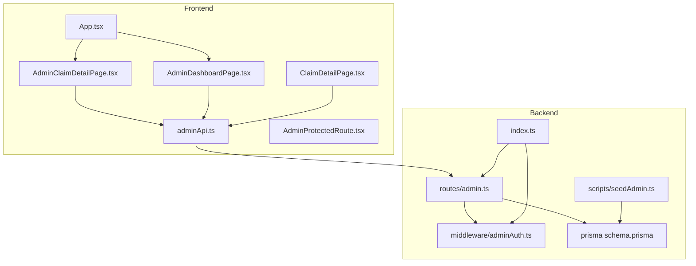
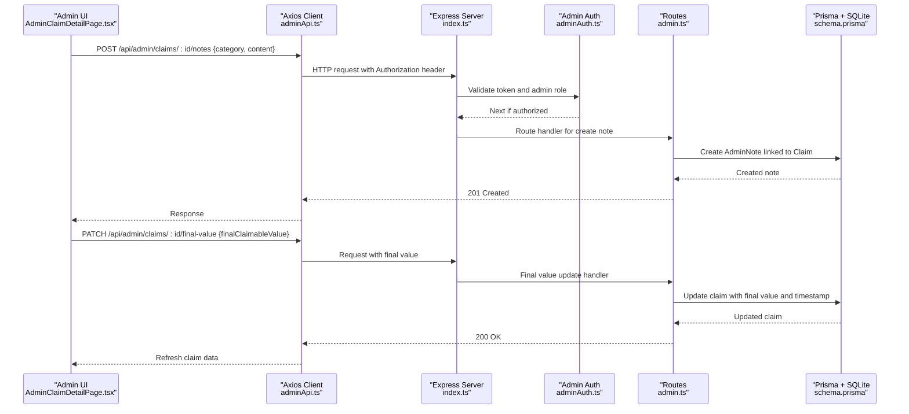
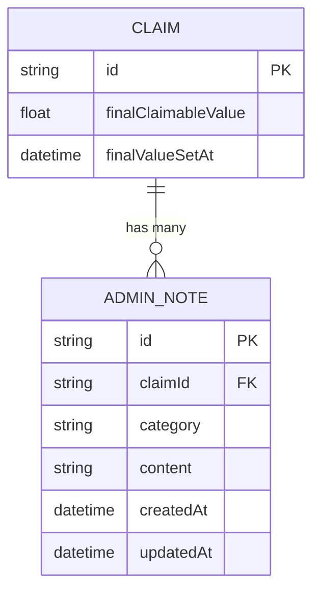
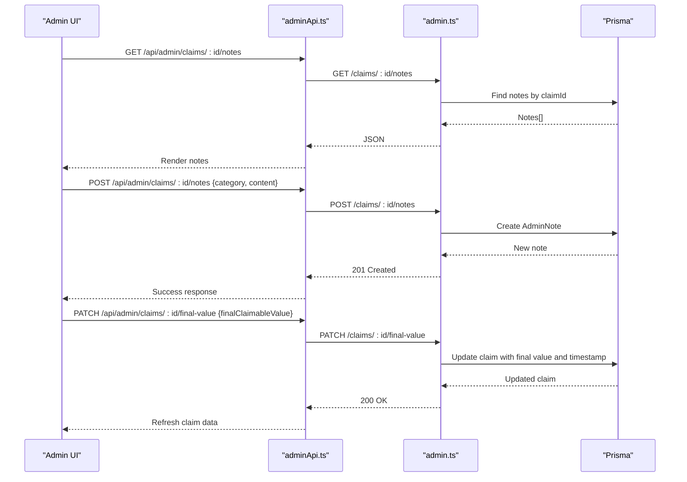
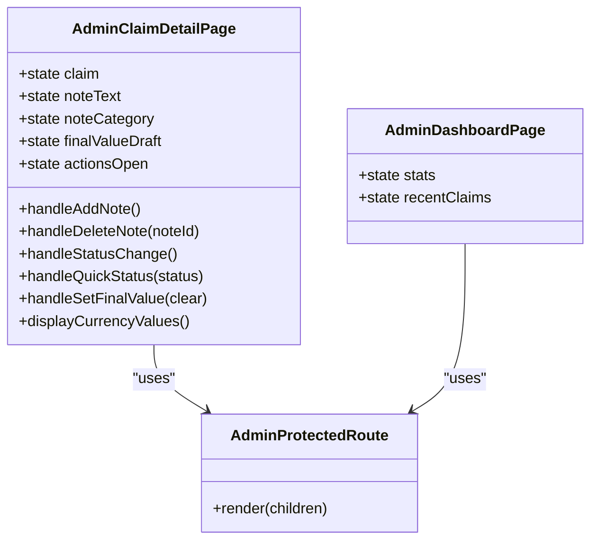
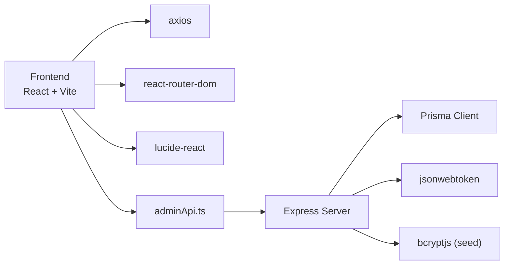

# Admin Note System

<cite>
**Referenced Files in This Document**
- [index.ts](file://backend/src/index.ts)
- [schema.prisma](file://backend/prisma/schema.prisma)
- [admin.ts](file://backend/src/routes/admin.ts)
- [adminAuth.ts](file://backend/src/middleware/adminAuth.ts)
- [index.ts (types)](file://backend/src/types/index.ts)
- [seedAdmin.ts](file://backend/src/scripts/seedAdmin.ts)
- [App.tsx](file://frontend/src/App.tsx)
- [AdminClaimDetailPage.tsx](file://frontend/src/pages/admin/AdminClaimDetailPage.tsx)
- [ClaimDetailPage.tsx](file://frontend/src/pages/ClaimDetailPage.tsx)
- [AdminDashboardPage.tsx](file://frontend/src/pages/admin/AdminDashboardPage.tsx)
- [adminApi.ts](file://frontend/src/services/adminApi.ts)
- [AdminProtectedRoute.tsx](file://frontend/src/components/AdminProtectedRoute.tsx)
</cite>

## Update Summary
**Changes Made**
- Enhanced Admin Claim Detail Page with comprehensive status management system including quick action buttons and advanced status override
- Added new 'Final Claimable Value' system allowing administrators to set confirmed payout amounts for claims with input validation, confirmation states, and visual indicators
- Consolidated claim actions interface into a dropdown menu replacing multiple colored buttons for improved user experience
- Improved UI components with better visual feedback, loading states, and user experience enhancements
- Enhanced note-taking capabilities with category-based organization and real-time updates
- Added consistent currency formatting across admin and user interfaces using Sri Lankan Rupees (Rs.)
- Integrated garage estimate comparison features showing AI vs garage estimates side by side
- Enhanced document approval workflow with reason tracking and status management

## Table of Contents
1. Introduction
2. Project Structure
3. Core Components
4. Architecture Overview
5. Detailed Component Analysis
6. Dependency Analysis
7. Performance Considerations
8. Troubleshooting Guide
9. Conclusion

## Introduction
This document explains the Admin Note System within the Smart Vehicle Insurance Claim System. It focuses on how administrators can add, view, and delete notes attached to claims, and how these notes integrate with claim review workflows. The system provides a secure admin-only API for note management and a React-based admin UI that displays notes alongside claim details and supports quick status changes and document approvals. **Updated**: The administrative interface now includes enhanced status management with quick action buttons, comprehensive claim overview with repair estimates and insurance payouts, final claimable value confirmation system, and consistent currency formatting throughout the interface displaying all monetary values in Sri Lankan Rupees (Rs.).

## Project Structure
The Admin Note System spans both backend and frontend:
- Backend: Express server with Prisma ORM, JWT-based admin authentication, and REST endpoints for notes and related claim operations.
- Frontend: React application with protected admin routes, an admin dashboard, and a detailed claim page where admins manage notes with enhanced status controls, final claimable value confirmation, and consolidated claim actions.

**Diagram sources**
- [App.tsx:30-68](file://frontend/src/App.tsx#L30-L68)
- [AdminClaimDetailPage.tsx:23-593](file://frontend/src/pages/admin/AdminClaimDetailPage.tsx#L23-L593)
- [ClaimDetailPage.tsx:9-713](file://frontend/src/pages/ClaimDetailPage.tsx#L9-L713)
- [AdminDashboardPage.tsx:13-132](file://frontend/src/pages/admin/AdminDashboardPage.tsx#L13-L132)
- [adminApi.ts:1-28](file://frontend/src/services/adminApi.ts#L1-L28)
- [index.ts:25-62](file://backend/src/index.ts#L25-L62)
- [admin.ts:1-860](file://backend/src/routes/admin.ts#L1-L860)
- [adminAuth.ts:1-27](file://backend/src/middleware/adminAuth.ts#L1-L27)
- [schema.prisma:209-218](file://backend/prisma/schema.prisma#L209-L218)
- [seedAdmin.ts:9-39](file://backend/src/scripts/seedAdmin.ts#L9-L39)

**Section sources**
- [index.ts:25-62](file://backend/src/index.ts#L25-L62)
- [App.tsx:30-68](file://frontend/src/App.tsx#L30-L68)

## Core Components
- Admin Note Data Model: Stores per-claim notes with category and timestamps.
- Final Claimable Value System: Allows administrators to set confirmed payout amounts for claims with validation and timestamp tracking.
- Admin Authentication Middleware: Ensures only authenticated admins access note endpoints.
- Admin Routes: Provide CRUD endpoints for notes, final claimable values, and related claim/document operations.
- Frontend Admin UI: Displays notes in claim detail view; allows adding, deleting, and viewing categorized notes with enhanced status management and final value confirmation.

Key responsibilities:
- Persist notes against claims with categories (vehicle, document, general).
- Allow administrators to set final claimable values with validation and confirmation tracking.
- Protect endpoints with JWT-based admin checks.
- Present notes chronologically and allow deletion by admins.
- **Updated**: Display monetary values consistently using Sri Lankan Rupees (Rs.) format across both admin and user interfaces with enhanced claim overview, status management, and final claimable value confirmation.

**Section sources**
- [schema.prisma:113-143](file://backend/prisma/schema.prisma#L113-L143)
- [schema.prisma:252-261](file://backend/prisma/schema.prisma#L252-L261)
- [adminAuth.ts:6-26](file://backend/src/middleware/adminAuth.ts#L6-L26)
- [admin.ts:596-633](file://backend/src/routes/admin.ts#L596-L633)
- [admin.ts:732-782](file://backend/src/routes/admin.ts#L732-L782)
- [AdminClaimDetailPage.tsx:71-89](file://frontend/src/pages/admin/AdminClaimDetailPage.tsx#L71-L89)

## Architecture Overview
The Admin Note System follows a standard client-server architecture:
- The React frontend calls admin API endpoints via axios.
- The Express server validates requests using JWT middleware and delegates data operations to Prisma.
- Notes are stored in the database and associated with claims.
- Final claimable values are stored directly on claims with timestamp tracking.

**Diagram sources**
- [AdminClaimDetailPage.tsx:71-89](file://frontend/src/pages/admin/AdminClaimDetailPage.tsx#L71-L89)
- [adminApi.ts:7-14](file://frontend/src/services/adminApi.ts#L7-L14)
- [index.ts:40-45](file://backend/src/index.ts#L40-L45)
- [adminAuth.ts:6-26](file://backend/src/middleware/adminAuth.ts#L6-L26)
- [admin.ts:596-633](file://backend/src/routes/admin.ts#L596-L633)
- [schema.prisma:113-143](file://backend/prisma/schema.prisma#L113-L143)

## Detailed Component Analysis

### Admin Note Data Model
- Purpose: Associate administrative notes with specific claims.
- Fields:
  - id: unique identifier
  - claimId: foreign key to Claim
  - category: classification (vehicle, document, general)
  - content: text body of the note
  - createdAt, updatedAt: timestamps
- Relationships:
  - Belongs to Claim (onDelete cascade)
- Complexity:
  - O(1) creation/update; O(n) retrieval of notes per claim based on number of notes.

**Diagram sources**
- [schema.prisma:113-143](file://backend/prisma/schema.prisma#L113-L143)
- [schema.prisma:252-261](file://backend/prisma/schema.prisma#L252-L261)

**Section sources**
- [schema.prisma:252-261](file://backend/prisma/schema.prisma#L252-L261)

### Final Claimable Value System
- Purpose: Allow administrators to set confirmed payout amounts for claims that override computed estimates.
- Fields:
  - finalClaimableValue: Float? - the confirmed amount the insurer pays
  - finalValueSetAt: DateTime? - timestamp when the final value was set
- Validation:
  - Non-negative numbers only
  - Automatically rounds to whole numbers
  - Clears both value and timestamp when null/empty
- Behavior:
  - Overrides computed insurance payout estimates once set
  - Shows "Confirmed" badge when final value is present
  - Tracks when the final value was set for audit purposes

**Section sources**
- [schema.prisma:124-126](file://backend/prisma/schema.prisma#L124-L126)
- [admin.ts:596-633](file://backend/src/routes/admin.ts#L596-L633)
- [AdminClaimDetailPage.tsx:71-89](file://frontend/src/pages/admin/AdminClaimDetailPage.tsx#L71-L89)

### Admin Authentication Middleware
- Validates Bearer token from Authorization header.
- Verifies token using JWT secret and ensures user has isAdmin flag set.
- Attaches userId to request context for downstream handlers.

**Diagram sources**
- [adminAuth.ts:6-26](file://backend/src/middleware/adminAuth.ts#L6-L26)

**Section sources**
- [adminAuth.ts:6-26](file://backend/src/middleware/adminAuth.ts#L6-L26)

### Enhanced Admin Routes for Notes and Final Value Management
Endpoints:
- GET /api/admin/claims/:id/notes
  - Returns notes for a claim ordered by creation time descending.
- POST /api/admin/claims/:id/notes
  - Creates a new note with validation for content and category.
- DELETE /api/admin/notes/:noteId
  - Deletes a note by ID.
- PATCH /api/admin/claims/:id/status
  - Updates claim status with validation for valid status values.
- PATCH /api/admin/claims/:id/final-value
  - Sets or clears the final claimable value with validation and timestamp tracking.

Behavior:
- All endpoints require admin authentication.
- Content is trimmed; invalid category defaults to general.
- Status updates validate against predefined status enum values.
- Final value updates validate non-negative numbers and round to whole numbers.
- Errors return appropriate status codes and messages.

**Diagram sources**
- [admin.ts:596-633](file://backend/src/routes/admin.ts#L596-L633)
- [admin.ts:732-782](file://backend/src/routes/admin.ts#L732-L782)
- [adminApi.ts:7-14](file://frontend/src/services/adminApi.ts#L7-L14)

**Section sources**
- [admin.ts:596-633](file://backend/src/routes/admin.ts#L596-L633)
- [admin.ts:732-782](file://backend/src/routes/admin.ts#L732-L782)

### Enhanced Frontend Admin UI for Notes, Status Management, and Final Values
- AdminClaimDetailPage:
  - Displays existing notes with category badges and timestamps.
  - Provides input to add a note with category selection.
  - Supports deleting notes with confirmation.
  - Integrates with adminApi to call backend endpoints.
  - **Enhanced**: Comprehensive status management with quick action buttons (Approve, Reject, Under Review, Complete) and advanced status override dropdown.
  - **Enhanced**: Full claim overview with damage assessment, repair estimates, insurance payouts, and garage estimate comparisons.
  - **Enhanced**: Final claimable value system with input validation, confirmation states, and visual indicators.
  - **Enhanced**: Consolidated claim actions interface into a single dropdown menu replacing multiple colored buttons.
  - **Enhanced**: Consistent currency formatting using Sri Lankan Rupees (Rs.) throughout all monetary displays.
  - **Enhanced**: Real-time status updates with loading states and error handling.
- AdminProtectedRoute:
  - Guards admin routes by checking for adminToken in localStorage.
- AdminDashboardPage:
  - Shows overview stats and recent claims; not directly involved in note operations but part of the admin experience.

**Diagram sources**
- [AdminClaimDetailPage.tsx:23-593](file://frontend/src/pages/admin/AdminClaimDetailPage.tsx#L23-L593)
- [AdminProtectedRoute.tsx:3-6](file://frontend/src/components/AdminProtectedRoute.tsx#L3-L6)
- [AdminDashboardPage.tsx:13-132](file://frontend/src/pages/admin/AdminDashboardPage.tsx#L13-L132)

**Section sources**
- [AdminClaimDetailPage.tsx:71-89](file://frontend/src/pages/admin/AdminClaimDetailPage.tsx#L71-L89)
- [AdminClaimDetailPage.tsx:154-229](file://frontend/src/pages/admin/AdminClaimDetailPage.tsx#L154-L229)
- [AdminClaimDetailPage.tsx:340-378](file://frontend/src/pages/admin/AdminClaimDetailPage.tsx#L340-L378)
- [AdminProtectedRoute.tsx:3-6](file://frontend/src/components/AdminProtectedRoute.tsx#L3-L6)
- [AdminDashboardPage.tsx:13-132](file://frontend/src/pages/admin/AdminDashboardPage.tsx#L13-L132)

### Consolidated Claim Actions Interface
**Enhanced** The admin interface now uses a single dropdown menu for all claim actions, replacing the previous row of multiple colored buttons for a cleaner, more organized interface.

Key features:
- Single blue "Claim Actions" button with dropdown menu
- Quick actions for common operations (Approve, Reject, Mark Under Review, Mark Completed)
- Re-analyze damage functionality with loading states
- Delete claim option separated by divider for safety
- Disabled states for current statuses to prevent duplicate actions
- Consistent styling with primary color theme

Implementation details:
- Dropdown menu with proper z-index positioning and backdrop click handling
- Action items array defining available operations with icons and labels
- State management for actions open/closed and individual action states
- Visual feedback with disabled states and loading indicators

**Section sources**
- [AdminClaimDetailPage.tsx:154-229](file://frontend/src/pages/admin/AdminClaimDetailPage.tsx#L154-L229)

### Enhanced Currency Display and Final Claimable Value Section
**Enhanced** The administrative claim detail page now provides comprehensive claim overview with consistent currency formatting using Sri Lankan Rupees (Rs.) throughout the interface, including repair estimates, insurance payouts, garage estimate comparisons, and the new final claimable value section.

Key features:
- Repair estimates display parts, labor, paint materials, and total costs with Rs. prefix
- Insurance payout amounts show deductible, covered amount, and estimated payout with Rs. formatting
- Garage estimate comparisons showing AI vs garage estimates side by side with difference calculations
- Final claimable value section with confirmation badge and timestamp display
- Consistent number formatting using `.toLocaleString()` method throughout the interface
- Color-coded sections for better visual distinction (blue for parts, purple for labor, green for payouts)

Implementation details:
- All monetary values use the format `Rs. {value.toLocaleString()}`
- Enhanced garage estimate section with normalized item processing and totals calculation
- Real-time comparison between AI estimates and garage estimates
- Final claimable value input with validation and clear functionality
- Proper number formatting with thousands separators for better readability

**Section sources**
- [AdminClaimDetailPage.tsx:294-378](file://frontend/src/pages/admin/AdminClaimDetailPage.tsx#L294-L378)
- [ClaimDetailPage.tsx:291-346](file://frontend/src/pages/ClaimDetailPage.tsx#L291-L346)

### Enhanced Status Management System
**Enhanced** The admin interface now includes comprehensive status management with quick action buttons and advanced status override capabilities.

Key features:
- Quick action buttons for common status changes (Approve, Reject, Under Review, Complete)
- Advanced status override dropdown with all possible statuses
- Visual feedback with loading states and disabled states for current status
- Color-coded status indicators with consistent styling
- Real-time status updates with automatic claim data refresh

Implementation details:
- Status colors defined for each status type (DRAFT, SUBMITTED, UNDER_REVIEW, etc.)
- Validation to prevent duplicate status changes
- Error handling with user-friendly alerts
- Integration with backend status update endpoint

**Section sources**
- [AdminClaimDetailPage.tsx:8-21](file://frontend/src/pages/admin/AdminClaimDetailPage.tsx#L8-L21)
- [AdminClaimDetailPage.tsx:51-69](file://frontend/src/pages/admin/AdminClaimDetailPage.tsx#L51-L69)

### Seed Admin User
- Purpose: Create or ensure an admin user exists in the database for initial setup.
- Behavior:
  - Checks for existing admin email; sets isAdmin flag if found.
  - Creates admin user with hashed password if not present.

**Section sources**
- [seedAdmin.ts:9-39](file://backend/src/scripts/seedAdmin.ts#L9-L39)

## Dependency Analysis
- Frontend dependencies:
  - React Router for routing and navigation.
  - Axios for HTTP requests with interceptors for auth headers and error handling.
  - Lucide React for icons used throughout the enhanced UI.
- Backend dependencies:
  - Express for routing and middleware.
  - Prisma Client for database access.
  - JWT for token verification.
  - bcryptjs for password hashing in seed script.

**Diagram sources**
- [frontend/package.json:12-18](file://frontend/package.json#L12-L18)
- [backend/package.json:20-30](file://backend/package.json#L20-30)
- [adminApi.ts:1-14](file://frontend/src/services/adminApi.ts#L1-L14)
- [index.ts:1-11](file://backend/src/index.ts#L1-L11)

**Section sources**
- [frontend/package.json:12-18](file://frontend/package.json#L12-L18)
- [backend/package.json:20-30](file://backend/package.json#L20-30)

## Performance Considerations
- Database queries:
  - Notes retrieval per claim is efficient; consider pagination if note volume grows significantly.
  - Final claimable value lookups are direct field accesses on claims table.
- Network requests:
  - Debounce rapid note submissions to avoid redundant requests.
  - Efficient final value updates with immediate UI feedback.
- Frontend state:
  - Minimize re-renders by updating local state efficiently after mutations.
  - Optimized status change handling with immediate UI feedback.
  - Consolidated actions reduce UI complexity and improve performance.
- Security:
  - Ensure CORS and environment variables are correctly configured to prevent unnecessary failures.
- **Enhanced**: Performance improvements:
  - Efficient currency formatting using `.toLocaleString()` method
  - Optimized garage estimate calculations with normalized data processing
  - Reduced network requests through efficient data fetching strategies
  - Loading states and optimistic UI updates for better user experience
  - Consolidated actions interface reduces DOM manipulation overhead

[No sources needed since this section provides general guidance]

## Troubleshooting Guide
Common issues and resolutions:
- 401 Unauthorized:
  - Missing or invalid JWT token; verify admin login flow and token storage.
- 403 Forbidden:
  - Token valid but user lacks admin privileges; ensure admin user exists and isAdmin is true.
- Validation errors:
  - Empty note content or invalid category; validate inputs before submission.
  - Invalid final claimable value (negative numbers); ensure proper input validation.
- Database connectivity:
  - Health check endpoint indicates DB reachability; confirm DATABASE_URL and migrations.
- **Enhanced**: Status management issues:
  - If status changes fail, verify the status value is valid and matches backend enum values.
  - Check for proper error handling in status update requests.
- **Enhanced**: Final claimable value issues:
  - If final value updates fail, verify the value is a non-negative number.
  - Check for proper error handling in final value update requests.
  - Ensure the claim exists before attempting to set final value.
- **Enhanced**: Currency display issues:
  - If monetary values don't display correctly, verify that claim data includes proper numeric values for repair estimates and insurance payouts.
  - Ensure `.toLocaleString()` method is available in the browser environment.
  - Check for proper data normalization in garage estimate processing.
- **Enhanced**: Actions dropdown issues:
  - If dropdown doesn't close properly, check for proper event handling and z-index configuration.
  - Verify that action items are properly disabled for current statuses.

**Section sources**
- [adminAuth.ts:6-26](file://backend/src/middleware/adminAuth.ts#L6-L26)
- [admin.ts:596-633](file://backend/src/routes/admin.ts#L596-L633)
- [admin.ts:732-782](file://backend/src/routes/admin.ts#L732-L782)
- [index.ts:47-55](file://backend/src/index.ts#L47-L55)

## Conclusion
The Admin Note System enables administrators to annotate claims with categorized notes, supporting thorough review workflows with enhanced status management, final claimable value confirmation, and comprehensive claim oversight. It combines secure admin-only endpoints with a user-friendly interface that now includes consolidated claim actions, quick action buttons, detailed claim overviews, and consistent currency formatting. The system integrates seamlessly into the broader claim management system with improved user experience and reliability. **Enhanced**: The system now provides comprehensive status management with consolidated actions, detailed claim overviews with repair estimates and insurance payouts, final claimable value confirmation system with validation and tracking, consistent currency formatting across both administrative and user interfaces displaying all monetary values in Sri Lankan Rupees (Rs.), and enhanced garage estimate comparisons for better decision-making. Proper authentication, validation, and clear data models ensure reliability and maintainability.

[No sources needed since this section summarizes without analyzing specific files]