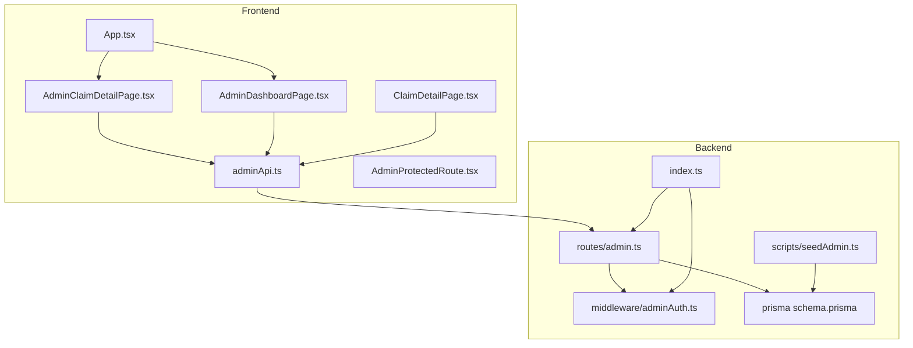
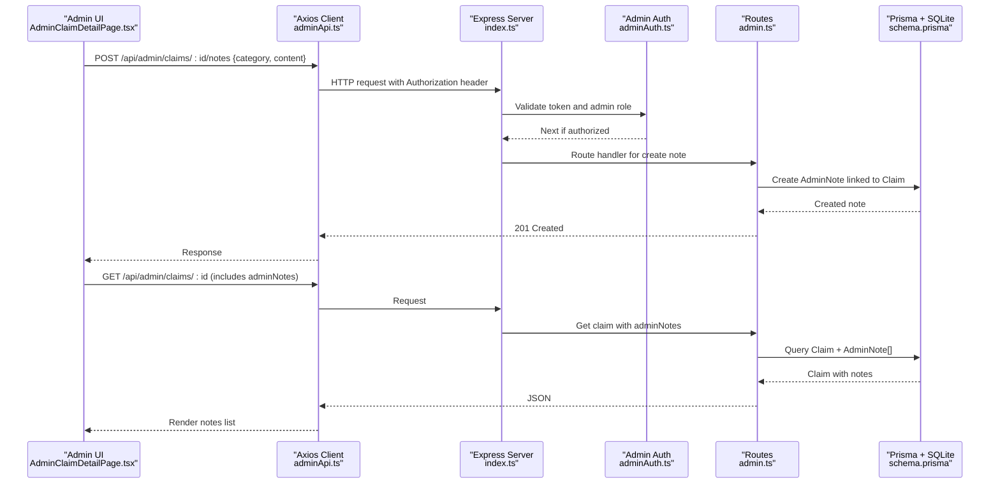
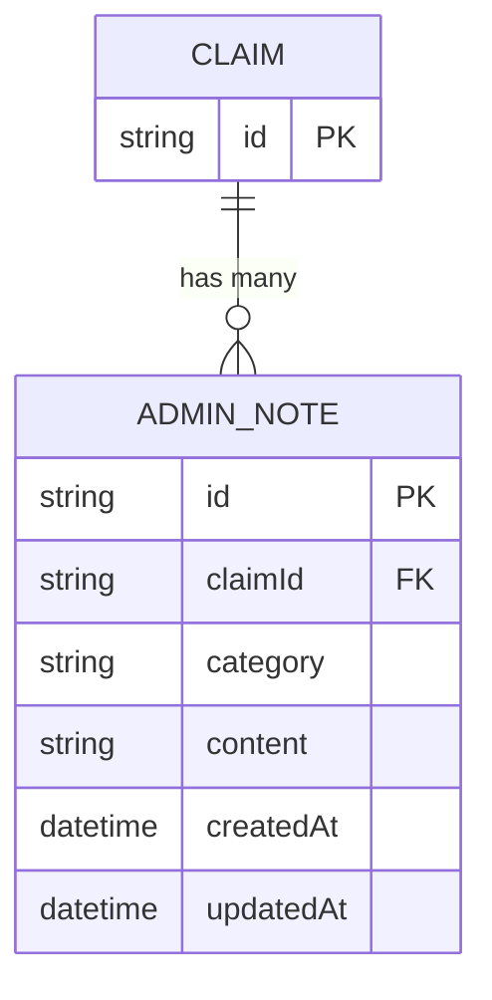
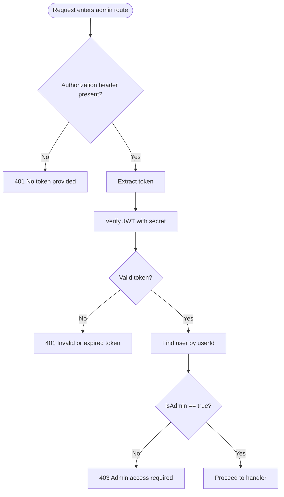
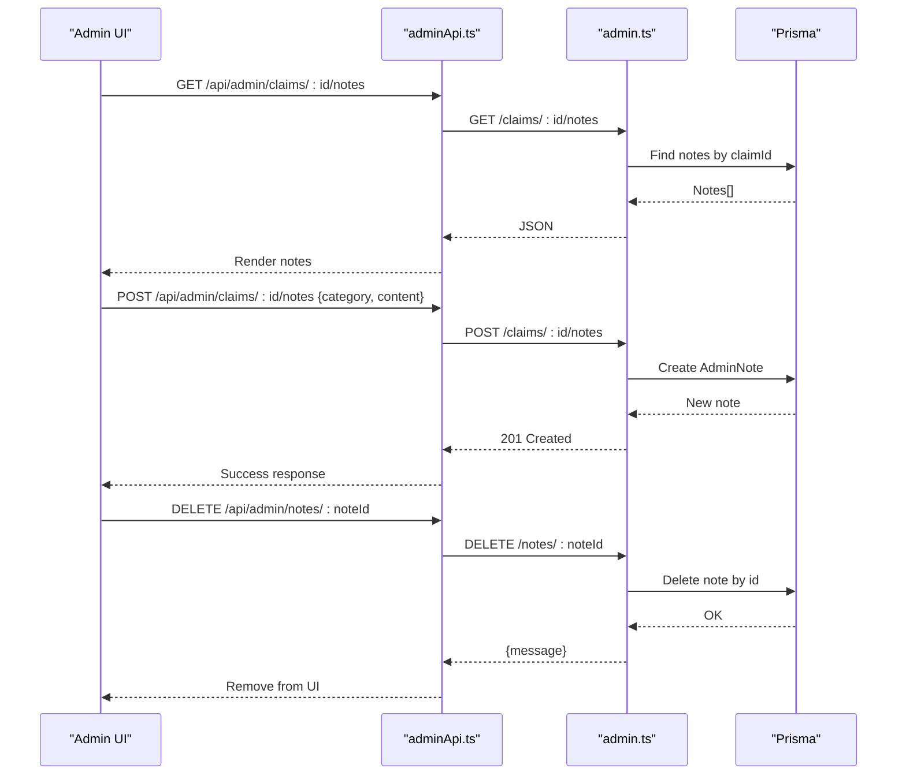
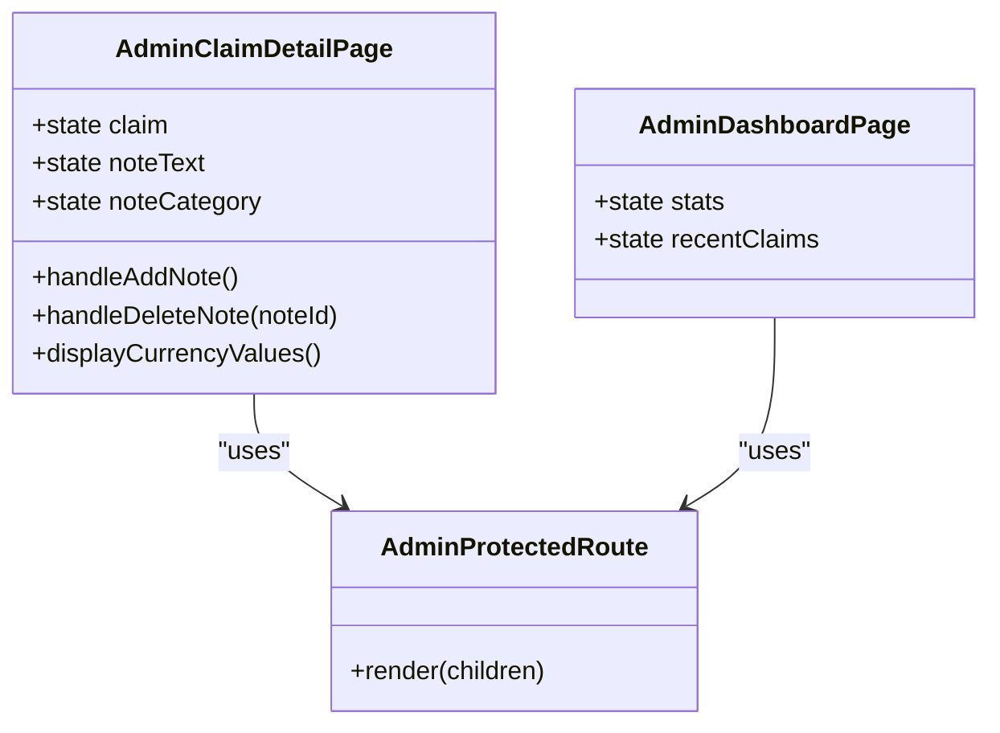
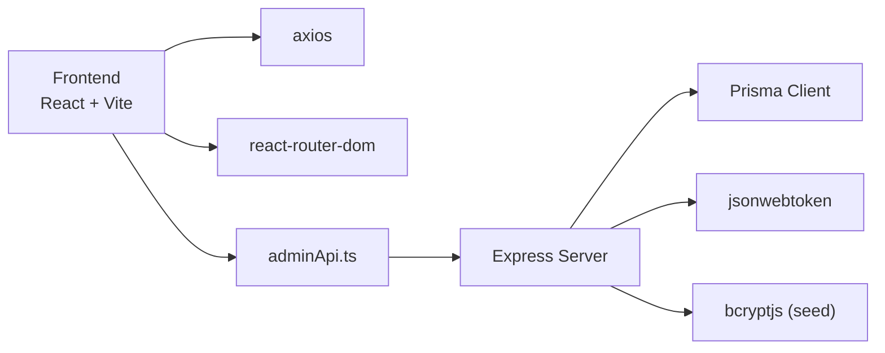

# Admin Note System

<cite>
**Referenced Files in This Document**
- [index.ts](file://backend/src/index.ts)
- [schema.prisma](file://backend/prisma/schema.prisma)
- [admin.ts](file://backend/src/routes/admin.ts)
- [adminAuth.ts](file://backend/src/middleware/adminAuth.ts)
- [index.ts (types)](file://backend/src/types/index.ts)
- [seedAdmin.ts](file://backend/src/scripts/seedAdmin.ts)
- [App.tsx](file://frontend/src/App.tsx)
- [AdminClaimDetailPage.tsx](file://frontend/src/pages/admin/AdminClaimDetailPage.tsx)
- [ClaimDetailPage.tsx](file://frontend/src/pages/ClaimDetailPage.tsx)
- [AdminDashboardPage.tsx](file://frontend/src/pages/admin/AdminDashboardPage.tsx)
- [adminApi.ts](file://frontend/src/services/adminApi.ts)
- [AdminProtectedRoute.tsx](file://frontend/src/components/AdminProtectedRoute.tsx)
</cite>

## Update Summary
**Changes Made**
- Updated currency display consistency section to reflect Sri Lankan Rupees formatting across both admin and user interfaces
- Enhanced Admin Claim Detail Page documentation to include consistent currency formatting
- Added information about unified monetary display standards across the application

## Table of Contents
1. Introduction
2. Project Structure
3. Core Components
4. Architecture Overview
5. Detailed Component Analysis
6. Dependency Analysis
7. Performance Considerations
8. Troubleshooting Guide
9. Conclusion

## Introduction
This document explains the Admin Note System within the Smart Vehicle Insurance Claim System. It focuses on how administrators can add, view, and delete notes attached to claims, and how these notes integrate with claim review workflows. The system provides a secure admin-only API for note management and a React-based admin UI that displays notes alongside claim details and supports quick status changes and document approvals. **Updated**: The administrative interface now maintains consistent currency formatting with the user interface, displaying all monetary values in Sri Lankan Rupees (Rs.) throughout the administrative claim detail page.

## Project Structure
The Admin Note System spans both backend and frontend:
- Backend: Express server with Prisma ORM, JWT-based admin authentication, and REST endpoints for notes and related claim operations.
- Frontend: React application with protected admin routes, an admin dashboard, and a detailed claim page where admins manage notes.

**Diagram sources**
- [App.tsx:23-49](file://frontend/src/App.tsx#L23-L49)
- [AdminClaimDetailPage.tsx:1-359](file://frontend/src/pages/admin/AdminClaimDetailPage.tsx#L1-L359)
- [ClaimDetailPage.tsx:1-456](file://frontend/src/pages/ClaimDetailPage.tsx#L1-L456)
- [AdminDashboardPage.tsx:1-130](file://frontend/src/pages/admin/AdminDashboardPage.tsx#L1-L130)
- [adminApi.ts:1-28](file://frontend/src/services/adminApi.ts#L1-L28)
- [index.ts:25-62](file://backend/src/index.ts#L25-L62)
- [admin.ts:1-240](file://backend/src/routes/admin.ts#L1-L240)
- [adminAuth.ts:1-27](file://backend/src/middleware/adminAuth.ts#L1-L27)
- [schema.prisma:204-213](file://backend/prisma/schema.prisma#L204-L213)
- [seedAdmin.ts:9-34](file://backend/src/scripts/seedAdmin.ts#L9-L34)

**Section sources**
- [index.ts:25-62](file://backend/src/index.ts#L25-L62)
- [App.tsx:23-49](file://frontend/src/App.tsx#L23-L49)

## Core Components
- Admin Note Data Model: Stores per-claim notes with category and timestamps.
- Admin Authentication Middleware: Ensures only authenticated admins access note endpoints.
- Admin Routes: Provide CRUD endpoints for notes and related claim/document operations.
- Frontend Admin UI: Displays notes in claim detail view; allows adding, deleting, and viewing categorized notes.

Key responsibilities:
- Persist notes against claims with categories (vehicle, document, general).
- Protect endpoints with JWT-based admin checks.
- Present notes chronologically and allow deletion by admins.
- **Updated**: Display monetary values consistently using Sri Lankan Rupees (Rs.) format across both admin and user interfaces.

**Section sources**
- [schema.prisma:204-213](file://backend/prisma/schema.prisma#L204-L213)
- [adminAuth.ts:6-26](file://backend/src/middleware/adminAuth.ts#L6-L26)
- [admin.ts:169-219](file://backend/src/routes/admin.ts#L169-L219)
- [AdminClaimDetailPage.tsx:80-97](file://frontend/src/pages/admin/AdminClaimDetailPage.tsx#L80-L97)

## Architecture Overview
The Admin Note System follows a standard client-server architecture:
- The React frontend calls admin API endpoints via axios.
- The Express server validates requests using JWT middleware and delegates data operations to Prisma.
- Notes are stored in the database and associated with claims.

**Diagram sources**
- [AdminClaimDetailPage.tsx:80-97](file://frontend/src/pages/admin/AdminClaimDetailPage.tsx#L80-L97)
- [adminApi.ts:7-14](file://frontend/src/services/adminApi.ts#L7-L14)
- [index.ts:40-45](file://backend/src/index.ts#L40-L45)
- [adminAuth.ts:6-26](file://backend/src/middleware/adminAuth.ts#L6-L26)
- [admin.ts:183-208](file://backend/src/routes/admin.ts#L183-L208)
- [schema.prisma:204-213](file://backend/prisma/schema.prisma#L204-L213)

## Detailed Component Analysis

### Admin Note Data Model
- Purpose: Associate administrative notes with specific claims.
- Fields:
  - id: unique identifier
  - claimId: foreign key to Claim
  - category: classification (vehicle, document, general)
  - content: text body of the note
  - createdAt, updatedAt: timestamps
- Relationships:
  - Belongs to Claim (onDelete cascade)
- Complexity:
  - O(1) creation/update; O(n) retrieval of notes per claim based on number of notes.

**Diagram sources**
- [schema.prisma:71-95](file://backend/prisma/schema.prisma#L71-L95)
- [schema.prisma:204-213](file://backend/prisma/schema.prisma#L204-L213)

**Section sources**
- [schema.prisma:204-213](file://backend/prisma/schema.prisma#L204-L213)

### Admin Authentication Middleware
- Validates Bearer token from Authorization header.
- Verifies token using JWT secret and ensures user has isAdmin flag set.
- Attaches userId to request context for downstream handlers.

**Diagram sources**
- [adminAuth.ts:6-26](file://backend/src/middleware/adminAuth.ts#L6-L26)

**Section sources**
- [adminAuth.ts:6-26](file://backend/src/middleware/adminAuth.ts#L6-L26)

### Admin Routes for Notes
Endpoints:
- GET /api/admin/claims/:id/notes
  - Returns notes for a claim ordered by creation time descending.
- POST /api/admin/claims/:id/notes
  - Creates a new note with validation for content and category.
- DELETE /api/admin/notes/:noteId
  - Deletes a note by ID.

Behavior:
- All endpoints require admin authentication.
- Content is trimmed; invalid category defaults to general.
- Errors return appropriate status codes and messages.

**Diagram sources**
- [admin.ts:169-219](file://backend/src/routes/admin.ts#L169-L219)
- [adminApi.ts:7-14](file://frontend/src/services/adminApi.ts#L7-L14)

**Section sources**
- [admin.ts:169-219](file://backend/src/routes/admin.ts#L169-L219)

### Frontend Admin UI for Notes
- AdminClaimDetailPage:
  - Displays existing notes with category badges and timestamps.
  - Provides input to add a note with category selection.
  - Supports deleting notes with confirmation.
  - Integrates with adminApi to call backend endpoints.
  - **Updated**: Displays repair estimates and insurance payouts with consistent Sri Lankan Rupees formatting (Rs.) throughout the interface.
- AdminProtectedRoute:
  - Guards admin routes by checking for adminToken in localStorage.
- AdminDashboardPage:
  - Shows overview stats and recent claims; not directly involved in note operations but part of the admin experience.

**Diagram sources**
- [AdminClaimDetailPage.tsx:21-97](file://frontend/src/pages/admin/AdminClaimDetailPage.tsx#L21-L97)
- [AdminProtectedRoute.tsx:3-6](file://frontend/src/components/AdminProtectedRoute.tsx#L3-L6)
- [AdminDashboardPage.tsx:12-24](file://frontend/src/pages/admin/AdminDashboardPage.tsx#L12-L24)

**Section sources**
- [AdminClaimDetailPage.tsx:80-97](file://frontend/src/pages/admin/AdminClaimDetailPage.tsx#L80-L97)
- [AdminClaimDetailPage.tsx:210-223](file://frontend/src/pages/admin/AdminClaimDetailPage.tsx#L210-L223)
- [AdminProtectedRoute.tsx:3-6](file://frontend/src/components/AdminProtectedRoute.tsx#L3-L6)
- [AdminDashboardPage.tsx:12-24](file://frontend/src/pages/admin/AdminDashboardPage.tsx#L12-L24)

### Currency Display Consistency
**Updated** The administrative claim detail page now displays monetary values consistently with the user interface using Sri Lankan Rupees (Rs.) formatting throughout the administrative interface.

Key features:
- Repair estimates display parts, labor, and total costs with Rs. prefix
- Insurance payout amounts show deductible, covered amount, and estimated payout with Rs. formatting
- Consistent number formatting using `.toLocaleString()` method
- Unified visual presentation across both admin and user claim detail pages

Implementation details:
- All monetary values use the format `Rs. {value.toLocaleString()}`
- Consistent styling with color-coded sections (blue for parts, purple for labor, green for payouts)
- Proper number formatting with thousands separators for better readability

**Section sources**
- [AdminClaimDetailPage.tsx:210-223](file://frontend/src/pages/admin/AdminClaimDetailPage.tsx#L210-L223)
- [ClaimDetailPage.tsx:229-261](file://frontend/src/pages/ClaimDetailPage.tsx#L229-L261)

### Seed Admin User
- Purpose: Create or ensure an admin user exists in the database for initial setup.
- Behavior:
  - Checks for existing admin email; sets isAdmin flag if found.
  - Creates admin user with hashed password if not present.

**Section sources**
- [seedAdmin.ts:9-34](file://backend/src/scripts/seedAdmin.ts#L9-L34)

## Dependency Analysis
- Frontend dependencies:
  - React Router for routing and navigation.
  - Axios for HTTP requests with interceptors for auth headers and error handling.
- Backend dependencies:
  - Express for routing and middleware.
  - Prisma Client for database access.
  - JWT for token verification.
  - bcryptjs for password hashing in seed script.

**Diagram sources**
- [frontend/package.json:12-18](file://frontend/package.json#L12-L18)
- [backend/package.json:20-30](file://backend/package.json#L20-L30)
- [adminApi.ts:1-14](file://frontend/src/services/adminApi.ts#L1-L14)
- [index.ts:1-11](file://backend/src/index.ts#L1-L11)

**Section sources**
- [frontend/package.json:12-18](file://frontend/package.json#L12-L18)
- [backend/package.json:20-30](file://backend/package.json#L20-L30)

## Performance Considerations
- Database queries:
  - Notes retrieval per claim is efficient; consider pagination if note volume grows significantly.
- Network requests:
  - Debounce rapid note submissions to avoid redundant requests.
- Frontend state:
  - Minimize re-renders by updating local state efficiently after mutations.
- Security:
  - Ensure CORS and environment variables are correctly configured to prevent unnecessary failures.
- **Updated**: Currency formatting performance:
  - Using `.toLocaleString()` for efficient number formatting
  - Minimal computational overhead for currency display

[No sources needed since this section provides general guidance]

## Troubleshooting Guide
Common issues and resolutions:
- 401 Unauthorized:
  - Missing or invalid JWT token; verify admin login flow and token storage.
- 403 Forbidden:
  - Token valid but user lacks admin privileges; ensure admin user exists and isAdmin is true.
- Validation errors:
  - Empty note content or invalid category; validate inputs before submission.
- Database connectivity:
  - Health check endpoint indicates DB reachability; confirm DATABASE_URL and migrations.
- **Updated**: Currency display issues:
  - If monetary values don't display correctly, verify that claim data includes proper numeric values for repair estimates and insurance payouts.
  - Ensure `.toLocaleString()` method is available in the browser environment.

**Section sources**
- [adminAuth.ts:6-26](file://backend/src/middleware/adminAuth.ts#L6-L26)
- [admin.ts:183-208](file://backend/src/routes/admin.ts#L183-L208)
- [index.ts:47-55](file://backend/src/index.ts#L47-L55)

## Conclusion
The Admin Note System enables administrators to annotate claims with categorized notes, supporting thorough review workflows. It combines secure admin-only endpoints with a user-friendly interface, integrating seamlessly into the broader claim management system. **Updated**: The system now maintains consistent currency formatting across both administrative and user interfaces, displaying all monetary values in Sri Lankan Rupees (Rs.) for improved user experience and consistency. Proper authentication, validation, and clear data models ensure reliability and maintainability.

[No sources needed since this section summarizes without analyzing specific files]