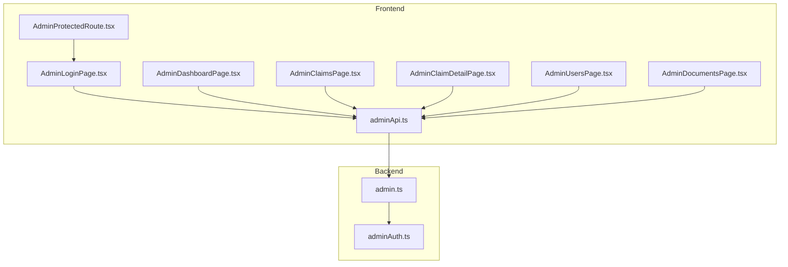
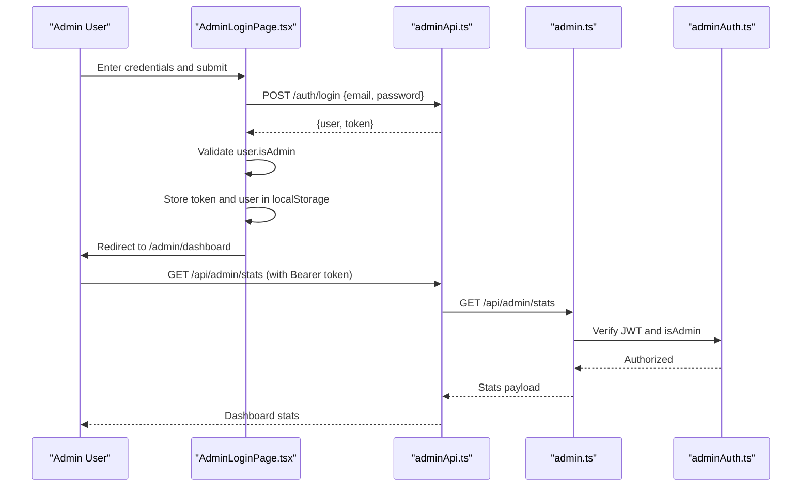
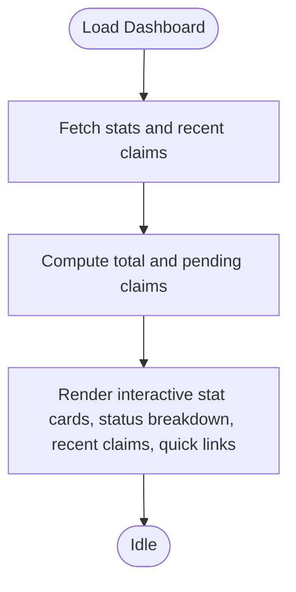
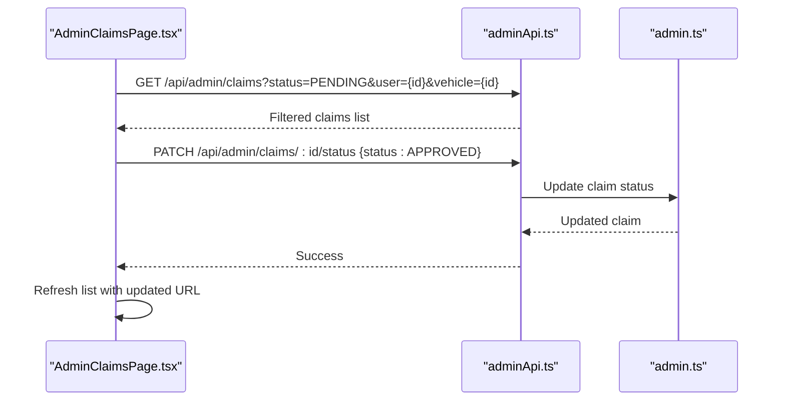
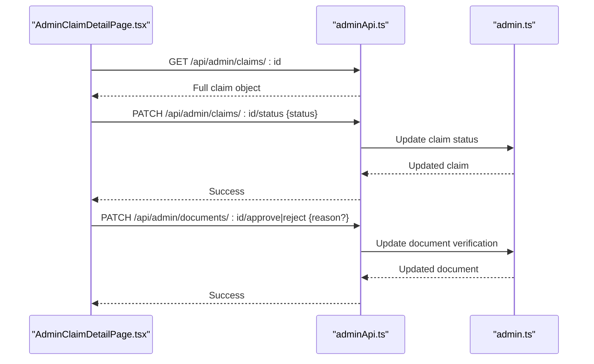
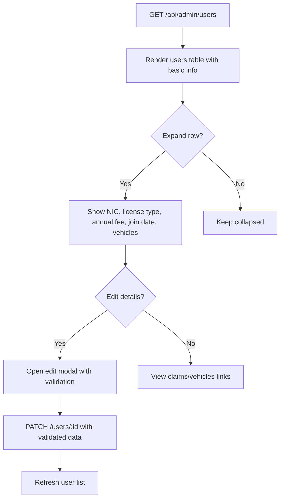
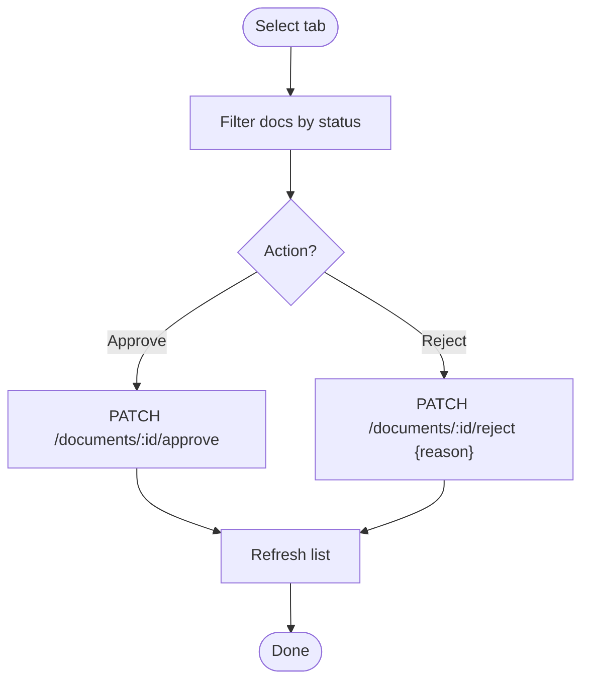
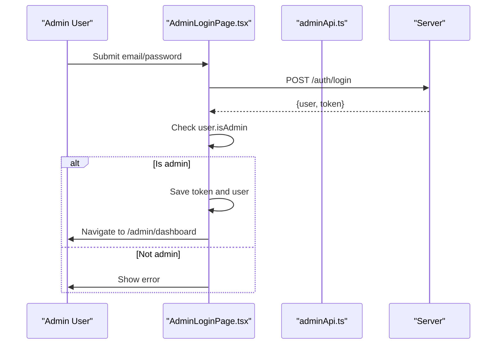
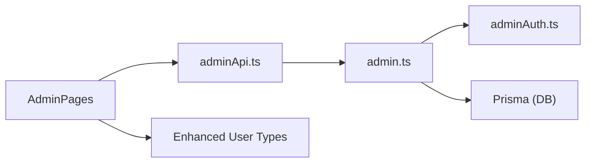

# Admin Pages

<cite>
**Referenced Files in This Document**
- [AdminDashboardPage.tsx](file://frontend/src/pages/admin/AdminDashboardPage.tsx)
- [AdminClaimsPage.tsx](file://frontend/src/pages/admin/AdminClaimsPage.tsx)
- [AdminClaimDetailPage.tsx](file://frontend/src/pages/admin/AdminClaimDetailPage.tsx)
- [AdminUsersPage.tsx](file://frontend/src/pages/admin/AdminUsersPage.tsx)
- [AdminDocumentsPage.tsx](file://frontend/src/pages/admin/AdminDocumentsPage.tsx)
- [AdminLoginPage.tsx](file://frontend/src/pages/admin/AdminLoginPage.tsx)
- [adminApi.ts](file://frontend/src/services/adminApi.ts)
- [AdminProtectedRoute.tsx](file://frontend/src/components/AdminProtectedRoute.tsx)
- [admin.ts](file://backend/src/routes/admin.ts)
- [adminAuth.ts](file://backend/src/middleware/adminAuth.ts)
- [types/index.ts](file://frontend/src/types/index.ts)
</cite>

## Update Summary
**Changes Made**
- Enhanced AdminUsersPage with comprehensive insurance company record management including NIC numbers, license types, annual fees, and join dates
- Upgraded AdminClaimsPage with advanced filtering capabilities including PENDING status filter and scope-based filtering via URL parameters
- Improved AdminDashboardPage with interactive stat cards featuring contextual navigation and hover effects
- Added sophisticated user detail editing modal with validation and real-time updates

## Table of Contents
1. [Introduction](#introduction)
2. [Project Structure](#project-structure)
3. [Core Components](#core-components)
4. [Architecture Overview](#architecture-overview)
5. [Detailed Component Analysis](#detailed-component-analysis)
6. [Dependency Analysis](#dependency-analysis)
7. [Performance Considerations](#performance-considerations)
8. [Troubleshooting Guide](#troubleshooting-guide)
9. [Conclusion](#conclusion)

## Introduction
This document provides comprehensive documentation for the administrative interface pages of the Smart Vehicle Insurance Claim System. It covers system analytics and monitoring, claim review and approval workflows, detailed claim inspection and decision-making, enhanced user management with insurance company records, document verification and management, and administrative authentication. The focus is on admin-specific features such as status management, sophisticated filtering, search, audit-ready actions (approve/reject with reasons), and comprehensive user data management.

## Project Structure
The admin UI is implemented as React components under the admin pages directory, communicating with a protected backend API via an Axios instance that injects bearer tokens and handles unauthorized responses by redirecting to the admin login. Backend routes enforce admin-only access using JWT-based middleware.

**Diagram sources**
- [AdminLoginPage.tsx:1-75](file://frontend/src/pages/admin/AdminLoginPage.tsx#L1-L75)
- [AdminDashboardPage.tsx:1-136](file://frontend/src/pages/admin/AdminDashboardPage.tsx#L1-L136)
- [AdminClaimsPage.tsx:1-187](file://frontend/src/pages/admin/AdminClaimsPage.tsx#L1-L187)
- [AdminClaimDetailPage.tsx:1-275](file://frontend/src/pages/admin/AdminClaimDetailPage.tsx#L1-L275)
- [AdminUsersPage.tsx:1-290](file://frontend/src/pages/admin/AdminUsersPage.tsx#L1-L290)
- [AdminDocumentsPage.tsx:1-210](file://frontend/src/pages/admin/AdminDocumentsPage.tsx#L1-L210)
- [adminApi.ts:1-28](file://frontend/src/services/adminApi.ts#L1-L28)
- [admin.ts:1-591](file://backend/src/routes/admin.ts#L1-L591)
- [adminAuth.ts:1-27](file://backend/src/middleware/adminAuth.ts#L1-L27)
- [AdminProtectedRoute.tsx:1-8](file://frontend/src/components/AdminProtectedRoute.tsx#L1-L8)

**Section sources**
- [AdminLoginPage.tsx:1-75](file://frontend/src/pages/admin/AdminLoginPage.tsx#L1-L75)
- [adminApi.ts:1-28](file://frontend/src/services/adminApi.ts#L1-L28)
- [admin.ts:1-591](file://backend/src/routes/admin.ts#L1-L591)
- [adminAuth.ts:1-27](file://backend/src/middleware/adminAuth.ts#L1-L27)
- [AdminProtectedRoute.tsx:1-8](file://frontend/src/components/AdminProtectedRoute.tsx#L1-L8)

## Core Components
- **AdminDashboardPage**: Displays system overview metrics with interactive stat cards that provide contextual navigation to relevant sections, claim status breakdown, recent claims list, and quick links to key admin areas.
- **AdminClaimsPage**: Lists claims with sophisticated filtering capabilities including PENDING status filter (combining multiple in-progress statuses), search by user/vehicle fields, and scope-based filtering via URL parameters (?user=, ?vehicle=).
- **AdminClaimDetailPage**: Provides full claim inspection including damage assessment, repair estimate, payout estimate, images, and documents; enables status changes and per-document approve/reject with optional reason.
- **AdminUsersPage**: Enhanced user management with detailed insurance company records including NIC numbers, license types, annual fees, and join dates; expandable rows show additional details with edit modal functionality.
- **AdminDocumentsPage**: Central hub for reviewing uploaded documents with tabs for Pending, Issues Found, and All; supports approve and reject with reason input.
- **AdminLoginPage**: Authenticates administrators, validates admin privileges, stores token and user info, and redirects to dashboard.

**Section sources**
- [AdminDashboardPage.tsx:1-136](file://frontend/src/pages/admin/AdminDashboardPage.tsx#L1-L136)
- [AdminClaimsPage.tsx:1-187](file://frontend/src/pages/admin/AdminClaimsPage.tsx#L1-L187)
- [AdminClaimDetailPage.tsx:1-275](file://frontend/src/pages/admin/AdminClaimDetailPage.tsx#L1-L275)
- [AdminUsersPage.tsx:1-290](file://frontend/src/pages/admin/AdminUsersPage.tsx#L1-L290)
- [AdminDocumentsPage.tsx:1-210](file://frontend/src/pages/admin/AdminDocumentsPage.tsx#L1-L210)
- [AdminLoginPage.tsx:1-75](file://frontend/src/pages/admin/AdminLoginPage.tsx#L1-L75)

## Architecture Overview
Administrative operations are secured via JWT-based middleware. The frontend uses a dedicated axios instance to call admin endpoints with Authorization headers. Unauthorized or forbidden responses trigger redirection to the admin login page.

**Diagram sources**
- [AdminLoginPage.tsx:13-31](file://frontend/src/pages/admin/AdminLoginPage.tsx#L13-L31)
- [adminApi.ts:7-24](file://frontend/src/services/adminApi.ts#L7-L24)
- [admin.ts:12-26](file://backend/src/routes/admin.ts#L12-L26)
- [adminAuth.ts:6-26](file://backend/src/middleware/adminAuth.ts#L6-L26)

## Detailed Component Analysis

### AdminDashboardPage
**Updated** Enhanced with interactive stat cards featuring contextual navigation and hover effects that link directly to relevant admin sections.

- Purpose: Provide a high-level overview of system health and activity with improved user experience.
- Key behaviors:
  - Fetches stats and recent claims concurrently.
  - Computes totals and pending counts from server-provided breakdowns.
  - Displays interactive stat cards with hover effects and direct navigation links.
  - Shows status badges and quick links to manage users, claims, and documents.
- Data model usage: Relies on types for claim status and related entities.

**Diagram sources**
- [AdminDashboardPage.tsx:18-31](file://frontend/src/pages/admin/AdminDashboardPage.tsx#L18-L31)
- [AdminDashboardPage.tsx:32-135](file://frontend/src/pages/admin/AdminDashboardPage.tsx#L32-L135)

**Section sources**
- [AdminDashboardPage.tsx:1-136](file://frontend/src/pages/admin/AdminDashboardPage.tsx#L1-L136)
- [types/index.ts:40-44](file://frontend/src/types/index.ts#L40-L44)

### AdminClaimsPage
**Updated** Enhanced with sophisticated filtering capabilities including PENDING status filter and scope-based filtering via URL parameters.

- Purpose: List and filter claims with advanced filtering options and contextual navigation.
- Key behaviors:
  - Search by user/vehicle fields and filter by status including PENDING virtual filter.
  - Supports scope-based filtering via URL parameters (?user=, ?vehicle=) for contextual views.
  - Approve claim inline via PATCH to update status.
  - Shows image/document counts and severity badge when available.
  - Maintains URL state for shareable filtered views.
- Data model usage: Uses claim status and severity types with enhanced filtering support.

**Diagram sources**
- [AdminClaimsPage.tsx:34-44](file://frontend/src/pages/admin/AdminClaimsPage.tsx#L34-L44)
- [admin.ts:331-370](file://backend/src/routes/admin.ts#L331-L370)
- [admin.ts:400-418](file://backend/src/routes/admin.ts#L400-L418)

**Section sources**
- [AdminClaimsPage.tsx:1-187](file://frontend/src/pages/admin/AdminClaimsPage.tsx#L1-L187)
- [types/index.ts:40-44](file://frontend/src/types/index.ts#L40-L44)

### AdminClaimDetailPage
- Purpose: Inspect a single claim and make decisions (status changes, document approvals/rejections).
- Key behaviors:
  - Loads full claim data including images, assessments, estimates, payouts, and documents.
  - Quick actions to set status (Approve, Reject, Under Review, Completed).
  - Advanced status override via select control.
  - Per-document approve/reject with optional rejection reason.
- Data model usage: Leverages claim, damage assessment, repair estimate, insurance payout, and document types.

**Diagram sources**
- [AdminClaimDetailPage.tsx:29-74](file://frontend/src/pages/admin/AdminClaimDetailPage.tsx#L29-L74)
- [admin.ts:400-418](file://backend/src/routes/admin.ts#L400-L418)
- [admin.ts:446-461](file://backend/src/routes/admin.ts#L446-L461)
- [admin.ts:515-531](file://backend/src/routes/admin.ts#L515-L531)

**Section sources**
- [AdminClaimDetailPage.tsx:1-275](file://frontend/src/pages/admin/AdminClaimDetailPage.tsx#L1-L275)
- [types/index.ts:40-144](file://frontend/src/types/index.ts#L40-L144)

### AdminUsersPage
**Updated** Significantly enhanced with comprehensive insurance company record management and detailed user information display.

- Purpose: View and manage registered users with detailed insurance company records and expanded functionality.
- Key behaviors:
  - Fetches non-admin users with vehicle and claim counts plus detailed insurance records.
  - Expandable rows reveal phone, address, NIC, license type, annual fee, join date, and counts.
  - Edit modal for updating insurance company records with validation.
  - Direct links to view claims and vehicles scoped to specific users.
  - Delete functionality with confirmation dialog showing affected records.
- Data model usage: Uses enhanced AdminUser type with insurance company fields and nested vehicle data.

**Diagram sources**
- [AdminUsersPage.tsx:22-26](file://frontend/src/pages/admin/AdminUsersPage.tsx#L22-L26)
- [AdminUsersPage.tsx:136-204](file://frontend/src/pages/admin/AdminUsersPage.tsx#L136-L204)
- [AdminUsersPage.tsx:214-286](file://frontend/src/pages/admin/AdminUsersPage.tsx#L214-L286)
- [admin.ts:28-53](file://backend/src/routes/admin.ts#L28-L53)
- [admin.ts:55-109](file://backend/src/routes/admin.ts#L55-L109)

**Section sources**
- [AdminUsersPage.tsx:1-290](file://frontend/src/pages/admin/AdminUsersPage.tsx#L1-L290)
- [admin.ts:28-109](file://backend/src/routes/admin.ts#L28-L109)
- [types/index.ts:17-30](file://frontend/src/types/index.ts#L17-L30)

### AdminDocumentsPage
- Purpose: Centralized document review workflow with filtering and actions.
- Key behaviors:
  - Tabbed filtering: Pending, Issues Found, All.
  - Inline approve or reject with optional reason input.
  - Links back to associated claim for context.
- Data model usage: Uses document verification statuses and claim/user/vehicle associations.

**Diagram sources**
- [AdminDocumentsPage.tsx:28-69](file://frontend/src/pages/admin/AdminDocumentsPage.tsx#L28-L69)
- [admin.ts:446-461](file://backend/src/routes/admin.ts#L446-L461)
- [admin.ts:515-531](file://backend/src/routes/admin.ts#L515-L531)

**Section sources**
- [AdminDocumentsPage.tsx:1-210](file://frontend/src/pages/admin/AdminDocumentsPage.tsx#L1-L210)
- [admin.ts:446-531](file://backend/src/routes/admin.ts#L446-L531)

### AdminLoginPage
- Purpose: Authenticate administrators and gate access to admin routes.
- Key behaviors:
  - Submits credentials to login endpoint.
  - Validates admin role before storing token and navigating.
  - Displays errors for invalid credentials or insufficient privileges.
- Security note: Token storage is client-side; route protection relies on presence of token and backend enforcement.

**Diagram sources**
- [AdminLoginPage.tsx:13-31](file://frontend/src/pages/admin/AdminLoginPage.tsx#L13-L31)

**Section sources**
- [AdminLoginPage.tsx:1-75](file://frontend/src/pages/admin/AdminLoginPage.tsx#L1-L75)

## Dependency Analysis
- Frontend dependencies:
  - All admin pages depend on adminApi for authenticated requests.
  - AdminProtectedRoute guards admin routes based on token presence.
  - Enhanced AdminUsersPage depends on comprehensive user data structures.
- Backend dependencies:
  - admin routes depend on adminAuth middleware to validate JWT and ensure admin role.
  - Routes use Prisma to read/write claims, users, and documents with enhanced user data support.

**Diagram sources**
- [adminApi.ts:1-28](file://frontend/src/services/adminApi.ts#L1-L28)
- [admin.ts:1-591](file://backend/src/routes/admin.ts#L1-L591)
- [adminAuth.ts:1-27](file://backend/src/middleware/adminAuth.ts#L1-L27)
- [types/index.ts:17-30](file://frontend/src/types/index.ts#L17-L30)

**Section sources**
- [adminApi.ts:1-28](file://frontend/src/services/adminApi.ts#L1-L28)
- [admin.ts:1-591](file://backend/src/routes/admin.ts#L1-L591)
- [adminAuth.ts:1-27](file://backend/src/middleware/adminAuth.ts#L1-L27)
- [types/index.ts:17-30](file://frontend/src/types/index.ts#L17-L30)

## Performance Considerations
- Concurrent fetching: Dashboard fetches stats and recent claims in parallel to reduce load time.
- Filtering at source: Claims and documents use query parameters to minimize client-side processing, including sophisticated PENDING status filtering.
- Selective includes: Backend queries include only necessary relations to reduce payload size, with enhanced user data loading.
- Optimizations to consider:
  - Pagination for large lists (claims, documents).
  - Debounced search input to reduce request frequency.
  - Caching frequently accessed stats with short TTL if appropriate.
  - Virtual scrolling for large user lists with expanded details.

## Troubleshooting Guide
- Authentication issues:
  - If requests return 401/403, the adminApi interceptor clears the token and redirects to the login page. Ensure the token exists and is valid.
  - Confirm that the logged-in user has admin privileges; otherwise, the login flow denies access.
- Status updates fail:
  - Ensure the requested status is one of the allowed values enforced by the backend.
  - Check network errors and verify the claim ID exists.
- Document actions fail:
  - Approve/reject require valid document IDs; verify the document belongs to the current claim context.
  - Rejection requires a reason field; provide a meaningful message for auditability.
- User management issues:
  - Enhanced user editing requires valid NIC format, license type selection, and numeric annual fee values.
  - Date validation ensures proper joinedAt format for user records.
- Empty states:
  - No claims/documents/users may indicate missing data or overly restrictive filters; adjust filters or clear search.
  - Scope-based filtering (?user=, ?vehicle=) may result in empty results if no matching records exist.

**Section sources**
- [adminApi.ts:16-24](file://frontend/src/services/adminApi.ts#L16-L24)
- [admin.ts:400-418](file://backend/src/routes/admin.ts#L400-L418)
- [admin.ts:446-531](file://backend/src/routes/admin.ts#L446-L531)
- [AdminLoginPage.tsx:17-31](file://frontend/src/pages/admin/AdminLoginPage.tsx#L17-L31)
- [admin.ts:55-109](file://backend/src/routes/admin.ts#L55-L109)

## Conclusion
The administrative interface provides a comprehensive set of tools for monitoring system health, managing claims and users with detailed insurance company records, and verifying documents. Recent enhancements include sophisticated filtering capabilities, interactive stat cards with contextual navigation, and robust user management with validation. The system emphasizes secure access, efficient data retrieval, and actionable workflows for approving or rejecting claims and documents. Future enhancements can include pagination, advanced reporting, bulk operations, and richer audit trails to further streamline administrative tasks.