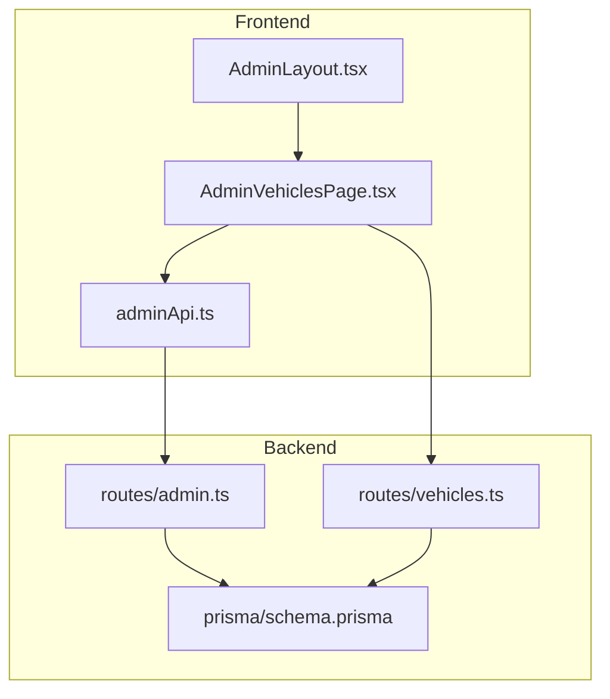
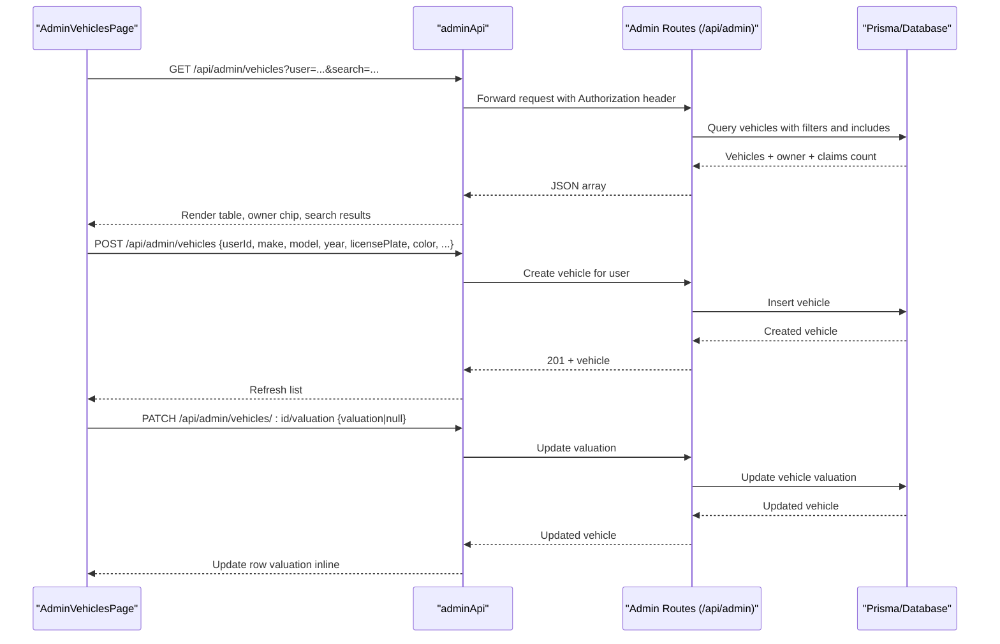
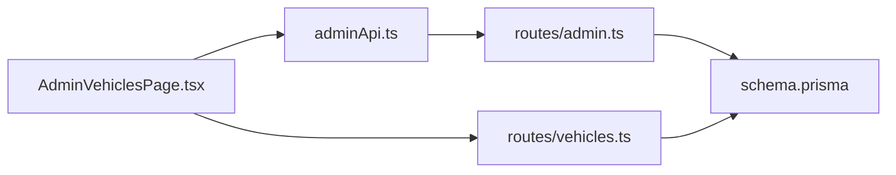

# Admin Vehicles Page

<cite>
**Referenced Files in This Document**
- [AdminVehiclesPage.tsx](file://frontend/src/pages/admin/AdminVehiclesPage.tsx)
- [adminApi.ts](file://frontend/src/services/adminApi.ts)
- [admin.ts](file://backend/src/routes/admin.ts)
- [vehicles.ts](file://backend/src/routes/vehicles.ts)
- [schema.prisma](file://backend/prisma/schema.prisma)
- [AdminLayout.tsx](file://frontend/src/components/AdminLayout.tsx)
</cite>

## Table of Contents
1. [Introduction](#introduction)
2. [Project Structure](#project-structure)
3. [Core Components](#core-components)
4. [Architecture Overview](#architecture-overview)
5. [Detailed Component Analysis](#detailed-component-analysis)
6. [Dependency Analysis](#dependency-analysis)
7. [Performance Considerations](#performance-considerations)
8. [Troubleshooting Guide](#troubleshooting-guide)
9. [Conclusion](#conclusion)

## Introduction
This document explains the Admin Vehicles page, which allows insurance administrators to view all registered vehicles, filter by owner, search across vehicle and owner fields, add vehicles on behalf of users, and set or clear a vehicle’s insured valuation that caps claim payouts. It covers the frontend UI, API integration, backend endpoints, data model, and key workflows.

## Project Structure
The Admin Vehicles feature spans both frontend and backend:
- Frontend: A React page with search, filters, modals for adding vehicles and editing valuation, and an admin API client.
- Backend: Admin routes for listing, creating vehicles, and updating valuation; plus standard user-owned vehicle routes used elsewhere.
- Data: Prisma schema defines Vehicle and related relationships (User, Claims).

**Diagram sources**
- [AdminVehiclesPage.tsx:1-337](file://frontend/src/pages/admin/AdminVehiclesPage.tsx#L1-L337)
- [adminApi.ts:1-28](file://frontend/src/services/adminApi.ts#L1-L28)
- [admin.ts:127-227](file://backend/src/routes/admin.ts#L127-L227)
- [vehicles.ts:34-81](file://backend/src/routes/vehicles.ts#L34-L81)
- [schema.prisma:32-50](file://backend/prisma/schema.prisma#L32-L50)
- [AdminLayout.tsx:5-13](file://frontend/src/components/AdminLayout.tsx#L5-L13)

**Section sources**
- [AdminVehiclesPage.tsx:1-337](file://frontend/src/pages/admin/AdminVehiclesPage.tsx#L1-L337)
- [adminApi.ts:1-28](file://frontend/src/services/adminApi.ts#L1-L28)
- [admin.ts:127-227](file://backend/src/routes/admin.ts#L127-L227)
- [vehicles.ts:34-81](file://backend/src/routes/vehicles.ts#L34-L81)
- [schema.prisma:32-50](file://backend/prisma/schema.prisma#L32-L50)
- [AdminLayout.tsx:5-13](file://frontend/src/components/AdminLayout.tsx#L5-L13)

## Core Components
- AdminVehiclesPage: Displays vehicles, supports filtering by owner via URL query, global search, adding vehicles, and editing valuation.
- adminApi: Axios instance for admin endpoints with token handling and redirect on auth errors.
- Admin routes: Provide list, create, and valuation update for vehicles under /api/admin.
- User vehicle routes: Standard CRUD for authenticated users (not directly used by this page but part of the same domain).
- Prisma schema: Defines Vehicle model including valuation field and relations.

Key responsibilities:
- List vehicles with owner info and claim counts.
- Add a vehicle for a selected user.
- Set or clear vehicle valuation (caps payouts).
- Search across vehicle attributes and owner names.
- Filter by a specific user via URL parameter.

**Section sources**
- [AdminVehiclesPage.tsx:31-117](file://frontend/src/pages/admin/AdminVehiclesPage.tsx#L31-L117)
- [adminApi.ts:1-28](file://frontend/src/services/adminApi.ts#L1-L28)
- [admin.ts:127-227](file://backend/src/routes/admin.ts#L127-L227)
- [schema.prisma:32-50](file://backend/prisma/schema.prisma#L32-L50)

## Architecture Overview
End-to-end flow for viewing and managing vehicles as an admin:

**Diagram sources**
- [AdminVehiclesPage.tsx:50-113](file://frontend/src/pages/admin/AdminVehiclesPage.tsx#L50-L113)
- [adminApi.ts:1-28](file://frontend/src/services/adminApi.ts#L1-L28)
- [admin.ts:127-227](file://backend/src/routes/admin.ts#L127-L227)

## Detailed Component Analysis

### AdminVehiclesPage (Frontend)
Responsibilities:
- Fetch vehicles and users list once on mount.
- Support owner filter via URL query (?user=...) and show a removable chip.
- Global search across vehicle fields and owner names.
- Modal to add a new vehicle for a selected user.
- Modal to set/clear vehicle valuation (insured value cap).
- Link to claims filtered by vehicle.

State and interactions:
- Loading state while fetching vehicles.
- Form state for adding vehicles with validation before submission.
- Valuation modal state with numeric validation and optimistic UI updates.

Data model used in UI:
- Vehicle object includes owner details and claim count for display.

Navigation:
- Uses react-router to link to claims filtered by vehicle id.

Error handling:
- Alerts on validation failures and API errors.
- Clears modal and re-fetches on success.

**Section sources**
- [AdminVehiclesPage.tsx:6-20](file://frontend/src/pages/admin/AdminVehiclesPage.tsx#L6-L20)
- [AdminVehiclesPage.tsx:31-117](file://frontend/src/pages/admin/AdminVehiclesPage.tsx#L31-L117)
- [AdminVehiclesPage.tsx:119-337](file://frontend/src/pages/admin/AdminVehiclesPage.tsx#L119-L337)

### Admin API Client
- Base URL points to admin endpoints.
- Automatically attaches Bearer token from localStorage for admin sessions.
- Redirects to admin login on 401/403 responses.

**Section sources**
- [adminApi.ts:1-28](file://frontend/src/services/adminApi.ts#L1-L28)

### Admin Routes (Backend)
Endpoints relevant to Admin Vehicles:
- GET /api/admin/vehicles: Lists all vehicles with optional ?user filter and ?search across vehicle and owner fields. Includes owner and claim counts.
- POST /api/admin/vehicles: Creates a vehicle for a specified user after validating required fields and year range.
- PATCH /api/admin/vehicles/:id/valuation: Sets or clears vehicle valuation with non-negative number validation.

Security:
- All admin routes are protected by admin authentication middleware.

Error handling:
- Returns descriptive error messages for validation failures and not found cases.

**Section sources**
- [admin.ts:127-227](file://backend/src/routes/admin.ts#L127-L227)

### User Vehicle Routes (Reference)
Standard authenticated routes for user-owned vehicles (create, read, update, delete). Not used directly by the Admin Vehicles page but share the same Vehicle model.

**Section sources**
- [vehicles.ts:34-166](file://backend/src/routes/vehicles.ts#L34-L166)

### Data Model (Prisma)
Vehicle model highlights:
- Fields: id, userId, make, model, year, vin, licensePlate, color, mileage, photos, valuation, timestamps.
- Relations: belongs to User; has many Claims.
- Valuation is nullable and used to cap claim payouts.

**Section sources**
- [schema.prisma:32-50](file://backend/prisma/schema.prisma#L32-L50)

### Navigation and Layout
- The Admin layout provides navigation to the Vehicles page and other admin sections.
- The page can be reached via /admin/vehicles.

**Section sources**
- [AdminLayout.tsx:5-13](file://frontend/src/components/AdminLayout.tsx#L5-L13)

## Dependency Analysis
High-level dependencies:
- AdminVehiclesPage depends on adminApi for network calls and uses react-router for navigation.
- adminApi depends on environment configuration for base URL and local storage for tokens.
- Admin routes depend on Prisma client and database schema.
- User vehicle routes also depend on Prisma and are separate from admin routes.

**Diagram sources**
- [AdminVehiclesPage.tsx:1-337](file://frontend/src/pages/admin/AdminVehiclesPage.tsx#L1-L337)
- [adminApi.ts:1-28](file://frontend/src/services/adminApi.ts#L1-L28)
- [admin.ts:127-227](file://backend/src/routes/admin.ts#L127-L227)
- [vehicles.ts:34-166](file://backend/src/routes/vehicles.ts#L34-L166)
- [schema.prisma:32-50](file://backend/prisma/schema.prisma#L32-L50)

**Section sources**
- [AdminVehiclesPage.tsx:1-337](file://frontend/src/pages/admin/AdminVehiclesPage.tsx#L1-L337)
- [adminApi.ts:1-28](file://frontend/src/services/adminApi.ts#L1-L28)
- [admin.ts:127-227](file://backend/src/routes/admin.ts#L127-L227)
- [vehicles.ts:34-166](file://backend/src/routes/vehicles.ts#L34-L166)
- [schema.prisma:32-50](file://backend/prisma/schema.prisma#L32-L50)

## Performance Considerations
- Server-side filtering: Admin route supports ?user and ?search to minimize payload size and improve responsiveness.
- Include only necessary fields: Owner selection and claim counts are included to avoid extra requests.
- Optimistic UI: After saving valuation, the row updates immediately without full reload.
- Debouncing search: Consider debouncing search input to reduce repeated requests if needed.
- Pagination: For large datasets, consider pagination on the admin vehicles endpoint to limit rows per page.

[No sources needed since this section provides general guidance]

## Troubleshooting Guide
Common issues and resolutions:
- Authentication failures: If admin token is missing or expired, adminApi redirects to admin login. Ensure adminToken exists in localStorage and is valid.
- Validation errors when adding a vehicle: Required fields include owner, make, model, year, license plate, and color. Year must be a valid number within allowed range.
- Invalid valuation: Must be a non-negative number or empty to clear. Errors will be returned if invalid.
- Not found errors: Ensure vehicle id exists when updating valuation; ensure user id exists when creating a vehicle for a user.

Where to look:
- Frontend alerts and form validation logic.
- Backend route handlers for error responses and status codes.

**Section sources**
- [AdminVehiclesPage.tsx:67-113](file://frontend/src/pages/admin/AdminVehiclesPage.tsx#L67-L113)
- [admin.ts:159-227](file://backend/src/routes/admin.ts#L159-L227)

## Conclusion
The Admin Vehicles page provides a comprehensive interface for administrators to manage vehicles across all users, with robust filtering, search, creation, and valuation management. The backend enforces security and validation, while the frontend offers a responsive, user-friendly experience with immediate feedback and clear error messaging. Future enhancements could include pagination, advanced filters, and export capabilities.

[No sources needed since this section summarizes without analyzing specific files]