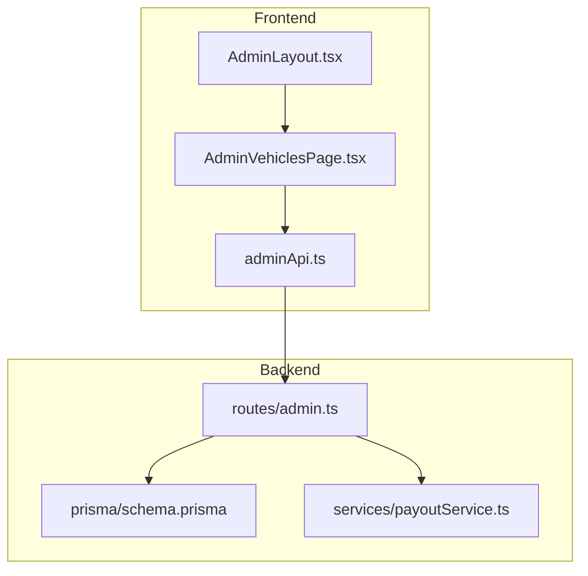
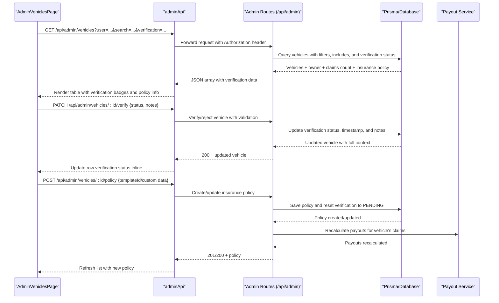
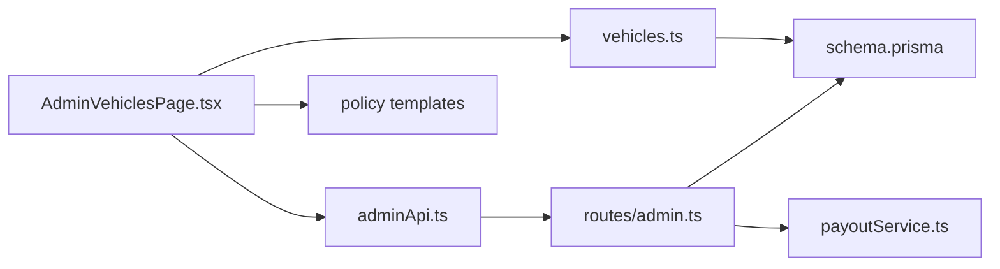

# Admin Vehicles Page

<cite>
**Referenced Files in This Document**
- [AdminVehiclesPage.tsx](file://frontend/src/pages/admin/AdminVehiclesPage.tsx)
- [adminApi.ts](file://frontend/src/services/adminApi.ts)
- [admin.ts](file://backend/src/routes/admin.ts)
- [schema.prisma](file://backend/prisma/schema.prisma)
- [index.ts](file://frontend/src/types/index.ts)
- [AdminLayout.tsx](file://frontend/src/components/AdminLayout.tsx)
</cite>

## Update Summary
**Changes Made**
- Added comprehensive vehicle verification management capabilities including verify/reject functionality
- Enhanced with vehicle-specific insurance policy management through built-in templates and custom entries
- Implemented verification notes system for communication between admin and users
- Added verification status filtering and visual indicators throughout the interface
- Integrated policy template system for standardized insurance plan management
- Enhanced claim payout recalculation when policies or valuations change

## Table of Contents
1. [Introduction](#introduction)
2. [Project Structure](#project-structure)
3. [Core Components](#core-components)
4. [Architecture Overview](#architecture-overview)
5. [Detailed Component Analysis](#detailed-component-analysis)
6. [Vehicle Verification Management](#vehicle-verification-management)
7. [Insurance Policy Management](#insurance-policy-management)
8. [Dependency Analysis](#dependency-analysis)
9. [Performance Considerations](#performance-considerations)
10. [Troubleshooting Guide](#troubleshooting-guide)
11. [Conclusion](#conclusion)

## Introduction
This document explains the enhanced Admin Vehicles page, which provides comprehensive vehicle verification management capabilities for insurance administrators. The system allows admins to view all registered vehicles, filter by owner and verification status, search across vehicle and owner fields, add vehicles on behalf of users, manage vehicle-specific insurance policies, set vehicle valuations that cap claim payouts, and verify or reject vehicles with optional notes for user communication.

## Project Structure
The enhanced Admin Vehicles feature spans both frontend and backend with comprehensive verification and policy management:
- Frontend: A React page with search, filters, modals for adding vehicles, editing valuation, managing insurance policies, and handling verification workflows.
- Backend: Admin routes for listing, creating vehicles, updating valuation, verifying/rejecting vehicles, and managing insurance policies; plus standard user-owned vehicle routes used elsewhere.
- Data: Prisma schema defines Vehicle with verification fields, InsurancePolicy relationships, and PolicyTemplate support.

**Diagram sources**
- [AdminVehiclesPage.tsx:1-649](file://frontend/src/pages/admin/AdminVehiclesPage.tsx#L1-L649)
- [adminApi.ts:1-28](file://frontend/src/services/adminApi.ts#L1-L28)
- [admin.ts:150-403](file://backend/src/routes/admin.ts#L150-L403)
- [schema.prisma:32-100](file://backend/prisma/schema.prisma#L32-L100)
- [AdminLayout.tsx:5-13](file://frontend/src/components/AdminLayout.tsx#L5-L13)

**Section sources**
- [AdminVehiclesPage.tsx:1-649](file://frontend/src/pages/admin/AdminVehiclesPage.tsx#L1-L649)
- [adminApi.ts:1-28](file://frontend/src/services/adminApi.ts#L1-L28)
- [admin.ts:150-403](file://backend/src/routes/admin.ts#L150-L403)
- [schema.prisma:32-100](file://backend/prisma/schema.prisma#L32-L100)
- [AdminLayout.tsx:5-13](file://frontend/src/components/AdminLayout.tsx#L5-L13)

## Core Components
- **AdminVehiclesPage**: Displays vehicles with comprehensive verification status management, insurance policy administration, and valuation controls.
- **adminApi**: Axios instance for admin endpoints with token handling and redirect on auth errors.
- **Admin routes**: Provide complete vehicle lifecycle management including verification, policy assignment, and valuation updates under /api/admin.
- **Prisma schema**: Defines Vehicle model with verification fields (verificationStatus, verifiedAt, verificationNotes), InsurancePolicy relationships, and PolicyTemplate support.

Key responsibilities:
- List vehicles with owner info, claim counts, and verification status
- Add vehicles for selected users with automatic PENDING verification status
- Set or clear vehicle valuation (caps payouts) with automatic claim recalculation
- Verify or reject vehicles with optional notes for user communication
- Manage vehicle-specific insurance policies through built-in templates or custom entries
- Search across vehicle attributes and owner names
- Filter by specific user and verification status via URL parameters

**Section sources**
- [AdminVehiclesPage.tsx:48-177](file://frontend/src/pages/admin/AdminVehiclesPage.tsx#L48-L177)
- [adminApi.ts:1-28](file://frontend/src/services/adminApi.ts#L1-L28)
- [admin.ts:150-403](file://backend/src/routes/admin.ts#L150-L403)
- [schema.prisma:32-100](file://backend/prisma/schema.prisma#L32-L100)

## Architecture Overview
Enhanced end-to-end flow for vehicle verification and policy management as an admin:

**Diagram sources**
- [AdminVehiclesPage.tsx:160-251](file://frontend/src/pages/admin/AdminVehiclesPage.tsx#L160-L251)
- [adminApi.ts:1-28](file://frontend/src/services/adminApi.ts#L1-L28)
- [admin.ts:186-330](file://backend/src/routes/admin.ts#L186-L330)

## Detailed Component Analysis

### AdminVehiclesPage (Enhanced Frontend)
Responsibilities:
- Fetch vehicles and users list once on mount with verification status filtering
- Support owner filter via URL query (?user=...) and verification status filter (?verification=PENDING|VERIFIED|REJECTED)
- Global search across vehicle fields and owner names
- Modal to add a new vehicle for a selected user
- Modal to set/clear vehicle valuation (insured value cap)
- Comprehensive verification management with notes system
- Insurance policy management through built-in templates or custom entries
- Link to claims filtered by vehicle

Enhanced state and interactions:
- Loading state while fetching vehicles
- Form state for adding vehicles with validation before submission
- Valuation modal state with numeric validation and optimistic UI updates
- Verification workflow with prompt-based note entry and status management
- Policy template selection with pre-filled form data and custom entry mode
- Real-time verification status display with color-coded badges

Data model used in UI:
- Vehicle object includes owner details, claim count, verification status, verification notes, and insurance policy information

Navigation:
- Uses react-router to link to claims filtered by vehicle id

Error handling:
- Alerts on validation failures and API errors
- Clears modals and re-fetches on success
- Handles verification and policy operations with appropriate feedback

**Section sources**
- [AdminVehiclesPage.tsx:48-177](file://frontend/src/pages/admin/AdminVehiclesPage.tsx#L48-L177)
- [AdminVehiclesPage.tsx:179-251](file://frontend/src/pages/admin/AdminVehiclesPage.tsx#L179-L251)
- [AdminVehiclesPage.tsx:257-649](file://frontend/src/pages/admin/AdminVehiclesPage.tsx#L257-L649)

### Admin API Client
- Base URL points to admin endpoints
- Automatically attaches Bearer token from localStorage for admin sessions
- Redirects to admin login on 401/403 responses

**Section sources**
- [adminApi.ts:1-28](file://frontend/src/services/adminApi.ts#L1-L28)

### Admin Routes (Enhanced Backend)
Endpoints relevant to Enhanced Admin Vehicles:
- GET /api/admin/vehicles: Lists all vehicles with optional ?user filter, ?search across vehicle and owner fields, and ?verification status filter. Includes owner, claim counts, and insurance policy with template information.
- POST /api/admin/vehicles: Creates a vehicle for a specified user after validating required fields and year range, with default PENDING verification status.
- PATCH /api/admin/vehicles/:id/valuation: Sets or clears vehicle valuation with non-negative number validation and automatic claim payout recalculation.
- PATCH /api/admin/vehicles/:id/verify: Verifies or rejects vehicles with status validation, requires insurance policy for VERIFIED status, supports optional notes, and sets verification timestamp.
- POST /api/admin/vehicles/:id/policy: Adds or replaces vehicle insurance policy using built-in templates or custom entry, resets verification to PENDING, and recalculates claim payouts.

Security:
- All admin routes are protected by admin authentication middleware

Error handling:
- Returns descriptive error messages for validation failures, not found cases, and business logic constraints

**Section sources**
- [admin.ts:150-403](file://backend/src/routes/admin.ts#L150-L403)

### Data Model (Enhanced Prisma)
Vehicle model highlights:
- Fields: id, userId, make, model, year, vin, licensePlate, color, mileage, photos, valuation, timestamps
- Verification fields: verificationStatus (PENDING|VERIFIED|REJECTED), verifiedAt (timestamp), verificationNotes (optional text)
- Relations: belongs to User; has many Claims; has one InsurancePolicy
- Valuation is nullable and used to cap claim payouts
- Verification status affects claim eligibility

InsurancePolicy model:
- Vehicle-based insurance with unique vehicleId constraint
- Supports both built-in templates and custom entries
- Includes coverage details, deductibles, and premium amounts
- Links to PolicyTemplate for standardized plans

PolicyTemplate model:
- Built-in insurance plans managed by the company
- Supports multiple coverage types and tiers
- Includes pricing, coverage percentages, and deductible amounts

**Section sources**
- [schema.prisma:32-100](file://backend/prisma/schema.prisma#L32-L100)

### Navigation and Layout
- The Admin layout provides navigation to the Vehicles page and other admin sections
- The page can be reached via /admin/vehicles

**Section sources**
- [AdminLayout.tsx:5-13](file://frontend/src/components/AdminLayout.tsx#L5-L13)

## Vehicle Verification Management

### Verification Workflow
The enhanced system implements a comprehensive vehicle verification workflow:

1. **Initial State**: New vehicles are created with PENDING verification status
2. **Verification Process**: Admins can verify or reject vehicles through the interface
3. **Policy Requirement**: VERIFIED status requires an attached insurance policy
4. **Notes System**: Optional notes provide communication between admin and users
5. **Timestamp Tracking**: Verified vehicles record when verification occurred
6. **User Visibility**: Users can see verification status and notes in their vehicle management

### Verification Status Display
- **PENDING**: Amber badge with alert icon, shows when awaiting review
- **VERIFIED**: Green badge with checkmark, indicates vehicle is approved for claims
- **REJECTED**: Red badge with X icon, shows when verification failed

### Verification Actions
- **Verify Button**: Available for PENDING and REJECTED vehicles, prompts for optional notes
- **Reject Button**: Available for PENDING and VERIFIED vehicles, prompts for rejection reason
- **Status Filtering**: URL parameter support for filtering by verification status
- **Real-time Updates**: Immediate UI updates without page refresh

**Section sources**
- [AdminVehiclesPage.tsx:160-177](file://frontend/src/pages/admin/AdminVehiclesPage.tsx#L160-L177)
- [AdminVehiclesPage.tsx:362-377](file://frontend/src/pages/admin/AdminVehiclesPage.tsx#L362-L377)
- [admin.ts:186-225](file://backend/src/routes/admin.ts#L186-L225)

## Insurance Policy Management

### Policy Template System
The system supports two modes for insurance policy management:

1. **Built-in Templates**: Pre-configured insurance plans with standardized terms
   - Automatic form population based on template selection
   - Standardized provider name ("Flash Claim Insurance")
   - Consistent coverage types and pricing structures
   - Active template filtering for available options

2. **Custom Entry**: Fully customizable insurance policies
   - Manual entry of all policy details
   - Flexible coverage percentages and deductible amounts
   - Custom provider information and policy numbers
   - Date range configuration for policy validity

### Policy Management Features
- **One Policy Per Vehicle**: Enforced through database constraints
- **Automatic Reset**: Policy changes reset vehicle verification to PENDING
- **Claim Recalculation**: Policy changes trigger automatic claim payout recalculation
- **Template Integration**: Seamless switching between template and custom modes
- **Validation**: Comprehensive input validation for all policy fields

### Policy Display and Editing
- **Inline Display**: Shows current policy details in vehicle table
- **Edit Interface**: Modal-based policy editor with template selection
- **Visual Indicators**: Clear distinction between template-based and custom policies
- **Date Management**: Automatic date calculations and validation

**Section sources**
- [AdminVehiclesPage.tsx:179-251](file://frontend/src/pages/admin/AdminVehiclesPage.tsx#L179-L251)
- [AdminVehiclesPage.tsx:506-612](file://frontend/src/pages/admin/AdminVehiclesPage.tsx#L506-L612)
- [admin.ts:227-330](file://backend/src/routes/admin.ts#L227-L330)

## Dependency Analysis
Enhanced dependencies for the comprehensive vehicle management system:
- AdminVehiclesPage depends on adminApi for network calls and uses react-router for navigation
- adminApi depends on environment configuration for base URL and local storage for tokens
- Admin routes depend on Prisma client, database schema, and payout service for claim recalculation
- Vehicle verification integrates with insurance policy system and claim processing
- Policy templates provide standardized insurance plan management

**Diagram sources**
- [AdminVehiclesPage.tsx:1-649](file://frontend/src/pages/admin/AdminVehiclesPage.tsx#L1-L649)
- [adminApi.ts:1-28](file://frontend/src/services/adminApi.ts#L1-L28)
- [admin.ts:150-403](file://backend/src/routes/admin.ts#L150-L403)
- [schema.prisma:32-100](file://backend/prisma/schema.prisma#L32-L100)

**Section sources**
- [AdminVehiclesPage.tsx:1-649](file://frontend/src/pages/admin/AdminVehiclesPage.tsx#L1-L649)
- [adminApi.ts:1-28](file://frontend/src/services/adminApi.ts#L1-L28)
- [admin.ts:150-403](file://backend/src/routes/admin.ts#L150-L403)
- [schema.prisma:32-100](file://backend/prisma/schema.prisma#L32-L100)

## Performance Considerations
- Server-side filtering: Admin route supports ?user, ?search, and ?verification parameters to minimize payload size and improve responsiveness
- Include only necessary fields: Owner selection, claim counts, and insurance policy data included to avoid extra requests
- Optimistic UI: After saving valuation or verification, rows update immediately without full reload
- Debouncing search: Consider debouncing search input to reduce repeated requests if needed
- Pagination: For large datasets, consider pagination on the admin vehicles endpoint to limit rows per page
- Template caching: Policy templates fetched once and reused across policy operations
- Batch operations: Claim payout recalculation optimized for bulk updates when policies change

## Troubleshooting Guide
Common issues and resolutions:
- Authentication failures: If admin token is missing or expired, adminApi redirects to admin login. Ensure adminToken exists in localStorage and is valid.
- Validation errors when adding a vehicle: Required fields include owner, make, model, year, license plate, and color. Year must be a valid number within allowed range.
- Invalid valuation: Must be a non-negative number or empty to clear. Errors will be returned if invalid.
- Not found errors: Ensure vehicle id exists when updating valuation or verification; ensure user id exists when creating a vehicle for a user.
- Verification errors: VERIFIED status requires an attached insurance policy. Use the policy management interface first.
- Policy template errors: Templates must be active and properly configured. Check template availability in the policy template management.
- Claim recalculation issues: Policy or valuation changes automatically trigger claim payout recalculation. Monitor for any calculation discrepancies.

Where to look:
- Frontend alerts and form validation logic
- Backend route handlers for error responses and status codes
- Database constraints for policy uniqueness and vehicle relationships
- Payout service integration for claim recalculation

**Section sources**
- [AdminVehiclesPage.tsx:106-177](file://frontend/src/pages/admin/AdminVehiclesPage.tsx#L106-L177)
- [admin.ts:186-403](file://backend/src/routes/admin.ts#L186-L403)

## Conclusion
The enhanced Admin Vehicles page provides a comprehensive interface for administrators to manage vehicle verification, insurance policies, and valuations across all users. The system includes robust verification workflows with note-taking capabilities, flexible insurance policy management through templates and custom entries, and automatic claim payout recalculation. The backend enforces security and validation, while the frontend offers a responsive, user-friendly experience with immediate feedback and clear error messaging. Future enhancements could include advanced reporting, bulk operations, and additional verification criteria.