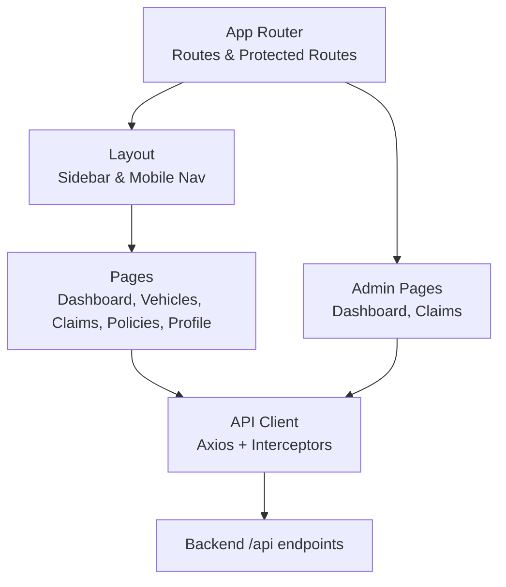
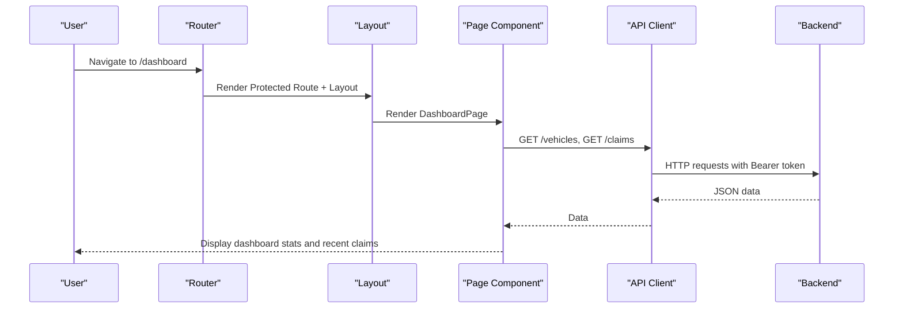
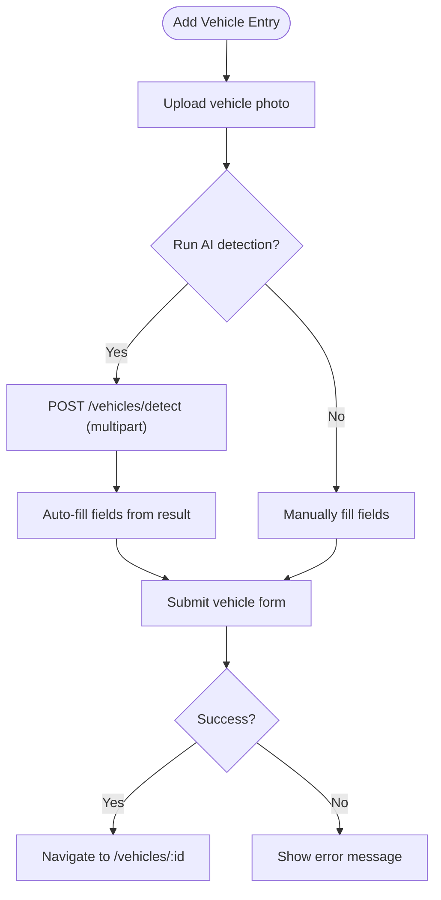
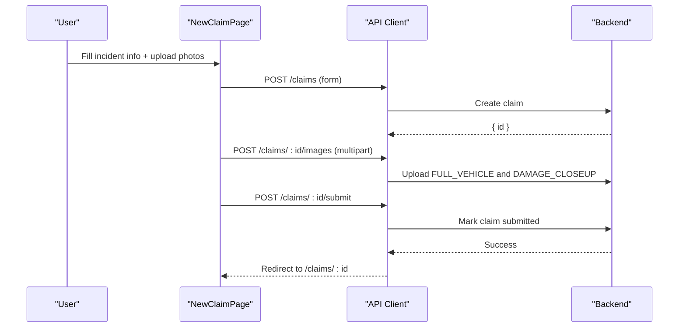
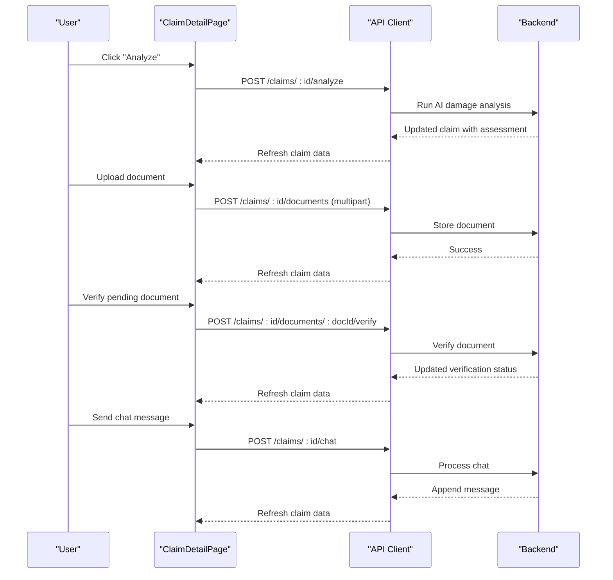
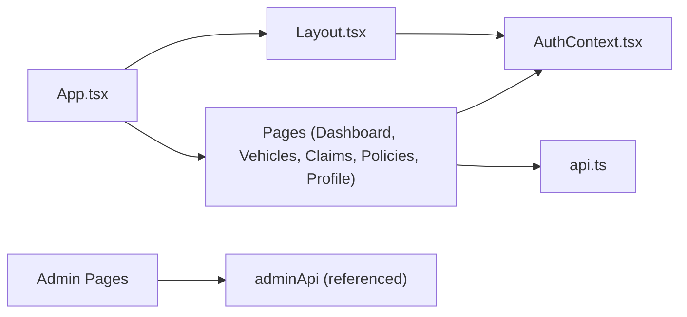

# Pages and Views

<cite>
**Referenced Files in This Document**
- [App.tsx](file://frontend/src/App.tsx)
- [Layout.tsx](file://frontend/src/components/Layout.tsx)
- [AuthContext.tsx](file://frontend/src/context/AuthContext.tsx)
- [api.ts](file://frontend/src/services/api.ts)
- [LoginPage.tsx](file://frontend/src/pages/LoginPage.tsx)
- [RegisterPage.tsx](file://frontend/src/pages/RegisterPage.tsx)
- [DashboardPage.tsx](file://frontend/src/pages/DashboardPage.tsx)
- [VehiclesPage.tsx](file://frontend/src/pages/VehiclesPage.tsx)
- [PoliciesPage.tsx](file://frontend/src/pages/PoliciesPage.tsx)
- [ClaimsPage.tsx](file://frontend/src/pages/ClaimsPage.tsx)
- [NewClaimPage.tsx](file://frontend/src/pages/NewClaimPage.tsx)
- [ClaimDetailPage.tsx](file://frontend/src/pages/ClaimDetailPage.tsx)
- [ProfilePage.tsx](file://frontend/src/pages/ProfilePage.tsx)
- [AdminDashboardPage.tsx](file://frontend/src/pages/admin/AdminDashboardPage.tsx)
- [AdminClaimsPage.tsx](file://frontend/src/pages/admin/AdminClaimsPage.tsx)
</cite>

## Table of Contents
1. Introduction
2. Project Structure
3. Core Components
4. Architecture Overview
5. Detailed Component Analysis
6. Dependency Analysis
7. Performance Considerations
8. Troubleshooting Guide
9. Conclusion

## Introduction
This document provides comprehensive documentation for all user-facing pages and views in the Smart Vehicle Insurance Claim System. It explains each page’s functionality, data requirements, user interactions, backend integrations, form handling, validation patterns, file uploads, real-time updates, navigation flows, state persistence across transitions, and error handling strategies. It also highlights common page patterns such as list views, detail views, and multi-step forms used throughout the application.

## Project Structure
The frontend is a React application with routing defined centrally and protected routes wrapping authenticated sections. The layout component provides consistent navigation and responsive UI. Authentication state is managed via context and persisted to local storage. API calls are centralized through an Axios instance that attaches tokens and handles 401 redirects.

**Diagram sources**
- [App.tsx:23-51](file://frontend/src/App.tsx#L23-L51)
- [Layout.tsx:14-176](file://frontend/src/components/Layout.tsx#L14-L176)
- [api.ts:1-40](file://frontend/src/services/api.ts#L1-L40)

**Section sources**
- [App.tsx:1-56](file://frontend/src/App.tsx#L1-L56)
- [Layout.tsx:1-176](file://frontend/src/components/Layout.tsx#L1-L176)
- [api.ts:1-40](file://frontend/src/services/api.ts#L1-L40)

## Core Components
- Routing and protection: Centralized routes define public and protected paths; protected routes wrap user pages with authentication checks. Admin routes are similarly protected for admin access.
- Layout: Provides sidebar navigation, mobile header, and bottom nav. Tracks active route and supports logout.
- Auth context: Manages login, register, logout, profile update, token persistence, and current user state. Initializes session from stored token on load.
- API client: Axios instance with base URL configuration, automatic Authorization header injection, FormData handling, and 401 redirect behavior.

**Section sources**
- [App.tsx:23-51](file://frontend/src/App.tsx#L23-L51)
- [Layout.tsx:14-176](file://frontend/src/components/Layout.tsx#L14-L176)
- [AuthContext.tsx:17-82](file://frontend/src/context/AuthContext.tsx#L17-L82)
- [api.ts:1-40](file://frontend/src/services/api.ts#L1-L40)

## Architecture Overview
User flows start at the router, which renders either public pages (login/register) or protected pages inside the Layout. Protected pages fetch data via the API client, which ensures authentication headers and handles errors. Admin pages use a separate admin API client and are guarded by admin-specific route protection.

**Diagram sources**
- [App.tsx:23-51](file://frontend/src/App.tsx#L23-L51)
- [Layout.tsx:14-176](file://frontend/src/components/Layout.tsx#L14-L176)
- [DashboardPage.tsx:14-27](file://frontend/src/pages/DashboardPage.tsx#L14-L27)
- [api.ts:11-24](file://frontend/src/services/api.ts#L11-L24)

## Detailed Component Analysis

### Authentication Pages
- Login Page
  - Functionality: Collects email and password, authenticates via context, navigates to dashboard on success.
  - Data requirements: Email, password.
  - User interactions: Form submission, error display, link to registration and admin portal.
  - Backend integration: Calls auth login endpoint via context; token stored locally.
  - Validation: HTML required attributes; server-side validation reflected in error messages.
  - Error handling: Displays server error message if login fails.
  - Navigation: Redirects to /dashboard on success; links to /register and /admin/login.
- Register Page
  - Functionality: Creates account with first name, last name, email, password, optional phone; navigates to dashboard.
  - Data requirements: firstName, lastName, email, password, phone (optional).
  - User interactions: Multi-field form, submit button with loading state.
  - Backend integration: Registers via context; stores token and user info.
  - Validation: Required fields and minimum password length enforced in UI; server validates further.
  - Error handling: Shows server error message on failure.
  - Navigation: Redirects to /dashboard; links back to login.

**Section sources**
- [LoginPage.tsx:6-105](file://frontend/src/pages/LoginPage.tsx#L6-L105)
- [RegisterPage.tsx:6-102](file://frontend/src/pages/RegisterPage.tsx#L6-L102)
- [AuthContext.tsx:38-66](file://frontend/src/context/AuthContext.tsx#L38-L66)

### Dashboard Page
- Functionality: Displays overview including vehicle count, active claims, total claims, quick actions, and recent claims.
- Data requirements: Fetches vehicles and claims lists.
- User interactions: View recent claims, navigate to new claim or add vehicle.
- Backend integration: GET /vehicles and GET /claims via api client.
- Validation: None (read-only).
- Error handling: Logs errors; still shows partial data if one request fails.
- Navigation: Links to /claims/new and /vehicles/new; individual claim links to /claims/:id.

**Section sources**
- [DashboardPage.tsx:8-142](file://frontend/src/pages/DashboardPage.tsx#L8-L142)

### Vehicles Pages
- Vehicles List
  - Functionality: Lists user’s vehicles with basic details and claim counts; empty state guidance.
  - Data requirements: GET /vehicles.
  - User interactions: Add vehicle link; view vehicle detail.
  - Backend integration: Fetches vehicles list.
  - Navigation: Link to /vehicles/new and /vehicles/:id.
- Vehicle Detail
  - Functionality: Shows vehicle details, claim history, delete action, and shortcut to file a claim for this vehicle.
  - Data requirements: GET /vehicles/:id.
  - User interactions: Delete confirmation; navigate to claim creation with preselected vehicle.
  - Backend integration: Deletes vehicle via DELETE /vehicles/:id.
  - Navigation: Back to /vehicles; link to /claims/new?vehicleId=...
- Add Vehicle
  - Functionality: Multi-section form combining AI detection and manual entry. Upload image to detect make, model, year, color, license plate; auto-fill fields; submit to create vehicle.
  - Data requirements: POST /vehicles/detect (image), POST /vehicles (form data).
  - User interactions: Drag-and-drop image upload, preview, remove, run detection, fill form, submit.
  - Backend integration: Sends multipart image to detection endpoint; then submits vehicle form.
  - Validation: Required fields in UI; numeric range constraints; detection results may be partial and editable.
  - Error handling: Displays detection errors and submission errors; success feedback with redirect.
  - Navigation: Back to /vehicles; redirect to /vehicles/:id after successful creation.

**Diagram sources**
- [VehiclesPage.tsx:124-369](file://frontend/src/pages/VehiclesPage.tsx#L124-L369)

**Section sources**
- [VehiclesPage.tsx:8-123](file://frontend/src/pages/VehiclesPage.tsx#L8-L123)
- [VehiclesPage.tsx:124-369](file://frontend/src/pages/VehiclesPage.tsx#L124-L369)

### Policies Page
- Functionality: Manage insurance policies; add new policy via inline form; list existing policies with delete option.
- Data requirements: GET /policies; POST /policies; DELETE /policies/:id.
- User interactions: Toggle form visibility, submit new policy, delete policy with confirmation.
- Backend integration: CRUD operations via api client.
- Validation: Required fields in UI; server enforces additional rules.
- Error handling: Displays server error messages on failures.
- Navigation: Stays within /policies; no external navigation.

**Section sources**
- [PoliciesPage.tsx:6-102](file://frontend/src/pages/PoliciesPage.tsx#L6-L102)

### Claims Pages
- Claims List
  - Functionality: Lists user’s claims with status badges and severity indicators; filter by status; quick link to create new claim.
  - Data requirements: GET /claims with optional status query parameter.
  - User interactions: Filter dropdown; navigate to claim detail or new claim.
  - Backend integration: Fetches filtered claims list.
  - Navigation: Links to /claims/new and /claims/:id.
- New Claim (Multi-step Form)
  - Functionality: Four-step wizard: incident info, full vehicle photos, damage close-up photos, review & submit. Supports optional policy selection, weather conditions, police report flag.
  - Data requirements: GET /vehicles, GET /policies; POST /claims; POST /claims/:id/images (multipart); POST /claims/:id/submit.
  - User interactions: Step navigation, drag-and-drop image uploads, preview removal, validation gating per step, final submit.
  - Backend integration: Creates claim, uploads images with type tags, marks claim submitted.
  - Validation: Required fields enforced per step; images required before proceeding to next steps where applicable.
  - Error handling: Displays error messages on submission or upload failures.
  - Navigation: On success, navigates to /claims/:id.
- Claim Detail
  - Functionality: Comprehensive view of a single claim including images, damage assessment, repair estimate, insurance payout, documents, progress checklist, suggestions, and AI chat assistant.
  - Data requirements: GET /claims/:id; POST /claims/:id/analyze; POST /claims/:id/documents (multipart); POST /claims/:id/documents/:docId/verify; POST /claims/:id/chat.
  - User interactions: Trigger analysis, upload documents, verify pending documents, send chat messages, quick message buttons.
  - Backend integration: Performs analysis, uploads documents, verifies documents, sends chat messages; refreshes claim data after mutations.
  - Validation: File types accepted for uploads; server validates content.
  - Error handling: Alerts on failed analysis, upload, verification, or chat; safe fallbacks when data is missing.
  - Navigation: Back to /claims; links to related resources.

**Diagram sources**
- [NewClaimPage.tsx:72-94](file://frontend/src/pages/NewClaimPage.tsx#L72-L94)
- [api.ts:11-24](file://frontend/src/services/api.ts#L11-L24)

**Diagram sources**
- [ClaimDetailPage.tsx:27-67](file://frontend/src/pages/ClaimDetailPage.tsx#L27-L67)
- [api.ts:11-24](file://frontend/src/services/api.ts#L11-L24)

**Section sources**
- [ClaimsPage.tsx:22-98](file://frontend/src/pages/ClaimsPage.tsx#L22-L98)
- [NewClaimPage.tsx:10-252](file://frontend/src/pages/NewClaimPage.tsx#L10-L252)
- [ClaimDetailPage.tsx:7-431](file://frontend/src/pages/ClaimDetailPage.tsx#L7-L431)

### Profile Page
- Functionality: Edit user profile fields (first name, last name, phone, address); email is read-only.
- Data requirements: PUT /auth/profile via context.
- User interactions: Form submission with saving state; success/error notifications.
- Backend integration: Updates profile via context method.
- Validation: UI-level required fields; server enforces additional rules.
- Error handling: Displays error messages on failure; success message auto-dismissed.
- Navigation: Stays within /profile.

**Section sources**
- [ProfilePage.tsx:5-88](file://frontend/src/pages/ProfilePage.tsx#L5-L88)
- [AuthContext.tsx:63-66](file://frontend/src/context/AuthContext.tsx#L63-L66)

### Admin Pages
- Admin Dashboard
  - Functionality: Overview statistics (users, total claims, pending claims, docs awaiting), claims by status breakdown, recent claims list, quick links to manage users, review claims, approve documents.
  - Data requirements: GET /admin/stats, GET /admin/claims via adminApi.
  - User interactions: View stats and recent items; navigate to admin sections.
  - Backend integration: Fetches aggregated stats and recent claims.
  - Navigation: Links to /admin/users, /admin/claims, /admin/documents.
- Admin Claims
  - Functionality: Searchable and filterable table of claims with status filters; approve claims directly from list; navigate to detailed review.
  - Data requirements: GET /admin/claims with search and status parameters; PATCH /admin/claims/:id/status.
  - User interactions: Search input, status filter buttons, approve button, review link.
  - Backend integration: Filters claims via query params; approves claim by updating status.
  - Error handling: Alerts on approval failures; maintains loading states.
  - Navigation: Links to /admin/claims/:id.

**Section sources**
- [AdminDashboardPage.tsx:12-130](file://frontend/src/pages/admin/AdminDashboardPage.tsx#L12-L130)
- [AdminClaimsPage.tsx:16-128](file://frontend/src/pages/admin/AdminClaimsPage.tsx#L16-L128)

## Dependency Analysis
- Routing depends on App.tsx to mount components under protected layouts.
- Pages depend on api.ts for data fetching and mutations; admin pages depend on adminApi (not shown here but referenced in admin pages).
- AuthContext provides authentication state and methods consumed by protected routes and pages.
- Layout consumes AuthContext for user info and logout behavior.

**Diagram sources**
- [App.tsx:23-51](file://frontend/src/App.tsx#L23-L51)
- [Layout.tsx:14-176](file://frontend/src/components/Layout.tsx#L14-L176)
- [AuthContext.tsx:17-82](file://frontend/src/context/AuthContext.tsx#L17-L82)
- [api.ts:1-40](file://frontend/src/services/api.ts#L1-L40)

**Section sources**
- [App.tsx:23-51](file://frontend/src/App.tsx#L23-L51)
- [Layout.tsx:14-176](file://frontend/src/components/Layout.tsx#L14-L176)
- [AuthContext.tsx:17-82](file://frontend/src/context/AuthContext.tsx#L17-L82)
- [api.ts:1-40](file://frontend/src/services/api.ts#L1-L40)

## Performance Considerations
- Parallel data fetching: Dashboard uses Promise.all to fetch vehicles and claims concurrently to reduce load time.
- Conditional rendering: Loading spinners prevent unnecessary re-renders while data is being fetched.
- Efficient filtering: Claims list filters via backend query parameters to minimize client-side processing.
- Image previews: Local object URLs provide instant feedback without extra network calls.
- Avoiding redundant requests: Claim detail refreshes only after mutations to keep UI in sync efficiently.

[No sources needed since this section provides general guidance]

## Troubleshooting Guide
- Authentication issues: If a 401 occurs, the API client clears stored credentials and redirects to login. Ensure tokens are present and valid.
- Form submission errors: Pages display server error messages; check network tab for payload and response details.
- File upload failures: Ensure correct Content-Type handling (FormData boundary set automatically by axios interceptor) and supported file types.
- Missing data: Empty states guide users to perform required actions (e.g., add vehicle, file claim).
- Admin actions: Approval actions show alerts on failure; reload or retry if necessary.

**Section sources**
- [api.ts:26-37](file://frontend/src/services/api.ts#L26-L37)
- [LoginPage.tsx:14-27](file://frontend/src/pages/LoginPage.tsx#L14-L27)
- [RegisterPage.tsx:13-26](file://frontend/src/pages/RegisterPage.tsx#L13-L26)
- [NewClaimPage.tsx:62-94](file://frontend/src/pages/NewClaimPage.tsx#L62-L94)
- [ClaimDetailPage.tsx:27-67](file://frontend/src/pages/ClaimDetailPage.tsx#L27-L67)
- [AdminClaimsPage.tsx:34-41](file://frontend/src/pages/admin/AdminClaimsPage.tsx#L34-L41)

## Conclusion
The application provides a cohesive set of user-facing pages covering authentication, dashboard, vehicles, policies, claims lifecycle, and profile management, along with an admin interface for oversight and approvals. Pages follow consistent patterns for data fetching, form handling, file uploads, and error reporting. Navigation is centralized and protected, ensuring secure access to sensitive features. Real-time-like updates are achieved by refreshing claim data after mutations, providing immediate feedback to users.

[No sources needed since this section summarizes without analyzing specific files]