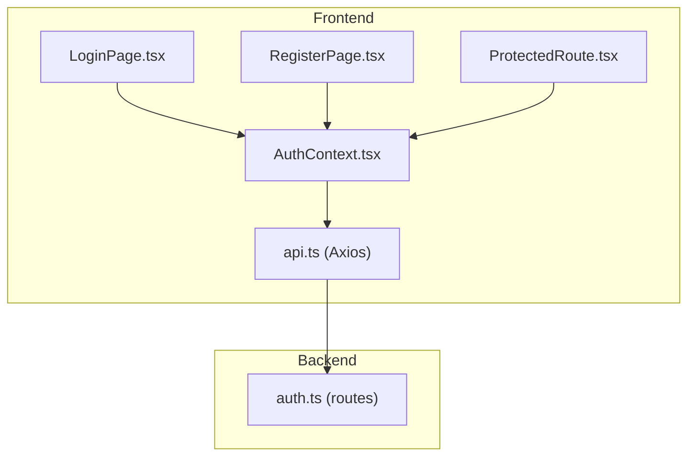
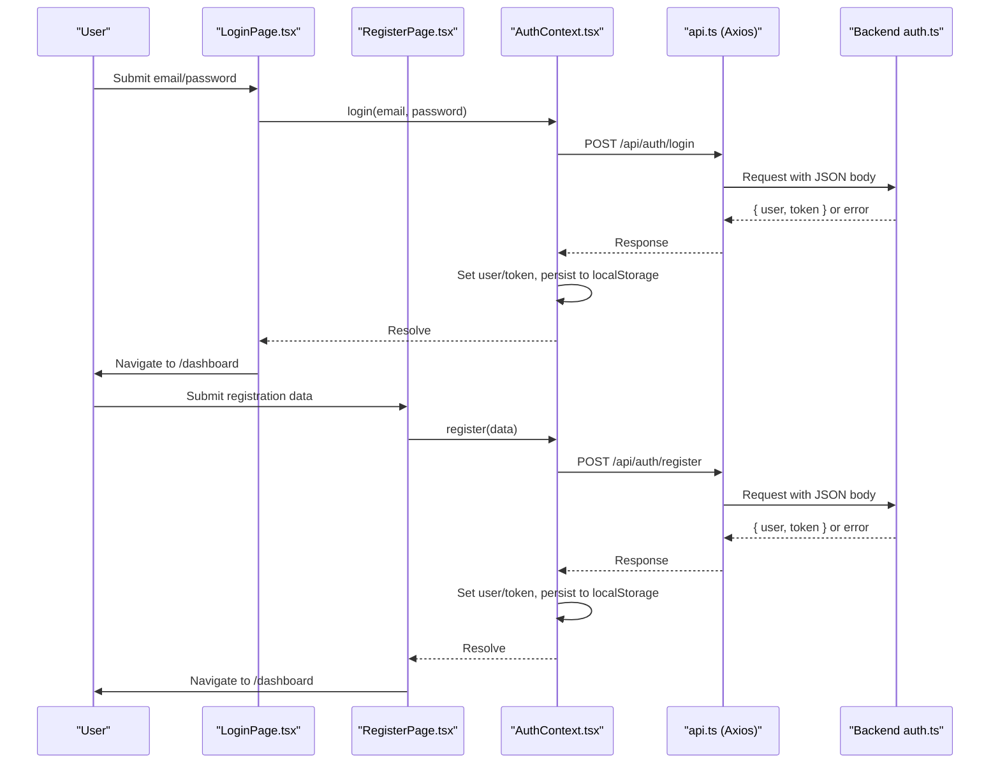
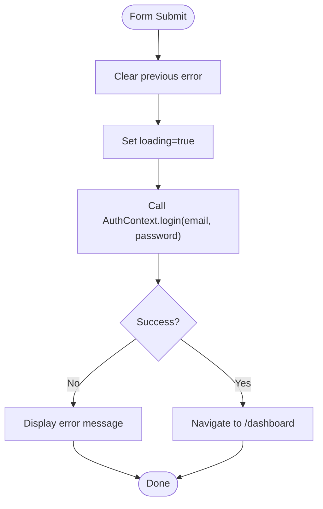
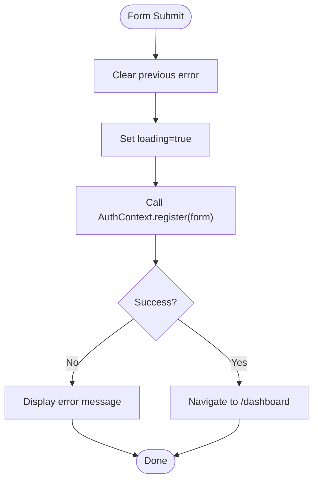
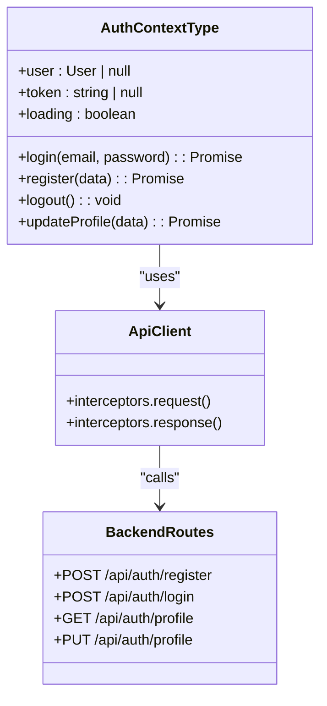
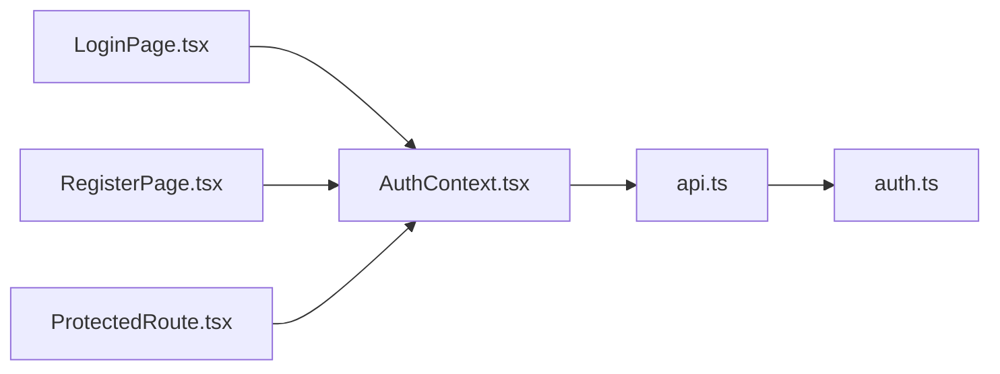

# Authentication Pages

<cite>
**Referenced Files in This Document**
- [LoginPage.tsx](file://frontend/src/pages/LoginPage.tsx)
- [RegisterPage.tsx](file://frontend/src/pages/RegisterPage.tsx)
- [AuthContext.tsx](file://frontend/src/context/AuthContext.tsx)
- [api.ts](file://frontend/src/services/api.ts)
- [auth.ts](file://backend/src/routes/auth.ts)
- [ProtectedRoute.tsx](file://frontend/src/components/ProtectedRoute.tsx)
- [index.ts (types)](file://frontend/src/types/index.ts)
</cite>

## Table of Contents
1. [Introduction](#introduction)
2. [Project Structure](#project-structure)
3. [Core Components](#core-components)
4. [Architecture Overview](#architecture-overview)
5. [Detailed Component Analysis](#detailed-component-analysis)
6. [Dependency Analysis](#dependency-analysis)
7. [Performance Considerations](#performance-considerations)
8. [Troubleshooting Guide](#troubleshooting-guide)
9. [Conclusion](#conclusion)

## Introduction
This document explains the authentication pages for user login and registration, focusing on form state management, validation, error handling, API integration, navigation to protected routes, and session management via the AuthContext. It also outlines how these pages interact with backend authentication endpoints and how protected routes guard access to authenticated areas.

## Project Structure
The authentication feature spans frontend pages, context-based session management, an HTTP client with interceptors, and backend routes that handle registration, login, and profile operations.

**Diagram sources**
- [LoginPage.tsx:1-105](file://frontend/src/pages/LoginPage.tsx#L1-L105)
- [RegisterPage.tsx:1-102](file://frontend/src/pages/RegisterPage.tsx#L1-L102)
- [AuthContext.tsx:1-82](file://frontend/src/context/AuthContext.tsx#L1-L82)
- [api.ts:1-40](file://frontend/src/services/api.ts#L1-L40)
- [auth.ts:1-168](file://backend/src/routes/auth.ts#L1-L168)
- [ProtectedRoute.tsx:1-21](file://frontend/src/components/ProtectedRoute.tsx#L1-L21)

**Section sources**
- [LoginPage.tsx:1-105](file://frontend/src/pages/LoginPage.tsx#L1-L105)
- [RegisterPage.tsx:1-102](file://frontend/src/pages/RegisterPage.tsx#L1-L102)
- [AuthContext.tsx:1-82](file://frontend/src/context/AuthContext.tsx#L1-L82)
- [api.ts:1-40](file://frontend/src/services/api.ts#L1-L40)
- [auth.ts:1-168](file://backend/src/routes/auth.ts#L1-L168)
- [ProtectedRoute.tsx:1-21](file://frontend/src/components/ProtectedRoute.tsx#L1-L21)

## Core Components
- LoginPage: Collects email/password, validates required fields via HTML attributes, submits via AuthContext.login, navigates to dashboard on success, and displays server errors.
- RegisterPage: Collects first name, last name, email, password, and optional phone; uses HTML validation (required, minLength); submits via AuthContext.register; navigates to dashboard on success; displays server errors.
- AuthContext: Manages user state, token persistence, login/register/logout/profile update flows, and initializes session from localStorage on app start.
- api.ts: Axios instance with base URL configuration, automatic Authorization header injection, and a 401 interceptor that clears session and redirects to login.
- ProtectedRoute: Guards routes by checking if a user is authenticated; shows a loading spinner while auth state initializes.

**Section sources**
- [LoginPage.tsx:1-105](file://frontend/src/pages/LoginPage.tsx#L1-L105)
- [RegisterPage.tsx:1-102](file://frontend/src/pages/RegisterPage.tsx#L1-L102)
- [AuthContext.tsx:1-82](file://frontend/src/context/AuthContext.tsx#L1-L82)
- [api.ts:1-40](file://frontend/src/services/api.ts#L1-L40)
- [ProtectedRoute.tsx:1-21](file://frontend/src/components/ProtectedRoute.tsx#L1-L21)

## Architecture Overview
The authentication flow integrates UI forms with a centralized context and an HTTP client that communicates with backend routes. On successful authentication, tokens are stored locally and used for subsequent requests. Protected routes ensure only authenticated users can access sensitive areas.

**Diagram sources**
- [LoginPage.tsx:14-27](file://frontend/src/pages/LoginPage.tsx#L14-L27)
- [RegisterPage.tsx:13-26](file://frontend/src/pages/RegisterPage.tsx#L13-L26)
- [AuthContext.tsx:38-54](file://frontend/src/context/AuthContext.tsx#L38-L54)
- [api.ts:11-24](file://frontend/src/services/api.ts#L11-L24)
- [auth.ts:11-59](file://backend/src/routes/auth.ts#L11-L59)
- [auth.ts:61-105](file://backend/src/routes/auth.ts#L61-L105)

## Detailed Component Analysis

### LoginPage
- Form state: email, password, error message, loading flag.
- Validation: Uses HTML required attributes for email and password fields.
- Submission: Prevents default submission, clears previous errors, sets loading, calls AuthContext.login, then navigates to /dashboard on success.
- Error handling: Catches thrown errors from login and displays server-provided messages or a fallback message.
- Navigation: Redirects to dashboard after successful login; provides link to admin portal.

**Diagram sources**
- [LoginPage.tsx:14-27](file://frontend/src/pages/LoginPage.tsx#L14-L27)

**Section sources**
- [LoginPage.tsx:1-105](file://frontend/src/pages/LoginPage.tsx#L1-L105)

### RegisterPage
- Form state: object containing firstName, lastName, email, password, phone; error message; loading flag.
- Validation: Required fields enforced via HTML attributes; password has a minimum length constraint.
- Submission: Prevents default submission, clears previous errors, sets loading, calls AuthContext.register with form data, then navigates to /dashboard on success.
- Error handling: Catches thrown errors from register and displays server-provided messages or a fallback message.
- Navigation: Redirects to dashboard after successful registration; provides link back to login.

**Diagram sources**
- [RegisterPage.tsx:13-26](file://frontend/src/pages/RegisterPage.tsx#L13-L26)

**Section sources**
- [RegisterPage.tsx:1-102](file://frontend/src/pages/RegisterPage.tsx#L1-L102)

### AuthContext Integration
- Session initialization: On mount, if a token exists in localStorage, fetches current profile to restore user state; otherwise marks loading complete.
- Login flow: Posts credentials to /api/auth/login, stores returned user and token in state and localStorage.
- Registration flow: Posts registration data to /api/auth/register, stores returned user and token in state and localStorage.
- Logout: Clears user and token from state and localStorage.
- Profile update: Sends updates to /api/auth/profile and refreshes local user state.

**Diagram sources**
- [AuthContext.tsx:5-13](file://frontend/src/context/AuthContext.tsx#L5-L13)
- [AuthContext.tsx:17-73](file://frontend/src/context/AuthContext.tsx#L17-L73)
- [api.ts:1-40](file://frontend/src/services/api.ts#L1-L40)
- [auth.ts:11-168](file://backend/src/routes/auth.ts#L11-L168)

**Section sources**
- [AuthContext.tsx:1-82](file://frontend/src/context/AuthContext.tsx#L1-L82)

### API Integration Patterns
- Base URL: Configured via environment variable or defaults to a relative path for development proxying.
- Authorization: Automatically attaches Bearer token from localStorage to request headers when present.
- Content-Type: Defaults to application/json; removed for FormData to let browser set multipart boundary.
- 401 Handling: Clears session and redirects to login on unauthorized responses.

**Section sources**
- [api.ts:1-40](file://frontend/src/services/api.ts#L1-L40)

### Backend Authentication Endpoints
- Registration: Validates required fields, checks for existing email, hashes password, creates user, signs JWT, returns user and token.
- Login: Validates required fields, verifies user existence and password, signs JWT, returns user and token.
- Profile: Requires authentication; returns current user details; supports updates.

**Section sources**
- [auth.ts:11-59](file://backend/src/routes/auth.ts#L11-L59)
- [auth.ts:61-105](file://backend/src/routes/auth.ts#L61-L105)
- [auth.ts:107-165](file://backend/src/routes/auth.ts#L107-L165)

### Protected Routes and Navigation
- ProtectedRoute: Shows a loading indicator while auth state initializes; if no user is present, redirects to /login; otherwise renders children.
- After successful login/registration: Pages navigate to /dashboard, which should be guarded by ProtectedRoute to ensure only authenticated users can access it.

**Section sources**
- [ProtectedRoute.tsx:1-21](file://frontend/src/components/ProtectedRoute.tsx#L1-L21)
- [LoginPage.tsx:20-21](file://frontend/src/pages/LoginPage.tsx#L20-L21)
- [RegisterPage.tsx:19-20](file://frontend/src/pages/RegisterPage.tsx#L19-L20)

## Dependency Analysis
- LoginPage depends on React Router for navigation and AuthContext for authentication actions.
- RegisterPage depends on React Router for navigation and AuthContext for registration action.
- AuthContext depends on the Axios client and persists session state to localStorage.
- Axios client depends on environment variables and interacts with backend routes under /api.
- Backend routes depend on Prisma for database operations and bcrypt/jwt for security.

**Diagram sources**
- [LoginPage.tsx:1-105](file://frontend/src/pages/LoginPage.tsx#L1-L105)
- [RegisterPage.tsx:1-102](file://frontend/src/pages/RegisterPage.tsx#L1-L102)
- [AuthContext.tsx:1-82](file://frontend/src/context/AuthContext.tsx#L1-L82)
- [api.ts:1-40](file://frontend/src/services/api.ts#L1-L40)
- [auth.ts:1-168](file://backend/src/routes/auth.ts#L1-L168)
- [ProtectedRoute.tsx:1-21](file://frontend/src/components/ProtectedRoute.tsx#L1-L21)

**Section sources**
- [LoginPage.tsx:1-105](file://frontend/src/pages/LoginPage.tsx#L1-L105)
- [RegisterPage.tsx:1-102](file://frontend/src/pages/RegisterPage.tsx#L1-L102)
- [AuthContext.tsx:1-82](file://frontend/src/context/AuthContext.tsx#L1-L82)
- [api.ts:1-40](file://frontend/src/services/api.ts#L1-L40)
- [auth.ts:1-168](file://backend/src/routes/auth.ts#L1-L168)
- [ProtectedRoute.tsx:1-21](file://frontend/src/components/ProtectedRoute.tsx#L1-L21)

## Performance Considerations
- Minimize re-renders: Keep form state localized within each page; avoid lifting unnecessary state to context.
- Debounce inputs: If adding real-time validation, debounce expensive checks to reduce network or CPU usage.
- Token caching: AuthContext already caches token and user; leverage this to avoid redundant profile fetches.
- Error boundaries: Wrap authentication flows in error boundaries to prevent UI crashes on unexpected failures.

[No sources needed since this section provides general guidance]

## Troubleshooting Guide
- Invalid credentials: Backend returns 401 with an error message; LoginPage catches and displays the message.
- Duplicate email during registration: Backend returns 409; RegisterPage catches and displays the message.
- Unauthorized requests: Axios interceptor clears session and redirects to login; verify token presence and validity.
- Network issues: Ensure VITE_API_URL is correctly configured or that the dev proxy forwards /api to the backend.

**Section sources**
- [auth.ts:61-105](file://backend/src/routes/auth.ts#L61-L105)
- [auth.ts:11-59](file://backend/src/routes/auth.ts#L11-L59)
- [api.ts:26-37](file://frontend/src/services/api.ts#L26-L37)
- [LoginPage.tsx:22-24](file://frontend/src/pages/LoginPage.tsx#L22-L24)
- [RegisterPage.tsx:21-23](file://frontend/src/pages/RegisterPage.tsx#L21-L23)

## Conclusion
The authentication pages implement robust form handling with clear validation, consistent error display, and seamless navigation to protected routes. The AuthContext centralizes session management, while the Axios client ensures secure, authenticated communication with backend endpoints. Protected routes enforce access control based on the current authentication state. Together, these components provide a reliable and maintainable authentication experience for the Smart Vehicle Insurance Claim System.