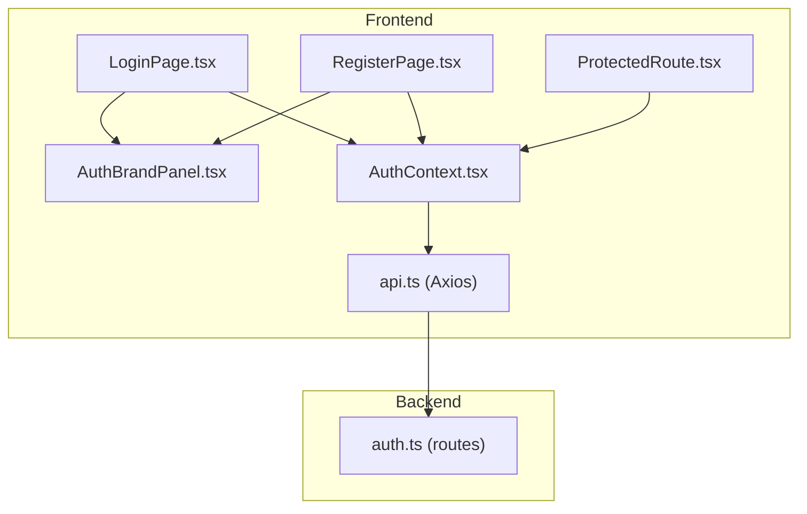
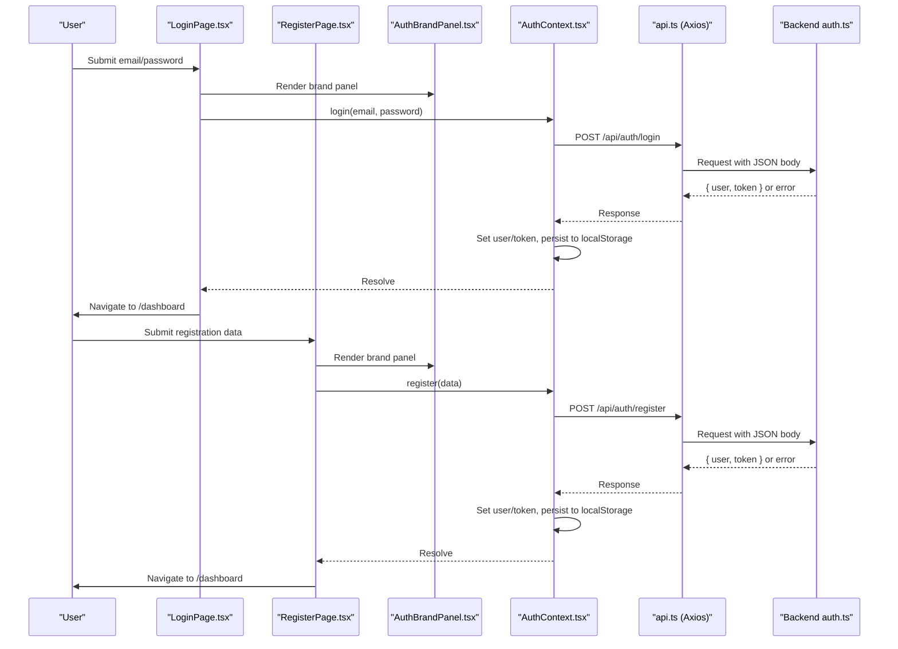
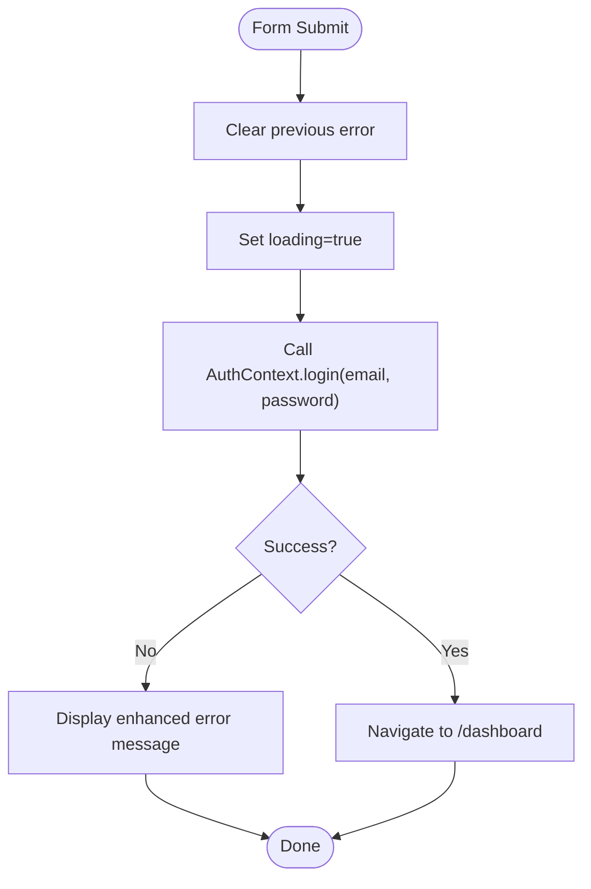
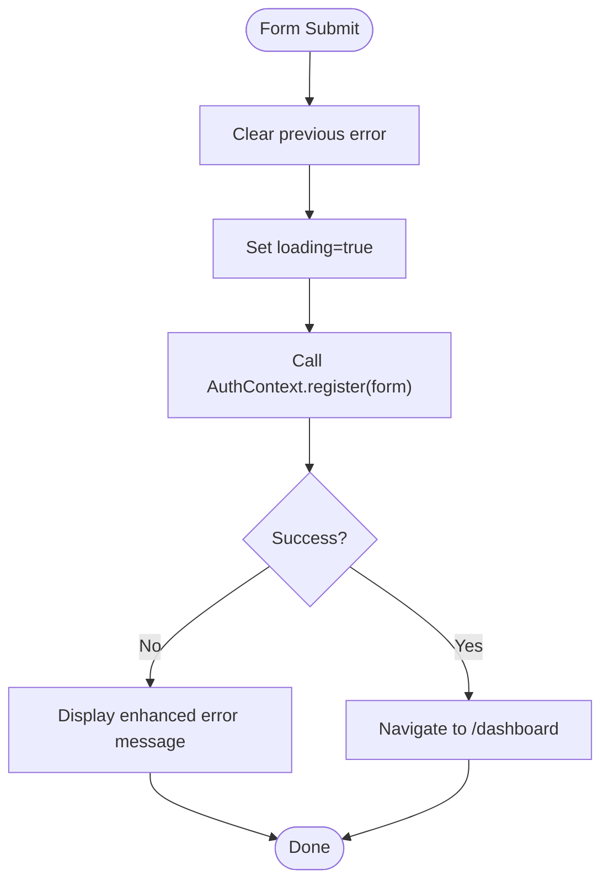
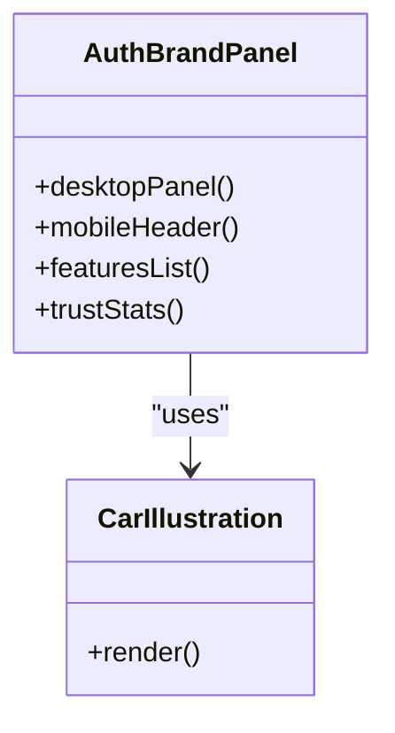
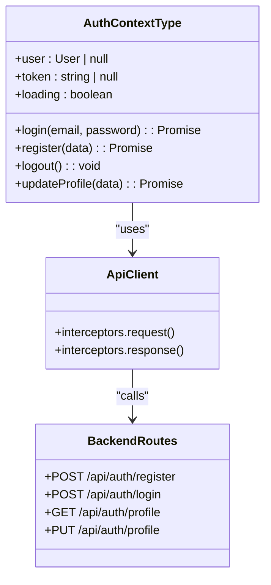
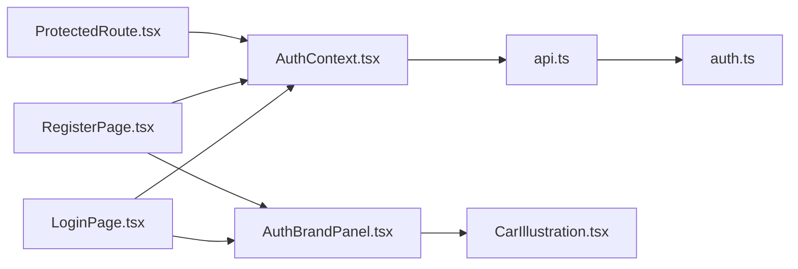

# Authentication Pages

<cite>
**Referenced Files in This Document**
- [LoginPage.tsx](file://frontend/src/pages/LoginPage.tsx)
- [RegisterPage.tsx](file://frontend/src/pages/RegisterPage.tsx)
- [AuthBrandPanel.tsx](file://frontend/src/components/AuthBrandPanel.tsx)
- [AuthContext.tsx](file://frontend/src/context/AuthContext.tsx)
- [api.ts](file://frontend/src/services/api.ts)
- [auth.ts](file://backend/src/routes/auth.ts)
- [ProtectedRoute.tsx](file://frontend/src/components/ProtectedRoute.tsx)
- [index.ts (types)](file://frontend/src/types/index.ts)
</cite>

## Update Summary
**Changes Made**
- Updated LoginPage and RegisterPage to use new AuthBrandPanel component for consistent branding
- Enhanced visual hierarchy with split-screen layout featuring brand panel and form sections
- Improved validation feedback with better error display components
- Added mobile-responsive design with compact brand header for smaller screens
- Enhanced accessibility and user experience across all authentication flows

## Table of Contents
1. [Introduction](#introduction)
2. [Project Structure](#project-structure)
3. [Core Components](#core-components)
4. [Architecture Overview](#architecture-overview)
5. [Detailed Component Analysis](#detailed-component-analysis)
6. [Dependency Analysis](#dependency-analysis)
7. [Performance Considerations](#performance-considerations)
8. [Troubleshooting Guide](#troubleshooting-guide)
9. [Conclusion](#conclusion)

## Introduction
This document explains the authentication pages for user login and registration, focusing on form state management, validation, error handling, API integration, navigation to protected routes, and session management via the AuthContext. The pages now feature an enhanced split-screen design with a dedicated brand panel that provides consistent visual identity and improved user experience across both desktop and mobile devices.

## Project Structure
The authentication feature spans frontend pages with enhanced branding, context-based session management, an HTTP client with interceptors, and backend routes that handle registration, login, and profile operations.

**Diagram sources**
- [LoginPage.tsx:1-129](file://frontend/src/pages/LoginPage.tsx#L1-L129)
- [RegisterPage.tsx:1-133](file://frontend/src/pages/RegisterPage.tsx#L1-L133)
- [AuthBrandPanel.tsx:1-103](file://frontend/src/components/AuthBrandPanel.tsx#L1-L103)
- [AuthContext.tsx:1-101](file://frontend/src/context/AuthContext.tsx#L1-L101)
- [api.ts:1-40](file://frontend/src/services/api.ts#L1-L40)
- [auth.ts:1-182](file://backend/src/routes/auth.ts#L1-L182)
- [ProtectedRoute.tsx:1-21](file://frontend/src/components/ProtectedRoute.tsx#L1-L21)

**Section sources**
- [LoginPage.tsx:1-129](file://frontend/src/pages/LoginPage.tsx#L1-L129)
- [RegisterPage.tsx:1-133](file://frontend/src/pages/RegisterPage.tsx#L1-L133)
- [AuthBrandPanel.tsx:1-103](file://frontend/src/components/AuthBrandPanel.tsx#L1-L103)
- [AuthContext.tsx:1-101](file://frontend/src/context/AuthContext.tsx#L1-L101)
- [api.ts:1-40](file://frontend/src/services/api.ts#L1-L40)
- [auth.ts:1-182](file://backend/src/routes/auth.ts#L1-L182)
- [ProtectedRoute.tsx:1-21](file://frontend/src/components/ProtectedRoute.tsx#L1-L21)

## Core Components
- **LoginPage**: Enhanced split-screen layout with AuthBrandPanel, collects email/password with improved validation, submits via AuthContext.login, navigates to dashboard on success, and displays server errors with better visual feedback.
- **RegisterPage**: Enhanced split-screen layout with AuthBrandPanel, collects comprehensive user data including NIC validation, uses HTML validation with enhanced feedback; submits via AuthContext.register; navigates to dashboard on success; displays server errors with improved UI.
- **AuthBrandPanel**: New reusable component providing consistent branding across authentication flows with desktop split-screen panel and mobile-optimized brand header.
- **AuthContext**: Manages user state, token persistence, login/register/logout/profile update flows, and initializes session from localStorage on app start.
- **api.ts**: Axios instance with base URL configuration, automatic Authorization header injection, and a 401 interceptor that clears session and redirects to login.
- **ProtectedRoute**: Guards routes by checking if a user is authenticated; shows a loading spinner while auth state initializes.

**Section sources**
- [LoginPage.tsx:1-129](file://frontend/src/pages/LoginPage.tsx#L1-L129)
- [RegisterPage.tsx:1-133](file://frontend/src/pages/RegisterPage.tsx#L1-L133)
- [AuthBrandPanel.tsx:1-103](file://frontend/src/components/AuthBrandPanel.tsx#L1-L103)
- [AuthContext.tsx:1-101](file://frontend/src/context/AuthContext.tsx#L1-L101)
- [api.ts:1-40](file://frontend/src/services/api.ts#L1-L40)
- [ProtectedRoute.tsx:1-21](file://frontend/src/components/ProtectedRoute.tsx#L1-L21)

## Architecture Overview
The authentication flow integrates enhanced UI forms with centralized context and an HTTP client that communicates with backend routes. The new AuthBrandPanel component provides consistent visual branding across authentication flows. On successful authentication, tokens are stored locally and used for subsequent requests. Protected routes ensure only authenticated users can access sensitive areas.

**Diagram sources**
- [LoginPage.tsx:15-28](file://frontend/src/pages/LoginPage.tsx#L15-L28)
- [RegisterPage.tsx:15-27](file://frontend/src/pages/RegisterPage.tsx#L15-L27)
- [AuthBrandPanel.tsx:13-89](file://frontend/src/components/AuthBrandPanel.tsx#L13-L89)
- [AuthContext.tsx:47-73](file://frontend/src/context/AuthContext.tsx#L47-L73)
- [api.ts:11-24](file://frontend/src/services/api.ts#L11-L24)
- [auth.ts:11-67](file://backend/src/routes/auth.ts#L11-L67)
- [auth.ts:69-113](file://backend/src/routes/auth.ts#L69-L113)

## Detailed Component Analysis

### LoginPage
**Updated** Enhanced with split-screen layout and AuthBrandPanel integration

- **Layout**: Split-screen design with AuthBrandPanel on left side and form on right side
- **Form state**: email, password, error message, loading flag
- **Validation**: Uses HTML required attributes for email and password fields with enhanced visual feedback
- **Submission**: Prevents default submission, clears previous errors, sets loading, calls AuthContext.login, then navigates to /dashboard on success
- **Error handling**: Catches thrown errors from login and displays server-provided messages or a fallback message with improved UI styling
- **Navigation**: Redirects to dashboard after successful login; provides link to admin portal and garage portal
- **Branding**: Integrated AuthBrandPanel for consistent visual identity and AuthMobileBrand for mobile optimization

**Diagram sources**
- [LoginPage.tsx:15-28](file://frontend/src/pages/LoginPage.tsx#L15-L28)

**Section sources**
- [LoginPage.tsx:1-129](file://frontend/src/pages/LoginPage.tsx#L1-L129)

### RegisterPage
**Updated** Enhanced with split-screen layout and AuthBrandPanel integration

- **Layout**: Split-screen design with AuthBrandPanel on left side and form on right side
- **Form state**: object containing firstName, lastName, email, password, phone, nic; error message; loading flag
- **Validation**: Required fields enforced via HTML attributes; password has minimum length constraint; NIC validation with pattern matching
- **Submission**: Prevents default submission, clears previous errors, sets loading, calls AuthContext.register with form data, then navigates to /dashboard on success
- **Error handling**: Catches thrown errors from register and displays server-provided messages or a fallback message with improved UI styling
- **Navigation**: Redirects to dashboard after successful registration; provides link back to login
- **Branding**: Integrated AuthBrandPanel for consistent visual identity and AuthMobileBrand for mobile optimization

**Diagram sources**
- [RegisterPage.tsx:15-27](file://frontend/src/pages/RegisterPage.tsx#L15-L27)

**Section sources**
- [RegisterPage.tsx:1-133](file://frontend/src/pages/RegisterPage.tsx#L1-L133)

### AuthBrandPanel Component
**New** Reusable branding component for consistent authentication experience

- **Desktop Layout**: Full-featured split-screen panel with gradient background, brand logo, feature highlights, and trust statistics
- **Mobile Layout**: Compact brand header with logo and tagline optimized for smaller screens
- **Visual Elements**: Includes car illustration, feature icons, animated elements, and responsive design
- **Accessibility**: Proper ARIA labels and semantic HTML structure
- **Branding Consistency**: Ensures uniform visual identity across all authentication flows

**Diagram sources**
- [AuthBrandPanel.tsx:13-89](file://frontend/src/components/AuthBrandPanel.tsx#L13-L89)
- [AuthBrandPanel.tsx:92-102](file://frontend/src/components/AuthBrandPanel.tsx#L92-L102)

**Section sources**
- [AuthBrandPanel.tsx:1-103](file://frontend/src/components/AuthBrandPanel.tsx#L1-L103)

### AuthContext Integration
- **Session initialization**: On mount, if a token exists in localStorage, fetches current profile to restore user state; otherwise marks loading complete
- **Login flow**: Posts credentials to /api/auth/login, stores returned user and token in state and localStorage, then fetches full profile for consistency
- **Registration flow**: Posts registration data to /api/auth/register, stores returned user and token in state and localStorage, then fetches full profile for consistency
- **Logout**: Clears user and token from state and localStorage
- **Profile update**: Sends updates to /api/auth/profile and refreshes local user state

**Diagram sources**
- [AuthContext.tsx:5-13](file://frontend/src/context/AuthContext.tsx#L5-L13)
- [AuthContext.tsx:17-85](file://frontend/src/context/AuthContext.tsx#L17-L85)
- [api.ts:1-40](file://frontend/src/services/api.ts#L1-L40)
- [auth.ts:11-182](file://backend/src/routes/auth.ts#L11-L182)

**Section sources**
- [AuthContext.tsx:1-101](file://frontend/src/context/AuthContext.tsx#L1-L101)

### API Integration Patterns
- **Base URL**: Configured via environment variable or defaults to a relative path for development proxying
- **Authorization**: Automatically attaches Bearer token from localStorage to request headers when present
- **Content-Type**: Defaults to application/json; removed for FormData to let browser set multipart boundary
- **401 Handling**: Clears session and redirects to login on unauthorized responses

**Section sources**
- [api.ts:1-40](file://frontend/src/services/api.ts#L1-L40)

### Backend Authentication Endpoints
- **Registration**: Validates required fields, checks for existing email, validates NIC format, hashes password, creates user, signs JWT, returns user and token
- **Login**: Validates required fields, verifies user existence and password, signs JWT, returns user and token
- **Profile**: Requires authentication; returns current user details with extended information; supports updates

**Section sources**
- [auth.ts:11-67](file://backend/src/routes/auth.ts#L11-L67)
- [auth.ts:69-113](file://backend/src/routes/auth.ts#L69-L113)
- [auth.ts:115-182](file://backend/src/routes/auth.ts#L115-L182)

### Protected Routes and Navigation
- **ProtectedRoute**: Shows a loading indicator while auth state initializes; if no user is present, redirects to /login; otherwise renders children
- **After successful login/registration**: Pages navigate to /dashboard, which should be guarded by ProtectedRoute to ensure only authenticated users can access it

**Section sources**
- [ProtectedRoute.tsx:1-21](file://frontend/src/components/ProtectedRoute.tsx#L1-L21)
- [LoginPage.tsx:20-22](file://frontend/src/pages/LoginPage.tsx#L20-L22)
- [RegisterPage.tsx:20-21](file://frontend/src/pages/RegisterPage.tsx#L20-L21)

## Dependency Analysis
- **LoginPage** depends on React Router for navigation, AuthContext for authentication actions, and AuthBrandPanel for visual branding
- **RegisterPage** depends on React Router for navigation, AuthContext for registration action, and AuthBrandPanel for visual branding
- **AuthBrandPanel** depends on CarIllustration component and provides shared branding functionality
- **AuthContext** depends on the Axios client and persists session state to localStorage
- **Axios client** depends on environment variables and interacts with backend routes under /api
- **Backend routes** depend on Prisma for database operations and bcrypt/jwt for security

**Diagram sources**
- [LoginPage.tsx:1-129](file://frontend/src/pages/LoginPage.tsx#L1-L129)
- [RegisterPage.tsx:1-133](file://frontend/src/pages/RegisterPage.tsx#L1-L133)
- [AuthBrandPanel.tsx:1-103](file://frontend/src/components/AuthBrandPanel.tsx#L1-L103)
- [AuthContext.tsx:1-101](file://frontend/src/context/AuthContext.tsx#L1-L101)
- [api.ts:1-40](file://frontend/src/services/api.ts#L1-L40)
- [auth.ts:1-182](file://backend/src/routes/auth.ts#L1-L182)
- [ProtectedRoute.tsx:1-21](file://frontend/src/components/ProtectedRoute.tsx#L1-L21)

**Section sources**
- [LoginPage.tsx:1-129](file://frontend/src/pages/LoginPage.tsx#L1-L129)
- [RegisterPage.tsx:1-133](file://frontend/src/pages/RegisterPage.tsx#L1-L133)
- [AuthBrandPanel.tsx:1-103](file://frontend/src/components/AuthBrandPanel.tsx#L1-L103)
- [AuthContext.tsx:1-101](file://frontend/src/context/AuthContext.tsx#L1-L101)
- [api.ts:1-40](file://frontend/src/services/api.ts#L1-L40)
- [auth.ts:1-182](file://backend/src/routes/auth.ts#L1-L182)
- [ProtectedRoute.tsx:1-21](file://frontend/src/components/ProtectedRoute.tsx#L1-L21)

## Performance Considerations
- **Minimize re-renders**: Keep form state localized within each page; avoid lifting unnecessary state to context
- **Debounced inputs**: If adding real-time validation, debounce expensive checks to reduce network or CPU usage
- **Token caching**: AuthContext already caches token and user; leverage this to avoid redundant profile fetches
- **Component composition**: AuthBrandPanel reduces duplication and improves maintainability across authentication flows
- **Responsive design**: Split-screen layout optimizes performance on different screen sizes
- **Error boundaries**: Wrap authentication flows in error boundaries to prevent UI crashes on unexpected failures

## Troubleshooting Guide
- **Invalid credentials**: Backend returns 401 with an error message; LoginPage catches and displays the message with enhanced UI
- **Duplicate email during registration**: Backend returns 409; RegisterPage catches and displays the message with improved visual feedback
- **Unauthorized requests**: Axios interceptor clears session and redirects to login; verify token presence and validity
- **Network issues**: Ensure VITE_API_URL is correctly configured or that the dev proxy forwards /api to the backend
- **NIC validation errors**: Backend validates Sri Lankan NIC format; ensure proper input format (9 digits + V/X or 12 digits)
- **Mobile responsiveness**: AuthBrandPanel automatically adapts to mobile screens with compact header layout

**Section sources**
- [auth.ts:69-113](file://backend/src/routes/auth.ts#L69-L113)
- [auth.ts:11-67](file://backend/src/routes/auth.ts#L11-L67)
- [api.ts:26-37](file://frontend/src/services/api.ts#L26-L37)
- [LoginPage.tsx:22-24](file://frontend/src/pages/LoginPage.tsx#L22-L24)
- [RegisterPage.tsx:22-24](file://frontend/src/pages/RegisterPage.tsx#L22-L24)
- [AuthBrandPanel.tsx:15-89](file://frontend/src/components/AuthBrandPanel.tsx#L15-L89)

## Conclusion
The authentication pages now feature an enhanced split-screen design with the new AuthBrandPanel component, providing consistent visual branding and improved user experience across both desktop and mobile devices. The LoginPage and RegisterPage implement robust form handling with clear validation, enhanced error display, and seamless navigation to protected routes. The AuthContext centralizes session management, while the Axios client ensures secure, authenticated communication with backend endpoints. Protected routes enforce access control based on the current authentication state. Together, these components provide a reliable, visually appealing, and maintainable authentication experience for the Smart Vehicle Insurance Claim System.