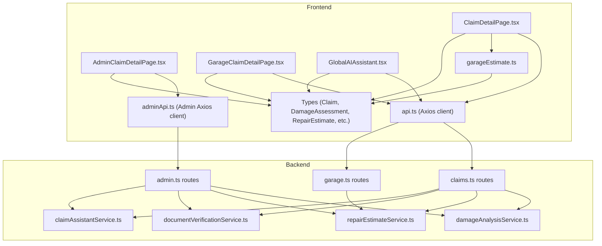
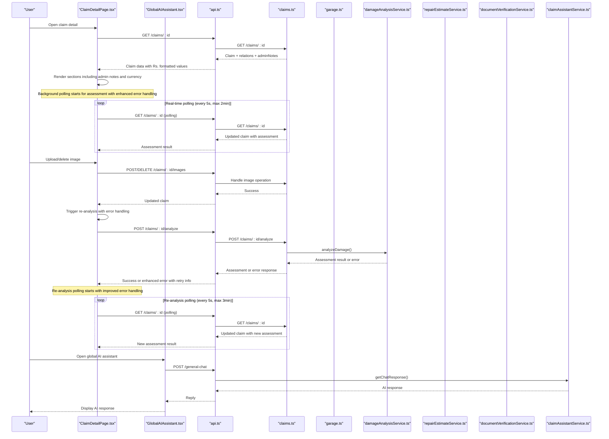
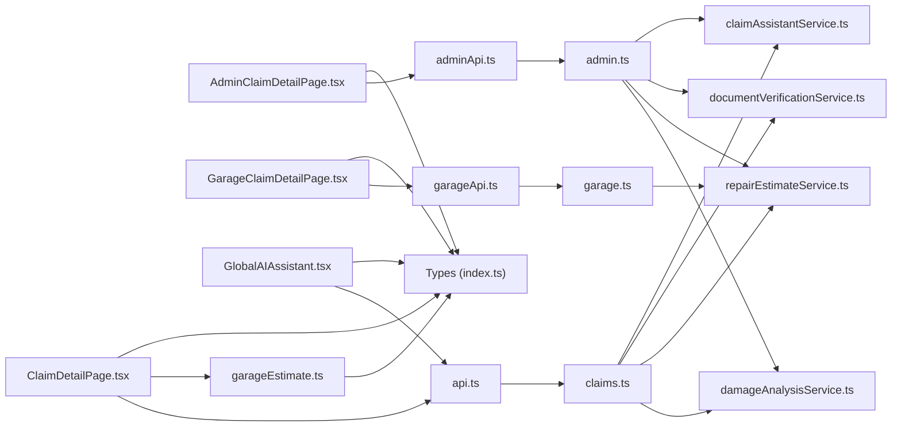

# Claim Detail Page

<cite>
**Referenced Files in This Document**
- [ClaimDetailPage.tsx](file://frontend/src/pages/ClaimDetailPage.tsx)
- [AdminClaimDetailPage.tsx](file://frontend/src/pages/admin/AdminClaimDetailPage.tsx)
- [GarageClaimDetailPage.tsx](file://frontend/src/pages/garage/GarageClaimDetailPage.tsx)
- [GlobalAIAssistant.tsx](file://frontend/src/components/GlobalAIAssistant.tsx)
- [api.ts](file://frontend/src/services/api.ts)
- [adminApi.ts](file://frontend/src/services/adminApi.ts)
- [index.ts (types)](file://frontend/src/types/index.ts)
- [claims.ts (routes)](file://backend/src/routes/claims.ts)
- [garage.ts (routes)](file://backend/src/routes/garage.ts)
- [admin.ts (routes)](file://backend/src/routes/admin.ts)
- [damageAnalysisService.ts](file://backend/src/services/damageAnalysisService.ts)
- [repairEstimateService.ts](file://backend/src/services/repairEstimateService.ts)
- [documentVerificationService.ts](file://backend/src/services/documentVerificationService.ts)
- [claimAssistantService.ts](file://backend/src/services/claimAssistantService.ts)
- [garageEstimate.ts](file://frontend/src/utils/garageEstimate.ts)
</cite>

## Update Summary
**Changes Made**
- Enhanced error handling with sophisticated retry mechanisms and user-friendly error messages
- Improved visual indicators for AI processing status with clear loading states and progress feedback
- Added intelligent auto-retry functionality for failed AI analysis with countdown timers
- Enhanced damage assessment error handling with contextual guidance and manual retry options
- Implemented better visual feedback for re-analysis processes after image modifications
- Upgraded error message clarity with actionable information for users
- **Updated**: Estimate date display now shows actual estimate dates with fallback to submission timestamps for better context

## Table of Contents
1. Introduction
2. Project Structure
3. Core Components
4. Architecture Overview
5. Detailed Component Analysis
6. Dependency Analysis
7. Performance Considerations
8. Troubleshooting Guide
9. Conclusion

## Introduction
This document explains the ClaimDetailPage, which provides a comprehensive view and management experience for an individual insurance claim. It covers how incident details, vehicle information, damage assessment results with enhanced error handling and real-time polling, repair estimates with integrated garage comparison, current status with timeline tracking, documents, chat-based communication, approval workflow integration, and admin notes display are shown and managed. The page now features significantly improved error handling with sophisticated retry mechanisms, better visual indicators for AI processing status, more informative error messages when damage analysis fails, and enhanced user feedback throughout all AI-powered operations. It also documents data fetching patterns, error handling for missing or invalid claim data, navigation behavior, and real-time-like updates via polling mechanisms. The system now provides better context for estimate timing by displaying actual estimate dates when available, falling back to submission timestamps for older estimates without explicit estimate dates.

## Project Structure
The ClaimDetailPage is part of a React frontend that communicates with an Express backend. The page fetches claim data, triggers AI analysis with enhanced error handling and real-time polling, manages garage selection, handles image uploads with automatic re-analysis, uploads documents, verifies documents, manages a chat conversation, and displays admin notes from insurance reviewers. The backend exposes REST endpoints to read/update claims, run AI services, persist related entities such as images, documents, assessments, estimates, payouts, chat messages, and admin notes. All monetary values are consistently formatted with Sri Lankan Rupees (Rs.) prefixes and proper thousands separators.

**Diagram sources**
- [ClaimDetailPage.tsx:1-777](file://frontend/src/pages/ClaimDetailPage.tsx#L1-L777)
- [AdminClaimDetailPage.tsx:1-593](file://frontend/src/pages/admin/AdminClaimDetailPage.tsx#L1-L593)
- [GarageClaimDetailPage.tsx:1-250](file://frontend/src/pages/garage/GarageClaimDetailPage.tsx#L1-L250)
- [GlobalAIAssistant.tsx:1-157](file://frontend/src/components/GlobalAIAssistant.tsx#L1-L157)
- [garageEstimate.ts:1-49](file://frontend/src/utils/garageEstimate.ts#L1-L49)
- [api.ts:1-40](file://frontend/src/services/api.ts#L1-L40)
- [adminApi.ts:1-27](file://frontend/src/services/adminApi.ts#L1-L27)
- [claims.ts:1-532](file://backend/src/routes/claims.ts#L1-L532)
- [garage.ts:1-163](file://backend/src/routes/garage.ts#L1-L163)
- [admin.ts:1-239](file://backend/src/routes/admin.ts#L1-L239)

**Section sources**
- [ClaimDetailPage.tsx:1-777](file://frontend/src/pages/ClaimDetailPage.tsx#L1-L777)
- [AdminClaimDetailPage.tsx:1-593](file://frontend/src/pages/admin/AdminClaimDetailPage.tsx#L1-L593)
- [GarageClaimDetailPage.tsx:1-250](file://frontend/src/pages/garage/GarageClaimDetailPage.tsx#L1-L250)
- [GlobalAIAssistant.tsx:1-157](file://frontend/src/components/GlobalAIAssistant.tsx#L1-L157)
- [garageEstimate.ts:1-49](file://frontend/src/utils/garageEstimate.ts#L1-L49)
- [api.ts:1-40](file://frontend/src/services/api.ts#L1-L40)
- [adminApi.ts:1-27](file://frontend/src/services/adminApi.ts#L1-L27)
- [claims.ts:1-532](file://backend/src/routes/claims.ts#L1-L532)
- [garage.ts:1-163](file://backend/src/routes/garage.ts#L1-L163)
- [admin.ts:1-239](file://backend/src/routes/admin.ts#L1-L239)

## Core Components
- Claim detail display: incident info, vehicle make/model/year, location/date, status badge, safety warning when severe damage is detected.
- **Enhanced garage selection**: improved modal interface with visual feedback, address display, and change capabilities.
- Images gallery: shows uploaded full-vehicle and close-up damage photos with delete functionality.
- **Enhanced real-time damage assessment**: displays severity, drivability assessment, and itemized damages with sophisticated error handling, automatic polling, re-analysis triggers, and improved visual feedback.
- **Integrated estimate comparison**: shows both AI and garage estimates side-by-side with detailed breakdowns and currency formatting.
- **Repair estimate**: shows parts/labor totals with Sri Lankan Rupees formatting, estimated days, and line items with proper currency display.
- **Insurance payout**: shows deductible, covered amounts, and estimated payouts in Rs. format.
- **Admin notes display**: shows color-coded category badges and timestamp formatting.
- Documents: upload, view, and verify documents with verification statuses and issues.
- **Enhanced progress checklist**: includes garage-specific steps like garage selection and assessment phases.
- Chat assistant: send/receive messages about the claim; quick prompts included.
- **Global AI Assistant**: floating chat interface for general AI assistance (replaces inline suggestions).

Key behaviors:
- Fetches claim details on mount and refreshes after mutations.
- **Enhanced real-time polling**: automatically polls for damage assessment results until they appear with sophisticated timeout handling.
- **Intelligent re-analysis**: triggers re-analysis after image uploads or deletions with improved error handling.
- **Advanced error handling**: implements retry mechanisms with countdown timers and user-friendly error messages.
- Navigates back to claims listing if claim not found.
- Uses axios interceptors to attach auth tokens and handle 401 redirects.
- Displays all monetary values with consistent Sri Lankan Rupees formatting.
- Shows admin notes with categorized badges and formatted timestamps.
- Provides access to AI assistance through global floating assistant instead of inline suggestions.
- **Enhanced estimate date display**: shows actual estimate dates when available, with fallback to submission timestamps for better context about when estimates were intended to apply.

**Section sources**
- [ClaimDetailPage.tsx:9-119](file://frontend/src/pages/ClaimDetailPage.tsx#L9-L119)
- [ClaimDetailPage.tsx:170-197](file://frontend/src/pages/ClaimDetailPage.tsx#L170-L197)
- [ClaimDetailPage.tsx:272-366](file://frontend/src/pages/ClaimDetailPage.tsx#L272-L366)
- [ClaimDetailPage.tsx:368-417](file://frontend/src/pages/ClaimDetailPage.tsx#L368-L417)
- [ClaimDetailPage.tsx:419-465](file://frontend/src/pages/ClaimDetailPage.tsx#L419-L465)
- [AdminClaimDetailPage.tsx:245-304](file://frontend/src/pages/admin/AdminClaimDetailPage.tsx#L245-L304)
- [GarageClaimDetailPage.tsx:185-216](file://frontend/src/pages/garage/GarageClaimDetailPage.tsx#L185-L216)
- [GlobalAIAssistant.tsx:16-157](file://frontend/src/components/GlobalAIAssistant.tsx#L16-L157)
- [api.ts:11-37](file://frontend/src/services/api.ts#L11-L37)

## Architecture Overview
The ClaimDetailPage follows a client-server architecture with clear separation of concerns:
- Frontend UI orchestrates user interactions and renders rich claim context including admin notes with proper currency formatting.
- **Enhanced polling mechanism**: implements background polling for damage assessment results with sophisticated error handling and automatic retry logic.
- Backend routes enforce authentication and delegate to specialized services.
- Services integrate with AI models to analyze damage, generate estimates, verify documents, and power the chat assistant.
- Data persistence uses Prisma to store claims, images, documents, assessments, estimates, payouts, chat messages, and admin notes.
- Global AI Assistant provides centralized AI assistance accessible from any page.

**Diagram sources**
- [ClaimDetailPage.tsx:37-58](file://frontend/src/pages/ClaimDetailPage.tsx#L37-L58)
- [ClaimDetailPage.tsx:112-117](file://frontend/src/pages/ClaimDetailPage.tsx#L112-L117)
- [GarageClaimDetailPage.tsx:29-43](file://frontend/src/pages/garage/GarageClaimDetailPage.tsx#L29-L43)
- [GlobalAIAssistant.tsx:29-43](file://frontend/src/components/GlobalAIAssistant.tsx#L29-L43)
- [claims.ts:104-134](file://backend/src/routes/claims.ts#L104-L134)
- [claims.ts:270-288](file://backend/src/routes/claims.ts#L270-L288)
- [garage.ts:100-163](file://backend/src/routes/garage.ts#L100-L163)
- [damageAnalysisService.ts:50-153](file://backend/src/services/damageAnalysisService.ts#L50-L153)
- [repairEstimateService.ts:104-199](file://backend/src/services/repairEstimateService.ts#L104-L199)
- [documentVerificationService.ts:41-107](file://backend/src/services/documentVerificationService.ts#L41-107)
- [claimAssistantService.ts:19-130](file://backend/src/services/claimAssistantService.ts#L19-L130)

## Detailed Component Analysis

### Enhanced Error Handling and Retry Mechanisms
**Updated** Significantly improved error handling with sophisticated retry mechanisms and user-friendly error messages.

- **Automatic retry system**: Implements intelligent retry logic that automatically attempts to re-analyze up to twice when AI analysis fails
- **Countdown timers**: Shows real-time countdown indicating when automatic retry will occur
- **Contextual error messages**: Provides specific, actionable error messages based on failure types
- **Visual error indicators**: Uses prominent red alert boxes with clear messaging and retry buttons
- **Retryable vs non-retryable errors**: Distinguishes between temporary failures (retryable) and permanent issues (non-retryable)

Implementation details:
- `analyzeError` state tracks error details including message and retryability
- `retryIn` countdown timer shows time remaining before automatic retry
- `retryCountRef` tracks number of automatic retry attempts (max 2)
- Manual retry button always available for immediate action
- Error messages provide clear guidance: "AI is not working correctly right now" with specific details

**Section sources**
- [ClaimDetailPage.tsx:25-28](file://frontend/src/pages/ClaimDetailPage.tsx#L25-L28)
- [ClaimDetailPage.tsx:94-129](file://frontend/src/pages/ClaimDetailPage.tsx#L94-L129)
- [ClaimDetailPage.tsx:428-445](file://frontend/src/pages/ClaimDetailPage.tsx#L428-L445)

### Enhanced Visual Indicators for AI Processing Status
**Updated** Significantly improved visual feedback for all AI processing operations with clearer status indicators.

- **Multi-state processing indicators**: Distinct visual states for initial analysis, re-analysis, and error conditions
- **Animated loading states**: Spinning icons and progress indicators for ongoing AI operations
- **Color-coded status messages**: Blue for processing, red for errors, green for success
- **Contextual messaging**: Clear explanations of what's happening at each stage
- **Progressive disclosure**: Shows different levels of detail based on processing state

Processing states:
- **Initial analysis**: "AI is analyzing your photos. This may take a minute — results will appear here automatically."
- **Re-analysis**: "Photos changed — AI is re-analyzing and updating the estimate. Results will appear here automatically."
- **Error state**: Prominent error banner with retry option and automatic retry countdown
- **Success state**: Full damage assessment display with severity indicators

**Section sources**
- [ClaimDetailPage.tsx:417-480](file://frontend/src/pages/ClaimDetailPage.tsx#L417-L480)

### Intelligent Auto-Retry with Countdown Timers
**Updated** Sophisticated retry mechanism that automatically attempts recovery from AI service failures.

- **Smart retry logic**: Automatically retries failed analysis up to twice with 30-second intervals
- **Countdown visualization**: Shows real-time countdown ("Re-analyzing automatically in 30s…")
- **Manual override**: Users can immediately retry without waiting for automatic retry
- **Retry budget management**: Prevents excessive retry attempts to avoid overwhelming the AI service
- **State preservation**: Maintains user context and previous analysis state during retry process

Implementation details:
- `retryCountRef` tracks number of automatic retry attempts
- `retryIn` countdown timer decrements every second
- Automatic retry triggered after 30 seconds for retryable errors
- Manual retry resets the retry counter and provides immediate feedback
- Error state persists until successful completion or retry budget exhausted

**Section sources**
- [ClaimDetailPage.tsx:117-129](file://frontend/src/pages/ClaimDetailPage.tsx#L117-L129)
- [ClaimDetailPage.tsx:434-438](file://frontend/src/pages/ClaimDetailPage.tsx#L434-L438)

### Enhanced Damage Assessment Error Messages
**Updated** More informative and actionable error messages when damage analysis fails.

- **Contextual error messaging**: Specific messages based on error type and context
- **User guidance**: Clear instructions on what users can do to resolve issues
- **Technical transparency**: Hints about potential causes without exposing internal details
- **Action-oriented design**: Each error message includes appropriate next steps

Error message examples:
- **Service unavailable**: "AI analysis did not complete — the AI service may be unavailable right now."
- **General failure**: "AI analysis failed — the AI service may be unavailable right now."
- **Re-analysis failure**: "AI re-analysis failed — the previous assessment is still shown."
- **Timeout**: "AI analysis did not complete — the AI service may be unavailable right now."

**Section sources**
- [ClaimDetailPage.tsx:52-54](file://frontend/src/pages/ClaimDetailPage.tsx#L52-L54)
- [ClaimDetailPage.tsx:109-113](file://frontend/src/pages/ClaimDetailPage.tsx#L109-L113)
- [ClaimDetailPage.tsx:158-161](file://frontend/src/pages/ClaimDetailPage.tsx#L158-L161)

### Enhanced Progress Checklist with Garage Integration
**Updated** Expanded progress tracking to include garage-specific milestones and assessment phases.

- **Garage selection step**: Added "Garage selected" milestone in progress tracking
- **Garage assessment step**: Includes "Garage assessment" phase after garage selection
- **Issue detection**: Highlights problematic steps with red indicators and XCircle icons
- **Visual hierarchy**: Clear distinction between completed, pending, and problematic steps
- **Contextual guidance**: Clock icons indicate pending steps requiring attention

Progress flow:
- Claim created → Vehicle photos uploaded → Claim submitted → AI damage assessment complete → Repair estimate generated → **Garage selected** → **Garage assessment** → Documents uploaded → Documents approved → Claim approved → Claim completed
- Each step includes boolean completion status and optional issue flag
- Conditional rendering based on claim state and related entities

**Section sources**
- [ClaimDetailPage.tsx:170-197](file://frontend/src/pages/ClaimDetailPage.tsx#L170-L197)
- [ClaimDetailPage.tsx:247-270](file://frontend/src/pages/ClaimDetailPage.tsx#L247-L270)

### Integrated Garage Estimate Comparison Display
**Updated** Comprehensive comparison interface showing both AI-generated and garage-provided estimates side by side.

- **Side-by-side comparison**: Displays AI estimate and garage estimate in parallel grid layout
- **Color-coded differentiation**: Blue for AI estimates, orange for garage estimates
- **Detailed breakdown**: Shows parts, labor, paint materials, totals, and estimated days for both estimates
- **Currency formatting**: Consistent Sri Lankan Rupees formatting across all monetary values
- **Status indicators**: Shows when garage estimate is submitted with timestamp
- **Itemized details**: Expands to show detailed line items for both estimates

Comparison features:
- Grid layout with 2-column comparison when both estimates exist
- Individual cost components (parts, labor, paint) displayed separately
- Total costs prominently displayed with appropriate styling
- Notes field for garage estimates when available
- Responsive design adapts to different screen sizes

**Section sources**
- [ClaimDetailPage.tsx:291-347](file://frontend/src/pages/ClaimDetailPage.tsx#L291-L347)
- [garageEstimate.ts:17-48](file://frontend/src/utils/garageEstimate.ts#L17-L48)

### Enhanced Estimate Date Display with Fallback Logic
**Updated** Estimate date display now shows actual estimate dates when available, with fallback to submission timestamps for better context about when estimates were intended to apply versus when they were actually submitted.

- **Primary display**: Shows `estimateDate` when explicitly set by the garage
- **Fallback behavior**: Falls back to `submittedAt` for older estimates without explicit estimate dates
- **Consistent formatting**: Both dates use the same formatting approach with `toLocaleDateString()`
- **Better context**: Provides clearer understanding of when estimates were meant to apply vs. when they were processed

Implementation details:
- Frontend displays: `{new Date(claim.garageEstimate.estimateDate ?? claim.garageEstimate.submittedAt).toLocaleDateString()}`
- Backend stores `estimateDate` when garage specifies it during estimate submission
- For legacy estimates without explicit dates, falls back to `submittedAt` timestamp
- Applied consistently across user, admin, and garage interfaces

**Section sources**
- [ClaimDetailPage.tsx:321-324](file://frontend/src/pages/ClaimDetailPage.tsx#L321-L324)
- [AdminClaimDetailPage.tsx:399-402](file://frontend/src/pages/admin/AdminClaimDetailPage.tsx#L399-L402)
- [GarageClaimDetailPage.tsx:199-202](file://frontend/src/pages/garage/GarageClaimDetailPage.tsx#L199-L202)
- [garage.ts:106-115](file://backend/src/routes/garage.ts#L106-L115)
- [index.ts:244-247](file://frontend/src/types/index.ts#L244-L247)

### Monetary Value Formatting with Sri Lankan Rupees
**Updated** Enhanced with comprehensive Sri Lankan Rupees (Rs.) formatting throughout all monetary displays, including garage estimates.

All monetary values are consistently formatted with:
- **Rs. prefix**: Every monetary value displays the Sri Lankan Rupees symbol followed by the amount
- **Thousands separators**: Uses `toLocaleString()` for proper number formatting (e.g., 1,234,567)
- **Consistent styling**: Bold fonts and appropriate colors for different monetary categories

Implementation includes:
- **Repair cost breakdowns**: Parts, labor, and total costs all formatted with Rs. prefixes
- **Garage estimate comparisons**: Both AI and garage estimates use consistent formatting
- **Insurance payout estimates**: Deductible, covered amounts, and estimated payouts with proper currency formatting
- **Line item costs**: Individual part costs, labor rates, and subtotals with consistent formatting
- **Admin interface**: Same currency formatting applied across both user and admin views

Examples of formatted values:
- AI Parts: `Rs. {aiTotals.totalPartsCost.toLocaleString()}`
- Garage Labor: `Rs. {garageTotals.laborCost.toLocaleString()}`
- Garage Paint: `Rs. {garageItems.paintMaterials.toLocaleString()}`
- Payout: `Rs. {claim.insurancePayout.estimatedPayout.toLocaleString()}`

**Section sources**
- [ClaimDetailPage.tsx:297-347](file://frontend/src/pages/ClaimDetailPage.tsx#L297-L347)
- [ClaimDetailPage.tsx:427-463](file://frontend/src/pages/ClaimDetailPage.tsx#L427-L463)
- [AdminClaimDetailPage.tsx:210-223](file://frontend/src/pages/admin/AdminClaimDetailPage.tsx#L210-L223)
- [index.ts:74-102](file://frontend/src/types/index.ts#L74-L102)

### Admin Notes Display with Color-Coded Categories
**Updated** Enhanced with admin notes display showing color-coded category badges and timestamp formatting for insurance company perspective.

- Displays admin notes with categorized badges:
  - **Vehicle notes**: Blue background (`bg-blue-200 text-blue-800`)
  - **Document notes**: Purple background (`bg-purple-200 text-purple-800`)  
  - **General notes**: Gray background (`bg-gray-200 text-gray-700`)
- Shows formatted timestamps using `toLocaleString()` for better readability
- Provides visual distinction between different types of administrative feedback
- Integrates seamlessly with the existing claim detail layout

Implementation details:
- Notes are rendered conditionally when `claim.adminNotes` exists and has content
- Each note displays category badge, timestamp, and content in a structured format
- Uses consistent styling with other claim components for visual harmony

**Section sources**
- [ClaimDetailPage.tsx:569-590](file://frontend/src/pages/ClaimDetailPage.tsx#L569-L590)
- [AdminClaimDetailPage.tsx:275-304](file://frontend/src/pages/admin/AdminClaimDetailPage.tsx#L275-L304)
- [index.ts:122-129](file://frontend/src/types/index.ts#L122-L129)

### Enhanced Damage Assessment Results with Real-Time Updates
**Updated** Enhanced with sophisticated error handling, real-time polling, and automatic re-analysis capabilities.

- Displays overall severity, drivability assessment, and list of damages with type, severity, location, and description.
- **Enhanced real-time polling**: Automatically polls for assessment results every 5 seconds until they appear with sophisticated timeout handling
- **Intelligent re-analysis triggers**: Automatically triggers re-analysis when images are uploaded or deleted with improved error handling
- **Advanced visual feedback**: Shows spinning animations, helpful messages, and error states during processing
- **Robust error handling**: Implements retry mechanisms with countdown timers and user-friendly error messages
- Supports manual re-analysis by calling POST /claims/:id/analyze

Processing logic:
- Backend service reads claim images, sends them to AI model, parses JSON output, persists assessment, updates image annotations, and auto-generates repair estimate with Sri Lankan Rupees formatting.
- Frontend implements sophisticated polling mechanism with timeout protection and enhanced error handling
- Automatic re-analysis ensures assessment stays current with image changes while providing clear user feedback

**Section sources**
- [ClaimDetailPage.tsx:37-58](file://frontend/src/pages/ClaimDetailPage.tsx#L37-L58)
- [ClaimDetailPage.tsx:368-417](file://frontend/src/pages/ClaimDetailPage.tsx#L368-L417)
- [claims.ts:270-288](file://backend/src/routes/claims.ts#L270-L288)
- [damageAnalysisService.ts:50-153](file://backend/src/services/damageAnalysisService.ts#L50-L153)

### Repair Estimates with Currency Formatting
**Updated** Enhanced with comprehensive Sri Lankan Rupees formatting for all repair cost components and integrated garage comparison.

- Shows total parts cost, labor cost, total cost with Rs. prefixes and thousands separators
- Estimated days display alongside formatted costs
- Itemized breakdown with individual part costs, labor hours, labor rates, and subtotals all properly formatted
- Generated automatically after damage analysis or via dedicated endpoint
- **Integrated comparison**: Side-by-side display with garage estimates when available

Processing logic:
- Service computes item costs using predefined ranges in Sri Lankan Rupees, aggregates totals, calculates estimated days, and creates/updates estimate record with proper currency formatting. Also computes insurance payout if policy exists.

**Section sources**
- [ClaimDetailPage.tsx:419-465](file://frontend/src/pages/ClaimDetailPage.tsx#L419-L465)
- [claims.ts:290-314](file://backend/src/routes/claims.ts#L290-L314)
- [repairEstimateService.ts:104-199](file://backend/src/services/repairEstimateService.ts#L104-L199)

### Insurance Payout Estimates with Currency Formatting
**Updated** Enhanced with Sri Lankan Rupees formatting for all payout components.

- Shows deductible, covered amount, and estimated payout all with Rs. prefixes and proper formatting
- Consistent visual presentation with bold fonts and appropriate colors
- Notes field displays additional payout information when available

Implementation:
- All payout values use `Rs. {value.toLocaleString()}` pattern for consistent formatting
- Visual hierarchy emphasizes the estimated payout amount in green color
- Grid layout provides clear separation between different payout components

**Section sources**
- [ClaimDetailPage.tsx:552-566](file://frontend/src/pages/ClaimDetailPage.tsx#L552-L566)
- [AdminClaimDetailPage.tsx:217-226](file://frontend/src/pages/admin/AdminClaimDetailPage.tsx#L217-L226)

### Current Status and Timeline Tracking
- Status badge reflects current claim status.
- **Enhanced progress checklist**: Now includes garage-specific steps for better workflow visibility
- Progress checklist shows steps like claim created, photos uploaded, submitted, AI assessment complete, estimate generated, **garage selected**, **garage assessment**, documents uploaded/approved, approved, completed.
- **Removed**: Contextual suggestions based on claim state have been removed in favor of the global AI assistant.

Implementation:
- Checklist computed from claim fields and related entities including garage-related data
- Suggestions derived from presence/absence of images, documents, assessments, and current status
- Enhanced with garage-specific milestones for better workflow tracking

**Section sources**
- [ClaimDetailPage.tsx:170-197](file://frontend/src/pages/ClaimDetailPage.tsx#L170-L197)
- [ClaimDetailPage.tsx:247-270](file://frontend/src/pages/ClaimDetailPage.tsx#L247-L270)

### Document Management
- Uploads documents with types LICENSE, REGISTRATION, ACCIDENT_REPORT, REPAIR_ESTIMATE.
- Displays existing documents with verification status and issues.
- Allows verifying pending documents to trigger AI verification.

Endpoints:
- POST /claims/:id/documents (multipart)
- POST /claims/:id/documents/:docId/verify

Verification logic:
- Reads document file, sends to AI model, parses JSON result, updates verification status and result.

**Section sources**
- [ClaimDetailPage.tsx:91-110](file://frontend/src/pages/ClaimDetailPage.tsx#L91-L110)
- [ClaimDetailPage.tsx:467-513](file://frontend/src/pages/ClaimDetailPage.tsx#L467-L513)
- [claims.ts:316-353](file://backend/src/routes/claims.ts#L316-L353)
- [claims.ts:379-397](file://backend/src/routes/claims.ts#L379-L397)
- [documentVerificationService.ts:41-107](file://backend/src/services/documentVerificationService.ts#L41-L107)

### Communication History and Chat Assistant
- Displays chat messages for the claim with user and assistant roles.
- Sends new messages via POST /claims/:id/chat and refreshes to show updated history.
- Quick prompts available for common questions.

Assistant logic:
- Builds context from claim, vehicle, policy, assessment, estimate, payout, and documents.
- Maintains conversation history and persists both user and assistant messages.
- References Sri Lankan Rupees when discussing monetary values in responses.

**Section sources**
- [ClaimDetailPage.tsx:146-158](file://frontend/src/pages/ClaimDetailPage.tsx#L146-L158)
- [ClaimDetailPage.tsx:634-670](file://frontend/src/pages/ClaimDetailPage.tsx#L634-L670)
- [claims.ts:399-447](file://backend/src/routes/claims.ts#L399-L447)
- [claimAssistantService.ts:19-130](file://backend/src/services/claimAssistantService.ts#L19-L130)

### Global AI Assistant
**New** Replaces inline AI suggestions with a floating global assistant interface.

- Floating button positioned at bottom-right corner of screen
- Opens chat panel with message history and quick question prompts
- Communicates with `/general-chat` endpoint for AI responses
- Provides persistent chat history across pages
- Includes message clearing functionality
- Responsive design with mobile-friendly interface

Implementation:
- Fixed positioning with z-index layering
- State management for open/closed states and message history
- Real-time message sending and receiving
- Auto-scroll to latest messages
- Loading indicators during AI processing

**Section sources**
- [GlobalAIAssistant.tsx:16-157](file://frontend/src/components/GlobalAIAssistant.tsx#L16-L157)

### Enhanced Real-Time Updates and Refresh Strategy
**Updated** Enhanced with sophisticated polling mechanisms and improved error handling for real-time updates.

- After each mutation (analyze, upload, verify, chat), the page calls GET /claims/:id to refresh the latest state.
- **Enhanced real-time polling**: Automatically polls every 5 seconds for up to 2 minutes when damage assessment is pending with sophisticated timeout handling
- **Intelligent re-analysis polling**: Triggers separate polling mechanism when images are modified with improved error handling
- **Advanced error recovery**: Implements retry mechanisms with countdown timers and user feedback
- This pattern ensures consistent UI without WebSockets while providing near real-time updates with robust error handling.
- Currency formatting is maintained across all refresh operations.

**Section sources**
- [ClaimDetailPage.tsx:37-58](file://frontend/src/pages/ClaimDetailPage.tsx#L37-L58)
- [ClaimDetailPage.tsx:112-117](file://frontend/src/pages/ClaimDetailPage.tsx#L112-L117)

### Approval Workflow Integration
- While direct status transitions are not exposed on this page, the backend enforces workflow rules (e.g., submit only from DRAFT, require images).
- **Enhanced progress checklist**: Now includes garage-specific workflow stages for better visibility
- The progress checklist and suggestions reflect workflow stages and guide users toward completion.
- Currency-formatted estimates and payouts are integrated into the approval workflow.
- **Garage integration**: Workflow now includes garage selection and assessment phases

**Section sources**
- [claims.ts:175-200](file://backend/src/routes/claims.ts#L175-L200)
- [ClaimDetailPage.tsx:170-197](file://frontend/src/pages/ClaimDetailPage.tsx#L170-L197)

## Dependency Analysis
- ClaimDetailPage depends on:
  - api.ts for HTTP requests and auth token injection.
  - Types for compile-time safety and rendering.
  - **garageEstimate.ts** for normalizing and calculating garage estimate totals.
- AdminClaimDetailPage depends on:
  - adminApi.ts for admin-specific HTTP requests and authentication.
  - Same types for consistency across user and admin interfaces.
- GarageClaimDetailPage depends on:
  - garageApi.ts for garage-specific operations and authentication.
  - Enhanced estimate date handling with fallback logic.
- GlobalAIAssistant depends on:
  - api.ts for general chat functionality.
  - Independent state management for chat history.
- Backend routes depend on:
  - Authentication middleware.
  - File upload middleware for images and documents.
  - Services for AI-powered features.
- Services depend on:
  - Prisma for database access.
  - Gemini model utilities for AI capabilities.
  - Sri Lankan Rupees formatting for all monetary calculations.

**Diagram sources**
- [ClaimDetailPage.tsx:1-777](file://frontend/src/pages/ClaimDetailPage.tsx#L1-L777)
- [AdminClaimDetailPage.tsx:1-593](file://frontend/src/pages/admin/AdminClaimDetailPage.tsx#L1-L593)
- [GarageClaimDetailPage.tsx:1-250](file://frontend/src/pages/garage/GarageClaimDetailPage.tsx#L1-L250)
- [GlobalAIAssistant.tsx:1-157](file://frontend/src/components/GlobalAIAssistant.tsx#L1-L157)
- [garageEstimate.ts:1-49](file://frontend/src/utils/garageEstimate.ts#L1-L49)
- [api.ts:1-40](file://frontend/src/services/api.ts#L1-L40)
- [adminApi.ts:1-27](file://frontend/src/services/adminApi.ts#L1-L27)
- [claims.ts:1-532](file://backend/src/routes/claims.ts#L1-L532)
- [garage.ts:1-163](file://backend/src/routes/garage.ts#L1-L163)
- [admin.ts:1-239](file://backend/src/routes/admin.ts#L1-L239)
- [index.ts:1-284](file://frontend/src/types/index.ts#L1-L284)

**Section sources**
- [ClaimDetailPage.tsx:1-777](file://frontend/src/pages/ClaimDetailPage.tsx#L1-L777)
- [AdminClaimDetailPage.tsx:1-593](file://frontend/src/pages/admin/AdminClaimDetailPage.tsx#L1-L593)
- [GarageClaimDetailPage.tsx:1-250](file://frontend/src/pages/garage/GarageClaimDetailPage.tsx#L1-L250)
- [GlobalAIAssistant.tsx:1-157](file://frontend/src/components/GlobalAIAssistant.tsx#L1-L157)
- [garageEstimate.ts:1-49](file://frontend/src/utils/garageEstimate.ts#L1-L49)
- [api.ts:1-40](file://frontend/src/services/api.ts#L1-L40)
- [adminApi.ts:1-27](file://frontend/src/services/adminApi.ts#L1-L27)
- [claims.ts:1-532](file://backend/src/routes/claims.ts#L1-L532)
- [garage.ts:1-163](file://backend/src/routes/garage.ts#L1-L163)
- [admin.ts:1-239](file://backend/src/routes/admin.ts#L1-L239)
- [index.ts:1-284](file://frontend/src/types/index.ts#L1-L284)

## Performance Considerations
- Re-fetching after mutations avoids stale UI but may cause multiple network calls; consider batching or optimistic updates where appropriate.
- **Enhanced polling optimization**: Implements smart polling with timeouts to prevent excessive network requests and sophisticated error handling
- Image loading can be optimized with lazy loading and proper sizing.
- AI operations (analysis, verification, chat) can be slow; keep disabled states and spinners to improve perceived performance.
- Avoid unnecessary re-renders by memoizing derived lists (already used for todoSteps and suggestions).
- Currency formatting using `toLocaleString()` is lightweight and doesn't significantly impact performance.
- Admin notes display is lightweight and doesn't significantly impact performance due to simple conditional rendering.
- Global AI Assistant maintains separate state to avoid interfering with claim page performance.
- **Garage estimate normalization**: Efficient parsing and calculation of garage estimate totals using utility functions
- **Enhanced error handling**: Improved error recovery mechanisms reduce unnecessary retry attempts and improve user experience
- **Optimized date display**: Efficient fallback logic for estimate dates minimizes computational overhead

## Troubleshooting Guide
Common issues and resolutions:
- Claim not found:
  - Frontend navigates to /claims when GET /claims/:id fails.
  - Ensure valid claim id and authenticated session.
- Missing images before submission:
  - Backend rejects submission without images; ensure at least one image is uploaded.
- Invalid document type:
  - Only supported types accepted; verify payload includes a valid type.
- AI parsing failures:
  - Services include fallback responses when AI output cannot be parsed; retry or check file readability.
- Authentication errors:
  - 401 responses clear local storage and redirect to login; re-authenticate.
- Admin notes not displaying:
  - Verify claim includes adminNotes relation in backend query.
  - Check that admin notes exist for the claim and have valid category values.
- Currency formatting issues:
  - Ensure all monetary values are numbers (not strings) before applying `toLocaleString()`.
  - Verify that the locale settings support thousands separators.
- Global AI Assistant not responding:
  - Check network connectivity to `/general-chat` endpoint.
  - Verify authentication token is present for chat requests.
- **Enhanced error handling for AI analysis**:
  - Check for automatic retry countdown timers indicating background retry attempts
  - Verify error messages provide clear guidance on next steps
  - Monitor retry budget (maximum 2 automatic retries)
  - Use manual retry button when automatic retries are exhausted
- **Polling not working**:
  - Verify claim status is not DRAFT and has images uploaded
  - Check network connectivity and response times
  - Ensure polling timeout limits are not exceeded
  - Monitor enhanced error states for timeout scenarios
- **Re-analysis not triggering**:
  - Verify image upload/delete operations are successful
  - Check that claim is not in DRAFT status
  - Monitor console for any API errors during re-analysis
  - Verify enhanced error handling provides appropriate feedback
- **Estimate date display issues**:
  - Verify that `estimateDate` is properly stored in the database when set by garages
  - Check fallback to `submittedAt` for older estimates without explicit dates
  - Ensure date formatting works correctly across different locales
  - Confirm that null/undefined values are handled gracefully in the fallback logic

Relevant flows:
- Error handling in frontend catches failures and alerts users; navigation occurs on claim fetch failure.
- Backend routes return descriptive errors for validation and resource-not-found cases.
- Admin notes are fetched as part of the standard claim data retrieval process.
- Currency formatting is applied consistently across all monetary displays.
- Global AI Assistant handles its own error states independently from claim operations.
- **Enhanced error handling**: Improved error messages for garage operations and assessment processes with sophisticated retry mechanisms
- **Improved estimate date handling**: Better context provided through actual estimate dates with reliable fallback to submission timestamps

**Section sources**
- [ClaimDetailPage.tsx:27-33](file://frontend/src/pages/ClaimDetailPage.tsx#L27-L33)
- [ClaimDetailPage.tsx:60-80](file://frontend/src/pages/ClaimDetailPage.tsx#L60-L80)
- [ClaimDetailPage.tsx:37-58](file://frontend/src/pages/ClaimDetailPage.tsx#L37-L58)
- [GarageClaimDetailPage.tsx:199-202](file://frontend/src/pages/garage/GarageClaimDetailPage.tsx#L199-L202)
- [GlobalAIAssistant.tsx:29-43](file://frontend/src/components/GlobalAIAssistant.tsx#L29-L43)
- [api.ts:26-37](file://frontend/src/services/api.ts#L26-L37)
- [claims.ts:175-200](file://backend/src/routes/claims.ts#L175-L200)
- [claims.ts:316-353](file://backend/src/routes/claims.ts#L316-L353)
- [garage.ts:106-115](file://backend/src/routes/garage.ts#L106-L115)
- [damageAnalysisService.ts:85-103](file://backend/src/services/damageAnalysisService.ts#L85-L103)
- [documentVerificationService.ts:78-94](file://backend/src/services/documentVerificationService.ts#L78-L94)
- [admin.ts:183-208](file://backend/src/routes/admin.ts#L183-L208)

## Conclusion
The ClaimDetailPage delivers a robust, user-friendly interface for managing individual claims with comprehensive Sri Lankan Rupees formatting throughout all monetary displays. The recent enhancements include significantly improved error handling with sophisticated retry mechanisms and countdown timers, better visual indicators for AI processing status with clear loading states and progress feedback, more informative error messages when damage analysis fails with actionable guidance, and enhanced user feedback throughout all AI-powered operations. The system now features intelligent auto-retry functionality that automatically attempts recovery from AI service failures, sophisticated polling mechanisms with timeout protection, and enhanced visual feedback for re-analysis processes after image modifications. The removal of inline AI suggestions has streamlined the user experience, focusing on core claim management features while providing access to AI assistance through a more flexible global floating assistant. The enhanced error handling ensures graceful degradation and clear user feedback, while the sophisticated retry mechanisms provide resilience against temporary AI service failures. Data consistency is maintained through explicit re-fetching after mutations and intelligent polling strategies, while the improved error handling ensures users always have clear guidance on next steps when issues occur. The system now provides a professional, localized experience for Sri Lankan insurance claim management with culturally appropriate currency formatting, enhanced AI reliability through sophisticated error handling, improved user experience during AI processing operations, and better context for estimate timing through actual estimate dates with reliable fallback to submission timestamps for older estimates.