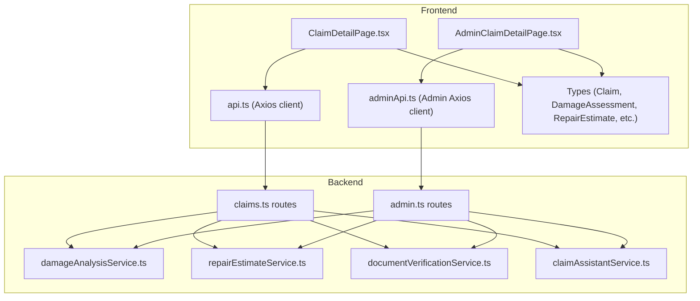
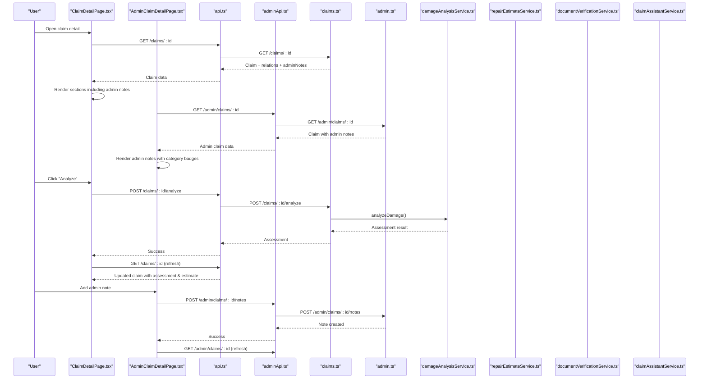
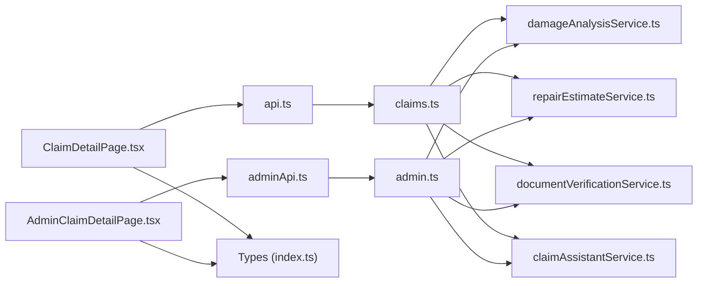

# Claim Detail Page

<cite>
**Referenced Files in This Document**
- [ClaimDetailPage.tsx](file://frontend/src/pages/ClaimDetailPage.tsx)
- [AdminClaimDetailPage.tsx](file://frontend/src/pages/admin/AdminClaimDetailPage.tsx)
- [api.ts](file://frontend/src/services/api.ts)
- [adminApi.ts](file://frontend/src/services/adminApi.ts)
- [index.ts (types)](file://frontend/src/types/index.ts)
- [claims.ts (routes)](file://backend/src/routes/claims.ts)
- [admin.ts (routes)](file://backend/src/routes/admin.ts)
- [damageAnalysisService.ts](file://backend/src/services/damageAnalysisService.ts)
- [repairEstimateService.ts](file://backend/src/services/repairEstimateService.ts)
- [documentVerificationService.ts](file://backend/src/services/documentVerificationService.ts)
- [claimAssistantService.ts](file://backend/src/services/claimAssistantService.ts)
</cite>

## Update Summary
**Changes Made**
- Enhanced admin notes display with color-coded category badges for insurance company perspective
- Added timestamp formatting for admin notes showing creation times
- Integrated admin notes into both user-facing and admin claim detail views
- Updated documentation to reflect the new admin notes functionality

## Table of Contents
1. Introduction
2. Project Structure
3. Core Components
4. Architecture Overview
5. Detailed Component Analysis
6. Dependency Analysis
7. Performance Considerations
8. Troubleshooting Guide
9. Conclusion

## Introduction
This document explains the ClaimDetailPage, which provides a comprehensive view and management experience for an individual insurance claim. It covers how incident details, vehicle information, damage assessment results, repair estimates, current status with timeline tracking, documents, chat-based communication, approval workflow integration, and admin notes display are shown and managed. It also documents data fetching patterns, error handling for missing or invalid claim data, navigation behavior, and real-time-like updates via re-fetching after actions.

## Project Structure
The ClaimDetailPage is part of a React frontend that communicates with an Express backend. The page fetches claim data, triggers AI analysis, uploads documents, verifies documents, manages a chat conversation, and displays admin notes from insurance reviewers. The backend exposes REST endpoints to read/update claims, run AI services, persist related entities such as images, documents, assessments, estimates, payouts, chat messages, and admin notes.

**Diagram sources**
- [ClaimDetailPage.tsx:1-456](file://frontend/src/pages/ClaimDetailPage.tsx#L1-L456)
- [AdminClaimDetailPage.tsx:1-359](file://frontend/src/pages/admin/AdminClaimDetailPage.tsx#L1-L359)
- [api.ts:1-40](file://frontend/src/services/api.ts#L1-L40)
- [adminApi.ts:1-27](file://frontend/src/services/adminApi.ts#L1-L27)
- [claims.ts:1-450](file://backend/src/routes/claims.ts#L1-L450)
- [admin.ts:1-239](file://backend/src/routes/admin.ts#L1-L239)

**Section sources**
- [ClaimDetailPage.tsx:1-456](file://frontend/src/pages/ClaimDetailPage.tsx#L1-L456)
- [AdminClaimDetailPage.tsx:1-359](file://frontend/src/pages/admin/AdminClaimDetailPage.tsx#L1-L359)
- [api.ts:1-40](file://frontend/src/services/api.ts#L1-L40)
- [adminApi.ts:1-27](file://frontend/src/services/adminApi.ts#L1-L27)
- [claims.ts:1-450](file://backend/src/routes/claims.ts#L1-L450)
- [admin.ts:1-239](file://backend/src/routes/admin.ts#L1-L239)

## Core Components
- Claim detail display: incident info, vehicle make/model/year, location/date, status badge, safety warning when severe damage is detected.
- Images gallery: shows uploaded full-vehicle and close-up damage photos.
- Damage assessment: displays severity, drivability assessment, and itemized damages; supports re-analysis.
- Repair estimate: shows parts/labor totals, estimated days, and line items.
- Insurance payout: shows deductible, covered amount, and estimated payout.
- **Admin notes display**: shows color-coded category badges and timestamp formatting for insurance company perspective.
- Documents: upload, view, and verify documents with verification statuses and issues.
- Progress checklist: visual timeline of steps from creation to completion.
- Suggestions: contextual tips based on claim state.
- Chat assistant: send/receive messages about the claim; quick prompts included.

Key behaviors:
- Fetches claim details on mount and refreshes after mutations.
- Navigates back to claims listing if claim not found.
- Uses axios interceptors to attach auth tokens and handle 401 redirects.
- Displays admin notes with categorized badges and formatted timestamps.

**Section sources**
- [ClaimDetailPage.tsx:17-67](file://frontend/src/pages/ClaimDetailPage.tsx#L17-L67)
- [ClaimDetailPage.tsx:267-289](file://frontend/src/pages/ClaimDetailPage.tsx#L267-L289)
- [AdminClaimDetailPage.tsx:245-304](file://frontend/src/pages/admin/AdminClaimDetailPage.tsx#L245-L304)
- [ClaimDetailPage.tsx:141-427](file://frontend/src/pages/ClaimDetailPage.tsx#L141-L427)
- [api.ts:11-37](file://frontend/src/services/api.ts#L11-L37)

## Architecture Overview
The ClaimDetailPage follows a client-server architecture with clear separation of concerns:
- Frontend UI orchestrates user interactions and renders rich claim context including admin notes.
- Backend routes enforce authentication and delegate to specialized services.
- Services integrate with AI models to analyze damage, generate estimates, verify documents, and power the chat assistant.
- Data persistence uses Prisma to store claims, images, documents, assessments, estimates, payouts, chat messages, and admin notes.

**Diagram sources**
- [ClaimDetailPage.tsx:17-67](file://frontend/src/pages/ClaimDetailPage.tsx#L17-L67)
- [AdminClaimDetailPage.tsx:33-37](file://frontend/src/pages/admin/AdminClaimDetailPage.tsx#L33-L37)
- [AdminClaimDetailPage.tsx:80-89](file://frontend/src/pages/admin/AdminClaimDetailPage.tsx#L80-L89)
- [claims.ts:85-112](file://backend/src/routes/claims.ts#L85-L112)
- [admin.ts:183-208](file://backend/src/routes/admin.ts#L183-L208)
- [claims.ts:270-288](file://backend/src/routes/claims.ts#L270-L288)
- [claims.ts:316-353](file://backend/src/routes/claims.ts#L316-L353)
- [claims.ts:379-397](file://backend/src/routes/claims.ts#L379-L397)
- [claims.ts:423-447](file://backend/src/routes/claims.ts#L423-L447)
- [damageAnalysisService.ts:50-153](file://backend/src/services/damageAnalysisService.ts#L50-L153)
- [repairEstimateService.ts:104-199](file://backend/src/services/repairEstimateService.ts#L104-L199)
- [documentVerificationService.ts:41-107](file://backend/src/services/documentVerificationService.ts#L41-L107)
- [claimAssistantService.ts:19-130](file://backend/src/services/claimAssistantService.ts#L19-L130)

## Detailed Component Analysis

### Claim Information Display
- Incident details: date, location, description.
- Vehicle information: make, model, year.
- Status badge: color-coded per status values.
- Safety warning: shown when overall severity is SEVERE.

Data source: GET /claims/:id returns claim with vehicle, images, damageAssessment, repairEstimate, insurancePayout, documents, chatMessages, and adminNotes.

Error handling: If claim not found, navigate to /claims.

**Section sources**
- [ClaimDetailPage.tsx:17-25](file://frontend/src/pages/ClaimDetailPage.tsx#L17-L25)
- [ClaimDetailPage.tsx:141-168](file://frontend/src/pages/ClaimDetailPage.tsx#L141-L168)
- [claims.ts:85-112](file://backend/src/routes/claims.ts#L85-L112)

### Admin Notes Display with Color-Coded Categories
**Updated** Enhanced with admin notes display showing color-coded category badges and timestamp formatting for insurance company perspective.

- Displays admin notes with categorized badges:
  - **Vehicle notes**: Blue background (`bg-blue-200 text-blue-800`)
  - **Document notes**: Purple background (`bg-purple-200 text-purple-800`)  
  - **General notes**: Gray background (`bg-gray-200 text-gray-700`)
- Shows formatted timestamps using `toLocaleString()` for better readability
- Provides visual distinction between different types of administrative feedback
- Integrates seamlessly with the existing claim detail layout

Implementation details:
- Notes are rendered conditionally when `claim.adminNotes` exists and has content
- Each note displays category badge, timestamp, and content in a structured format
- Uses consistent styling with other claim components for visual harmony

**Section sources**
- [ClaimDetailPage.tsx:267-289](file://frontend/src/pages/ClaimDetailPage.tsx#L267-L289)
- [AdminClaimDetailPage.tsx:275-304](file://frontend/src/pages/admin/AdminClaimDetailPage.tsx#L275-L304)
- [index.ts:122-129](file://frontend/src/types/index.ts#L122-L129)

### Damage Assessment Results
- Displays overall severity, drivability assessment, and list of damages with type, severity, location, and description.
- Supports re-analysis by calling POST /claims/:id/analyze.

Processing logic:
- Backend service reads claim images, sends them to AI model, parses JSON output, persists assessment, updates image annotations, and auto-generates repair estimate.

**Section sources**
- [ClaimDetailPage.tsx:187-221](file://frontend/src/pages/ClaimDetailPage.tsx#L187-L221)
- [claims.ts:270-288](file://backend/src/routes/claims.ts#L270-L288)
- [damageAnalysisService.ts:50-153](file://backend/src/services/damageAnalysisService.ts#L50-L153)

### Repair Estimates
- Shows total parts cost, labor cost, total cost, estimated days, and itemized breakdown.
- Generated automatically after damage analysis or via dedicated endpoint.

Processing logic:
- Service computes item costs using predefined ranges and severity, aggregates totals, calculates estimated days, and creates/updates estimate record. Also computes insurance payout if policy exists.

**Section sources**
- [ClaimDetailPage.tsx:223-251](file://frontend/src/pages/ClaimDetailPage.tsx#L223-L251)
- [claims.ts:290-314](file://backend/src/routes/claims.ts#L290-L314)
- [repairEstimateService.ts:104-199](file://backend/src/services/repairEstimateService.ts#L104-L199)

### Current Status and Timeline Tracking
- Status badge reflects current claim status.
- Progress checklist shows steps like claim created, photos uploaded, submitted, AI assessment complete, estimate generated, documents uploaded/approved, approved, completed.
- Suggestions provide contextual guidance based on claim state.

Implementation:
- Checklist computed from claim fields and related entities.
- Suggestions derived from presence/absence of images, documents, assessments, and current status.

**Section sources**
- [ClaimDetailPage.tsx:71-136](file://frontend/src/pages/ClaimDetailPage.tsx#L71-L136)
- [ClaimDetailPage.tsx:307-346](file://frontend/src/pages/ClaimDetailPage.tsx#L307-L346)

### Document Management
- Uploads documents with types LICENSE, REGISTRATION, ACCIDENT_REPORT, REPAIR_ESTIMATE.
- Displays existing documents with verification status and issues.
- Allows verifying pending documents to trigger AI verification.

Endpoints:
- POST /claims/:id/documents (multipart)
- POST /claims/:id/documents/:docId/verify

Verification logic:
- Reads document file, sends to AI model, parses JSON result, updates verification status and result.

**Section sources**
- [ClaimDetailPage.tsx:36-55](file://frontend/src/pages/ClaimDetailPage.tsx#L36-L55)
- [ClaimDetailPage.tsx:266-305](file://frontend/src/pages/ClaimDetailPage.tsx#L266-L305)
- [claims.ts:316-353](file://backend/src/routes/claims.ts#L316-L353)
- [claims.ts:379-397](file://backend/src/routes/claims.ts#L379-L397)
- [documentVerificationService.ts:41-107](file://backend/src/services/documentVerificationService.ts#L41-L107)

### Communication History and Chat Assistant
- Displays chat messages for the claim with user and assistant roles.
- Sends new messages via POST /claims/:id/chat and refreshes to show updated history.
- Quick prompts available for common questions.

Assistant logic:
- Builds context from claim, vehicle, policy, assessment, estimate, payout, and documents.
- Maintains conversation history and persists both user and assistant messages.

**Section sources**
- [ClaimDetailPage.tsx:57-67](file://frontend/src/pages/ClaimDetailPage.tsx#L57-L67)
- [ClaimDetailPage.tsx:390-427](file://frontend/src/pages/ClaimDetailPage.tsx#L390-L427)
- [claims.ts:399-447](file://backend/src/routes/claims.ts#L399-L447)
- [claimAssistantService.ts:19-130](file://backend/src/services/claimAssistantService.ts#L19-L130)

### Real-Time Updates and Refresh Strategy
- After each mutation (analyze, upload, verify, chat), the page calls GET /claims/:id to refresh the latest state.
- This pattern ensures consistent UI without WebSockets.

**Section sources**
- [ClaimDetailPage.tsx:27-67](file://frontend/src/pages/ClaimDetailPage.tsx#L27-L67)

### Approval Workflow Integration
- While direct status transitions are not exposed on this page, the backend enforces workflow rules (e.g., submit only from DRAFT, require images).
- The progress checklist and suggestions reflect workflow stages and guide users toward completion.

**Section sources**
- [claims.ts:152-193](file://backend/src/routes/claims.ts#L152-L193)
- [ClaimDetailPage.tsx:79-136](file://frontend/src/pages/ClaimDetailPage.tsx#L79-L136)

## Dependency Analysis
- ClaimDetailPage depends on:
  - api.ts for HTTP requests and auth token injection.
  - Types for compile-time safety and rendering.
- AdminClaimDetailPage depends on:
  - adminApi.ts for admin-specific HTTP requests and authentication.
  - Same types for consistency across user and admin interfaces.
- Backend routes depend on:
  - Authentication middleware.
  - File upload middleware for images and documents.
  - Services for AI-powered features.
- Services depend on:
  - Prisma for database access.
  - Gemini model utilities for AI capabilities.

**Diagram sources**
- [ClaimDetailPage.tsx:1-67](file://frontend/src/pages/ClaimDetailPage.tsx#L1-L67)
- [AdminClaimDetailPage.tsx:1-32](file://frontend/src/pages/admin/AdminClaimDetailPage.tsx#L1-L32)
- [api.ts:1-40](file://frontend/src/services/api.ts#L1-L40)
- [adminApi.ts:1-27](file://frontend/src/services/adminApi.ts#L1-L27)
- [claims.ts:1-450](file://backend/src/routes/claims.ts#L1-L450)
- [admin.ts:1-239](file://backend/src/routes/admin.ts#L1-L239)
- [index.ts:1-160](file://frontend/src/types/index.ts#L1-L160)

**Section sources**
- [ClaimDetailPage.tsx:1-67](file://frontend/src/pages/ClaimDetailPage.tsx#L1-L67)
- [AdminClaimDetailPage.tsx:1-32](file://frontend/src/pages/admin/AdminClaimDetailPage.tsx#L1-L32)
- [api.ts:1-40](file://frontend/src/services/api.ts#L1-L40)
- [adminApi.ts:1-27](file://frontend/src/services/adminApi.ts#L1-L27)
- [claims.ts:1-450](file://backend/src/routes/claims.ts#L1-L450)
- [admin.ts:1-239](file://backend/src/routes/admin.ts#L1-L239)
- [index.ts:1-160](file://frontend/src/types/index.ts#L1-L160)

## Performance Considerations
- Re-fetching after mutations avoids stale UI but may cause multiple network calls; consider batching or optimistic updates where appropriate.
- Image loading can be optimized with lazy loading and proper sizing.
- AI operations (analysis, verification, chat) can be slow; keep disabled states and spinners to improve perceived performance.
- Avoid unnecessary re-renders by memoizing derived lists (already used for todoSteps and suggestions).
- Admin notes display is lightweight and doesn't significantly impact performance due to simple conditional rendering.

## Troubleshooting Guide
Common issues and resolutions:
- Claim not found:
  - Frontend navigates to /claims when GET /claims/:id fails.
  - Ensure valid claim id and authenticated session.
- Missing images before submission:
  - Backend rejects submission without images; ensure at least one image is uploaded.
- Invalid document type:
  - Only supported types accepted; verify payload includes a valid type.
- AI parsing failures:
  - Services include fallback responses when AI output cannot be parsed; retry or check file readability.
- Authentication errors:
  - 401 responses clear local storage and redirect to login; re-authenticate.
- Admin notes not displaying:
  - Verify claim includes adminNotes relation in backend query.
  - Check that admin notes exist for the claim and have valid category values.

Relevant flows:
- Error handling in frontend catches failures and alerts users; navigation occurs on claim fetch failure.
- Backend routes return descriptive errors for validation and resource-not-found cases.
- Admin notes are fetched as part of the standard claim data retrieval process.

**Section sources**
- [ClaimDetailPage.tsx:17-25](file://frontend/src/pages/ClaimDetailPage.tsx#L17-L25)
- [api.ts:26-37](file://frontend/src/services/api.ts#L26-L37)
- [claims.ts:152-193](file://backend/src/routes/claims.ts#L152-L193)
- [claims.ts:316-353](file://backend/src/routes/claims.ts#L316-L353)
- [damageAnalysisService.ts:85-103](file://backend/src/services/damageAnalysisService.ts#L85-L103)
- [documentVerificationService.ts:78-94](file://backend/src/services/documentVerificationService.ts#L78-L94)
- [admin.ts:183-208](file://backend/src/routes/admin.ts#L183-L208)

## Conclusion
The ClaimDetailPage delivers a robust, user-friendly interface for managing individual claims. It integrates AI-driven damage analysis, automated repair estimates, document verification, conversational assistant, and enhanced admin notes display to guide users through the process. The design emphasizes clarity with status badges, progress checklists, contextual suggestions, and color-coded administrative feedback. The recent enhancement with admin notes display provides insurance companies with a professional way to communicate review feedback using categorized badges and formatted timestamps. Data consistency is maintained through explicit re-fetching after mutations, while error handling ensures graceful degradation and clear user feedback.