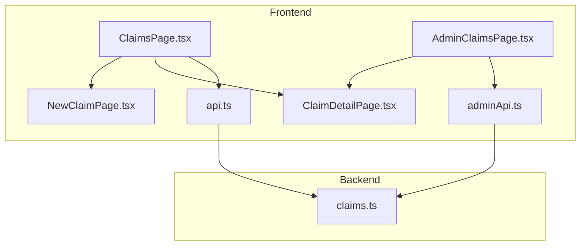
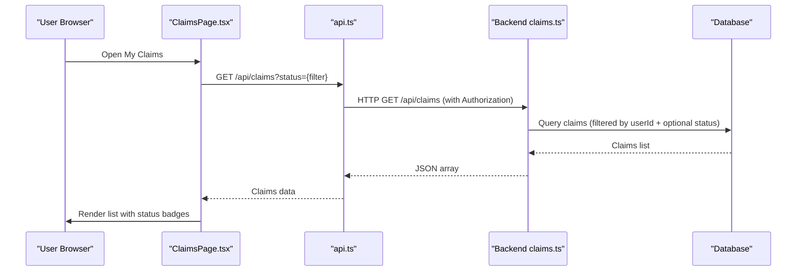
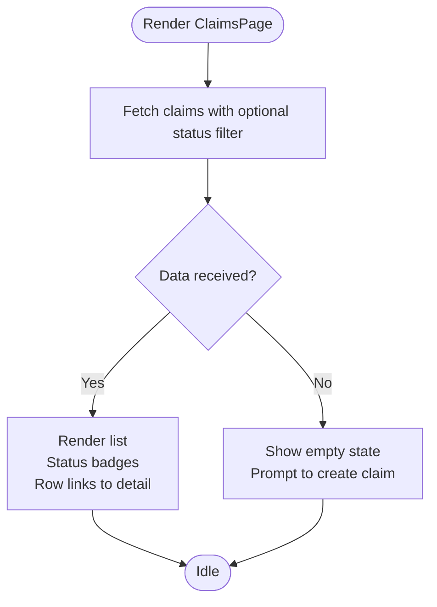
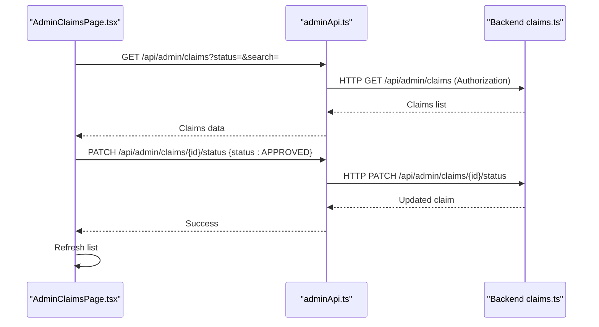
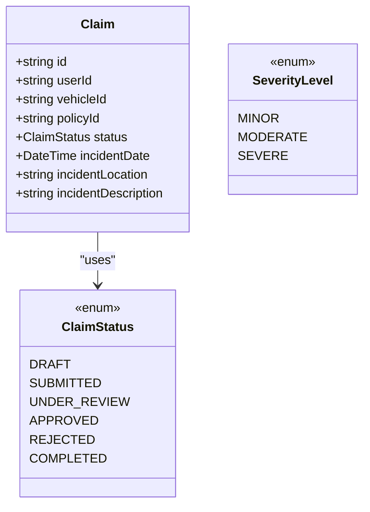
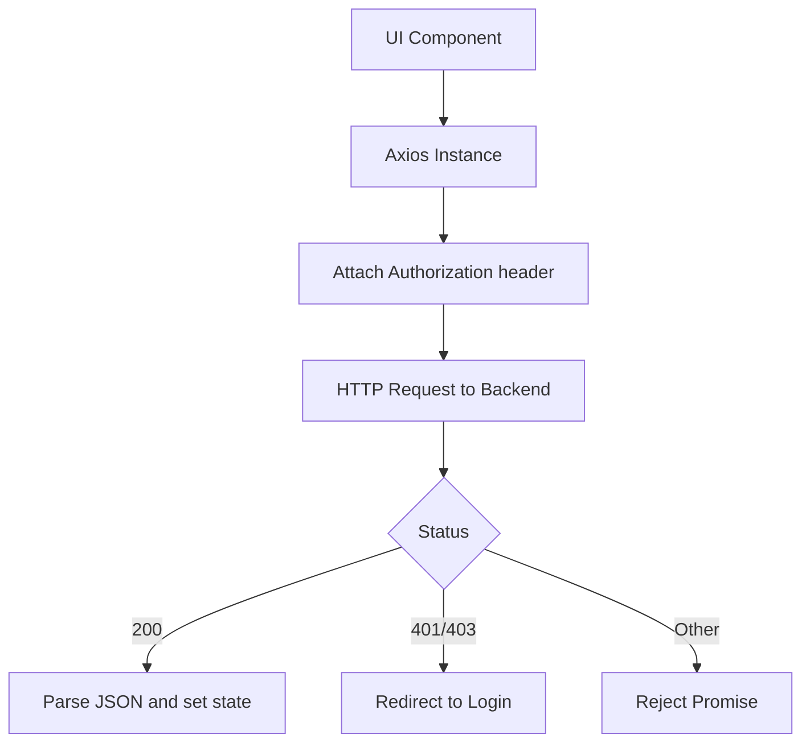
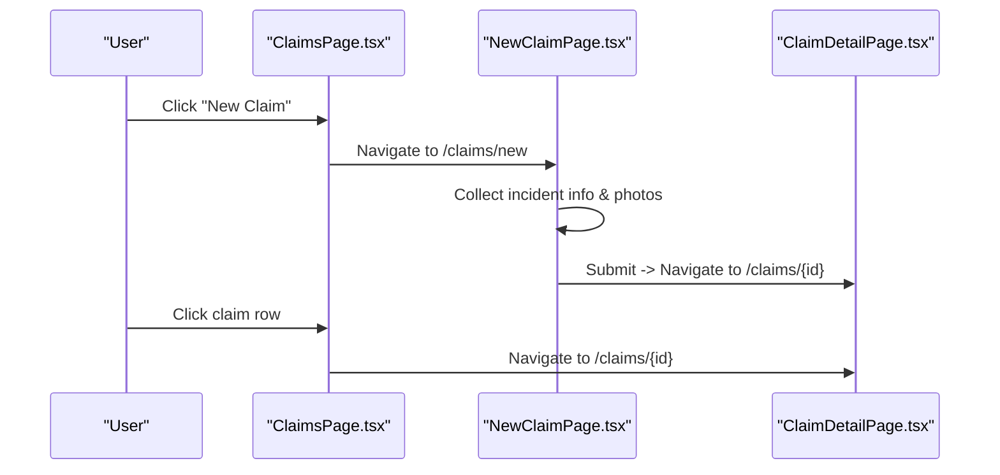
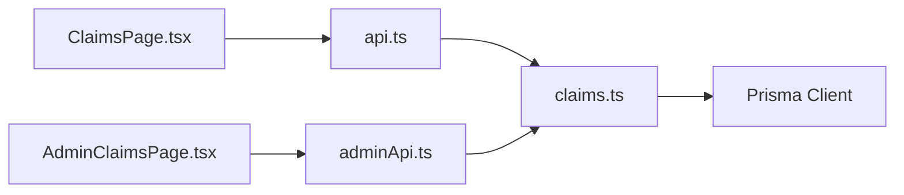

# Claims Listing Page

<cite>
**Referenced Files in This Document**
- [ClaimsPage.tsx](file://frontend/src/pages/ClaimsPage.tsx)
- [AdminClaimsPage.tsx](file://frontend/src/pages/admin/AdminClaimsPage.tsx)
- [api.ts](file://frontend/src/services/api.ts)
- [adminApi.ts](file://frontend/src/services/adminApi.ts)
- [claims.ts](file://backend/src/routes/claims.ts)
- [ClaimDetailPage.tsx](file://frontend/src/pages/ClaimDetailPage.tsx)
- [NewClaimPage.tsx](file://frontend/src/pages/NewClaimPage.tsx)
- [index.ts (types)](file://frontend/src/types/index.ts)
- [schema.prisma](file://backend/prisma/schema.prisma)
</cite>

## Table of Contents
1. [Introduction](#introduction)
2. [Project Structure](#project-structure)
3. [Core Components](#core-components)
4. [Architecture Overview](#architecture-overview)
5. [Detailed Component Analysis](#detailed-component-analysis)
6. [Dependency Analysis](#dependency-analysis)
7. [Performance Considerations](#performance-considerations)
8. [Troubleshooting Guide](#troubleshooting-guide)
9. [Conclusion](#conclusion)

## Introduction
This document explains the Claims listing interface for end users and administrators, focusing on how claims are displayed, filtered, searched, and navigated to details or creation workflows. It covers status indicators with color-coded badges, data fetching strategies, error handling, empty states, pagination considerations, bulk operations, and quick actions.

## Project Structure
The claims feature spans frontend pages, API services, backend routes, and shared types:
- User-facing claim list: ClaimsPage.tsx
- Admin claim list: AdminClaimsPage.tsx
- API clients: api.ts (user), adminApi.ts (admin)
- Backend endpoints: claims.ts
- Detail and creation flows: ClaimDetailPage.tsx, NewClaimPage.tsx
- Types and schema: index.ts (types), schema.prisma

**Diagram sources**
- [ClaimsPage.tsx:1-98](file://frontend/src/pages/ClaimsPage.tsx#L1-L98)
- [AdminClaimsPage.tsx:1-128](file://frontend/src/pages/admin/AdminClaimsPage.tsx#L1-L128)
- [api.ts:1-40](file://frontend/src/services/api.ts#L1-L40)
- [adminApi.ts:1-28](file://frontend/src/services/adminApi.ts#L1-L28)
- [claims.ts:59-83](file://backend/src/routes/claims.ts#L59-L83)

**Section sources**
- [ClaimsPage.tsx:1-98](file://frontend/src/pages/ClaimsPage.tsx#L1-L98)
- [AdminClaimsPage.tsx:1-128](file://frontend/src/pages/admin/AdminClaimsPage.tsx#L1-L128)
- [api.ts:1-40](file://frontend/src/services/api.ts#L1-L40)
- [adminApi.ts:1-28](file://frontend/src/services/adminApi.ts#L1-L28)
- [claims.ts:59-83](file://backend/src/routes/claims.ts#L59-L83)

## Core Components
- User Claims List: Displays user’s claims with status filter, empty state, and navigation to detail or new claim.
- Admin Claims List: Provides search by text, status filters, per-row approve action, and navigation to admin detail view.
- Data Fetching: Uses axios-based clients that attach auth tokens and handle 401/403 redirects.
- Backend Endpoints: GET /api/claims supports filtering by status; GET /api/admin/claims supports status and search via query parameters.

Key behaviors:
- Status filter dropdown in user list triggers a GET request with status query parameter.
- Admin list includes a search input and status buttons; both update query params and reload data.
- Color-coded status badges reflect current claim status.
- Empty state shows guidance to create a new claim when no results exist.

**Section sources**
- [ClaimsPage.tsx:22-98](file://frontend/src/pages/ClaimsPage.tsx#L22-L98)
- [AdminClaimsPage.tsx:16-128](file://frontend/src/pages/admin/AdminClaimsPage.tsx#L16-L128)
- [api.ts:11-37](file://frontend/src/services/api.ts#L11-L37)
- [adminApi.ts:7-25](file://frontend/src/services/adminApi.ts#L7-L25)
- [claims.ts:59-83](file://backend/src/routes/claims.ts#L59-L83)

## Architecture Overview
End-to-end flow from UI to backend and back:

**Diagram sources**
- [ClaimsPage.tsx:27-30](file://frontend/src/pages/ClaimsPage.tsx#L27-L30)
- [api.ts:11-24](file://frontend/src/services/api.ts#L11-L24)
- [claims.ts:59-83](file://backend/src/routes/claims.ts#L59-L83)

## Detailed Component Analysis

### User Claims Listing (ClaimsPage)
- Filtering: Dropdown selects one of the statuses (DRAFT, SUBMITTED, UNDER_REVIEW, APPROVED, REJECTED, COMPLETED). When changed, it re-fetches claims with the selected status.
- Sorting: Backend orders by createdAt descending; no client-side sorting is implemented.
- Search: Not implemented in this page.
- Status Indicators: Color-coded badges map each status to a distinct background/text style.
- Empty State: Shows an illustration and prompt to start a new claim when the list is empty.
- Navigation: Each row links to the claim detail page; “New Claim” links to the creation wizard.
- Error Handling: On fetch failure, loading is cleared without crashing; no explicit user message is shown.

**Diagram sources**
- [ClaimsPage.tsx:27-30](file://frontend/src/pages/ClaimsPage.tsx#L27-L30)
- [ClaimsPage.tsx:55-62](file://frontend/src/pages/ClaimsPage.tsx#L55-L62)
- [ClaimsPage.tsx:63-94](file://frontend/src/pages/ClaimsPage.tsx#L63-L94)

**Section sources**
- [ClaimsPage.tsx:7-14](file://frontend/src/pages/ClaimsPage.tsx#L7-L14)
- [ClaimsPage.tsx:22-98](file://frontend/src/pages/ClaimsPage.tsx#L22-L98)
- [claims.ts:59-83](file://backend/src/routes/claims.ts#L59-L83)

### Admin Claims Listing (AdminClaimsPage)
- Search: Text input submits a form that adds a search query parameter to the admin endpoint.
- Filters: Buttons toggle status filters; selecting ALL clears the filter.
- Bulk Operations: No multi-select bulk actions are implemented.
- Quick Actions: Per-row “Approve” button updates status to APPROVED; disabled if already approved or while approving.
- Pagination: Not implemented; all matching claims are rendered.
- Error Handling: Approve operation catches errors and alerts the user; loading states manage spinner during approval.

**Diagram sources**
- [AdminClaimsPage.tsx:23-41](file://frontend/src/pages/admin/AdminClaimsPage.tsx#L23-L41)
- [adminApi.ts:7-25](file://frontend/src/services/adminApi.ts#L7-L25)

**Section sources**
- [AdminClaimsPage.tsx:6-14](file://frontend/src/pages/admin/AdminClaimsPage.tsx#L6-L14)
- [AdminClaimsPage.tsx:16-128](file://frontend/src/pages/admin/AdminClaimsPage.tsx#L16-L128)

### Data Models and Status Mapping
- Claim statuses: DRAFT, SUBMITTED, UNDER_REVIEW, APPROVED, REJECTED, COMPLETED.
- Severity levels: MINOR, MODERATE, SEVERE.
- These enums and structures are defined in the Prisma schema and mirrored in frontend types.

**Diagram sources**
- [schema.prisma:62-94](file://backend/prisma/schema.prisma#L62-L94)
- [index.ts (types):40-44](file://frontend/src/types/index.ts#L40-L44)

**Section sources**
- [schema.prisma:62-94](file://backend/prisma/schema.prisma#L62-L94)
- [index.ts (types):40-44](file://frontend/src/types/index.ts#L40-L44)

### Data Fetching Strategies
- User claims: GET /api/claims with optional status query param; returns claims with related vehicle, damage assessment severity, and counts for images/documents.
- Admin claims: GET /api/admin/claims with status and search query params; returns claims with user, vehicle, counts, and related entities.
- Auth: Both clients attach Bearer tokens from localStorage; 401/403 responses redirect to login pages.

**Diagram sources**
- [api.ts:11-37](file://frontend/src/services/api.ts#L11-L37)
- [adminApi.ts:7-25](file://frontend/src/services/adminApi.ts#L7-L25)

**Section sources**
- [api.ts:1-40](file://frontend/src/services/api.ts#L1-L40)
- [adminApi.ts:1-28](file://frontend/src/services/adminApi.ts#L1-L28)
- [claims.ts:59-83](file://backend/src/routes/claims.ts#L59-L83)

### Error Handling and Empty States
- User Claims Page: On network or server error, loading state is cleared; no toast or alert is shown. Empty list renders a friendly empty state with a link to create a new claim.
- Admin Claims Page: Approve action shows an alert on failure; loading indicator is used during approval. Empty table displays a simple message.

**Section sources**
- [ClaimsPage.tsx:27-32](file://frontend/src/pages/ClaimsPage.tsx#L27-L32)
- [ClaimsPage.tsx:55-62](file://frontend/src/pages/ClaimsPage.tsx#L55-L62)
- [AdminClaimsPage.tsx:34-41](file://frontend/src/pages/admin/AdminClaimsPage.tsx#L34-L41)
- [AdminClaimsPage.tsx:123-124](file://frontend/src/pages/admin/AdminClaimsPage.tsx#L123-L124)

### Navigation Flow to Details and Creation
- From the user claims list, clicking a claim row navigates to the claim detail page.
- The “New Claim” button navigates to the creation wizard, which collects incident info, photos, and submits the claim, then redirects to the detail page.

**Diagram sources**
- [ClaimsPage.tsx:49-51](file://frontend/src/pages/ClaimsPage.tsx#L49-L51)
- [ClaimsPage.tsx:65-66](file://frontend/src/pages/ClaimsPage.tsx#L65-L66)
- [NewClaimPage.tsx:72-94](file://frontend/src/pages/NewClaimPage.tsx#L72-L94)
- [ClaimDetailPage.tsx:17-25](file://frontend/src/pages/ClaimDetailPage.tsx#L17-L25)

**Section sources**
- [ClaimsPage.tsx:49-66](file://frontend/src/pages/ClaimsPage.tsx#L49-L66)
- [NewClaimPage.tsx:72-94](file://frontend/src/pages/NewClaimPage.tsx#L72-L94)
- [ClaimDetailPage.tsx:17-25](file://frontend/src/pages/ClaimDetailPage.tsx#L17-L25)

## Dependency Analysis
- Frontend components depend on their respective API clients for data and mutations.
- API clients depend on environment configuration for base URLs and interceptors for authentication and redirects.
- Backend routes depend on Prisma for data access and middleware for authentication and file uploads.

**Diagram sources**
- [ClaimsPage.tsx:1-4](file://frontend/src/pages/ClaimsPage.tsx#L1-L4)
- [AdminClaimsPage.tsx:1-4](file://frontend/src/pages/admin/AdminClaimsPage.tsx#L1-L4)
- [api.ts:1-9](file://frontend/src/services/api.ts#L1-L9)
- [adminApi.ts:1-5](file://frontend/src/services/adminApi.ts#L1-L5)
- [claims.ts:1-15](file://backend/src/routes/claims.ts#L1-L15)

**Section sources**
- [ClaimsPage.tsx:1-4](file://frontend/src/pages/ClaimsPage.tsx#L1-L4)
- [AdminClaimsPage.tsx:1-4](file://frontend/src/pages/admin/AdminClaimsPage.tsx#L1-L4)
- [api.ts:1-9](file://frontend/src/services/api.ts#L1-L9)
- [adminApi.ts:1-5](file://frontend/src/services/adminApi.ts#L1-L5)
- [claims.ts:1-15](file://backend/src/routes/claims.ts#L1-L15)

## Performance Considerations
- Current implementations do not implement pagination; large datasets could impact rendering and memory usage. Consider adding server-side pagination and infinite scroll or page-based navigation.
- Avoid unnecessary re-renders by memoizing derived lists and using stable keys.
- Debounce search inputs in admin list to reduce frequent requests.
- Use optimistic UI updates for actions like approve to improve perceived performance, followed by refetch to reconcile state.

[No sources needed since this section provides general guidance]

## Troubleshooting Guide
- Authentication failures: If 401/403 occurs, the API clients clear tokens and redirect to login. Ensure tokens are present in localStorage and valid.
- Network errors: For user claims, errors clear loading but do not show messages; consider adding user feedback.
- Approval failures: Admin approve action shows an alert; verify permissions and backend route availability.
- Empty states: Confirm backend returns arrays (possibly empty) and that filters/search are correct.

**Section sources**
- [api.ts:26-37](file://frontend/src/services/api.ts#L26-L37)
- [adminApi.ts:16-25](file://frontend/src/services/adminApi.ts#L16-L25)
- [AdminClaimsPage.tsx:34-41](file://frontend/src/pages/admin/AdminClaimsPage.tsx#L34-L41)

## Conclusion
The Claims listing pages provide a clear, filterable view of claims with color-coded status indicators and straightforward navigation to details and creation workflows. The admin interface adds search and quick approve actions. While robust, there is room to enhance performance and UX through pagination, debounced search, and richer error messaging.

[No sources needed since this section summarizes without analyzing specific files]