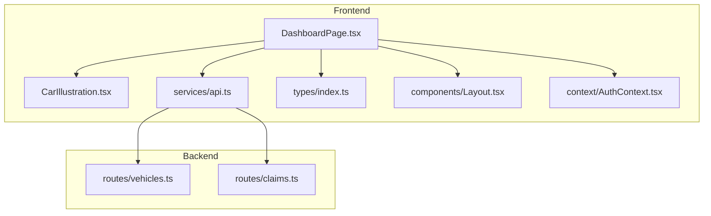
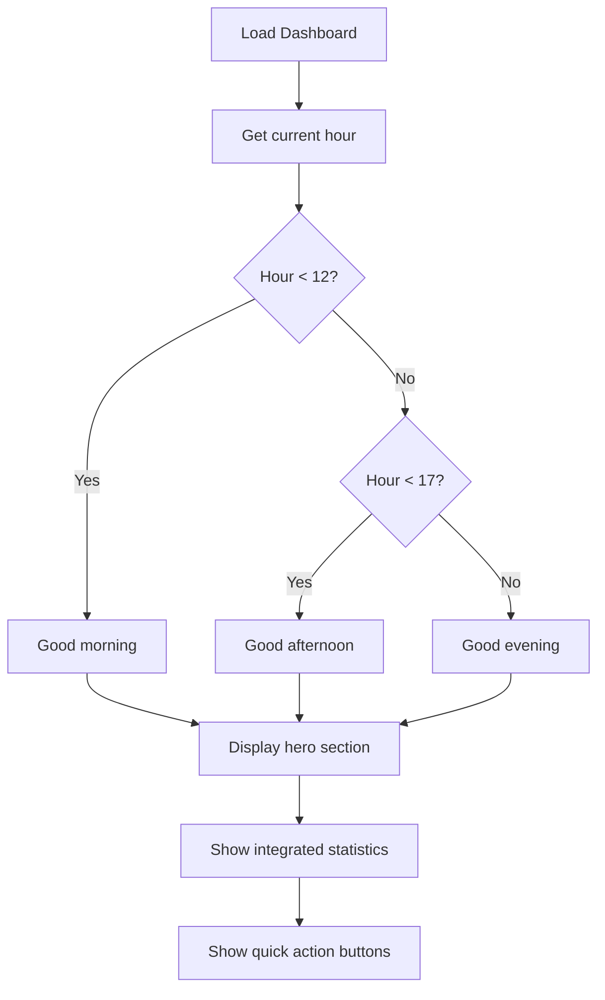
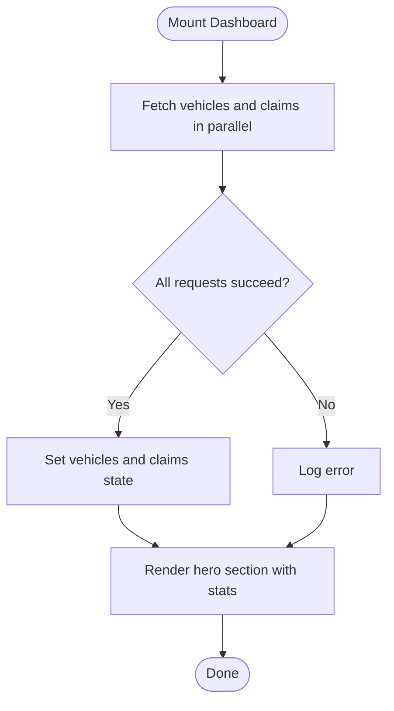
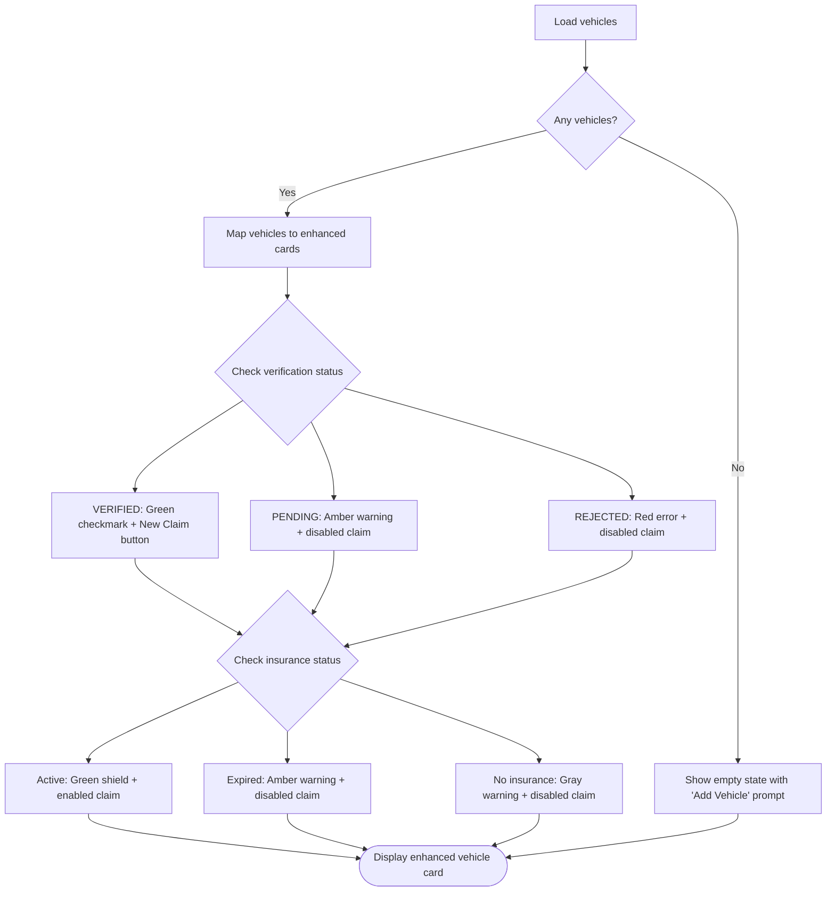
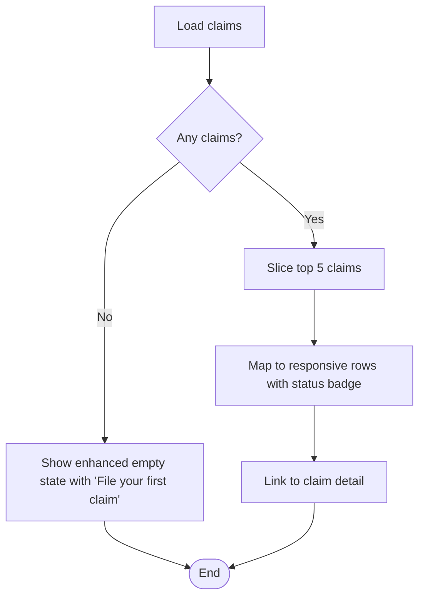
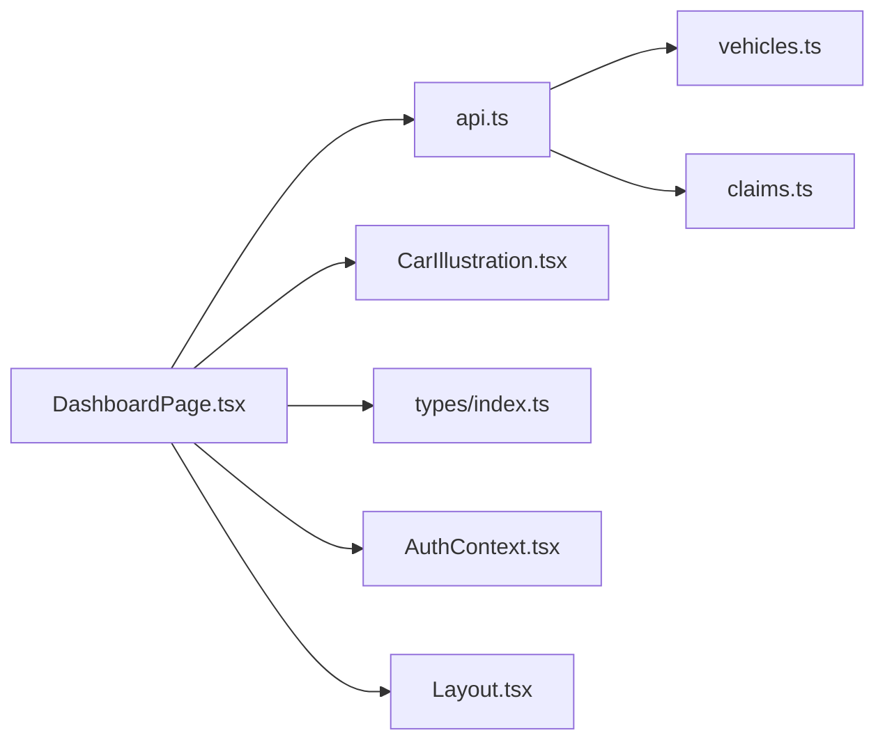

# Dashboard Page

<cite>
**Referenced Files in This Document**
- [DashboardPage.tsx](file://frontend/src/pages/DashboardPage.tsx)
- [CarIllustration.tsx](file://frontend/src/components/CarIllustration.tsx)
- [api.ts](file://frontend/src/services/api.ts)
- [index.ts (types)](file://frontend/src/types/index.ts)
- [Layout.tsx](file://frontend/src/components/Layout.tsx)
- [AuthContext.tsx](file://frontend/src/context/AuthContext.tsx)
- [claims.ts (backend routes)](file://backend/src/routes/claims.ts)
- [vehicles.ts (backend routes)](file://backend/src/routes/vehicles.ts)
</cite>

## Update Summary
**Changes Made**
- Complete Dashboard transformation with new hero section featuring dynamic time-based greetings
- Integrated statistics cards displaying vehicles count, active claims, and total claims in visually appealing gradient banner
- Added floating car illustration animation for enhanced visual appeal
- Improved vehicle cards with hover effects, status indicators, and better call-to-action buttons
- Enhanced responsive design with mobile-first approach and adaptive layouts
- Updated status color coding system with new garage-related states (GARAGE_REVIEW, GARAGE_ESTIMATED)
- Implemented sophisticated loading states and empty state handling

## Table of Contents
1. [Introduction](#introduction)
2. [Project Structure](#project-structure)
3. [Core Components](#core-components)
4. [Architecture Overview](#architecture-overview)
5. [Detailed Component Analysis](#detailed-component-analysis)
6. [Dependency Analysis](#dependency-analysis)
7. [Performance Considerations](#performance-considerations)
8. [Troubleshooting Guide](#troubleshooting-guide)
9. [Conclusion](#conclusion)

## Introduction
The Dashboard page is the authenticated user's landing area, providing a comprehensive overview of their insurance activity with enhanced mobile responsiveness and improved visual design. The completely transformed interface features:

- **Hero Section**: A visually stunning gradient banner with dynamic time-based greetings ("Good morning", "Good afternoon", "Good evening") and personalized welcome messages
- **Integrated Statistics Cards**: Three key metrics (Vehicles, Active Claims, Total Claims) displayed within the hero banner using glassmorphism effects
- **Floating Car Illustration**: Animated SVG car illustration that adds visual appeal and brand consistency
- **Enhanced My Vehicles Section**: Detailed vehicle cards showing insurance status, verification state, and claim availability with hover effects
- **Recent Claims List**: Latest five claims with status indicators and quick navigation links
- **Quick Action Buttons**: Prominent calls-to-action for filing new claims and adding vehicles

Data is fetched in parallel from the backend using Promise.all, with sophisticated loading states, empty state handling, and fully responsive grid layouts that adapt seamlessly across all screen sizes.

## Project Structure
The Dashboard page lives under the frontend pages directory and relies on shared services, types, layout, and authentication context. Backend endpoints for vehicles and claims provide the data used by the dashboard.

**Diagram sources**
- [DashboardPage.tsx:1-262](file://frontend/src/pages/DashboardPage.tsx#L1-L262)
- [CarIllustration.tsx:1-45](file://frontend/src/components/CarIllustration.tsx#L1-L45)
- [api.ts:1-40](file://frontend/src/services/api.ts#L1-L40)
- [index.ts (types):12-204](file://frontend/src/types/index.ts#L12-L204)
- [Layout.tsx:1-188](file://frontend/src/components/Layout.tsx#L1-L188)
- [AuthContext.tsx:1-101](file://frontend/src/context/AuthContext.tsx#L1-L101)
- [vehicles.ts:96-113](file://backend/src/routes/vehicles.ts#L96-L113)
- [claims.ts:91-115](file://backend/src/routes/claims.ts#L91-L115)

**Section sources**
- [DashboardPage.tsx:1-262](file://frontend/src/pages/DashboardPage.tsx#L1-L262)
- [CarIllustration.tsx:1-45](file://frontend/src/components/CarIllustration.tsx#L1-L45)
- [api.ts:1-40](file://frontend/src/services/api.ts#L1-L40)
- [index.ts (types):12-204](file://frontend/src/types/index.ts#L12-L204)
- [Layout.tsx:1-188](file://frontend/src/components/Layout.tsx#L1-L188)
- [AuthContext.tsx:1-101](file://frontend/src/context/AuthContext.tsx#L1-L101)
- [vehicles.ts:96-113](file://backend/src/routes/vehicles.ts#L96-L113)
- [claims.ts:91-115](file://backend/src/routes/claims.ts#L91-L115)

## Core Components
- **Enhanced Hero Section**: Features gradient background with decorative elements, dynamic greeting based on time of day, and integrated statistics cards
- **Advanced Data Fetching**: Uses Promise.all to fetch vehicles and claims in parallel from /api/vehicles and /api/claims with improved error handling
- **Sophisticated State Management**: Tracks vehicles, claims, and loading state with enhanced UI updates when data arrives or errors occur
- **Updated Status Color Coding**: Maps claim statuses to Tailwind classes with new orange (GARAGE_REVIEW) and purple (GARAGE_ESTIMATED) colors for consistent visual indicators
- **Comprehensive My Vehicles Section**: Displays each vehicle with insurance policy details, verification status indicators, and conditional claim filing capabilities
- **Responsive Recent Claims**: Lists up to five most recent claims with vehicle info, incident date/location, and clickable status badges optimized for mobile
- **Improved Quick Actions**: Links to create a new claim and register a new vehicle with enhanced visual hierarchy and touch-friendly sizing
- **Mobile-First Layout Integration**: Renders within the authenticated Layout that provides responsive navigation and user controls

**Section sources**
- [DashboardPage.tsx:44-57](file://frontend/src/pages/DashboardPage.tsx#L44-L57)
- [DashboardPage.tsx:62-115](file://frontend/src/pages/DashboardPage.tsx#L62-L115)
- [DashboardPage.tsx:117-210](file://frontend/src/pages/DashboardPage.tsx#L117-L210)
- [DashboardPage.tsx:212-258](file://frontend/src/pages/DashboardPage.tsx#L212-L258)
- [Layout.tsx:26-188](file://frontend/src/components/Layout.tsx#L26-L188)

## Architecture Overview
The Dashboard orchestrates data retrieval and presentation with enhanced mobile responsiveness and modern UI patterns:
- On mount, it triggers parallel requests to fetch vehicles and claims
- Upon success, it sets state and renders the hero section with statistics, quick actions, and recent claims with responsive layouts
- During loading, it shows a centered spinner animation
- If no claims exist, it displays an enhanced empty state with call-to-action
- Navigation links route to other sections like Claims and Vehicles with improved mobile navigation

**Diagram sources**
- [DashboardPage.tsx:15-29](file://frontend/src/pages/DashboardPage.tsx#L15-L29)
- [api.ts:7-24](file://frontend/src/services/api.ts#L7-L24)
- [vehicles.ts:96-113](file://backend/src/routes/vehicles.ts#L96-L113)
- [claims.ts:91-115](file://backend/src/routes/claims.ts#L91-L115)

## Detailed Component Analysis

### Enhanced Hero Section with Dynamic Greetings
**New Feature** - The dashboard now features a stunning hero section that provides immediate value and personalization:

- **Dynamic Time-Based Greetings**: Automatically detects current hour and displays appropriate greeting ("Good morning", "Good afternoon", "Good evening")
- **Personalized Welcome Message**: Greets users by their first name with contextual messaging about their insurance overview
- **Gradient Background Design**: Uses `bg-gradient-to-br from-primary-800 via-primary-600 to-primary-400` with decorative blur effects and dot patterns
- **Integrated Statistics Cards**: Three key metrics displayed directly in the hero section:
  - Vehicle count with car icon
  - Active claims count with clipboard icon  
  - Total claims count with lightning bolt icon
- **Floating Car Illustration**: Animated SVG car illustration positioned on the right side with subtle opacity and float animation
- **Quick Action Buttons**: Two prominent action buttons for filing new claims and adding vehicles with distinct visual styling

**Diagram sources**
- [DashboardPage.tsx:44-49](file://frontend/src/pages/DashboardPage.tsx#L44-L49)
- [DashboardPage.tsx:62-115](file://frontend/src/pages/DashboardPage.tsx#L62-L115)

**Section sources**
- [DashboardPage.tsx:44-49](file://frontend/src/pages/DashboardPage.tsx#L44-L49)
- [DashboardPage.tsx:62-115](file://frontend/src/pages/DashboardPage.tsx#L62-L115)

### Enhanced Data Fetching and Loading States
- **Parallel Fetching**: Uses Promise.all to request both vehicles and claims concurrently for faster load times
- **Improved Error Handling**: Catches and logs failures; ensures loading state is cleared via finally block
- **Enhanced Spinner**: Shows a centered spinner with primary color border while data is being fetched

**Diagram sources**
- [DashboardPage.tsx:15-29](file://frontend/src/pages/DashboardPage.tsx#L15-L29)
- [DashboardPage.tsx:51-57](file://frontend/src/pages/DashboardPage.tsx#L51-L57)

**Section sources**
- [DashboardPage.tsx:15-29](file://frontend/src/pages/DashboardPage.tsx#L15-L29)
- [DashboardPage.tsx:51-57](file://frontend/src/pages/DashboardPage.tsx#L51-L57)

### Comprehensive My Vehicles Section
**Enhanced Feature** - The vehicle management section provides detailed information about each registered vehicle with improved visual design:

- **Enhanced Vehicle Cards**: Each vehicle is displayed in a card format with hover effects (`hover:-translate-y-0.5 hover:border-primary-100 hover:shadow-lg`)
- **Visual Status Indicators**: 
  - Green checkmark for VERIFIED vehicles
  - Amber warning for PENDING verification  
  - Red error for REJECTED vehicles
- **Insurance Policy Display**: Shows current insurance status with:
  - Active insurance (green shield icon)
  - Expired insurance (amber warning triangle)
  - No insurance (gray warning triangle)
- **Policy Number Display**: Shows the associated policy number when available
- **Conditional Claim Filing**: 
  - Active "New Claim" button only for verified vehicles with gradient styling
  - Disabled "Claim Unavailable" state for unverified vehicles with tooltip explanation
- **Responsive Grid Layout**: Uses `grid-cols-1 sm:grid-cols-2` for optimal display across screen sizes
- **Empty State Handling**: When no vehicles exist, shows helpful message with prominent "Add your first vehicle" button

**Diagram sources**
- [DashboardPage.tsx:117-210](file://frontend/src/pages/DashboardPage.tsx#L117-L210)
- [vehicles.ts:96-113](file://backend/src/routes/vehicles.ts#L96-L113)

**Section sources**
- [DashboardPage.tsx:117-210](file://frontend/src/pages/DashboardPage.tsx#L117-L210)
- [vehicles.ts:96-113](file://backend/src/routes/vehicles.ts#L96-L113)

### Responsive Statistics Cards
- **Vehicle Count**: Displays the length of the vehicles array with responsive typography
- **Active Claims**: Counts claims whose status is not COMPLETED or REJECTED with mobile-optimized layout
- **Total Claims**: Displays the length of the claims array with consistent styling
- **Enhanced Grid Layout**: Uses responsive Tailwind grid (`grid-cols-3` with `sm:gap-4`) to adapt across screen sizes
- **Glassmorphism Effect**: Cards use `bg-white/10 backdrop-blur` for modern visual appearance

**Section sources**
- [DashboardPage.tsx:97-113](file://frontend/src/pages/DashboardPage.tsx#L97-L113)

### Enhanced Recent Claims Section
- **Responsive List**: Lists up to five most recent claims, ordered by creation time on the backend
- **Mobile-Optimized Items**: Each item shows vehicle make/model/year, incident date and location, and status badge with responsive sizing
- **Touch-Friendly Navigation**: Clicking a claim navigates to its detail page with improved tap targets
- **Improved Empty State**: When there are no claims, shows an icon, message, and prominent link to file the first claim
- **Hover Effects**: Interactive rows with subtle background changes on hover

**Diagram sources**
- [DashboardPage.tsx:212-258](file://frontend/src/pages/DashboardPage.tsx#L212-L258)
- [claims.ts:91-115](file://backend/src/routes/claims.ts#L91-L115)

**Section sources**
- [DashboardPage.tsx:212-258](file://frontend/src/pages/DashboardPage.tsx#L212-L258)
- [claims.ts:91-115](file://backend/src/routes/claims.ts#L91-L115)

### Improved Quick Action Buttons
- **File New Claim**: Primary action with white background and gradient text, prominently placed in hero section
- **Add Vehicle**: Secondary action with transparent background and border styling for clear visual hierarchy
- **Enhanced Design**: Styled as prominent buttons with icons, descriptions, and improved hover states for better user interaction

**Section sources**
- [DashboardPage.tsx:80-89](file://frontend/src/pages/DashboardPage.tsx#L80-L89)

### Updated Status Color Coding System
- **Enhanced Status Mapping**: Maps each claim status to distinct background/text color combinations for readability
- **New Status Colors**: Includes orange for GARAGE_REVIEW (`bg-orange-100 text-orange-700`) and purple for GARAGE_ESTIMATED (`bg-purple-100 text-purple-700`)
- **Fallback Styling**: Maintains fallback styling for unknown statuses to ensure consistent appearance

**Section sources**
- [DashboardPage.tsx:31-40](file://frontend/src/pages/DashboardPage.tsx#L31-L40)

### Floating Car Illustration Component
**New Component** - A dedicated SVG illustration component that enhances visual appeal:

- **Custom SVG Design**: Hand-crafted car illustration with road, motion lines, body, windows, lights, and wheels
- **Brand Consistency**: Uses white fill with blue-tinted windows and yellow/red accents for brand alignment
- **Animation Support**: Positioned with `animate-float` class for subtle floating animation effect
- **Responsive Scaling**: Accepts className prop for flexible sizing and positioning
- **Accessibility**: Includes proper role and aria-label attributes for screen readers

**Section sources**
- [CarIllustration.tsx:1-45](file://frontend/src/components/CarIllustration.tsx#L1-L45)
- [DashboardPage.tsx:92-94](file://frontend/src/pages/DashboardPage.tsx#L92-L94)

### Mobile-First Navigation Integration
- **Responsive Layout**: The Dashboard renders inside the Layout component which provides:
  - Desktop sidebar navigation linking to Dashboard, Vehicles, Claims, Policies, Profile
  - Mobile header with hamburger menu and bottom navigation bar
  - User profile section and logout functionality
- **Touch-Optimized Links**: Links from the Dashboard navigate to other app sections seamlessly with improved mobile touch targets

**Section sources**
- [Layout.tsx:26-188](file://frontend/src/components/Layout.tsx#L26-L188)

### Authentication and API Interceptors
- **Authenticated Access**: All dashboard endpoints require authentication with enhanced security
- **Token Injection**: The API client automatically attaches Bearer tokens from localStorage
- **Enhanced 401 Handling**: Unauthorized responses clear session and redirect to login with improved user feedback

**Section sources**
- [AuthContext.tsx:17-36](file://frontend/src/context/AuthContext.tsx#L17-L36)
- [api.ts:11-24](file://frontend/src/services/api.ts#L11-L24)
- [api.ts:26-37](file://frontend/src/services/api.ts#L26-L37)

## Dependency Analysis
The Dashboard depends on several modules and backend endpoints with enhanced mobile support:

**Diagram sources**
- [DashboardPage.tsx:1-262](file://frontend/src/pages/DashboardPage.tsx#L1-L262)
- [CarIllustration.tsx:1-45](file://frontend/src/components/CarIllustration.tsx#L1-L45)
- [api.ts:1-40](file://frontend/src/services/api.ts#L1-L40)
- [index.ts (types):12-204](file://frontend/src/types/index.ts#L12-L204)
- [AuthContext.tsx:1-101](file://frontend/src/context/AuthContext.tsx#L1-L101)
- [Layout.tsx:1-188](file://frontend/src/components/Layout.tsx#L1-L188)
- [vehicles.ts:96-113](file://backend/src/routes/vehicles.ts#L96-L113)
- [claims.ts:91-115](file://backend/src/routes/claims.ts#L91-L115)

**Section sources**
- [DashboardPage.tsx:1-262](file://frontend/src/pages/DashboardPage.tsx#L1-L262)
- [CarIllustration.tsx:1-45](file://frontend/src/components/CarIllustration.tsx#L1-L45)
- [api.ts:1-40](file://frontend/src/services/api.ts#L1-L40)
- [index.ts (types):12-204](file://frontend/src/types/index.ts#L12-L204)
- [AuthContext.tsx:1-101](file://frontend/src/context/AuthContext.tsx#L1-L101)
- [Layout.tsx:1-188](file://frontend/src/components/Layout.tsx#L1-L188)
- [vehicles.ts:96-113](file://backend/src/routes/vehicles.ts#L96-L113)
- [claims.ts:91-115](file://backend/src/routes/claims.ts#L91-L115)

## Performance Considerations
- **Parallel Requests**: Using Promise.all reduces overall latency by fetching vehicles and claims concurrently
- **Minimal Rendering**: Only essential fields are displayed to keep the UI lightweight and responsive
- **Mobile Optimization**: Responsive design ensures optimal performance across all device sizes
- **Pagination Consideration**: For large datasets, consider pagination or virtualization for the claims list
- **Caching Strategy**: Consider caching strategies (e.g., React Query or SWR) to avoid redundant network calls on re-renders
- **Image Optimization**: Ensure vehicle images and thumbnails are optimized if added later
- **Vehicle Card Efficiency**: Vehicle cards are optimized to minimize re-renders and use efficient conditional rendering
- **SVG Performance**: The car illustration uses inline SVG for optimal rendering performance
- **CSS Animations**: Uses hardware-accelerated CSS animations for smooth floating effects

## Troubleshooting Guide
- **No Data Shown**: Check browser console for errors; verify that both /api/vehicles and /api/claims return arrays
- **Unauthorized Redirects**: If redirected to login, ensure token exists and is valid; the API interceptor clears invalid sessions
- **Incorrect Status Colors**: Verify claim status values match expected enum values; enhanced fallback styling applies for unknown statuses
- **Empty State Appears Unexpectedly**: Confirm backend returns at least one claim; check ordering and filters
- **Mobile Display Issues**: Test on various screen sizes to ensure responsive layout works correctly
- **Vehicle Verification Issues**: Ensure vehicles have proper verification status; check backend verification workflow
- **Insurance Policy Problems**: Verify insurance policies are properly linked to vehicles and have valid dates
- **Claim Filing Restrictions**: Check that vehicles are verified before attempting to file claims
- **Hero Section Not Displaying**: Verify gradient CSS classes are available and user data is loaded
- **Car Illustration Issues**: Check SVG rendering and animation classes are properly applied

**Section sources**
- [api.ts:26-37](file://frontend/src/services/api.ts#L26-L37)
- [DashboardPage.tsx:15-29](file://frontend/src/pages/DashboardPage.tsx#L15-L29)
- [DashboardPage.tsx:31-40](file://frontend/src/pages/DashboardPage.tsx#L31-L40)
- [DashboardPage.tsx:117-210](file://frontend/src/pages/DashboardPage.tsx#L117-L210)
- [DashboardPage.tsx:212-258](file://frontend/src/pages/DashboardPage.tsx#L212-L258)

## Conclusion
The Dashboard page delivers a comprehensive, mobile-responsive overview of a user's vehicles and claims with significantly enhanced visual design and improved user experience. The completely transformed interface features a stunning hero section with dynamic time-based greetings, integrated statistics cards, and a floating car illustration that creates an engaging first impression. The enhanced vehicle management section provides detailed vehicle information with clear visual indicators for insurance status, verification state, and claim availability. It leverages parallel data fetching, robust loading and empty states, updated status visualization with new garage-related colors, and seamless navigation integration. The modern design patterns including glassmorphism effects, gradient backgrounds, and hover animations create a professional and polished user interface that scales beautifully across all device sizes while maintaining excellent performance and accessibility standards.