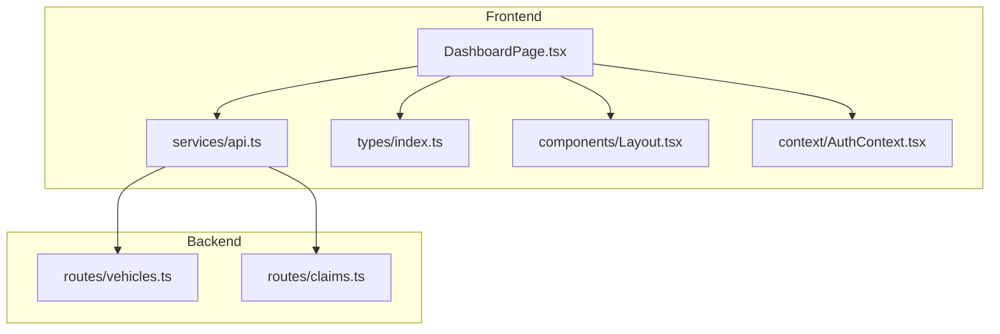
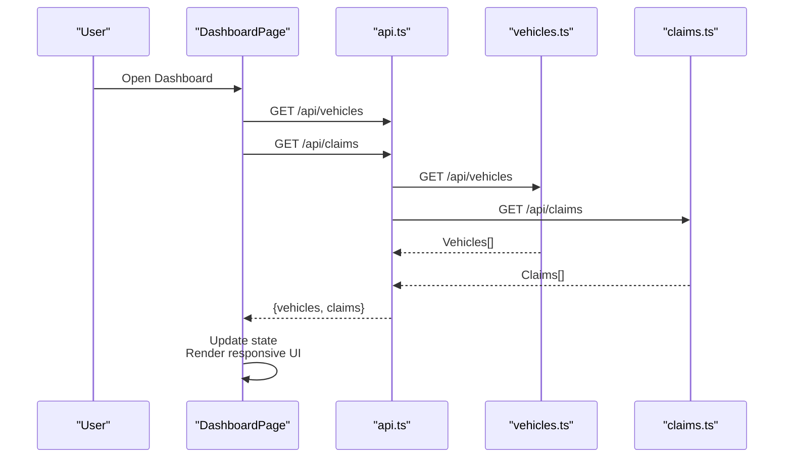
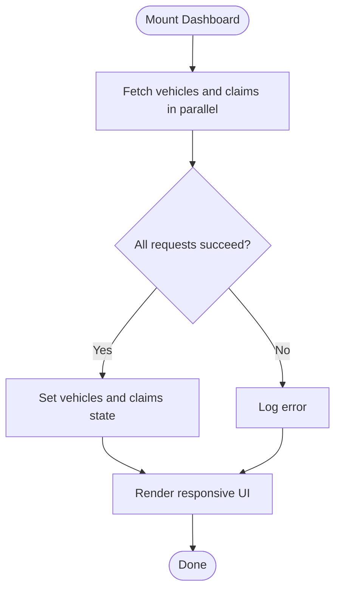
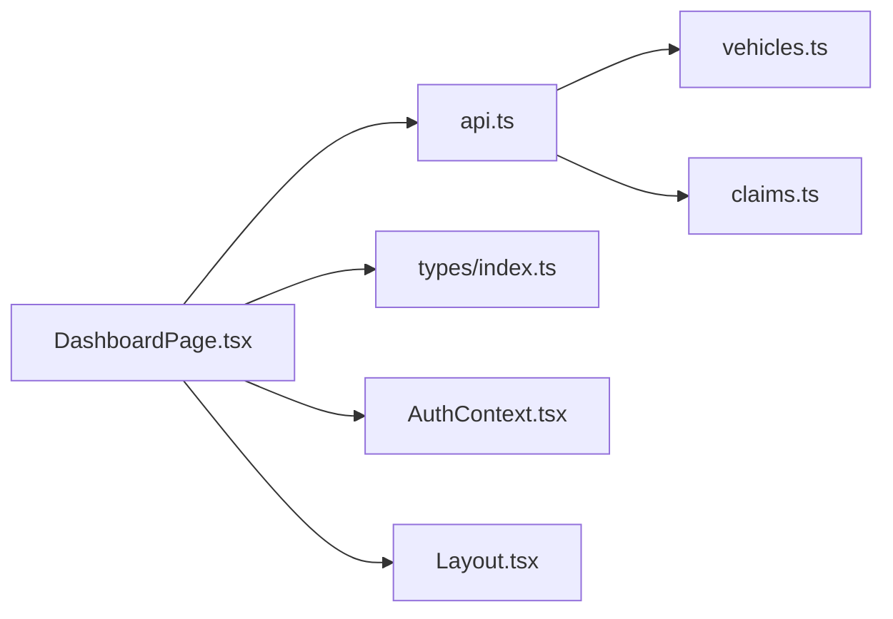

# Dashboard Page

<cite>
**Referenced Files in This Document**
- [DashboardPage.tsx](file://frontend/src/pages/DashboardPage.tsx)
- [api.ts](file://frontend/src/services/api.ts)
- [index.ts (types)](file://frontend/src/types/index.ts)
- [Layout.tsx](file://frontend/src/components/Layout.tsx)
- [AuthContext.tsx](file://frontend/src/context/AuthContext.tsx)
- [claims.ts (backend routes)](file://backend/src/routes/claims.ts)
- [vehicles.ts (backend routes)](file://backend/src/routes/vehicles.ts)
</cite>

## Update Summary
**Changes Made**
- Updated status color coding system with new GARAGE_REVIEW (orange) and GARAGE_ESTIMATED (purple) statuses
- Enhanced mobile responsiveness with improved responsive typography and spacing
- Improved visual consistency across all dashboard components
- Updated grid layouts for better mobile experience
- Enhanced loading states with spinner animations
- Refined empty state handling with better user guidance

## Table of Contents
1. [Introduction](#introduction)
2. [Project Structure](#project-structure)
3. [Core Components](#core-components)
4. [Architecture Overview](#architecture-overview)
5. [Detailed Component Analysis](#detailed-component-analysis)
6. [Dependency Analysis](#dependency-analysis)
7. [Performance Considerations](#performance-considerations)
8. [Troubleshooting Guide](#troubleshooting-guide)
9. [Conclusion](#conclusion)

## Introduction
The Dashboard page is the authenticated user's landing area, providing a comprehensive overview of their insurance activity with enhanced mobile responsiveness and improved visual design. It displays:
- Statistics cards for vehicle count, active claims, and total claims with real-time data fetching
- A recent claims list showing the latest five claims with enhanced status indicators and navigation links
- Quick action buttons to file new claims or add vehicles with improved visual hierarchy

Data is fetched in parallel from the backend using Promise.all, with sophisticated loading states, empty state handling, and fully responsive grid layouts that adapt seamlessly across all screen sizes.

## Project Structure
The Dashboard page lives under the frontend pages directory and relies on shared services, types, layout, and authentication context. Backend endpoints for vehicles and claims provide the data used by the dashboard.

**Diagram sources**
- [DashboardPage.tsx:1-144](file://frontend/src/pages/DashboardPage.tsx#L1-L144)
- [api.ts:1-40](file://frontend/src/services/api.ts#L1-L40)
- [index.ts (types):12-204](file://frontend/src/types/index.ts#L12-L204)
- [Layout.tsx:1-180](file://frontend/src/components/Layout.tsx#L1-L180)
- [AuthContext.tsx:1-82](file://frontend/src/context/AuthContext.tsx#L1-L82)
- [vehicles.ts:65-81](file://backend/src/routes/vehicles.ts#L65-L81)
- [claims.ts:78-102](file://backend/src/routes/claims.ts#L78-L102)

**Section sources**
- [DashboardPage.tsx:1-144](file://frontend/src/pages/DashboardPage.tsx#L1-L144)
- [api.ts:1-40](file://frontend/src/services/api.ts#L1-L40)
- [index.ts (types):12-204](file://frontend/src/types/index.ts#L12-L204)
- [Layout.tsx:1-180](file://frontend/src/components/Layout.tsx#L1-L180)
- [AuthContext.tsx:1-82](file://frontend/src/context/AuthContext.tsx#L1-L82)
- [vehicles.ts:65-81](file://backend/src/routes/vehicles.ts#L65-L81)
- [claims.ts:78-102](file://backend/src/routes/claims.ts#L78-L102)

## Core Components
- **Enhanced Data Fetching**: Uses Promise.all to fetch vehicles and claims in parallel from /api/vehicles and /api/claims with improved error handling
- **Advanced State Management**: Tracks vehicles, claims, and loading state with sophisticated UI updates when data arrives or errors occur
- **Updated Status Color Coding**: Maps claim statuses to Tailwind classes with new orange (GARAGE_REVIEW) and purple (GARAGE_ESTIMATED) colors for consistent visual indicators
- **Responsive Recent Claims**: Displays up to five most recent claims with vehicle info, incident date/location, and clickable status badges optimized for mobile
- **Improved Quick Actions**: Links to create a new claim and register a new vehicle with enhanced visual hierarchy and touch-friendly sizing
- **Mobile-First Layout Integration**: Renders within the authenticated Layout that provides responsive navigation and user controls

**Section sources**
- [DashboardPage.tsx:14-27](file://frontend/src/pages/DashboardPage.tsx#L14-L27)
- [DashboardPage.tsx:29-38](file://frontend/src/pages/DashboardPage.tsx#L29-L38)
- [DashboardPage.tsx:48-141](file://frontend/src/pages/DashboardPage.tsx#L48-L141)
- [Layout.tsx:26-180](file://frontend/src/components/Layout.tsx#L26-L180)

## Architecture Overview
The Dashboard orchestrates data retrieval and presentation with enhanced mobile responsiveness:
- On mount, it triggers parallel requests to fetch vehicles and claims
- Upon success, it sets state and renders stats, quick actions, and recent claims with responsive layouts
- During loading, it shows a centered spinner animation
- If no claims exist, it displays an enhanced empty state with call-to-action
- Navigation links route to other sections like Claims and Vehicles with improved mobile navigation

**Diagram sources**
- [DashboardPage.tsx:14-27](file://frontend/src/pages/DashboardPage.tsx#L14-L27)
- [api.ts:7-24](file://frontend/src/services/api.ts#L7-L24)
- [vehicles.ts:65-81](file://backend/src/routes/vehicles.ts#L65-L81)
- [claims.ts:78-102](file://backend/src/routes/claims.ts#L78-L102)

## Detailed Component Analysis

### Enhanced Data Fetching and Loading States
- **Parallel Fetching**: Uses Promise.all to request both vehicles and claims concurrently for faster load times
- **Improved Error Handling**: Catches and logs failures; ensures loading state is cleared via finally block
- **Enhanced Spinner**: Shows a centered spinner with primary color border while data is being fetched

**Diagram sources**
- [DashboardPage.tsx:14-27](file://frontend/src/pages/DashboardPage.tsx#L14-L27)
- [DashboardPage.tsx:40-46](file://frontend/src/pages/DashboardPage.tsx#L40-L46)

**Section sources**
- [DashboardPage.tsx:14-27](file://frontend/src/pages/DashboardPage.tsx#L14-L27)
- [DashboardPage.tsx:40-46](file://frontend/src/pages/DashboardPage.tsx#L40-L46)

### Responsive Statistics Cards
- **Vehicle Count**: Displays the length of the vehicles array with responsive typography
- **Active Claims**: Counts claims whose status is not COMPLETED or REJECTED with mobile-optimized layout
- **Total Claims**: Displays the length of the claims array with consistent styling
- **Enhanced Grid Layout**: Uses responsive Tailwind grid (`grid-cols-3` with `sm:gap-4`) to adapt across screen sizes

**Section sources**
- [DashboardPage.tsx:57-82](file://frontend/src/pages/DashboardPage.tsx#L57-L82)

### Enhanced Recent Claims Section
- **Responsive List**: Lists up to five most recent claims, ordered by creation time on the backend
- **Mobile-Optimized Items**: Each item shows vehicle make/model/year, incident date and location, and status badge with responsive sizing
- **Touch-Friendly Navigation**: Clicking a claim navigates to its detail page with improved tap targets
- **Improved Empty State**: When there are no claims, shows an icon, message, and prominent link to file the first claim

**Diagram sources**
- [DashboardPage.tsx:104-141](file://frontend/src/pages/DashboardPage.tsx#L104-L141)
- [claims.ts:78-102](file://backend/src/routes/claims.ts#L78-L102)

**Section sources**
- [DashboardPage.tsx:104-141](file://frontend/src/pages/DashboardPage.tsx#L104-L141)
- [claims.ts:78-102](file://backend/src/routes/claims.ts#L78-L102)

### Improved Quick Action Buttons
- **File New Claim**: Navigates to the new claim creation page with enhanced visual prominence
- **Add Vehicle**: Navigates to the new vehicle registration page with clear secondary styling
- **Enhanced Design**: Styled as prominent cards with icons, descriptions, and improved hover states for better user interaction

**Section sources**
- [DashboardPage.tsx:84-103](file://frontend/src/pages/DashboardPage.tsx#L84-L103)

### Updated Status Color Coding System
- **Enhanced Status Mapping**: Maps each claim status to distinct background/text color combinations for readability
- **New Status Colors**: Includes orange for GARAGE_REVIEW (`bg-orange-100 text-orange-700`) and purple for GARAGE_ESTIMATED (`bg-purple-100 text-purple-700`)
- **Fallback Styling**: Maintains fallback styling for unknown statuses to ensure consistent appearance

**Section sources**
- [DashboardPage.tsx:29-38](file://frontend/src/pages/DashboardPage.tsx#L29-L38)

### Mobile-First Navigation Integration
- **Responsive Layout**: The Dashboard renders inside the Layout component which provides:
  - Desktop sidebar navigation linking to Dashboard, Vehicles, Claims, Policies, Profile
  - Mobile header with hamburger menu and bottom navigation bar
  - User profile section and logout functionality
- **Touch-Optimized Links**: Links from the Dashboard navigate to other app sections seamlessly with improved mobile touch targets

**Section sources**
- [Layout.tsx:26-180](file://frontend/src/components/Layout.tsx#L26-L180)

### Authentication and API Interceptors
- **Authenticated Access**: All dashboard endpoints require authentication with enhanced security
- **Token Injection**: The API client automatically attaches Bearer tokens from localStorage
- **Enhanced 401 Handling**: Unauthorized responses clear session and redirect to login with improved user feedback

**Section sources**
- [AuthContext.tsx:17-36](file://frontend/src/context/AuthContext.tsx#L17-L36)
- [api.ts:11-24](file://frontend/src/services/api.ts#L11-L24)
- [api.ts:26-37](file://frontend/src/services/api.ts#L26-L37)

## Dependency Analysis
The Dashboard depends on several modules and backend endpoints with enhanced mobile support:

**Diagram sources**
- [DashboardPage.tsx:1-144](file://frontend/src/pages/DashboardPage.tsx#L1-L144)
- [api.ts:1-40](file://frontend/src/services/api.ts#L1-L40)
- [index.ts (types):12-204](file://frontend/src/types/index.ts#L12-L204)
- [AuthContext.tsx:1-82](file://frontend/src/context/AuthContext.tsx#L1-L82)
- [Layout.tsx:1-180](file://frontend/src/components/Layout.tsx#L1-L180)
- [vehicles.ts:65-81](file://backend/src/routes/vehicles.ts#L65-L81)
- [claims.ts:78-102](file://backend/src/routes/claims.ts#L78-L102)

**Section sources**
- [DashboardPage.tsx:1-144](file://frontend/src/pages/DashboardPage.tsx#L1-L144)
- [api.ts:1-40](file://frontend/src/services/api.ts#L1-L40)
- [index.ts (types):12-204](file://frontend/src/types/index.ts#L12-L204)
- [AuthContext.tsx:1-82](file://frontend/src/context/AuthContext.tsx#L1-L82)
- [Layout.tsx:1-180](file://frontend/src/components/Layout.tsx#L1-L180)
- [vehicles.ts:65-81](file://backend/src/routes/vehicles.ts#L65-L81)
- [claims.ts:78-102](file://backend/src/routes/claims.ts#L78-L102)

## Performance Considerations
- **Parallel Requests**: Using Promise.all reduces overall latency by fetching vehicles and claims concurrently
- **Minimal Rendering**: Only essential fields are displayed to keep the UI lightweight and responsive
- **Mobile Optimization**: Responsive design ensures optimal performance across all device sizes
- **Pagination Consideration**: For large datasets, consider pagination or virtualization for the claims list
- **Caching Strategy**: Consider caching strategies (e.g., React Query or SWR) to avoid redundant network calls on re-renders
- **Image Optimization**: Ensure vehicle images and thumbnails are optimized if added later

## Troubleshooting Guide
- **No Data Shown**: Check browser console for errors; verify that both /api/vehicles and /api/claims return arrays
- **Unauthorized Redirects**: If redirected to login, ensure token exists and is valid; the API interceptor clears invalid sessions
- **Incorrect Status Colors**: Verify claim status values match expected enum values; enhanced fallback styling applies for unknown statuses
- **Empty State Appears Unexpectedly**: Confirm backend returns at least one claim; check ordering and filters
- **Mobile Display Issues**: Test on various screen sizes to ensure responsive layout works correctly

**Section sources**
- [api.ts:26-37](file://frontend/src/services/api.ts#L26-L37)
- [DashboardPage.tsx:14-27](file://frontend/src/pages/DashboardPage.tsx#L14-L27)
- [DashboardPage.tsx:29-38](file://frontend/src/pages/DashboardPage.tsx#L29-L38)
- [DashboardPage.tsx:104-141](file://frontend/src/pages/DashboardPage.tsx#L104-L141)

## Conclusion
The Dashboard page delivers a comprehensive, mobile-responsive overview of a user's vehicles and claims with enhanced visual design and improved user experience. It leverages parallel data fetching, robust loading and empty states, updated status visualization with new garage-related colors, and seamless navigation integration. Its modular design makes it easy to extend with additional statistics, filters, or performance optimizations as the application grows, while maintaining excellent mobile responsiveness and visual consistency across all devices.