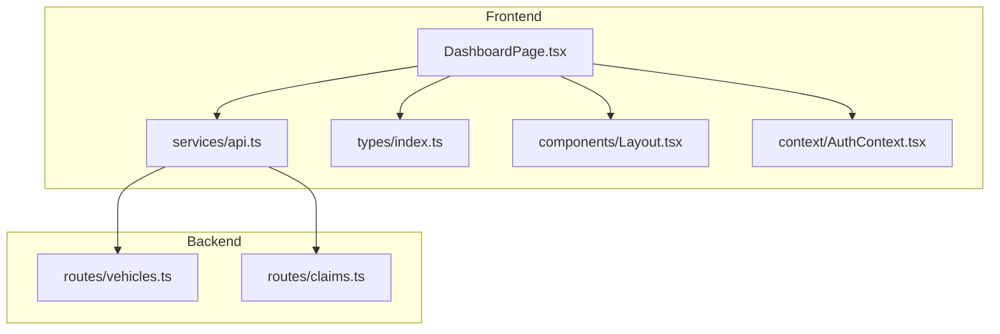
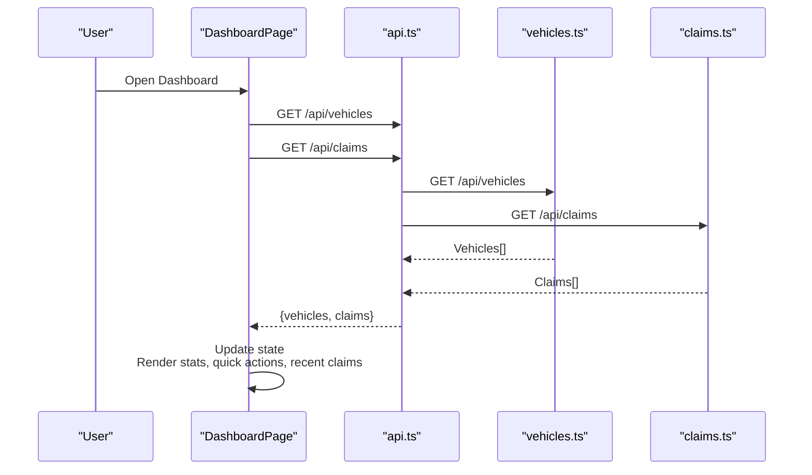
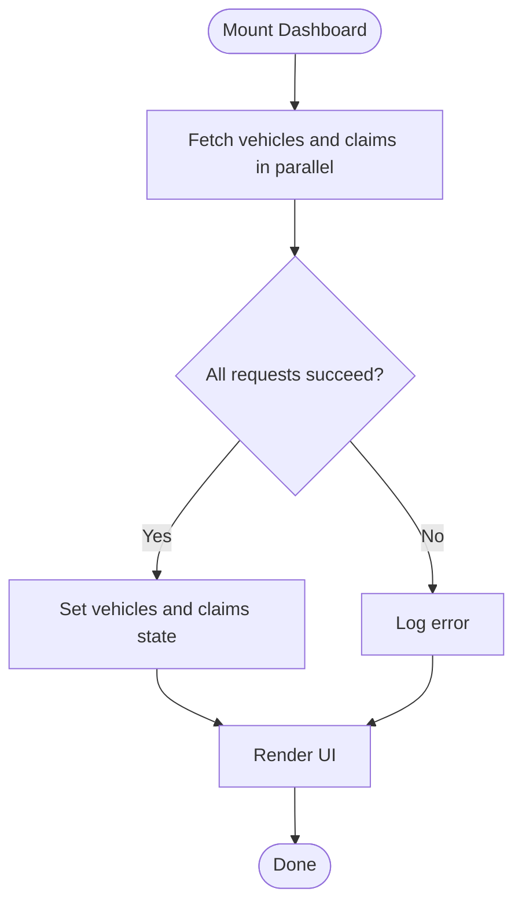
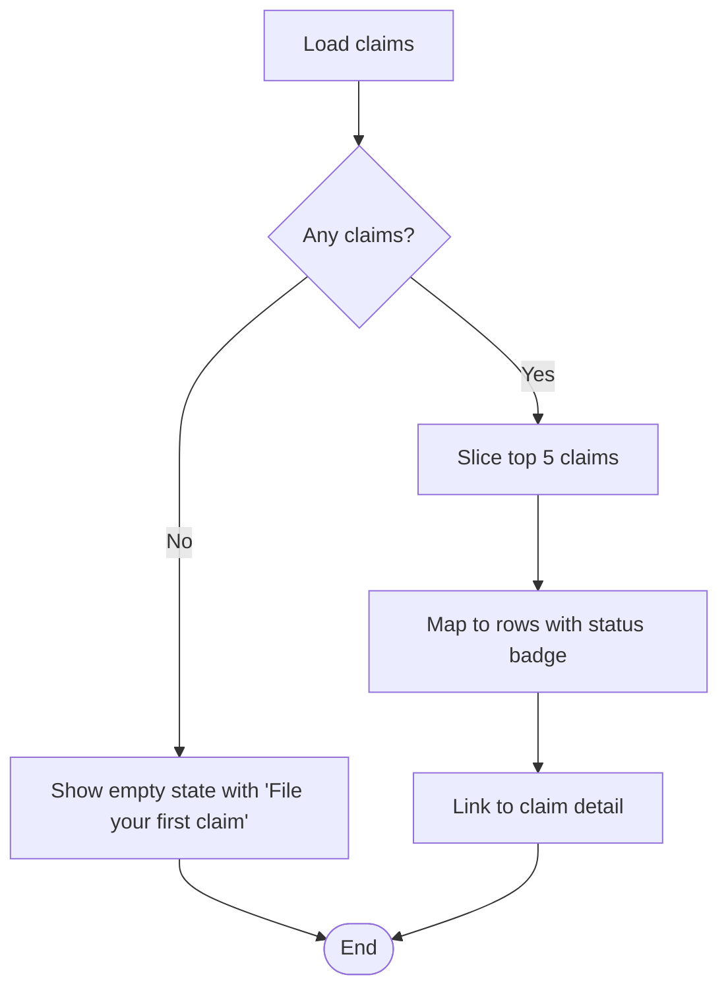
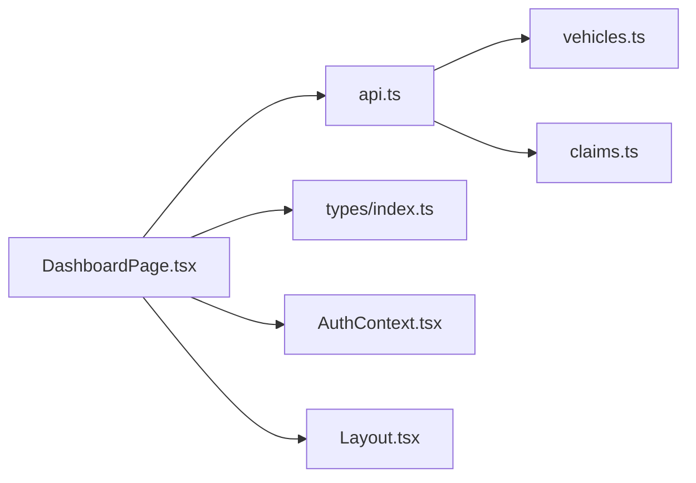

# Dashboard Page

<cite>
**Referenced Files in This Document**
- [DashboardPage.tsx](file://frontend/src/pages/DashboardPage.tsx)
- [api.ts](file://frontend/src/services/api.ts)
- [index.ts (types)](file://frontend/src/types/index.ts)
- [Layout.tsx](file://frontend/src/components/Layout.tsx)
- [AuthContext.tsx](file://frontend/src/context/AuthContext.tsx)
- [claims.ts (backend routes)](file://backend/src/routes/claims.ts)
- [vehicles.ts (backend routes)](file://backend/src/routes/vehicles.ts)
</cite>

## Table of Contents
1. [Introduction](#introduction)
2. [Project Structure](#project-structure)
3. [Core Components](#core-components)
4. [Architecture Overview](#architecture-overview)
5. [Detailed Component Analysis](#detailed-component-analysis)
6. [Dependency Analysis](#dependency-analysis)
7. [Performance Considerations](#performance-considerations)
8. [Troubleshooting Guide](#troubleshooting-guide)
9. [Conclusion](#conclusion)

## Introduction
The Dashboard page is the authenticated user’s landing area. It provides a quick overview of their insurance activity by displaying:
- Statistics cards for vehicle count, active claims, and total claims
- A recent claims list showing the latest five claims with status indicators and navigation links
- Quick action buttons to file a new claim or add a vehicle

Data is fetched in parallel from the backend using Promise.all, with loading states, empty state handling, and responsive grid layouts. The page integrates with the application’s navigation and authentication context.

## Project Structure
The Dashboard page lives under the frontend pages directory and relies on shared services, types, layout, and authentication context. Backend endpoints for vehicles and claims provide the data used by the dashboard.

**Diagram sources**
- [DashboardPage.tsx:1-142](file://frontend/src/pages/DashboardPage.tsx#L1-L142)
- [api.ts:1-40](file://frontend/src/services/api.ts#L1-L40)
- [index.ts (types):12-144](file://frontend/src/types/index.ts#L12-L144)
- [Layout.tsx:1-176](file://frontend/src/components/Layout.tsx#L1-L176)
- [AuthContext.tsx:1-82](file://frontend/src/context/AuthContext.tsx#L1-L82)
- [vehicles.ts:65-81](file://backend/src/routes/vehicles.ts#L65-L81)
- [claims.ts:59-83](file://backend/src/routes/claims.ts#L59-L83)

**Section sources**
- [DashboardPage.tsx:1-142](file://frontend/src/pages/DashboardPage.tsx#L1-L142)
- [api.ts:1-40](file://frontend/src/services/api.ts#L1-L40)
- [index.ts (types):12-144](file://frontend/src/types/index.ts#L12-L144)
- [Layout.tsx:1-176](file://frontend/src/components/Layout.tsx#L1-L176)
- [AuthContext.tsx:1-82](file://frontend/src/context/AuthContext.tsx#L1-L82)
- [vehicles.ts:65-81](file://backend/src/routes/vehicles.ts#L65-L81)
- [claims.ts:59-83](file://backend/src/routes/claims.ts#L59-L83)

## Core Components
- Data fetching: Uses Promise.all to fetch vehicles and claims in parallel from /api/vehicles and /api/claims.
- State management: Tracks vehicles, claims, and loading state; updates UI when data arrives or errors occur.
- Status color coding: Maps claim statuses to Tailwind classes for consistent visual indicators.
- Recent claims: Displays up to five most recent claims with vehicle info, incident date/location, and clickable status badges.
- Quick actions: Links to create a new claim and register a new vehicle.
- Layout integration: Renders within the authenticated Layout that provides navigation and user controls.

**Section sources**
- [DashboardPage.tsx:14-27](file://frontend/src/pages/DashboardPage.tsx#L14-L27)
- [DashboardPage.tsx:29-44](file://frontend/src/pages/DashboardPage.tsx#L29-L44)
- [DashboardPage.tsx:55-138](file://frontend/src/pages/DashboardPage.tsx#L55-L138)
- [Layout.tsx:6-12](file://frontend/src/components/Layout.tsx#L6-L12)

## Architecture Overview
The Dashboard orchestrates data retrieval and presentation:
- On mount, it triggers parallel requests to fetch vehicles and claims.
- Upon success, it sets state and renders stats, quick actions, and recent claims.
- During loading, it shows a spinner.
- If no claims exist, it displays an empty state with a call-to-action.
- Navigation links route to other sections like Claims and Vehicles.

**Diagram sources**
- [DashboardPage.tsx:14-27](file://frontend/src/pages/DashboardPage.tsx#L14-L27)
- [api.ts:7-24](file://frontend/src/services/api.ts#L7-L24)
- [vehicles.ts:65-81](file://backend/src/routes/vehicles.ts#L65-L81)
- [claims.ts:59-83](file://backend/src/routes/claims.ts#L59-L83)

## Detailed Component Analysis

### Data Fetching and Loading States
- Parallel fetching: Uses Promise.all to request both vehicles and claims concurrently for faster load times.
- Error handling: Catches and logs failures; ensures loading state is cleared via finally block.
- Spinner: Shows a centered spinner while data is being fetched.

**Diagram sources**
- [DashboardPage.tsx:14-27](file://frontend/src/pages/DashboardPage.tsx#L14-L27)
- [DashboardPage.tsx:38-44](file://frontend/src/pages/DashboardPage.tsx#L38-L44)

**Section sources**
- [DashboardPage.tsx:14-27](file://frontend/src/pages/DashboardPage.tsx#L14-L27)
- [DashboardPage.tsx:38-44](file://frontend/src/pages/DashboardPage.tsx#L38-L44)

### Statistics Cards
- Vehicle count: Displays the length of the vehicles array.
- Active claims: Counts claims whose status is not COMPLETED or REJECTED.
- Total claims: Displays the length of the claims array.
- Responsive grid: Uses a responsive Tailwind grid to adapt across screen sizes.

**Section sources**
- [DashboardPage.tsx:55-80](file://frontend/src/pages/DashboardPage.tsx#L55-L80)

### Recent Claims Section
- Lists up to five most recent claims, ordered by creation time on the backend.
- Each item shows vehicle make/model/year, incident date and location, and a status badge.
- Clicking a claim navigates to its detail page.
- Empty state: When there are no claims, shows an icon, message, and a link to file the first claim.

**Diagram sources**
- [DashboardPage.tsx:102-138](file://frontend/src/pages/DashboardPage.tsx#L102-L138)
- [claims.ts:59-83](file://backend/src/routes/claims.ts#L59-L83)

**Section sources**
- [DashboardPage.tsx:102-138](file://frontend/src/pages/DashboardPage.tsx#L102-L138)
- [claims.ts:59-83](file://backend/src/routes/claims.ts#L59-L83)

### Quick Action Buttons
- File New Claim: Navigates to the new claim creation page.
- Add Vehicle: Navigates to the new vehicle registration page.
- Styled as prominent cards with icons and descriptions for clarity.

**Section sources**
- [DashboardPage.tsx:82-100](file://frontend/src/pages/DashboardPage.tsx#L82-L100)

### Status Color Coding System
- Maps each claim status to a distinct background/text color combination for readability.
- Includes fallback styling for unknown statuses.

**Section sources**
- [DashboardPage.tsx:29-36](file://frontend/src/pages/DashboardPage.tsx#L29-L36)

### Navigation Integration
- The Dashboard renders inside the Layout component which provides:
  - Sidebar navigation linking to Dashboard, Vehicles, Claims, Policies, Profile
  - Mobile header and bottom navigation
  - User profile section and logout functionality
- Links from the Dashboard navigate to other app sections seamlessly.

**Section sources**
- [Layout.tsx:6-12](file://frontend/src/components/Layout.tsx#L6-L12)
- [Layout.tsx:25-176](file://frontend/src/components/Layout.tsx#L25-L176)

### Authentication and API Interceptors
- Authenticated access: All dashboard endpoints require authentication.
- Token injection: The API client automatically attaches Bearer tokens from localStorage.
- 401 handling: Unauthorized responses clear session and redirect to login.

**Section sources**
- [AuthContext.tsx:17-36](file://frontend/src/context/AuthContext.tsx#L17-L36)
- [api.ts:11-24](file://frontend/src/services/api.ts#L11-L24)
- [api.ts:26-37](file://frontend/src/services/api.ts#L26-L37)

## Dependency Analysis
The Dashboard depends on several modules and backend endpoints:

**Diagram sources**
- [DashboardPage.tsx:1-142](file://frontend/src/pages/DashboardPage.tsx#L1-L142)
- [api.ts:1-40](file://frontend/src/services/api.ts#L1-L40)
- [index.ts (types):12-144](file://frontend/src/types/index.ts#L12-L144)
- [AuthContext.tsx:1-82](file://frontend/src/context/AuthContext.tsx#L1-L82)
- [Layout.tsx:1-176](file://frontend/src/components/Layout.tsx#L1-L176)
- [vehicles.ts:65-81](file://backend/src/routes/vehicles.ts#L65-L81)
- [claims.ts:59-83](file://backend/src/routes/claims.ts#L59-L83)

**Section sources**
- [DashboardPage.tsx:1-142](file://frontend/src/pages/DashboardPage.tsx#L1-L142)
- [api.ts:1-40](file://frontend/src/services/api.ts#L1-L40)
- [index.ts (types):12-144](file://frontend/src/types/index.ts#L12-L144)
- [AuthContext.tsx:1-82](file://frontend/src/context/AuthContext.tsx#L1-L82)
- [Layout.tsx:1-176](file://frontend/src/components/Layout.tsx#L1-L176)
- [vehicles.ts:65-81](file://backend/src/routes/vehicles.ts#L65-L81)
- [claims.ts:59-83](file://backend/src/routes/claims.ts#L59-L83)

## Performance Considerations
- Parallel requests: Using Promise.all reduces overall latency by fetching vehicles and claims concurrently.
- Minimal rendering: Only essential fields are displayed to keep the UI lightweight.
- Pagination consideration: For large datasets, consider pagination or virtualization for the claims list.
- Caching: Consider caching strategies (e.g., React Query or SWR) to avoid redundant network calls on re-renders.
- Image optimization: Ensure vehicle images and thumbnails are optimized if added later.

[No sources needed since this section provides general guidance]

## Troubleshooting Guide
- No data shown: Check browser console for errors; verify that both /api/vehicles and /api/claims return arrays.
- Unauthorized redirects: If redirected to login, ensure token exists and is valid; the API interceptor clears invalid sessions.
- Incorrect status colors: Verify claim status values match expected enum values; fallback styling applies for unknown statuses.
- Empty state appears unexpectedly: Confirm backend returns at least one claim; check ordering and filters.

**Section sources**
- [api.ts:26-37](file://frontend/src/services/api.ts#L26-L37)
- [DashboardPage.tsx:14-27](file://frontend/src/pages/DashboardPage.tsx#L14-L27)
- [DashboardPage.tsx:29-36](file://frontend/src/pages/DashboardPage.tsx#L29-L36)
- [DashboardPage.tsx:102-138](file://frontend/src/pages/DashboardPage.tsx#L102-L138)

## Conclusion
The Dashboard page delivers a concise, real-time overview of a user’s vehicles and claims. It leverages parallel data fetching, robust loading and empty states, consistent status visualization, and seamless navigation integration. Its modular design makes it easy to extend with additional statistics, filters, or performance optimizations as the application grows.

[No sources needed since this section summarizes without analyzing specific files]