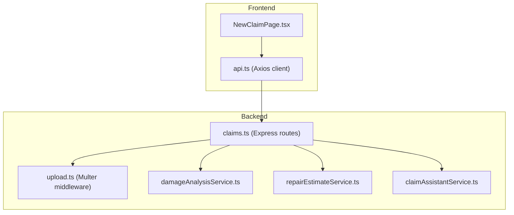
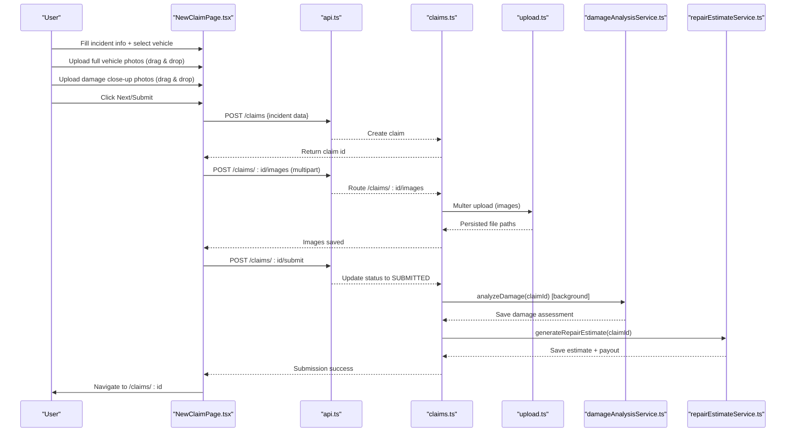
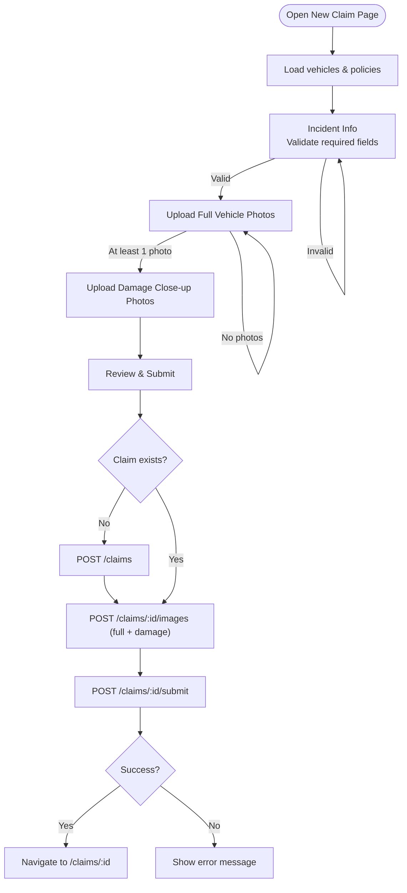
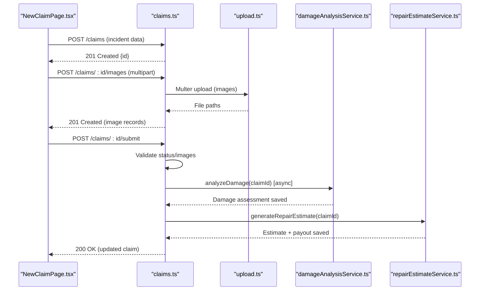
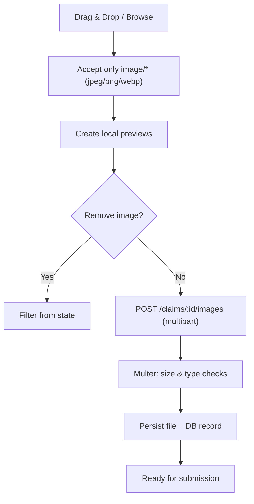
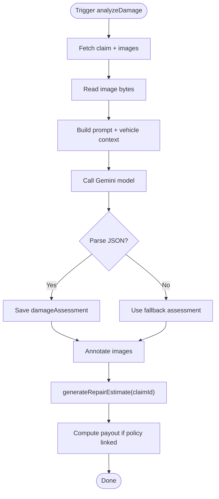
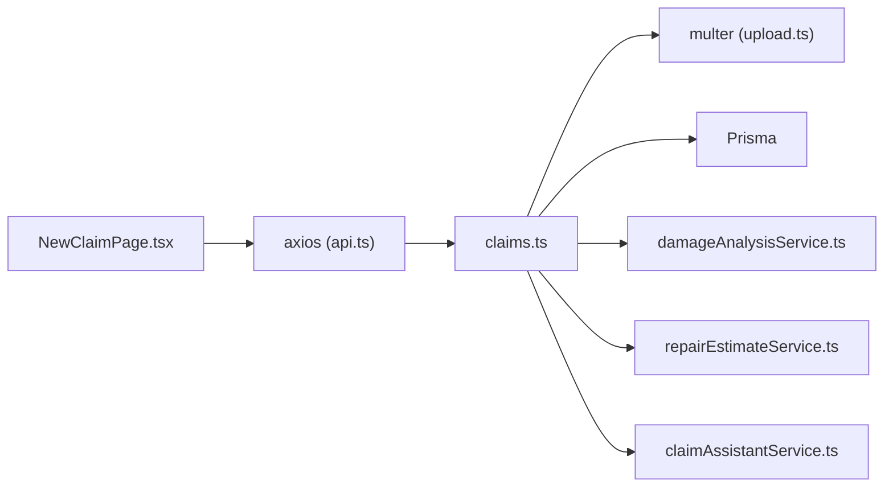

# New Claim Page

<cite>
**Referenced Files in This Document**
- [NewClaimPage.tsx](file://frontend/src/pages/NewClaimPage.tsx)
- [api.ts](file://frontend/src/services/api.ts)
- [claims.ts](file://backend/src/routes/claims.ts)
- [upload.ts](file://backend/src/middleware/upload.ts)
- [damageAnalysisService.ts](file://backend/src/services/damageAnalysisService.ts)
- [repairEstimateService.ts](file://backend/src/services/repairEstimateService.ts)
- [claimAssistantService.ts](file://backend/src/services/claimAssistantService.ts)
- [index.ts (types)](file://frontend/src/types/index.ts)
</cite>

## Table of Contents
1. Introduction
2. Project Structure
3. Core Components
4. Architecture Overview
5. Detailed Component Analysis
6. Dependency Analysis
7. Performance Considerations
8. Troubleshooting Guide
9. Conclusion

## Introduction
This document explains the New Claim Page and its end-to-end claim submission workflow. It covers the multi-step form for incident details, vehicle selection, image uploads with drag-and-drop and previews, supporting documents, AI-powered damage analysis, automatic repair estimate generation, validation, error handling, and navigation to the claim details page after successful submission.

## Project Structure
The New Claim Page is a React component that orchestrates user input and file uploads, while the backend provides REST endpoints for creating claims, uploading images/documents, submitting claims, running AI damage analysis, generating repair estimates, and providing an AI assistant chat.

**Diagram sources**
- [NewClaimPage.tsx:1-252](file://frontend/src/pages/NewClaimPage.tsx#L1-L252)
- [api.ts:1-40](file://frontend/src/services/api.ts#L1-L40)
- [claims.ts:1-450](file://backend/src/routes/claims.ts#L1-L450)
- [upload.ts:1-54](file://backend/src/middleware/upload.ts#L1-L54)
- [damageAnalysisService.ts:1-154](file://backend/src/services/damageAnalysisService.ts#L1-L154)
- [repairEstimateService.ts:1-199](file://backend/src/services/repairEstimateService.ts#L1-L199)
- [claimAssistantService.ts:1-130](file://backend/src/services/claimAssistantService.ts#L1-L130)

**Section sources**
- [NewClaimPage.tsx:1-252](file://frontend/src/pages/NewClaimPage.tsx#L1-L252)
- [api.ts:1-40](file://frontend/src/services/api.ts#L1-L40)
- [claims.ts:1-450](file://backend/src/routes/claims.ts#L1-L450)

## Core Components
- Multi-step form UI: Incident Info, Vehicle Photos, Damage Photos, Review & Submit.
- Drag-and-drop image upload with preview and removal.
- Form validation for required fields before proceeding.
- Backend integration for claim creation, image/document uploads, submission, AI analysis, and estimate generation.
- Error handling and loading states during submission.

Key responsibilities:
- Frontend collects incident details, selects a registered vehicle, and manages image uploads.
- Backend validates inputs, persists claim data, stores files, triggers AI analysis, and generates estimates.

**Section sources**
- [NewClaimPage.tsx:21-100](file://frontend/src/pages/NewClaimPage.tsx#L21-L100)
- [claims.ts:20-57](file://backend/src/routes/claims.ts#L20-L57)
- [upload.ts:17-54](file://backend/src/middleware/upload.ts#L17-L54)

## Architecture Overview
The claim submission flow spans multiple steps and services:

**Diagram sources**
- [NewClaimPage.tsx:62-94](file://frontend/src/pages/NewClaimPage.tsx#L62-L94)
- [claims.ts:20-57](file://backend/src/routes/claims.ts#L20-L57)
- [claims.ts:152-193](file://backend/src/routes/claims.ts#L152-L193)
- [claims.ts:195-233](file://backend/src/routes/claims.ts#L195-L233)
- [damageAnalysisService.ts:50-154](file://backend/src/services/damageAnalysisService.ts#L50-L154)
- [repairEstimateService.ts:104-199](file://backend/src/services/repairEstimateService.ts#L104-L199)

## Detailed Component Analysis

### NewClaimPage.tsx: Multi-step Form and File Uploads
- Steps: Incident Info, Vehicle Photos, Damage Photos, Review & Submit.
- Data collection:
  - Vehicle selection from registered vehicles fetched via GET /vehicles.
  - Optional policy selection via GET /policies.
  - Incident date, location, description, weather conditions, police report flag.
- Validation:
  - Step 0 requires vehicle, incident date, location, and description.
  - Step 1 requires at least one full vehicle photo.
  - Step 2 has no hard requirement enforced by the UI; backend enforces at least one image on submit.
- Image uploads:
  - Drag-and-drop zones for full vehicle and damage close-up images using react-dropzone.
  - Accepts JPEG, PNG, WebP; multiple files allowed.
  - Preview thumbnails with remove buttons.
  - Uploads are sent as multipart/form-data with an imageType field distinguishing FULL_VEHICLE vs DAMAGE_CLOSEUP.
- Submission:
  - Creates claim if not already created, uploads images, then submits claim.
  - On success, navigates to the claim details page.
  - Shows errors and loading state appropriately.

**Diagram sources**
- [NewClaimPage.tsx:31-36](file://frontend/src/pages/NewClaimPage.tsx#L31-L36)
- [NewClaimPage.tsx:96-100](file://frontend/src/pages/NewClaimPage.tsx#L96-L100)
- [NewClaimPage.tsx:62-94](file://frontend/src/pages/NewClaimPage.tsx#L62-L94)

**Section sources**
- [NewClaimPage.tsx:21-100](file://frontend/src/pages/NewClaimPage.tsx#L21-L100)
- [NewClaimPage.tsx:126-247](file://frontend/src/pages/NewClaimPage.tsx#L126-L247)

### Backend Claims Routes: Creation, Upload, Submission, AI, Estimates
- Create claim:
  - Validates required fields (vehicle, date, location, description).
  - Persists claim with optional policy and boolean flags.
- Upload images:
  - Uses multer middleware to accept up to 10 images per request.
  - Stores files under uploads/images with unique filenames.
  - Records image type (FULL_VEHICLE or DAMAGE_CLOSEUP) and optional labels.
- Submit claim:
  - Ensures claim belongs to current user and is in DRAFT status.
  - Requires at least one image uploaded.
  - Updates status to SUBMITTED and triggers background AI damage analysis.
- AI damage analysis:
  - Reads stored images, sends them to Gemini model with a structured prompt.
  - Parses JSON response into damages array, severity, drivability assessment.
  - Saves or updates damageAssessment and annotates images.
  - Automatically calls repair estimate generation.
- Repair estimate:
  - Computes itemized costs based on damage types and severities.
  - Calculates total parts/labor costs, estimated days, and insurance payout when a policy is linked.
  - Persists estimate and payout records.

**Diagram sources**
- [claims.ts:20-57](file://backend/src/routes/claims.ts#L20-L57)
- [claims.ts:152-193](file://backend/src/routes/claims.ts#L152-L193)
- [claims.ts:195-233](file://backend/src/routes/claims.ts#L195-L233)
- [damageAnalysisService.ts:50-154](file://backend/src/services/damageAnalysisService.ts#L50-L154)
- [repairEstimateService.ts:104-199](file://backend/src/services/repairEstimateService.ts#L104-L199)

**Section sources**
- [claims.ts:20-57](file://backend/src/routes/claims.ts#L20-L57)
- [claims.ts:152-193](file://backend/src/routes/claims.ts#L152-L193)
- [claims.ts:195-233](file://backend/src/routes/claims.ts#L195-L233)
- [damageAnalysisService.ts:50-154](file://backend/src/services/damageAnalysisService.ts#L50-L154)
- [repairEstimateService.ts:104-199](file://backend/src/services/repairEstimateService.ts#L104-L199)

### File Upload Handling: Drag-and-Drop, Previews, Validation, Limits
- Frontend:
  - Drag-and-drop zones configured for images only (JPEG, PNG, WebP).
  - Multiple file selection supported.
  - Immediate local previews via object URLs; users can remove individual images.
  - No explicit client-side size validation; relies on server-side limits.
- Backend:
  - Multer enforces allowed MIME types and a 10MB per-file limit.
  - Files are stored under uploads/images or uploads/documents with UUID filenames.
  - Image records include type and optional label; documents support additional types.

**Diagram sources**
- [NewClaimPage.tsx:43-52](file://frontend/src/pages/NewClaimPage.tsx#L43-L52)
- [NewClaimPage.tsx:165-203](file://frontend/src/pages/NewClaimPage.tsx#L165-L203)
- [upload.ts:17-54](file://backend/src/middleware/upload.ts#L17-L54)

**Section sources**
- [NewClaimPage.tsx:43-52](file://frontend/src/pages/NewClaimPage.tsx#L43-L52)
- [NewClaimPage.tsx:165-203](file://frontend/src/pages/NewClaimPage.tsx#L165-L203)
- [upload.ts:17-54](file://backend/src/middleware/upload.ts#L17-L54)

### Supporting Documents
- The backend supports uploading supporting documents (e.g., LICENSE, REGISTRATION, ACCIDENT_REPORT, REPAIR_ESTIMATE) via a separate endpoint with single-file upload.
- Documents are stored under uploads/documents and recorded with type and path.
- Verification endpoint exists to trigger document verification workflows.

**Section sources**
- [claims.ts:316-353](file://backend/src/routes/claims.ts#L316-L353)
- [claims.ts:355-377](file://backend/src/routes/claims.ts#L355-L377)
- [claims.ts:379-397](file://backend/src/routes/claims.ts#L379-L397)

### AI-Powered Damage Analysis and Automatic Repair Estimates
- Damage analysis:
  - Reads all images associated with the claim.
  - Sends images to Gemini with a detailed prompt to identify damage types, locations, severity, and drivability assessment.
  - Parses JSON output robustly, falling back to a safe default if parsing fails.
  - Saves assessment and annotates images with relevant damage annotations.
  - Triggers automatic repair estimate generation.
- Repair estimate:
  - Uses predefined cost tables to compute part and labor costs based on damage type and severity.
  - Calculates totals, estimated repair days, and insurance payout considering deductible.
  - Persists estimate and payout records.

**Diagram sources**
- [damageAnalysisService.ts:50-154](file://backend/src/services/damageAnalysisService.ts#L50-L154)
- [repairEstimateService.ts:104-199](file://backend/src/services/repairEstimateService.ts#L104-L199)

**Section sources**
- [damageAnalysisService.ts:50-154](file://backend/src/services/damageAnalysisService.ts#L50-L154)
- [repairEstimateService.ts:104-199](file://backend/src/services/repairEstimateService.ts#L104-L199)

### Navigation After Successful Submission
- On successful submission, the frontend navigates to the claim details page using the returned claim ID.
- The backend ensures the claim is in SUBMITTED status and includes related entities for display.

**Section sources**
- [NewClaimPage.tsx:72-94](file://frontend/src/pages/NewClaimPage.tsx#L72-L94)
- [claims.ts:152-193](file://backend/src/routes/claims.ts#L152-L193)

## Dependency Analysis
- Frontend dependencies:
  - React hooks for state and lifecycle.
  - react-dropzone for drag-and-drop.
  - Axios client with interceptors for auth token and content-type handling.
- Backend dependencies:
  - Express router with authentication middleware.
  - Multer for file uploads with strict type and size limits.
  - Prisma for database operations.
  - Gemini-based AI service for damage analysis and chat assistance.
  - Custom services for damage analysis, repair estimates, and document verification.

**Diagram sources**
- [NewClaimPage.tsx:1-6](file://frontend/src/pages/NewClaimPage.tsx#L1-L6)
- [api.ts:1-40](file://frontend/src/services/api.ts#L1-L40)
- [claims.ts:1-15](file://backend/src/routes/claims.ts#L1-L15)
- [upload.ts:1-54](file://backend/src/middleware/upload.ts#L1-L54)
- [damageAnalysisService.ts:1-5](file://backend/src/services/damageAnalysisService.ts#L1-L5)
- [repairEstimateService.ts:1-3](file://backend/src/services/repairEstimateService.ts#L1-L3)
- [claimAssistantService.ts:1-3](file://backend/src/services/claimAssistantService.ts#L1-L3)

**Section sources**
- [NewClaimPage.tsx:1-6](file://frontend/src/pages/NewClaimPage.tsx#L1-L6)
- [api.ts:1-40](file://frontend/src/services/api.ts#L1-L40)
- [claims.ts:1-15](file://backend/src/routes/claims.ts#L1-L15)

## Performance Considerations
- Image previews are generated locally to avoid unnecessary network requests.
- Backend processes image uploads in batches (up to 10) to reduce round trips.
- AI damage analysis runs asynchronously after submission to avoid blocking the user experience.
- Repair estimate calculation uses deterministic logic with minimal overhead.
- Consider adding client-side file size validation to prevent large uploads from reaching the server.

[No sources needed since this section provides general guidance]

## Troubleshooting Guide
Common issues and resolutions:
- Missing required fields:
  - Ensure vehicle, incident date, location, and description are provided before proceeding.
- No images uploaded:
  - At least one image must be uploaded before submission; the backend will reject submission otherwise.
- File type or size errors:
  - Only JPEG, PNG, and WebP images are accepted; each file must be under 10MB.
- Authentication failures:
  - If receiving 401 responses, ensure the token is present and valid; the client clears invalid sessions and redirects to login.
- AI analysis or estimate generation failures:
  - These run in the background; check logs for errors. The claim remains submitted even if these fail.

**Section sources**
- [claims.ts:20-57](file://backend/src/routes/claims.ts#L20-L57)
- [claims.ts:152-193](file://backend/src/routes/claims.ts#L152-L193)
- [upload.ts:30-54](file://backend/src/middleware/upload.ts#L30-L54)
- [api.ts:11-37](file://frontend/src/services/api.ts#L11-L37)

## Conclusion
The New Claim Page provides a streamlined, multi-step process for collecting incident information, selecting a vehicle, and uploading evidence. The backend enforces validation, securely handles file uploads, and leverages AI to assess damage and generate repair estimates automatically. Robust error handling and clear navigation ensure a smooth user experience from start to finish.

[No sources needed since this section summarizes without analyzing specific files]