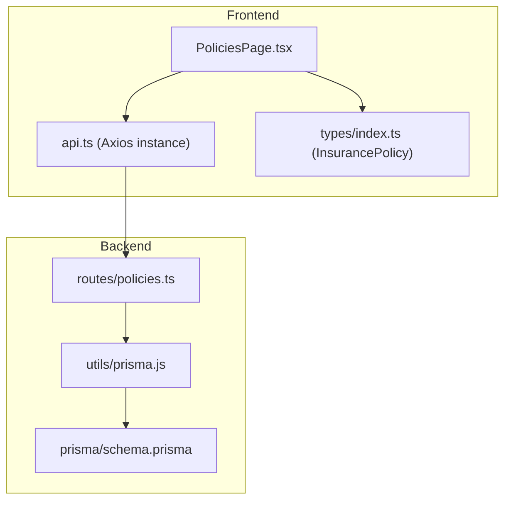
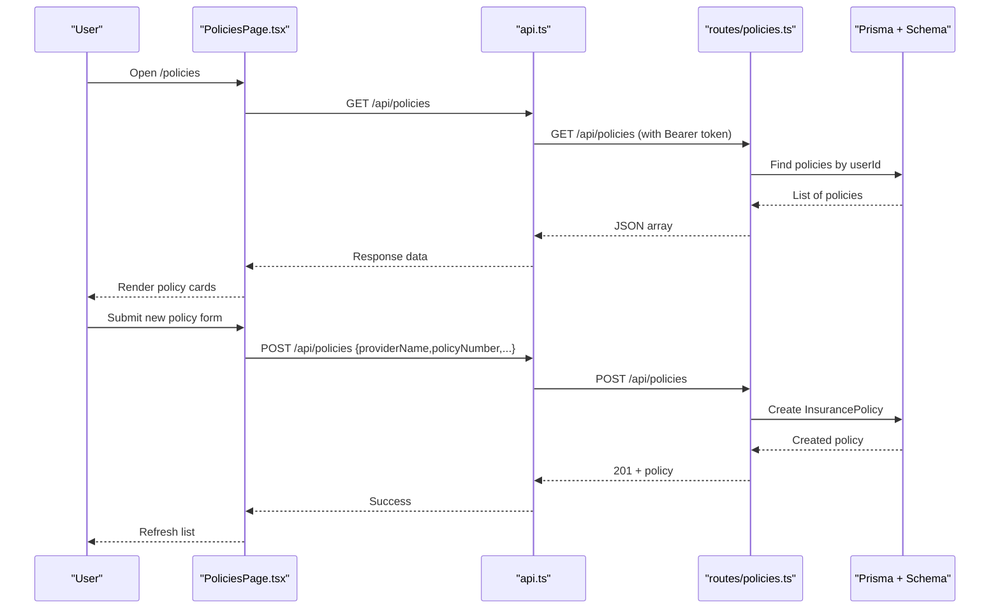
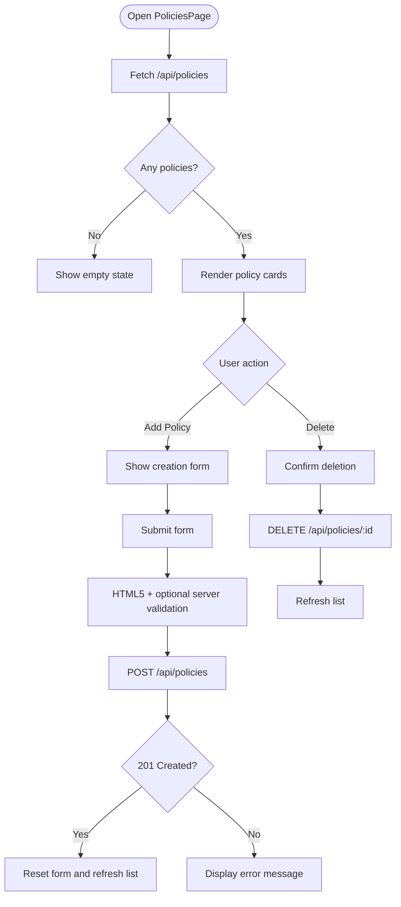
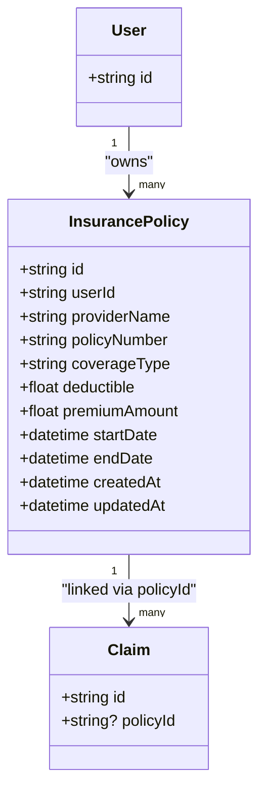
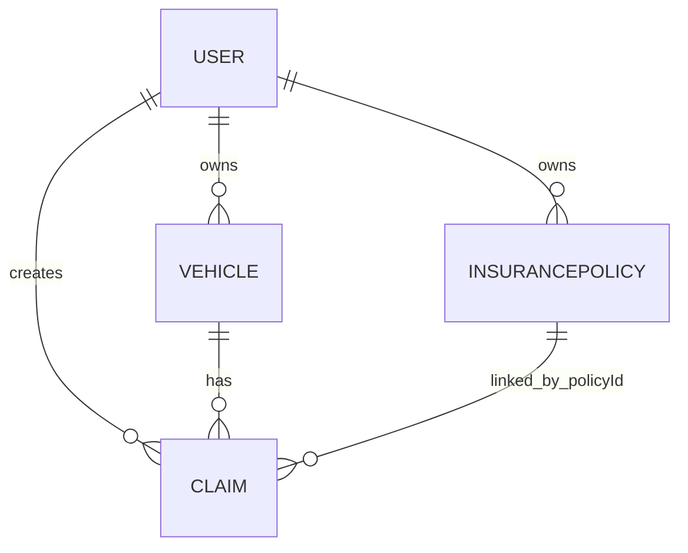
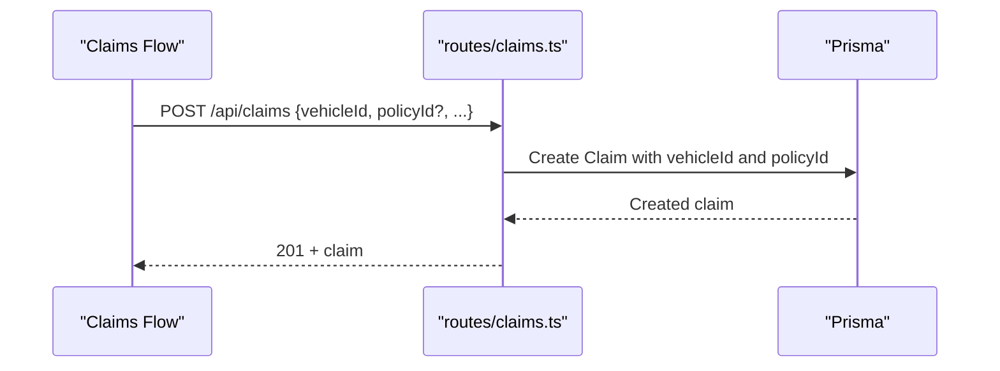
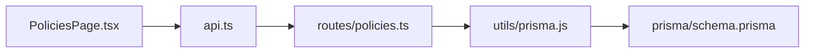

# Policy Management Page

<cite>
**Referenced Files in This Document**
- [PoliciesPage.tsx](file://frontend/src/pages/PoliciesPage.tsx)
- [policies.ts](file://backend/src/routes/policies.ts)
- [schema.prisma](file://backend/prisma/schema.prisma)
- [api.ts](file://frontend/src/services/api.ts)
- [index.ts (types)](file://frontend/src/types/index.ts)
- [App.tsx](file://frontend/src/App.tsx)
- [claims.ts](file://backend/src/routes/claims.ts)
</cite>

## Table of Contents
1. Introduction
2. Project Structure
3. Core Components
4. Architecture Overview
5. Detailed Component Analysis
6. Dependency Analysis
7. Performance Considerations
8. Troubleshooting Guide
9. Conclusion

## Introduction
This document explains the Policies page that manages insurance policy information and coverage details. It covers how users view, create, update, and delete policies; how validation is enforced for coverage limits, deductibles, and policy terms; how policies relate to vehicles and claims; and the API endpoints used by the frontend. The goal is to provide both a high-level understanding and code-level traceability for developers and product stakeholders.

## Project Structure
The Policies feature spans the frontend React page, backend Express routes, Prisma schema, and shared types:
- Frontend page renders the UI, handles form submission, and calls the API.
- Backend routes enforce authentication, validate inputs, and persist data via Prisma.
- Prisma schema defines the InsurancePolicy model and its relationships with User, Vehicle, and Claim.
- Shared TypeScript types define the shape of InsurancePolicy on the client side.
- App routing exposes /policies behind protected routes.

**Diagram sources**
- [PoliciesPage.tsx:1-102](file://frontend/src/pages/PoliciesPage.tsx#L1-L102)
- [api.ts:1-40](file://frontend/src/services/api.ts#L1-L40)
- [policies.ts:1-131](file://backend/src/routes/policies.ts#L1-L131)
- [schema.prisma:45-60](file://backend/prisma/schema.prisma#L45-L60)
- [index.ts (types):28-38](file://frontend/src/types/index.ts#L28-L38)

**Section sources**
- [App.tsx:35-35](file://frontend/src/App.tsx#L35-L35)
- [PoliciesPage.tsx:1-102](file://frontend/src/pages/PoliciesPage.tsx#L1-L102)
- [policies.ts:1-131](file://backend/src/routes/policies.ts#L1-L131)
- [schema.prisma:45-60](file://backend/prisma/schema.prisma#L45-L60)
- [index.ts (types):28-38](file://frontend/src/types/index.ts#L28-L38)

## Core Components
- PoliciesPage (React): Displays user’s policies, provides a form to add new policies, and supports deletion. It fetches policies on mount and refreshes after mutations.
- Policies API (Express): Provides CRUD endpoints under /api/policies with authentication middleware and input validation.
- Data Model (Prisma): Defines InsurancePolicy fields and relations to User and Claim.
- Types (Client): Strongly typed InsurancePolicy interface used across the frontend.

Key responsibilities:
- Listing: GET /api/policies returns policies owned by the authenticated user.
- Creation: POST /api/policies validates required fields and persists a new policy.
- Update: PUT /api/policies/:id allows partial updates with field presence checks.
- Deletion: DELETE /api/policies/:id removes a policy if it belongs to the user.

**Section sources**
- [PoliciesPage.tsx:6-31](file://frontend/src/pages/PoliciesPage.tsx#L6-L31)
- [policies.ts:12-128](file://backend/src/routes/policies.ts#L12-L128)
- [schema.prisma:45-60](file://backend/prisma/schema.prisma#L45-L60)
- [index.ts (types):28-38](file://frontend/src/types/index.ts#L28-L38)

## Architecture Overview
The Policies page follows a standard client-server architecture:
- The React page uses an Axios instance to attach auth tokens and call REST endpoints.
- The backend enforces authentication and validates inputs before interacting with the database via Prisma.
- The Prisma schema models InsurancePolicy and links it to User and Claim.

**Diagram sources**
- [PoliciesPage.tsx:13-24](file://frontend/src/pages/PoliciesPage.tsx#L13-L24)
- [api.ts:7-24](file://frontend/src/services/api.ts#L7-L24)
- [policies.ts:12-55](file://backend/src/routes/policies.ts#L12-L55)
- [schema.prisma:45-60](file://backend/prisma/schema.prisma#L45-L60)

## Detailed Component Analysis

### PoliciesPage (Frontend)
- Loads policies on mount and displays them in a responsive grid.
- Provides a toggleable form to add new policies with required fields: provider name, policy number, coverage type, deductible, premium amount, start date, and end date.
- Supports deletion with confirmation and refreshes the list.
- Uses the shared InsurancePolicy type for strong typing.

Validation and UX:
- HTML5 required attributes enforce presence of all fields.
- Numeric inputs for deductible and premium ensure numeric entry.
- Date inputs enforce valid dates.
- Error messages are displayed when server returns errors.

**Diagram sources**
- [PoliciesPage.tsx:6-31](file://frontend/src/pages/PoliciesPage.tsx#L6-L31)
- [PoliciesPage.tsx:46-71](file://frontend/src/pages/PoliciesPage.tsx#L46-L71)
- [PoliciesPage.tsx:73-98](file://frontend/src/pages/PoliciesPage.tsx#L73-L98)

**Section sources**
- [PoliciesPage.tsx:6-31](file://frontend/src/pages/PoliciesPage.tsx#L6-L31)
- [PoliciesPage.tsx:46-71](file://frontend/src/pages/PoliciesPage.tsx#L46-L71)
- [PoliciesPage.tsx:73-98](file://frontend/src/pages/PoliciesPage.tsx#L73-L98)

### Policies API (Backend)
Endpoints:
- POST /api/policies: Creates a policy. Validates required fields and stores values with proper types.
- GET /api/policies: Lists policies for the authenticated user, ordered by creation time descending.
- GET /api/policies/:id: Retrieves a single policy belonging to the user.
- PUT /api/policies/:id: Updates a policy with partial fields; only provided fields are updated.
- DELETE /api/policies/:id: Deletes a policy if it belongs to the user.

Authentication and security:
- All routes are protected by authMiddleware, ensuring requests include a valid token and associate operations with the correct user.

Validation:
- Creation requires providerName, policyNumber, coverageType, deductible, premiumAmount, startDate, endDate. Missing or invalid fields return a 400 error.
- Deductible and premiumAmount are parsed to numbers.
- Dates are converted to Date objects.

Error handling:
- Not found returns 404 for missing policies.
- Server errors return 500 with descriptive messages.

**Diagram sources**
- [schema.prisma:10-25](file://backend/prisma/schema.prisma#L10-L25)
- [schema.prisma:45-60](file://backend/prisma/schema.prisma#L45-L60)
- [schema.prisma:71-94](file://backend/prisma/schema.prisma#L71-L94)

**Section sources**
- [policies.ts:12-128](file://backend/src/routes/policies.ts#L12-L128)
- [schema.prisma:45-60](file://backend/prisma/schema.prisma#L45-L60)

### Data Model and Relationships
- InsurancePolicy belongs to a User and can be linked to multiple Claims through policyId.
- Claims reference a Vehicle and optionally a Policy. This enables linking claims to specific policies for payout calculations and coverage checks.

Relationships:
- User -> InsurancePolicy (one-to-many)
- User -> Vehicle (one-to-many)
- User -> Claim (one-to-many)
- Vehicle -> Claim (one-to-many)
- InsurancePolicy -> Claim (one-to-many via policyId)

**Diagram sources**
- [schema.prisma:10-25](file://backend/prisma/schema.prisma#L10-L25)
- [schema.prisma:27-43](file://backend/prisma/schema.prisma#L27-L43)
- [schema.prisma:45-60](file://backend/prisma/schema.prisma#L45-L60)
- [schema.prisma:71-94](file://backend/prisma/schema.prisma#L71-L94)

**Section sources**
- [schema.prisma:45-60](file://backend/prisma/schema.prisma#L45-L60)
- [schema.prisma:71-94](file://backend/prisma/schema.prisma#L71-L94)

### API Endpoints Summary
- POST /api/policies
  - Purpose: Create a new policy
  - Auth: Required
  - Body: providerName, policyNumber, coverageType, deductible, premiumAmount, startDate, endDate
  - Validation: All fields required; numeric parsing for amounts; date conversion
  - Responses: 201 Created, 400 Bad Request, 500 Server Error

- GET /api/policies
  - Purpose: List policies for the authenticated user
  - Auth: Required
  - Responses: 200 OK with array, 500 Server Error

- GET /api/policies/:id
  - Purpose: Retrieve a specific policy
  - Auth: Required
  - Responses: 200 OK, 404 Not Found, 500 Server Error

- PUT /api/policies/:id
  - Purpose: Update a policy (partial fields allowed)
  - Auth: Required
  - Body: Any subset of policy fields
  - Responses: 200 OK, 404 Not Found, 500 Server Error

- DELETE /api/policies/:id
  - Purpose: Delete a policy
  - Auth: Required
  - Responses: 200 OK, 404 Not Found, 500 Server Error

**Section sources**
- [policies.ts:12-128](file://backend/src/routes/policies.ts#L12-L128)

### Integration with Vehicles and Claims
- Claims can be associated with a vehicle and optionally a policy. When creating a claim, you can pass a policyId to link it to an existing policy.
- This linkage enables downstream processes (e.g., damage assessment, repair estimates, payouts) to consider coverage details from the linked policy.

**Diagram sources**
- [claims.ts:28-56](file://backend/src/routes/claims.ts#L28-L56)
- [schema.prisma:71-94](file://backend/prisma/schema.prisma#L71-L94)

**Section sources**
- [claims.ts:28-56](file://backend/src/routes/claims.ts#L28-L56)
- [schema.prisma:71-94](file://backend/prisma/schema.prisma#L71-L94)

## Dependency Analysis
- Frontend dependencies:
  - PoliciesPage depends on api.ts for HTTP calls and types/index.ts for InsurancePolicy.
  - Routing is configured in App.tsx to protect /policies.

- Backend dependencies:
  - policies.ts depends on prisma client and auth middleware.
  - Data persistence relies on Prisma schema definitions.

Coupling and cohesion:
- PoliciesPage is cohesive around policy UI and delegates network concerns to api.ts.
- policies.ts encapsulates all policy-related business logic and data access, maintaining clear separation from other routes.

Potential circular dependencies:
- None observed between modules; dependencies flow one-way from frontend to backend to database.

External integrations:
- Authentication middleware secures endpoints.
- Prisma abstracts database interactions.

**Diagram sources**
- [PoliciesPage.tsx:1-31](file://frontend/src/pages/PoliciesPage.tsx#L1-L31)
- [api.ts:7-24](file://frontend/src/services/api.ts#L7-L24)
- [policies.ts:1-10](file://backend/src/routes/policies.ts#L1-L10)
- [schema.prisma:45-60](file://backend/prisma/schema.prisma#L45-L60)

**Section sources**
- [App.tsx:35-35](file://frontend/src/App.tsx#L35-L35)
- [PoliciesPage.tsx:1-31](file://frontend/src/pages/PoliciesPage.tsx#L1-L31)
- [api.ts:7-24](file://frontend/src/services/api.ts#L7-L24)
- [policies.ts:1-10](file://backend/src/routes/policies.ts#L1-L10)

## Performance Considerations
- Client-side rendering: The page loads all policies at once; for large datasets, consider pagination or virtualization.
- Network requests: Fetch occurs once on mount; subsequent mutations trigger targeted refreshes.
- Backend queries: Queries filter by userId and order by createdAt; indexes on userId and createdAt could improve performance at scale.
- Input parsing: Converting strings to numbers and dates on the server ensures consistent storage but adds minimal overhead.

[No sources needed since this section provides general guidance]

## Troubleshooting Guide
Common issues and resolutions:
- 401 Unauthorized: Ensure the request includes a valid bearer token; the axios interceptor automatically attaches the token and redirects on 401.
- 400 Bad Request: Verify all required fields are present and correctly formatted (numbers for amounts, valid dates).
- 404 Not Found: Check that the policy ID exists and belongs to the authenticated user.
- Form validation errors: Use browser dev tools to inspect form values and ensure required fields are filled.

Where to look:
- Frontend error handling in PoliciesPage catches and displays server errors.
- Backend logs errors and returns structured error messages.

**Section sources**
- [api.ts:27-37](file://frontend/src/services/api.ts#L27-L37)
- [policies.ts:17-19](file://backend/src/routes/policies.ts#L17-L19)
- [policies.ts:64-66](file://backend/src/routes/policies.ts#L64-L66)
- [policies.ts:83-85](file://backend/src/routes/policies.ts#L83-L85)
- [policies.ts:117-119](file://backend/src/routes/policies.ts#L117-L119)

## Conclusion
The Policies page provides a complete workflow for managing insurance policies within the system. It integrates tightly with the backend API, enforces robust validation, and connects to the broader ecosystem of vehicles and claims. By following the documented endpoints and data model, teams can extend functionality such as renewal notifications, advanced status tracking, and richer coverage limit validations while maintaining consistency and security.

[No sources needed since this section summarizes without analyzing specific files]