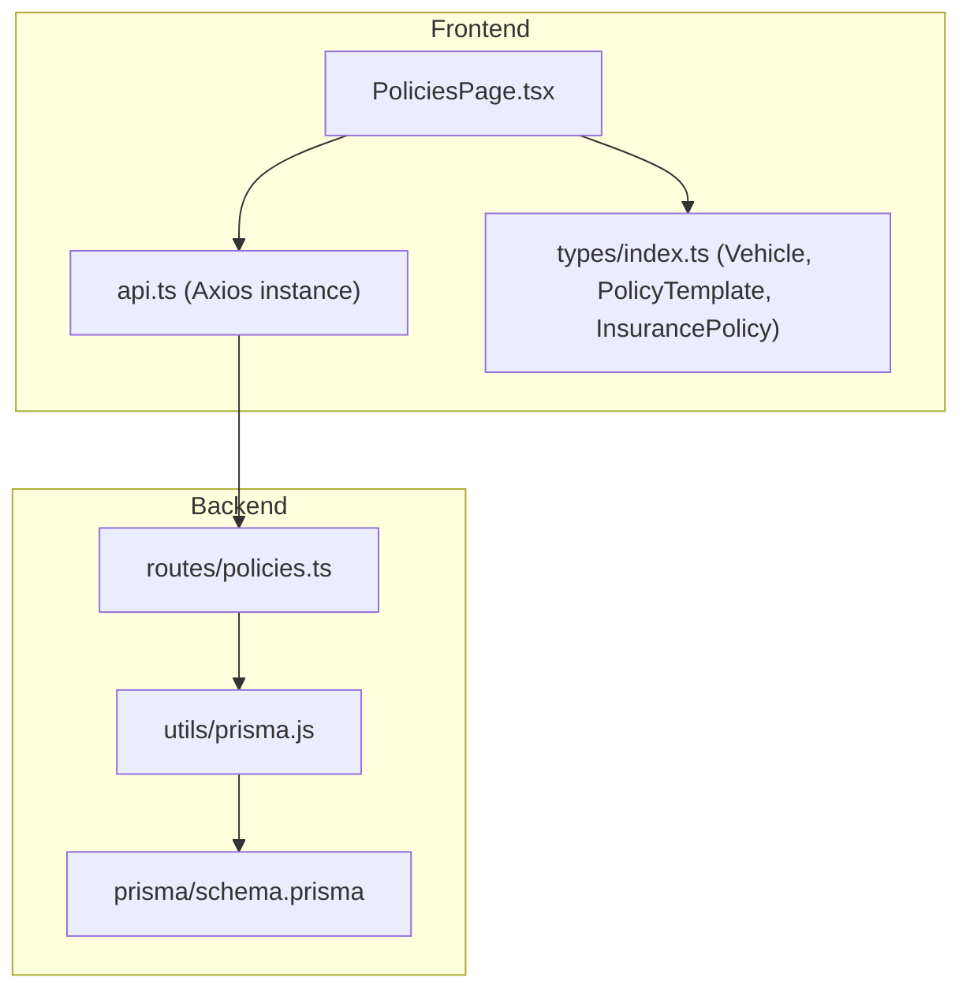
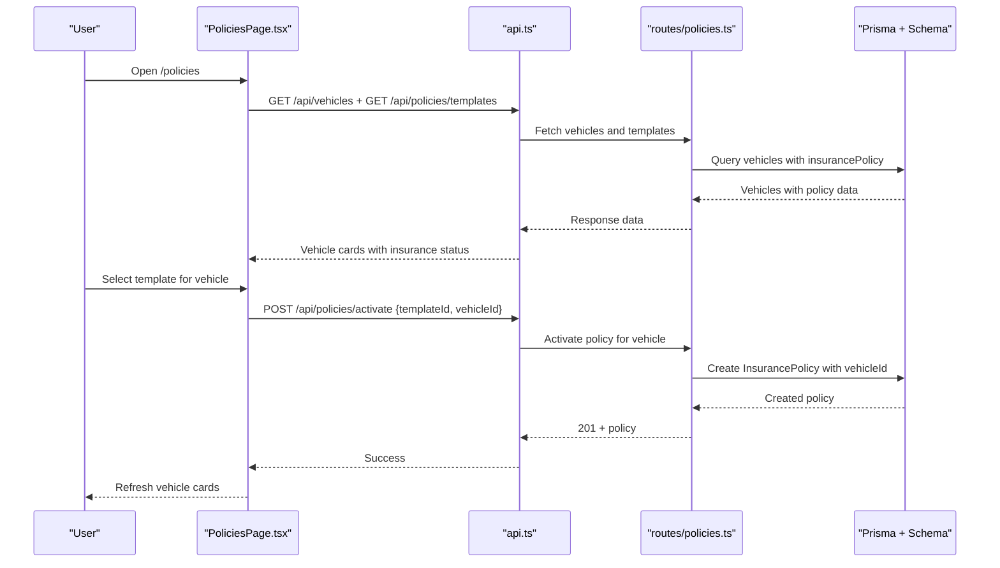
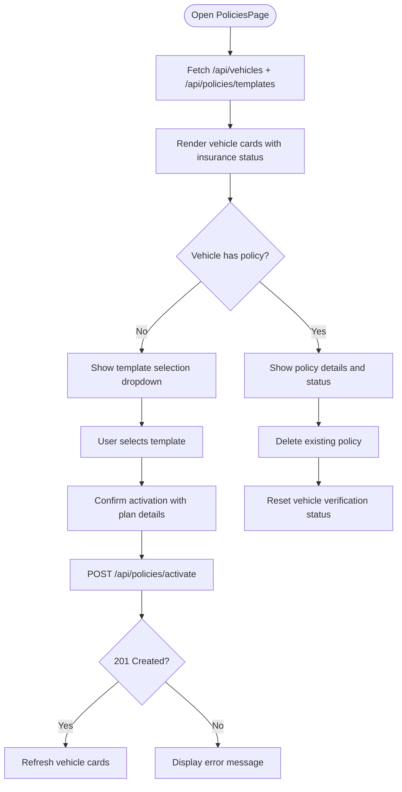
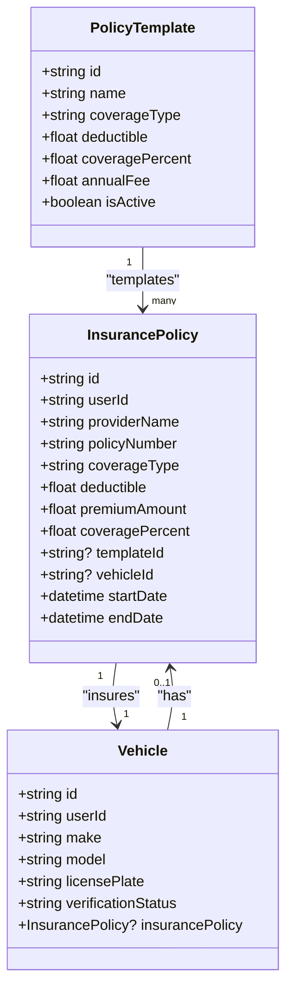
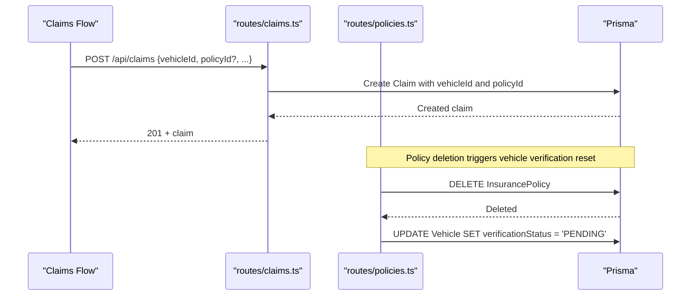
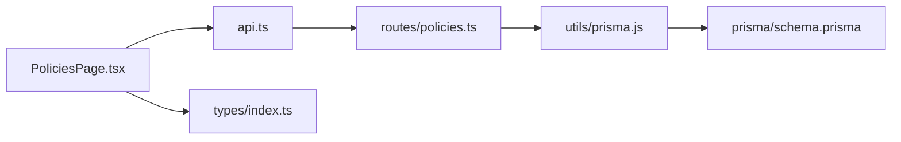

# Policy Management Page

<cite>
**Referenced Files in This Document**
- [PoliciesPage.tsx](file://frontend/src/pages/PoliciesPage.tsx)
- [policies.ts](file://backend/src/routes/policies.ts)
- [schema.prisma](file://backend/prisma/schema.prisma)
- [api.ts](file://frontend/src/services/api.ts)
- [index.ts (types)](file://frontend/src/types/index.ts)
- [App.tsx](file://frontend/src/App.tsx)
- [claims.ts](file://backend/src/routes/claims.ts)
</cite>

## Update Summary
**Changes Made**
- Completely redesigned to show vehicles instead of policies
- Updated to display per-vehicle insurance status and policy information
- Added template-based plan selection and activation controls
- Enhanced vehicle card interface with verification status indicators
- Updated backend API to support vehicle-specific policy management
- Modified data model to enforce one policy per vehicle relationship

## Table of Contents
1. Introduction
2. Project Structure
3. Core Components
4. Architecture Overview
5. Detailed Component Analysis
6. Dependency Analysis
7. Performance Considerations
8. Troubleshooting Guide
9. Conclusion

## Introduction
This document explains the redesigned Policies page that manages insurance policies at the vehicle level. The page now displays each user's vehicles with their current insurance status, allows selection of insurance plans from available templates, and provides activation controls for per-vehicle policy management. It covers how users view vehicle insurance status, activate plans, manage existing policies, and understand the relationship between vehicles, policies, and claims within the insurance ecosystem.

## Project Structure
The redesigned Policies feature spans the frontend React page, backend Express routes, Prisma schema, and shared types:
- Frontend page renders vehicle cards with insurance status, template selection, and activation controls
- Backend routes provide template listing, policy activation, and vehicle-specific policy management
- Prisma schema defines the InsurancePolicy model with unique vehicle relationships
- Shared TypeScript types define Vehicle, PolicyTemplate, and InsurancePolicy interfaces
- App routing exposes /policies behind protected routes



**Diagram sources**
- [PoliciesPage.tsx:1-196](file://frontend/src/pages/PoliciesPage.tsx#L1-L196)
- [api.ts:1-40](file://frontend/src/services/api.ts#L1-L40)
- [policies.ts:1-214](file://backend/src/routes/policies.ts#L1-L214)
- [schema.prisma:64-100](file://backend/prisma/schema.prisma#L64-L100)
- [index.ts (types):46-98](file://frontend/src/types/index.ts#L46-L98)

**Section sources**
- [App.tsx:46-46](file://frontend/src/App.tsx#L46-L46)
- [PoliciesPage.tsx:1-196](file://frontend/src/pages/PoliciesPage.tsx#L1-L196)
- [policies.ts:1-214](file://backend/src/routes/policies.ts#L1-L214)
- [schema.prisma:64-100](file://backend/prisma/schema.prisma#L64-L100)
- [index.ts (types):46-98](file://frontend/src/types/index.ts#L46-L98)

## Core Components
- **PoliciesPage (React)**: Displays user's vehicles with their insurance status, provides template selection for plan activation, and supports policy deletion per vehicle
- **Policies API (Express)**: Provides endpoints for template listing, policy activation, and vehicle-specific policy management with authentication middleware
- **Data Model (Prisma)**: Defines InsurancePolicy with unique vehicle relationships and PolicyTemplate for built-in plans
- **Types (Client)**: Strongly typed Vehicle, PolicyTemplate, and InsurancePolicy interfaces used across the frontend

Key responsibilities:
- **Vehicle Listing**: GET /api/vehicles returns vehicles with their insurance policy details
- **Template Listing**: GET /api/policies/templates returns available insurance plans
- **Policy Activation**: POST /api/policies/activate creates a policy for a specific vehicle using a template
- **Policy Management**: CRUD operations for vehicle-specific policies

**Section sources**
- [PoliciesPage.tsx:7-196](file://frontend/src/pages/PoliciesPage.tsx#L7-L196)
- [policies.ts:12-214](file://backend/src/routes/policies.ts#L12-L214)
- [schema.prisma:64-100](file://backend/prisma/schema.prisma#L64-L100)
- [index.ts (types):46-98](file://frontend/src/types/index.ts#L46-L98)

## Architecture Overview
The redesigned Policies page follows a vehicle-centric architecture:
- The React page fetches vehicles and policy templates, displaying them as vehicle cards with insurance status
- The backend enforces authentication and validates inputs before creating vehicle-specific policies
- The Prisma schema models InsurancePolicy with unique vehicle relationships and links to PolicyTemplates



**Diagram sources**
- [PoliciesPage.tsx:17-27](file://frontend/src/pages/PoliciesPage.tsx#L17-L27)
- [api.ts:7-24](file://frontend/src/services/api.ts#L7-L24)
- [policies.ts:12-82](file://backend/src/routes/policies.ts#L12-L82)
- [schema.prisma:64-100](file://backend/prisma/schema.prisma#L64-L100)

## Detailed Component Analysis

### PoliciesPage (Frontend) - Redesigned for Vehicle-Centric Management
**Updated** The page now focuses on vehicles rather than policies, displaying each vehicle with its current insurance status and providing template-based plan activation.

- Loads vehicles and policy templates on mount and displays them as responsive vehicle cards
- Shows verification status (Verified, Pending, Rejected) for each vehicle
- Provides template selection dropdown for vehicles without active policies
- Supports policy activation with confirmation dialogs showing plan details
- Displays existing policy information including coverage, deductible, premium, and validity dates
- Supports policy deletion with automatic vehicle re-verification reset

Validation and UX:
- Template selection requires user confirmation before activation
- Active policy detection based on end date comparison
- Error handling for failed activations and deletions
- Loading states during policy activation



**Diagram sources**
- [PoliciesPage.tsx:17-27](file://frontend/src/pages/PoliciesPage.tsx#L17-L27)
- [PoliciesPage.tsx:29-57](file://frontend/src/pages/PoliciesPage.tsx#L29-L57)
- [PoliciesPage.tsx:87-162](file://frontend/src/pages/PoliciesPage.tsx#L87-L162)

**Section sources**
- [PoliciesPage.tsx:7-196](file://frontend/src/pages/PoliciesPage.tsx#L7-L196)

### Policies API (Backend) - Enhanced with Vehicle-Specific Operations
**Updated** Added new endpoints for template management and vehicle-specific policy activation while maintaining existing CRUD operations.

Endpoints:
- **GET /api/policies/templates**: Lists all active policy templates offered by the insurance company
- **POST /api/policies/activate**: Activates a template-based plan for a specific vehicle
- **POST /api/policies**: Creates a manual policy (legacy support)
- **GET /api/policies**: Lists policies for the authenticated user with template information
- **GET /api/policies/:id**: Retrieves a specific policy belonging to the user
- **PUT /api/policies/:id**: Updates a policy with partial fields
- **DELETE /api/policies/:id**: Deletes a policy and resets vehicle verification status

Authentication and security:
- All routes are protected by authMiddleware, ensuring requests include a valid token
- Vehicle ownership validation ensures users can only activate policies for their own vehicles

Validation:
- Template activation requires both templateId and vehicleId
- Vehicle must belong to the authenticated user and not already have an active policy
- Policy creation requires all standard fields with proper type validation

Error handling:
- Not found returns 404 for missing templates or vehicles
- Conflict returns 409 when vehicle already has a policy
- Server errors return 500 with descriptive messages



**Diagram sources**
- [schema.prisma:64-77](file://backend/prisma/schema.prisma#L64-L77)
- [schema.prisma:79-100](file://backend/prisma/schema.prisma#L79-L100)
- [schema.prisma:32-55](file://backend/prisma/schema.prisma#L32-L55)

**Section sources**
- [policies.ts:12-214](file://backend/src/routes/policies.ts#L12-L214)
- [schema.prisma:64-100](file://backend/prisma/schema.prisma#L64-L100)

### Data Model and Relationships - Vehicle-Centric Design
**Updated** The data model now enforces a one-to-one relationship between vehicles and policies, with policies linked to templates for standardized plan offerings.

- InsurancePolicy belongs to a User and is uniquely linked to one Vehicle
- PolicyTemplate represents standardized insurance plans offered by the company
- Claims can be associated with vehicles and optionally linked to specific policies
- Vehicle verification status is automatically managed when policies are deleted

Relationships:
- User -> InsurancePolicy (one-to-many)
- User -> Vehicle (one-to-many) 
- Vehicle -> InsurancePolicy (one-to-one, optional)
- PolicyTemplate -> InsurancePolicy (one-to-many)
- User -> Claim (one-to-many)
- Vehicle -> Claim (one-to-many)
- InsurancePolicy -> Claim (one-to-many via policyId)

```mermaid
erDiagram
USER ||--o{ INSURANCEPOLICY : owns
USER ||--o{ VEHICLE : owns
USER ||--o{ CLAIM : creates
VEHICLE ||--o{ CLAIM : has
INSURANCEPOLICY ||--o{ CLAIM : linked_by_policyId
POLICYTEMPLATE ||--o{ INSURANCEPOLICY : provides
VEHICLE ||--|| INSURANCEPOLICY : insures (unique)
```

**Diagram sources**
- [schema.prisma:10-30](file://backend/prisma/schema.prisma#L10-L30)
- [schema.prisma:32-55](file://backend/prisma/schema.prisma#L32-L55)
- [schema.prisma:64-100](file://backend/prisma/schema.prisma#L64-L100)
- [schema.prisma:113-143](file://backend/prisma/schema.prisma#L113-L143)

**Section sources**
- [schema.prisma:64-100](file://backend/prisma/schema.prisma#L64-L100)
- [schema.prisma:113-143](file://backend/prisma/schema.prisma#L113-L143)

### API Endpoints Summary - Enhanced Vehicle Integration
**Updated** New endpoints added for template management and vehicle-specific policy activation.

- **GET /api/policies/templates**
  - Purpose: List all active policy templates offered by the insurance company
  - Auth: Required
  - Responses: 200 OK with array of templates, 500 Server Error

- **POST /api/policies/activate**
  - Purpose: Activate a template-based plan for a specific vehicle
  - Auth: Required
  - Body: templateId, vehicleId
  - Validation: Both required; vehicle must belong to user; no existing policy allowed
  - Responses: 201 Created, 400 Bad Request, 404 Not Found, 409 Conflict, 500 Server Error

- **POST /api/policies**
  - Purpose: Create a manual policy (legacy support)
  - Auth: Required
  - Body: providerName, policyNumber, coverageType, deductible, premiumAmount, startDate, endDate
  - Validation: All fields required; numeric parsing for amounts; date conversion
  - Responses: 201 Created, 400 Bad Request, 500 Server Error

- **GET /api/policies**
  - Purpose: List policies for the authenticated user with template information
  - Auth: Required
  - Responses: 200 OK with array, 500 Server Error

- **GET /api/policies/:id**
  - Purpose: Retrieve a specific policy
  - Auth: Required
  - Responses: 200 OK, 404 Not Found, 500 Server Error

- **PUT /api/policies/:id**
  - Purpose: Update a policy (partial fields allowed)
  - Auth: Required
  - Body: Any subset of policy fields
  - Responses: 200 OK, 404 Not Found, 500 Server Error

- **DELETE /api/policies/:id**
  - Purpose: Delete a policy and reset vehicle verification status
  - Auth: Required
  - Responses: 200 OK, 404 Not Found, 500 Server Error

**Section sources**
- [policies.ts:12-214](file://backend/src/routes/policies.ts#L12-L214)

### Integration with Vehicles and Claims - Enhanced Verification Flow
**Updated** The integration now includes automatic vehicle verification status management when policies are deleted or activated.

- Claims can be associated with a vehicle and optionally a policy
- Vehicle verification status is automatically set to PENDING when a policy is deleted
- Policy activation creates a one-year policy with automatic end date calculation
- Template-based policies inherit coverage details from predefined templates



**Diagram sources**
- [claims.ts:28-56](file://backend/src/routes/claims.ts#L28-L56)
- [policies.ts:183-211](file://backend/src/routes/policies.ts#L183-L211)
- [schema.prisma:113-143](file://backend/prisma/schema.prisma#L113-L143)

**Section sources**
- [claims.ts:28-56](file://backend/src/routes/claims.ts#L28-L56)
- [policies.ts:183-211](file://backend/src/routes/policies.ts#L183-L211)
- [schema.prisma:113-143](file://backend/prisma/schema.prisma#L113-L143)

## Dependency Analysis
**Updated** Dependencies now include vehicle and template management alongside policy operations.

- Frontend dependencies:
  - PoliciesPage depends on api.ts for HTTP calls and types/index.ts for Vehicle, PolicyTemplate, and InsurancePolicy
  - Routing is configured in App.tsx to protect /policies
  - Vehicle data fetching integrated with policy template loading

- Backend dependencies:
  - policies.ts depends on prisma client, auth middleware, and now handles template operations
  - Data persistence relies on Prisma schema definitions with enhanced relationships
  - Vehicle ownership validation ensures security

Coupling and cohesion:
- PoliciesPage is cohesive around vehicle-centric policy UI and delegates network concerns to api.ts
- policies.ts encapsulates all policy-related business logic including template management and vehicle-specific operations
- Clear separation maintained between vehicle management and policy operations

Potential circular dependencies:
- None observed between modules; dependencies flow one-way from frontend to backend to database

External integrations:
- Authentication middleware secures all endpoints
- Prisma abstracts database interactions with enhanced relationships
- Vehicle verification system integrates with policy lifecycle



**Diagram sources**
- [PoliciesPage.tsx:1-196](file://frontend/src/pages/PoliciesPage.tsx#L1-L196)
- [api.ts:7-24](file://frontend/src/services/api.ts#L7-L24)
- [policies.ts:1-214](file://backend/src/routes/policies.ts#L1-L214)
- [schema.prisma:64-100](file://backend/prisma/schema.prisma#L64-L100)

**Section sources**
- [App.tsx:46-46](file://frontend/src/App.tsx#L46-L46)
- [PoliciesPage.tsx:1-196](file://frontend/src/pages/PoliciesPage.tsx#L1-L196)
- [api.ts:7-24](file://frontend/src/services/api.ts#L7-L24)
- [policies.ts:1-214](file://backend/src/routes/policies.ts#L1-L214)

## Performance Considerations
**Updated** Performance considerations now account for vehicle-centric data loading and template management.

- Client-side rendering: The page loads vehicles and templates simultaneously using Promise.all for optimal performance
- Network requests: Parallel fetching of vehicles and templates reduces load time; subsequent mutations trigger targeted refreshes
- Backend queries: Queries filter by userId and order by createdAt; indexes on userId and createdAt improve performance
- Input parsing: Converting strings to numbers and dates on the server ensures consistent storage
- Template caching: Policy templates are loaded once and reused across vehicle cards

## Troubleshooting Guide
**Updated** Common issues now include vehicle-specific scenarios and template-related problems.

Common issues and resolutions:
- **401 Unauthorized**: Ensure the request includes a valid bearer token; the axios interceptor automatically attaches the token and redirects on 401
- **400 Bad Request**: Verify all required fields are present and correctly formatted for policy operations
- **404 Not Found**: Check that the template ID exists and is active, or that the vehicle ID belongs to the authenticated user
- **409 Conflict**: Vehicle already has an active policy; delete existing policy first to activate a different plan
- **Template not found**: Ensure the selected template is active and exists in the system
- **Form validation errors**: Use browser dev tools to inspect form values and ensure required fields are filled

Where to look:
- Frontend error handling in PoliciesPage catches and displays server errors with user-friendly messages
- Backend logs errors and returns structured error messages for debugging
- Vehicle ownership validation ensures users can only manage policies for their own vehicles

**Section sources**
- [api.ts:27-37](file://frontend/src/services/api.ts#L27-L37)
- [policies.ts:27-82](file://backend/src/routes/policies.ts#L27-L82)
- [policies.ts:84-214](file://backend/src/routes/policies.ts#L84-L214)

## Conclusion
The redesigned Policies page provides a comprehensive vehicle-centric workflow for managing insurance policies within the system. It integrates tightly with the backend API, enforces robust validation, and connects to the broader ecosystem of vehicles and claims through automated verification status management. The template-based approach standardizes insurance offerings while allowing flexible per-vehicle policy activation. By following the documented endpoints and data model, teams can extend functionality such as advanced renewal notifications, enhanced status tracking, and richer coverage limit validations while maintaining consistency and security across the vehicle-policy relationship.