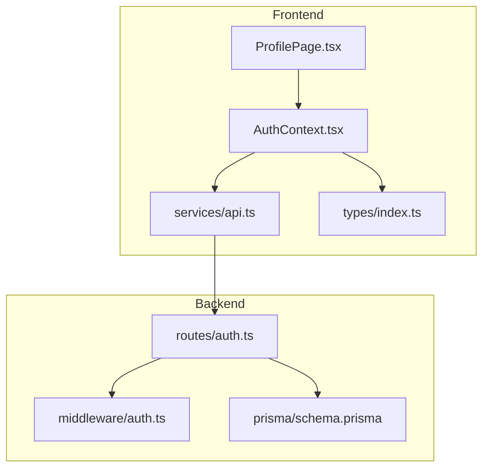
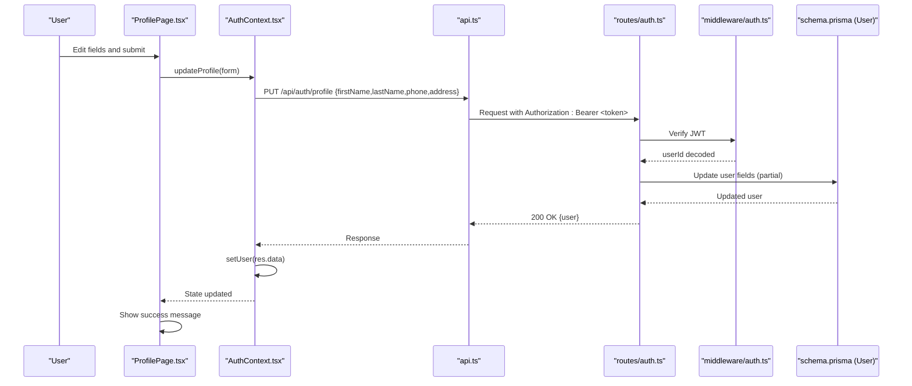
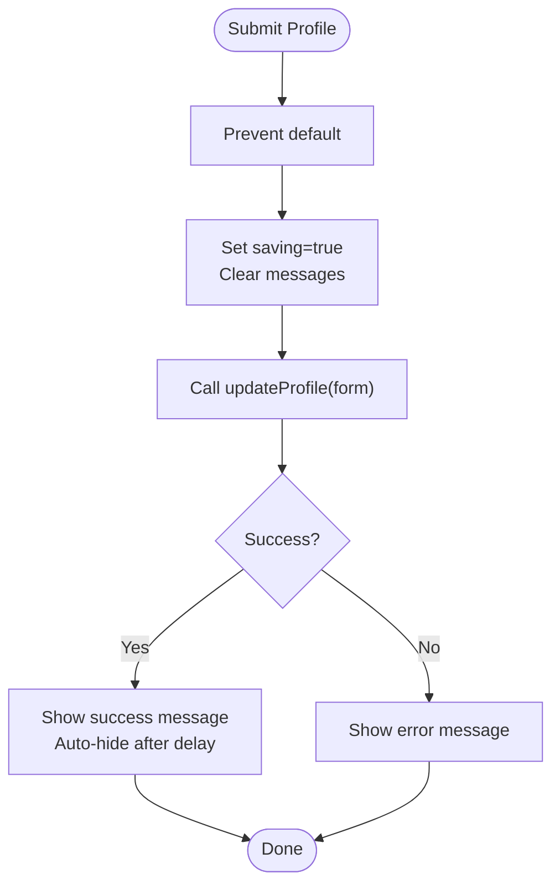
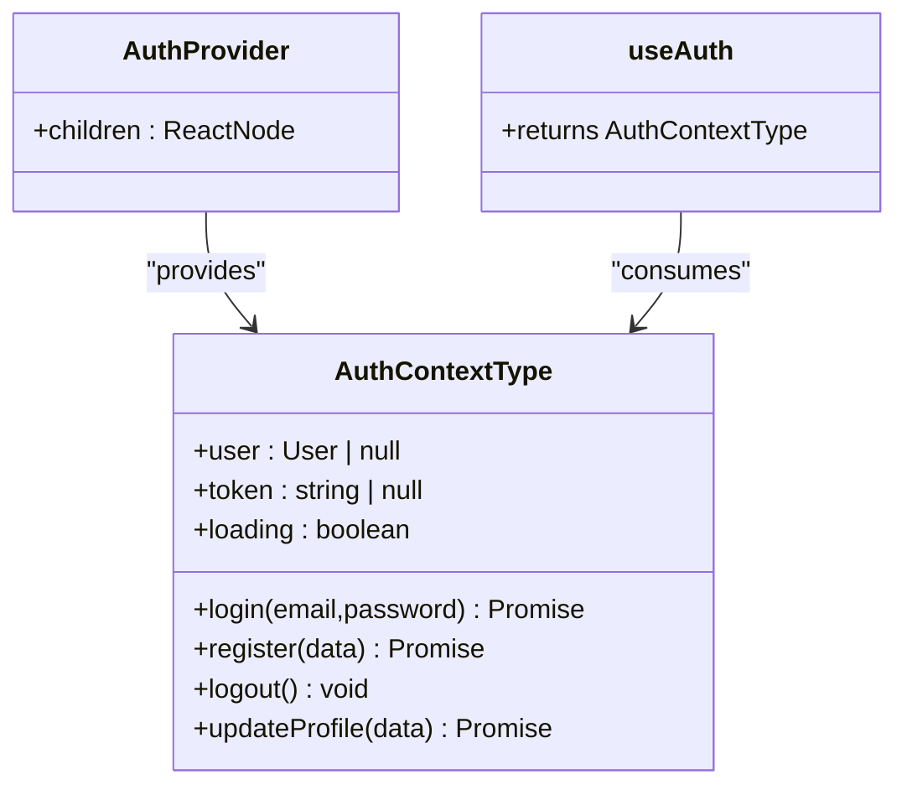
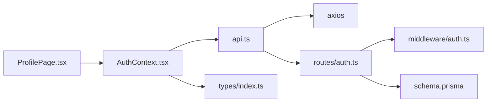

# Profile Management Page

<cite>
**Referenced Files in This Document**
- [ProfilePage.tsx](file://frontend/src/pages/ProfilePage.tsx)
- [AuthContext.tsx](file://frontend/src/context/AuthContext.tsx)
- [api.ts](file://frontend/src/services/api.ts)
- [index.ts (types)](file://frontend/src/types/index.ts)
- [auth.ts (routes)](file://backend/src/routes/auth.ts)
- [auth.ts (middleware)](file://backend/src/middleware/auth.ts)
- [schema.prisma](file://backend/prisma/schema.prisma)
</cite>

## Table of Contents
1. Introduction
2. Project Structure
3. Core Components
4. Architecture Overview
5. Detailed Component Analysis
6. Dependency Analysis
7. Performance Considerations
8. Troubleshooting Guide
9. Conclusion

## Introduction
This document explains the Profile Management Page that enables users to view and edit their account profile. It covers how personal details are displayed and updated, how authentication integrates with profile operations, error handling for failed updates, and success feedback mechanisms. It also clarifies data synchronization between the client-side profile state and server-side user records.

Note: The current implementation supports editing first name, last name, phone, and address. Email is read-only on this page. Password change, profile picture upload, and notification preferences are not implemented in the current codebase.

## Project Structure
The profile feature spans frontend UI, context-based authentication state, API client configuration, and backend routes with middleware and database schema.

**Diagram sources**
- [ProfilePage.tsx:1-88](file://frontend/src/pages/ProfilePage.tsx#L1-L88)
- [AuthContext.tsx:1-82](file://frontend/src/context/AuthContext.tsx#L1-L82)
- [api.ts:1-40](file://frontend/src/services/api.ts#L1-L40)
- [auth.ts (routes):1-168](file://backend/src/routes/auth.ts#L1-L168)
- [auth.ts (middleware):1-23](file://backend/src/middleware/auth.ts#L1-L23)
- [schema.prisma:10-25](file://backend/prisma/schema.prisma#L10-L25)

**Section sources**
- [ProfilePage.tsx:1-88](file://frontend/src/pages/ProfilePage.tsx#L1-L88)
- [AuthContext.tsx:1-82](file://frontend/src/context/AuthContext.tsx#L1-L82)
- [api.ts:1-40](file://frontend/src/services/api.ts#L1-L40)
- [auth.ts (routes):107-165](file://backend/src/routes/auth.ts#L107-L165)
- [auth.ts (middleware):5-22](file://backend/src/middleware/auth.ts#L5-L22)
- [schema.prisma:10-25](file://backend/prisma/schema.prisma#L10-L25)

## Core Components
- ProfilePage: Renders the user’s profile header, editable fields for first name, last name, phone, and address; displays success/error messages; submits changes via AuthContext.
- AuthContext: Provides user state, token management, and updateProfile method that calls the backend PUT /api/auth/profile and refreshes local user state.
- API Client: Axios instance that attaches Bearer tokens and handles 401 redirects.
- Backend Routes: GET /api/auth/profile and PUT /api/auth/profile protected by JWT middleware; update only provided fields.
- Database Schema: User model includes firstName, lastName, phone, address, email, timestamps, and admin flag.

Key responsibilities:
- Display current profile information (name, email).
- Allow editing of non-email profile fields.
- Persist changes securely using authenticated requests.
- Update local state upon successful server response.

**Section sources**
- [ProfilePage.tsx:5-88](file://frontend/src/pages/ProfilePage.tsx#L5-L88)
- [AuthContext.tsx:5-13](file://frontend/src/context/AuthContext.tsx#L5-L13)
- [AuthContext.tsx:63-66](file://frontend/src/context/AuthContext.tsx#L63-L66)
- [api.ts:11-24](file://frontend/src/services/api.ts#L11-L24)
- [auth.ts (routes):107-165](file://backend/src/routes/auth.ts#L107-L165)
- [schema.prisma:10-25](file://backend/prisma/schema.prisma#L10-L25)

## Architecture Overview
The profile update flow uses React state, a context provider, an HTTP client with auth headers, and a protected backend endpoint.

**Diagram sources**
- [ProfilePage.tsx:17-28](file://frontend/src/pages/ProfilePage.tsx#L17-L28)
- [AuthContext.tsx:63-66](file://frontend/src/context/AuthContext.tsx#L63-L66)
- [api.ts:11-24](file://frontend/src/services/api.ts#L11-L24)
- [auth.ts (routes):136-165](file://backend/src/routes/auth.ts#L136-L165)
- [auth.ts (middleware):5-22](file://backend/src/middleware/auth.ts#L5-L22)
- [schema.prisma:10-25](file://backend/prisma/schema.prisma#L10-L25)

## Detailed Component Analysis

### ProfilePage.tsx
- Displays user avatar initials and basic info (first name, last name, email).
- Form fields:
  - First Name: text input bound to form state.
  - Last Name: text input bound to form state.
  - Email: disabled input showing current email (read-only).
  - Phone: tel input bound to form state.
  - Address: textarea bound to form state.
- Submission:
  - Prevents default form behavior.
  - Sets saving state, clears previous messages.
  - Calls updateProfile from AuthContext.
  - Shows success message briefly on success; shows error message on failure.
- Validation:
  - No explicit client-side validation is implemented in this component.
  - Server-side validation occurs in the backend route for required fields during registration; profile update accepts partial updates.

**Diagram sources**
- [ProfilePage.tsx:17-28](file://frontend/src/pages/ProfilePage.tsx#L17-L28)
- [ProfilePage.tsx:33-84](file://frontend/src/pages/ProfilePage.tsx#L33-L84)

**Section sources**
- [ProfilePage.tsx:5-88](file://frontend/src/pages/ProfilePage.tsx#L5-L88)

### AuthContext.tsx
- Manages user state, token persistence, and lifecycle initialization.
- On app start, if a token exists, fetches the current profile to hydrate user state.
- updateProfile sends a PUT request to /api/auth/profile and sets the returned user into local state, ensuring UI reflects server data immediately.

**Diagram sources**
- [AuthContext.tsx:5-13](file://frontend/src/context/AuthContext.tsx#L5-L13)
- [AuthContext.tsx:17-73](file://frontend/src/context/AuthContext.tsx#L17-L73)
- [AuthContext.tsx:75-81](file://frontend/src/context/AuthContext.tsx#L75-L81)

**Section sources**
- [AuthContext.tsx:17-73](file://frontend/src/context/AuthContext.tsx#L17-L73)
- [AuthContext.tsx:63-66](file://frontend/src/context/AuthContext.tsx#L63-L66)

### API Client (api.ts)
- Base URL configured via environment variable or Vite proxy.
- Adds Authorization header with Bearer token when present.
- Handles multipart/form-data by removing Content-Type for FormData payloads.
- Intercepts 401 responses to clear auth state and redirect to login.

**Section sources**
- [api.ts:1-40](file://frontend/src/services/api.ts#L1-L40)

### Backend Authentication Routes (auth.ts)
- GET /api/auth/profile: Returns current user’s profile (excluding password) after verifying JWT.
- PUT /api/auth/profile: Updates only provided fields (firstName, lastName, phone, address) for the authenticated user.
- Error handling: returns appropriate status codes and error messages on failures.

**Section sources**
- [auth.ts (routes):107-165](file://backend/src/routes/auth.ts#L107-L165)

### Backend Authentication Middleware (auth.ts)
- Validates presence and format of Authorization header.
- Verifies JWT and attaches userId to request object.
- Rejects invalid or expired tokens with 401.

**Section sources**
- [auth.ts (middleware):5-22](file://backend/src/middleware/auth.ts#L5-L22)

### Data Model (schema.prisma)
- User model includes id, email, passwordHash, firstName, lastName, phone, address, isAdmin, createdAt, updatedAt.
- Optional fields allow partial updates without requiring all attributes.

**Section sources**
- [schema.prisma:10-25](file://backend/prisma/schema.prisma#L10-L25)

## Dependency Analysis
- ProfilePage depends on AuthContext for user state and updateProfile.
- AuthContext depends on api service for HTTP calls and types for shape of User and AuthResponse.
- api service depends on axios and environment configuration; it injects auth headers and handles 401 globally.
- Backend routes depend on Prisma client and JWT middleware to secure endpoints and persist changes.
- Types define shared contracts across frontend components and services.

**Diagram sources**
- [ProfilePage.tsx:1-88](file://frontend/src/pages/ProfilePage.tsx#L1-L88)
- [AuthContext.tsx:1-82](file://frontend/src/context/AuthContext.tsx#L1-L82)
- [api.ts:1-40](file://frontend/src/services/api.ts#L1-L40)
- [auth.ts (routes):1-168](file://backend/src/routes/auth.ts#L1-L168)
- [auth.ts (middleware):1-23](file://backend/src/middleware/auth.ts#L1-L23)
- [schema.prisma:10-25](file://backend/prisma/schema.prisma#L10-L25)

**Section sources**
- [ProfilePage.tsx:1-88](file://frontend/src/pages/ProfilePage.tsx#L1-L88)
- [AuthContext.tsx:1-82](file://frontend/src/context/AuthContext.tsx#L1-L82)
- [api.ts:1-40](file://frontend/src/services/api.ts#L1-L40)
- [auth.ts (routes):1-168](file://backend/src/routes/auth.ts#L1-L168)
- [auth.ts (middleware):1-23](file://backend/src/middleware/auth.ts#L1-L23)
- [schema.prisma:10-25](file://backend/prisma/schema.prisma#L10-L25)

## Performance Considerations
- Minimal re-renders: ProfilePage updates local form state and toggles a small set of booleans/messages.
- Optimistic UX: Saving state disables the submit button to prevent duplicate submissions.
- Network efficiency: Only changed fields are sent to the server due to partial updates on the backend.
- Token caching: Token stored in localStorage avoids repeated logins; profile hydration runs once on app start.

[No sources needed since this section provides general guidance]

## Troubleshooting Guide
Common issues and resolutions:
- 401 Unauthorized on profile update:
  - Cause: Missing or invalid/expired token.
  - Resolution: Ensure token exists in localStorage; the API interceptor will clear stale tokens and redirect to login.
- Failed to update profile:
  - Cause: Network errors or server-side validation failures.
  - Resolution: Check network tab for error responses; verify payload contains allowed fields; review backend logs.
- Success message disappears too quickly:
  - Behavior: Success message auto-hides after a short delay. Adjust timing if needed.
- Email cannot be edited:
  - Behavior: Email field is disabled on the profile page. If email changes are required, implement a dedicated email update flow with verification.

**Section sources**
- [api.ts:26-37](file://frontend/src/services/api.ts#L26-L37)
- [ProfilePage.tsx:17-28](file://frontend/src/pages/ProfilePage.tsx#L17-L28)
- [auth.ts (routes):136-165](file://backend/src/routes/auth.ts#L136-L165)

## Conclusion
The Profile Management Page provides a focused interface for updating core user profile fields with secure, authenticated requests and immediate UI feedback. It integrates tightly with the authentication context to keep client state synchronized with server records. While password changes, profile picture uploads, and notification preferences are not currently implemented, the existing architecture supports extending these features by adding new fields, validations, and backend endpoints following the established patterns.

[No sources needed since this section summarizes without analyzing specific files]