# User Pages

<cite>
**Referenced Files in This Document**
- [DashboardPage.tsx](file://frontend/src/pages/DashboardPage.tsx)
- [VehiclesPage.tsx](file://frontend/src/pages/VehiclesPage.tsx)
- [PoliciesPage.tsx](file://frontend/src/pages/PoliciesPage.tsx)
- [ClaimsPage.tsx](file://frontend/src/pages/ClaimsPage.tsx)
- [NewClaimPage.tsx](file://frontend/src/pages/NewClaimPage.tsx)
- [ClaimDetailPage.tsx](file://frontend/src/pages/ClaimDetailPage.tsx)
- [LoginPage.tsx](file://frontend/src/pages/LoginPage.tsx)
- [RegisterPage.tsx](file://frontend/src/pages/RegisterPage.tsx)
- [ProfilePage.tsx](file://frontend/src/pages/ProfilePage.tsx)
- [AuthContext.tsx](file://frontend/src/context/AuthContext.tsx)
- [api.ts](file://frontend/src/services/api.ts)
- [index.ts (types)](file://frontend/src/types/index.ts)
</cite>

## Table of Contents
1. Introduction
2. Project Structure
3. Core Components
4. Architecture Overview
5. Detailed Component Analysis
6. Dependency Analysis
7. Performance Considerations
8. Troubleshooting Guide
9. Conclusion

## Introduction
This document provides comprehensive, user-facing documentation for the insurance claim system’s frontend pages. It covers the Dashboard, Vehicles, Policies, Claims, New Claim submission workflow, Claim Detail view, authentication flows (Login and Register), and Profile management. For each page, we explain data fetching patterns, form validation, file upload handling, error states, and navigation between related pages.

## Project Structure
The user-facing pages are implemented as React components under the frontend/src/pages directory. Data is fetched via a centralized Axios client that injects authentication tokens and handles 401 redirects. Shared types define the shape of users, vehicles, policies, claims, images, documents, assessments, estimates, payouts, and chat messages.

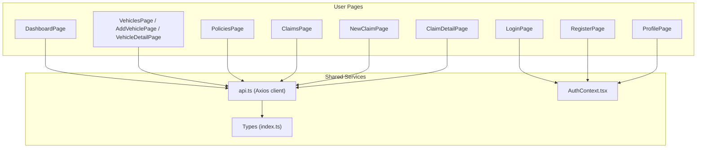

**Diagram sources**
- [DashboardPage.tsx:1-142](file://frontend/src/pages/DashboardPage.tsx#L1-L142)
- [VehiclesPage.tsx:1-369](file://frontend/src/pages/VehiclesPage.tsx#L1-L369)
- [PoliciesPage.tsx:1-102](file://frontend/src/pages/PoliciesPage.tsx#L1-L102)
- [ClaimsPage.tsx:1-98](file://frontend/src/pages/ClaimsPage.tsx#L1-L98)
- [NewClaimPage.tsx:1-252](file://frontend/src/pages/NewClaimPage.tsx#L1-L252)
- [ClaimDetailPage.tsx:1-431](file://frontend/src/pages/ClaimDetailPage.tsx#L1-L431)
- [LoginPage.tsx:1-105](file://frontend/src/pages/LoginPage.tsx#L1-L105)
- [RegisterPage.tsx:1-102](file://frontend/src/pages/RegisterPage.tsx#L1-L102)
- [ProfilePage.tsx:1-88](file://frontend/src/pages/ProfilePage.tsx#L1-L88)
- [api.ts:1-40](file://frontend/src/services/api.ts#L1-L40)
- [AuthContext.tsx:1-82](file://frontend/src/context/AuthContext.tsx#L1-L82)
- [index.ts (types):1-150](file://frontend/src/types/index.ts#L1-L150)

**Section sources**
- [api.ts:1-40](file://frontend/src/services/api.ts#L1-L40)
- [AuthContext.tsx:1-82](file://frontend/src/context/AuthContext.tsx#L1-L82)
- [index.ts (types):1-150](file://frontend/src/types/index.ts#L1-L150)

## Core Components
- DashboardPage: Aggregates counts for vehicles, active claims, total claims; shows recent claims and quick actions to create a new claim or add a vehicle.
- VehiclesPage: Lists user vehicles with links to details; includes an AddVehiclePage with AI-assisted image detection and manual form entry; VehicleDetailPage shows vehicle info and claim history.
- PoliciesPage: Lists insurance policies and allows adding/deleting policies via a simple form.
- ClaimsPage: Lists claims with status filtering and links to detail views.
- NewClaimPage: Multi-step wizard for incident info, photo uploads (full vehicle and damage close-ups), review, and submission; uploads images and submits the claim.
- ClaimDetailPage: Displays full claim details including images, AI damage assessment, repair estimate, payout estimate, document verification, progress checklist, suggestions, and an AI assistant chat sidebar.
- LoginPage and RegisterPage: Authentication flows using AuthContext; redirect to dashboard on success.
- ProfilePage: Editable profile fields with save feedback.

**Section sources**
- [DashboardPage.tsx:1-142](file://frontend/src/pages/DashboardPage.tsx#L1-L142)
- [VehiclesPage.tsx:1-369](file://frontend/src/pages/VehiclesPage.tsx#L1-L369)
- [PoliciesPage.tsx:1-102](file://frontend/src/pages/PoliciesPage.tsx#L1-L102)
- [ClaimsPage.tsx:1-98](file://frontend/src/pages/ClaimsPage.tsx#L1-L98)
- [NewClaimPage.tsx:1-252](file://frontend/src/pages/NewClaimPage.tsx#L1-L252)
- [ClaimDetailPage.tsx:1-431](file://frontend/src/pages/ClaimDetailPage.tsx#L1-L431)
- [LoginPage.tsx:1-105](file://frontend/src/pages/LoginPage.tsx#L1-L105)
- [RegisterPage.tsx:1-102](file://frontend/src/pages/RegisterPage.tsx#L1-L102)
- [ProfilePage.tsx:1-88](file://frontend/src/pages/ProfilePage.tsx#L1-L88)

## Architecture Overview
The frontend uses a consistent pattern:
- Data fetching via api.ts (Axios instance) which automatically attaches Bearer tokens from localStorage and redirects to login on 401 errors.
- Authentication state managed by AuthContext, exposing login/register/logout/updateProfile and persisting token/user in localStorage.
- Page components fetch data on mount or user interactions, manage local UI state (loading, errors, forms), and navigate using React Router.

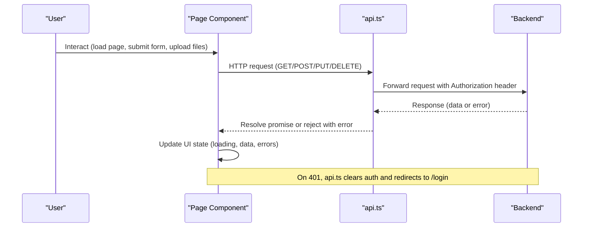

**Diagram sources**
- [api.ts:1-40](file://frontend/src/services/api.ts#L1-L40)
- [AuthContext.tsx:1-82](file://frontend/src/context/AuthContext.tsx#L1-L82)

## Detailed Component Analysis

### DashboardPage
- Purpose: Provide an overview of user activity with statistics cards (vehicles, active claims, total claims), quick action buttons, and recent claims list.
- Data fetching: Fetches vehicles and claims concurrently on mount; displays loading spinner while data loads.
- UI behavior:
  - Status badges use color mapping based on claim status.
  - Recent claims show up to five items; clicking navigates to claim detail.
  - Quick actions navigate to new claim creation and vehicle registration.
- Error handling: Logs errors to console; no explicit user-facing error toast.
- Navigation: Uses React Router Link to /claims/new and /vehicles/new.

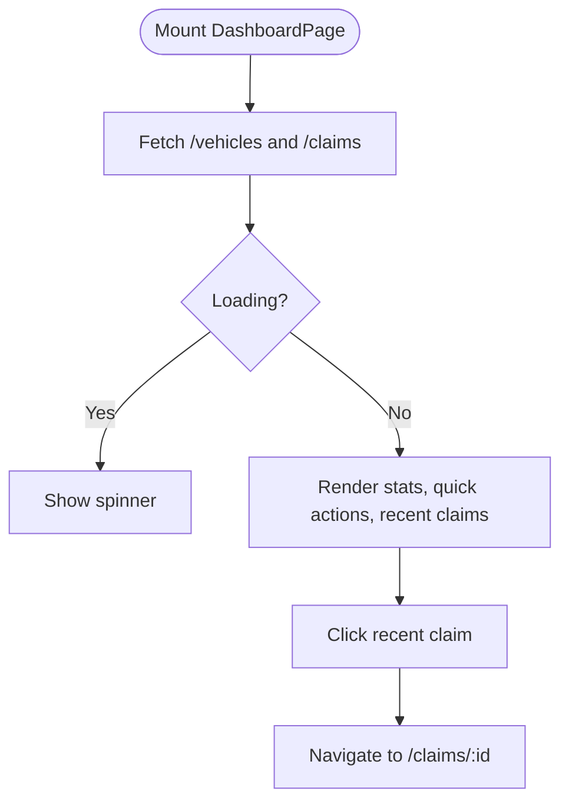

**Diagram sources**
- [DashboardPage.tsx:14-27](file://frontend/src/pages/DashboardPage.tsx#L14-L27)
- [DashboardPage.tsx:55-138](file://frontend/src/pages/DashboardPage.tsx#L55-L138)

**Section sources**
- [DashboardPage.tsx:1-142](file://frontend/src/pages/DashboardPage.tsx#L1-L142)

### VehiclesPage (List, Detail, Add)
- List (VehiclesPage):
  - Fetches vehicles on mount; shows empty state if none; grid of vehicle cards linking to detail.
- Detail (VehicleDetailPage):
  - Fetches single vehicle by ID; shows VIN, license plate, mileage, color; allows deletion; lists associated claims; quick link to file a claim for this vehicle.
- Add (AddVehiclePage):
  - AI-assisted vehicle recognition via image upload; drag-and-drop zone; sends image to /vehicles/detect; auto-fills form fields when confidence is acceptable; manual fallback fields for make, model, year, color, license plate, optional VIN and mileage; validates required fields via HTML attributes; posts to /vehicles; navigates to created vehicle detail on success.

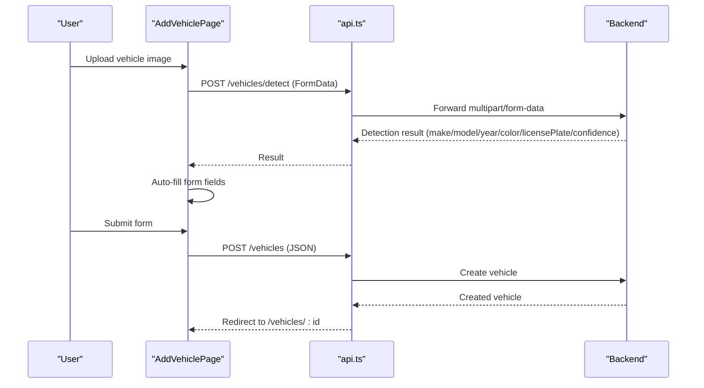

**Diagram sources**
- [VehiclesPage.tsx:124-369](file://frontend/src/pages/VehiclesPage.tsx#L124-L369)

**Section sources**
- [VehiclesPage.tsx:1-369](file://frontend/src/pages/VehiclesPage.tsx#L1-L369)

### PoliciesPage
- Purpose: Manage insurance policies (list, add, delete).
- Data fetching: Loads policies on mount; toggles inline form to add policy; deletes policy by ID.
- Form validation: Required fields enforced via HTML attributes; selects coverage type; numeric inputs for deductible and premium; date inputs for start/end dates.
- Error handling: Displays server-provided error message if submission fails.

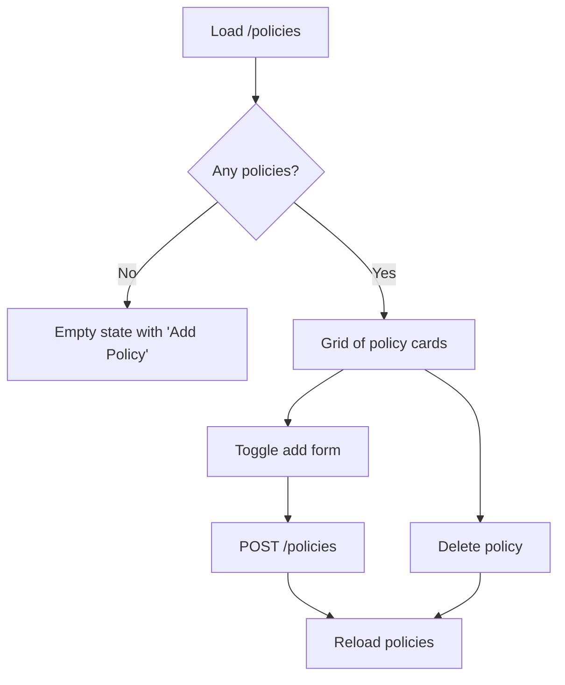

**Diagram sources**
- [PoliciesPage.tsx:6-102](file://frontend/src/pages/PoliciesPage.tsx#L6-L102)

**Section sources**
- [PoliciesPage.tsx:1-102](file://frontend/src/pages/PoliciesPage.tsx#L1-L102)

### ClaimsPage
- Purpose: List user claims with status filter and quick access to create new claim.
- Data fetching: Fetches claims with optional ?status query parameter; updates on filter change.
- UI behavior: Shows severity badge if present; displays image count; links to claim detail.

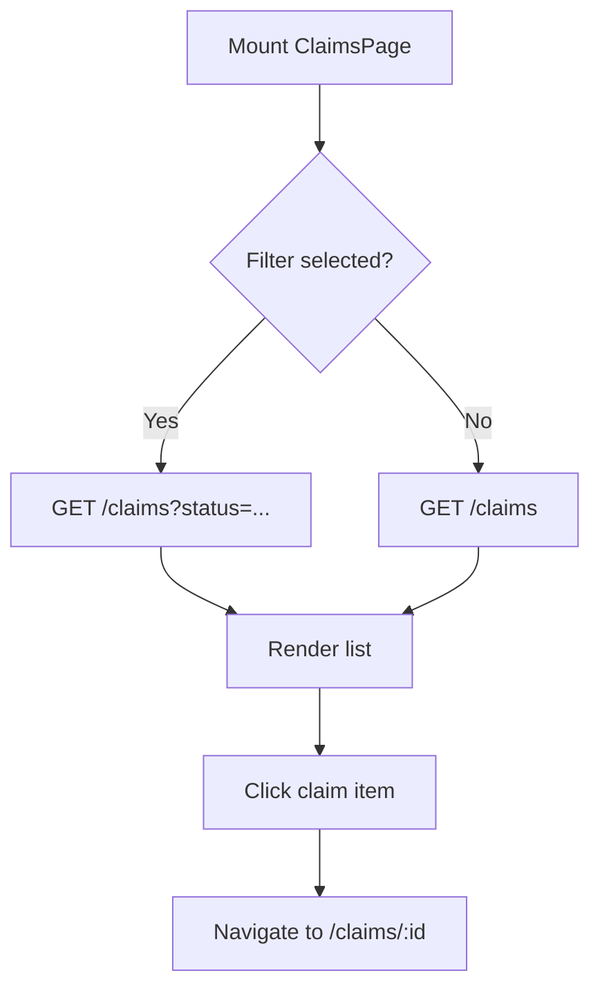

**Diagram sources**
- [ClaimsPage.tsx:22-98](file://frontend/src/pages/ClaimsPage.tsx#L22-L98)

**Section sources**
- [ClaimsPage.tsx:1-98](file://frontend/src/pages/ClaimsPage.tsx#L1-L98)

### NewClaimPage
- Purpose: Guided multi-step workflow to create and submit a claim with photos.
- Steps:
  1. Incident Info: Select vehicle (pre-filled via URL param), optional policy, incident date/location/description, weather, police report checkbox.
  2. Full Vehicle Photos: Drag-and-drop multiple images; previews shown; removal supported.
  3. Damage Close-up Photos: Drag-and-drop multiple images; previews shown; removal supported.
  4. Review & Submit: Summary of inputs and uploaded images; submit triggers creation, image uploads, and final submission.
- Data flow:
  - If no existing claimId, creates claim via POST /claims; then uploads images via POST /claims/:id/images (multipart/form-data); finally submits via POST /claims/:id/submit.
- Validation: Step gating ensures required fields before proceeding; disabled Next button until conditions met.
- Error handling: Displays error banner on failure; loading states during submission.

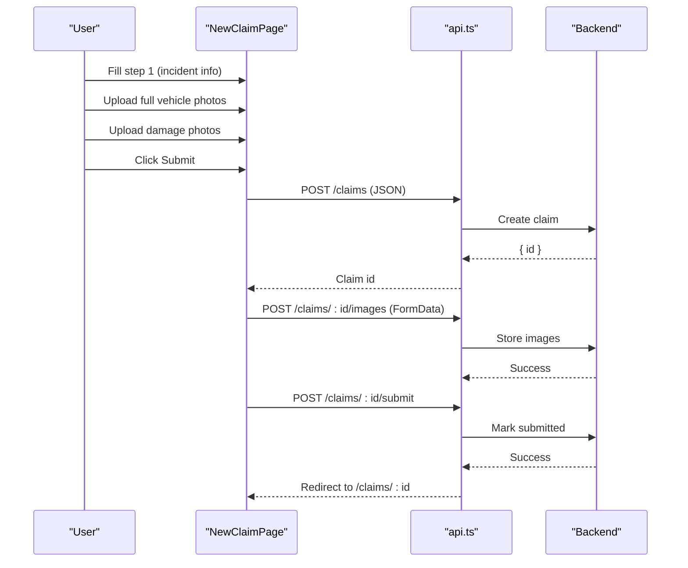

**Diagram sources**
- [NewClaimPage.tsx:10-252](file://frontend/src/pages/NewClaimPage.tsx#L10-L252)

**Section sources**
- [NewClaimPage.tsx:1-252](file://frontend/src/pages/NewClaimPage.tsx#L1-L252)

### ClaimDetailPage
- Purpose: Comprehensive view of a single claim with rich features:
  - Images gallery with labels (Full vs Damage).
  - AI damage assessment with re-analysis trigger.
  - Repair estimate breakdown and totals.
  - Insurance payout estimate display.
  - Document upload and verification per type (LICENSE, REGISTRATION, ACCIDENT_REPORT, REPAIR_ESTIMATE).
  - Progress checklist computed from claim state.
  - Suggestions derived from current claim state.
  - AI Assistant chat sidebar with quick prompts.
- Data fetching:
  - Fetches claim by ID on mount; navigates back to claims list on error.
  - Triggers analysis, document upload, verification, and chat via dedicated endpoints.
- File uploads:
  - Documents uploaded via POST /claims/:id/documents with FormData (document + documentType).
  - Verification triggered via POST /claims/:id/documents/:docId/verify.
- Chat:
  - Sends messages via POST /claims/:id/chat; refreshes claim to display updated messages.
- Error handling:
  - Alerts on failures for analysis, upload, verification, and chat; loading indicators during operations.

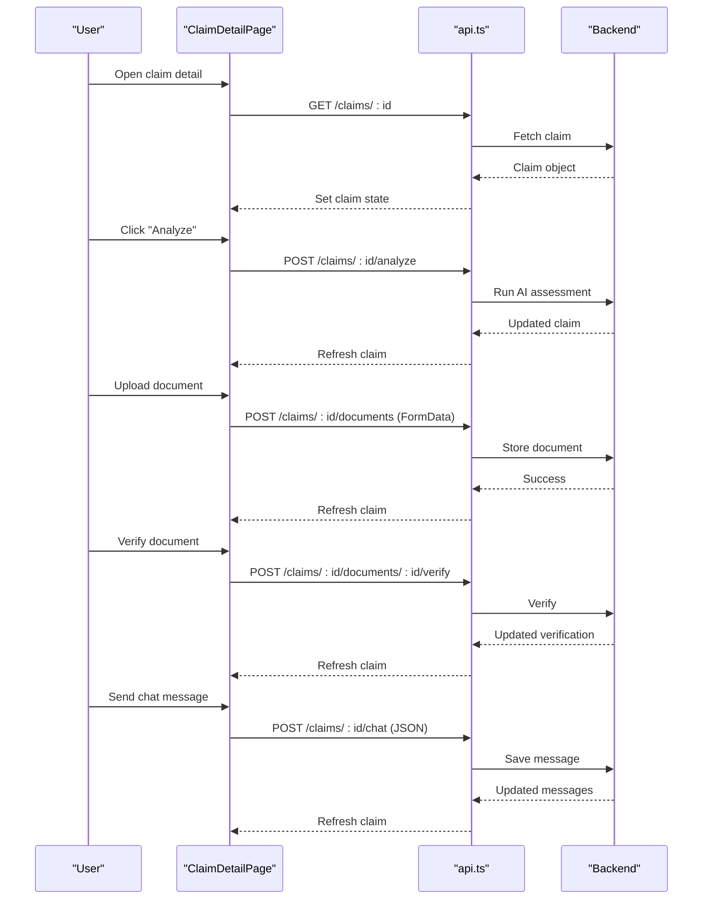

**Diagram sources**
- [ClaimDetailPage.tsx:17-67](file://frontend/src/pages/ClaimDetailPage.tsx#L17-L67)
- [ClaimDetailPage.tsx:27-55](file://frontend/src/pages/ClaimDetailPage.tsx#L27-L55)

**Section sources**
- [ClaimDetailPage.tsx:1-431](file://frontend/src/pages/ClaimDetailPage.tsx#L1-L431)

### LoginPage
- Purpose: Authenticate user and redirect to dashboard.
- Flow:
  - Collects email/password; calls AuthContext.login; stores token and user in localStorage; navigates to /dashboard.
  - Displays error banner from server response if login fails.
- Navigation: Links to register page and admin portal.

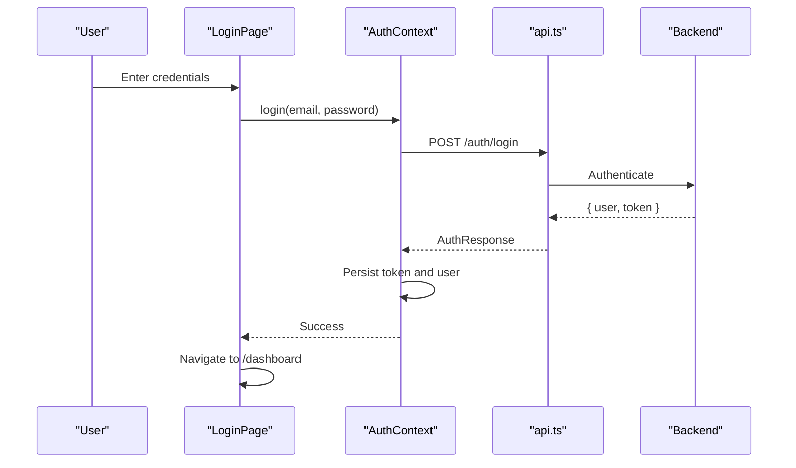

**Diagram sources**
- [LoginPage.tsx:14-27](file://frontend/src/pages/LoginPage.tsx#L14-L27)
- [AuthContext.tsx:38-45](file://frontend/src/context/AuthContext.tsx#L38-L45)

**Section sources**
- [LoginPage.tsx:1-105](file://frontend/src/pages/LoginPage.tsx#L1-L105)
- [AuthContext.tsx:1-82](file://frontend/src/context/AuthContext.tsx#L1-L82)

### RegisterPage
- Purpose: Create a new user account and redirect to dashboard.
- Flow:
  - Collects first name, last name, email, password (min length), optional phone; calls AuthContext.register; persists token and user; navigates to /dashboard.
  - Displays error banner on failure.

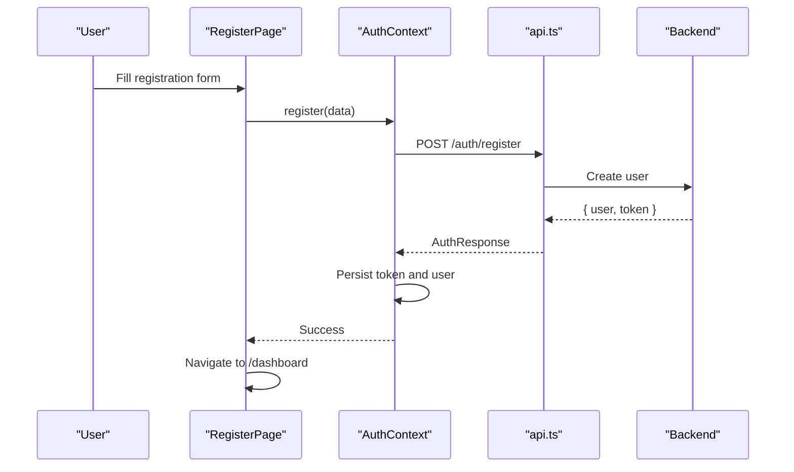

**Diagram sources**
- [RegisterPage.tsx:13-26](file://frontend/src/pages/RegisterPage.tsx#L13-L26)
- [AuthContext.tsx:47-54](file://frontend/src/context/AuthContext.tsx#L47-L54)

**Section sources**
- [RegisterPage.tsx:1-102](file://frontend/src/pages/RegisterPage.tsx#L1-L102)
- [AuthContext.tsx:1-82](file://frontend/src/context/AuthContext.tsx#L1-L82)

### ProfilePage
- Purpose: Allow users to update personal information (first name, last name, phone, address). Email is read-only.
- Flow:
  - Pre-populates form with current user data from AuthContext; submits via PUT /auth/profile; shows success/error banners; disables save during update.

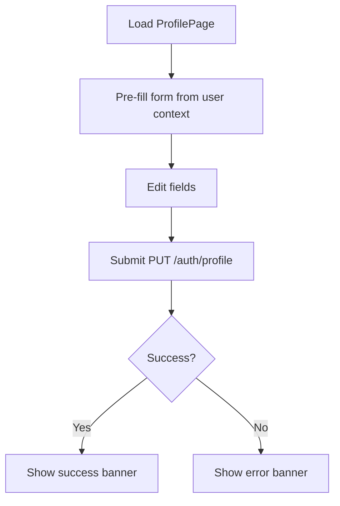

**Diagram sources**
- [ProfilePage.tsx:17-28](file://frontend/src/pages/ProfilePage.tsx#L17-L28)
- [AuthContext.tsx:63-66](file://frontend/src/context/AuthContext.tsx#L63-L66)

**Section sources**
- [ProfilePage.tsx:1-88](file://frontend/src/pages/ProfilePage.tsx#L1-L88)
- [AuthContext.tsx:1-82](file://frontend/src/context/AuthContext.tsx#L1-L82)

## Dependency Analysis
- All pages depend on api.ts for HTTP requests; it centralizes base URL configuration, automatic Authorization header injection, and 401 handling.
- Authentication-dependent pages rely on AuthContext for user state and actions (login, register, logout, update profile).
- Types ensure consistent data shapes across components and services.

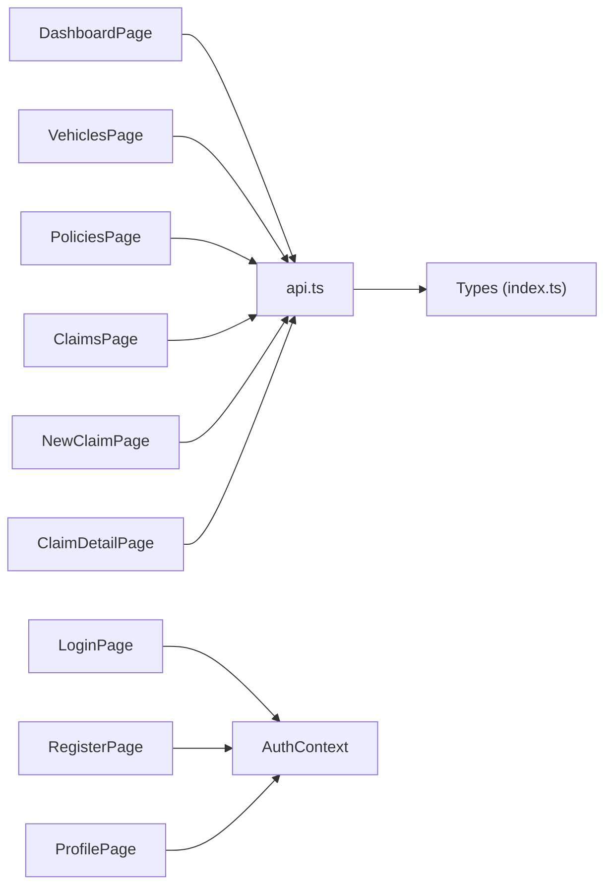

**Diagram sources**
- [api.ts:1-40](file://frontend/src/services/api.ts#L1-L40)
- [AuthContext.tsx:1-82](file://frontend/src/context/AuthContext.tsx#L1-L82)
- [index.ts (types):1-150](file://frontend/src/types/index.ts#L1-L150)

**Section sources**
- [api.ts:1-40](file://frontend/src/services/api.ts#L1-L40)
- [AuthContext.tsx:1-82](file://frontend/src/context/AuthContext.tsx#L1-L82)
- [index.ts (types):1-150](file://frontend/src/types/index.ts#L1-L150)

## Performance Considerations
- Concurrent data fetching: DashboardPage uses Promise.all to fetch vehicles and claims simultaneously, reducing load time.
- Conditional rendering: Pages show loading spinners and empty states to improve perceived performance.
- Image handling: NewClaimPage and AddVehiclePage use drag-and-drop with preview URLs; consider debouncing large uploads and validating file sizes on the backend.
- Re-renders: Use memoization where appropriate (e.g., computed suggestions in ClaimDetailPage) to avoid unnecessary recalculations.

[No sources needed since this section provides general guidance]

## Troubleshooting Guide
- 401 Unauthorized: api.ts interceptors clear stored tokens and redirect to /login; ensure login flow completes successfully and token is persisted.
- Form submission errors: Each page captures server error messages and displays them in banners; check network tab for detailed payloads.
- File upload issues: Ensure Content-Type is not manually set for FormData; api.ts removes Content-Type for multipart requests automatically.
- Navigation errors: Some pages navigate conditionally (e.g., ClaimDetailPage navigates back on fetch failure); verify route parameters and IDs.

**Section sources**
- [api.ts:26-37](file://frontend/src/services/api.ts#L26-L37)
- [ClaimDetailPage.tsx:17-23](file://frontend/src/pages/ClaimDetailPage.tsx#L17-L23)
- [NewClaimPage.tsx:72-94](file://frontend/src/pages/NewClaimPage.tsx#L72-L94)
- [VehiclesPage.tsx:190-202](file://frontend/src/pages/VehiclesPage.tsx#L190-L202)

## Conclusion
The user-facing pages implement a cohesive, modular architecture centered around a shared API client and authentication context. They provide intuitive workflows for managing vehicles, policies, and claims, with robust support for image/document uploads, AI-assisted features, and real-time status tracking. Consistent error handling and navigation patterns ensure a smooth user experience across the application.

[No sources needed since this section summarizes without analyzing specific files]