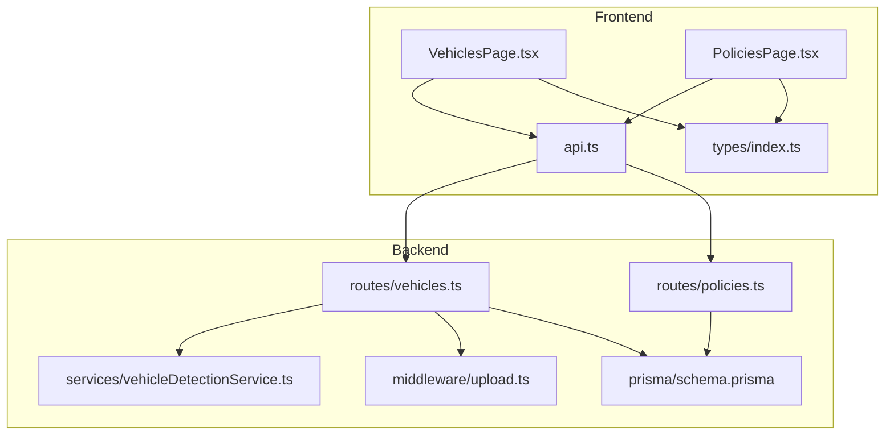
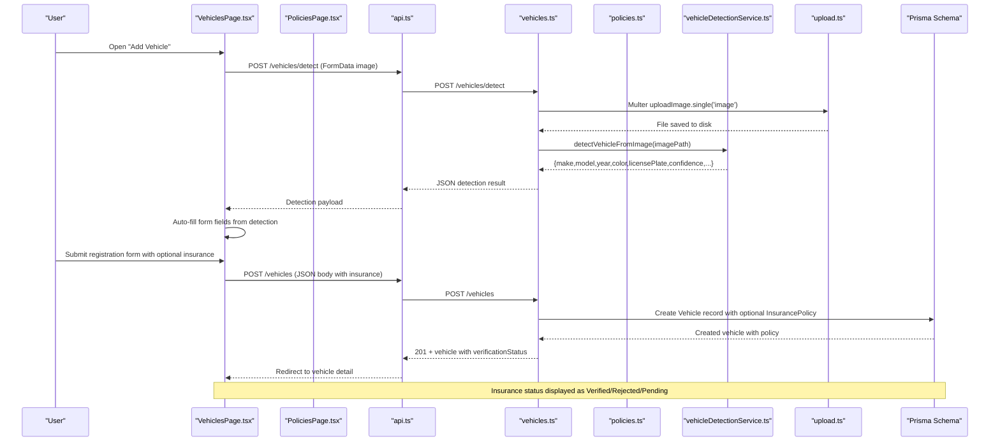
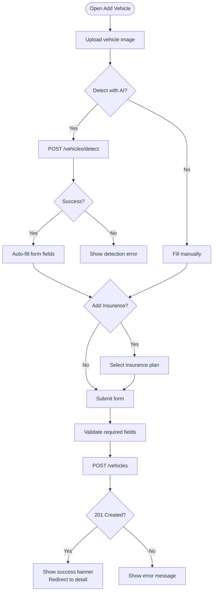
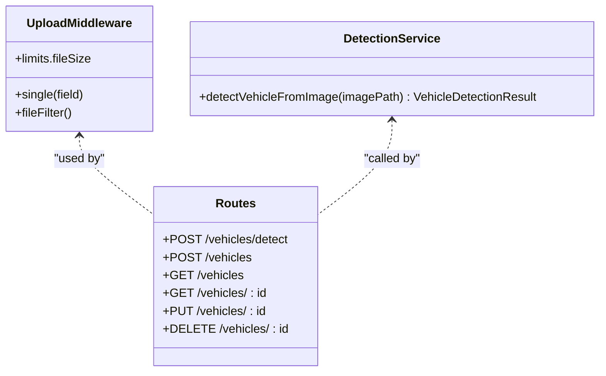
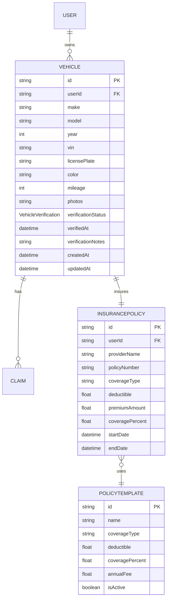
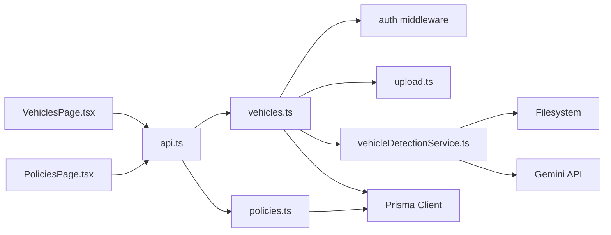

# Vehicle Management Page

<cite>
**Referenced Files in This Document**
- [VehiclesPage.tsx](file://frontend/src/pages/VehiclesPage.tsx)
- [api.ts](file://frontend/src/services/api.ts)
- [index.ts (types)](file://frontend/src/types/index.ts)
- [vehicles.ts](file://backend/src/routes/vehicles.ts)
- [vehicleDetectionService.ts](file://backend/src/services/vehicleDetectionService.ts)
- [upload.ts](file://backend/src/middleware/upload.ts)
- [schema.prisma](file://backend/prisma/schema.prisma)
- [PoliciesPage.tsx](file://frontend/src/pages/PoliciesPage.tsx)
- [policies.ts](file://backend/src/routes/policies.ts)
</cite>

## Update Summary
**Changes Made**
- Enhanced vehicle listing interface with comprehensive insurance status display showing verification states (verified, rejected, pending)
- Added detailed per-vehicle policy information including coverage details, deductible amounts, premium costs, and expiration dates
- Implemented claim availability indicators based on vehicle verification status
- Integrated insurance policy management with automatic re-verification when policies are updated or deleted
- Enhanced vehicle detail page with complete insurance policy card and verification status messaging

## Table of Contents
1. [Introduction](#introduction)
2. [Project Structure](#project-structure)
3. [Core Components](#core-components)
4. [Architecture Overview](#architecture-overview)
5. [Detailed Component Analysis](#detailed-component-analysis)
6. [Insurance Status Display System](#insurance-status-display-system)
7. [Policy Management Integration](#policy-management-integration)
8. [Dependency Analysis](#dependency-analysis)
9. [Performance Considerations](#performance-considerations)
10. [Troubleshooting Guide](#troubleshooting-guide)
11. [Conclusion](#conclusion)

## Introduction
This document explains the Vehicles page that enables users to register and manage vehicles, view a list of their vehicles, inspect vehicle details, and file claims for a selected vehicle. The system now includes comprehensive insurance status tracking with verification states, detailed policy information display, and claim availability controls based on insurance verification. It covers:
- Listing vehicles with counts, quick navigation, and insurance verification status badges
- Viewing detailed vehicle information including make, model, year, VIN, license plate, color, mileage, and comprehensive insurance policy details
- Registering new vehicles via a form with validation, optional AI-assisted auto-fill from uploaded images, and optional insurance policy selection
- Data fetching patterns, error handling, and success feedback mechanisms
- Integration with vehicle detection services powered by Gemini
- Comprehensive insurance status display showing verification states (verified, rejected, pending), claim availability indicators, and per-vehicle policy information including coverage details and expiration dates
- How vehicle data is structured across frontend types and backend schema

## Project Structure
The vehicle management feature spans both frontend and backend with enhanced insurance integration:
- Frontend pages and services handle UI, state, API calls, user interactions, and insurance status display
- Backend routes expose REST endpoints for CRUD operations, AI detection, and insurance policy management
- Prisma schema defines the Vehicle model with verification status, InsurancePolicy relationships, and PolicyTemplate associations
- Upload middleware handles image storage and validation for vehicle photos and AI detection

**Diagram sources**
- [VehiclesPage.tsx:1-521](file://frontend/src/pages/VehiclesPage.tsx#L1-L521)
- [PoliciesPage.tsx:1-196](file://frontend/src/pages/PoliciesPage.tsx#L1-L196)
- [api.ts:1-40](file://frontend/src/services/api.ts#L1-L40)
- [vehicles.ts:1-202](file://backend/src/routes/vehicles.ts#L1-L202)
- [policies.ts:1-213](file://backend/src/routes/policies.ts#L1-L213)
- [vehicleDetectionService.ts:1-96](file://backend/src/services/vehicleDetectionService.ts#L1-L96)
- [upload.ts:1-54](file://backend/src/middleware/upload.ts#L1-L54)
- [schema.prisma:1-299](file://backend/prisma/schema.prisma#L1-L299)

**Section sources**
- [VehiclesPage.tsx:1-521](file://frontend/src/pages/VehiclesPage.tsx#L1-L521)
- [PoliciesPage.tsx:1-196](file://frontend/src/pages/PoliciesPage.tsx#L1-L196)
- [vehicles.ts:1-202](file://backend/src/routes/vehicles.ts#L1-L202)
- [schema.prisma:1-299](file://backend/prisma/schema.prisma#L1-L299)

## Core Components
- **Enhanced Vehicle listing interface**: Displays all user-owned vehicles with key fields, claim count, and comprehensive insurance verification status badges (Verified, Rejected, Pending)
- **Comprehensive Vehicle detail display**: Shows make, model, year, VIN, license plate, color, mileage, detailed insurance policy information including coverage type, deductible, premium amount, coverage percentage, and expiration date; supports deletion
- **Vehicle registration form**: Validates required fields, supports optional VIN and mileage, integrates AI detection via image upload to auto-fill fields, and includes optional insurance policy selection during registration
- **Data fetching**: Uses a centralized Axios instance to call backend endpoints with authentication headers and redirects on 401
- **Error handling**: Centralized 401 redirect; route-level errors returned as JSON messages; UI shows inline errors or alerts
- **Success feedback**: Inline success banner and automatic redirection after successful registration
- **Insurance status management**: Automatic re-verification triggers when policies are updated or deleted, ensuring claim availability reflects current insurance status

**Section sources**
- [VehiclesPage.tsx:8-78](file://frontend/src/pages/VehiclesPage.tsx#L8-L78)
- [VehiclesPage.tsx:80-202](file://frontend/src/pages/VehiclesPage.tsx#L80-L202)
- [VehiclesPage.tsx:204-521](file://frontend/src/pages/VehiclesPage.tsx#L204-L521)
- [PoliciesPage.tsx:7-196](file://frontend/src/pages/PoliciesPage.tsx#L7-L196)
- [api.ts:1-40](file://frontend/src/services/api.ts#L1-L40)
- [vehicles.ts:34-202](file://backend/src/routes/vehicles.ts#L34-L202)

## Architecture Overview
The Vehicles page follows a client-server architecture with clear separation of concerns and enhanced insurance integration:
- The React page fetches and renders vehicle data via a typed API client with comprehensive insurance status display
- Backend routes enforce authentication and delegate to Prisma for persistence with insurance policy relationships
- Image uploads are handled by middleware before being processed by the detection service
- Detection results are used to pre-populate the registration form
- Insurance policy management automatically triggers re-verification processes when policies are modified

**Diagram sources**
- [VehiclesPage.tsx:204-521](file://frontend/src/pages/VehiclesPage.tsx#L204-L521)
- [PoliciesPage.tsx:29-57](file://frontend/src/pages/PoliciesPage.tsx#L29-L57)
- [api.ts:1-40](file://frontend/src/services/api.ts#L1-L40)
- [vehicles.ts:15-94](file://backend/src/routes/vehicles.ts#L15-L94)
- [policies.ts:183-213](file://backend/src/routes/policies.ts#L183-L213)
- [vehicleDetectionService.ts:46-95](file://backend/src/services/vehicleDetectionService.ts#L46-L95)
- [upload.ts:17-47](file://backend/src/middleware/upload.ts#L17-L47)
- [schema.prisma:32-100](file://backend/prisma/schema.prisma#L32-L100)

## Detailed Component Analysis

### Enhanced Vehicle Listing Interface
- Loads the current user's vehicles on mount and displays them in a responsive grid with comprehensive insurance status badges
- Each card shows make/model/year, license plate, color, mileage (if present), claim count, and verification status (Verified/Rejected/Pending)
- Empty state guides users to add a vehicle
- Navigation to detail page and registration form
- Verification status badges use color-coded indicators: green for verified, red for rejected, amber for pending

Data flow:
- GET /api/vehicles returns a list enriched with claim counts and insurance policy information
- Errors during fetch are caught and loading state is reset

**Updated** Enhanced with comprehensive insurance status display showing verification states and claim availability indicators

**Section sources**
- [VehiclesPage.tsx:8-78](file://frontend/src/pages/VehiclesPage.tsx#L8-L78)
- [vehicles.ts:96-113](file://backend/src/routes/vehicles.ts#L96-L113)

### Comprehensive Vehicle Detail Display
- Fetches a single vehicle by ID and includes related claims and insurance policy details
- Displays core attributes: make, model, year, VIN, license plate, color, mileage
- Shows detailed insurance policy card with coverage type, deductible, premium amount, coverage percentage, and expiration date
- Provides a link to file a claim for this vehicle (only when verified)
- Supports deletion with confirmation and navigation back to the list
- Includes verification status messaging with specific guidance for each state

Error handling:
- If the vehicle is not found, the user is redirected to the vehicles list

**Updated** Enhanced with comprehensive insurance policy display and verification status messaging

**Section sources**
- [VehiclesPage.tsx:80-202](file://frontend/src/pages/VehiclesPage.tsx#L80-L202)
- [vehicles.ts:115-144](file://backend/src/routes/vehicles.ts#L115-L144)

### Vehicle Registration Form
- Fields: make, model, year, license plate, color (required); vin, mileage (optional)
- Validation: HTML5 required and numeric constraints enforced; backend validates presence of required fields
- AI-assisted auto-fill:
  - Drag-and-drop or browse to upload a vehicle photo
  - Sends FormData to /vehicles/detect
  - On success, populates form fields where detection confidence is acceptable
  - Displays confidence level and additional info when available
- Optional insurance policy selection during registration
- Submission workflow:
  - POST /vehicles with form values and optional insurance
  - On success, show a success banner and redirect to the newly created vehicle detail page
  - On error, display inline error message

**Diagram sources**
- [VehiclesPage.tsx:204-521](file://frontend/src/pages/VehiclesPage.tsx#L204-L521)
- [vehicles.ts:34-94](file://backend/src/routes/vehicles.ts#L34-L94)

**Section sources**
- [VehiclesPage.tsx:204-521](file://frontend/src/pages/VehiclesPage.tsx#L204-L521)
- [vehicles.ts:34-94](file://backend/src/routes/vehicles.ts#L34-L94)

### Data Fetching Patterns
- Centralized Axios instance sets base URL and attaches Authorization header automatically
- Handles 401 responses by clearing auth state and redirecting to login
- For image uploads, Content-Type is left unset so the browser sets multipart boundary

**Section sources**
- [api.ts:1-40](file://frontend/src/services/api.ts#L1-L40)

### Error Handling and Success Feedback
- Frontend catches network and server errors, displaying inline messages or alerts
- Backend returns consistent JSON error objects with descriptive messages
- Success states include banners and automatic navigation
- Insurance policy updates trigger automatic re-verification status changes

**Updated** Enhanced with insurance policy change handling and automatic re-verification

**Section sources**
- [VehiclesPage.tsx:67-73](file://frontend/src/pages/VehiclesPage.tsx#L67-L73)
- [VehiclesPage.tsx:190-202](file://frontend/src/pages/VehiclesPage.tsx#L190-L202)
- [vehicles.ts:17-31](file://backend/src/routes/vehicles.ts#L17-L31)
- [vehicles.ts:59-62](file://backend/src/routes/vehicles.ts#L59-L62)
- [policies.ts:183-213](file://backend/src/routes/policies.ts#L183-L213)

### Integration with Vehicle Detection Service
- Upload middleware validates allowed image types and enforces size limits
- Detection service reads the uploaded image, sends it to Gemini with a strict prompt, and parses the response into a structured object
- Fallback behavior ensures a safe default when parsing fails

**Diagram sources**
- [upload.ts:17-47](file://backend/src/middleware/upload.ts#L17-L47)
- [vehicleDetectionService.ts:46-95](file://backend/src/services/vehicleDetectionService.ts#L46-L95)
- [vehicles.ts:15-63](file://backend/src/routes/vehicles.ts#L15-L63)

**Section sources**
- [upload.ts:1-54](file://backend/src/middleware/upload.ts#L1-L54)
- [vehicleDetectionService.ts:1-96](file://backend/src/services/vehicleDetectionService.ts#L1-L96)
- [vehicles.ts:15-32](file://backend/src/routes/vehicles.ts#L15-L32)

### Data Model and Display Mapping
- Frontend Vehicle type mirrors backend Vehicle model, including optional fields, relations, and verification status
- Backend schema defines Vehicle with userId, make, model, year, vin, licensePlate, color, mileage, photos, verification status, and timestamps
- Detail page maps these fields directly to UI labels and values with comprehensive insurance policy display

**Updated** Enhanced with verification status fields and insurance policy relationships

**Diagram sources**
- [schema.prisma:10-100](file://backend/prisma/schema.prisma#L10-L100)

**Section sources**
- [index.ts (types):44-66](file://frontend/src/types/index.ts#L44-L66)
- [schema.prisma:32-100](file://backend/prisma/schema.prisma#L32-L100)

## Insurance Status Display System

### Verification States and Visual Indicators
The system implements a comprehensive insurance verification status system with three distinct states:

- **VERIFIED**: Green badge with checkmark icon - indicates vehicle and insurance policy have been verified by the insurance company, enabling claim filing
- **REJECTED**: Red badge with X icon - indicates verification was unsuccessful, requiring user action or support contact
- **PENDING**: Amber badge with alert icon - indicates verification is in progress, claims are temporarily unavailable

### Claim Availability Controls
- When verification status is VERIFIED, users can file claims through an active button
- When verification status is REJECTED or PENDING, claim filing is disabled with appropriate messaging
- The system automatically updates claim availability based on verification status changes

### Insurance Policy Information Display
Each vehicle detail page includes a comprehensive insurance policy card showing:
- Policy provider name and template name
- Coverage type and policy number
- Coverage percentage and deductible amount
- Premium amount and validity period
- Active/Expired status based on end date comparison

**Section sources**
- [VehiclesPage.tsx:8-29](file://frontend/src/pages/VehiclesPage.tsx#L8-L29)
- [VehiclesPage.tsx:125-185](file://frontend/src/pages/VehiclesPage.tsx#L125-L185)
- [PoliciesPage.tsx:103-115](file://frontend/src/pages/PoliciesPage.tsx#L103-L115)

## Policy Management Integration

### Automatic Re-verification Process
When insurance policies are updated or deleted, the system automatically triggers re-verification:
- Policy updates set vehicle verification status to PENDING and clear verified timestamp
- Policy deletion resets vehicle verification status to PENDING if it was previously VERIFIED
- This ensures claim availability accurately reflects current insurance status

### Policy Activation Workflow
Users can activate insurance plans for their vehicles through the Policies page:
- Select from available built-in insurance plans
- View plan details including coverage, deductible, and annual fee
- Activate plan with confirmation dialog
- Plan becomes associated with the vehicle and requires verification

### Policy Deletion Handling
Deleting an insurance policy triggers automatic re-verification:
- Vehicle verification status is reset to PENDING
- Claims become unavailable until new policy is activated and verified
- Users receive clear feedback about the impact of policy deletion

**Section sources**
- [policies.ts:183-213](file://backend/src/routes/policies.ts#L183-L213)
- [PoliciesPage.tsx:29-57](file://frontend/src/pages/PoliciesPage.tsx#L29-L57)
- [admin.ts:280-319](file://backend/src/routes/admin.ts#L280-L319)

## Dependency Analysis
- Frontend dependencies:
  - VehiclesPage depends on api client, types, and insurance status components
  - PoliciesPage depends on api client and vehicle/policy types
  - api client depends on environment configuration and local storage for tokens
- Backend dependencies:
  - vehicles routes depend on auth middleware, upload middleware, Prisma client, and detection service
  - policies routes depend on auth middleware and Prisma client for policy management
  - detection service depends on filesystem access and Gemini integration
  - upload middleware manages storage directories and file filtering

**Updated** Enhanced with policy management dependencies and automatic re-verification triggers

**Diagram sources**
- [VehiclesPage.tsx:1-6](file://frontend/src/pages/VehiclesPage.tsx#L1-L6)
- [PoliciesPage.tsx:1-5](file://frontend/src/pages/PoliciesPage.tsx#L1-L5)
- [api.ts:1-40](file://frontend/src/services/api.ts#L1-L40)
- [vehicles.ts:1-11](file://backend/src/routes/vehicles.ts#L1-L11)
- [policies.ts:1-10](file://backend/src/routes/policies.ts#L1-L10)
- [vehicleDetectionService.ts:1-4](file://backend/src/services/vehicleDetectionService.ts#L1-L4)
- [upload.ts:1-15](file://backend/src/middleware/upload.ts#L1-L15)

**Section sources**
- [VehiclesPage.tsx:1-6](file://frontend/src/pages/VehiclesPage.tsx#L1-L6)
- [PoliciesPage.tsx:1-5](file://frontend/src/pages/PoliciesPage.tsx#L1-L5)
- [api.ts:1-40](file://frontend/src/services/api.ts#L1-L40)
- [vehicles.ts:1-11](file://backend/src/routes/vehicles.ts#L1-L11)
- [policies.ts:1-10](file://backend/src/routes/policies.ts#L1-L10)
- [vehicleDetectionService.ts:1-4](file://backend/src/services/vehicleDetectionService.ts#L1-L4)
- [upload.ts:1-15](file://backend/src/middleware/upload.ts#L1-L15)

## Performance Considerations
- Minimize re-renders by keeping vehicle lists lightweight; only include necessary relations (e.g., claim counts, insurance policy summaries)
- Use optimistic UI updates sparingly; rely on server responses for consistency
- Limit image sizes via upload middleware to reduce bandwidth and processing time
- Cache vehicle lists at the application level if needed to avoid repeated fetches
- Optimize insurance policy queries to include only necessary template information
- Implement efficient verification status updates to minimize database writes

[No sources needed since this section provides general guidance]

## Troubleshooting Guide
Common issues and resolutions:
- No image uploaded for detection: Ensure a valid image is selected; backend returns a 400 error if missing
- Invalid image format: Only JPEG, PNG, and WebP are allowed; adjust file type accordingly
- Authentication failures: A 401 response clears token and redirects to login; ensure a valid token is stored
- Vehicle not found: Verify the vehicle ID and ownership; backend returns 404 if not found
- Parsing errors from detection: If Gemini response cannot be parsed, a safe fallback is returned; retry with a clearer image
- Insurance policy not activating: Check that the selected template is active and available; verify user permissions
- Verification status not updating: Ensure policy changes are properly propagated; check backend logs for errors
- Claim filing unavailable: Verify vehicle has VERIFIED status and active insurance policy; check for any pending re-verification

**Updated** Enhanced with insurance policy troubleshooting scenarios

**Section sources**
- [vehicles.ts:17-31](file://backend/src/routes/vehicles.ts#L17-L31)
- [upload.ts:30-41](file://backend/src/middleware/upload.ts#L30-L41)
- [api.ts:26-37](file://frontend/src/services/api.ts#L26-L37)
- [vehicles.ts:101-103](file://backend/src/routes/vehicles.ts#L101-L103)
- [vehicleDetectionService.ts:73-92](file://backend/src/services/vehicleDetectionService.ts#L73-L92)
- [policies.ts:183-213](file://backend/src/routes/policies.ts#L183-L213)

## Conclusion
The Vehicles page provides a complete lifecycle for vehicle management with comprehensive insurance status tracking:
- List, view details, and delete vehicles with integrated insurance policy display
- Register new vehicles with robust validation, optional AI-assisted auto-fill, and optional insurance policy selection
- Reliable data fetching with centralized error handling and success feedback
- Clear integration points between frontend components, backend routes, upload middleware, and the vehicle detection service
- Comprehensive insurance status display showing verification states (verified, rejected, pending), claim availability indicators, and per-vehicle policy information including coverage details and expiration dates
- Automatic re-verification process ensuring claim availability accurately reflects current insurance status

**Updated** Enhanced with comprehensive insurance status management and policy integration capabilities

[No sources needed since this section summarizes without analyzing specific files]