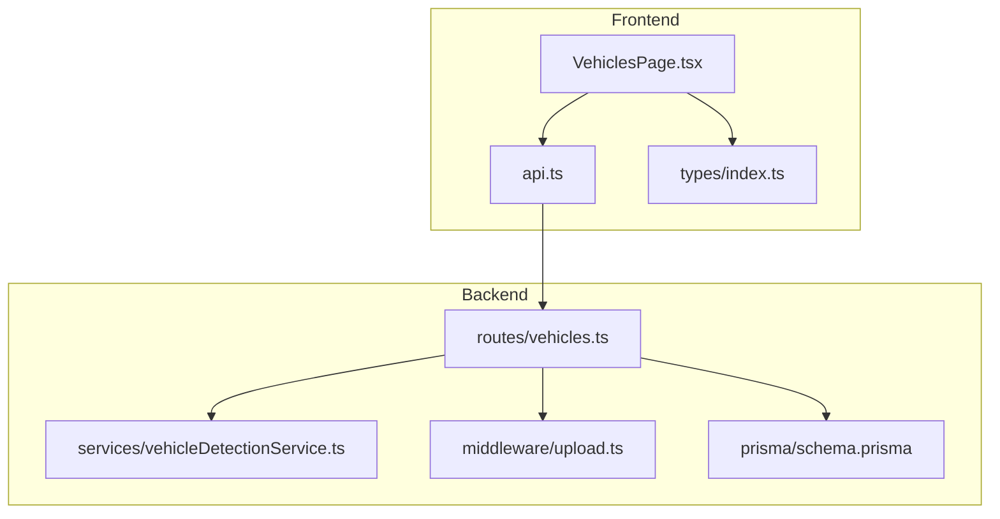
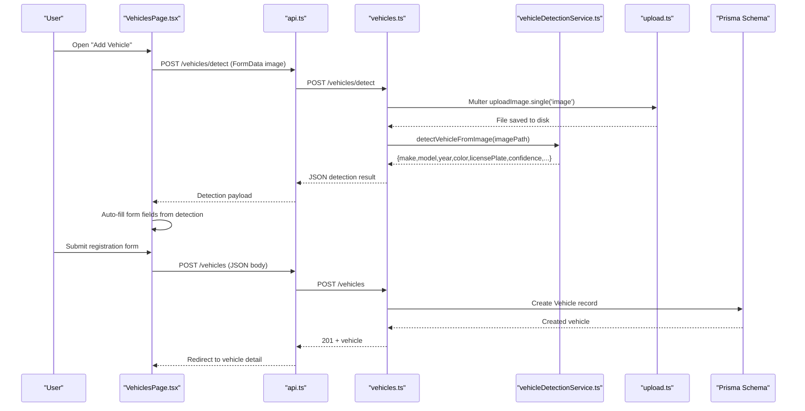
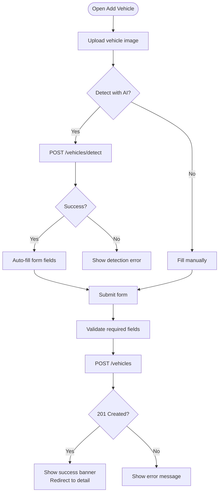
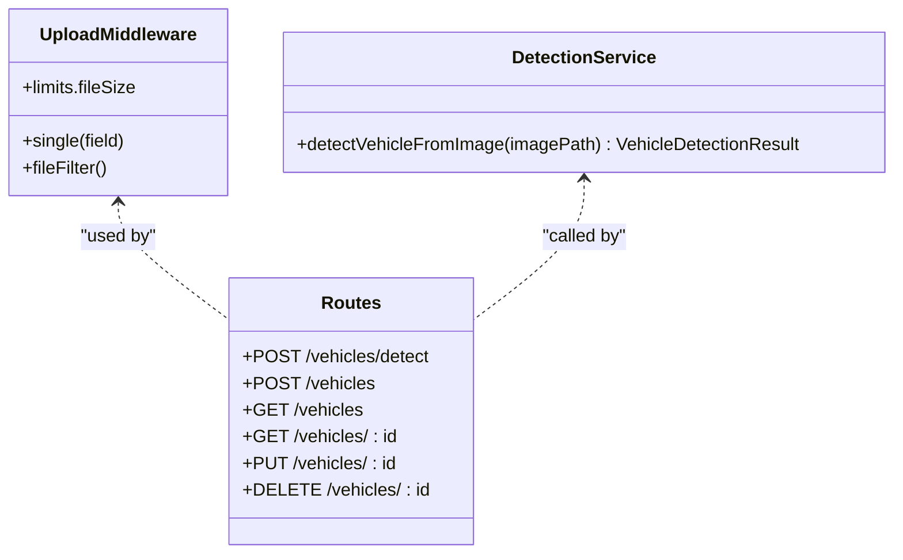
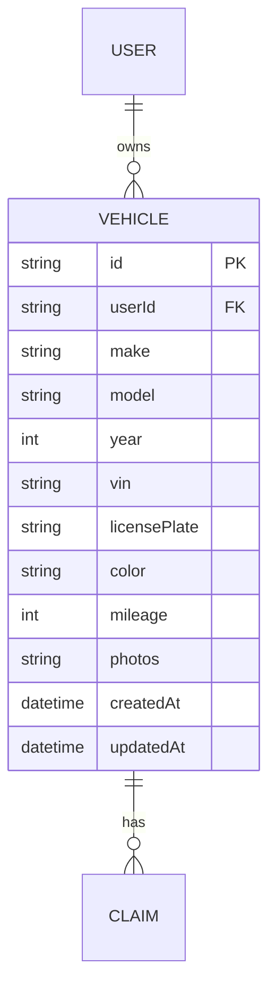
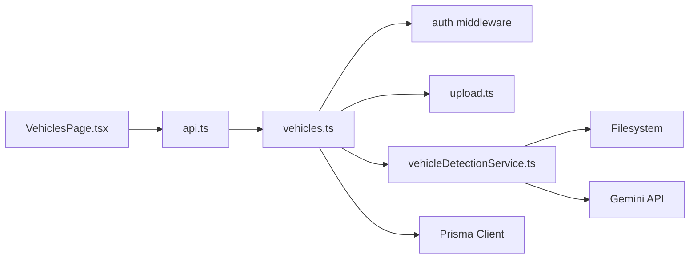

# Vehicle Management Page

<cite>
**Referenced Files in This Document**
- [VehiclesPage.tsx](file://frontend/src/pages/VehiclesPage.tsx)
- [api.ts](file://frontend/src/services/api.ts)
- [index.ts (types)](file://frontend/src/types/index.ts)
- [vehicles.ts](file://backend/src/routes/vehicles.ts)
- [vehicleDetectionService.ts](file://backend/src/services/vehicleDetectionService.ts)
- [upload.ts](file://backend/src/middleware/upload.ts)
- [schema.prisma](file://backend/prisma/schema.prisma)
</cite>

## Table of Contents
1. [Introduction](#introduction)
2. [Project Structure](#project-structure)
3. [Core Components](#core-components)
4. [Architecture Overview](#architecture-overview)
5. [Detailed Component Analysis](#detailed-component-analysis)
6. [Dependency Analysis](#dependency-analysis)
7. [Performance Considerations](#performance-considerations)
8. [Troubleshooting Guide](#troubleshooting-guide)
9. [Conclusion](#conclusion)

## Introduction
This document explains the Vehicles page that enables users to register and manage vehicles, view a list of their vehicles, inspect vehicle details, and file claims for a selected vehicle. It covers:
- Listing vehicles with counts and quick navigation
- Viewing detailed vehicle information including make, model, year, VIN, license plate, color, and mileage
- Registering new vehicles via a form with validation and optional AI-assisted auto-fill from an uploaded image
- Data fetching patterns, error handling, and success feedback
- Integration with the vehicle detection service powered by Gemini
- How vehicle data is structured across frontend types and backend schema

## Project Structure
The vehicle management feature spans both frontend and backend:
- Frontend pages and services handle UI, state, API calls, and user interactions
- Backend routes expose REST endpoints for CRUD operations and AI detection
- Prisma schema defines the Vehicle model and relationships
- Upload middleware handles image storage and validation

**Diagram sources**
- [VehiclesPage.tsx:1-369](file://frontend/src/pages/VehiclesPage.tsx#L1-L369)
- [api.ts:1-40](file://frontend/src/services/api.ts#L1-L40)
- [vehicles.ts:1-169](file://backend/src/routes/vehicles.ts#L1-L169)
- [vehicleDetectionService.ts:1-96](file://backend/src/services/vehicleDetectionService.ts#L1-L96)
- [upload.ts:1-54](file://backend/src/middleware/upload.ts#L1-L54)
- [schema.prisma:27-43](file://backend/prisma/schema.prisma#L27-L43)

**Section sources**
- [VehiclesPage.tsx:1-369](file://frontend/src/pages/VehiclesPage.tsx#L1-L369)
- [vehicles.ts:1-169](file://backend/src/routes/vehicles.ts#L1-L169)
- [schema.prisma:27-43](file://backend/prisma/schema.prisma#L27-L43)

## Core Components
- Vehicle listing interface: Displays all user-owned vehicles with key fields and claim count; links to detail pages and registration form.
- Vehicle detail display: Shows make, model, year, VIN, license plate, color, mileage, and claim history; supports deletion.
- Vehicle registration form: Validates required fields, supports optional VIN and mileage, integrates AI detection via image upload to auto-fill fields.
- Data fetching: Uses a centralized Axios instance to call backend endpoints with authentication headers and redirects on 401.
- Error handling: Centralized 401 redirect; route-level errors returned as JSON messages; UI shows inline errors or alerts.
- Success feedback: Inline success banner and automatic redirection after successful registration.

**Section sources**
- [VehiclesPage.tsx:8-55](file://frontend/src/pages/VehiclesPage.tsx#L8-L55)
- [VehiclesPage.tsx:57-122](file://frontend/src/pages/VehiclesPage.tsx#L57-L122)
- [VehiclesPage.tsx:124-369](file://frontend/src/pages/VehiclesPage.tsx#L124-L369)
- [api.ts:1-40](file://frontend/src/services/api.ts#L1-L40)
- [vehicles.ts:34-166](file://backend/src/routes/vehicles.ts#L34-L166)

## Architecture Overview
The Vehicles page follows a client-server architecture with clear separation of concerns:
- The React page fetches and renders vehicle data via a typed API client
- Backend routes enforce authentication and delegate to Prisma for persistence
- Image uploads are handled by middleware before being processed by the detection service
- Detection results are used to pre-populate the registration form

**Diagram sources**
- [VehiclesPage.tsx:124-369](file://frontend/src/pages/VehiclesPage.tsx#L124-L369)
- [api.ts:1-40](file://frontend/src/services/api.ts#L1-L40)
- [vehicles.ts:15-63](file://backend/src/routes/vehicles.ts#L15-L63)
- [vehicleDetectionService.ts:46-95](file://backend/src/services/vehicleDetectionService.ts#L46-L95)
- [upload.ts:17-47](file://backend/src/middleware/upload.ts#L17-L47)
- [schema.prisma:27-43](file://backend/prisma/schema.prisma#L27-L43)

## Detailed Component Analysis

### Vehicle Listing Interface
- Loads the current user’s vehicles on mount and displays them in a responsive grid
- Each card shows make/model/year, license plate, color, mileage (if present), and claim count
- Empty state guides users to add a vehicle
- Navigation to detail page and registration form

Data flow:
- GET /api/vehicles returns a list enriched with claim counts
- Errors during fetch are caught and loading state is reset

**Section sources**
- [VehiclesPage.tsx:8-55](file://frontend/src/pages/VehiclesPage.tsx#L8-L55)
- [vehicles.ts:65-81](file://backend/src/routes/vehicles.ts#L65-L81)

### Vehicle Detail Display
- Fetches a single vehicle by ID and includes related claims
- Displays core attributes: make, model, year, VIN, license plate, color, mileage
- Provides a link to file a claim for this vehicle
- Supports deletion with confirmation and navigation back to the list

Error handling:
- If the vehicle is not found, the user is redirected to the vehicles list

**Section sources**
- [VehiclesPage.tsx:57-122](file://frontend/src/pages/VehiclesPage.tsx#L57-L122)
- [vehicles.ts:83-111](file://backend/src/routes/vehicles.ts#L83-L111)

### Vehicle Registration Form
- Fields: make, model, year, license plate, color (required); vin, mileage (optional)
- Validation: HTML5 required and numeric constraints enforced; backend validates presence of required fields
- AI-assisted auto-fill:
  - Drag-and-drop or browse to upload a vehicle photo
  - Sends FormData to /vehicles/detect
  - On success, populates form fields where detection confidence is acceptable
  - Displays confidence level and additional info when available
- Submission workflow:
  - POST /vehicles with form values
  - On success, show a success banner and redirect to the newly created vehicle detail page
  - On error, display inline error message

**Diagram sources**
- [VehiclesPage.tsx:124-369](file://frontend/src/pages/VehiclesPage.tsx#L124-L369)
- [vehicles.ts:15-63](file://backend/src/routes/vehicles.ts#L15-L63)

**Section sources**
- [VehiclesPage.tsx:124-369](file://frontend/src/pages/VehiclesPage.tsx#L124-L369)
- [vehicles.ts:34-63](file://backend/src/routes/vehicles.ts#L34-L63)

### Data Fetching Patterns
- Centralized Axios instance sets base URL and attaches Authorization header automatically
- Handles 401 responses by clearing auth state and redirecting to login
- For image uploads, Content-Type is left unset so the browser sets multipart boundary

**Section sources**
- [api.ts:1-40](file://frontend/src/services/api.ts#L1-L40)

### Error Handling and Success Feedback
- Frontend catches network and server errors, displaying inline messages or alerts
- Backend returns consistent JSON error objects with descriptive messages
- Success states include banners and automatic navigation

**Section sources**
- [VehiclesPage.tsx:67-73](file://frontend/src/pages/VehiclesPage.tsx#L67-L73)
- [VehiclesPage.tsx:190-202](file://frontend/src/pages/VehiclesPage.tsx#L190-L202)
- [vehicles.ts:17-31](file://backend/src/routes/vehicles.ts#L17-L31)
- [vehicles.ts:59-62](file://backend/src/routes/vehicles.ts#L59-L62)

### Integration with Vehicle Detection Service
- Upload middleware validates allowed image types and enforces size limits
- Detection service reads the uploaded image, sends it to Gemini with a strict prompt, and parses the response into a structured object
- Fallback behavior ensures a safe default when parsing fails

**Diagram sources**
- [upload.ts:17-47](file://backend/src/middleware/upload.ts#L17-L47)
- [vehicleDetectionService.ts:46-95](file://backend/src/services/vehicleDetectionService.ts#L46-L95)
- [vehicles.ts:15-63](file://backend/src/routes/vehicles.ts#L15-L63)

**Section sources**
- [upload.ts:1-54](file://backend/src/middleware/upload.ts#L1-54)
- [vehicleDetectionService.ts:1-96](file://backend/src/services/vehicleDetectionService.ts#L1-L96)
- [vehicles.ts:15-32](file://backend/src/routes/vehicles.ts#L15-L32)

### Data Model and Display Mapping
- Frontend Vehicle type mirrors backend Vehicle model, including optional fields and relations
- Backend schema defines Vehicle with userId, make, model, year, vin, licensePlate, color, mileage, photos, and timestamps
- Detail page maps these fields directly to UI labels and values

**Diagram sources**
- [schema.prisma:10-43](file://backend/prisma/schema.prisma#L10-L43)

**Section sources**
- [index.ts (types):12-26](file://frontend/src/types/index.ts#L12-L26)
- [schema.prisma:27-43](file://backend/prisma/schema.prisma#L27-L43)

## Dependency Analysis
- Frontend dependencies:
  - VehiclesPage depends on api client and types
  - api client depends on environment configuration and local storage for tokens
- Backend dependencies:
  - vehicles routes depend on auth middleware, upload middleware, Prisma client, and detection service
  - detection service depends on filesystem access and Gemini integration
  - upload middleware manages storage directories and file filtering

**Diagram sources**
- [VehiclesPage.tsx:1-6](file://frontend/src/pages/VehiclesPage.tsx#L1-L6)
- [api.ts:1-40](file://frontend/src/services/api.ts#L1-L40)
- [vehicles.ts:1-11](file://backend/src/routes/vehicles.ts#L1-L11)
- [vehicleDetectionService.ts:1-4](file://backend/src/services/vehicleDetectionService.ts#L1-L4)
- [upload.ts:1-15](file://backend/src/middleware/upload.ts#L1-L15)

**Section sources**
- [VehiclesPage.tsx:1-6](file://frontend/src/pages/VehiclesPage.tsx#L1-L6)
- [api.ts:1-40](file://frontend/src/services/api.ts#L1-L40)
- [vehicles.ts:1-11](file://backend/src/routes/vehicles.ts#L1-L11)
- [vehicleDetectionService.ts:1-4](file://backend/src/services/vehicleDetectionService.ts#L1-L4)
- [upload.ts:1-15](file://backend/src/middleware/upload.ts#L1-L15)

## Performance Considerations
- Minimize re-renders by keeping vehicle lists lightweight; only include necessary relations (e.g., claim counts)
- Use optimistic UI updates sparingly; rely on server responses for consistency
- Limit image sizes via upload middleware to reduce bandwidth and processing time
- Cache vehicle lists at the application level if needed to avoid repeated fetches

[No sources needed since this section provides general guidance]

## Troubleshooting Guide
Common issues and resolutions:
- No image uploaded for detection: Ensure a valid image is selected; backend returns a 400 error if missing
- Invalid image format: Only JPEG, PNG, and WebP are allowed; adjust file type accordingly
- Authentication failures: A 401 response clears token and redirects to login; ensure a valid token is stored
- Vehicle not found: Verify the vehicle ID and ownership; backend returns 404 if not found
- Parsing errors from detection: If Gemini response cannot be parsed, a safe fallback is returned; retry with a clearer image

**Section sources**
- [vehicles.ts:17-31](file://backend/src/routes/vehicles.ts#L17-L31)
- [upload.ts:30-41](file://backend/src/middleware/upload.ts#L30-L41)
- [api.ts:26-37](file://frontend/src/services/api.ts#L26-L37)
- [vehicles.ts:101-103](file://backend/src/routes/vehicles.ts#L101-L103)
- [vehicleDetectionService.ts:73-92](file://backend/src/services/vehicleDetectionService.ts#L73-L92)

## Conclusion
The Vehicles page provides a complete lifecycle for vehicle management:
- List, view details, and delete vehicles
- Register new vehicles with robust validation and optional AI-assisted auto-fill
- Reliable data fetching with centralized error handling and success feedback
- Clear integration points between frontend components, backend routes, upload middleware, and the vehicle detection service

[No sources needed since this section summarizes without analyzing specific files]