# React Application Structure

<cite>
**Referenced Files in This Document**
- [main.tsx](file://frontend/src/main.tsx)
- [App.tsx](file://frontend/src/App.tsx)
- [AuthContext.tsx](file://frontend/src/context/AuthContext.tsx)
- [Layout.tsx](file://frontend/src/components/Layout.tsx)
- [AdminLayout.tsx](file://frontend/src/components/AdminLayout.tsx)
- [ProtectedRoute.tsx](file://frontend/src/components/ProtectedRoute.tsx)
- [AdminProtectedRoute.tsx](file://frontend/src/components/AdminProtectedRoute.tsx)
- [api.ts](file://frontend/src/services/api.ts)
- [index.ts](file://frontend/src/types/index.ts)
- [LoginPage.tsx](file://frontend/src/pages/LoginPage.tsx)
- [DashboardPage.tsx](file://frontend/src/pages/DashboardPage.tsx)
- [AdminLoginPage.tsx](file://frontend/src/pages/admin/AdminLoginPage.tsx)
</cite>

## Table of Contents
1. Introduction
2. Project Structure
3. Core Components
4. Architecture Overview
5. Detailed Component Analysis
6. Dependency Analysis
7. Performance Considerations
8. Troubleshooting Guide
9. Conclusion

## Introduction
This document explains the React application’s structure and architecture for a Smart Vehicle Insurance Claim System. It covers the main entry point, component hierarchy, layout system, routing configuration (including protected routes and admin route protection), authentication context setup, component composition patterns, prop interfaces, and folder organization. The goal is to help both technical and non-technical readers understand how the app is organized and how key flows work end-to-end.

## Project Structure
The frontend is a Vite + React application with TypeScript. Key directories:
- src/main.tsx: Application bootstrap that mounts the root App component under StrictMode.
- src/App.tsx: Central router configuration and global providers.
- src/components: Shared UI shells and route guards (Layout, AdminLayout, ProtectedRoute, AdminProtectedRoute).
- src/context: Global state via React Context (authentication).
- src/pages: Feature pages grouped by user role (user-facing pages and admin pages).
- src/services: HTTP client configuration and API helpers.
- src/types: Shared TypeScript interfaces for domain models and API responses.

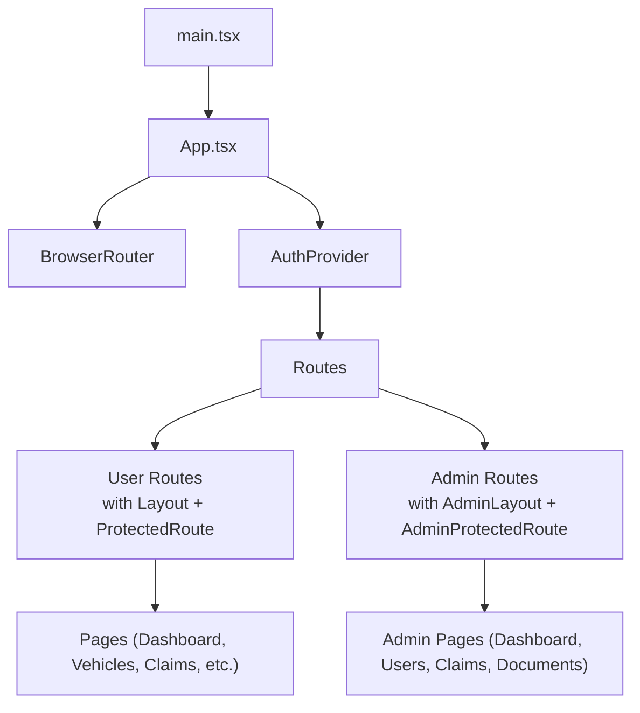

**Diagram sources**
- [main.tsx:1-11](file://frontend/src/main.tsx#L1-L11)
- [App.tsx:1-56](file://frontend/src/App.tsx#L1-L56)

**Section sources**
- [main.tsx:1-11](file://frontend/src/main.tsx#L1-L11)
- [App.tsx:1-56](file://frontend/src/App.tsx#L1-L56)

## Core Components
- AuthProvider: Provides authentication state (user, token, loading) and actions (login, register, logout, updateProfile). Persists tokens and user data in localStorage and validates sessions on load.
- ProtectedRoute: Guards user routes; redirects unauthenticated users to login while showing a loading spinner during auth initialization.
- AdminProtectedRoute: Guards admin routes; checks for an admin token stored in localStorage and redirects to admin login if missing.
- Layout: User-facing shell with responsive sidebar navigation, user profile summary, and sign-out action.
- AdminLayout: Admin shell with dark-themed sidebar navigation and admin-specific menu items.

These components are composed in App.tsx to wrap page-level routes, ensuring consistent UX and security.

**Section sources**
- [AuthContext.tsx:1-82](file://frontend/src/context/AuthContext.tsx#L1-L82)
- [ProtectedRoute.tsx:1-21](file://frontend/src/components/ProtectedRoute.tsx#L1-L21)
- [AdminProtectedRoute.tsx:1-8](file://frontend/src/components/AdminProtectedRoute.tsx#L1-L8)
- [Layout.tsx:1-176](file://frontend/src/components/Layout.tsx#L1-L176)
- [AdminLayout.tsx:1-74](file://frontend/src/components/AdminLayout.tsx#L1-L74)

## Architecture Overview
The application uses React Router v6 for declarative routing, React Context for global auth state, and a centralized Axios instance for API calls with automatic token injection and 401 handling.

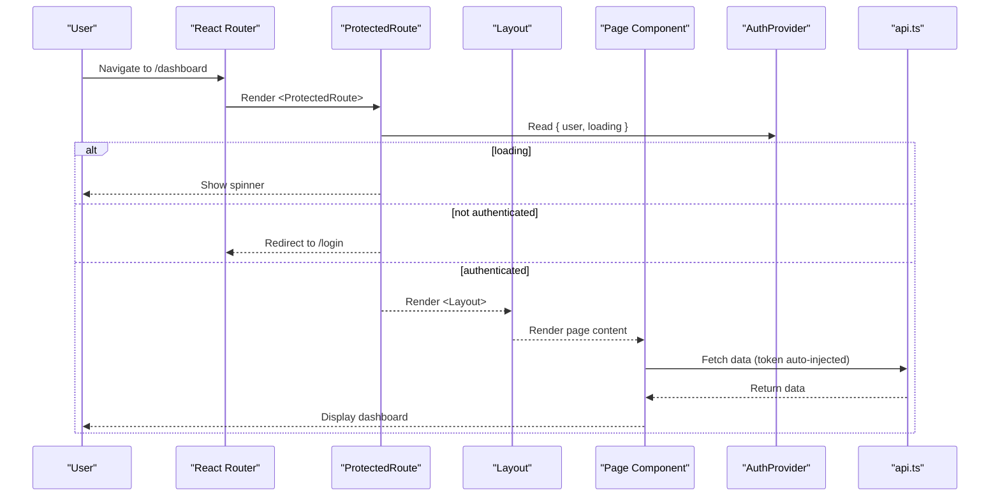

**Diagram sources**
- [App.tsx:23-49](file://frontend/src/App.tsx#L23-L49)
- [ProtectedRoute.tsx:4-20](file://frontend/src/components/ProtectedRoute.tsx#L4-L20)
- [Layout.tsx:14-23](file://frontend/src/components/Layout.tsx#L14-L23)
- [api.ts:1-36](file://frontend/src/services/api.ts#L1-L36)

## Detailed Component Analysis

### Routing Configuration (React Router)
- Root provider chain: BrowserRouter wraps AuthProvider to make auth state available globally.
- Public routes: /login, /register, and a redirect from / to /dashboard.
- Protected user routes: All user features are wrapped with ProtectedRoute and Layout to enforce authentication and provide consistent UI.
- Admin routes: Admin features are wrapped with AdminProtectedRoute and AdminLayout to enforce admin-only access.
- Route nesting: Pages are rendered inside their respective layouts, enabling shared navigation and branding.

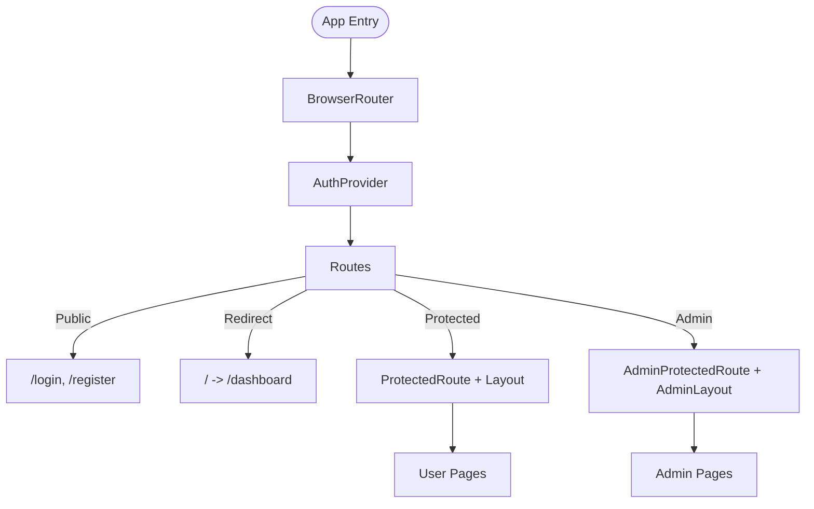

**Diagram sources**
- [App.tsx:23-49](file://frontend/src/App.tsx#L23-L49)

**Section sources**
- [App.tsx:1-56](file://frontend/src/App.tsx#L1-L56)

### Authentication Context Setup
- State: user, token, loading.
- Initialization: On mount, if a token exists in localStorage, fetch current profile to validate session; otherwise clear stale tokens.
- Actions:
  - login(email, password): Calls backend, stores token and user in localStorage, updates context.
  - register(data): Similar flow for registration.
  - logout(): Clears context and localStorage.
  - updateProfile(data): Updates user profile and refreshes context state.
- Consumers: Use useAuth() hook to access state and actions across components.

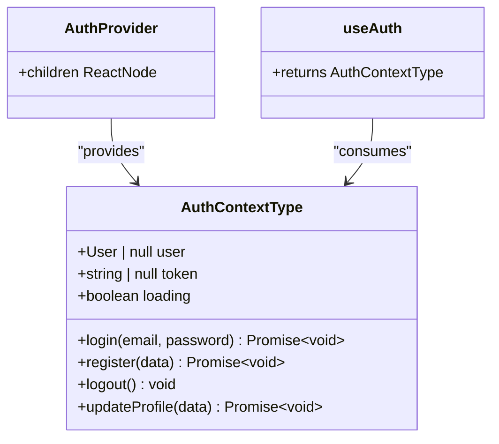

**Diagram sources**
- [AuthContext.tsx:5-13](file://frontend/src/context/AuthContext.tsx#L5-L13)
- [AuthContext.tsx:17-82](file://frontend/src/context/AuthContext.tsx#L17-L82)

**Section sources**
- [AuthContext.tsx:1-82](file://frontend/src/context/AuthContext.tsx#L1-L82)

### Protected Routes and Admin Route Protection
- ProtectedRoute:
  - Shows a loading indicator while auth initializes.
  - Redirects to /login if no user is present.
  - Renders children when authenticated.
- AdminProtectedRoute:
  - Checks for adminToken in localStorage.
  - Redirects to /admin/login if missing.
  - Renders children when admin is authenticated.

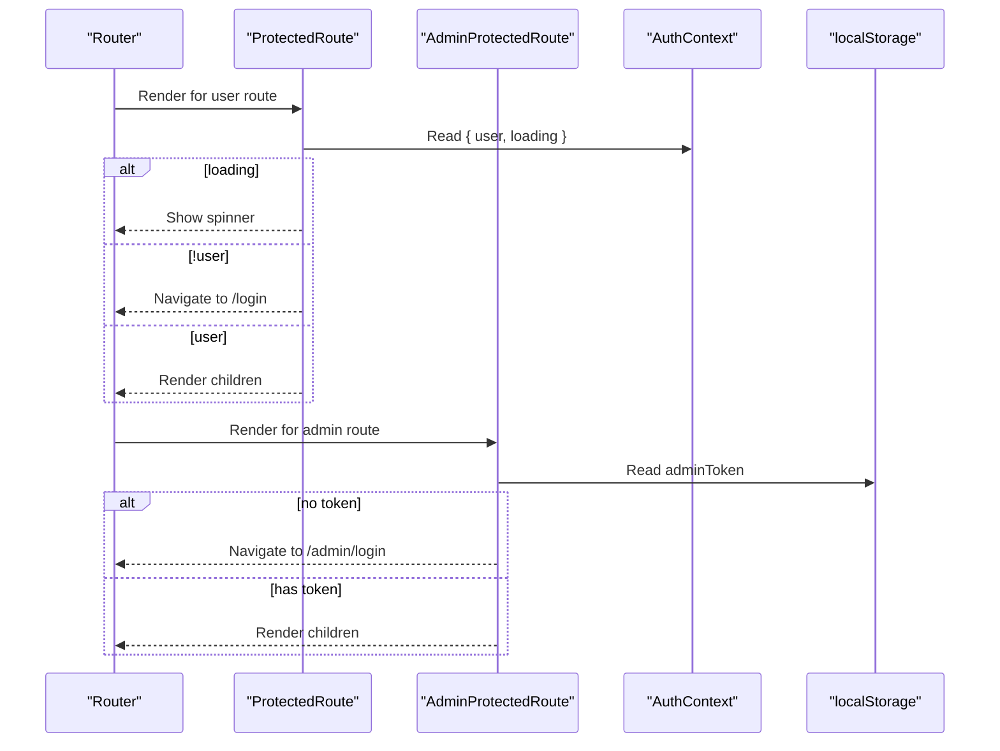

**Diagram sources**
- [ProtectedRoute.tsx:4-20](file://frontend/src/components/ProtectedRoute.tsx#L4-L20)
- [AdminProtectedRoute.tsx:3-7](file://frontend/src/components/AdminProtectedRoute.tsx#L3-L7)

**Section sources**
- [ProtectedRoute.tsx:1-21](file://frontend/src/components/ProtectedRoute.tsx#L1-L21)
- [AdminProtectedRoute.tsx:1-8](file://frontend/src/components/AdminProtectedRoute.tsx#L1-L8)

### Layout System Implementation
- Layout (user):
  - Responsive sidebar with navigation links for Dashboard, Vehicles, Claims, Policies, Profile.
  - Displays user initials and name/email in the sidebar footer.
  - Sign out triggers logout and navigates to /login.
  - Mobile-friendly: collapsible sidebar overlay and bottom tab bar for quick navigation.
- AdminLayout (admin):
  - Dark-themed sidebar with navigation for Dashboard, Users, Claims, Documents.
  - Displays admin name derived from localStorage and provides sign-out by clearing admin token and navigating to /admin/login.

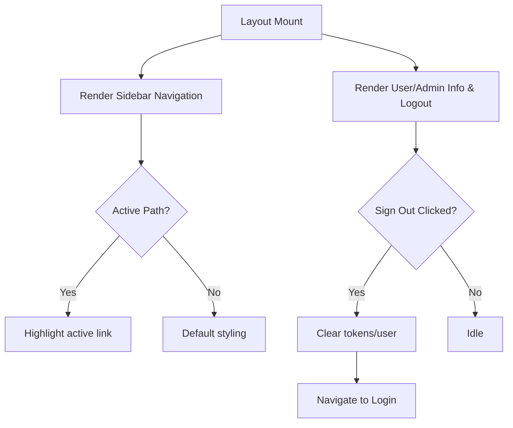

**Diagram sources**
- [Layout.tsx:6-12](file://frontend/src/components/Layout.tsx#L6-L12)
- [Layout.tsx:20-23](file://frontend/src/components/Layout.tsx#L20-L23)
- [AdminLayout.tsx:4-9](file://frontend/src/components/AdminLayout.tsx#L4-L9)
- [AdminLayout.tsx:15-18](file://frontend/src/components/AdminLayout.tsx#L15-L18)

**Section sources**
- [Layout.tsx:1-176](file://frontend/src/components/Layout.tsx#L1-L176)
- [AdminLayout.tsx:1-74](file://frontend/src/components/AdminLayout.tsx#L1-L74)

### API Integration and Token Handling
- Axios instance configured with baseURL /api.
- Request interceptor attaches Authorization header using token from localStorage.
- For FormData requests, Content-Type is removed to let the browser set multipart boundary.
- Response interceptor handles 401 errors by clearing tokens and redirecting to /login.

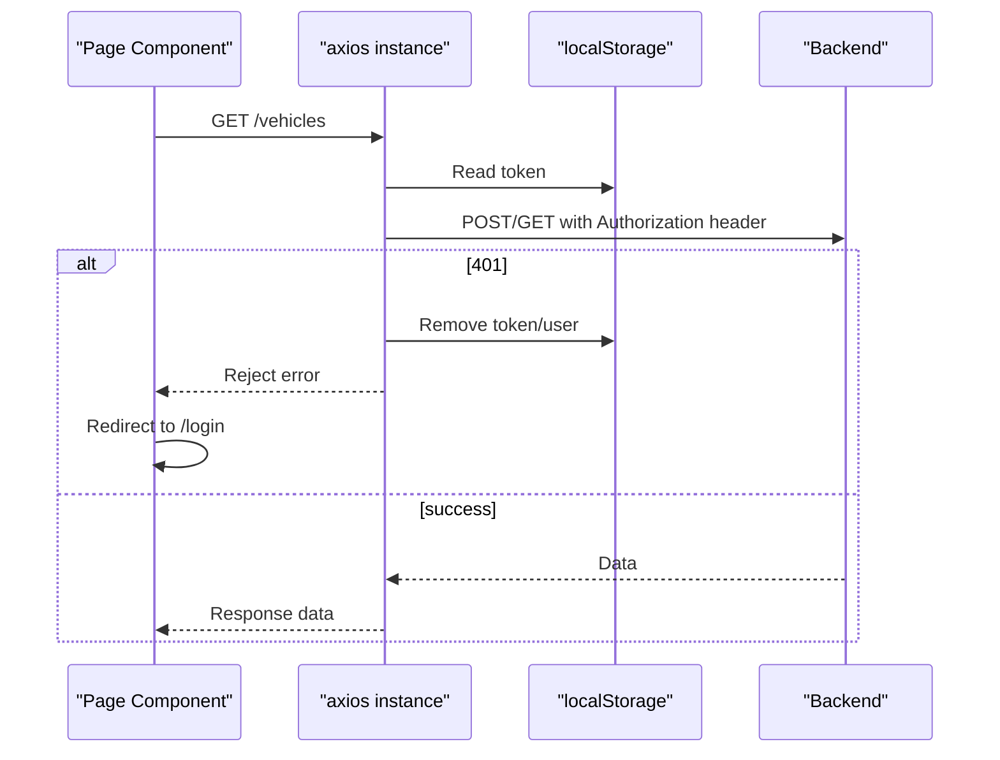

**Diagram sources**
- [api.ts:1-36](file://frontend/src/services/api.ts#L1-L36)

**Section sources**
- [api.ts:1-36](file://frontend/src/services/api.ts#L1-L36)

### Component Composition Patterns and Prop Interfaces
- Composition:
  - Routes compose Layout or AdminLayout around page components to share navigation and branding.
  - Route guards compose around pages to enforce access control.
- Props:
  - Layout and AdminLayout accept children: React.ReactNode.
  - ProtectedRoute and AdminProtectedRoute accept children: React.ReactNode.
  - AuthContext exposes typed methods and state via useAuth().
- Types:
  - Shared domain types (User, Vehicle, Claim, etc.) are defined centrally and imported by pages and services.

Examples of usage patterns:
- Wrapping pages with Layout and ProtectedRoute for user features.
- Wrapping admin pages with AdminLayout and AdminProtectedRoute.
- Using useAuth() in pages to read user info and trigger login/logout flows.

**Section sources**
- [App.tsx:23-49](file://frontend/src/App.tsx#L23-L49)
- [ProtectedRoute.tsx:4-20](file://frontend/src/components/ProtectedRoute.tsx#L4-L20)
- [AdminProtectedRoute.tsx:3-7](file://frontend/src/components/AdminProtectedRoute.tsx#L3-L7)
- [Layout.tsx:14-23](file://frontend/src/components/Layout.tsx#L14-L23)
- [AdminLayout.tsx:11-18](file://frontend/src/components/AdminLayout.tsx#L11-L18)
- [index.ts:1-150](file://frontend/src/types/index.ts#L1-L150)

### Example: Login Flow (User)
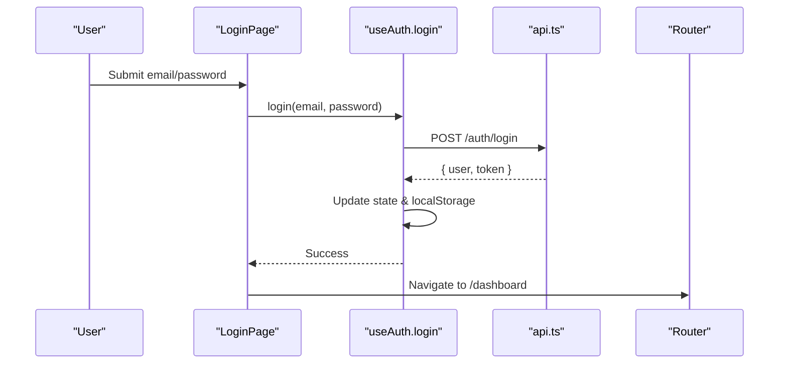

**Diagram sources**
- [LoginPage.tsx:14-27](file://frontend/src/pages/LoginPage.tsx#L14-L27)
- [AuthContext.tsx:38-45](file://frontend/src/context/AuthContext.tsx#L38-L45)
- [api.ts:8-20](file://frontend/src/services/api.ts#L8-L20)

**Section sources**
- [LoginPage.tsx:1-105](file://frontend/src/pages/LoginPage.tsx#L1-L105)
- [AuthContext.tsx:38-45](file://frontend/src/context/AuthContext.tsx#L38-L45)

### Example: Dashboard Data Load
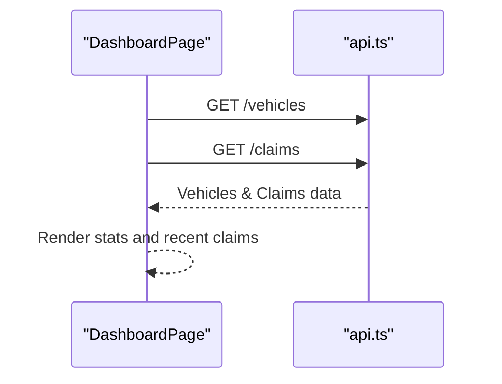

**Diagram sources**
- [DashboardPage.tsx:14-27](file://frontend/src/pages/DashboardPage.tsx#L14-L27)

**Section sources**
- [DashboardPage.tsx:1-142](file://frontend/src/pages/DashboardPage.tsx#L1-L142)

### Example: Admin Login Flow
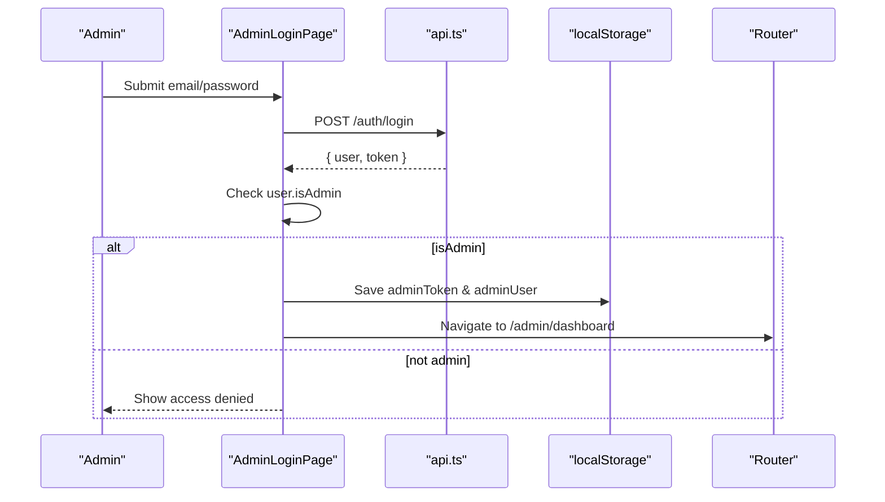

**Diagram sources**
- [AdminLoginPage.tsx:13-31](file://frontend/src/pages/admin/AdminLoginPage.tsx#L13-L31)

**Section sources**
- [AdminLoginPage.tsx:1-75](file://frontend/src/pages/admin/AdminLoginPage.tsx#L1-L75)

## Dependency Analysis
- App depends on:
  - React Router for routing and navigation.
  - AuthProvider for global auth state.
  - Layout and AdminLayout for consistent UI shells.
  - ProtectedRoute and AdminProtectedRoute for access control.
- Pages depend on:
  - useAuth for user state and actions.
  - api for data fetching with automatic token handling.
  - Shared types for strongly-typed data structures.

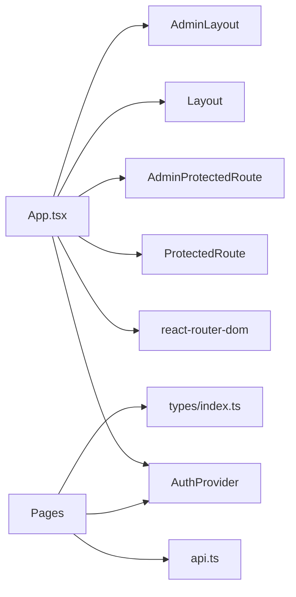

**Diagram sources**
- [App.tsx:1-56](file://frontend/src/App.tsx#L1-L56)
- [api.ts:1-36](file://frontend/src/services/api.ts#L1-L36)
- [index.ts:1-150](file://frontend/src/types/index.ts#L1-L150)

**Section sources**
- [App.tsx:1-56](file://frontend/src/App.tsx#L1-L56)
- [api.ts:1-36](file://frontend/src/services/api.ts#L1-L36)
- [index.ts:1-150](file://frontend/src/types/index.ts#L1-L150)

## Performance Considerations
- Minimize re-renders:
  - Keep Layout and AdminLayout stable; avoid recreating navigation arrays inline.
  - Use memoization for expensive computations in pages if needed.
- Efficient data fetching:
  - Batch requests where possible (e.g., parallel GET calls in Dashboard).
  - Leverage React Router loaders or Suspense boundaries for better UX during data loads.
- Token management:
  - Avoid unnecessary localStorage reads/writes; cache token in memory when appropriate.
- Network resilience:
  - Centralized 401 handling prevents redundant per-request logic.

[No sources needed since this section provides general guidance]

## Troubleshooting Guide
- Unauthenticated redirects:
  - If ProtectedRoute redirects unexpectedly, ensure AuthProvider is wrapping Routes and that login sets token and user correctly.
- Admin access denied:
  - Verify adminToken is set after successful admin login and that AdminProtectedRoute checks it.
- API 401 loops:
  - Ensure api.ts clears tokens on 401 and redirects to login; check that login/register endpoints return expected payloads.
- Layout navigation issues:
  - Confirm active link detection uses correct path matching and that routes match expected paths.

**Section sources**
- [ProtectedRoute.tsx:4-20](file://frontend/src/components/ProtectedRoute.tsx#L4-L20)
- [AdminProtectedRoute.tsx:3-7](file://frontend/src/components/AdminProtectedRoute.tsx#L3-L7)
- [api.ts:22-33](file://frontend/src/services/api.ts#L22-L33)
- [Layout.tsx:40-57](file://frontend/src/components/Layout.tsx#L40-L57)
- [AdminLayout.tsx:42-55](file://frontend/src/components/AdminLayout.tsx#L42-L55)

## Conclusion
The application follows a clean, modular architecture:
- Centralized routing with explicit public, protected, and admin routes.
- Consistent layouts for user and admin experiences.
- Robust authentication via React Context with secure token handling and automatic session validation.
- Strong typing through shared interfaces ensures consistency across components and services.
This structure supports scalability, maintainability, and a clear separation of concerns between UI shells, feature pages, and global state.

[No sources needed since this section summarizes without analyzing specific files]