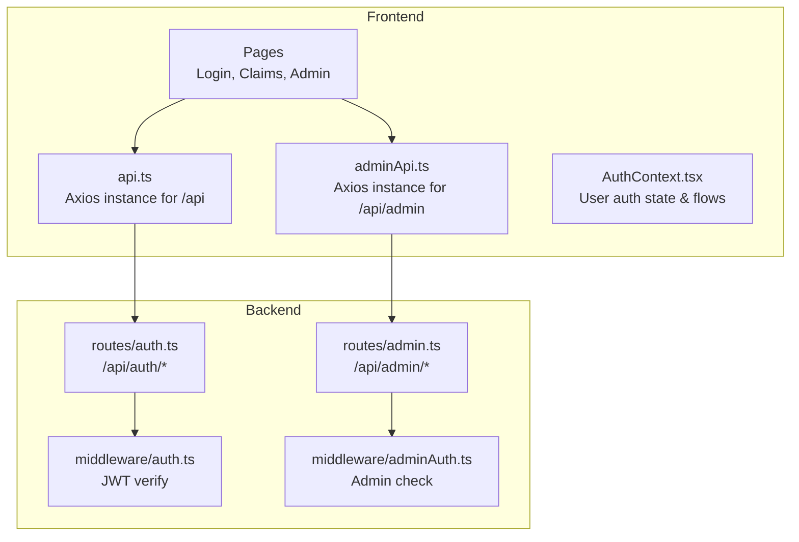
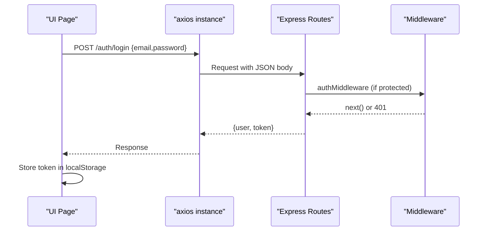
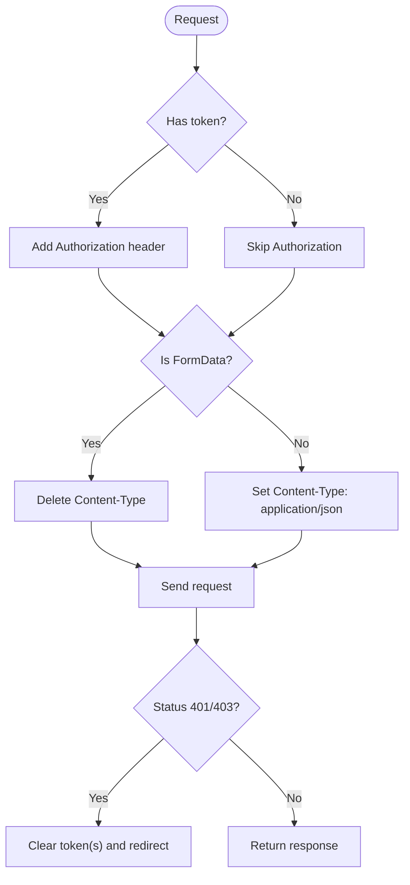
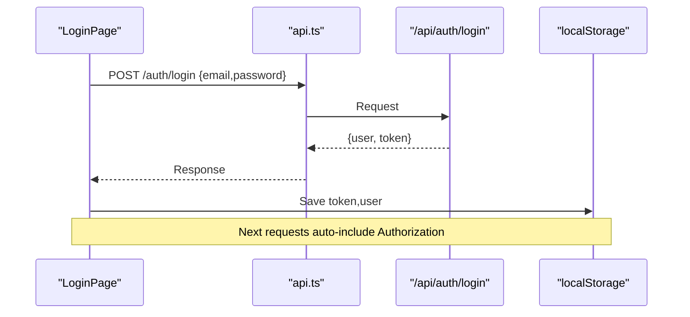
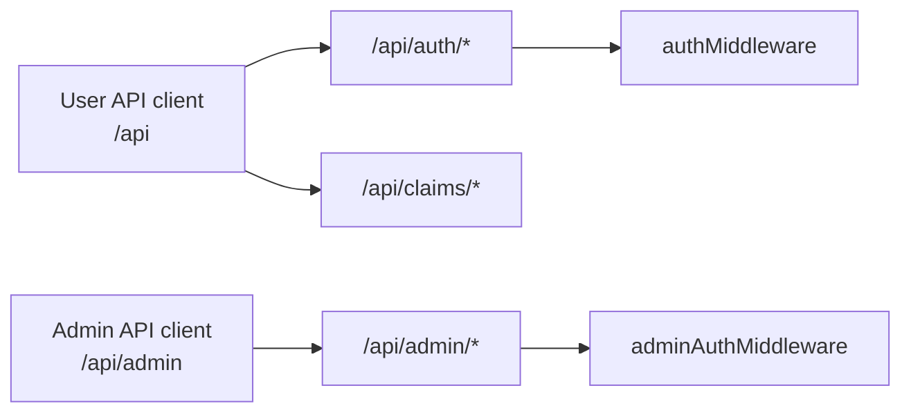
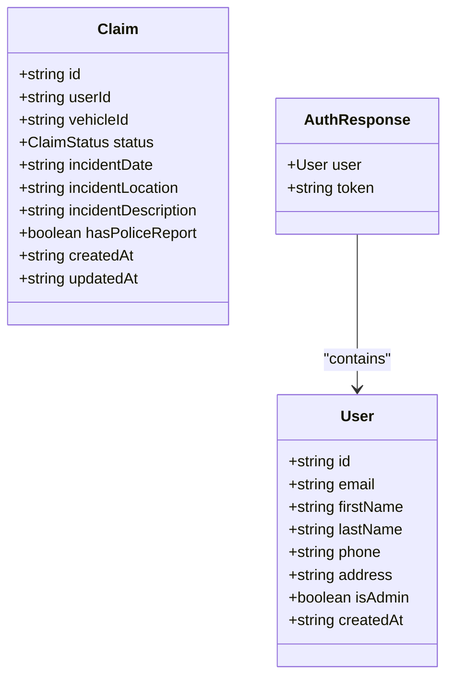
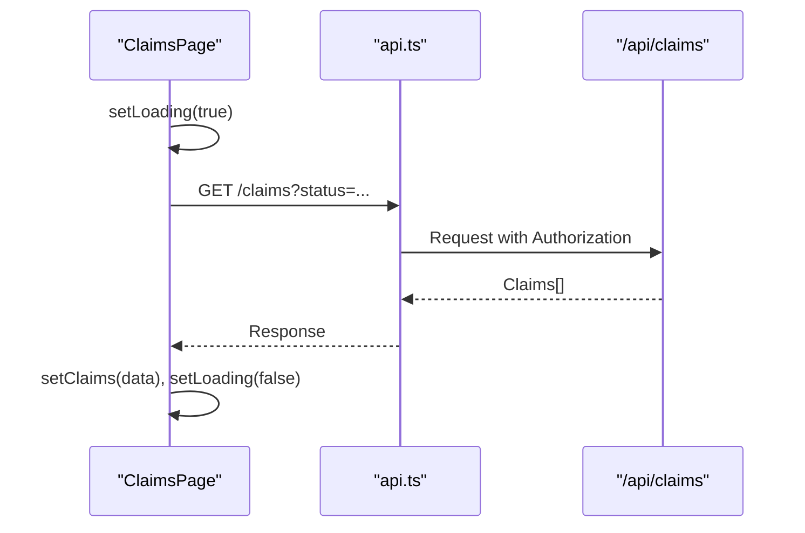
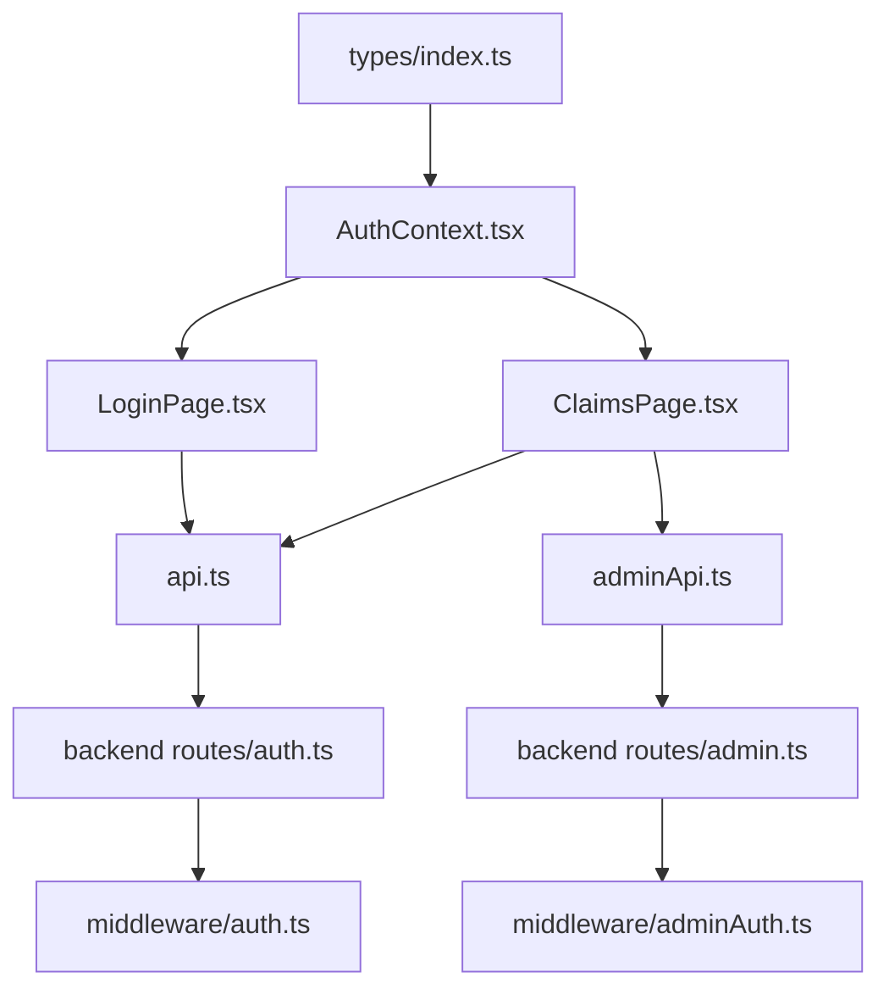

# API Services Layer

<cite>
**Referenced Files in This Document**
- [api.ts](file://frontend/src/services/api.ts)
- [adminApi.ts](file://frontend/src/services/adminApi.ts)
- [index.ts (types)](file://frontend/src/types/index.ts)
- [AuthContext.tsx](file://frontend/src/context/AuthContext.tsx)
- [LoginPage.tsx](file://frontend/src/pages/LoginPage.tsx)
- [ClaimsPage.tsx](file://frontend/src/pages/ClaimsPage.tsx)
- [AdminLoginPage.tsx](file://frontend/src/pages/admin/AdminLoginPage.tsx)
- [AdminClaimsPage.tsx](file://frontend/src/pages/admin/AdminClaimsPage.tsx)
- [auth.ts (backend routes)](file://backend/src/routes/auth.ts)
- [admin.ts (backend routes)](file://backend/src/routes/admin.ts)
- [auth.ts (middleware)](file://backend/src/middleware/auth.ts)
- [adminAuth.ts (middleware)](file://backend/src/middleware/adminAuth.ts)
</cite>

## Table of Contents
1. Introduction
2. Project Structure
3. Core Components
4. Architecture Overview
5. Detailed Component Analysis
6. Dependency Analysis
7. Performance Considerations
8. Troubleshooting Guide
9. Conclusion

## Introduction
This document explains the frontend API services layer that handles HTTP communication with the backend. It covers Axios configuration, request/response interceptors for authentication and error handling, centralized error management strategies, and the separation between regular user APIs and admin APIs. It also includes examples of making API calls, handling loading states, managing errors, and outlines patterns for organizing endpoints and maintaining type safety with TypeScript interfaces.

## Project Structure
The API services are split into two Axios instances:
- Regular user API client configured for /api endpoints
- Admin API client configured for /api/admin endpoints

Both clients set base URLs from environment variables or use relative paths via Vite proxy. They attach Bearer tokens from local storage and handle 401/403 responses by clearing tokens and redirecting to login pages.

**Diagram sources**
- [api.ts:1-39](file://frontend/src/services/api.ts#L1-L39)
- [adminApi.ts:1-27](file://frontend/src/services/adminApi.ts#L1-L27)
- [AuthContext.tsx:1-82](file://frontend/src/context/AuthContext.tsx#L1-L82)
- [auth.ts (backend routes):1-168](file://backend/src/routes/auth.ts#L1-L168)
- [admin.ts (backend routes):1-187](file://backend/src/routes/admin.ts#L1-L187)
- [auth.ts (middleware):1-23](file://backend/src/middleware/auth.ts#L1-L23)
- [adminAuth.ts (middleware):1-27](file://backend/src/middleware/adminAuth.ts#L1-L27)

**Section sources**
- [api.ts:1-39](file://frontend/src/services/api.ts#L1-L39)
- [adminApi.ts:1-27](file://frontend/src/services/adminApi.ts#L1-L27)

## Core Components
- User API client (api.ts): Creates an Axios instance with baseURL derived from environment or proxy. Adds Authorization header with a Bearer token stored under 'token'. Sets Content-Type to application/json unless FormData is used. On 401 response, clears user token and user data, then redirects to /login.
- Admin API client (adminApi.ts): Similar setup but targets /api/admin and uses 'adminToken' from localStorage. On 401 or 403, clears admin token and redirects to /admin/login.
- Types (index.ts): Centralized TypeScript interfaces for domain models (User, Claim, Vehicle, etc.) and shared enums for status values. Ensures type safety across components and services.
- Auth context (AuthContext.tsx): Manages user session, persists token/user to localStorage, initializes auth on app start by fetching profile, and exposes login/register/logout/updateProfile methods typed against AuthResponse.

Examples of usage:
- Login flow uses api.post('/auth/login', ...) and stores token/user. See LoginPage.tsx and AuthContext.tsx.
- Data fetching uses api.get(...) with local loading states, as seen in ClaimsPage.tsx.
- Admin flows use adminApi with adminToken, as shown in AdminLoginPage.tsx and AdminClaimsPage.tsx.

**Section sources**
- [api.ts:1-39](file://frontend/src/services/api.ts#L1-L39)
- [adminApi.ts:1-27](file://frontend/src/services/adminApi.ts#L1-L27)
- [index.ts (types):1-150](file://frontend/src/types/index.ts#L1-L150)
- [AuthContext.tsx:1-82](file://frontend/src/context/AuthContext.tsx#L1-L82)
- [LoginPage.tsx:1-105](file://frontend/src/pages/LoginPage.tsx#L1-L105)
- [ClaimsPage.tsx:1-98](file://frontend/src/pages/ClaimsPage.tsx#L1-L98)
- [AdminLoginPage.tsx:1-75](file://frontend/src/pages/admin/AdminLoginPage.tsx#L1-L75)
- [AdminClaimsPage.tsx:1-128](file://frontend/src/pages/admin/AdminClaimsPage.tsx#L1-L128)

## Architecture Overview
The architecture separates concerns by:
- Two Axios clients for different scopes (user vs admin)
- Interceptors for consistent auth header injection and error handling
- Backend middleware enforcing JWT verification and admin privileges
- Frontend contexts and pages orchestrating UI state and API calls

**Diagram sources**
- [api.ts:11-24](file://frontend/src/services/api.ts#L11-L24)
- [auth.ts (backend routes):61-105](file://backend/src/routes/auth.ts#L61-L105)
- [auth.ts (middleware):5-22](file://backend/src/middleware/auth.ts#L5-L22)

## Detailed Component Analysis

### Axios Configuration and Interceptors
- Base URL strategy:
  - If VITE_API_URL is set, prepend it; otherwise rely on Vite proxy for /api and /api/admin.
- Request interceptor:
  - Attaches Authorization: Bearer <token> from localStorage ('token' for user, 'adminToken' for admin).
  - Ensures Content-Type is application/json unless FormData is detected.
- Response interceptor:
  - User client: On 401, removes token and user from localStorage and redirects to /login.
  - Admin client: On 401 or 403, removes adminToken and redirects to /admin/login.

**Diagram sources**
- [api.ts:11-37](file://frontend/src/services/api.ts#L11-L37)
- [adminApi.ts:7-25](file://frontend/src/services/adminApi.ts#L7-L25)

**Section sources**
- [api.ts:1-39](file://frontend/src/services/api.ts#L1-L39)
- [adminApi.ts:1-27](file://frontend/src/services/adminApi.ts#L1-L27)

### Authentication Flow and Token Management
- User login:
  - UI calls api.post('/auth/login', credentials).
  - On success, store token and user in localStorage and update context state.
  - Subsequent requests automatically include Authorization header via interceptor.
- Profile refresh:
  - On app init, if token exists, fetch /auth/profile to validate session and hydrate user state.
- Admin login:
  - UI calls api.post('/auth/login', credentials), checks isAdmin flag, then stores adminToken and adminUser.
  - Admin pages use adminApi which attaches adminToken and enforces admin-only routes.

**Diagram sources**
- [LoginPage.tsx:13-31](file://frontend/src/pages/LoginPage.tsx#L13-L31)
- [AuthContext.tsx:22-45](file://frontend/src/context/AuthContext.tsx#L22-L45)
- [auth.ts (backend routes):61-105](file://backend/src/routes/auth.ts#L61-L105)

**Section sources**
- [AuthContext.tsx:18-66](file://frontend/src/context/AuthContext.tsx#L18-L66)
- [LoginPage.tsx:13-31](file://frontend/src/pages/LoginPage.tsx#L13-L31)
- [AdminLoginPage.tsx:13-31](file://frontend/src/pages/admin/AdminLoginPage.tsx#L13-L31)

### Separation Between Regular User APIs and Admin APIs
- User APIs:
  - Base path: /api
  - Token key: 'token'
  - Redirect on 401: /login
- Admin APIs:
  - Base path: /api/admin
  - Token key: 'adminToken'
  - Redirect on 401/403: /admin/login
- Backend enforcement:
  - User routes protected by authMiddleware (JWT verify).
  - Admin routes protected by adminAuthMiddleware (JWT verify + isAdmin check).

**Diagram sources**
- [api.ts:1-39](file://frontend/src/services/api.ts#L1-L39)
- [adminApi.ts:1-27](file://frontend/src/services/adminApi.ts#L1-L27)
- [auth.ts (backend routes):1-168](file://backend/src/routes/auth.ts#L1-L168)
- [admin.ts (backend routes):1-187](file://backend/src/routes/admin.ts#L1-L187)
- [auth.ts (middleware):1-23](file://backend/src/middleware/auth.ts#L1-L23)
- [adminAuth.ts (middleware):1-27](file://backend/src/middleware/adminAuth.ts#L1-L27)

**Section sources**
- [api.ts:1-39](file://frontend/src/services/api.ts#L1-L39)
- [adminApi.ts:1-27](file://frontend/src/services/adminApi.ts#L1-L27)
- [auth.ts (middleware):1-23](file://backend/src/middleware/auth.ts#L1-L23)
- [adminAuth.ts (middleware):1-27](file://backend/src/middleware/adminAuth.ts#L1-L27)

### Type Safety with TypeScript Interfaces
- Shared types define contracts for API payloads and responses, ensuring compile-time safety across the app.
- Examples include User, Claim, Vehicle, InsurancePolicy, and various enums like ClaimStatus, SeverityLevel, etc.
- AuthResponse is used to type the result of login/register endpoints.

**Diagram sources**
- [index.ts (types):1-150](file://frontend/src/types/index.ts#L1-L150)

**Section sources**
- [index.ts (types):1-150](file://frontend/src/types/index.ts#L1-L150)

### Making API Calls, Loading States, and Error Handling
- Loading states:
  - Pages maintain local loading flags to show spinners while fetching data (e.g., ClaimsPage.tsx).
- Error handling:
  - Global interceptors handle 401/403 by clearing tokens and redirecting.
  - Page-level try/catch blocks display user-friendly messages using error.response?.data?.error when available.
- Example flows:
  - Fetch claims: ClaimsPage.tsx uses api.get('/claims') with filter params and sets loading state.
  - Approve claim: AdminClaimsPage.tsx uses adminApi.patch('/claims/:id/status', {status}) with optimistic UI updates.

**Diagram sources**
- [ClaimsPage.tsx:22-32](file://frontend/src/pages/ClaimsPage.tsx#L22-L32)
- [api.ts:11-24](file://frontend/src/services/api.ts#L11-L24)

**Section sources**
- [ClaimsPage.tsx:22-32](file://frontend/src/pages/ClaimsPage.tsx#L22-L32)
- [AdminClaimsPage.tsx:23-41](file://frontend/src/pages/admin/AdminClaimsPage.tsx#L23-L41)
- [api.ts:26-37](file://frontend/src/services/api.ts#L26-L37)
- [adminApi.ts:16-25](file://frontend/src/services/adminApi.ts#L16-L25)

### Retry Mechanisms
- No built-in retry logic is implemented in the current Axios instances.
- Recommended approach:
  - Implement a wrapper function around axios calls that retries on transient errors (network timeouts, 5xx) with exponential backoff.
  - Use a small utility library or custom decorator to centralize retry policies per endpoint category.
  - Ensure not to retry on 4xx client errors except specific cases (e.g., 408 or 429).

[No sources needed since this section provides general guidance]

## Dependency Analysis
- Frontend dependencies:
  - api.ts depends on axios and environment variables for base URL.
  - adminApi.ts mirrors api.ts with admin-specific base URL and token key.
  - AuthContext.tsx depends on api.ts for auth operations and types for shape validation.
  - Pages depend on both clients based on feature scope (user vs admin).
- Backend dependencies:
  - routes/auth.ts and routes/admin.ts depend on Prisma and JWT utilities.
  - Middleware modules enforce authentication and authorization at route level.

**Diagram sources**
- [index.ts (types):1-150](file://frontend/src/types/index.ts#L1-L150)
- [AuthContext.tsx:1-82](file://frontend/src/context/AuthContext.tsx#L1-L82)
- [LoginPage.tsx:1-105](file://frontend/src/pages/LoginPage.tsx#L1-L105)
- [ClaimsPage.tsx:1-98](file://frontend/src/pages/ClaimsPage.tsx#L1-L98)
- [api.ts:1-39](file://frontend/src/services/api.ts#L1-L39)
- [adminApi.ts:1-27](file://frontend/src/services/adminApi.ts#L1-L27)
- [auth.ts (backend routes):1-168](file://backend/src/routes/auth.ts#L1-L168)
- [admin.ts (backend routes):1-187](file://backend/src/routes/admin.ts#L1-L187)
- [auth.ts (middleware):1-23](file://backend/src/middleware/auth.ts#L1-L23)
- [adminAuth.ts (middleware):1-27](file://backend/src/middleware/adminAuth.ts#L1-L27)

**Section sources**
- [api.ts:1-39](file://frontend/src/services/api.ts#L1-L39)
- [adminApi.ts:1-27](file://frontend/src/services/adminApi.ts#L1-L27)
- [AuthContext.tsx:1-82](file://frontend/src/context/AuthContext.tsx#L1-L82)
- [auth.ts (backend routes):1-168](file://backend/src/routes/auth.ts#L1-L168)
- [admin.ts (backend routes):1-187](file://backend/src/routes/admin.ts#L1-L187)

## Performance Considerations
- Prefer minimal re-renders by keeping loading and error states local to components where appropriate.
- Avoid unnecessary network calls by debouncing search inputs and filtering locally when feasible.
- Use efficient queries on the backend (as seen in admin routes with selective field projection and grouping).
- Consider caching strategies (in-memory or browser cache) for static or infrequently changing data.

[No sources needed since this section provides general guidance]

## Troubleshooting Guide
Common issues and resolutions:
- 401 Unauthorized:
  - Cause: Missing, invalid, or expired token.
  - Behavior: Interceptor clears token and redirects to login.
  - Resolution: Re-authenticate; ensure token is stored correctly after login.
- 403 Forbidden:
  - Cause: Non-admin user attempting admin endpoints.
  - Behavior: Admin interceptor clears adminToken and redirects to admin login.
  - Resolution: Use an admin account or correct permissions.
- Network errors:
  - Cause: Backend unreachable or CORS/proxy misconfiguration.
  - Behavior: Promise rejected; page-level catch can show user message.
  - Resolution: Verify environment variables and proxy settings; implement retry wrapper if needed.

**Section sources**
- [api.ts:26-37](file://frontend/src/services/api.ts#L26-L37)
- [adminApi.ts:16-25](file://frontend/src/services/adminApi.ts#L16-L25)
- [auth.ts (middleware):5-22](file://backend/src/middleware/auth.ts#L5-L22)
- [adminAuth.ts (middleware):6-26](file://backend/src/middleware/adminAuth.ts#L6-L26)

## Conclusion
The API services layer cleanly separates user and admin concerns through dedicated Axios instances, robust interceptors, and strict backend middleware. TypeScript interfaces provide strong typing across the stack, while pages demonstrate practical patterns for loading states and error handling. To further improve resilience, consider adding centralized retry mechanisms and more granular error normalization.