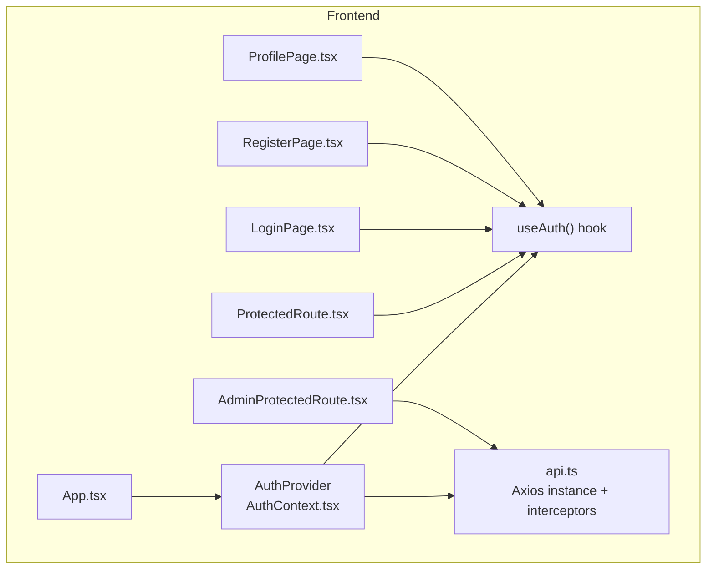
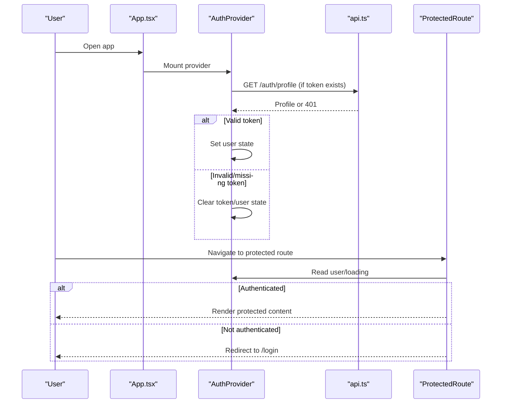
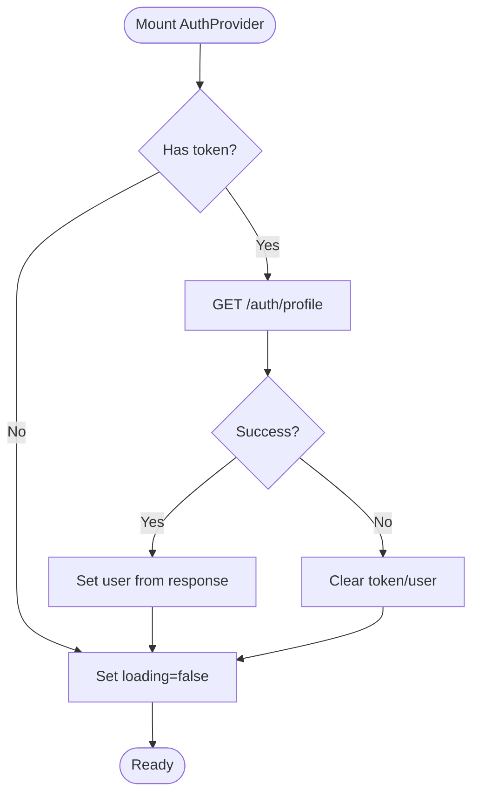
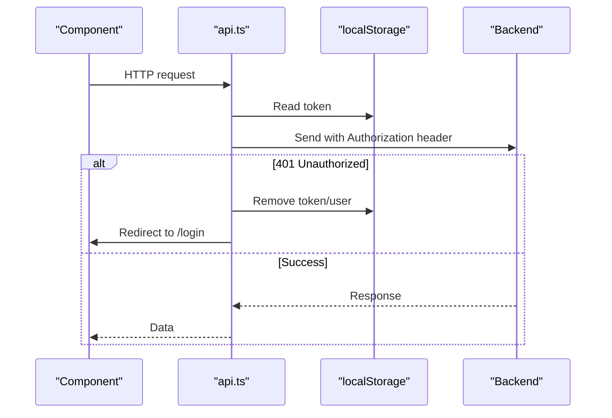
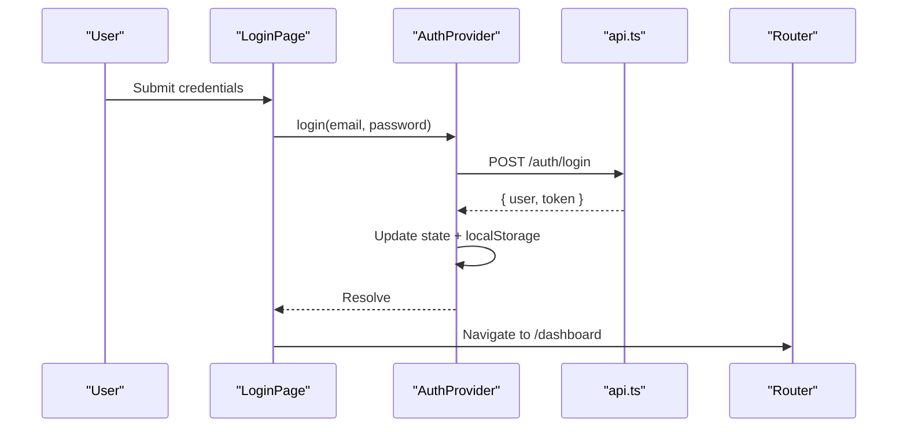
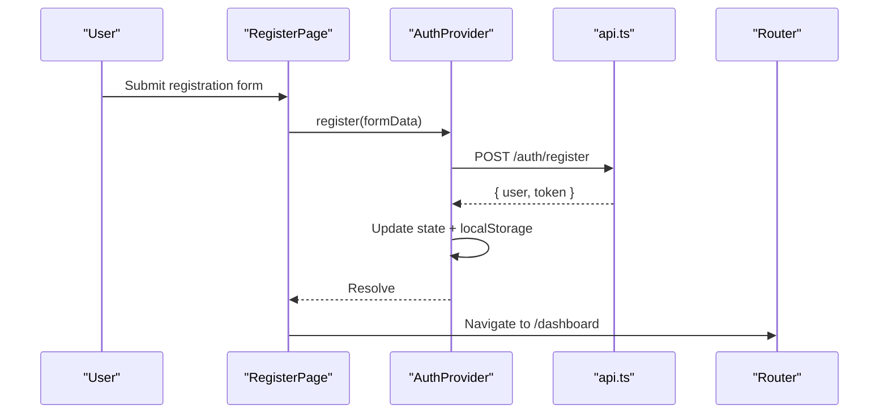
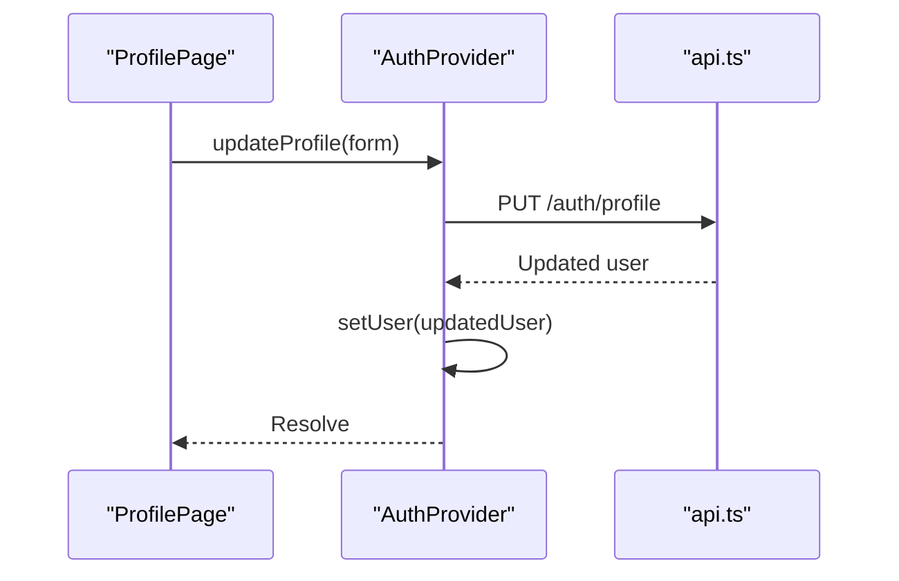
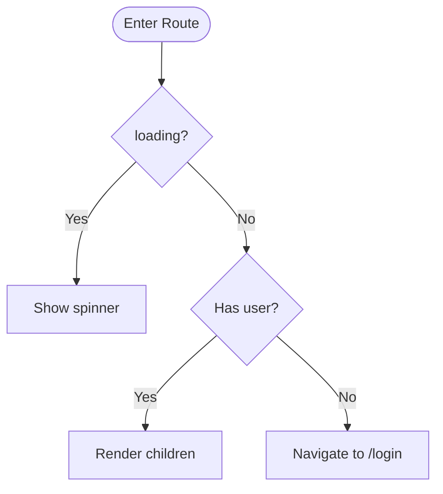
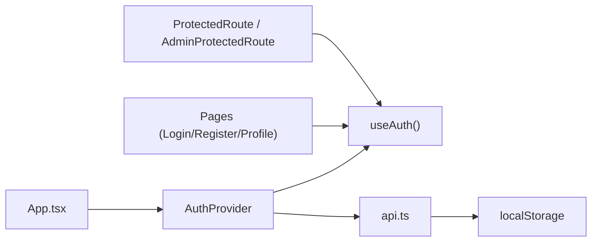

# Authentication Context

<cite>
**Referenced Files in This Document**
- [AuthContext.tsx](file://frontend/src/context/AuthContext.tsx)
- [api.ts](file://frontend/src/services/api.ts)
- [LoginPage.tsx](file://frontend/src/pages/LoginPage.tsx)
- [RegisterPage.tsx](file://frontend/src/pages/RegisterPage.tsx)
- [ProfilePage.tsx](file://frontend/src/pages/ProfilePage.tsx)
- [ProtectedRoute.tsx](file://frontend/src/components/ProtectedRoute.tsx)
- [AdminProtectedRoute.tsx](file://frontend/src/components/AdminProtectedRoute.tsx)
- [App.tsx](file://frontend/src/App.tsx)
- [index.ts](file://frontend/src/types/index.ts)
</cite>

## Table of Contents
1. [Introduction](#introduction)
2. [Project Structure](#project-structure)
3. [Core Components](#core-components)
4. [Architecture Overview](#architecture-overview)
5. [Detailed Component Analysis](#detailed-component-analysis)
6. [Dependency Analysis](#dependency-analysis)
7. [Performance Considerations](#performance-considerations)
8. [Troubleshooting Guide](#troubleshooting-guide)
9. [Conclusion](#conclusion)

## Introduction
This document explains the authentication context implementation built with React Context API. It covers how user sessions are managed, token storage in localStorage, automatic token validation on app initialization, and user profile synchronization. It also documents the AuthProvider component structure, state management patterns for user data and loading states, and the custom useAuth hook used across the application. Examples include login/logout flows, registration, and profile updates. Security considerations for token handling and best practices to prevent unauthorized access are included.

## Project Structure
The authentication system is implemented primarily in the frontend:
- Context and hooks live under src/context
- API client with interceptors lives under src/services
- Pages handle user interactions (login, register, profile)
- Route guards protect routes based on authentication state
- App wires everything together with routing and providers

**Diagram sources**
- [App.tsx:23-51](file://frontend/src/App.tsx#L23-L51)
- [AuthContext.tsx:17-73](file://frontend/src/context/AuthContext.tsx#L17-L73)
- [api.ts:7-39](file://frontend/src/services/api.ts#L7-L39)
- [ProtectedRoute.tsx:4-20](file://frontend/src/components/ProtectedRoute.tsx#L4-L20)
- [AdminProtectedRoute.tsx:3-7](file://frontend/src/components/AdminProtectedRoute.tsx#L3-L7)
- [LoginPage.tsx:6-27](file://frontend/src/pages/LoginPage.tsx#L6-L27)
- [RegisterPage.tsx:6-26](file://frontend/src/pages/RegisterPage.tsx#L6-L26)
- [ProfilePage.tsx:5-28](file://frontend/src/pages/ProfilePage.tsx#L5-L28)

**Section sources**
- [App.tsx:23-51](file://frontend/src/App.tsx#L23-L51)
- [AuthContext.tsx:17-73](file://frontend/src/context/AuthContext.tsx#L17-L73)
- [api.ts:7-39](file://frontend/src/services/api.ts#L7-L39)
- [ProtectedRoute.tsx:4-20](file://frontend/src/components/ProtectedRoute.tsx#L4-L20)
- [AdminProtectedRoute.tsx:3-7](file://frontend/src/components/AdminProtectedRoute.tsx#L3-L7)
- [LoginPage.tsx:6-27](file://frontend/src/pages/LoginPage.tsx#L6-L27)
- [RegisterPage.tsx:6-26](file://frontend/src/pages/RegisterPage.tsx#L6-L26)
- [ProfilePage.tsx:5-28](file://frontend/src/pages/ProfilePage.tsx#L5-L28)

## Core Components
- AuthProvider: Provides authentication state (user, token, loading) and actions (login, register, logout, updateProfile). Initializes session by validating a stored token on mount.
- useAuth: Custom hook that exposes the auth context safely within components.
- api: Axios instance that attaches Authorization headers from localStorage and handles 401 responses by clearing tokens and redirecting to login.
- ProtectedRoute: Guards routes by checking if a user exists; shows a loading spinner while auth initializes.
- AdminProtectedRoute: Guards admin routes using a separate admin token stored in localStorage.

Key responsibilities:
- Session persistence via localStorage (token and user object)
- Automatic validation of persisted token on app start
- Centralized error handling for unauthenticated requests
- UI-level protection of routes and features

**Section sources**
- [AuthContext.tsx:5-81](file://frontend/src/context/AuthContext.tsx#L5-L81)
- [api.ts:11-39](file://frontend/src/services/api.ts#L11-L39)
- [ProtectedRoute.tsx:4-20](file://frontend/src/components/ProtectedRoute.tsx#L4-L20)
- [AdminProtectedRoute.tsx:3-7](file://frontend/src/components/AdminProtectedRoute.tsx#L3-L7)

## Architecture Overview
The authentication flow integrates React Context, an Axios-based API client, and route guards. On app initialization, the context validates any existing token by fetching the current profile. Subsequent requests automatically include the token via request interceptors. Unauthorized responses trigger cleanup and redirection.

**Diagram sources**
- [App.tsx:23-51](file://frontend/src/App.tsx#L23-L51)
- [AuthContext.tsx:17-36](file://frontend/src/context/AuthContext.tsx#L17-L36)
- [api.ts:11-39](file://frontend/src/services/api.ts#L11-L39)
- [ProtectedRoute.tsx:4-20](file://frontend/src/components/ProtectedRoute.tsx#L4-L20)

## Detailed Component Analysis

### AuthProvider and useAuth
- State:
  - user: Current user profile (nullable)
  - token: JWT string from localStorage
  - loading: Boolean indicating initialization status
- Initialization:
  - On mount, if a token exists, fetches /auth/profile to validate it and populate user state
  - On failure, clears token and user state
- Actions:
  - login(email, password): Posts to /auth/login, sets user/token in state and localStorage
  - register(data): Posts to /auth/register, sets user/token in state and localStorage
  - logout(): Clears state and removes token/user from localStorage
  - updateProfile(data): PUT to /auth/profile and updates local user state
- Hook:
  - useAuth() returns the context value and throws if used outside AuthProvider

**Diagram sources**
- [AuthContext.tsx:17-36](file://frontend/src/context/AuthContext.tsx#L17-L36)

**Section sources**
- [AuthContext.tsx:5-81](file://frontend/src/context/AuthContext.tsx#L5-L81)

### API Client Interceptors
- Request interceptor:
  - Reads token from localStorage and adds Authorization header
  - Ensures correct Content-Type for JSON and FormData
- Response interceptor:
  - On 401, removes token and user from localStorage and redirects to /login

**Diagram sources**
- [api.ts:11-39](file://frontend/src/services/api.ts#L11-L39)

**Section sources**
- [api.ts:11-39](file://frontend/src/services/api.ts#L11-L39)

### Login Flow
- LoginPage collects email/password and calls useAuth().login
- On success, navigates to dashboard
- On error, displays server-provided message

**Diagram sources**
- [LoginPage.tsx:14-27](file://frontend/src/pages/LoginPage.tsx#L14-L27)
- [AuthContext.tsx:38-45](file://frontend/src/context/AuthContext.tsx#L38-L45)

**Section sources**
- [LoginPage.tsx:14-27](file://frontend/src/pages/LoginPage.tsx#L14-L27)
- [AuthContext.tsx:38-45](file://frontend/src/context/AuthContext.tsx#L38-L45)

### Registration Flow
- RegisterPage collects user details and calls useAuth().register
- On success, navigates to dashboard
- On error, displays server-provided message

**Diagram sources**
- [RegisterPage.tsx:13-26](file://frontend/src/pages/RegisterPage.tsx#L13-L26)
- [AuthContext.tsx:47-54](file://frontend/src/context/AuthContext.tsx#L47-L54)

**Section sources**
- [RegisterPage.tsx:13-26](file://frontend/src/pages/RegisterPage.tsx#L13-L26)
- [AuthContext.tsx:47-54](file://frontend/src/context/AuthContext.tsx#L47-L54)

### Profile Updates
- ProfilePage reads current user from context and allows editing fields
- Calls useAuth().updateProfile to persist changes
- Displays success/error feedback

**Diagram sources**
- [ProfilePage.tsx:17-28](file://frontend/src/pages/ProfilePage.tsx#L17-L28)
- [AuthContext.tsx:63-66](file://frontend/src/context/AuthContext.tsx#L63-L66)

**Section sources**
- [ProfilePage.tsx:17-28](file://frontend/src/pages/ProfilePage.tsx#L17-L28)
- [AuthContext.tsx:63-66](file://frontend/src/context/AuthContext.tsx#L63-L66)

### Route Protection
- ProtectedRoute renders a loading indicator while auth initializes, then either renders children or redirects to /login
- AdminProtectedRoute checks a separate admin token in localStorage and redirects to /admin/login if missing

**Diagram sources**
- [ProtectedRoute.tsx:4-20](file://frontend/src/components/ProtectedRoute.tsx#L4-L20)

**Section sources**
- [ProtectedRoute.tsx:4-20](file://frontend/src/components/ProtectedRoute.tsx#L4-L20)
- [AdminProtectedRoute.tsx:3-7](file://frontend/src/components/AdminProtectedRoute.tsx#L3-L7)

## Dependency Analysis
- App wraps all routes with AuthProvider so useAuth is available globally
- Pages and components consume useAuth for authentication state and actions
- API client depends on localStorage for token persistence and provides centralized 401 handling
- Route guards depend on context state to enforce access control

**Diagram sources**
- [App.tsx:23-51](file://frontend/src/App.tsx#L23-L51)
- [AuthContext.tsx:17-73](file://frontend/src/context/AuthContext.tsx#L17-L73)
- [api.ts:11-39](file://frontend/src/services/api.ts#L11-L39)
- [ProtectedRoute.tsx:4-20](file://frontend/src/components/ProtectedRoute.tsx#L4-L20)
- [AdminProtectedRoute.tsx:3-7](file://frontend/src/components/AdminProtectedRoute.tsx#L3-L7)

**Section sources**
- [App.tsx:23-51](file://frontend/src/App.tsx#L23-L51)
- [AuthContext.tsx:17-73](file://frontend/src/context/AuthContext.tsx#L17-L73)
- [api.ts:11-39](file://frontend/src/services/api.ts#L11-L39)
- [ProtectedRoute.tsx:4-20](file://frontend/src/components/ProtectedRoute.tsx#L4-L20)
- [AdminProtectedRoute.tsx:3-7](file://frontend/src/components/AdminProtectedRoute.tsx#L3-L7)

## Performance Considerations
- Minimize re-renders: The context exposes only necessary values; consider memoizing derived values if needed
- Avoid redundant network calls: Token validation occurs once on mount; subsequent requests rely on interceptors
- Debounce heavy operations: If profile updates trigger multiple writes, batch or debounce as appropriate
- Keep loading state granular: Use per-action loading flags where necessary to improve UX without over-rendering

[No sources needed since this section provides general guidance]

## Troubleshooting Guide
Common issues and resolutions:
- Stale or invalid token:
  - Symptom: Repeated redirects to login after successful login
  - Cause: Backend rejects token or token expired
  - Resolution: Ensure backend validates tokens correctly; client clears token on 401 and redirects to login
- Missing Authorization header:
  - Symptom: 401 errors on protected endpoints
  - Cause: Token not present in localStorage or interceptor not applied
  - Resolution: Verify token is set during login/register and that axios instance is used for all requests
- Profile sync mismatch:
  - Symptom: UI shows outdated user info after profile update
  - Cause: Local state not updated
  - Resolution: Ensure updateProfile updates local user state with server response

**Section sources**
- [api.ts:26-39](file://frontend/src/services/api.ts#L26-L39)
- [AuthContext.tsx:22-36](file://frontend/src/context/AuthContext.tsx#L22-L36)
- [AuthContext.tsx:63-66](file://frontend/src/context/AuthContext.tsx#L63-L66)

## Conclusion
The authentication context provides a clean, centralized way to manage user sessions in the application. It persists tokens in localStorage, validates them on startup, and enforces route protection. The API client centralizes token injection and 401 handling, while pages interact with the context through a simple useAuth hook. Following the security recommendations below will help maintain a robust and secure authentication experience.

Security considerations and best practices:
- Store tokens securely:
  - Prefer httpOnly cookies for production when possible; if using localStorage, ensure XSS protections are in place
- Validate tokens server-side:
  - Always verify tokens on protected endpoints; never trust client-side checks alone
- Handle expiration gracefully:
  - Implement refresh token flows or prompt re-login on 401
- Protect sensitive routes:
  - Use route guards consistently; combine with role checks if needed
- Sanitize inputs and errors:
  - Do not expose stack traces or internal errors to clients
- Monitor and log:
  - Track failed login attempts and suspicious activity on the backend

[No sources needed since this section summarizes without analyzing specific files]