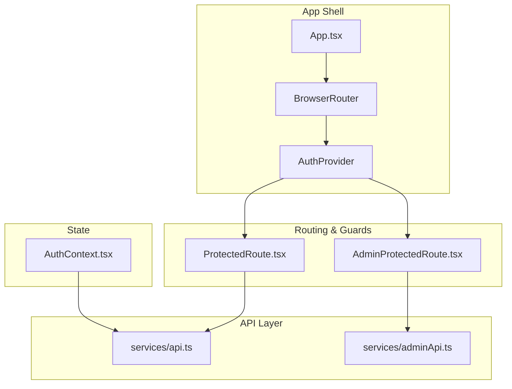
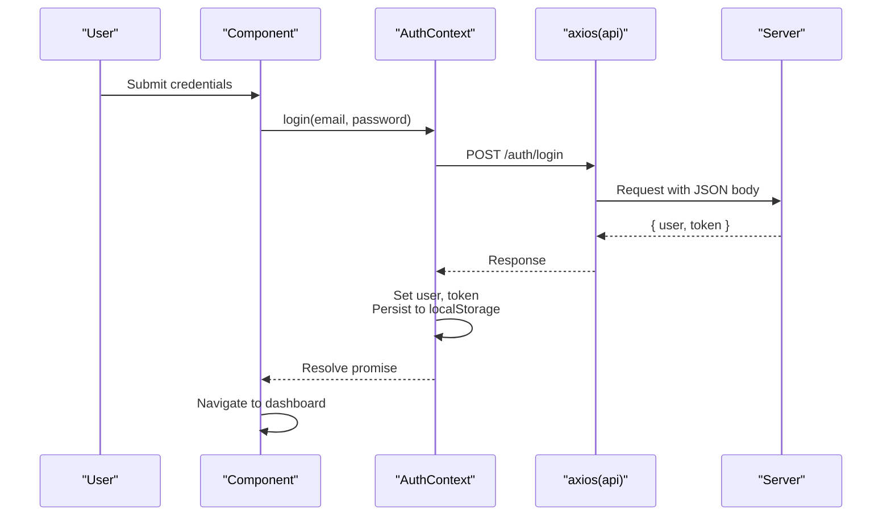
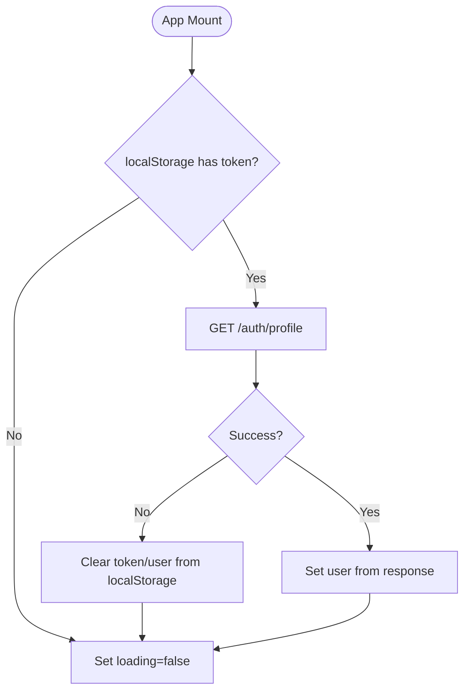
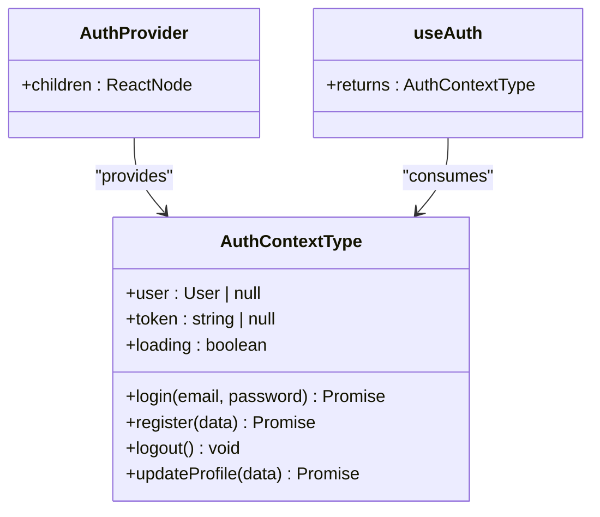
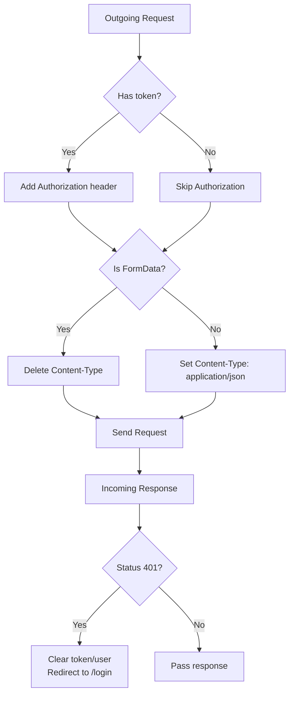
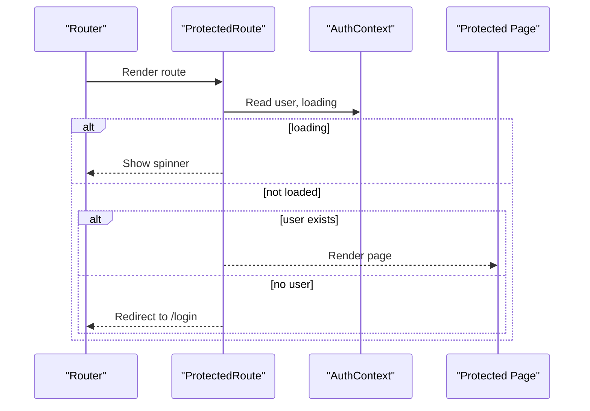
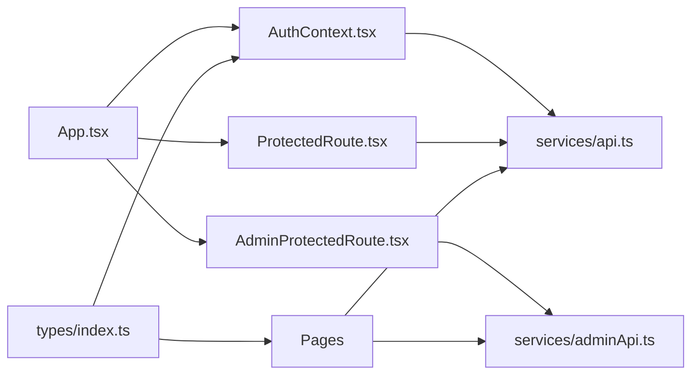

# State Management

<cite>
**Referenced Files in This Document**
- [AuthContext.tsx](file://frontend/src/context/AuthContext.tsx)
- [api.ts](file://frontend/src/services/api.ts)
- [adminApi.ts](file://frontend/src/services/adminApi.ts)
- [ProtectedRoute.tsx](file://frontend/src/components/ProtectedRoute.tsx)
- [AdminProtectedRoute.tsx](file://frontend/src/components/AdminProtectedRoute.tsx)
- [App.tsx](file://frontend/src/App.tsx)
- [index.ts](file://frontend/src/types/index.ts)
- [Layout.tsx](file://frontend/src/components/Layout.tsx)
- [LoginPage.tsx](file://frontend/src/pages/LoginPage.tsx)
</cite>

## Table of Contents
1. [Introduction](#introduction)
2. [Project Structure](#project-structure)
3. [Core Components](#core-components)
4. [Architecture Overview](#architecture-overview)
5. [Detailed Component Analysis](#detailed-component-analysis)
6. [Dependency Analysis](#dependency-analysis)
7. [Performance Considerations](#performance-considerations)
8. [Troubleshooting Guide](#troubleshooting-guide)
9. [Conclusion](#conclusion)
10. [Appendices](#appendices)

## Introduction
This document explains the frontend state management system for the Smart Vehicle Insurance Claim System. It focuses on:
- Context API implementation for authentication state, including user session management and token handling
- Role-based access control patterns using protected routes
- API service layer with Axios configuration, interceptors for authentication headers, error handling strategies, and request/response transformations
- Patterns for managing global state, loading states, and optimistic updates
- Guidance to extend the state management for new features and best practices for performance optimization

## Project Structure
The frontend uses a React application with:
- A central AuthContext providing authentication state and actions
- Axios-based API services for authenticated user flows and admin flows
- Route-level guards to enforce authentication and role-based access
- Typed data models for consistent state across components

**Diagram sources**
- [App.tsx:23-51](file://frontend/src/App.tsx#L23-L51)
- [ProtectedRoute.tsx:4-19](file://frontend/src/components/ProtectedRoute.tsx#L4-L19)
- [AdminProtectedRoute.tsx:3-6](file://frontend/src/components/AdminProtectedRoute.tsx#L3-L6)
- [AuthContext.tsx:17-73](file://frontend/src/context/AuthContext.tsx#L17-L73)
- [api.ts:3-35](file://frontend/src/services/api.ts#L3-L35)
- [adminApi.ts:3-25](file://frontend/src/services/adminApi.ts#L3-L25)

**Section sources**
- [App.tsx:23-51](file://frontend/src/App.tsx#L23-L51)
- [ProtectedRoute.tsx:4-19](file://frontend/src/components/ProtectedRoute.tsx#L4-L19)
- [AdminProtectedRoute.tsx:3-6](file://frontend/src/components/AdminProtectedRoute.tsx#L3-L6)
- [AuthContext.tsx:17-73](file://frontend/src/context/AuthContext.tsx#L17-L73)
- [api.ts:3-35](file://frontend/src/services/api.ts#L3-L35)
- [adminApi.ts:3-25](file://frontend/src/services/adminApi.ts#L3-L25)

## Core Components
- Authentication Context (AuthContext): Provides user, token, loading state, and actions for login, register, logout, and profile update. Persists tokens and user info in localStorage and validates sessions on app start.
- API Services:
  - api.ts: Central Axios instance for user-facing endpoints, adds Authorization header via interceptor, handles 401 by clearing tokens and redirecting to login, sets Content-Type appropriately, and supports FormData uploads.
  - adminApi.ts: Separate Axios instance for admin endpoints with its own token storage and 401/403 handling that redirects to admin login.
- Route Guards:
  - ProtectedRoute: Renders a loading spinner while auth initializes; redirects unauthenticated users to login.
  - AdminProtectedRoute: Redirects to admin login if no admin token is present.
- Types: Strongly typed models for User, Claims, Vehicles, Policies, and AuthResponse used throughout the app.

**Section sources**
- [AuthContext.tsx:5-81](file://frontend/src/context/AuthContext.tsx#L5-L81)
- [api.ts:1-35](file://frontend/src/services/api.ts#L1-L35)
- [adminApi.ts:1-25](file://frontend/src/services/adminApi.ts#L1-L25)
- [ProtectedRoute.tsx:4-19](file://frontend/src/components/ProtectedRoute.tsx#L4-L19)
- [AdminProtectedRoute.tsx:3-6](file://frontend/src/components/AdminProtectedRoute.tsx#L3-L6)
- [index.ts:1-150](file://frontend/src/types/index.ts#L1-L150)

## Architecture Overview
The authentication flow combines React Context for state, Axios interceptors for HTTP concerns, and route guards for UI protection.

**Diagram sources**
- [AuthContext.tsx:38-45](file://frontend/src/context/AuthContext.tsx#L38-L45)
- [api.ts:8-20](file://frontend/src/services/api.ts#L8-L20)
- [LoginPage.tsx:14-27](file://frontend/src/pages/LoginPage.tsx#L14-L27)

**Diagram sources**
- [AuthContext.tsx:22-36](file://frontend/src/context/AuthContext.tsx#L22-L36)

## Detailed Component Analysis

### Authentication Context (AuthContext)
Responsibilities:
- Manages user, token, and loading state
- Initializes session on mount by validating stored token against server
- Provides login, register, logout, and updateProfile actions
- Persists token and user to localStorage for persistence across reloads

Key behaviors:
- On login/register: stores token and user, then navigates or renders protected content
- On logout: clears in-memory state and localStorage
- On profile update: refreshes local user state from server response

**Diagram sources**
- [AuthContext.tsx:5-15](file://frontend/src/context/AuthContext.tsx#L5-L15)
- [AuthContext.tsx:17-81](file://frontend/src/context/AuthContext.tsx#L17-L81)

**Section sources**
- [AuthContext.tsx:17-81](file://frontend/src/context/AuthContext.tsx#L17-L81)

### API Service Layer (api.ts)
Responsibilities:
- Configures base URL for all requests
- Adds Authorization header automatically when a token exists
- Handles Content-Type correctly for JSON and FormData
- Intercepts responses to handle 401 errors by clearing tokens and redirecting to login

Error handling strategy:
- Global 401 handling ensures invalid/expired tokens are cleared and user is redirected
- Localized error messages can be handled in components (e.g., LoginPage)

Request/response transformation:
- Requests are sent as JSON by default unless FormData is detected
- Responses are passed through unchanged; transformations should be centralized here if needed

**Diagram sources**
- [api.ts:8-33](file://frontend/src/services/api.ts#L8-L33)

**Section sources**
- [api.ts:1-35](file://frontend/src/services/api.ts#L1-L35)

### Admin API Service (adminApi.ts)
Responsibilities:
- Dedicated Axios instance for admin endpoints under /api/admin
- Attaches admin token from localStorage
- Handles 401/403 by clearing admin token and redirecting to admin login

Best practice note:
- Keep admin and user APIs separate to avoid token confusion and simplify permissions logic

**Section sources**
- [adminApi.ts:1-25](file://frontend/src/services/adminApi.ts#L1-L25)

### Route Guards and Role-Based Access Control
- ProtectedRoute: Ensures a logged-in user before rendering protected pages; shows a loading indicator during auth initialization
- AdminProtectedRoute: Ensures an admin token exists before rendering admin pages

Role-based access control pattern:
- Use context user properties (e.g., isAdmin) to conditionally render UI or restrict actions within protected pages
- Combine with route guards for coarse-grained access and component-level checks for fine-grained permissions

**Diagram sources**
- [ProtectedRoute.tsx:4-19](file://frontend/src/components/ProtectedRoute.tsx#L4-L19)
- [AuthContext.tsx:17-36](file://frontend/src/context/AuthContext.tsx#L17-L36)

**Section sources**
- [ProtectedRoute.tsx:4-19](file://frontend/src/components/ProtectedRoute.tsx#L4-L19)
- [AdminProtectedRoute.tsx:3-6](file://frontend/src/components/AdminProtectedRoute.tsx#L3-L6)

### Usage Examples in Pages
- Login page calls useAuth.login and navigates on success, showing localized errors on failure
- Layout displays user info and provides logout functionality
- Dashboard reads user from context and fetches additional data via api

These examples demonstrate how to consume the authentication context and API layer consistently.

**Section sources**
- [LoginPage.tsx:14-27](file://frontend/src/pages/LoginPage.tsx#L14-L27)
- [Layout.tsx:14-23](file://frontend/src/components/Layout.tsx#L14-L23)
- [DashboardPage.tsx:8-27](file://frontend/src/pages/DashboardPage.tsx#L8-L27)

## Dependency Analysis
- App wraps the entire routing tree with AuthProvider so all components can access authentication state
- ProtectedRoute depends on AuthContext to determine navigation
- api.ts and adminApi.ts are independent modules used by pages and context
- Types define shared contracts between context, services, and components

**Diagram sources**
- [App.tsx:23-51](file://frontend/src/App.tsx#L23-L51)
- [AuthContext.tsx:17-73](file://frontend/src/context/AuthContext.tsx#L17-L73)
- [ProtectedRoute.tsx:4-19](file://frontend/src/components/ProtectedRoute.tsx#L4-L19)
- [AdminProtectedRoute.tsx:3-6](file://frontend/src/components/AdminProtectedRoute.tsx#L3-L6)
- [api.ts:1-35](file://frontend/src/services/api.ts#L1-L35)
- [adminApi.ts:1-25](file://frontend/src/services/adminApi.ts#L1-L25)
- [index.ts:1-150](file://frontend/src/types/index.ts#L1-L150)

**Section sources**
- [App.tsx:23-51](file://frontend/src/App.tsx#L23-L51)
- [AuthContext.tsx:17-73](file://frontend/src/context/AuthContext.tsx#L17-L73)
- [ProtectedRoute.tsx:4-19](file://frontend/src/components/ProtectedRoute.tsx#L4-L19)
- [AdminProtectedRoute.tsx:3-6](file://frontend/src/components/AdminProtectedRoute.tsx#L3-L6)
- [api.ts:1-35](file://frontend/src/services/api.ts#L1-L35)
- [adminApi.ts:1-25](file://frontend/src/services/adminApi.ts#L1-L25)
- [index.ts:1-150](file://frontend/src/types/index.ts#L1-L150)

## Performance Considerations
- Minimize re-renders:
  - Memoize expensive computations in components that depend on auth state
  - Avoid placing heavy logic inside providers; keep provider lean
- Token validation:
  - The initial profile fetch prevents unnecessary network calls after invalidating tokens
- Network efficiency:
  - Centralize error handling and transformations in interceptors to reduce duplication
  - Use parallel requests where appropriate (e.g., fetching multiple resources concurrently)
- Storage hygiene:
  - Ensure tokens and user data are kept minimal in localStorage
  - Clear stale data on logout or 401 responses

[No sources needed since this section provides general guidance]

## Troubleshooting Guide
Common issues and resolutions:
- Stuck on loading screen:
  - Verify that the initial profile fetch succeeds; check network tab for 401/403
  - Ensure token exists in localStorage and matches server expectations
- Unexpected redirects to login:
  - Confirm that 401 handling clears tokens and redirects as expected
  - Validate that the Authorization header is attached for protected endpoints
- Admin area inaccessible:
  - Ensure adminToken is set and valid; adminApi handles 401/403 by redirecting to admin login
- Form submission errors:
  - Inspect error.response.data for server-provided messages; display them to users

**Section sources**
- [api.ts:22-33](file://frontend/src/services/api.ts#L22-L33)
- [adminApi.ts:14-23](file://frontend/src/services/adminApi.ts#L14-L23)
- [ProtectedRoute.tsx:7-17](file://frontend/src/components/ProtectedRoute.tsx#L7-L17)
- [LoginPage.tsx:19-27](file://frontend/src/pages/LoginPage.tsx#L19-L27)

## Conclusion
The frontend state management leverages React Context for authentication, Axios interceptors for consistent HTTP behavior, and route guards for secure navigation. This design cleanly separates concerns, supports role-based access control, and provides a foundation for extending state and API interactions. Following the recommended patterns will help maintain scalability, reliability, and performance as the application grows.

[No sources needed since this section summarizes without analyzing specific files]

## Appendices

### Extending State Management for New Features
- Adding a new feature-scoped state:
  - Create a dedicated Context for the feature (e.g., ClaimsContext) and provide it near the relevant route subtree
  - Expose actions and selectors to minimize re-renders
- Integrating with API:
  - Add methods to your Context that call the appropriate service (api or adminApi)
  - Handle loading and error states locally within the Context or at the component level
- Optimistic updates:
  - Update local state immediately upon user action
  - Reconcile with server response; revert changes on error
  - Use stable IDs and versioning to manage conflicts
- Role-based UI:
  - Use user.isAdmin or other fields to conditionally render features
  - Combine with route guards for server-enforced security

[No sources needed since this section provides general guidance]