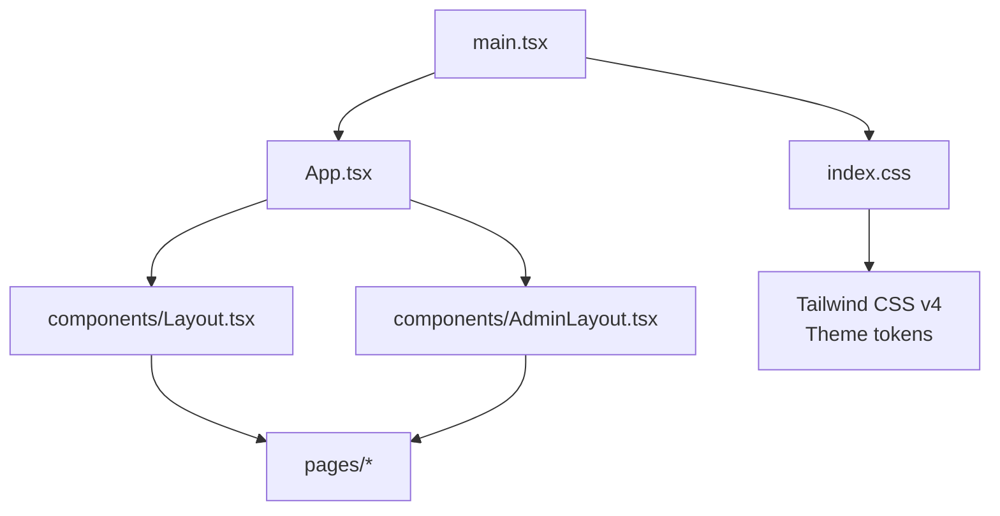
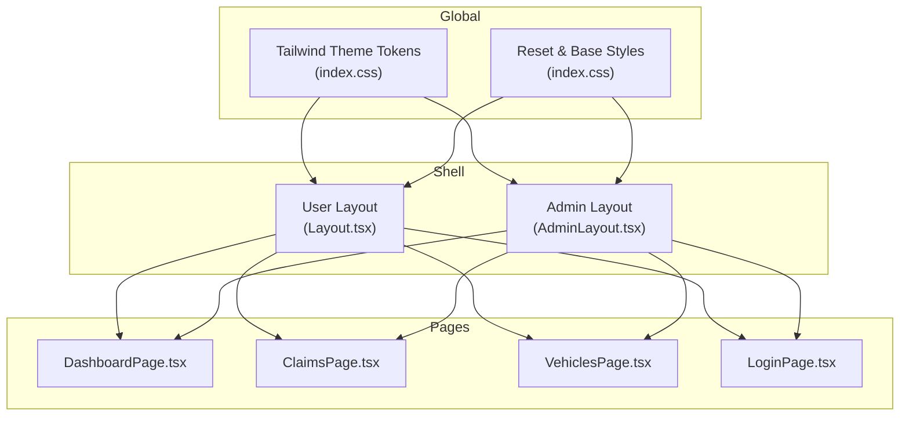
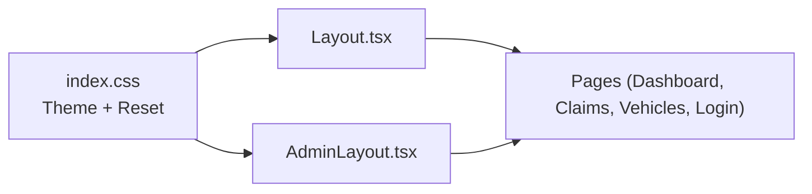

# Styling and UI Patterns

<cite>
**Referenced Files in This Document**
- [index.css](file://frontend/src/index.css)
- [package.json](file://frontend/package.json)
- [vite.config.ts](file://frontend/vite.config.ts)
- [main.tsx](file://frontend/src/main.tsx)
- [App.tsx](file://frontend/src/App.tsx)
- [Layout.tsx](file://frontend/src/components/Layout.tsx)
- [AdminLayout.tsx](file://frontend/src/components/AdminLayout.tsx)
- [LoginPage.tsx](file://frontend/src/pages/LoginPage.tsx)
- [DashboardPage.tsx](file://frontend/src/pages/DashboardPage.tsx)
- [ClaimsPage.tsx](file://frontend/src/pages/ClaimsPage.tsx)
- [VehiclesPage.tsx](file://frontend/src/pages/VehiclesPage.tsx)
</cite>

## Table of Contents
1. Introduction
2. Project Structure
3. Core Components
4. Architecture Overview
5. Detailed Component Analysis
6. Dependency Analysis
7. Performance Considerations
8. Troubleshooting Guide
9. Conclusion
10. Appendices

## Introduction
This document explains the styling approach and UI patterns used across the application’s frontend. It covers Tailwind CSS configuration, custom theme setup, responsive design implementation, color schemes, typography standards, spacing conventions, and component styling patterns. It also provides guidelines for creating consistent UI elements, handling dark mode considerations, ensuring accessibility compliance, and maintaining visual consistency with practical examples and best practices.

## Project Structure
The frontend is a React + Vite application using Tailwind CSS v4 via the official plugin. Global styles and theme tokens are defined in a single CSS file imported at app bootstrap. Layouts encapsulate shared chrome (sidebar, header, content area), while pages compose reusable UI primitives consistently.

**Diagram sources**
- [main.tsx:1-11](file://frontend/src/main.tsx#L1-L11)
- [index.css:1-39](file://frontend/src/index.css#L1-L39)
- [App.tsx:1-56](file://frontend/src/App.tsx#L1-L56)
- [Layout.tsx:1-176](file://frontend/src/components/Layout.tsx#L1-L176)
- [AdminLayout.tsx:1-74](file://frontend/src/components/AdminLayout.tsx#L1-L74)

**Section sources**
- [main.tsx:1-11](file://frontend/src/main.tsx#L1-L11)
- [index.css:1-39](file://frontend/src/index.css#L1-L39)
- [App.tsx:1-56](file://frontend/src/App.tsx#L1-L56)

## Core Components
- Theme and global styles: Centralized in index.css with Tailwind v4 @theme tokens for brand colors and semantic tokens (primary, danger, success, warning). Body font stack and reset rules ensure consistent rendering.
- Build integration: Tailwind is enabled through the Vite plugin; environment-based proxying is configured for API calls.
- Layouts: 
  - User-facing layout (Layout.tsx) provides a responsive sidebar, mobile header, overlay navigation, and main content area.
  - Admin layout (AdminLayout.tsx) offers a dark-themed sidebar and content area for administrative tasks.
- Pages: Consistent use of cards, grids, badges, buttons, forms, and status indicators across Dashboard, Claims, Vehicles, and Login screens.

Key styling highlights:
- Color system: Brand primary palette with semantic variants (danger, success, warning).
- Typography: System font stack for performance and readability; consistent heading sizes and weights.
- Spacing: Uniform padding/margins using Tailwind utilities; responsive scaling with sm:, md:, lg: breakpoints.
- Components: Cards with rounded corners, subtle borders, and shadows; interactive states with hover/focus rings; status badges with semantic colors.

**Section sources**
- [index.css:1-39](file://frontend/src/index.css#L1-L39)
- [vite.config.ts:1-30](file://frontend/vite.config.ts#L1-L30)
- [Layout.tsx:1-176](file://frontend/src/components/Layout.tsx#L1-L176)
- [AdminLayout.tsx:1-74](file://frontend/src/components/AdminLayout.tsx#L1-L74)
- [DashboardPage.tsx:1-142](file://frontend/src/pages/DashboardPage.tsx#L1-L142)
- [ClaimsPage.tsx:1-98](file://frontend/src/pages/ClaimsPage.tsx#L1-L98)
- [VehiclesPage.tsx:1-369](file://frontend/src/pages/VehiclesPage.tsx#L1-L369)
- [LoginPage.tsx:1-105](file://frontend/src/pages/LoginPage.tsx#L1-L105)

## Architecture Overview
The styling architecture centers on a single source of truth for theme tokens and a set of layout components that enforce consistent structure. Pages compose these layouts and apply utility classes to achieve responsive, accessible interfaces.

**Diagram sources**
- [index.css:1-39](file://frontend/src/index.css#L1-L39)
- [Layout.tsx:1-176](file://frontend/src/components/Layout.tsx#L1-L176)
- [AdminLayout.tsx:1-74](file://frontend/src/components/AdminLayout.tsx#L1-L74)
- [DashboardPage.tsx:1-142](file://frontend/src/pages/DashboardPage.tsx#L1-L142)
- [ClaimsPage.tsx:1-98](file://frontend/src/pages/ClaimsPage.tsx#L1-L98)
- [VehiclesPage.tsx:1-369](file://frontend/src/pages/VehiclesPage.tsx#L1-L369)
- [LoginPage.tsx:1-105](file://frontend/src/pages/LoginPage.tsx#L1-L105)

## Detailed Component Analysis

### Tailwind Configuration and Theme
- Theme tokens: Custom color scales under primary, danger, success, and warning namespaces enable semantic styling and brand consistency.
- Base styles: System font stack and box-sizing reset applied globally for predictable rendering.
- Integration: Tailwind v4 is enabled via the Vite plugin; no separate config file is required.

Guidelines:
- Use semantic tokens (e.g., bg-primary-600, text-danger-600) instead of arbitrary hex values.
- Keep color usage aligned with meaning: success for positive actions, warning for caution, danger for destructive/error states.
- Extend the theme only when necessary; prefer composition of existing tokens.

**Section sources**
- [index.css:1-39](file://frontend/src/index.css#L1-L39)
- [vite.config.ts:1-30](file://frontend/vite.config.ts#L1-L30)

### Responsive Design Implementation
- Breakpoints: The codebase uses Tailwind’s default breakpoints (sm, lg) to adapt layouts.
- Navigation: Desktop shows a persistent sidebar; mobile switches to a top header with a slide-out drawer and a bottom tab bar for quick access.
- Grids: Content areas switch from single-column to multi-column grids as screen size increases.

Patterns observed:
- Conditional visibility with hidden/large-screen classes.
- Flexible containers with max-width and centering for readability.
- Touch-friendly tap targets and spacing on mobile.

**Section sources**
- [Layout.tsx:25-176](file://frontend/src/components/Layout.tsx#L25-L176)
- [DashboardPage.tsx:46-142](file://frontend/src/pages/DashboardPage.tsx#L46-L142)
- [ClaimsPage.tsx:34-98](file://frontend/src/pages/ClaimsPage.tsx#L34-L98)
- [VehiclesPage.tsx:18-55](file://frontend/src/pages/VehiclesPage.tsx#L18-L55)

### Color Schemes and Semantic Tokens
- Primary palette: Used for branding, active states, and primary actions.
- Semantic colors: Danger for errors/alerts, success for confirmations, warning for cautions.
- Status badges: Consistent mapping between data states (e.g., claim statuses) and background/text colors.

Best practices:
- Maintain contrast ratios for readability.
- Avoid relying solely on color to convey meaning; pair with icons or labels.

**Section sources**
- [index.css:3-27](file://frontend/src/index.css#L3-L27)
- [DashboardPage.tsx:29-36](file://frontend/src/pages/DashboardPage.tsx#L29-L36)
- [ClaimsPage.tsx:7-20](file://frontend/src/pages/ClaimsPage.tsx#L7-L20)
- [VehiclesPage.tsx:207-211](file://frontend/src/pages/VehiclesPage.tsx#L207-L211)

### Typography Standards
- Font family: System font stack for optimal performance and native feel.
- Hierarchy: Consistent heading sizes and weights; body text uses medium weight for labels and regular for content.
- Readability: Adequate line-height and spacing around headings and paragraphs.

Guidelines:
- Limit type scale to a few sizes to maintain harmony.
- Use uppercase sparingly (e.g., small labels) and ensure sufficient contrast.

**Section sources**
- [index.css:29-34](file://frontend/src/index.css#L29-L34)
- [Layout.tsx:29-36](file://frontend/src/components/Layout.tsx#L29-L36)
- [DashboardPage.tsx:48-53](file://frontend/src/pages/DashboardPage.tsx#L48-L53)

### Spacing Conventions
- Padding/Margin: Consistent use of Tailwind spacing utilities (p-4, p-6, space-y-*, gap-*) for rhythm and alignment.
- Card surfaces: Rounded corners, subtle borders, and soft shadows to create elevation.
- Form controls: Uniform height, border radius, focus rings, and label/input spacing.

Patterns:
- Use gap utilities for lists and grids to keep spacing consistent.
- Reserve larger paddings for card interiors and smaller for inline elements.

**Section sources**
- [Layout.tsx:39-79](file://frontend/src/components/Layout.tsx#L39-L79)
- [DashboardPage.tsx:55-80](file://frontend/src/pages/DashboardPage.tsx#L55-L80)
- [VehiclesPage.tsx:313-364](file://frontend/src/pages/VehiclesPage.tsx#L313-L364)

### Component Styling Patterns
- Buttons: Primary action buttons use the primary palette with hover states and disabled opacity; secondary actions use outlines or muted backgrounds.
- Cards: White backgrounds, rounded-xl, shadow-sm, border-gray-200 for clarity and separation.
- Badges: Small, rounded-full labels with semantic colors for status and severity.
- Forms: Inputs with visible focus rings, clear labels, and error/success feedback blocks.

Accessibility notes:
- Ensure focus-visible states are present for keyboard users.
- Provide descriptive labels and aria attributes where needed.

**Section sources**
- [LoginPage.tsx:40-100](file://frontend/src/pages/LoginPage.tsx#L40-L100)
- [DashboardPage.tsx:55-100](file://frontend/src/pages/DashboardPage.tsx#L55-L100)
- [ClaimsPage.tsx:62-94](file://frontend/src/pages/ClaimsPage.tsx#L62-L94)
- [VehiclesPage.tsx:217-300](file://frontend/src/pages/VehiclesPage.tsx#L217-L300)

### Dark Mode Considerations
- Current state: No explicit dark mode toggle or media query strategy is implemented in the analyzed files.
- Recommendation: Introduce a root-level class or attribute (e.g., dark) and extend theme tokens for dark variants. Use Tailwind’s dark: modifier to style components conditionally.
- Migration path: Start by defining dark variants for key surfaces (backgrounds, borders, text) and test contrast ratios.

[No sources needed since this section provides general guidance]

### Accessibility Compliance
- Focus management: Inputs and interactive elements include focus rings for visibility.
- Contrast: Text and interactive elements adhere to readable contrast levels against backgrounds.
- Semantics: Links and buttons are used appropriately; form inputs have associated labels.
- Recommendations: Add aria-live regions for dynamic updates (e.g., loading, errors), ensure keyboard navigation works for drawers and menus, and provide alt text for images.

**Section sources**
- [LoginPage.tsx:50-82](file://frontend/src/pages/LoginPage.tsx#L50-L82)
- [Layout.tsx:83-143](file://frontend/src/components/Layout.tsx#L83-L143)

### Examples of Common Styling Patterns
- Page shells: Full-height flex container with sidebar and main content area.
- Data lists: Cards with title, subtitle, metadata, and status badge.
- Empty states: Centered icon, message, and call-to-action link.
- Loading states: Spinner with brand-colored accent.
- Error/Success banners: Inline alerts with icons and semantic colors.

**Section sources**
- [DashboardPage.tsx:38-44](file://frontend/src/pages/DashboardPage.tsx#L38-L44)
- [DashboardPage.tsx:110-118](file://frontend/src/pages/DashboardPage.tsx#L110-L118)
- [ClaimsPage.tsx:55-62](file://frontend/src/pages/ClaimsPage.tsx#L55-L62)
- [VehiclesPage.tsx:27-33](file://frontend/src/pages/VehiclesPage.tsx#L27-L33)

## Dependency Analysis
Styling dependencies flow from global theme tokens into layout and page components. Tailwind utilities compose the final appearance without additional CSS frameworks.

**Diagram sources**
- [index.css:1-39](file://frontend/src/index.css#L1-L39)
- [Layout.tsx:1-176](file://frontend/src/components/Layout.tsx#L1-L176)
- [AdminLayout.tsx:1-74](file://frontend/src/components/AdminLayout.tsx#L1-L74)
- [DashboardPage.tsx:1-142](file://frontend/src/pages/DashboardPage.tsx#L1-L142)
- [ClaimsPage.tsx:1-98](file://frontend/src/pages/ClaimsPage.tsx#L1-L98)
- [VehiclesPage.tsx:1-369](file://frontend/src/pages/VehiclesPage.tsx#L1-L369)
- [LoginPage.tsx:1-105](file://frontend/src/pages/LoginPage.tsx#L1-L105)

**Section sources**
- [package.json:20-29](file://frontend/package.json#L20-L29)
- [vite.config.ts:1-30](file://frontend/vite.config.ts#L1-L30)

## Performance Considerations
- Utility-first CSS: Tailwind generates minimal, purged CSS for production builds, reducing payload.
- System fonts: Using system font stack avoids extra font downloads and improves render speed.
- Images and assets: Prefer optimized images and lazy-loading where applicable.
- Reusable components: Encapsulate repeated patterns in small components to reduce duplication and improve maintainability.

[No sources needed since this section provides general guidance]

## Troubleshooting Guide
Common styling issues and resolutions:
- Colors not appearing: Ensure Tailwind plugin is enabled in Vite and that index.css is imported before App initialization.
- Inconsistent spacing: Verify you are using spacing utilities consistently and avoid mixing margin/padding arbitrarily.
- Focus ring missing: Confirm focus utilities are applied to interactive elements and that browser settings do not suppress outlines.
- Mobile layout overlap: Check z-index stacking for overlays and fixed headers; ensure main content has appropriate top margins or padding.

**Section sources**
- [vite.config.ts:1-30](file://frontend/vite.config.ts#L1-L30)
- [main.tsx:1-11](file://frontend/src/main.tsx#L1-L11)
- [Layout.tsx:83-143](file://frontend/src/components/Layout.tsx#L83-L143)

## Conclusion
The application employs a clean, utility-first styling approach with Tailwind CSS v4 and a centralized theme. Consistent layouts, semantic color tokens, and responsive patterns ensure a cohesive user experience across devices. By following the guidelines outlined here—using semantic tokens, maintaining accessible interactions, and composing reusable components—you can sustain visual consistency and scalability as the application grows.

[No sources needed since this section summarizes without analyzing specific files]

## Appendices

### Build and Dev Setup Notes
- Tailwind v4 is integrated via the Vite plugin; no traditional config file is required.
- Environment variables configure API proxying during development.

**Section sources**
- [package.json:20-29](file://frontend/package.json#L20-L29)
- [vite.config.ts:1-30](file://frontend/vite.config.ts#L1-L30)