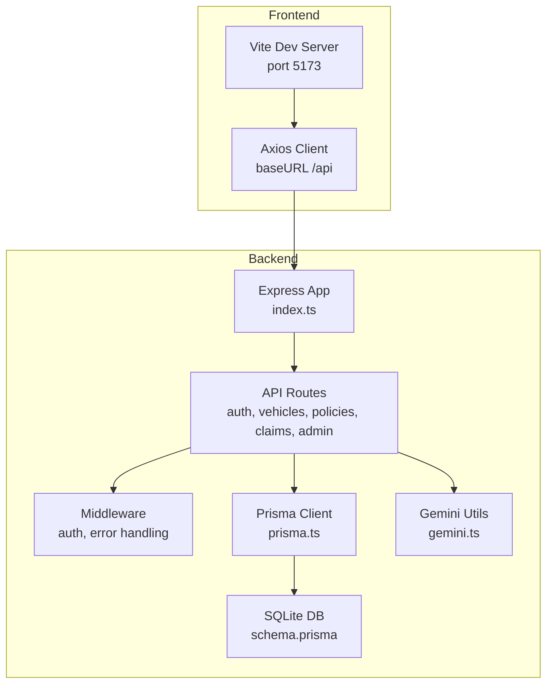
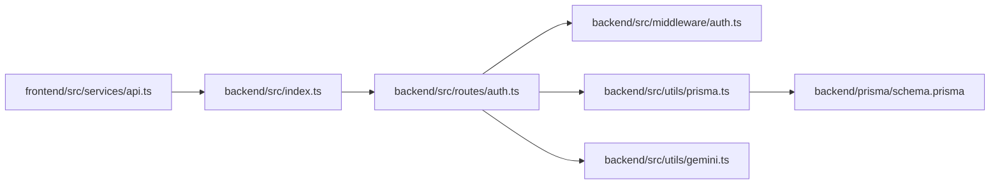

# Getting Started

<cite>
**Referenced Files in This Document**
- [backend/package.json](file://backend/package.json)
- [frontend/package.json](file://frontend/package.json)
- [backend/src/index.ts](file://backend/src/index.ts)
- [backend/prisma/schema.prisma](file://backend/prisma/schema.prisma)
- [backend/src/utils/prisma.ts](file://backend/src/utils/prisma.ts)
- [backend/src/scripts/seedAdmin.ts](file://backend/src/scripts/seedAdmin.ts)
- [backend/src/utils/gemini.ts](file://backend/src/utils/gemini.ts)
- [backend/src/middleware/auth.ts](file://backend/src/middleware/auth.ts)
- [backend/src/routes/auth.ts](file://backend/src/routes/auth.ts)
- [frontend/vite.config.ts](file://frontend/vite.config.ts)
- [frontend/src/services/api.ts](file://frontend/src/services/api.ts)
</cite>

## Table of Contents
1. Introduction
2. Project Structure
3. Prerequisites
4. Environment Setup
5. Installation and Database Initialization
6. Running the Application
7. Quick Start Examples
8. Development Workflow
9. Dependency Analysis
10. Performance Considerations
11. Troubleshooting Guide
12. Conclusion

## Introduction
This guide helps you set up and run the Smart Vehicle Insurance Claim System locally. It covers prerequisites, environment configuration, database setup with Prisma, seed data creation (including an admin user), and how to start both frontend and backend servers for development. You will also find quick-start examples for registering a user and registering a vehicle, along with tips for hot reloading and common troubleshooting.

## Project Structure
The project is split into two main parts:
- Backend: Express-based API server using TypeScript, Prisma ORM, SQLite by default, JWT authentication, and optional Google Gemini integration.
- Frontend: React + Vite application with Tailwind CSS, Axios client, and proxy configuration to communicate with the backend during development.

**Diagram sources**
- [backend/src/index.ts:1-49](file://backend/src/index.ts#L1-L49)
- [backend/prisma/schema.prisma:1-202](file://backend/prisma/schema.prisma#L1-L202)
- [backend/src/utils/prisma.ts:1-6](file://backend/src/utils/prisma.ts#L1-L6)
- [backend/src/utils/gemini.ts:1-12](file://backend/src/utils/gemini.ts#L1-L12)
- [frontend/vite.config.ts:1-21](file://frontend/vite.config.ts#L1-L21)
- [frontend/src/services/api.ts:1-36](file://frontend/src/services/api.ts#L1-L36)

**Section sources**
- [backend/src/index.ts:1-49](file://backend/src/index.ts#L1-L49)
- [frontend/vite.config.ts:1-21](file://frontend/vite.config.ts#L1-L21)

## Prerequisites
- Node.js: Use a recent LTS version compatible with the tooling in this project. The backend uses modern TypeScript and tooling; ensure your Node.js version supports the dependencies listed in the package files.
- npm or yarn: To install dependencies and run scripts.
- A local directory where you can create uploads if needed.

Notes:
- The backend runs on port 5000 by default.
- The frontend dev server runs on port 5173 by default and proxies API requests to the backend.

**Section sources**
- [backend/package.json:1-43](file://backend/package.json#L1-L43)
- [frontend/package.json:1-32](file://frontend/package.json#L1-L32)
- [backend/src/index.ts:14-22](file://backend/src/index.ts#L14-L22)
- [frontend/vite.config.ts:8-18](file://frontend/vite.config.ts#L8-L18)

## Environment Setup
Create environment files for both backend and frontend as needed.

- Backend (.env):
  - DATABASE_URL: Connection string for the database. The schema uses SQLite by default.
  - PORT: Backend server port (default 5000).
  - CORS_ORIGIN: Allowed origin for CORS (default allows localhost:5173).
  - UPLOAD_DIR: Directory for uploaded files (served statically under /uploads).
  - JWT_SECRET: Secret used to sign and verify JWT tokens.
  - GEMINI_API_KEY: Optional key for Google Gemini AI features.

- Frontend:
  - No .env file is required for basic development because the Vite config proxies /api and /uploads to the backend.

Important:
- Ensure JWT_SECRET is set before starting the backend to enable authentication flows.
- If you plan to use AI features, set GEMINI_API_KEY.

**Section sources**
- [backend/src/index.ts:14-27](file://backend/src/index.ts#L14-L27)
- [backend/src/utils/gemini.ts:1-12](file://backend/src/utils/gemini.ts#L1-L12)
- [backend/src/middleware/auth.ts:5-22](file://backend/src/middleware/auth.ts#L5-L22)
- [frontend/vite.config.ts:8-18](file://frontend/vite.config.ts#L8-L18)

## Installation and Database Initialization
Follow these steps to install dependencies and initialize the database.

1. Install backend dependencies:
   - In the backend folder, run the dependency installer.
   - Generate Prisma client: prisma generate.
   - Apply migrations to create tables: prisma migrate dev.
     - Alternatively, push schema directly without migration history: prisma db push.

2. Seed the database with an admin user:
   - Run the seed script to create an initial admin account.
   - The script ensures an admin user exists and sets the admin flag if necessary.

3. Install frontend dependencies:
   - In the frontend folder, run the dependency installer.

Verification:
- Start the backend and call the health endpoint to confirm it is running.
- Start the frontend and open the app in your browser.

**Section sources**
- [backend/package.json:6-13](file://backend/package.json#L6-L13)
- [backend/prisma/schema.prisma:5-8](file://backend/prisma/schema.prisma#L5-L8)
- [backend/src/scripts/seedAdmin.ts:9-34](file://backend/src/scripts/seedAdmin.ts#L9-L34)
- [frontend/package.json:6-10](file://frontend/package.json#L6-L10)

## Running the Application
Start both servers concurrently for development.

- Backend:
  - Run the development script that watches source changes and restarts automatically.
  - The server listens on the configured port (default 5000).

- Frontend:
  - Run the development script to start the Vite dev server.
  - Requests to /api and /uploads are proxied to the backend automatically.

Hot Reloading:
- Backend: Uses a watcher to reload on code changes.
- Frontend: Vite provides hot module replacement out of the box.

**Section sources**
- [backend/package.json:6-13](file://backend/package.json#L6-L13)
- [backend/src/index.ts:44-46](file://backend/src/index.ts#L44-L46)
- [frontend/package.json:6-10](file://frontend/package.json#L6-L10)
- [frontend/vite.config.ts:8-18](file://frontend/vite.config.ts#L8-L18)

## Quick Start Examples
After installation and seeding:

- Register a new user:
  - Send a POST request to the registration endpoint with email, password, first name, and last name.
  - On success, you receive a user object and a JWT token.

- Log in:
  - Send a POST request to the login endpoint with email and password.
  - On success, you receive a user object and a JWT token.

- Store the token in the frontend:
  - The frontend Axios client automatically attaches the stored token to subsequent requests.

- Register a vehicle:
  - After logging in, send a POST request to the vehicles endpoint with vehicle details.
  - The backend associates the vehicle with the authenticated user.

Notes:
- Protected routes require a valid Bearer token in the Authorization header.
- The frontend handles 401 responses by clearing session data and redirecting to login.

**Section sources**
- [backend/src/routes/auth.ts:10-59](file://backend/src/routes/auth.ts#L10-L59)
- [backend/src/routes/auth.ts:61-105](file://backend/src/routes/auth.ts#L61-L105)
- [backend/src/middleware/auth.ts:5-22](file://backend/src/middleware/auth.ts#L5-L22)
- [frontend/src/services/api.ts:7-33](file://frontend/src/services/api.ts#L7-L33)

## Development Workflow
Recommended workflow:
1. Set up environment variables in the backend .env file.
2. Initialize the database with Prisma migrations and seed the admin user.
3. Start the backend development server.
4. Start the frontend development server.
5. Open the app in your browser and test flows like registration, login, and vehicle management.

Tips:
- Keep both terminals open to benefit from hot reloading on both sides.
- Use the health check endpoint to verify backend availability.
- If you change the schema, regenerate the client and apply migrations before restarting.

**Section sources**
- [backend/package.json:6-13](file://backend/package.json#L6-L13)
- [backend/src/index.ts:36-39](file://backend/src/index.ts#L36-L39)
- [frontend/vite.config.ts:8-18](file://frontend/vite.config.ts#L8-L18)

## Dependency Analysis
High-level relationships between core components:

**Diagram sources**
- [frontend/src/services/api.ts:1-36](file://frontend/src/services/api.ts#L1-L36)
- [backend/src/index.ts:1-49](file://backend/src/index.ts#L1-L49)
- [backend/src/routes/auth.ts:1-168](file://backend/src/routes/auth.ts#L1-L168)
- [backend/src/middleware/auth.ts:1-23](file://backend/src/middleware/auth.ts#L1-L23)
- [backend/src/utils/prisma.ts:1-6](file://backend/src/utils/prisma.ts#L1-L6)
- [backend/prisma/schema.prisma:1-202](file://backend/prisma/schema.prisma#L1-L202)
- [backend/src/utils/gemini.ts:1-12](file://backend/src/utils/gemini.ts#L1-L12)

**Section sources**
- [backend/src/routes/auth.ts:1-168](file://backend/src/routes/auth.ts#L1-L168)
- [backend/src/middleware/auth.ts:1-23](file://backend/src/middleware/auth.ts#L1-L23)
- [backend/src/utils/prisma.ts:1-6](file://backend/src/utils/prisma.ts#L1-L6)
- [backend/prisma/schema.prisma:1-202](file://backend/prisma/schema.prisma#L1-L202)
- [backend/src/utils/gemini.ts:1-12](file://backend/src/utils/gemini.ts#L1-L12)
- [frontend/src/services/api.ts:1-36](file://frontend/src/services/api.ts#L1-L36)

## Performance Considerations
- Use Prisma migrations for schema changes to keep the database consistent and avoid costly pushes in production.
- Configure CORS_ORIGIN appropriately to limit cross-origin access to trusted domains.
- Set appropriate limits for request payloads if you handle large uploads.
- Consider enabling compression and caching strategies in production builds.

[No sources needed since this section provides general guidance]

## Troubleshooting Guide
Common issues and resolutions:

- Authentication errors (401 Unauthorized):
  - Ensure JWT_SECRET is set in the backend environment.
  - Verify the frontend has a valid token stored and attached to requests.
  - Check that protected endpoints receive a proper Authorization header with a Bearer token.

- CORS errors:
  - Confirm CORS_ORIGIN includes the frontend’s origin (e.g., http://localhost:5173).
  - Ensure the frontend is served from the expected origin during development.

- Database connection issues:
  - Verify DATABASE_URL points to a valid SQLite file path or database service.
  - Ensure Prisma client is generated and migrations are applied.

- Uploads not accessible:
  - Confirm UPLOAD_DIR is set and the directory exists.
  - Ensure static serving for /uploads is enabled in the backend.

- AI features not working:
  - Set GEMINI_API_KEY in the backend environment.
  - Validate network access to the Gemini API if running behind a proxy.

- Port conflicts:
  - Change PORT in the backend environment if 5000 is already in use.
  - Adjust frontend proxy target if the backend runs on a different port.

**Section sources**
- [backend/src/middleware/auth.ts:5-22](file://backend/src/middleware/auth.ts#L5-L22)
- [backend/src/index.ts:17-27](file://backend/src/index.ts#L17-L27)
- [backend/prisma/schema.prisma:5-8](file://backend/prisma/schema.prisma#L5-L8)
- [backend/src/utils/gemini.ts:1-12](file://backend/src/utils/gemini.ts#L1-L12)
- [frontend/src/services/api.ts:7-33](file://frontend/src/services/api.ts#L7-L33)

## Conclusion
You now have everything needed to set up, configure, and run the Smart Vehicle Insurance Claim System locally. Follow the steps to install dependencies, initialize the database, seed the admin user, and start both servers. Use the quick-start examples to register users and vehicles, and refer to the troubleshooting guide if you encounter common issues. For further customization, review the environment variables and Prisma schema to tailor the system to your needs.