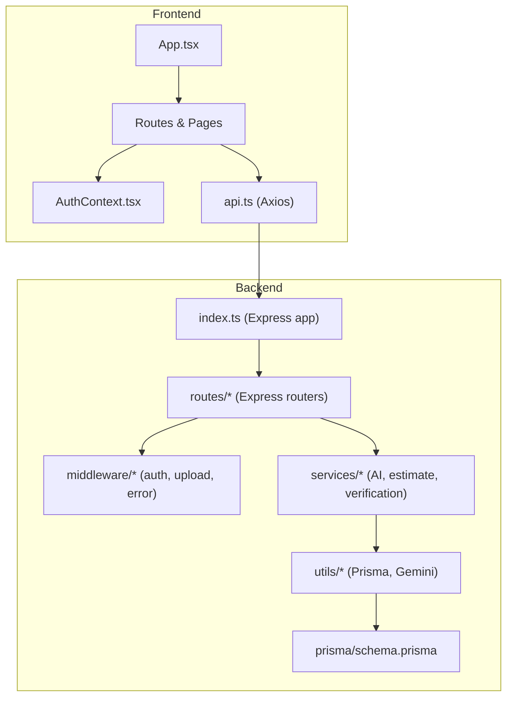
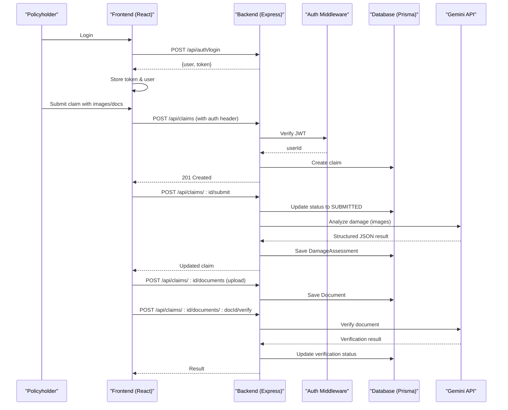
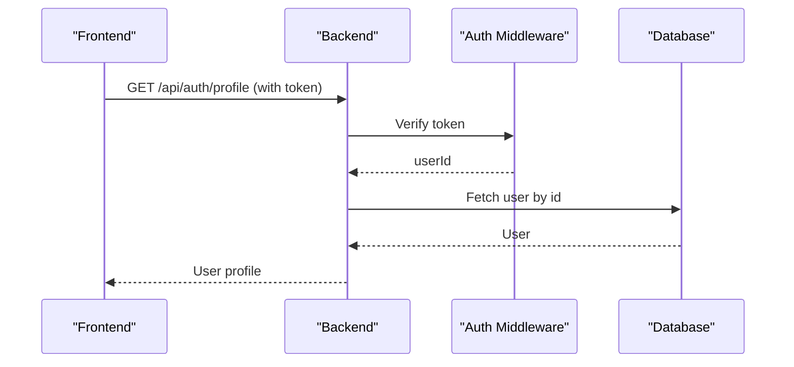
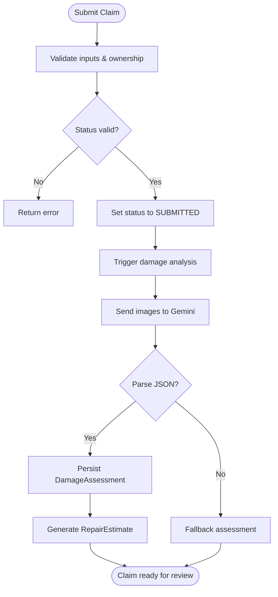
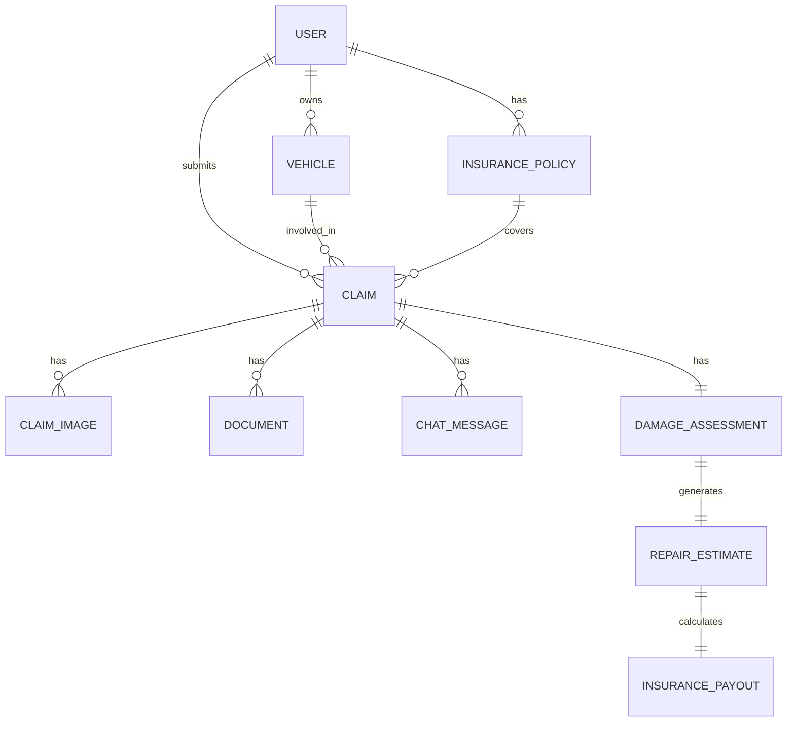
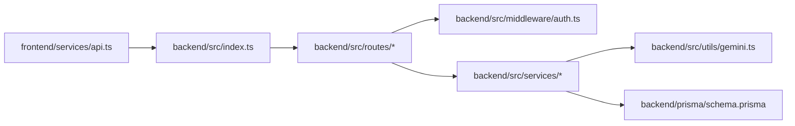

# Project Overview

<cite>
**Referenced Files in This Document**
- [backend/src/index.ts](file://backend/src/index.ts)
- [backend/prisma/schema.prisma](file://backend/prisma/schema.prisma)
- [backend/package.json](file://backend/package.json)
- [frontend/src/App.tsx](file://frontend/src/App.tsx)
- [frontend/package.json](file://frontend/package.json)
- [backend/src/routes/claims.ts](file://backend/src/routes/claims.ts)
- [backend/src/services/damageAnalysisService.ts](file://backend/src/services/damageAnalysisService.ts)
- [backend/src/services/documentVerificationService.ts](file://backend/src/services/documentVerificationService.ts)
- [backend/src/utils/gemini.ts](file://backend/src/utils/gemini.ts)
- [backend/src/middleware/auth.ts](file://backend/src/middleware/auth.ts)
- [frontend/src/context/AuthContext.tsx](file://frontend/src/context/AuthContext.tsx)
- [frontend/src/services/api.ts](file://frontend/src/services/api.ts)
- [backend/src/types/index.ts](file://backend/src/types/index.ts)
- [frontend/index.html](file://frontend/index.html)
- [backend/src/services/claimAssistantService.ts](file://backend/src/services/claimAssistantService.ts)
- [frontend/src/components/Layout.tsx](file://frontend/src/components/Layout.tsx)
- [frontend/src/components/AdminLayout.tsx](file://frontend/src/components/AdminLayout.tsx)
- [frontend/src/pages/LoginPage.tsx](file://frontend/src/pages/LoginPage.tsx)
- [frontend/src/pages/RegisterPage.tsx](file://frontend/src/pages/RegisterPage.tsx)
- [frontend/src/pages/admin/AdminLoginPage.tsx](file://frontend/src/pages/admin/AdminLoginPage.tsx)
</cite>

## Update Summary
**Changes Made**
- Updated all references from 'AutoShield AI' to 'Flash Claim' throughout the documentation
- Updated package names and descriptions to reflect the rebranding
- Updated UI elements and branding references in frontend components
- Updated backend service responses and system prompts to use 'Flash Claim' branding
- Maintained all technical architecture and functionality descriptions while updating brand terminology

## Table of Contents
1. Introduction
2. Project Structure
3. Core Components
4. Architecture Overview
5. Detailed Component Analysis
6. Dependency Analysis
7. Performance Considerations
8. Troubleshooting Guide
9. Conclusion

## Introduction
Flash Claim is an AI-powered platform that streamlines vehicle insurance claims from submission to resolution. It combines a modern React frontend with an Express.js backend, leveraging Google Gemini for automated damage assessment and document verification, Prisma ORM for data modeling, and JWT-based authentication for secure access. The system supports two primary user roles:
- Policyholders: submit claims, upload images and documents, chat with an AI assistant, and track claim progress.
- Administrators: review claims, verify documents, manage users, and oversee the end-to-end workflow.

The platform automates key steps such as analyzing vehicle damage from photos, generating repair estimates, verifying uploaded documents, and providing intelligent guidance through a built-in chat assistant.

## Project Structure
The project follows a clear separation between frontend and backend:
- Backend (Express + TypeScript): API endpoints, middleware, services, Prisma schema, and utilities for AI integration.
- Frontend (React + TypeScript): User interfaces for policyholders and administrators, routing, authentication context, and API client configuration.

**Diagram sources**
- [frontend/src/App.tsx:23-50](file://frontend/src/App.tsx#L23-L50)
- [frontend/src/context/AuthContext.tsx:17-82](file://frontend/src/context/AuthContext.tsx#L17-L82)
- [frontend/src/services/api.ts:1-36](file://frontend/src/services/api.ts#L1-L36)
- [backend/src/index.ts:14-45](file://backend/src/index.ts#L14-L45)
- [backend/src/routes/claims.ts:13-15](file://backend/src/routes/claims.ts#L13-L15)
- [backend/src/services/damageAnalysisService.ts:50-153](file://backend/src/services/damageAnalysisService.ts#L50-L153)
- [backend/src/services/documentVerificationService.ts:41-106](file://backend/src/services/documentVerificationService.ts#L41-L106)
- [backend/src/utils/gemini.ts:6-11](file://backend/src/utils/gemini.ts#L6-L11)
- [backend/prisma/schema.prisma:10-202](file://backend/prisma/schema.prisma#L10-L202)

**Section sources**
- [backend/src/index.ts:14-45](file://backend/src/index.ts#L14-L45)
- [frontend/src/App.tsx:23-50](file://frontend/src/App.tsx#L23-L50)

## Core Components
- Authentication and Authorization
  - JWT-based authentication middleware validates tokens and attaches user identity to requests.
  - Frontend stores token and user state, automatically attaching Authorization headers to API calls and handling 401 redirects.
- Claims Management
  - Create, update, list, and submit claims; attach images and documents; trigger AI analysis and estimates; chat with assistant.
- AI Services
  - Damage analysis reads claim images, sends them to Google Gemini, parses structured JSON results, persists assessments, and auto-generates repair estimates.
  - Document verification analyzes uploaded documents via Gemini, extracts key information, flags issues, and updates verification status.
  - Flash Claim Assistant provides conversational support for policyholders with claim-related questions and guidance.
- Data Layer
  - Prisma models define Users, Vehicles, Policies, Claims, Images, Assessments, Estimates, Payouts, Documents, and Chat Messages with relationships and enums.
- API Endpoints
  - Centralized Express router mounts routes under /api/auth, /api/vehicles, /api/policies, /api/claims, /api/admin.

Key technology stack highlights:
- Backend: Express, TypeScript, Prisma ORM, JWT, Multer, Zod, Google Generative AI SDK.
- Frontend: React, TypeScript, Vite, Axios, React Router, Tailwind CSS.

**Updated** All branding references have been updated from 'AutoShield AI' to 'Flash Claim' across all components including package names, UI elements, and service prompts.

**Section sources**
- [backend/src/middleware/auth.ts:5-22](file://backend/src/middleware/auth.ts#L5-L22)
- [frontend/src/context/AuthContext.tsx:17-82](file://frontend/src/context/AuthContext.tsx#L17-L82)
- [frontend/src/services/api.ts:1-36](file://frontend/src/services/api.ts#L1-L36)
- [backend/src/routes/claims.ts:20-449](file://backend/src/routes/claims.ts#L20-L449)
- [backend/src/services/damageAnalysisService.ts:50-153](file://backend/src/services/damageAnalysisService.ts#L50-L153)
- [backend/src/services/documentVerificationService.ts:41-106](file://backend/src/services/documentVerificationService.ts#L41-L106)
- [backend/src/services/claimAssistantService.ts:4-17](file://backend/src/services/claimAssistantService.ts#L4-L17)
- [backend/prisma/schema.prisma:10-202](file://backend/prisma/schema.prisma#L10-L202)
- [backend/package.json:18-29](file://backend/package.json#L18-L29)
- [frontend/package.json:12-28](file://frontend/package.json#L12-L28)

## Architecture Overview
High-level flow:
- Policyholder logs in via frontend; token stored locally and attached to subsequent requests.
- Claims are created and submitted with images/documents; backend validates ownership and status transitions.
- On submission or explicit trigger, AI services analyze images and documents using Google Gemini, parse responses, persist results, and optionally generate repair estimates.
- Administrators review claims, verify documents, and manage workflows via admin routes.

**Diagram sources**
- [frontend/src/context/AuthContext.tsx:38-54](file://frontend/src/context/AuthContext.tsx#L38-L54)
- [frontend/src/services/api.ts:7-19](file://frontend/src/services/api.ts#L7-L19)
- [backend/src/routes/claims.ts:20-57](file://backend/src/routes/claims.ts#L20-L57)
- [backend/src/routes/claims.ts:152-193](file://backend/src/routes/claims.ts#L152-L193)
- [backend/src/routes/claims.ts:316-397](file://backend/src/routes/claims.ts#L316-L397)
- [backend/src/services/damageAnalysisService.ts:50-153](file://backend/src/services/damageAnalysisService.ts#L50-L153)
- [backend/src/services/documentVerificationService.ts:41-106](file://backend/src/services/documentVerificationService.ts#L41-L106)
- [backend/src/utils/gemini.ts:6-11](file://backend/src/utils/gemini.ts#L6-L11)
- [backend/prisma/schema.prisma:71-202](file://backend/prisma/schema.prisma#L71-L202)

## Detailed Component Analysis

### Authentication Flow
- Backend middleware verifies Bearer tokens, decodes JWT, and attaches userId to request objects.
- Frontend context manages login/register/logout, persists token/user, and injects Authorization headers into all API calls.

**Diagram sources**
- [backend/src/middleware/auth.ts:5-22](file://backend/src/middleware/auth.ts#L5-L22)
- [frontend/src/context/AuthContext.tsx:22-36](file://frontend/src/context/AuthContext.tsx#L22-L36)
- [frontend/src/services/api.ts:7-19](file://frontend/src/services/api.ts#L7-L19)

**Section sources**
- [backend/src/middleware/auth.ts:5-22](file://backend/src/middleware/auth.ts#L5-L22)
- [frontend/src/context/AuthContext.tsx:17-82](file://frontend/src/context/AuthContext.tsx#L17-L82)
- [frontend/src/services/api.ts:1-36](file://frontend/src/services/api.ts#L1-L36)

### Claims Lifecycle and AI Integration
- Creation and submission enforce ownership checks and status transitions; submission triggers background AI damage analysis.
- Damage analysis reads images, sends to Gemini, parses JSON, persists assessment, and auto-generates repair estimates.
- Document upload and verification integrate Gemini to validate authenticity and completeness.
- Flash Claim Assistant provides conversational support integrated with claim data and history.

**Diagram sources**
- [backend/src/routes/claims.ts:152-193](file://backend/src/routes/claims.ts#L152-L193)
- [backend/src/services/damageAnalysisService.ts:50-153](file://backend/src/services/damageAnalysisService.ts#L50-L153)

**Section sources**
- [backend/src/routes/claims.ts:20-449](file://backend/src/routes/claims.ts#L20-L449)
- [backend/src/services/damageAnalysisService.ts:50-153](file://backend/src/services/damageAnalysisService.ts#L50-L153)
- [backend/src/services/documentVerificationService.ts:41-106](file://backend/src/services/documentVerificationService.ts#L41-L106)
- [backend/src/services/claimAssistantService.ts:19-129](file://backend/src/services/claimAssistantService.ts#L19-L129)

### Data Model Overview
Core entities and relationships:
- User owns Vehicles, Policies, and Claims.
- Claim links to Vehicle and optional Policy; includes Images, Documents, DamageAssessment, RepairEstimate, InsurancePayout, and ChatMessages.
- Enums standardize statuses and types across the system.

**Diagram sources**
- [backend/prisma/schema.prisma:10-202](file://backend/prisma/schema.prisma#L10-L202)

**Section sources**
- [backend/prisma/schema.prisma:10-202](file://backend/prisma/schema.prisma#L10-L202)

### Technology Stack Summary
- Backend dependencies include Express, TypeScript, Prisma, JWT, Multer, Zod, and Google Generative AI SDK.
- Frontend uses React, TypeScript, Vite, Axios, React Router, and Tailwind CSS.

**Updated** Package names and descriptions now reflect the 'Flash Claim' branding throughout the project structure.

**Section sources**
- [backend/package.json:18-29](file://backend/package.json#L18-L29)
- [frontend/package.json:12-28](file://frontend/package.json#L12-L28)

## Dependency Analysis
- Frontend depends on backend APIs for authentication, claims, vehicles, policies, and admin operations.
- Backend routes depend on middleware for auth and uploads, services for AI logic, and Prisma for persistence.
- AI services depend on Google Gemini model configured via environment variables.

**Diagram sources**
- [frontend/src/services/api.ts:1-36](file://frontend/src/services/api.ts#L1-L36)
- [backend/src/index.ts:14-45](file://backend/src/index.ts#L14-L45)
- [backend/src/routes/claims.ts:13-15](file://backend/src/routes/claims.ts#L13-L15)
- [backend/src/services/damageAnalysisService.ts:50-153](file://backend/src/services/damageAnalysisService.ts#L50-L153)
- [backend/src/services/documentVerificationService.ts:41-106](file://backend/src/services/documentVerificationService.ts#L41-L106)
- [backend/src/utils/gemini.ts:6-11](file://backend/src/utils/gemini.ts#L6-L11)
- [backend/prisma/schema.prisma:10-202](file://backend/prisma/schema.prisma#L10-L202)

**Section sources**
- [backend/src/index.ts:14-45](file://backend/src/index.ts#L14-L45)
- [backend/src/routes/claims.ts:13-15](file://backend/src/routes/claims.ts#L13-L15)
- [backend/src/services/damageAnalysisService.ts:50-153](file://backend/src/services/damageAnalysisService.ts#L50-L153)
- [backend/src/services/documentVerificationService.ts:41-106](file://backend/src/services/documentVerificationService.ts#L41-L106)
- [backend/src/utils/gemini.ts:6-11](file://backend/src/utils/gemini.ts#L6-L11)
- [backend/prisma/schema.prisma:10-202](file://backend/prisma/schema.prisma#L10-L202)

## Performance Considerations
- Image processing and AI calls can be slow; consider queuing background jobs for damage analysis and document verification to avoid blocking requests.
- Use pagination and selective field queries when listing claims to reduce payload size.
- Cache frequent read operations (e.g., vehicle details) if appropriate.
- Optimize file uploads with size limits and compression where possible.
- Monitor Gemini API rate limits and implement retries/backoff for robustness.

[No sources needed since this section provides general guidance]

## Troubleshooting Guide
Common issues and resolutions:
- Authentication failures: Ensure JWT_SECRET is set and tokens are valid; check Authorization header format.
- Missing files: Upload directories must exist and be accessible; verify paths used by services.
- AI parsing errors: If Gemini returns unexpected formats, fallback logic handles it but may require manual review.
- Database connectivity: Confirm DATABASE_URL and run Prisma migrations or push commands.
- CORS issues: Configure CORS_ORIGIN to allow frontend origin.

Operational tips:
- Health endpoint at /api/health indicates service status with Flash Claim API branding.
- Use Prisma Studio for data inspection during development.

**Updated** Health check responses now display 'Flash Claim API' instead of the previous branding.

**Section sources**
- [backend/src/middleware/auth.ts:5-22](file://backend/src/middleware/auth.ts#L5-L22)
- [backend/src/index.ts:36-45](file://backend/src/index.ts#L36-L45)
- [backend/src/services/damageAnalysisService.ts:85-103](file://backend/src/services/damageAnalysisService.ts#L85-L103)
- [backend/src/services/documentVerificationService.ts:78-94](file://backend/src/services/documentVerificationService.ts#L78-L94)

## Conclusion
Flash Claim delivers an end-to-end, AI-enhanced claims experience. Its modular architecture separates concerns across frontend UI, backend APIs, AI services, and data layer. Automated damage assessment, document verification, and intelligent assistance streamline workflows for both policyholders and administrators while maintaining security and scalability.

**Updated** The platform has been successfully rebranded from 'AutoShield AI' to 'Flash Claim' across all application components, maintaining full functionality while establishing a new brand identity.

[No sources needed since this section summarizes without analyzing specific files]