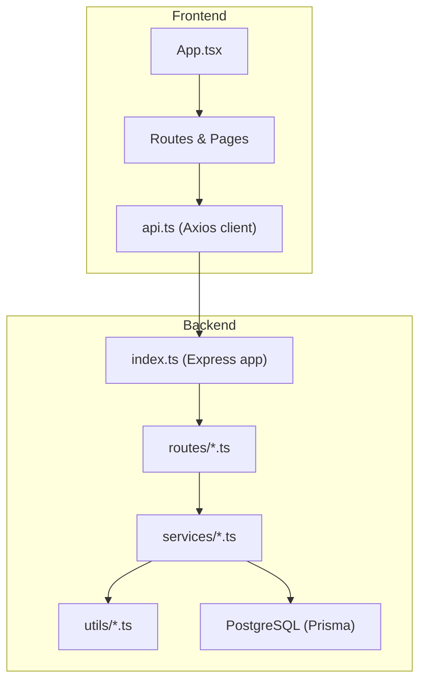
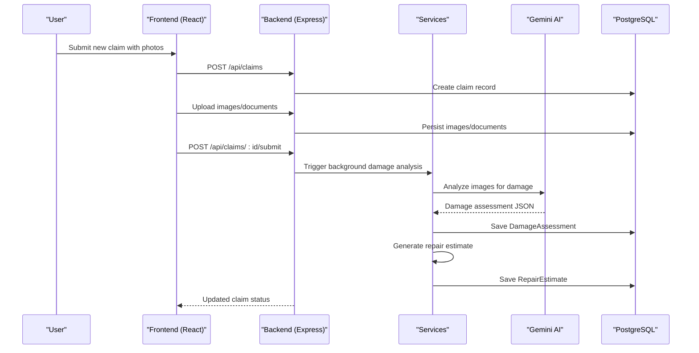
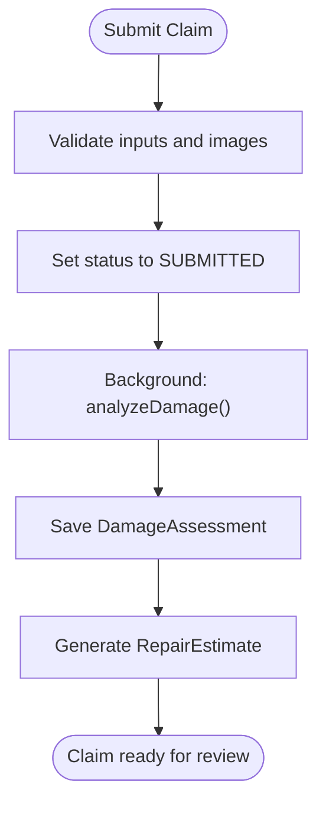
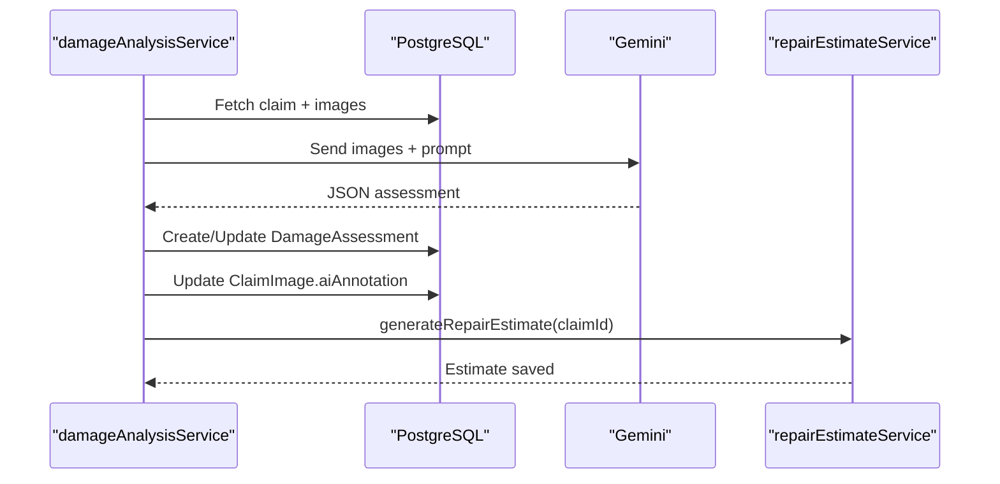
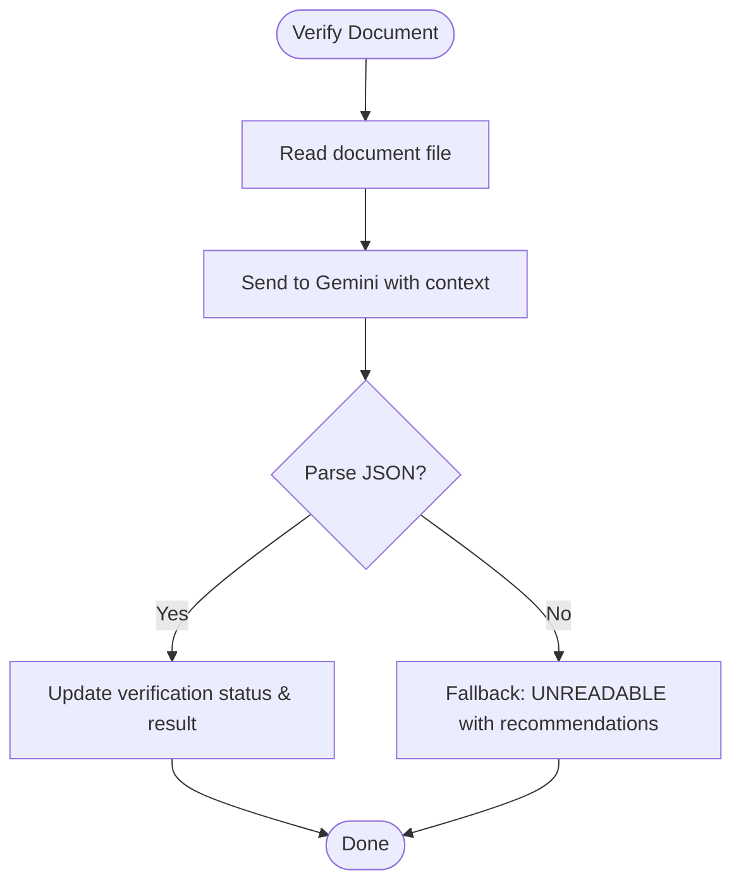
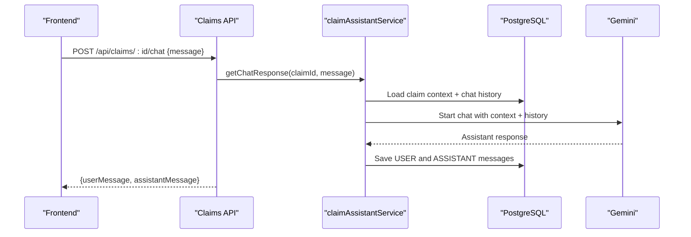
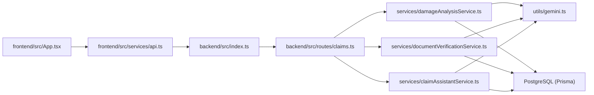

# Project Overview

<cite>
**Referenced Files in This Document**
- [backend/src/index.ts](file://backend/src/index.ts)
- [backend/package.json](file://backend/package.json)
- [frontend/src/App.tsx](file://frontend/src/App.tsx)
- [frontend/package.json](file://frontend/package.json)
- [backend/prisma/schema.prisma](file://backend/prisma/schema.prisma)
- [backend/src/routes/claims.ts](file://backend/src/routes/claims.ts)
- [backend/src/services/damageAnalysisService.ts](file://backend/src/services/damageAnalysisService.ts)
- [backend/src/services/documentVerificationService.ts](file://backend/src/services/documentVerificationService.ts)
- [backend/src/services/claimAssistantService.ts](file://backend/src/services/claimAssistantService.ts)
- [backend/src/utils/gemini.ts](file://backend/src/utils/gemini.ts)
- [backend/src/types/index.ts](file://backend/src/types/index.ts)
- [frontend/src/pages/NewClaimPage.tsx](file://frontend/src/pages/NewClaimPage.tsx)
- [frontend/src/services/api.ts](file://frontend/src/services/api.ts)
</cite>

## Table of Contents
1. Introduction
2. Project Structure
3. Core Components
4. Architecture Overview
5. Detailed Component Analysis
6. Dependency Analysis
7. Performance Considerations
8. Troubleshooting Guide
9. Conclusion

## Introduction
AutoShield AI is an AI-powered vehicle insurance claim management platform that streamlines the end-to-end claims lifecycle. It automates traditional processes such as damage assessment, document verification, and intelligent claim processing to reduce manual effort, improve accuracy, and accelerate payouts. The system provides a modern React frontend for policyholders and administrators, a Node.js backend with Express, a PostgreSQL database via Prisma, and Google Gemini AI integration for vision-based analysis and conversational assistance.

Key features:
- Automated damage assessment using image analysis
- Intelligent document verification (license, registration, accident reports, repair estimates)
- End-to-end claim processing workflow from submission to payout estimation
- Conversational AutoShield AI assistant to guide users through their claim
- Secure authentication and role-aware access control

Conceptual overview for beginners:
- A user uploads photos and details about an incident.
- The system analyzes images to identify damages and severity.
- Documents are verified automatically for completeness and readability.
- Repair cost estimates and potential payouts are generated.
- Users can chat with the AutoShield AI assistant for guidance at any step.

Technical overview for developers:
- Frontend built with React + Vite; routes protected by auth context.
- Backend uses Express with modular routes, services, middleware, and Prisma ORM.
- AI capabilities powered by Google Gemini for multimodal tasks.
- Data modeled with Prisma schema including claims, vehicles, policies, documents, assessments, estimates, payouts, and chat history.

**Section sources**
- [backend/src/index.ts:1-47](file://backend/src/index.ts#L1-L47)
- [backend/package.json:1-43](file://backend/package.json#L1-L43)
- [frontend/src/App.tsx:1-39](file://frontend/src/App.tsx#L1-L39)
- [frontend/package.json:1-32](file://frontend/package.json#L1-L32)
- [backend/prisma/schema.prisma:1-201](file://backend/prisma/schema.prisma#L1-L201)

## Project Structure
The project follows a clear separation between frontend and backend:
- Frontend (React + Vite): User interface for creating claims, managing vehicles and policies, viewing claim details, and chatting with the assistant.
- Backend (Node.js + Express): REST API for authentication, vehicles, policies, and claims; integrates with Prisma and Google Gemini.
- Database (PostgreSQL): Schema defines entities like User, Vehicle, InsurancePolicy, Claim, DamageAssessment, RepairEstimate, InsurancePayout, Document, ChatMessage, and related enums.

**Diagram sources**
- [frontend/src/App.tsx:1-39](file://frontend/src/App.tsx#L1-L39)
- [frontend/src/services/api.ts:1-33](file://frontend/src/services/api.ts#L1-L33)
- [backend/src/index.ts:1-47](file://backend/src/index.ts#L1-L47)
- [backend/src/routes/claims.ts:1-450](file://backend/src/routes/claims.ts#L1-L450)
- [backend/prisma/schema.prisma:1-201](file://backend/prisma/schema.prisma#L1-L201)

**Section sources**
- [frontend/src/App.tsx:1-39](file://frontend/src/App.tsx#L1-L39)
- [backend/src/index.ts:1-47](file://backend/src/index.ts#L1-L47)
- [backend/prisma/schema.prisma:1-201](file://backend/prisma/schema.prisma#L1-L201)

## Core Components
- Claims API: Create, update, list, submit, analyze, estimate, upload images/documents, verify documents, and chat endpoints.
- Damage Assessment Service: Analyzes uploaded images with Gemini to detect damages, assess severity, and determine drivability.
- Document Verification Service: Verifies uploaded documents for readability, completeness, and authenticity using Gemini.
- Claim Assistant Service: Provides contextual, conversational support based on claim data and chat history.
- Gemini Integration: Centralized configuration and model instantiation for Google Generative AI.
- Data Models: Prisma schema defines all entities and relationships for claims, vehicles, policies, assessments, estimates, payouts, documents, and chat messages.

**Section sources**
- [backend/src/routes/claims.ts:1-450](file://backend/src/routes/claims.ts#L1-L450)
- [backend/src/services/damageAnalysisService.ts:1-154](file://backend/src/services/damageAnalysisService.ts#L1-L154)
- [backend/src/services/documentVerificationService.ts:1-107](file://backend/src/services/documentVerificationService.ts#L1-L107)
- [backend/src/services/claimAssistantService.ts:1-130](file://backend/src/services/claimAssistantService.ts#L1-L130)
- [backend/src/utils/gemini.ts:1-13](file://backend/src/utils/gemini.ts#L1-L13)
- [backend/prisma/schema.prisma:1-201](file://backend/prisma/schema.prisma#L1-L201)

## Architecture Overview
AutoShield AI separates concerns across layers:
- Frontend: React application with protected routes and stateful pages for claim creation and management.
- Backend: Express server exposing REST APIs, orchestrating business logic in services, and persisting data via Prisma.
- AI Layer: Google Gemini models perform image analysis and document verification, and power the conversational assistant.

**Diagram sources**
- [frontend/src/pages/NewClaimPage.tsx:1-252](file://frontend/src/pages/NewClaimPage.tsx#L1-L252)
- [backend/src/routes/claims.ts:152-193](file://backend/src/routes/claims.ts#L152-L193)
- [backend/src/services/damageAnalysisService.ts:50-154](file://backend/src/services/damageAnalysisService.ts#L50-L154)
- [backend/src/utils/gemini.ts:1-13](file://backend/src/utils/gemini.ts#L1-L13)
- [backend/prisma/schema.prisma:70-159](file://backend/prisma/schema.prisma#L70-L159)

## Detailed Component Analysis

### Claims Workflow and API
The claims route implements the full lifecycle:
- Create claim with required fields and optional policy linkage.
- Upload multiple images and categorize them as full vehicle or damage close-up.
- Submit claim triggers status change and initiates background AI analysis.
- Optional manual re-analysis endpoint for on-demand processing.
- Repair estimate generation depends on completed damage assessment.
- Document upload and verification endpoints integrate with Gemini.
- Chat endpoints persist conversation history and provide AI responses.

**Diagram sources**
- [backend/src/routes/claims.ts:152-193](file://backend/src/routes/claims.ts#L152-L193)
- [backend/src/services/damageAnalysisService.ts:105-154](file://backend/src/services/damageAnalysisService.ts#L105-L154)

**Section sources**
- [backend/src/routes/claims.ts:20-193](file://backend/src/routes/claims.ts#L20-L193)
- [backend/src/routes/claims.ts:270-314](file://backend/src/routes/claims.ts#L270-L314)
- [backend/src/routes/claims.ts:316-397](file://backend/src/routes/claims.ts#L316-L397)
- [backend/src/routes/claims.ts:399-447](file://backend/src/routes/claims.ts#L399-L447)

### Damage Assessment Service
Automated damage assessment leverages Gemini to inspect images and return structured results:
- Reads stored images and converts to base64 for multimodal input.
- Sends a detailed prompt specifying damage types, severity levels, and location descriptions.
- Parses JSON response with fallback handling for malformed outputs.
- Persists assessment and updates per-image annotations.
- Automatically triggers repair estimate generation after successful analysis.

**Diagram sources**
- [backend/src/services/damageAnalysisService.ts:50-154](file://backend/src/services/damageAnalysisService.ts#L50-L154)
- [backend/src/utils/gemini.ts:1-13](file://backend/src/utils/gemini.ts#L1-L13)

**Section sources**
- [backend/src/services/damageAnalysisService.ts:1-154](file://backend/src/services/damageAnalysisService.ts#L1-L154)

### Document Verification Service
Document verification ensures uploaded files are readable and complete:
- Reads document file and sends it to Gemini with a strict JSON output contract.
- Extracts key information and identifies issues (expired, missing info, tampering).
- Updates verification status and stores results for downstream workflows.

**Diagram sources**
- [backend/src/services/documentVerificationService.ts:41-107](file://backend/src/services/documentVerificationService.ts#L41-L107)

**Section sources**
- [backend/src/services/documentVerificationService.ts:1-107](file://backend/src/services/documentVerificationService.ts#L1-L107)

### Claim Assistant Service
The AutoShield AI assistant provides contextual help:
- Builds rich context from claim data, vehicle, policy, assessment, estimate, payout, and document statuses.
- Maintains conversation history per claim and persists user and assistant messages.
- Uses Gemini chat to respond to user queries with plain-language explanations and guidance.

**Diagram sources**
- [backend/src/routes/claims.ts:423-447](file://backend/src/routes/claims.ts#L423-L447)
- [backend/src/services/claimAssistantService.ts:19-130](file://backend/src/services/claimAssistantService.ts#L19-L130)

**Section sources**
- [backend/src/services/claimAssistantService.ts:1-130](file://backend/src/services/claimAssistantService.ts#L1-L130)

### Technology Stack
- Frontend: React, Vite, TypeScript, Tailwind CSS, Axios, React Router, React Dropzone.
- Backend: Node.js, Express, TypeScript, Prisma ORM, Multer for uploads, JWT for auth, Zod for validation, bcryptjs for password hashing.
- Database: PostgreSQL configured via Prisma datasource.
- AI: Google Generative AI (Gemini) for image analysis, document verification, and conversational assistance.

**Section sources**
- [frontend/package.json:1-32](file://frontend/package.json#L1-L32)
- [backend/package.json:1-43](file://backend/package.json#L1-L43)
- [backend/prisma/schema.prisma:1-201](file://backend/prisma/schema.prisma#L1-L201)
- [backend/src/utils/gemini.ts:1-13](file://backend/src/utils/gemini.ts#L1-L13)

## Dependency Analysis
High-level dependencies and interactions:
- Frontend App orchestrates routing and protected views; communicates with backend via Axios client.
- Backend index registers routes and middleware; exposes health check and static uploads.
- Routes depend on services for business logic; services depend on Prisma and Gemini utilities.
- Types define shared interfaces for requests/responses and AI outputs.

**Diagram sources**
- [frontend/src/App.tsx:1-39](file://frontend/src/App.tsx#L1-L39)
- [frontend/src/services/api.ts:1-33](file://frontend/src/services/api.ts#L1-L33)
- [backend/src/index.ts:1-47](file://backend/src/index.ts#L1-L47)
- [backend/src/routes/claims.ts:1-450](file://backend/src/routes/claims.ts#L1-L450)
- [backend/src/services/damageAnalysisService.ts:1-154](file://backend/src/services/damageAnalysisService.ts#L1-L154)
- [backend/src/services/documentVerificationService.ts:1-107](file://backend/src/services/documentVerificationService.ts#L1-L107)
- [backend/src/services/claimAssistantService.ts:1-130](file://backend/src/services/claimAssistantService.ts#L1-L130)
- [backend/src/utils/gemini.ts:1-13](file://backend/src/utils/gemini.ts#L1-L13)

**Section sources**
- [backend/src/index.ts:1-47](file://backend/src/index.ts#L1-L47)
- [backend/src/routes/claims.ts:1-450](file://backend/src/routes/claims.ts#L1-L450)
- [backend/src/types/index.ts:1-51](file://backend/src/types/index.ts#L1-L51)

## Performance Considerations
- Image handling: Large uploads are supported via multipart/form-data; ensure appropriate limits and storage strategy for production.
- AI latency: Gemini calls can be slow; background processing for damage analysis avoids blocking user flows.
- Caching: Consider caching frequent reads (e.g., vehicles, policies) if traffic increases.
- Database queries: Use selective includes to minimize payload size when listing claims.
- Concurrency: Ensure robust error handling and retries for AI service calls to avoid partial failures.

[No sources needed since this section provides general guidance]

## Troubleshooting Guide
Common issues and resolutions:
- Missing images before submission: The submit endpoint requires at least one image; ensure frontend validates and prompts users to upload.
- AI parsing failures: If Gemini returns unexpected formats, the services include fallbacks to maintain system stability and mark items for manual review.
- File not found errors: Verify upload directories and paths; ensure environment variables for upload directories are set correctly.
- Authentication errors: Frontend clears token and redirects on 401; ensure tokens are persisted and refreshed appropriately.

Operational tips:
- Monitor logs for background job failures (e.g., damage analysis, estimate generation).
- Validate environment variables (database URL, Gemini API key, CORS origin, upload directory).
- Use health check endpoint to confirm backend availability.

**Section sources**
- [backend/src/routes/claims.ts:152-193](file://backend/src/routes/claims.ts#L152-L193)
- [backend/src/services/damageAnalysisService.ts:85-103](file://backend/src/services/damageAnalysisService.ts#L85-L103)
- [backend/src/services/documentVerificationService.ts:78-94](file://backend/src/services/documentVerificationService.ts#L78-L94)
- [frontend/src/services/api.ts:19-30](file://frontend/src/services/api.ts#L19-L30)
- [backend/src/index.ts:34-40](file://backend/src/index.ts#L34-L40)

## Conclusion
AutoShield AI delivers a comprehensive, automated approach to vehicle insurance claims. By integrating AI-driven damage assessment, document verification, and a conversational assistant, it reduces manual workloads and accelerates resolution. The architecture cleanly separates frontend, backend, and AI components while leveraging a robust data model and secure APIs. For developers building similar systems, the modular services, typed contracts, and clear workflows provide a solid foundation for extension and scaling.

[No sources needed since this section summarizes without analyzing specific files]