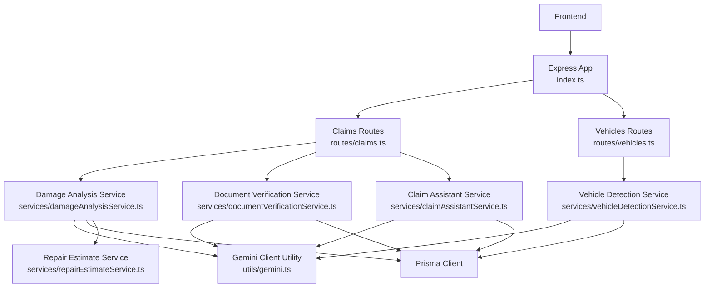
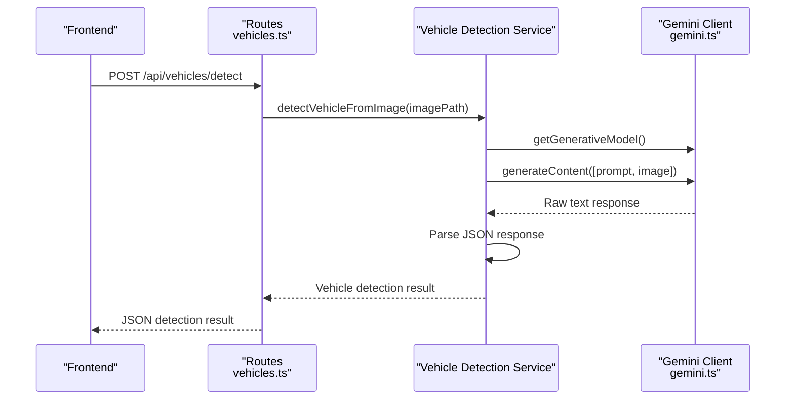
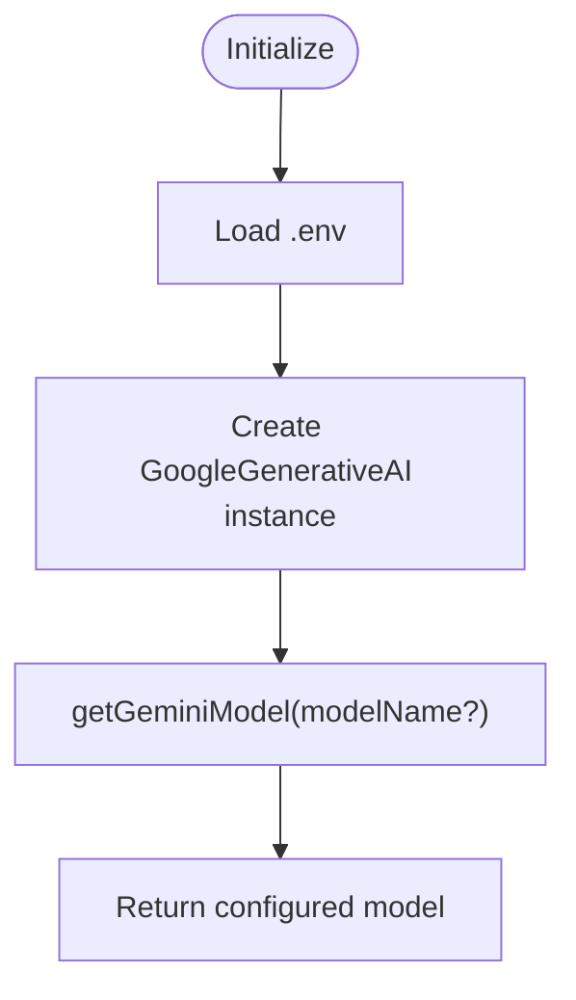
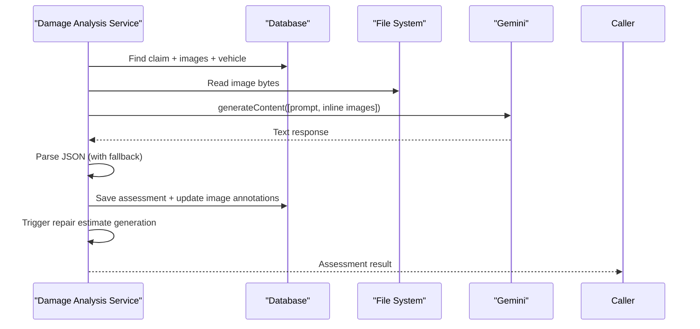
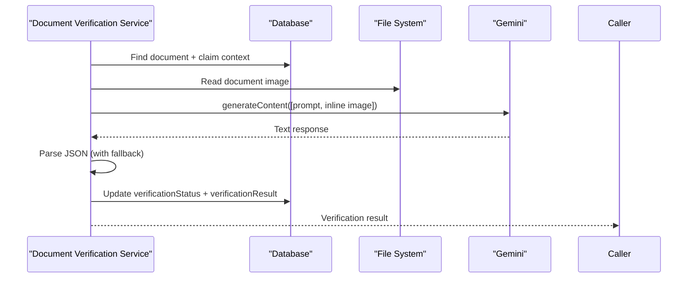
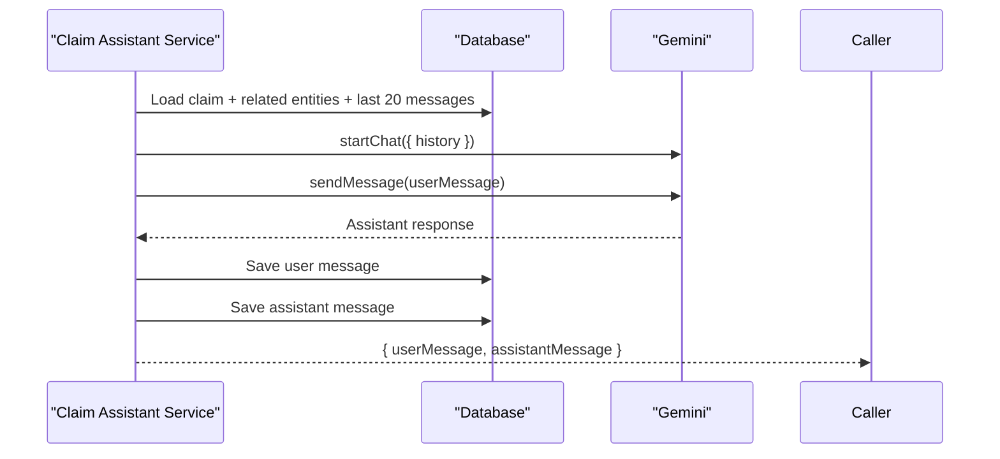
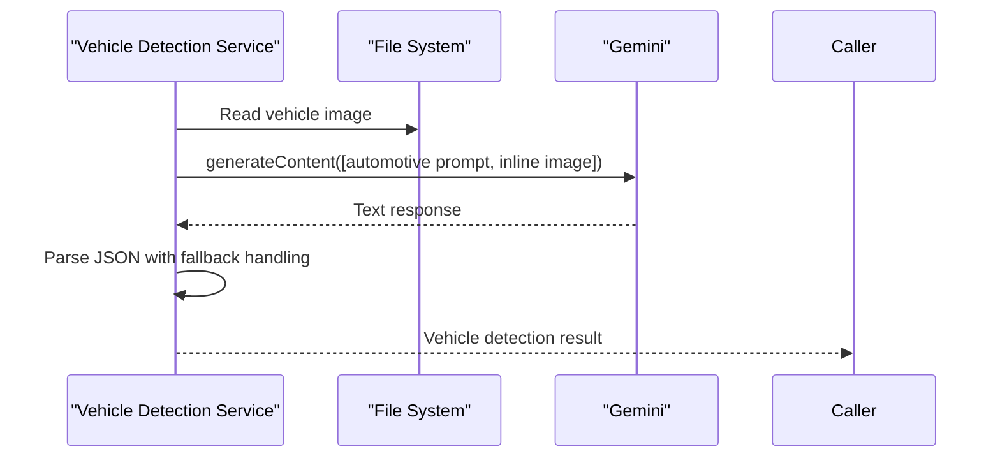
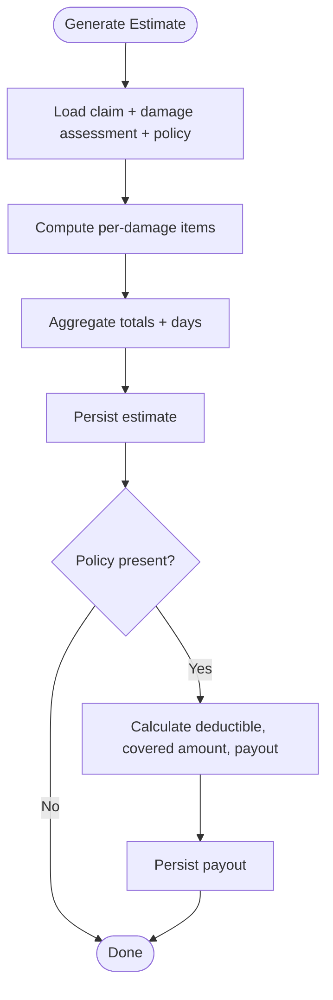
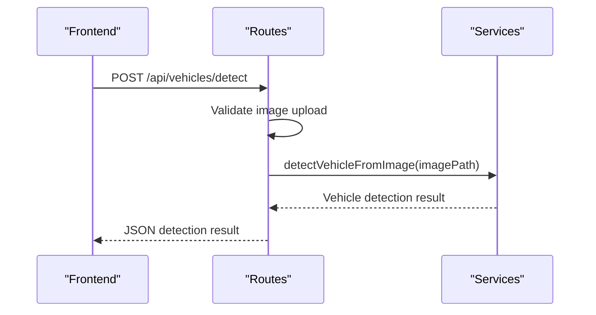
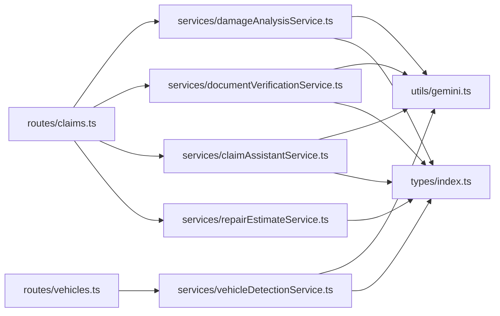

# AI Integration Patterns

<cite>
**Referenced Files in This Document**
- [gemini.ts](file://backend/src/utils/gemini.ts)
- [damageAnalysisService.ts](file://backend/src/services/damageAnalysisService.ts)
- [documentVerificationService.ts](file://backend/src/services/documentVerificationService.ts)
- [claimAssistantService.ts](file://backend/src/services/claimAssistantService.ts)
- [repairEstimateService.ts](file://backend/src/services/repairEstimateService.ts)
- [vehicleDetectionService.ts](file://backend/src/services/vehicleDetectionService.ts)
- [claims.ts](file://backend/src/routes/claims.ts)
- [vehicles.ts](file://backend/src/routes/vehicles.ts)
- [index.ts](file://backend/src/index.ts)
- [errorHandler.ts](file://backend/src/middleware/errorHandler.ts)
- [types/index.ts](file://backend/src/types/index.ts)
- [package.json](file://backend/package.json)
</cite>

## Update Summary
**Changes Made**
- Added new Vehicle Detection Service section documenting AI-powered vehicle identification
- Updated Core Components section to include vehicle detection functionality
- Enhanced Architecture Overview with vehicle detection workflow
- Added new API endpoint documentation for vehicle detection
- Updated dependency analysis to include vehicle detection service
- Enhanced prompt engineering patterns section with vehicle detection examples

## Table of Contents
1. Introduction
2. Project Structure
3. Core Components
4. Architecture Overview
5. Detailed Component Analysis
6. Dependency Analysis
7. Performance Considerations
8. Troubleshooting Guide
9. Conclusion
10. Appendices

## Introduction
This document explains the AI service integration patterns used to integrate Google Gemini into the vehicle insurance claim system. It covers API client configuration, request formatting, response processing, service layer abstractions for damage analysis, document verification, chat assistance, and **newly added vehicle detection capabilities**, asynchronous processing patterns, error handling strategies, prompt engineering practices, caching considerations, retry and fallback mechanisms, rate limiting and quota management, security considerations for API keys and sensitive data, testing approaches for AI-dependent functionality, and scalability considerations for concurrent requests and load balancing.

## Project Structure
The backend exposes REST endpoints under /api/claims and /api/vehicles that orchestrate AI-powered features through dedicated services. The Gemini client is centralized in a utility module, while business logic lives in service modules. Routes invoke services, which interact with Prisma (database), file storage, and the Gemini API.

**Diagram sources**
- [index.ts:1-47](file://backend/src/index.ts#L1-L47)
- [claims.ts:1-450](file://backend/src/routes/claims.ts#L1-L450)
- [vehicles.ts:1-169](file://backend/src/routes/vehicles.ts#L1-L169)
- [damageAnalysisService.ts:1-154](file://backend/src/services/damageAnalysisService.ts#L1-L154)
- [documentVerificationService.ts:1-107](file://backend/src/services/documentVerificationService.ts#L1-L107)
- [claimAssistantService.ts:1-130](file://backend/src/services/claimAssistantService.ts#L1-L130)
- [vehicleDetectionService.ts:1-96](file://backend/src/services/vehicleDetectionService.ts#L1-L96)
- [repairEstimateService.ts:1-199](file://backend/src/services/repairEstimateService.ts#L1-L199)
- [gemini.ts:1-13](file://backend/src/utils/gemini.ts#L1-L13)

**Section sources**
- [index.ts:1-47](file://backend/src/index.ts#L1-L47)
- [claims.ts:1-450](file://backend/src/routes/claims.ts#L1-L450)
- [vehicles.ts:1-169](file://backend/src/routes/vehicles.ts#L1-L169)

## Core Components
- Gemini client utility: Initializes the GoogleGenerativeAI SDK using an environment variable and provides a model getter.
- Damage analysis service: Reads claim images, builds a structured multimodal prompt, calls Gemini, parses JSON responses, persists results, and triggers repair estimate generation.
- Document verification service: Reads a document image, constructs a verification prompt with context, calls Gemini, parses JSON, and updates verification status.
- Claim assistant service: Builds rich contextual prompts from claim data and recent chat history, uses Gemini chat to respond, and persists conversation messages.
- **Vehicle detection service**: Analyzes vehicle images to identify make, model, year, color, license plate, and confidence level using specialized automotive identification prompts.
- Repair estimate service: Computes itemized estimates based on damage assessment and policy details; does not call external AI.
- Routes: Expose endpoints for claim submission, image upload, document upload, AI analysis, estimate generation, document verification, chat interactions, and **vehicle detection**.
- Error handling: Centralized Express error handler with typed application errors.

**Section sources**
- [gemini.ts:1-13](file://backend/src/utils/gemini.ts#L1-L13)
- [damageAnalysisService.ts:1-154](file://backend/src/services/damageAnalysisService.ts#L1-L154)
- [documentVerificationService.ts:1-107](file://backend/src/services/documentVerificationService.ts#L1-L107)
- [claimAssistantService.ts:1-130](file://backend/src/services/claimAssistantService.ts#L1-L130)
- [vehicleDetectionService.ts:1-96](file://backend/src/services/vehicleDetectionService.ts#L1-L96)
- [repairEstimateService.ts:1-199](file://backend/src/services/repairEstimateService.ts#L1-L199)
- [claims.ts:1-450](file://backend/src/routes/claims.ts#L1-L450)
- [vehicles.ts:1-169](file://backend/src/routes/vehicles.ts#L1-L169)
- [errorHandler.ts:1-28](file://backend/src/middleware/errorHandler.ts#L1-L28)

## Architecture Overview
The architecture follows a layered pattern:
- Presentation layer: Express routes handle HTTP requests and validation.
- Service layer: Encapsulates AI workflows and business logic, isolating external dependencies.
- Data access layer: Prisma interacts with the database.
- External integrations: Google Gemini via the official SDK.

**Diagram sources**
- [vehicles.ts:16-32](file://backend/src/routes/vehicles.ts#L16-L32)
- [vehicleDetectionService.ts:46-95](file://backend/src/services/vehicleDetectionService.ts#L46-L95)
- [gemini.ts:6-10](file://backend/src/utils/gemini.ts#L6-L10)

## Detailed Component Analysis

### Gemini Client Configuration
- Loads environment variables and initializes the GoogleGenerativeAI instance.
- Provides a function to retrieve a configured generative model instance.
- Uses a default model name when none is specified.

**Diagram sources**
- [gemini.ts:1-13](file://backend/src/utils/gemini.ts#L1-L13)

**Section sources**
- [gemini.ts:1-13](file://backend/src/utils/gemini.ts#L1-L13)

### Damage Analysis Service
- Retrieves claim metadata and associated images.
- Reads image files from disk and encodes them as base64 inline data with correct MIME types.
- Constructs a strict JSON schema prompt and appends vehicle context.
- Calls Gemini to generate content and parses the response, extracting JSON even if wrapped in markdown code blocks.
- Persists the assessment and annotates images by type (full vs closeup).
- Triggers repair estimate generation asynchronously after successful analysis.

**Diagram sources**
- [damageAnalysisService.ts:50-153](file://backend/src/services/damageAnalysisService.ts#L50-L153)

**Section sources**
- [damageAnalysisService.ts:1-154](file://backend/src/services/damageAnalysisService.ts#L1-L154)

### Document Verification Service
- Loads the document record and its path, validates existence on disk.
- Reads the image and sends it with a structured prompt to verify authenticity and completeness.
- Parses JSON output and updates the document's verification status and result.

**Diagram sources**
- [documentVerificationService.ts:41-106](file://backend/src/services/documentVerificationService.ts#L41-L106)

**Section sources**
- [documentVerificationService.ts:1-107](file://backend/src/services/documentVerificationService.ts#L1-L107)

### Claim Assistant Service
- Loads full claim context including vehicle, policy, damage assessment, repair estimate, payout, documents, and recent chat messages.
- Builds a system prompt and contextual message payload.
- Starts a chat session with Gemini, sending user messages and persisting both sides of the conversation.

**Diagram sources**
- [claimAssistantService.ts:19-129](file://backend/src/services/claimAssistantService.ts#L19-L129)

**Section sources**
- [claimAssistantService.ts:1-130](file://backend/src/services/claimAssistantService.ts#L1-L130)

### Vehicle Detection Service
- **New Feature**: Specialized service for AI-powered vehicle identification from images.
- Accepts image paths and reads files from disk with proper MIME type detection.
- Uses a sophisticated automotive identification prompt that analyzes vehicle styling, badges, lights, wheels, and other identifying features.
- Returns structured JSON with make, model, year, color, license plate, confidence level, and additional observations.
- Implements robust error handling with fallback responses when parsing fails or images are unclear.

**Diagram sources**
- [vehicleDetectionService.ts:46-95](file://backend/src/services/vehicleDetectionService.ts#L46-L95)

**Section sources**
- [vehicleDetectionService.ts:1-96](file://backend/src/services/vehicleDetectionService.ts#L1-L96)

### Repair Estimate Service
- Computes itemized costs based on damage types, severity, parts ranges, labor hours, and paint materials.
- Aggregates totals and estimated repair days.
- Persists or updates repair estimate and calculates insurance payout when a policy exists.

**Diagram sources**
- [repairEstimateService.ts:104-199](file://backend/src/services/repairEstimateService.ts#L104-L199)

**Section sources**
- [repairEstimateService.ts:1-199](file://backend/src/services/repairEstimateService.ts#L1-L199)

### Routes and Orchestration
- Submitting a claim triggers background damage analysis to avoid blocking the response.
- Dedicated endpoints exist for manual re-analysis, estimate generation, document verification, chat interactions, and **vehicle detection**.
- All routes enforce authentication middleware and return standardized error responses.

**Diagram sources**
- [vehicles.ts:16-32](file://backend/src/routes/vehicles.ts#L16-L32)
- [claims.ts:152-193](file://backend/src/routes/claims.ts#L152-L193)
- [claims.ts:270-288](file://backend/src/routes/claims.ts#L270-L288)

**Section sources**
- [claims.ts:1-450](file://backend/src/routes/claims.ts#L1-L450)
- [vehicles.ts:1-169](file://backend/src/routes/vehicles.ts#L1-L169)

## Dependency Analysis
- Services depend on:
  - Gemini client utility for model instantiation and API calls.
  - Prisma client for persistence.
  - File system for reading uploaded images/documents.
- Routes depend on services and middleware for auth and uploads.
- Types define shared interfaces for AI outputs and claims-related structures.

**Diagram sources**
- [claims.ts:1-450](file://backend/src/routes/claims.ts#L1-L450)
- [vehicles.ts:1-169](file://backend/src/routes/vehicles.ts#L1-L169)
- [damageAnalysisService.ts:1-154](file://backend/src/services/damageAnalysisService.ts#L1-L154)
- [documentVerificationService.ts:1-107](file://backend/src/services/documentVerificationService.ts#L1-L107)
- [claimAssistantService.ts:1-130](file://backend/src/services/claimAssistantService.ts#L1-L130)
- [vehicleDetectionService.ts:1-96](file://backend/src/services/vehicleDetectionService.ts#L1-L96)
- [repairEstimateService.ts:1-199](file://backend/src/services/repairEstimateService.ts#L1-L199)
- [gemini.ts:1-13](file://backend/src/utils/gemini.ts#L1-L13)
- [types/index.ts:1-51](file://backend/src/types/index.ts#L1-L51)

**Section sources**
- [types/index.ts:1-51](file://backend/src/types/index.ts#L1-L51)

## Performance Considerations
- Image I/O: Reading images from disk and encoding to base64 can be costly; consider streaming or cloud storage references where feasible.
- Prompt size: Context assembly for chat includes recent messages and claim details; keep history bounded to control token usage and latency.
- Concurrency: Background processing for damage analysis reduces request latency; ensure adequate worker capacity and memory.
- Caching opportunities:
  - Cache Gemini model instances at process level (already done via module-level initialization).
  - Cache frequent read-only claim contexts or document OCR results if repeated queries occur.
  - Implement response caching for identical prompts/images to reduce API calls.
  - **Cache vehicle detection results** for similar images to reduce redundant AI calls.
- Database batching: Use Prisma transactions for multi-step writes (assessment + annotations) to improve consistency and performance.

## Troubleshooting Guide
- Common failures:
  - Missing claim or document records: Routes and services validate existence and throw errors.
  - File not found on disk: Document verification checks file existence before calling AI.
  - JSON parse errors: Both damage analysis and document verification include fallbacks when parsing fails.
  - **Vehicle detection failures**: Vehicle detection service handles unclear images and parsing errors gracefully.
- Error handling:
  - Centralized error handler returns consistent JSON errors and logs details.
  - Application-specific errors extend a custom AppError class with status codes.
- Observability:
  - Log errors at each step (parsing, file reads, AI calls) to aid debugging.
  - Persist raw AI responses alongside structured results for audit and reprocessing.

**Section sources**
- [errorHandler.ts:1-28](file://backend/src/middleware/errorHandler.ts#L1-L28)
- [damageAnalysisService.ts:85-103](file://backend/src/services/damageAnalysisService.ts#L85-L103)
- [documentVerificationService.ts:78-94](file://backend/src/services/documentVerificationService.ts#L78-L94)
- [vehicleDetectionService.ts:81-92](file://backend/src/services/vehicleDetectionService.ts#L81-L92)

## Conclusion
The system integrates Google Gemini through a clean service-layer abstraction that encapsulates prompt construction, multimodal input handling, and robust response parsing. Asynchronous processing improves responsiveness for long-running operations like damage analysis. **The newly added vehicle detection service provides specialized automotive identification capabilities with sophisticated prompt engineering for accurate vehicle recognition.** While basic resilience patterns are present (fallbacks and error handling), additional enhancements such as retries, rate limiting, and caching can further improve reliability and performance. Security measures should focus on protecting API keys and minimizing sensitive data exposure in prompts.

## Appendices

### API Client Configuration and Request Formatting
- Initialization: The Gemini client is created once using an environment variable for the API key and exposes a model getter.
- Multimodal requests: Images are read from disk, encoded to base64, and attached as inline data with appropriate MIME types.
- Structured prompts: Strict JSON schemas guide the model to return predictable outputs, enabling reliable parsing.

**Section sources**
- [gemini.ts:1-13](file://backend/src/utils/gemini.ts#L1-L13)
- [damageAnalysisService.ts:64-83](file://backend/src/services/damageAnalysisService.ts#L64-L83)
- [documentVerificationService.ts:57-74](file://backend/src/services/documentVerificationService.ts#L57-L74)
- [vehicleDetectionService.ts:61-69](file://backend/src/services/vehicleDetectionService.ts#L61-L69)

### Response Processing and Fallbacks
- Parsing strategy: Extract JSON from potential markdown-wrapped responses; fall back to safe defaults when parsing fails.
- Persistence: Store both structured results and raw responses for traceability.
- Post-processing: Automatically trigger downstream steps (e.g., repair estimate generation) upon success.

**Section sources**
- [damageAnalysisService.ts:85-153](file://backend/src/services/damageAnalysisService.ts#L85-L153)
- [documentVerificationService.ts:78-106](file://backend/src/services/documentVerificationService.ts#L78-L106)
- [vehicleDetectionService.ts:73-92](file://backend/src/services/vehicleDetectionService.ts#L73-L92)

### Asynchronous Processing Patterns
- Fire-and-forget: Submitting a claim triggers background damage analysis to avoid blocking the HTTP response.
- Implications: Errors in background tasks must be logged and monitored; consider adding job queues for better observability and retry semantics.

**Section sources**
- [claims.ts:177-186](file://backend/src/routes/claims.ts#L177-L186)

### Retry Mechanisms and Fallback Strategies
- Current state: No explicit retry logic around Gemini calls; parsing failures use fallback responses.
- Recommendations:
  - Add exponential backoff retries for transient network errors.
  - Implement circuit breaker behavior to short-circuit during outages.
  - Provide graceful degradation (e.g., manual review flags) when AI is unavailable.

### Rate Limiting and Quota Management
- Current state: No built-in rate limiter or quota tracking around Gemini calls.
- Recommendations:
  - Integrate a rate limiter (e.g., per-user or global) to respect API quotas and prevent throttling.
  - Track usage metrics (tokens, requests) and alert on quota thresholds.
  - Consider queuing or throttling high-volume operations like batch image analysis.

### Security Considerations
- API key management: Store the Gemini API key in environment variables only; never hardcode or log secrets.
- Sensitive data in prompts: Avoid including personally identifiable information (PII) or confidential data in prompts; sanitize inputs and minimize context scope.
- Transport security: Ensure HTTPS for all API communications and restrict CORS origins.
- Access control: Enforce authentication and authorization on all endpoints that expose AI features.

**Section sources**
- [gemini.ts:1-13](file://backend/src/utils/gemini.ts#L1-L13)
- [index.ts:16-22](file://backend/src/index.ts#L16-L22)

### Testing Approaches for AI-Dependent Functionality
- Mocking Gemini: Replace the Gemini client with a mock that returns deterministic JSON responses for unit tests.
- Test data management: Use fixtures for claims, images, and documents; isolate test databases or use in-memory stores.
- Contract testing: Validate that parsed outputs conform to expected types and schemas.
- Integration tests: Simulate end-to-end flows with mocked external dependencies to verify routing, persistence, and error handling.

### Scalability and Load Balancing
- Horizontal scaling: Deploy multiple backend instances behind a load balancer; ensure stateless design and shared storage for uploads.
- Concurrency: Use background workers or queues for heavy AI tasks; scale workers independently.
- Resource limits: Configure request body size limits and timeouts to protect against abuse.
- Monitoring: Instrument latency, error rates, and quota usage to inform autoscaling decisions.

### Prompt Engineering Patterns
- **Automotive Identification**: The vehicle detection service uses specialized prompts that instruct the AI to analyze specific vehicle characteristics including exterior styling, badges, lighting, wheels, and paint color.
- **Confidence Scoring**: Prompts include guidelines for confidence levels (HIGH/MEDIUM/LOW) based on image clarity and identifiability.
- **Structured Output**: All AI services enforce strict JSON schemas to ensure consistent, parseable responses.
- **Fallback Handling**: When AI cannot provide accurate results, services return safe default values with explanatory notes.

**Section sources**
- [vehicleDetectionService.ts:15-44](file://backend/src/services/vehicleDetectionService.ts#L15-L44)
- [damageAnalysisService.ts:64-83](file://backend/src/services/damageAnalysisService.ts#L64-L83)
- [documentVerificationService.ts:57-74](file://backend/src/services/documentVerificationService.ts#L57-L74)

### Vehicle Detection API Documentation
- **Endpoint**: `POST /api/vehicles/detect`
- **Authentication**: Required (via authMiddleware)
- **Request**: Multipart form with single image file
- **Response**: JSON object containing vehicle identification details including make, model, year, color, license plate, confidence level, and additional observations
- **Error Handling**: Returns appropriate error messages for missing images, file processing issues, or AI service failures

**Section sources**
- [vehicles.ts:16-32](file://backend/src/routes/vehicles.ts#L16-L32)
- [vehicleDetectionService.ts:46-95](file://backend/src/services/vehicleDetectionService.ts#L46-L95)