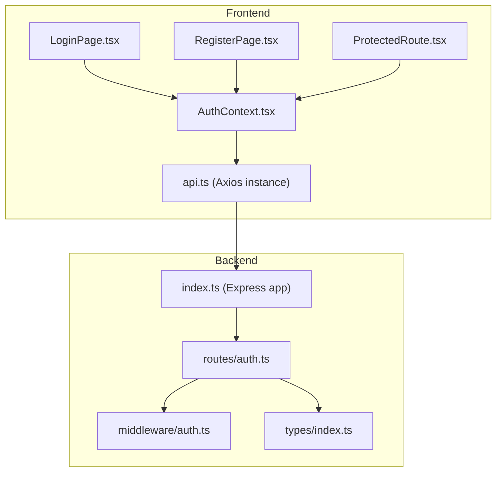
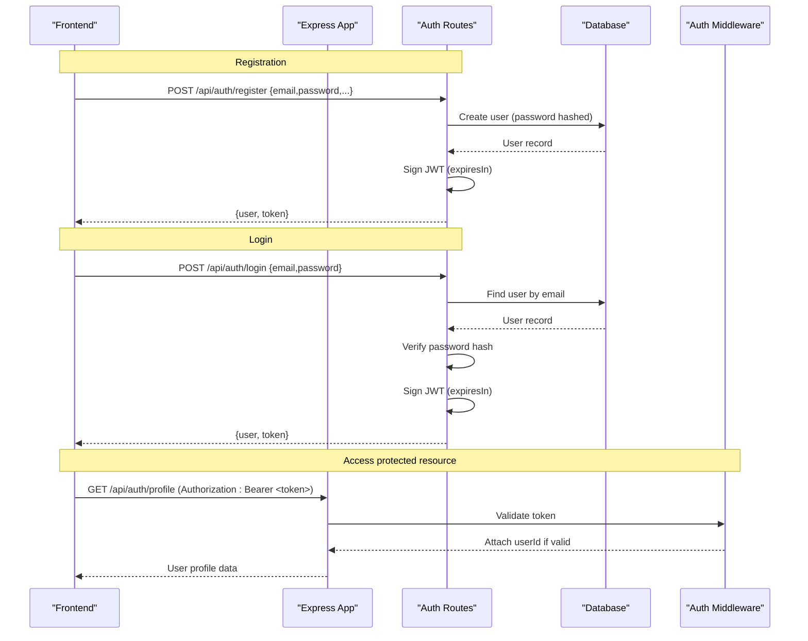
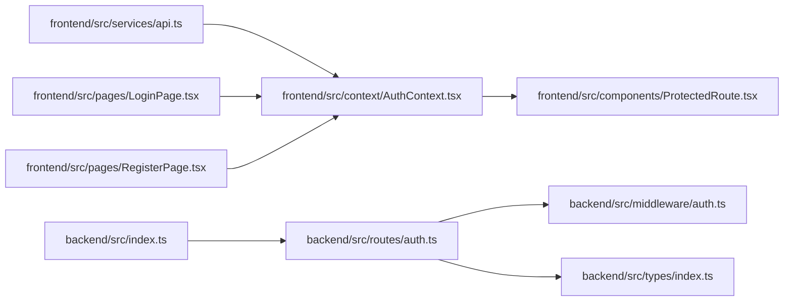

# Authentication & Security

<cite>
**Referenced Files in This Document**
- [backend/src/index.ts](file://backend/src/index.ts)
- [backend/src/middleware/auth.ts](file://backend/src/middleware/auth.ts)
- [backend/src/routes/auth.ts](file://backend/src/routes/auth.ts)
- [backend/src/types/index.ts](file://backend/src/types/index.ts)
- [frontend/src/context/AuthContext.tsx](file://frontend/src/context/AuthContext.tsx)
- [frontend/src/components/ProtectedRoute.tsx](file://frontend/src/components/ProtectedRoute.tsx)
- [frontend/src/services/api.ts](file://frontend/src/services/api.ts)
- [frontend/src/pages/LoginPage.tsx](file://frontend/src/pages/LoginPage.tsx)
- [frontend/src/pages/RegisterPage.tsx](file://frontend/src/pages/RegisterPage.tsx)
</cite>

## Table of Contents
1. Introduction
2. Project Structure
3. Core Components
4. Architecture Overview
5. Detailed Component Analysis
6. Dependency Analysis
7. Performance Considerations
8. Troubleshooting Guide
9. Conclusion
10. Appendices

## Introduction
This document describes the end-to-end authentication and security architecture for the Smart Vehicle Insurance Claim System. It covers JWT-based registration, login, token generation and validation, protected routes, frontend state management, CORS configuration, input validation strategies, logout and cleanup, and production security considerations such as HTTPS and security headers.

## Project Structure
The system is split into a backend (Express + TypeScript) and a frontend (React + TypeScript). Authentication flows span both layers:
- Backend exposes REST endpoints under /api/auth and protects other routes via middleware.
- Frontend manages user session state, stores tokens, and guards routes.

**Diagram sources**
- [backend/src/index.ts:1-47](file://backend/src/index.ts#L1-L47)
- [backend/src/routes/auth.ts:1-166](file://backend/src/routes/auth.ts#L1-L166)
- [backend/src/middleware/auth.ts:1-23](file://backend/src/middleware/auth.ts#L1-L23)
- [backend/src/types/index.ts:1-51](file://backend/src/types/index.ts#L1-L51)
- [frontend/src/context/AuthContext.tsx:1-82](file://frontend/src/context/AuthContext.tsx#L1-L82)
- [frontend/src/components/ProtectedRoute.tsx:1-21](file://frontend/src/components/ProtectedRoute.tsx#L1-L21)
- [frontend/src/services/api.ts:1-33](file://frontend/src/services/api.ts#L1-L33)
- [frontend/src/pages/LoginPage.tsx:1-95](file://frontend/src/pages/LoginPage.tsx#L1-L95)
- [frontend/src/pages/RegisterPage.tsx:1-102](file://frontend/src/pages/RegisterPage.tsx#L1-L102)

**Section sources**
- [backend/src/index.ts:1-47](file://backend/src/index.ts#L1-L47)
- [frontend/src/context/AuthContext.tsx:1-82](file://frontend/src/context/AuthContext.tsx#L1-L82)

## Core Components
- Backend auth routes: Registration, login, profile retrieval/update with password hashing and JWT issuance.
- Backend auth middleware: Validates Authorization header, verifies JWT, attaches userId to request.
- Frontend AuthContext: Manages user state, token persistence, login/register/logout flows, and profile updates.
- ProtectedRoute: Guards routes based on authenticated user state.
- Axios API client: Intercepts requests to attach tokens and handles 401 by clearing local state and redirecting to login.

Key responsibilities:
- Passwords are hashed server-side before storage.
- Tokens are signed with an environment secret and set to expire after a fixed duration.
- Protected endpoints require a valid Bearer token.
- Frontend persists tokens and validates sessions on app start.

**Section sources**
- [backend/src/routes/auth.ts:10-104](file://backend/src/routes/auth.ts#L10-L104)
- [backend/src/middleware/auth.ts:5-22](file://backend/src/middleware/auth.ts#L5-L22)
- [frontend/src/context/AuthContext.tsx:17-66](file://frontend/src/context/AuthContext.tsx#L17-L66)
- [frontend/src/components/ProtectedRoute.tsx:4-20](file://frontend/src/components/ProtectedRoute.tsx#L4-L20)
- [frontend/src/services/api.ts:10-30](file://frontend/src/services/api.ts#L10-L30)

## Architecture Overview
The authentication flow uses stateless JWTs. The frontend stores tokens and includes them in subsequent requests. The backend validates tokens via middleware and authorizes access to protected resources.

**Diagram sources**
- [backend/src/routes/auth.ts:10-104](file://backend/src/routes/auth.ts#L10-L104)
- [backend/src/middleware/auth.ts:5-22](file://backend/src/middleware/auth.ts#L5-L22)
- [frontend/src/context/AuthContext.tsx:22-66](file://frontend/src/context/AuthContext.tsx#L22-L66)
- [frontend/src/services/api.ts:10-30](file://frontend/src/services/api.ts#L10-L30)

## Detailed Component Analysis

### Backend: Registration and Login
- Registration:
  - Validates required fields.
  - Checks for existing email.
  - Hashes password before storing.
  - Creates user and returns minimal user info plus a JWT with a defined expiration.
- Login:
  - Validates required fields.
  - Retrieves user by email.
  - Compares provided password against stored hash.
  - Issues a JWT with a defined expiration upon success.

Security notes:
- Passwords are never stored in plaintext; they are hashed using a secure algorithm with appropriate cost factor.
- JWT payload contains only necessary identifiers (userId, email).
- Token expiration is enforced server-side.

**Section sources**
- [backend/src/routes/auth.ts:10-59](file://backend/src/routes/auth.ts#L10-L59)
- [backend/src/routes/auth.ts:61-104](file://backend/src/routes/auth.ts#L61-L104)

### Backend: Auth Middleware
- Extracts Authorization header and ensures it starts with “Bearer ”.
- Verifies the token using the configured secret.
- On success, attaches userId to the request object for downstream handlers.
- On failure or missing token, returns 401 with a concise error message.

Complexity:
- Token verification is O(1) relative to payload size; overall per-request overhead is constant-time signature verification.

Error handling:
- Missing or malformed tokens result in 401 responses.

**Section sources**
- [backend/src/middleware/auth.ts:5-22](file://backend/src/middleware/auth.ts#L5-L22)
- [backend/src/types/index.ts:3-10](file://backend/src/types/index.ts#L3-L10)

### Frontend: Auth Context
- Initializes from persisted token on mount and validates by fetching profile.
- Provides login/register methods that store token and user data in localStorage.
- Provides logout that clears local state and storage.
- Exposes updateProfile to refresh user data.

Token storage:
- Uses localStorage for token and user object.

Session validation:
- On app start, if a token exists, fetches profile to validate it; invalidation clears local storage.

**Section sources**
- [frontend/src/context/AuthContext.tsx:17-66](file://frontend/src/context/AuthContext.tsx#L17-L66)

### Frontend: Protected Route
- Renders a loading indicator while checking authentication status.
- Redirects unauthenticated users to the login page.
- Renders children when authenticated.

Behavior:
- Relies on AuthContext user state to determine access.

**Section sources**
- [frontend/src/components/ProtectedRoute.tsx:4-20](file://frontend/src/components/ProtectedRoute.tsx#L4-L20)

### Frontend: API Client Interceptors
- Attaches Authorization header with Bearer token to all outgoing requests if present.
- On 401 responses, clears local storage and redirects to login.

Implications:
- Centralized token injection reduces duplication and risk of missed headers.
- Automatic logout on unauthorized responses improves UX and security posture.

**Section sources**
- [frontend/src/services/api.ts:10-30](file://frontend/src/services/api.ts#L10-L30)

### Frontend: Login and Register Pages
- Collect user inputs and call AuthContext methods.
- Navigate to dashboard on success; display errors otherwise.
- Enforces basic HTML5 validations (e.g., required fields, minimum length).

**Section sources**
- [frontend/src/pages/LoginPage.tsx:14-27](file://frontend/src/pages/LoginPage.tsx#L14-L27)
- [frontend/src/pages/RegisterPage.tsx:13-26](file://frontend/src/pages/RegisterPage.tsx#L13-L26)

### CORS Configuration
- Express app enables CORS with credentials support.
- Origin is configurable via environment variable, defaulting to a development URL.

Production guidance:
- Restrict origin to known domains.
- Keep credentials enabled only when necessary and ensure proper cookie policies if cookies are used.

**Section sources**
- [backend/src/index.ts:16-22](file://backend/src/index.ts#L16-L22)

## Dependency Analysis
High-level dependencies among authentication components:

**Diagram sources**
- [frontend/src/services/api.ts:1-33](file://frontend/src/services/api.ts#L1-L33)
- [frontend/src/context/AuthContext.tsx:1-82](file://frontend/src/context/AuthContext.tsx#L1-L82)
- [frontend/src/components/ProtectedRoute.tsx:1-21](file://frontend/src/components/ProtectedRoute.tsx#L1-L21)
- [frontend/src/pages/LoginPage.tsx:1-95](file://frontend/src/pages/LoginPage.tsx#L1-L95)
- [frontend/src/pages/RegisterPage.tsx:1-102](file://frontend/src/pages/RegisterPage.tsx#L1-L102)
- [backend/src/index.ts:1-47](file://backend/src/index.ts#L1-L47)
- [backend/src/routes/auth.ts:1-166](file://backend/src/routes/auth.ts#L1-L166)
- [backend/src/middleware/auth.ts:1-23](file://backend/src/middleware/auth.ts#L1-L23)
- [backend/src/types/index.ts:1-51](file://backend/src/types/index.ts#L1-L51)

**Section sources**
- [backend/src/index.ts:1-47](file://backend/src/index.ts#L1-L47)
- [backend/src/routes/auth.ts:1-166](file://backend/src/routes/auth.ts#L1-L166)
- [backend/src/middleware/auth.ts:1-23](file://backend/src/middleware/auth.ts#L1-L23)
- [frontend/src/context/AuthContext.tsx:1-82](file://frontend/src/context/AuthContext.tsx#L1-L82)
- [frontend/src/services/api.ts:1-33](file://frontend/src/services/api.ts#L1-L33)

## Performance Considerations
- JWT verification is lightweight; avoid unnecessary re-validation on every route beyond middleware.
- Minimize payload size in JWTs to reduce bandwidth and parsing overhead.
- Use efficient password hashing parameters suitable for your deployment environment to balance security and latency.
- Cache frequently accessed user profiles at the application layer if needed, ensuring cache invalidation on profile updates.

[No sources needed since this section provides general guidance]

## Troubleshooting Guide
Common issues and resolutions:
- 401 Unauthorized on protected endpoints:
  - Ensure Authorization header is present and formatted as “Bearer <token>”.
  - Confirm token has not expired; refresh or re-login if necessary.
- Session not persisting across reloads:
  - Verify localStorage contains a valid token and that the app initializes AuthContext correctly.
- CORS errors:
  - Check that the frontend origin matches the allowed CORS origin in backend configuration.
- Profile fetch fails after login:
  - Inspect network logs for 401 responses; clear stale tokens and re-authenticate.

Operational checks:
- Health endpoint confirms service availability.
- Review error handler to ensure consistent error shapes and safe messages.

**Section sources**
- [backend/src/middleware/auth.ts:5-22](file://backend/src/middleware/auth.ts#L5-L22)
- [frontend/src/services/api.ts:10-30](file://frontend/src/services/api.ts#L10-L30)
- [backend/src/index.ts:34-40](file://backend/src/index.ts#L34-L40)
- [backend/src/middleware/errorHandler.ts:13-27](file://backend/src/middleware/errorHandler.ts#L13-L27)

## Conclusion
The system implements a robust, stateless JWT authentication model with clear separation between frontend state management and backend authorization. Passwords are securely hashed, tokens have explicit expiration, and protected routes are enforced both on the client and server. CORS is configurable for cross-origin access, and the API client centralizes token injection and 401 handling. For production, consider adding security headers, enforcing HTTPS, and tightening CORS origins.

[No sources needed since this section summarizes without analyzing specific files]

## Appendices

### Endpoints Summary
- POST /api/auth/register: Create account, return user and JWT.
- POST /api/auth/login: Authenticate user, return user and JWT.
- GET /api/auth/profile: Retrieve current user profile (protected).
- PUT /api/auth/profile: Update current user profile (protected).

**Section sources**
- [backend/src/routes/auth.ts:10-166](file://backend/src/routes/auth.ts#L10-L166)

### Security Best Practices Observed
- Password hashing with a strong cost factor before storage.
- JWT signing with an environment secret and explicit expiration.
- Minimal JWT payload containing only necessary claims.
- Centralized token attachment and 401 handling in the API client.
- Configurable CORS with credentials support.

**Section sources**
- [backend/src/routes/auth.ts:26-52](file://backend/src/routes/auth.ts#L26-L52)
- [backend/src/routes/auth.ts:83-87](file://backend/src/routes/auth.ts#L83-L87)
- [backend/src/middleware/auth.ts:5-22](file://backend/src/middleware/auth.ts#L5-L22)
- [frontend/src/services/api.ts:10-30](file://frontend/src/services/api.ts#L10-L30)
- [backend/src/index.ts:16-22](file://backend/src/index.ts#L16-L22)

### Logout and Token Cleanup
- Frontend logout clears local state and removes token and user data from localStorage.
- Subsequent requests will lack Authorization headers until re-authentication.

**Section sources**
- [frontend/src/context/AuthContext.tsx:56-61](file://frontend/src/context/AuthContext.tsx#L56-L61)

### Input Validation and Sanitization Strategies
Observed practices:
- Server-side presence checks for required fields during registration and login.
- Database uniqueness enforcement for email addresses.
- HTML5 form validations on the frontend (required attributes, min length).

Recommendations for enhanced protection:
- Add structured input validation libraries to enforce types, formats, and constraints consistently.
- Implement sanitization for free-text fields to mitigate XSS risks.
- Apply parameterized queries and ORM usage (already in use via Prisma) to prevent SQL injection.
- Rate-limit sensitive endpoints (login/register) to mitigate brute-force attacks.

**Section sources**
- [backend/src/routes/auth.ts:13-24](file://backend/src/routes/auth.ts#L13-L24)
- [backend/src/routes/auth.ts:64-75](file://backend/src/routes/auth.ts#L64-L75)
- [frontend/src/pages/RegisterPage.tsx:52-85](file://frontend/src/pages/RegisterPage.tsx#L52-L85)

### HTTPS and Security Headers
Current setup:
- CORS configured with credentials support and configurable origin.
- No explicit security headers observed in the application code.

Recommended production hardening:
- Serve the application over HTTPS only.
- Configure security headers such as Strict-Transport-Security, Content-Security-Policy, X-Content-Type-Options, X-Frame-Options, Referrer-Policy, and Permissions-Policy.
- Restrict CORS origins to trusted domains and disable credentials unless strictly required.

[No sources needed since this section provides general guidance]