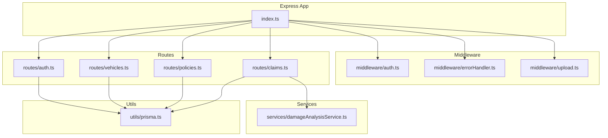
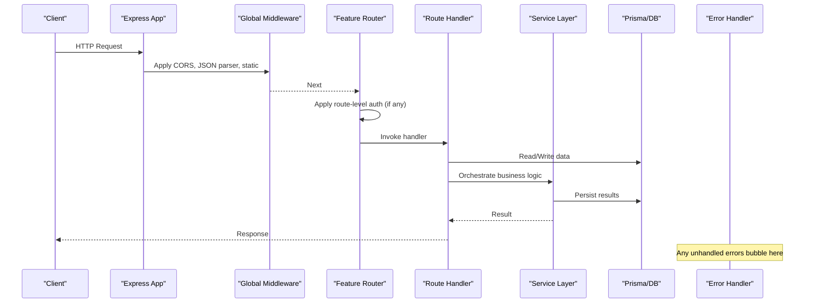
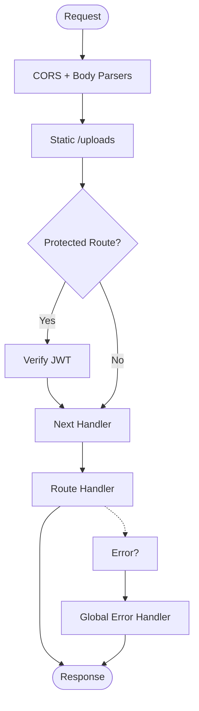
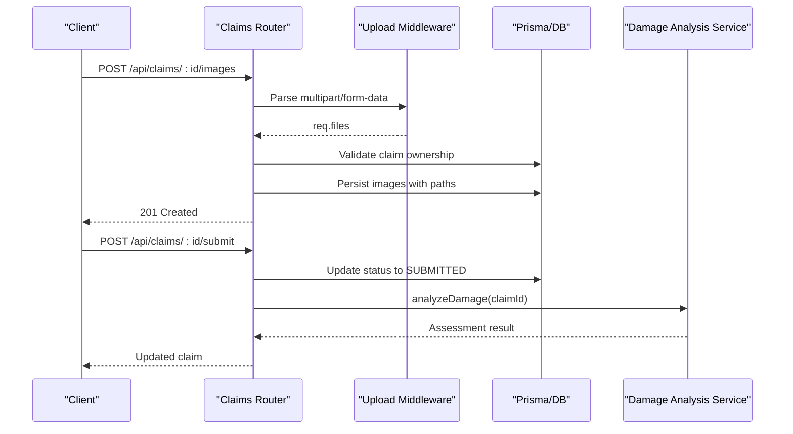
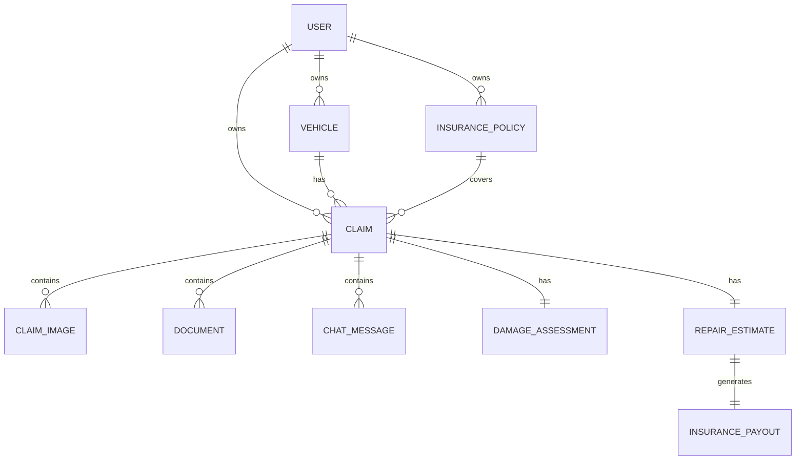
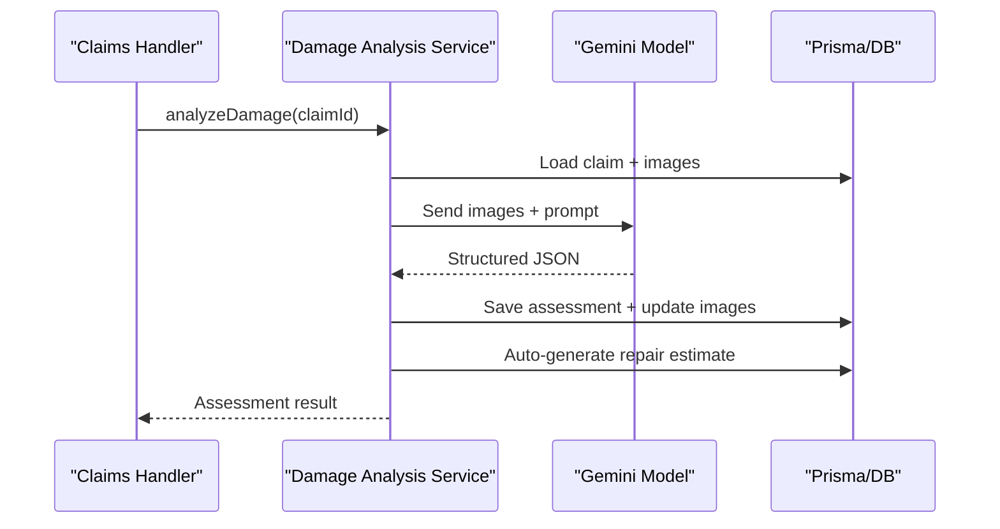
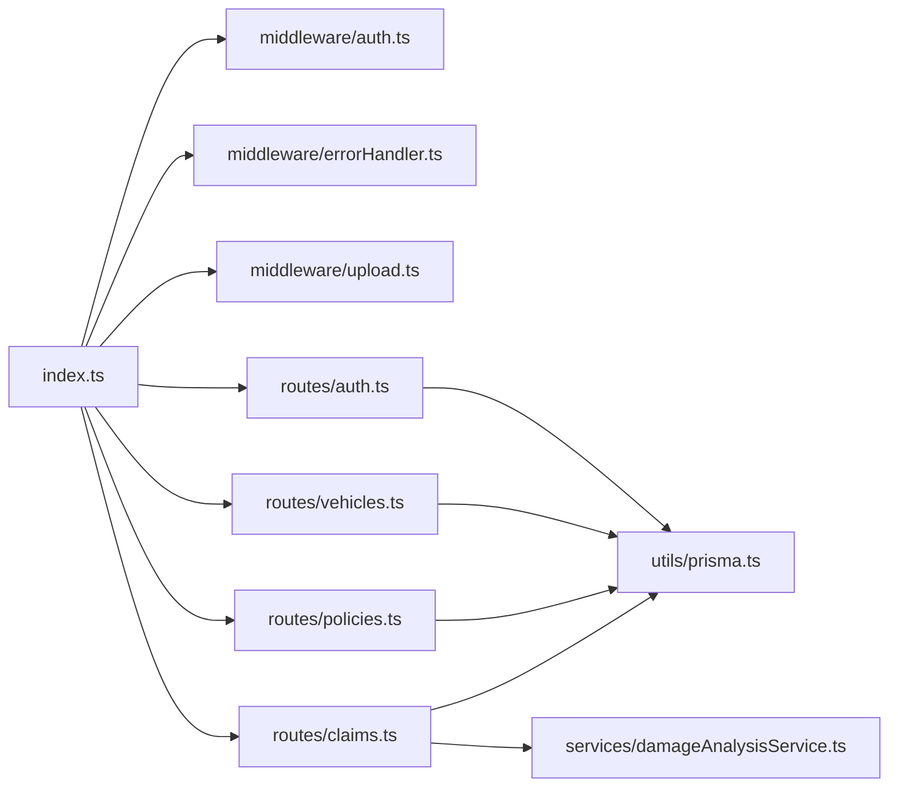

# Backend Architecture

<cite>
**Referenced Files in This Document**
- [index.ts](file://backend/src/index.ts)
- [auth.ts](file://backend/src/middleware/auth.ts)
- [errorHandler.ts](file://backend/src/middleware/errorHandler.ts)
- [upload.ts](file://backend/src/middleware/upload.ts)
- [auth.ts](file://backend/src/routes/auth.ts)
- [vehicles.ts](file://backend/src/routes/vehicles.ts)
- [policies.ts](file://backend/src/routes/policies.ts)
- [claims.ts](file://backend/src/routes/claims.ts)
- [damageAnalysisService.ts](file://backend/src/services/damageAnalysisService.ts)
- [prisma.ts](file://backend/src/utils/prisma.ts)
- [index.ts](file://backend/src/types/index.ts)
- [schema.prisma](file://backend/prisma/schema.prisma)
- [package.json](file://backend/package.json)
</cite>

## Table of Contents
1. [Introduction](#introduction)
2. [Project Structure](#project-structure)
3. [Core Components](#core-components)
4. [Architecture Overview](#architecture-overview)
5. [Detailed Component Analysis](#detailed-component-analysis)
6. [Dependency Analysis](#dependency-analysis)
7. [Performance Considerations](#performance-considerations)
8. [Troubleshooting Guide](#troubleshooting-guide)
9. [Conclusion](#conclusion)

## Introduction
This document describes the Node.js Express backend architecture for the Smart Vehicle Insurance Claim System. It explains the layered design with clear separation between routes, controllers (implemented as route handlers), services, and middleware. It covers server initialization, CORS configuration, JSON parsing limits, static file serving for uploads, reusable middleware for authentication, error handling, and file uploads, modular route organization for auth, vehicles, policies, and claims, health check endpoint, startup configuration, security considerations, and strategies for adding new features while maintaining separation of concerns.

## Project Structure
The backend follows a feature-based folder layout under src:
- index.ts: Express application bootstrap, global middleware, route mounting, health check, and server startup
- middleware/: Reusable request processing logic (authentication, error handling, file upload configuration)
- routes/: Modular Express routers per domain (auth, vehicles, policies, claims)
- services/: Business logic and integrations (AI damage analysis, repair estimates, document verification, chat assistant)
- utils/: Shared utilities (Prisma client, Gemini integration)
- types/: TypeScript type definitions used across layers
- prisma/schema.prisma: Data model definitions for SQLite via Prisma

**Diagram sources**
- [index.ts:1-47](file://backend/src/index.ts#L1-L47)
- [auth.ts:1-23](file://backend/src/middleware/auth.ts#L1-L23)
- [errorHandler.ts:1-28](file://backend/src/middleware/errorHandler.ts#L1-L28)
- [upload.ts:1-54](file://backend/src/middleware/upload.ts#L1-L54)
- [auth.ts:1-166](file://backend/src/routes/auth.ts#L1-L166)
- [vehicles.ts:1-148](file://backend/src/routes/vehicles.ts#L1-L148)
- [policies.ts:1-131](file://backend/src/routes/policies.ts#L1-L131)
- [claims.ts:1-450](file://backend/src/routes/claims.ts#L1-L450)
- [damageAnalysisService.ts:1-154](file://backend/src/services/damageAnalysisService.ts#L1-L154)
- [prisma.ts:1-6](file://backend/src/utils/prisma.ts#L1-L6)

**Section sources**
- [index.ts:1-47](file://backend/src/index.ts#L1-L47)
- [package.json:1-43](file://backend/package.json#L1-L43)

## Core Components
- Express server initialization:
  - Loads environment variables
  - Configures CORS with credentials
  - Parses JSON with size limit and URL-encoded bodies
  - Serves uploaded files statically under /uploads
  - Mounts domain routers under /api/*
  - Defines a health check endpoint at GET /api/health
  - Registers a global error handler
  - Starts listening on PORT from environment or default

- Middleware:
  - Authentication: validates JWT from Authorization header and attaches userId to the request
  - Error handling: standardized error responses using a custom AppError class
  - File upload: Multer-based storage with allowed MIME types, size limits, and organized directories

- Routes:
  - Auth: register, login, profile read/update with JWT issuance and protected access
  - Vehicles: CRUD operations scoped to the authenticated user
  - Policies: CRUD operations scoped to the authenticated user
  - Claims: full lifecycle including creation, submission, image/document uploads, AI-driven damage analysis, repair estimate generation, document verification, and chat messaging

- Services:
  - Damage analysis service orchestrates AI-powered assessment by reading claim images, invoking the Gemini model, parsing structured results, persisting assessments, updating image annotations, and auto-generating repair estimates

- Utilities:
  - Prisma client singleton for database access
  - Type definitions for typed requests and domain models

**Section sources**
- [index.ts:11-44](file://backend/src/index.ts#L11-L44)
- [auth.ts:5-22](file://backend/src/middleware/auth.ts#L5-L22)
- [errorHandler.ts:3-27](file://backend/src/middleware/errorHandler.ts#L3-L27)
- [upload.ts:6-54](file://backend/src/middleware/upload.ts#L6-L54)
- [auth.ts:10-166](file://backend/src/routes/auth.ts#L10-L166)
- [vehicles.ts:8-148](file://backend/src/routes/vehicles.ts#L8-L148)
- [policies.ts:8-131](file://backend/src/routes/policies.ts#L8-L131)
- [claims.ts:20-450](file://backend/src/routes/claims.ts#L20-L450)
- [damageAnalysisService.ts:50-153](file://backend/src/services/damageAnalysisService.ts#L50-L153)
- [prisma.ts:1-6](file://backend/src/utils/prisma.ts#L1-L6)
- [index.ts:1-51](file://backend/src/types/index.ts#L1-L51)

## Architecture Overview
The system uses an Express router-per-feature pattern with shared middleware applied globally or per-route. The request lifecycle flows through:
1. Global middleware: CORS, body parsers, static file serving
2. Route-level middleware: authentication guards
3. Route handlers: input validation, business orchestration, data persistence
4. Service layer: external integrations (AI), complex workflows
5. Error handler: centralized error formatting

**Diagram sources**
- [index.ts:16-40](file://backend/src/index.ts#L16-L40)
- [auth.ts:5-22](file://backend/src/middleware/auth.ts#L5-L22)
- [claims.ts:15-193](file://backend/src/routes/claims.ts#L15-L193)
- [damageAnalysisService.ts:50-153](file://backend/src/services/damageAnalysisService.ts#L50-L153)
- [errorHandler.ts:13-27](file://backend/src/middleware/errorHandler.ts#L13-L27)

## Detailed Component Analysis

### Server Initialization and Startup
- Loads environment variables and reads PORT
- Enables CORS with configurable origin and credentials
- Sets JSON body parser with a 10MB limit and enables URL-encoded parsing
- Serves uploaded files under /uploads from a configured directory
- Mounts feature routers under /api/auth, /api/vehicles, /api/policies, /api/claims
- Provides a health check at GET /api/health returning service status
- Registers a global error handler that formats errors consistently
- Starts the server and logs the running port

**Section sources**
- [index.ts:11-44](file://backend/src/index.ts#L11-L44)

### Middleware Pipeline
- Authentication middleware:
  - Extracts and validates the Authorization header
  - Verifies JWT and attaches userId to the request object
  - Returns 401 for missing or invalid tokens
- Error handler middleware:
  - Centralizes error logging and response formatting
  - Supports a custom AppError with statusCode for consistent client responses
- Upload middleware:
  - Ensures upload directories exist
  - Configures disk storage with UUID filenames and categorized subdirectories
  - Enforces allowed MIME types and file size limits
  - Exposes reusable upload handlers for images and documents

**Diagram sources**
- [index.ts:16-40](file://backend/src/index.ts#L16-L40)
- [auth.ts:5-22](file://backend/src/middleware/auth.ts#L5-L22)
- [errorHandler.ts:13-27](file://backend/src/middleware/errorHandler.ts#L13-L27)
- [upload.ts:6-54](file://backend/src/middleware/upload.ts#L6-L54)

**Section sources**
- [auth.ts:5-22](file://backend/src/middleware/auth.ts#L5-L22)
- [errorHandler.ts:3-27](file://backend/src/middleware/errorHandler.ts#L3-L27)
- [upload.ts:6-54](file://backend/src/middleware/upload.ts#L6-L54)

### Route Organization and Endpoints
- Auth routes:
  - POST /api/auth/register: creates user, hashes password, issues JWT
  - POST /api/auth/login: authenticates user and returns JWT
  - GET /api/auth/profile: protected; returns current user profile
  - PUT /api/auth/profile: protected; updates user profile fields
- Vehicles routes:
  - All endpoints require authentication
  - CRUD endpoints for vehicles scoped to the authenticated user
- Policies routes:
  - All endpoints require authentication
  - CRUD endpoints for insurance policies scoped to the authenticated user
- Claims routes:
  - All endpoints require authentication
  - Create, list, get, update, submit
  - Upload images and documents with validation and storage
  - Trigger AI damage analysis and generate repair estimates
  - Verify documents and manage chat messages

**Diagram sources**
- [claims.ts:195-233](file://backend/src/routes/claims.ts#L195-L233)
- [claims.ts:152-193](file://backend/src/routes/claims.ts#L152-L193)
- [damageAnalysisService.ts:50-153](file://backend/src/services/damageAnalysisService.ts#L50-L153)

**Section sources**
- [auth.ts:10-166](file://backend/src/routes/auth.ts#L10-L166)
- [vehicles.ts:8-148](file://backend/src/routes/vehicles.ts#L8-L148)
- [policies.ts:8-131](file://backend/src/routes/policies.ts#L8-L131)
- [claims.ts:20-450](file://backend/src/routes/claims.ts#L20-L450)

### Health Check Endpoint
- GET /api/health returns a simple JSON payload indicating service status and name
- Useful for load balancers, monitoring, and readiness probes

**Section sources**
- [index.ts:34-37](file://backend/src/index.ts#L34-L37)

### Data Model Integration
- Prisma schema defines core entities: User, Vehicle, InsurancePolicy, Claim, ClaimImage, DamageAssessment, RepairEstimate, InsurancePayout, Document, ChatMessage
- Enums standardize statuses and types across the system
- Relationships enforce referential integrity and cascade behaviors

**Diagram sources**
- [schema.prisma:10-201](file://backend/prisma/schema.prisma#L10-L201)

**Section sources**
- [schema.prisma:10-201](file://backend/prisma/schema.prisma#L10-L201)

### AI-Driven Damage Analysis Flow
- Reads claim images from disk, encodes them, and sends to the Gemini model with a detailed prompt
- Parses the structured JSON response, persists the assessment, updates image annotations, and triggers repair estimate generation
- Includes fallback behavior if parsing fails

**Diagram sources**
- [damageAnalysisService.ts:50-153](file://backend/src/services/damageAnalysisService.ts#L50-L153)
- [claims.ts:270-314](file://backend/src/routes/claims.ts#L270-L314)

**Section sources**
- [damageAnalysisService.ts:50-153](file://backend/src/services/damageAnalysisService.ts#L50-L153)
- [claims.ts:270-314](file://backend/src/routes/claims.ts#L270-L314)

## Dependency Analysis
- Express app depends on:
  - CORS for cross-origin policy
  - Body parsers for JSON and URL-encoded payloads
  - Static file serving for uploads
  - Feature routers for domain endpoints
  - Global error handler for centralized error management
- Routers depend on:
  - Authentication middleware for protected routes
  - Prisma client for data access
  - Services for complex workflows (AI, estimates, verification)
- Services depend on:
  - Prisma client for persistence
  - External AI integration via utility
- Types define shared contracts across layers

**Diagram sources**
- [index.ts:1-47](file://backend/src/index.ts#L1-L47)
- [auth.ts:1-23](file://backend/src/middleware/auth.ts#L1-L23)
- [errorHandler.ts:1-28](file://backend/src/middleware/errorHandler.ts#L1-L28)
- [upload.ts:1-54](file://backend/src/middleware/upload.ts#L1-L54)
- [auth.ts:1-166](file://backend/src/routes/auth.ts#L1-L166)
- [vehicles.ts:1-148](file://backend/src/routes/vehicles.ts#L1-L148)
- [policies.ts:1-131](file://backend/src/routes/policies.ts#L1-L131)
- [claims.ts:1-450](file://backend/src/routes/claims.ts#L1-L450)
- [damageAnalysisService.ts:1-154](file://backend/src/services/damageAnalysisService.ts#L1-L154)
- [prisma.ts:1-6](file://backend/src/utils/prisma.ts#L1-L6)

**Section sources**
- [index.ts:1-47](file://backend/src/index.ts#L1-L47)
- [package.json:18-30](file://backend/package.json#L18-L30)

## Performance Considerations
- JSON body size limit is set to 10MB to accommodate larger payloads while preventing abuse
- File uploads are limited to 10MB per file with strict MIME filtering to reduce risk and storage overhead
- Image processing and AI calls are asynchronous; background tasks avoid blocking request-response cycles
- Database queries use selective field projection and includes to minimize payload sizes
- Static file serving offloads file delivery to the web server for efficiency

[No sources needed since this section provides general guidance]

## Troubleshooting Guide
- Authentication failures:
  - Missing or malformed Authorization header results in 401
  - Invalid or expired JWT results in 401
- Input validation:
  - Required fields validated in route handlers return 400 with descriptive errors
- File uploads:
  - Disallowed MIME types rejected by upload middleware
  - Missing files or exceeding size limits handled with appropriate error responses
- Errors:
  - Custom AppError instances propagate status codes and messages
  - Unhandled exceptions are caught by the global error handler and return 500

**Section sources**
- [auth.ts:5-22](file://backend/src/middleware/auth.ts#L5-L22)
- [errorHandler.ts:3-27](file://backend/src/middleware/errorHandler.ts#L3-L27)
- [upload.ts:30-54](file://backend/src/middleware/upload.ts#L30-L54)
- [auth.ts:10-166](file://backend/src/routes/auth.ts#L10-L166)
- [vehicles.ts:14-42](file://backend/src/routes/vehicles.ts#L14-L42)
- [policies.ts:13-40](file://backend/src/routes/policies.ts#L13-L40)
- [claims.ts:20-193](file://backend/src/routes/claims.ts#L20-L193)

## Conclusion
The backend implements a clean, layered architecture with clear separation of concerns:
- Global middleware handles cross-origin policy, parsing, and static assets
- Route modules encapsulate domain-specific endpoints with consistent authentication guards
- Services centralize complex workflows like AI-driven damage analysis and estimate generation
- A robust error handling strategy ensures consistent client responses
- Security measures include CORS configuration, request size limits, file type restrictions, and JWT-based authentication
- The modular design supports easy addition of new features and endpoints while preserving code organization and maintainability

[No sources needed since this section summarizes without analyzing specific files]