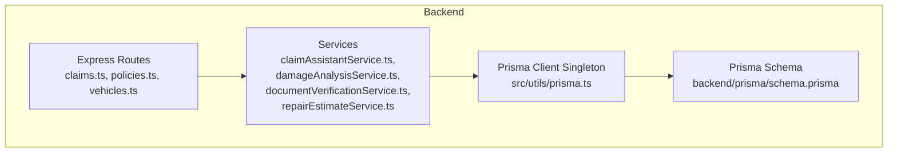
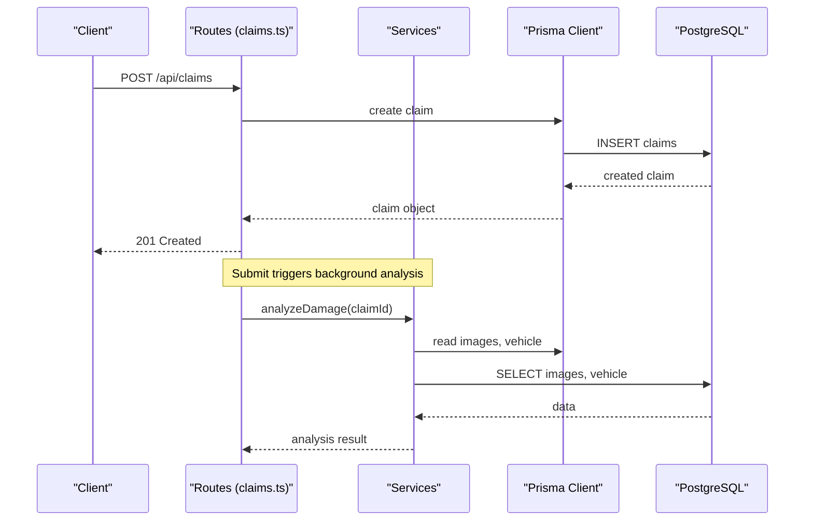
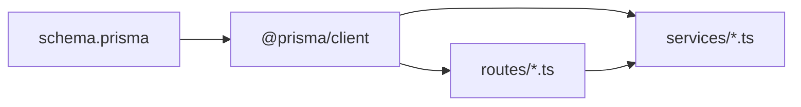

# Database Design

<cite>
**Referenced Files in This Document**
- [schema.prisma](file://backend/prisma/schema.prisma)
- [prisma.ts](file://backend/src/utils/prisma.ts)
- [package.json](file://backend/package.json)
- [claims.ts](file://backend/src/routes/claims.ts)
- [policies.ts](file://backend/src/routes/policies.ts)
- [vehicles.ts](file://backend/src/routes/vehicles.ts)
- [claimAssistantService.ts](file://backend/src/services/claimAssistantService.ts)
- [damageAnalysisService.ts](file://backend/src/services/damageAnalysisService.ts)
- [documentVerificationService.ts](file://backend/src/services/documentVerificationService.ts)
- [repairEstimateService.ts](file://backend/src/services/repairEstimateService.ts)
</cite>

## Table of Contents
1. [Introduction](#introduction)
2. [Project Structure](#project-structure)
3. [Core Components](#core-components)
4. [Architecture Overview](#architecture-overview)
5. [Detailed Component Analysis](#detailed-component-analysis)
6. [Dependency Analysis](#dependency-analysis)
7. [Performance Considerations](#performance-considerations)
8. [Troubleshooting Guide](#troubleshooting-guide)
9. [Conclusion](#conclusion)
10. [Appendices](#appendices)

## Introduction
This document provides comprehensive database design documentation for the PostgreSQL-capable schema defined with Prisma ORM. It covers entity relationships, field definitions, constraints, validation rules, enum types, primary and foreign key relationships, migration strategy, indexing recommendations, and data access patterns using Prisma’s type-safe query builder. The goal is to make the database design understandable for both technical and non-technical readers while ensuring accuracy grounded in the repository’s codebase.

## Project Structure
The backend uses a Prisma schema to define models and enums, a singleton Prisma client instance for connection management, and Express routes/services that perform type-safe queries against the database.



**Diagram sources**
- [claims.ts:1-450](file://backend/src/routes/claims.ts#L1-L450)
- [policies.ts:1-131](file://backend/src/routes/policies.ts#L1-L131)
- [vehicles.ts:1-148](file://backend/src/routes/vehicles.ts#L1-L148)
- [claimAssistantService.ts:1-130](file://backend/src/services/claimAssistantService.ts#L1-L130)
- [damageAnalysisService.ts:1-154](file://backend/src/services/damageAnalysisService.ts#L1-L154)
- [documentVerificationService.ts:1-107](file://backend/src/services/documentVerificationService.ts#L1-L107)
- [repairEstimateService.ts:1-199](file://backend/src/services/repairEstimateService.ts#L1-L199)
- [prisma.ts:1-6](file://backend/src/utils/prisma.ts#L1-L6)
- [schema.prisma:1-201](file://backend/prisma/schema.prisma#L1-L201)

**Section sources**
- [schema.prisma:1-201](file://backend/prisma/schema.prisma#L1-L201)
- [prisma.ts:1-6](file://backend/src/utils/prisma.ts#L1-L6)
- [package.json:1-43](file://backend/package.json#L1-L43)

## Core Components
The database schema defines the following core entities and enums:

- Entities: User, Vehicle, InsurancePolicy, Claim, ClaimImage, DamageAssessment, RepairEstimate, InsurancePayout, Document, ChatMessage
- Enums: ClaimStatus, ImageType, SeverityLevel, DocumentType, VerificationStatus, ChatRole

Key characteristics:
- Primary keys are UUIDs generated at creation time for all entities.
- Timestamps (createdAt, updatedAt) are automatically managed where applicable.
- Relationships enforce referential integrity via foreign keys with cascade behaviors.
- JSON fields store complex structures such as damages, items, and verification results.
- Enum fields constrain categorical values like status, severity, and roles.

**Section sources**
- [schema.prisma:10-201](file://backend/prisma/schema.prisma#L10-L201)

## Architecture Overview
The application follows a layered architecture:
- Routes handle HTTP requests and delegate business logic to services.
- Services orchestrate domain operations, often invoking AI services and persisting results via Prisma.
- Prisma client provides type-safe database access based on the schema.



**Diagram sources**
- [claims.ts:20-57](file://backend/src/routes/claims.ts#L20-L57)
- [claims.ts:152-193](file://backend/src/routes/claims.ts#L152-L193)
- [damageAnalysisService.ts:50-154](file://backend/src/services/damageAnalysisService.ts#L50-L154)
- [prisma.ts:1-6](file://backend/src/utils/prisma.ts#L1-L6)
- [schema.prisma:70-93](file://backend/prisma/schema.prisma#L70-L93)

## Detailed Component Analysis

### Entity Relationship Diagram
The following diagram maps the actual relationships defined in the Prisma schema:

```mermaid
erDiagram
USER {
string id PK
string email UK
string passwordHash
string firstName
string lastName
string phone
string address
datetime createdAt
datetime updatedAt
}
VEHICLE {
string id PK
string userId FK
string make
string model
int year
string vin
string licensePlate
string color
int mileage
string photos
datetime createdAt
datetime updatedAt
}
INSURANCE_POLICY {
string id PK
string userId FK
string providerName
string policyNumber
string coverageType
float deductible
float premiumAmount
datetime startDate
datetime endDate
datetime createdAt
datetime updatedAt
}
CLAIM {
string id PK
string userId FK
string vehicleId FK
string policyId FK
enum status
datetime incidentDate
string incidentLocation
string incidentDescription
string weatherConditions
boolean hasPoliceReport
datetime createdAt
datetime updatedAt
}
CLAIM_IMAGE {
string id PK
string claimId FK
enum type
string filePath
string label
json aiAnnotation
datetime uploadedAt
}
DAMAGE_ASSESSMENT {
string id PK
string claimId UK FK
json damages
string drivabilityAssessment
enum overallSeverity
json aiRawResponse
datetime assessedAt
}
REPAIR_ESTIMATE {
string id PK
string claimId UK FK
string damageAssessmentId UK FK
json items
float totalPartsCost
float totalLaborCost
float totalCost
int estimatedDays
datetime createdAt
}
INSURANCE_PAYOUT {
string id PK
string claimId UK FK
string repairEstimateId UK FK
float deductible
float coveredAmount
float estimatedPayout
string notes
datetime createdAt
}
DOCUMENT {
string id PK
string claimId FK
enum type
string filePath
enum verificationStatus
json verificationResult
datetime uploadedAt
}
CHAT_MESSAGE {
string id PK
string claimId FK
enum role
string content
datetime createdAt
}
USER ||--o{ VEHICLE : "owns"
USER ||--o{ INSURANCE_POLICY : "has"
USER ||--o{ CLAIM : "submits"
VEHICLE ||--o{ CLAIM : "involved in"
INSURANCE_POLICY ||--o{ CLAIM : "covers (optional)"
CLAIM ||--o{ CLAIM_IMAGE : "has"
CLAIM ||--o| DAMAGE_ASSESSMENT : "has one"
CLAIM ||--o| REPAIR_ESTIMATE : "has one"
REPAIR_ESTIMATE ||--o| INSURANCE_PAYOUT : "linked"
CLAIM ||--o{ DOCUMENT : "has"
CLAIM ||--o{ CHAT_MESSAGE : "has"
```

**Diagram sources**
- [schema.prisma:10-201](file://backend/prisma/schema.prisma#L10-L201)

### Model Field Definitions, Types, Constraints, and Validation Rules
Below is a concise summary of each model’s fields, types, constraints, and validation behavior as defined in the schema and enforced by Prisma.

- User
  - Fields: id (UUID), email (unique), passwordHash, firstName, lastName, phone (nullable), address (nullable), createdAt (auto), updatedAt (auto)
  - Constraints: email unique; timestamps auto-managed
  - Validation: Prisma enforces uniqueness and required fields at runtime

- Vehicle
  - Fields: id (UUID), userId (FK to User), make, model, year (Int), vin (nullable), licensePlate, color, mileage (nullable), photos (default empty array), createdAt, updatedAt
  - Constraints: userId FK with cascade delete; timestamps auto-managed
  - Validation: Required fields enforced by Prisma; photos default to empty array

- InsurancePolicy
  - Fields: id (UUID), userId (FK to User), providerName, policyNumber, coverageType, deductible (Float), premiumAmount (Float), startDate (DateTime), endDate (DateTime), createdAt, updatedAt
  - Constraints: userId FK with cascade delete; timestamps auto-managed
  - Validation: Required fields enforced by Prisma

- Claim
  - Fields: id (UUID), userId (FK to User), vehicleId (FK to Vehicle), policyId (FK to InsurancePolicy, nullable), status (enum with default DRAFT), incidentDate, incidentLocation, incidentDescription, weatherConditions (nullable), hasPoliceReport (boolean default false), createdAt, updatedAt
  - Constraints: userId FK cascade; vehicleId FK cascade; policyId FK set null on delete; timestamps auto-managed
  - Validation: Status constrained to enum; defaults applied for status and hasPoliceReport

- ClaimImage
  - Fields: id (UUID), claimId (FK to Claim), type (enum), filePath, label (nullable), aiAnnotation (JSON nullable), uploadedAt (auto)
  - Constraints: claimId FK cascade; timestamps auto-managed
  - Validation: Type constrained to enum

- DamageAssessment
  - Fields: id (UUID), claimId (unique FK to Claim), damages (JSON), drivabilityAssessment, overallSeverity (enum), aiRawResponse (JSON nullable), assessedAt (auto)
  - Constraints: claimId unique and FK cascade; timestamps auto-managed
  - Validation: Severity constrained to enum

- RepairEstimate
  - Fields: id (UUID), claimId (unique FK to Claim), damageAssessmentId (unique FK to DamageAssessment), items (JSON), totalPartsCost (Float), totalLaborCost (Float), totalCost (Float), estimatedDays (Int), createdAt (auto)
  - Constraints: claimId unique FK cascade; damageAssessmentId unique FK cascade; timestamps auto-managed
  - Validation: Numeric fields enforced by Prisma

- InsurancePayout
  - Fields: id (UUID), claimId (unique FK to Claim), repairEstimateId (unique FK to RepairEstimate), deductible (Float), coveredAmount (Float), estimatedPayout (Float), notes (nullable), createdAt (auto)
  - Constraints: claimId unique FK cascade; repairEstimateId unique FK cascade; timestamps auto-managed
  - Validation: Numeric fields enforced by Prisma

- Document
  - Fields: id (UUID), claimId (FK to Claim), type (enum), filePath, verificationStatus (enum default PENDING), verificationResult (JSON nullable), uploadedAt (auto)
  - Constraints: claimId FK cascade; timestamps auto-managed
  - Validation: Type and verificationStatus constrained to enums

- ChatMessage
  - Fields: id (UUID), claimId (FK to Claim), role (enum), content, createdAt (auto)
  - Constraints: claimId FK cascade; timestamps auto-managed
  - Validation: Role constrained to enum

**Section sources**
- [schema.prisma:10-201](file://backend/prisma/schema.prisma#L10-L201)

### Enum Types
- ClaimStatus: DRAFT, SUBMITTED, UNDER_REVIEW, APPROVED, REJECTED, COMPLETED
- ImageType: FULL_VEHICLE, DAMAGE_CLOSEUP
- SeverityLevel: MINOR, MODERATE, SEVERE
- DocumentType: LICENSE, REGISTRATION, ACCIDENT_REPORT, REPAIR_ESTIMATE
- VerificationStatus: PENDING, VERIFIED, ISSUES_FOUND, UNREADABLE
- ChatRole: USER, ASSISTANT

These enums provide compile-time safety and consistent state tracking across the application.

**Section sources**
- [schema.prisma:61-68](file://backend/prisma/schema.prisma#L61-L68)
- [schema.prisma:95-98](file://backend/prisma/schema.prisma#L95-L98)
- [schema.prisma:112-116](file://backend/prisma/schema.prisma#L112-L116)
- [schema.prisma:161-166](file://backend/prisma/schema.prisma#L161-L166)
- [schema.prisma:168-173](file://backend/prisma/schema.prisma#L168-L173)
- [schema.prisma:187-190](file://backend/prisma/schema.prisma#L187-L190)

### Primary and Foreign Key Relationships
- User to Vehicle: One-to-many (User owns multiple Vehicles). Cascade delete on user removal.
- User to InsurancePolicy: One-to-many (User holds multiple Policies). Cascade delete on user removal.
- User to Claim: One-to-many (User submits multiple Claims). Cascade delete on user removal.
- Vehicle to Claim: One-to-many (Vehicle involved in multiple Claims). Cascade delete on vehicle removal.
- InsurancePolicy to Claim: One-to-many (Policy can cover multiple Claims). Set null on policy deletion.
- Claim to ClaimImage: One-to-many (Claim has many Images). Cascade delete on claim removal.
- Claim to DamageAssessment: One-to-one (Claim has one Assessment). Cascade delete on claim removal.
- Claim to RepairEstimate: One-to-one (Claim has one Estimate). Cascade delete on claim removal.
- RepairEstimate to InsurancePayout: One-to-one (Estimate linked to one Payout). Cascade delete on estimate removal.
- Claim to Document: One-to-many (Claim has many Documents). Cascade delete on claim removal.
- Claim to ChatMessage: One-to-many (Claim has many Messages). Cascade delete on claim removal.

These relationships ensure referential integrity and consistent lifecycle management.

**Section sources**
- [schema.prisma:26-42](file://backend/prisma/schema.prisma#L26-L42)
- [schema.prisma:44-59](file://backend/prisma/schema.prisma#L44-L59)
- [schema.prisma:70-93](file://backend/prisma/schema.prisma#L70-L93)
- [schema.prisma:100-110](file://backend/prisma/schema.prisma#L100-L110)
- [schema.prisma:118-129](file://backend/prisma/schema.prisma#L118-L129)
- [schema.prisma:131-145](file://backend/prisma/schema.prisma#L131-L145)
- [schema.prisma:147-159](file://backend/prisma/schema.prisma#L147-L159)
- [schema.prisma:175-185](file://backend/prisma/schema.prisma#L175-L185)
- [schema.prisma:192-200](file://backend/prisma/schema.prisma#L192-L200)

### Prisma Client Configuration and Connection Management
- Generator: prisma-client-js configured to generate TypeScript types from the schema.
- Datasource: Provider is set to sqlite in the current schema file; however, the project includes Prisma dependencies suitable for PostgreSQL usage. The DATABASE_URL environment variable drives the connection string.
- Singleton Instance: A single PrismaClient instance is exported and reused across the application to manage connections efficiently.

Notes:
- To target PostgreSQL, update the datasource provider and DATABASE_URL accordingly.
- Ensure environment variables are loaded (e.g., via dotenv) before initializing Prisma.

**Section sources**
- [schema.prisma:1-8](file://backend/prisma/schema.prisma#L1-L8)
- [prisma.ts:1-6](file://backend/src/utils/prisma.ts#L1-L6)
- [package.json:18-30](file://backend/package.json#L18-L30)

### Data Migration Strategy Using Prisma Migrations
- Development workflow: Use Prisma migrations to evolve the schema incrementally and maintain version control.
- Commands available:
  - Generate client types: prisma generate
  - Create and apply migrations: prisma migrate dev
  - Push schema directly to database (dev): prisma db push
  - Visualize database: prisma studio

Best practices:
- Commit migration files to version control alongside schema changes.
- Review generated SQL before applying migrations in production.
- Use prisma migrate deploy in production environments after testing.

**Section sources**
- [package.json:6-13](file://backend/package.json#L6-L13)
- [schema.prisma:1-8](file://backend/prisma/schema.prisma#L1-L8)

### Indexing Strategies for Performance Optimization
Recommended indexes based on frequent query patterns observed in routes and services:

- Users
  - Email: Unique index already enforced by @unique; ensures fast lookups during authentication.

- Vehicles
  - userId: Index to optimize queries filtering vehicles by owner.
  - licensePlate: Optional unique or indexed if used for lookups.

- InsurancePolicy
  - userId: Index to optimize queries fetching policies per user.
  - policyNumber: Optional unique or indexed if used for lookups.

- Claims
  - userId: Index to optimize user-specific claim listings.
  - vehicleId: Index to optimize vehicle-centric queries.
  - status: Index to optimize filtering by claim status.
  - incidentDate: Optional index if date-range queries are common.

- ClaimImage
  - claimId: Index to optimize image retrieval per claim.

- DamageAssessment
  - claimId: Unique constraint already exists; no additional index needed.

- RepairEstimate
  - claimId: Unique constraint already exists; no additional index needed.
  - damageAssessmentId: Unique constraint already exists; no additional index needed.

- InsurancePayout
  - claimId: Unique constraint already exists; no additional index needed.
  - repairEstimateId: Unique constraint already exists; no additional index needed.

- Document
  - claimId: Index to optimize document listing per claim.
  - verificationStatus: Optional index if filtering by verification status is frequent.

- ChatMessage
  - claimId: Index to optimize message retrieval per claim.
  - createdAt: Optional index if sorting by time is frequent.

Implementation note:
- Add indexes via Prisma schema attributes (e.g., @@index) or through raw SQL migrations when necessary.
- Validate query plans and performance after adding indexes.

**Section sources**
- [claims.ts:60-83](file://backend/src/routes/claims.ts#L60-L83)
- [claims.ts:85-112](file://backend/src/routes/claims.ts#L85-L112)
- [claims.ts:355-377](file://backend/src/routes/claims.ts#L355-L377)
- [claims.ts:399-421](file://backend/src/routes/claims.ts#L399-L421)
- [policies.ts:42-55](file://backend/src/routes/policies.ts#L42-L55)
- [vehicles.ts:44-60](file://backend/src/routes/vehicles.ts#L44-L60)
- [schema.prisma:10-201](file://backend/prisma/schema.prisma#L10-L201)

### Data Access Patterns Through Prisma’s Type-Safe Query Builder
- CRUD Operations: Routes use findUnique, findFirst, findMany, create, update, and delete with strongly-typed where clauses and selects.
- Relations and Includes: Queries include related entities (e.g., vehicle, policy, damageAssessment, documents, chatMessages) to reduce N+1 queries and fetch nested data efficiently.
- Filtering and Ordering: Queries filter by userId, status, and order by createdAt or other fields for predictable results.
- Count Aggregations: _count is used to retrieve associated record counts without loading full relations.
- Transactions: While not explicitly shown in the provided routes, Prisma supports transactions for multi-step operations requiring atomicity.

Compile-time safety benefits:
- TypeScript types generated from the schema prevent invalid field names and relation paths at compile time.
- Enum constraints ensure only valid values are assigned to typed fields.
- Required vs optional fields are enforced by the generated types, reducing runtime errors.

Examples of patterns in the codebase:
- Fetching a claim with rich context including related entities and messages.
- Listing claims with filters and counts for efficient UI rendering.
- Creating and updating records with validated inputs.

**Section sources**
- [claims.ts:20-57](file://backend/src/routes/claims.ts#L20-L57)
- [claims.ts:60-83](file://backend/src/routes/claims.ts#L60-L83)
- [claims.ts:85-112](file://backend/src/routes/claims.ts#L85-L112)
- [policies.ts:12-39](file://backend/src/routes/policies.ts#L12-L39)
- [policies.ts:42-55](file://backend/src/routes/policies.ts#L42-L55)
- [vehicles.ts:13-42](file://backend/src/routes/vehicles.ts#L13-L42)
- [vehicles.ts:44-60](file://backend/src/routes/vehicles.ts#L44-L60)

## Dependency Analysis
The database layer depends on:
- Prisma schema defining models and enums
- Prisma client singleton providing type-safe access
- Routes and services orchestrating business logic and issuing queries



**Diagram sources**
- [schema.prisma:1-201](file://backend/prisma/schema.prisma#L1-L201)
- [prisma.ts:1-6](file://backend/src/utils/prisma.ts#L1-L6)
- [claims.ts:1-450](file://backend/src/routes/claims.ts#L1-L450)
- [policies.ts:1-131](file://backend/src/routes/policies.ts#L1-L131)
- [vehicles.ts:1-148](file://backend/src/routes/vehicles.ts#L1-L148)
- [claimAssistantService.ts:1-130](file://backend/src/services/claimAssistantService.ts#L1-L130)
- [damageAnalysisService.ts:1-154](file://backend/src/services/damageAnalysisService.ts#L1-L154)
- [documentVerificationService.ts:1-107](file://backend/src/services/documentVerificationService.ts#L1-L107)
- [repairEstimateService.ts:1-199](file://backend/src/services/repairEstimateService.ts#L1-L199)

**Section sources**
- [package.json:18-30](file://backend/package.json#L18-L30)
- [schema.prisma:1-201](file://backend/prisma/schema.prisma#L1-L201)
- [prisma.ts:1-6](file://backend/src/utils/prisma.ts#L1-L6)

## Performance Considerations
- Use selective includes to avoid loading unnecessary relations.
- Leverage _count for aggregate counts instead of fetching full related collections.
- Apply appropriate indexes on frequently filtered fields (userId, vehicleId, status, claimId).
- Batch operations where possible (e.g., creating multiple images in parallel).
- Monitor query performance and adjust indexes based on real-world usage patterns.

[No sources needed since this section provides general guidance]

## Troubleshooting Guide
Common issues and resolutions:
- Missing environment variables: Ensure DATABASE_URL and JWT_SECRET are set before starting the server.
- Migration conflicts: If migrations fail, review recent changes and reset development database if necessary.
- Relation errors: Verify foreign key constraints and cascade behaviors when deleting parent records.
- JSON parsing failures: When integrating with external AI services, handle malformed responses gracefully and fallback to safe defaults.

Operational tips:
- Use prisma studio to inspect data and validate schema changes visually.
- Log errors consistently and capture stack traces for debugging.
- Validate inputs at the API layer to prevent invalid data from reaching the database.

**Section sources**
- [claims.ts:53-56](file://backend/src/routes/claims.ts#L53-L56)
- [claims.ts:184-186](file://backend/src/routes/claims.ts#L184-L186)
- [damageAnalysisService.ts:95-103](file://backend/src/services/damageAnalysisService.ts#L95-L103)
- [documentVerificationService.ts:86-94](file://backend/src/services/documentVerificationService.ts#L86-L94)

## Conclusion
The Prisma-based database design provides a robust, type-safe foundation for the Smart Vehicle Insurance Claim System. The schema clearly models users, vehicles, policies, claims, and supporting artifacts like images, assessments, estimates, payouts, documents, and chat messages. Enum types and constraints ensure data consistency, while relationships maintain referential integrity. With careful indexing and thoughtful use of Prisma’s query capabilities, the system can scale effectively and deliver reliable performance.

[No sources needed since this section summarizes without analyzing specific files]

## Appendices

### Example Query Patterns
- List user claims with filters and counts:
  - See route implementation for filtering by status and including related data.

- Retrieve detailed claim context:
  - See route implementation for including vehicle, policy, images, assessments, estimates, payouts, documents, and messages.

- Upload images and associate with a claim:
  - See route implementation for creating multiple ClaimImage records.

- Verify documents and update status:
  - See service implementation for reading document files, invoking AI, and updating verification results.

**Section sources**
- [claims.ts:60-83](file://backend/src/routes/claims.ts#L60-L83)
- [claims.ts:85-112](file://backend/src/routes/claims.ts#L85-L112)
- [claims.ts:195-233](file://backend/src/routes/claims.ts#L195-L233)
- [documentVerificationService.ts:41-107](file://backend/src/services/documentVerificationService.ts#L41-L107)