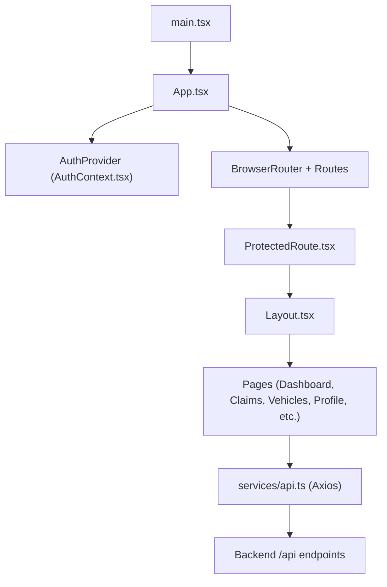
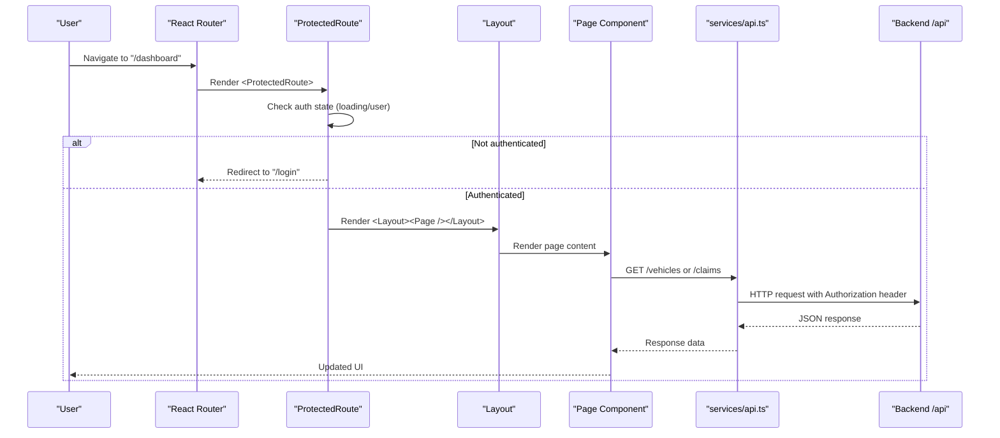
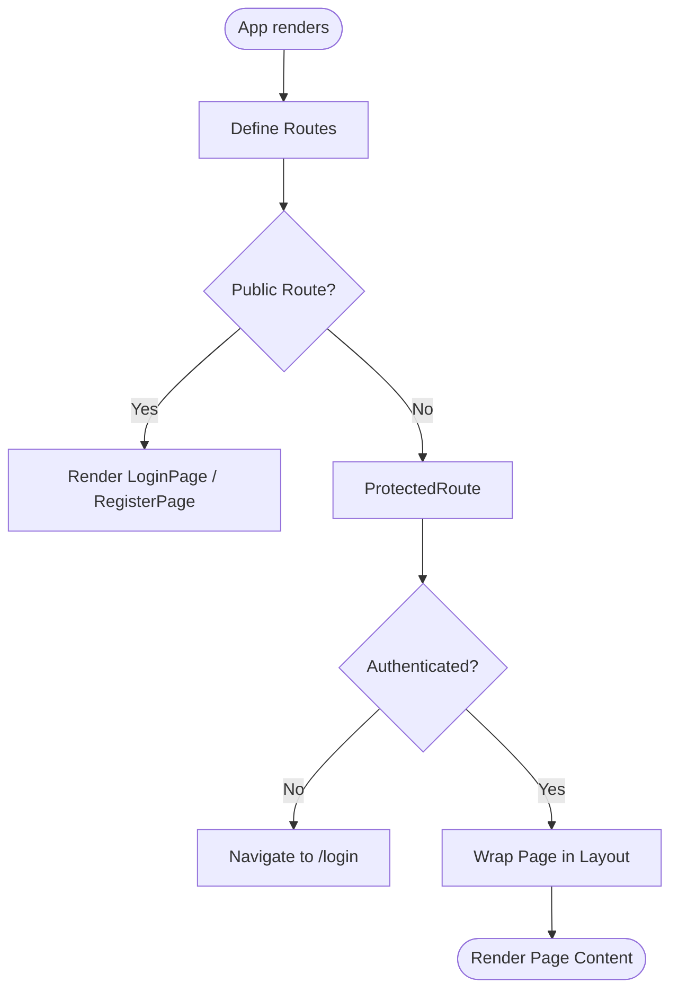
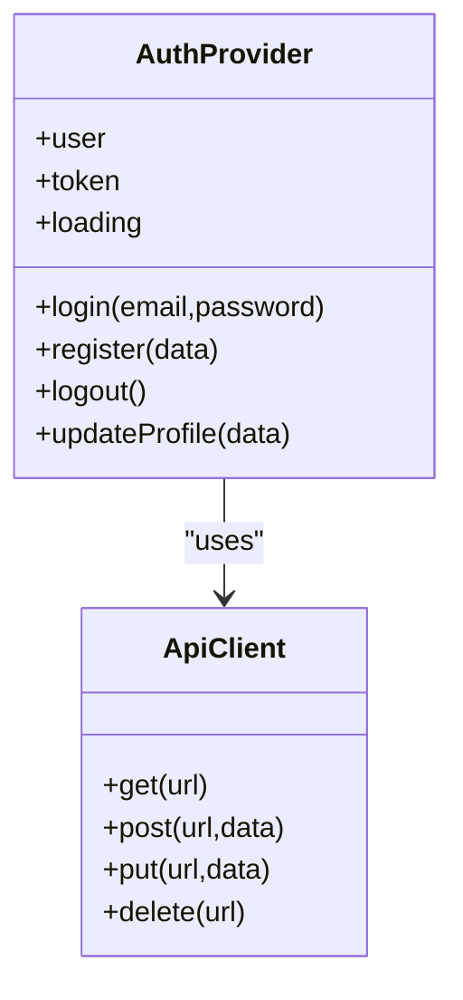
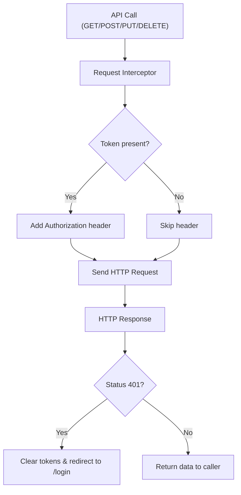
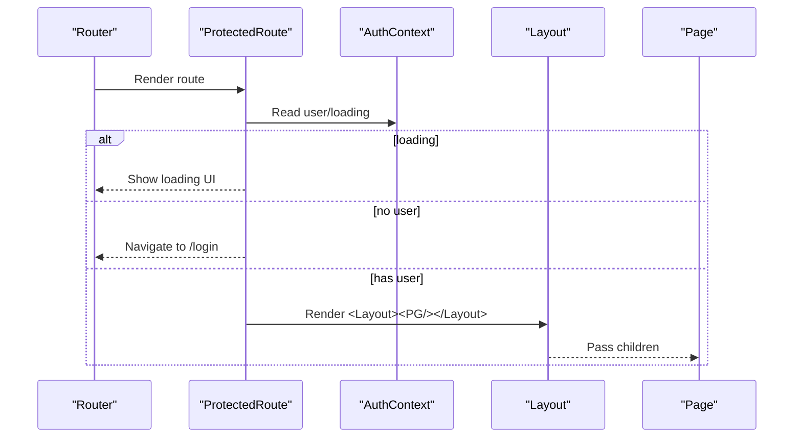
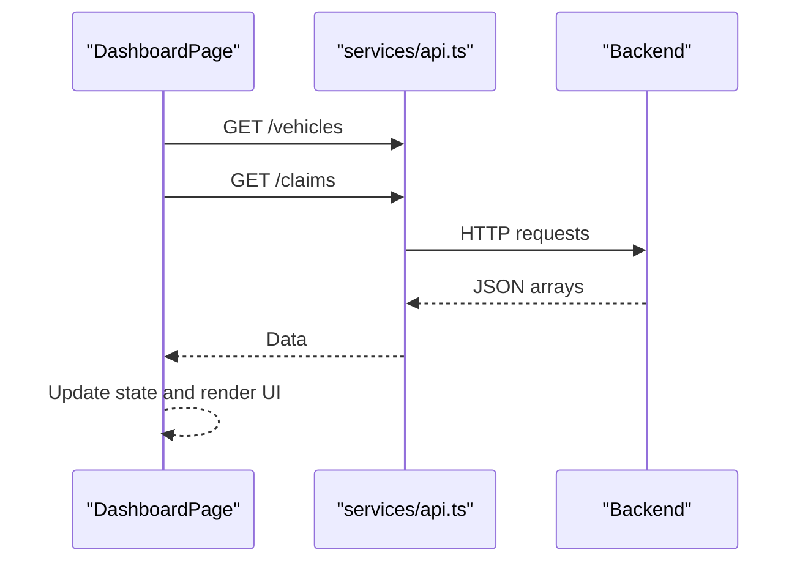
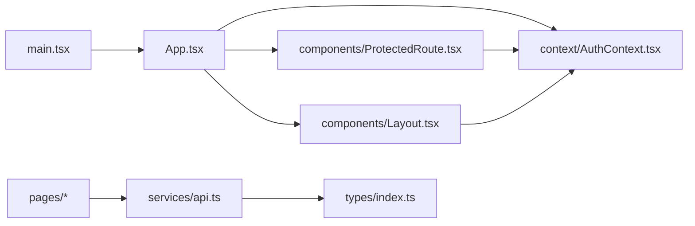

# Frontend Architecture

<cite>
**Referenced Files in This Document**
- [main.tsx](file://frontend/src/main.tsx)
- [App.tsx](file://frontend/src/App.tsx)
- [Layout.tsx](file://frontend/src/components/Layout.tsx)
- [ProtectedRoute.tsx](file://frontend/src/components/ProtectedRoute.tsx)
- [AuthContext.tsx](file://frontend/src/context/AuthContext.tsx)
- [api.ts](file://frontend/src/services/api.ts)
- [index.ts](file://frontend/src/types/index.ts)
- [DashboardPage.tsx](file://frontend/src/pages/DashboardPage.tsx)
- [ClaimsPage.tsx](file://frontend/src/pages/ClaimsPage.tsx)
- [VehiclesPage.tsx](file://frontend/src/pages/VehiclesPage.tsx)
- [LoginPage.tsx](file://frontend/src/pages/LoginPage.tsx)
- [vite.config.ts](file://frontend/vite.config.ts)
- [package.json](file://frontend/package.json)
</cite>

## Table of Contents
1. Introduction
2. Project Structure
3. Core Components
4. Architecture Overview
5. Detailed Component Analysis
6. Dependency Analysis
7. Performance Considerations
8. Troubleshooting Guide
9. Conclusion

## Introduction
This document describes the React frontend architecture for the Smart Vehicle Insurance Claim System. It explains the component-based structure using React 19 with TypeScript, functional components and hooks, client-side routing via React Router, state management through React Context API for authentication and global data, a service layer built on Axios with request/response interceptors and error handling, layout wrapping patterns, protected routes for authentication guards, Vite build configuration, and responsive design using Tailwind CSS utility classes with a mobile-first approach.

## Project Structure
The frontend is organized by feature and responsibility:
- Entry points: application bootstrap and root routing
- Pages: route-level components for Dashboard, Claims, Vehicles, Profile, Login/Register
- Components: shared UI wrappers like Layout and ProtectedRoute
- Context: global auth state provider and hooks
- Services: centralized HTTP client with interceptors
- Types: shared TypeScript interfaces for domain models
- Build: Vite configuration with Tailwind plugin and dev proxy

**Diagram sources**
- [main.tsx:1-11](file://frontend/src/main.tsx#L1-L11)
- [App.tsx:1-39](file://frontend/src/App.tsx#L1-L39)
- [AuthContext.tsx:17-73](file://frontend/src/context/AuthContext.tsx#L17-L73)
- [ProtectedRoute.tsx:1-21](file://frontend/src/components/ProtectedRoute.tsx#L1-L21)
- [Layout.tsx:14-176](file://frontend/src/components/Layout.tsx#L14-L176)
- [api.ts:1-33](file://frontend/src/services/api.ts#L1-L33)

**Section sources**
- [main.tsx:1-11](file://frontend/src/main.tsx#L1-L11)
- [App.tsx:1-39](file://frontend/src/App.tsx#L1-L39)

## Core Components
- App: Configures routing, wraps all routes with AuthProvider, and defines public/private routes.
- Layout: Provides consistent navigation, branding, user info, and responsive sidebar/bottom nav; integrates logout flow.
- ProtectedRoute: Guards routes based on authentication state; shows loading indicator while auth initializes.
- AuthContext: Manages user/token state, persists token to localStorage, validates session on load, exposes login/register/logout/updateProfile.
- api: Centralized Axios instance with base URL, default headers, request interceptor to attach Authorization header, and response interceptor to handle 401 redirects.

Key responsibilities:
- Routing: Declarative routes for Dashboard, Vehicles, Claims, Policies, Profile, Login, Register.
- State: Global auth state via Context; pages consume context where needed.
- Networking: All HTTP calls go through the centralized api client.

**Section sources**
- [App.tsx:15-35](file://frontend/src/App.tsx#L15-L35)
- [Layout.tsx:14-176](file://frontend/src/components/Layout.tsx#L14-L176)
- [ProtectedRoute.tsx:4-20](file://frontend/src/components/ProtectedRoute.tsx#L4-L20)
- [AuthContext.tsx:17-82](file://frontend/src/context/AuthContext.tsx#L17-L82)
- [api.ts:3-32](file://frontend/src/services/api.ts#L3-L32)

## Architecture Overview
The application follows a layered architecture:
- Presentation Layer: Pages and shared components (Layout, ProtectedRoute)
- State Layer: React Context for authentication and app-wide state
- Service Layer: Axios client with interceptors for cross-cutting concerns (auth injection, error handling)
- Data Layer: Backend REST APIs proxied during development

**Diagram sources**
- [App.tsx:17-33](file://frontend/src/App.tsx#L17-L33)
- [ProtectedRoute.tsx:4-20](file://frontend/src/components/ProtectedRoute.tsx#L4-L20)
- [Layout.tsx:14-176](file://frontend/src/components/Layout.tsx#L14-L176)
- [api.ts:10-30](file://frontend/src/services/api.ts#L10-L30)
- [DashboardPage.tsx:14-27](file://frontend/src/pages/DashboardPage.tsx#L14-L27)

## Detailed Component Analysis

### Routing and Navigation
- Root router uses BrowserRouter with declarative Routes.
- Public routes: /login, /register.
- Protected routes: /dashboard, /vehicles, /policies, /claims, /profile, plus nested routes for new items and details.
- Default redirect from "/" to "/dashboard".
- Each protected route wraps its page inside Layout to provide consistent chrome.

**Diagram sources**
- [App.tsx:15-35](file://frontend/src/App.tsx#L15-L35)
- [ProtectedRoute.tsx:4-20](file://frontend/src/components/ProtectedRoute.tsx#L4-L20)

**Section sources**
- [App.tsx:15-35](file://frontend/src/App.tsx#L15-L35)

### Authentication State Management (Context API)
- AuthProvider maintains user, token, and loading state.
- On mount, if a token exists in localStorage, it fetches the current profile to validate the session.
- login/register persist token and user to localStorage and update context.
- logout clears context and storage.
- useAuth hook provides typed access to auth state and actions.

**Diagram sources**
- [AuthContext.tsx:17-82](file://frontend/src/context/AuthContext.tsx#L17-L82)
- [api.ts:3-32](file://frontend/src/services/api.ts#L3-L32)

**Section sources**
- [AuthContext.tsx:17-82](file://frontend/src/context/AuthContext.tsx#L17-L82)

### Service Layer (Axios with Interceptors)
- Base URL set to /api; default JSON content type.
- Request interceptor attaches Authorization header from localStorage when present.
- Response interceptor handles 401 by clearing tokens and redirecting to login.
- All pages call this centralized client for consistency and maintainability.

**Diagram sources**
- [api.ts:3-32](file://frontend/src/services/api.ts#L3-L32)

**Section sources**
- [api.ts:3-32](file://frontend/src/services/api.ts#L3-L32)

### Layout and ProtectedRoute Patterns
- Layout provides:
  - Desktop sidebar with navigation links and active state detection
  - Mobile header with hamburger toggle and overlay sidebar
  - Bottom navigation for primary sections on small screens
  - User info display and sign-out action
- ProtectedRoute:
  - Shows a spinner while auth initializes
  - Redirects unauthenticated users to login
  - Renders children only when authenticated

**Diagram sources**
- [ProtectedRoute.tsx:4-20](file://frontend/src/components/ProtectedRoute.tsx#L4-L20)
- [Layout.tsx:14-176](file://frontend/src/components/Layout.tsx#L14-L176)
- [AuthContext.tsx:17-82](file://frontend/src/context/AuthContext.tsx#L17-L82)

**Section sources**
- [Layout.tsx:14-176](file://frontend/src/components/Layout.tsx#L14-L176)
- [ProtectedRoute.tsx:4-20](file://frontend/src/components/ProtectedRoute.tsx#L4-L20)

### Page Components and Data Flow
- DashboardPage: Fetches vehicles and claims concurrently, displays stats, recent claims, and quick actions.
- ClaimsPage: Lists claims with optional status filter; navigates to detail pages.
- VehiclesPage: Lists vehicles, supports adding and viewing details; includes delete flow.
- LoginPage: Handles login form submission, errors, and navigation to dashboard.

**Diagram sources**
- [DashboardPage.tsx:14-27](file://frontend/src/pages/DashboardPage.tsx#L14-L27)
- [api.ts:3-32](file://frontend/src/services/api.ts#L3-L32)

**Section sources**
- [DashboardPage.tsx:14-27](file://frontend/src/pages/DashboardPage.tsx#L14-L27)
- [ClaimsPage.tsx:22-33](file://frontend/src/pages/ClaimsPage.tsx#L22-L33)
- [VehiclesPage.tsx:7-16](file://frontend/src/pages/VehiclesPage.tsx#L7-L16)
- [LoginPage.tsx:14-27](file://frontend/src/pages/LoginPage.tsx#L14-L27)

### Responsive Design with Tailwind CSS
- Mobile-first utilities are used throughout:
  - Conditional rendering for desktop vs mobile navigation
  - Grid layouts that adapt across breakpoints
  - Touch-friendly controls and spacing
- The Layout component demonstrates:
  - Hidden desktop sidebar until lg breakpoint
  - Fixed mobile header and bottom nav
  - Overlay sidebar with backdrop for mobile navigation

**Section sources**
- [Layout.tsx:25-176](file://frontend/src/components/Layout.tsx#L25-L176)

## Dependency Analysis
High-level dependencies between modules:

**Diagram sources**
- [main.tsx:1-11](file://frontend/src/main.tsx#L1-L11)
- [App.tsx:1-39](file://frontend/src/App.tsx#L1-L39)
- [AuthContext.tsx:1-82](file://frontend/src/context/AuthContext.tsx#L1-L82)
- [ProtectedRoute.tsx:1-21](file://frontend/src/components/ProtectedRoute.tsx#L1-L21)
- [Layout.tsx:1-176](file://frontend/src/components/Layout.tsx#L1-L176)
- [api.ts:1-33](file://frontend/src/services/api.ts#L1-L33)
- [index.ts:1-149](file://frontend/src/types/index.ts#L1-L149)

**Section sources**
- [App.tsx:1-39](file://frontend/src/App.tsx#L1-L39)
- [api.ts:1-33](file://frontend/src/services/api.ts#L1-L33)
- [index.ts:1-149](file://frontend/src/types/index.ts#L1-L149)

## Performance Considerations
- Concurrent data fetching: Use Promise.all to fetch multiple resources in parallel (e.g., vehicles and claims) to reduce total load time.
- Minimal re-renders: Keep state local to pages where possible; share only necessary data via Context.
- Efficient navigation: Use React Router’s Link for client-side navigation to avoid full page reloads.
- Optimized assets: Leverage Vite’s fast HMR and production optimizations; ensure images and icons are appropriately sized.
- Avoid heavy computations in render paths; memoize derived values if needed.

[No sources needed since this section provides general guidance]

## Troubleshooting Guide
Common issues and resolutions:
- Unauthorized redirects: If the backend returns 401, the response interceptor clears stored tokens and redirects to login. Ensure tokens are correctly persisted and refreshed.
- Missing Authorization header: Confirm the request interceptor runs and that a token exists in localStorage before making authenticated requests.
- Auth initialization race: ProtectedRoute shows a spinner while AuthContext loads the session; avoid gating UI until loading completes.
- Network errors: Handle promise rejections in pages and show user-friendly messages; consider retry logic for transient failures.

**Section sources**
- [api.ts:19-30](file://frontend/src/services/api.ts#L19-L30)
- [ProtectedRoute.tsx:7-17](file://frontend/src/components/ProtectedRoute.tsx#L7-L17)
- [AuthContext.tsx:22-36](file://frontend/src/context/AuthContext.tsx#L22-L36)

## Conclusion
The frontend employs a clean, modular architecture:
- Functional components with hooks for predictable state and side effects
- React Router for declarative, protected client-side navigation
- Context API for centralized authentication state
- Centralized Axios service with interceptors for consistent networking and error handling
- Consistent Layout wrapper ensuring cohesive UX across pages
- Vite-powered build pipeline with Tailwind CSS for rapid, responsive UI development

This structure scales well as features grow, keeping code organized, testable, and maintainable.