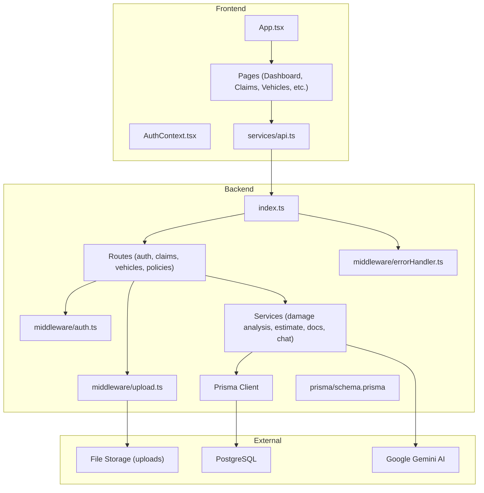
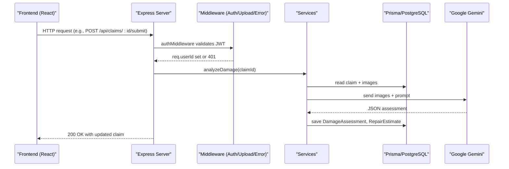
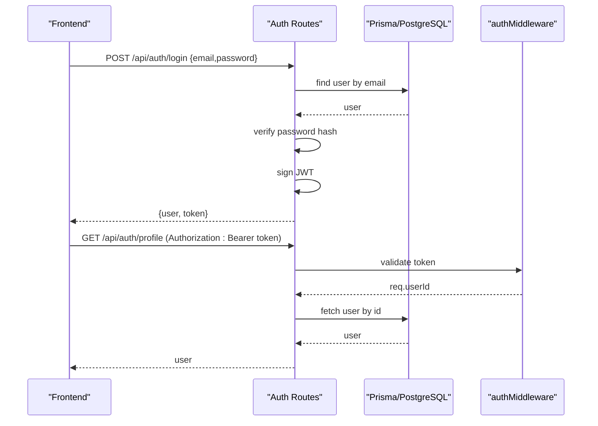
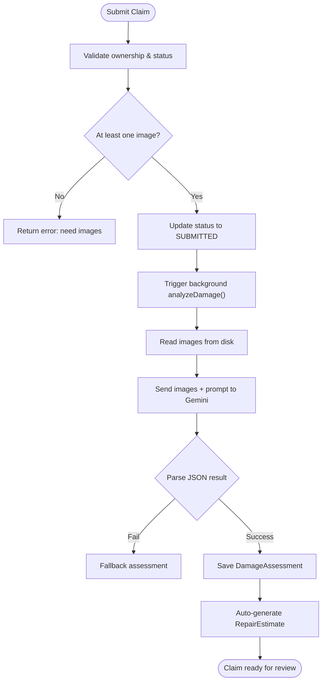
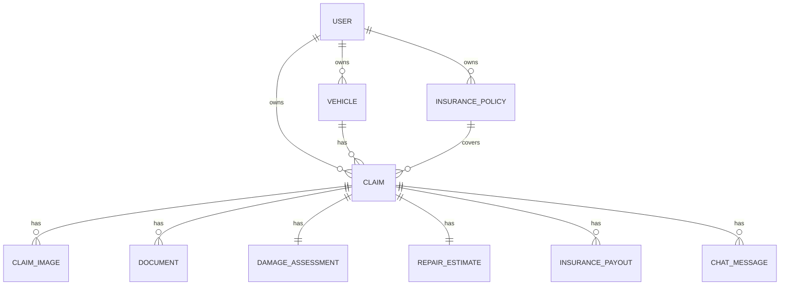
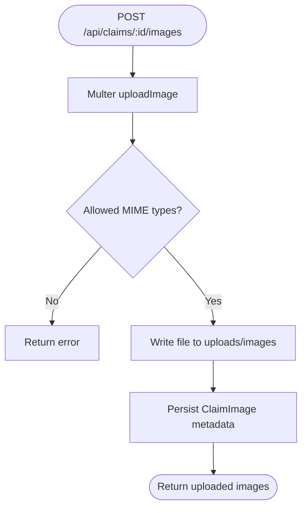
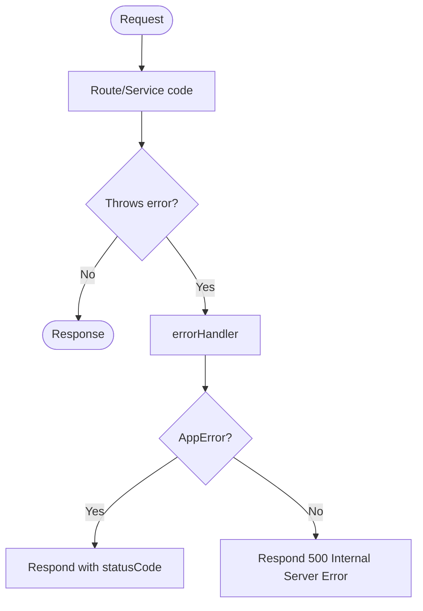
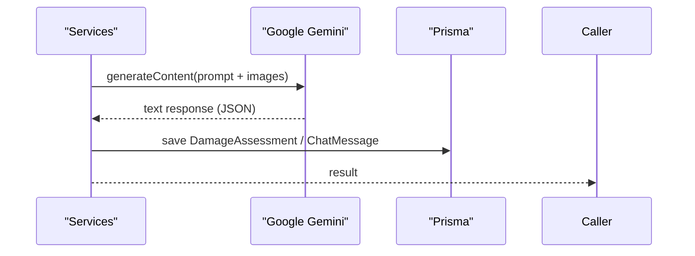
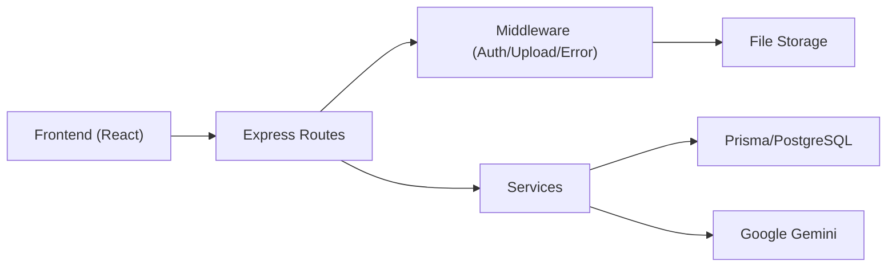

# System Architecture

<cite>
**Referenced Files in This Document**
- [index.ts](file://backend/src/index.ts)
- [schema.prisma](file://backend/prisma/schema.prisma)
- [auth.ts](file://backend/src/routes/auth.ts)
- [claims.ts](file://backend/src/routes/claims.ts)
- [auth.ts](file://backend/src/middleware/auth.ts)
- [errorHandler.ts](file://backend/src/middleware/errorHandler.ts)
- [upload.ts](file://backend/src/middleware/upload.ts)
- [gemini.ts](file://backend/src/utils/gemini.ts)
- [damageAnalysisService.ts](file://backend/src/services/damageAnalysisService.ts)
- [claimAssistantService.ts](file://backend/src/services/claimAssistantService.ts)
- [api.ts](file://frontend/src/services/api.ts)
- [App.tsx](file://frontend/src/App.tsx)
- [AuthContext.tsx](file://frontend/src/context/AuthContext.tsx)
- [ProtectedRoute.tsx](file://frontend/src/components/ProtectedRoute.tsx)
- [index.ts](file://frontend/src/types/index.ts)
</cite>

## Table of Contents
1. Introduction
2. Project Structure
3. Core Components
4. Architecture Overview
5. Detailed Component Analysis
6. Dependency Analysis
7. Performance Considerations
8. Troubleshooting Guide
9. Conclusion

## Introduction
This document describes the architecture of the Smart Vehicle Insurance Claim System, a full-stack application with a React frontend and an Express backend. The system follows a layered architecture:
- Presentation layer: React pages and routing
- API layer: Express routes for authentication, vehicles, policies, and claims
- Business logic layer: Service modules for AI-powered damage analysis, repair estimates, document verification, and claim assistant chat
- Data access layer: Prisma ORM over PostgreSQL

It also documents how the frontend communicates with the backend via Axios, the JWT-based authentication flow, protected routes, database schema relationships, integration points with Google Gemini AI, file storage handling, and cross-cutting concerns such as error handling middleware.

## Project Structure
The repository is organized into two main parts:
- Backend (Express + TypeScript):
  - Entry point and route registration
  - Middleware for authentication, uploads, and error handling
  - Services for AI-driven features
  - Prisma schema defining entities and relationships
- Frontend (React + TypeScript):
  - Routing and protected routes
  - Authentication context and Axios service configuration
  - Pages for dashboard, vehicles, policies, claims, and profile

**Diagram sources**
- [index.ts:1-47](file://backend/src/index.ts#L1-L47)
- [schema.prisma:1-201](file://backend/prisma/schema.prisma#L1-L201)
- [auth.ts:1-166](file://backend/src/routes/auth.ts#L1-L166)
- [claims.ts:1-450](file://backend/src/routes/claims.ts#L1-L450)
- [auth.ts:1-23](file://backend/src/middleware/auth.ts#L1-L23)
- [upload.ts:1-54](file://backend/src/middleware/upload.ts#L1-L54)
- [errorHandler.ts:1-28](file://backend/src/middleware/errorHandler.ts#L1-L28)
- [gemini.ts:1-13](file://backend/src/utils/gemini.ts#L1-L13)
- [damageAnalysisService.ts:1-154](file://backend/src/services/damageAnalysisService.ts#L1-L154)
- [claimAssistantService.ts:1-130](file://backend/src/services/claimAssistantService.ts#L1-L130)
- [api.ts:1-33](file://frontend/src/services/api.ts#L1-L33)
- [App.tsx:1-39](file://frontend/src/App.tsx#L1-L39)
- [AuthContext.tsx:1-82](file://frontend/src/context/AuthContext.tsx#L1-L82)

**Section sources**
- [index.ts:1-47](file://backend/src/index.ts#L1-L47)
- [App.tsx:1-39](file://frontend/src/App.tsx#L1-L39)

## Core Components
- Express server setup with CORS, JSON parsing, static upload serving, and route mounting
- Authentication routes for register/login/profile with JWT issuance and validation
- Claims routes for CRUD, image/document uploads, submission, AI analysis triggers, estimate generation, and chat
- Protected routes on the frontend using React Router and an auth context
- Axios service that attaches Bearer tokens and handles 401 redirects
- Prisma schema modeling users, vehicles, policies, claims, images, assessments, estimates, payouts, documents, and chat messages
- Services integrating with Google Gemini for damage analysis and claim assistant chat
- Upload middleware for secure file handling and storage
- Centralized error handler middleware

**Section sources**
- [index.ts:1-47](file://backend/src/index.ts#L1-L47)
- [auth.ts:1-166](file://backend/src/routes/auth.ts#L1-L166)
- [claims.ts:1-450](file://backend/src/routes/claims.ts#L1-L450)
- [auth.ts:1-23](file://backend/src/middleware/auth.ts#L1-L23)
- [upload.ts:1-54](file://backend/src/middleware/upload.ts#L1-L54)
- [errorHandler.ts:1-28](file://backend/src/middleware/errorHandler.ts#L1-L28)
- [schema.prisma:1-201](file://backend/prisma/schema.prisma#L1-L201)
- [api.ts:1-33](file://frontend/src/services/api.ts#L1-L33)
- [AuthContext.tsx:1-82](file://frontend/src/context/AuthContext.tsx#L1-L82)
- [ProtectedRoute.tsx:1-21](file://frontend/src/components/ProtectedRoute.tsx#L1-L21)

## Architecture Overview
The system uses a layered architecture with clear separation of concerns:
- Presentation Layer (React):
  - Routes defined in App.tsx wrap protected routes with Layout components
  - AuthContext manages user state and token persistence
  - Axios service configures base URL and interceptors for auth headers and 401 handling
- API Layer (Express):
  - index.ts mounts routes under /api/auth, /api/vehicles, /api/policies, /api/claims
  - Route handlers validate input, enforce ownership, and delegate to services
- Business Logic Layer (Services):
  - Damage analysis, repair estimates, document verification, and claim assistant chat
  - Integration with Google Gemini for AI capabilities
- Data Access Layer (Prisma):
  - Strongly typed queries and mutations against PostgreSQL
  - Relationships enforced by schema constraints

**Diagram sources**
- [claims.ts:152-193](file://backend/src/routes/claims.ts#L152-L193)
- [damageAnalysisService.ts:50-154](file://backend/src/services/damageAnalysisService.ts#L50-L154)
- [auth.ts:1-23](file://backend/src/middleware/auth.ts#L1-L23)
- [index.ts:28-32](file://backend/src/index.ts#L28-L32)

## Detailed Component Analysis

### Authentication Flow and Protected Routes
- Frontend:
  - Login registers credentials via Axios; stores token and user in localStorage
  - On app init, verifies token by fetching profile; clears invalid sessions
  - ProtectedRoute guards routes and redirects unauthenticated users
- Backend:
  - Register/Login create/update user, hash passwords, issue JWT
  - Profile endpoints require valid JWT via authMiddleware
  - 401 responses handled by Axios interceptor to redirect to login

**Diagram sources**
- [AuthContext.tsx:22-66](file://frontend/src/context/AuthContext.tsx#L22-L66)
- [api.ts:10-30](file://frontend/src/services/api.ts#L10-L30)
- [auth.ts:10-104](file://backend/src/routes/auth.ts#L10-L104)
- [auth.ts:106-132](file://backend/src/routes/auth.ts#L106-L132)
- [auth.ts:1-23](file://backend/src/middleware/auth.ts#L1-L23)

**Section sources**
- [AuthContext.tsx:1-82](file://frontend/src/context/AuthContext.tsx#L1-L82)
- [api.ts:1-33](file://frontend/src/services/api.ts#L1-L33)
- [ProtectedRoute.tsx:1-21](file://frontend/src/components/ProtectedRoute.tsx#L1-L21)
- [auth.ts:10-104](file://backend/src/routes/auth.ts#L10-L104)
- [auth.ts:106-132](file://backend/src/routes/auth.ts#L106-L132)
- [auth.ts:1-23](file://backend/src/middleware/auth.ts#L1-L23)

### Claims Processing and AI Analysis
- Submission:
  - Validates ownership and status transitions; enforces at least one image before submit
  - Updates status to SUBMITTED and triggers background AI damage analysis
- Image Upload:
  - Multer middleware validates types and size; stores files under uploads/images
  - Records metadata in ClaimImage with type and optional label
- AI Damage Analysis:
  - Reads claim images from disk, encodes to base64, sends to Gemini with structured prompt
  - Parses JSON response; saves DamageAssessment and auto-generates RepairEstimate
  - Updates per-image AI annotations
- Estimate Generation:
  - Requires prior damage assessment; computes costs and estimated days
- Chat Assistant:
  - Builds rich context from claim data and recent messages
  - Uses Gemini chat history to provide contextual guidance
  - Persists USER and ASSISTANT messages

**Diagram sources**
- [claims.ts:152-193](file://backend/src/routes/claims.ts#L152-L193)
- [claims.ts:195-233](file://backend/src/routes/claims.ts#L195-L233)
- [damageAnalysisService.ts:50-154](file://backend/src/services/damageAnalysisService.ts#L50-L154)
- [upload.ts:17-54](file://backend/src/middleware/upload.ts#L17-L54)

**Section sources**
- [claims.ts:20-57](file://backend/src/routes/claims.ts#L20-L57)
- [claims.ts:152-193](file://backend/src/routes/claims.ts#L152-L193)
- [claims.ts:195-233](file://backend/src/routes/claims.ts#L195-L233)
- [claims.ts:270-314](file://backend/src/routes/claims.ts#L270-L314)
- [damageAnalysisService.ts:50-154](file://backend/src/services/damageAnalysisService.ts#L50-L154)
- [claimAssistantService.ts:19-130](file://backend/src/services/claimAssistantService.ts#L19-L130)

### Database Schema and Entity Relationships
Key entities and relationships:
- User owns Vehicles, Policies, and Claims
- Vehicle belongs to User and has many Claims and Images
- Policy belongs to User and can be linked to Claims
- Claim belongs to User and Vehicle; optionally links to Policy
- Claim has many ClaimImages and Documents; one DamageAssessment and RepairEstimate; optional InsurancePayout; many ChatMessages
- Enums define statuses and types across the domain

**Diagram sources**
- [schema.prisma:10-201](file://backend/prisma/schema.prisma#L10-L201)

**Section sources**
- [schema.prisma:10-201](file://backend/prisma/schema.prisma#L10-L201)

### File Upload Processing and Storage
- Multer middleware ensures directories exist and applies file filters and size limits
- Images stored under uploads/images; documents under uploads/documents
- Paths recorded in database; static serving enabled for /uploads
- Deletion removes both DB record and physical file

**Diagram sources**
- [upload.ts:17-54](file://backend/src/middleware/upload.ts#L17-L54)
- [claims.ts:195-233](file://backend/src/routes/claims.ts#L195-L233)
- [index.ts:24-26](file://backend/src/index.ts#L24-L26)

**Section sources**
- [upload.ts:1-54](file://backend/src/middleware/upload.ts#L1-L54)
- [claims.ts:195-233](file://backend/src/routes/claims.ts#L195-L233)
- [index.ts:24-26](file://backend/src/index.ts#L24-L26)

### Error Handling Middleware
- Global errorHandler catches errors and returns standardized JSON
- Custom AppError allows explicit status codes
- Unhandled exceptions return 500 with generic message

**Diagram sources**
- [errorHandler.ts:1-28](file://backend/src/middleware/errorHandler.ts#L1-L28)

**Section sources**
- [errorHandler.ts:1-28](file://backend/src/middleware/errorHandler.ts#L1-L28)

### Security Implementations
- JWT-based authentication with secret from environment
- Passwords hashed with bcrypt before storage
- Authorization enforced via authMiddleware on protected routes
- Input validation in route handlers (required fields, status checks)
- CORS configured for frontend origin
- File upload restrictions by MIME type and size

**Section sources**
- [auth.ts:1-23](file://backend/src/middleware/auth.ts#L1-L23)
- [auth.ts:10-104](file://backend/src/routes/auth.ts#L10-L104)
- [upload.ts:30-41](file://backend/src/middleware/upload.ts#L30-L41)
- [index.ts:17-22](file://backend/src/index.ts#L17-L22)

### Integration Points with Google Gemini AI
- gemini utility initializes GoogleGenerativeAI with API key
- damageAnalysisService sends images and structured prompt to model, parses JSON output
- claimAssistantService builds conversation context and persists chat history

**Diagram sources**
- [gemini.ts:1-13](file://backend/src/utils/gemini.ts#L1-L13)
- [damageAnalysisService.ts:64-103](file://backend/src/services/damageAnalysisService.ts#L64-L103)
- [claimAssistantService.ts:94-128](file://backend/src/services/claimAssistantService.ts#L94-L128)

**Section sources**
- [gemini.ts:1-13](file://backend/src/utils/gemini.ts#L1-L13)
- [damageAnalysisService.ts:50-154](file://backend/src/services/damageAnalysisService.ts#L50-L154)
- [claimAssistantService.ts:19-130](file://backend/src/services/claimAssistantService.ts#L19-L130)

## Dependency Analysis
- Frontend depends on:
  - React Router for navigation and protected routes
  - Axios for HTTP requests with interceptors
  - Context for auth state management
- Backend depends on:
  - Express for routing and middleware
  - Prisma for database access
  - Multer for file uploads
  - jsonwebtoken and bcryptjs for auth
  - Google Generative AI for AI features
- Coupling:
  - Routes depend on services for business logic
  - Services depend on Prisma and external AI APIs
  - Middleware is reusable across routes

**Diagram sources**
- [index.ts:1-47](file://backend/src/index.ts#L1-L47)
- [claims.ts:1-450](file://backend/src/routes/claims.ts#L1-L450)
- [auth.ts:1-23](file://backend/src/middleware/auth.ts#L1-L23)
- [upload.ts:1-54](file://backend/src/middleware/upload.ts#L1-L54)
- [errorHandler.ts:1-28](file://backend/src/middleware/errorHandler.ts#L1-L28)
- [damageAnalysisService.ts:1-154](file://backend/src/services/damageAnalysisService.ts#L1-L154)
- [claimAssistantService.ts:1-130](file://backend/src/services/claimAssistantService.ts#L1-L130)
- [api.ts:1-33](file://frontend/src/services/api.ts#L1-L33)

**Section sources**
- [index.ts:1-47](file://backend/src/index.ts#L1-L47)
- [claims.ts:1-450](file://backend/src/routes/claims.ts#L1-L450)
- [api.ts:1-33](file://frontend/src/services/api.ts#L1-L33)

## Performance Considerations
- Use background processing for long-running tasks like AI damage analysis to avoid blocking request-response cycles
- Limit payload sizes for JSON parsing and file uploads to prevent memory pressure
- Index frequently queried fields in the database (e.g., userId, claimId) to optimize lookups
- Cache AI responses where appropriate to reduce latency and cost
- Stream large files when possible and consider object storage for scalability

[No sources needed since this section provides general guidance]

## Troubleshooting Guide
- Authentication failures:
  - Ensure JWT_SECRET is set and tokens are present in Authorization header
  - Check 401 handling in Axios interceptor and redirection behavior
- Upload issues:
  - Verify allowed MIME types and file size limits
  - Confirm uploads directory exists and is writable
- AI analysis errors:
  - Validate Gemini API key and network connectivity
  - Inspect raw AI response if JSON parsing fails; fallback logic is in place
- Database errors:
  - Check DATABASE_URL and connection pool settings
  - Review Prisma migrations and schema consistency

**Section sources**
- [api.ts:19-30](file://frontend/src/services/api.ts#L19-L30)
- [auth.ts:1-23](file://backend/src/middleware/auth.ts#L1-L23)
- [upload.ts:30-41](file://backend/src/middleware/upload.ts#L30-L41)
- [damageAnalysisService.ts:85-103](file://backend/src/services/damageAnalysisService.ts#L85-L103)
- [errorHandler.ts:13-27](file://backend/src/middleware/errorHandler.ts#L13-L27)

## Conclusion
The Smart Vehicle Insurance Claim System implements a robust, layered architecture with clear separation between presentation, API, business logic, and data access layers. It leverages JWT-based authentication, protected routes, and centralized error handling. AI capabilities powered by Google Gemini enhance claim processing through automated damage analysis and intelligent assistance. The Prisma schema defines comprehensive entity relationships supporting end-to-end claim workflows. Proper file upload handling and security measures ensure safe and reliable operations.

[No sources needed since this section summarizes without analyzing specific files]