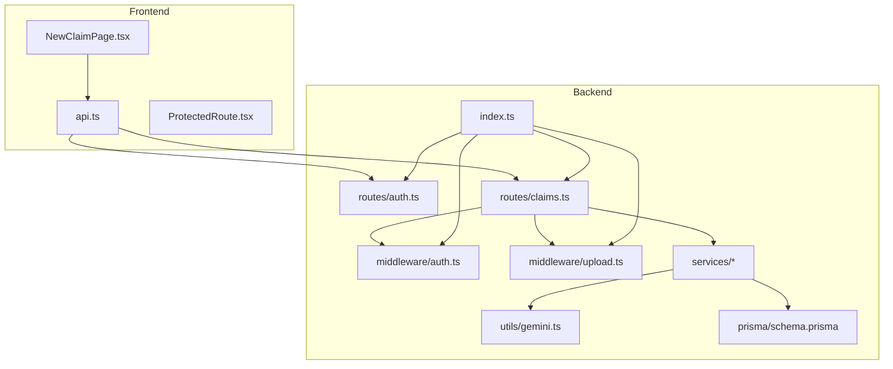
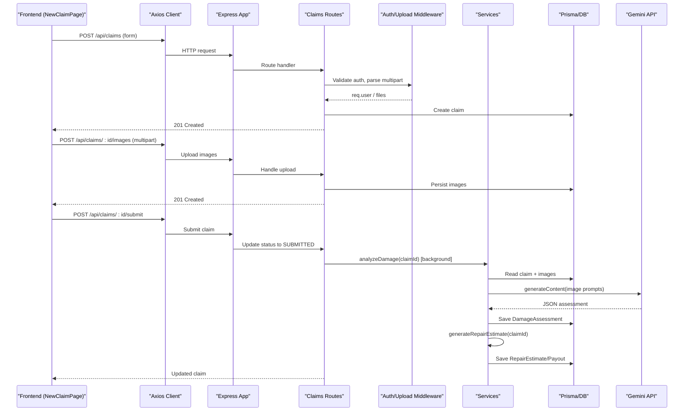
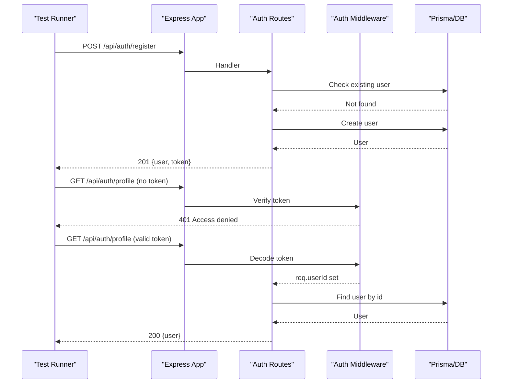
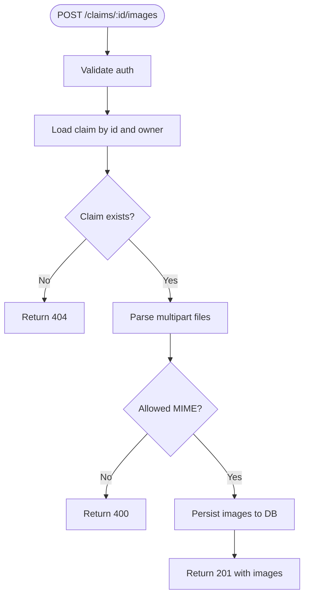
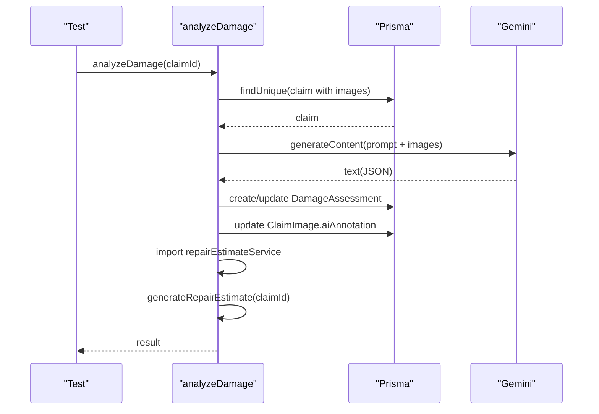
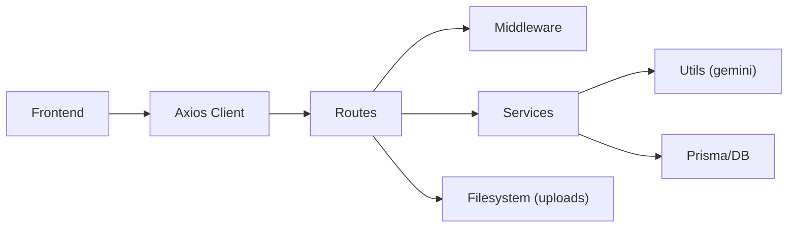

# Testing Strategy

<cite>
**Referenced Files in This Document**
- [backend/src/index.ts](file://backend/src/index.ts)
- [backend/src/routes/auth.ts](file://backend/src/routes/auth.ts)
- [backend/src/routes/claims.ts](file://backend/src/routes/claims.ts)
- [backend/src/middleware/auth.ts](file://backend/src/middleware/auth.ts)
- [backend/src/middleware/upload.ts](file://backend/src/middleware/upload.ts)
- [backend/src/services/damageAnalysisService.ts](file://backend/src/services/damageAnalysisService.ts)
- [backend/src/services/documentVerificationService.ts](file://backend/src/services/documentVerificationService.ts)
- [backend/src/services/repairEstimateService.ts](file://backend/src/services/repairEstimateService.ts)
- [backend/src/services/claimAssistantService.ts](file://backend/src/services/claimAssistantService.ts)
- [backend/src/utils/gemini.ts](file://backend/src/utils/gemini.ts)
- [backend/prisma/schema.prisma](file://backend/prisma/schema.prisma)
- [frontend/src/services/api.ts](file://frontend/src/services/api.ts)
- [frontend/src/pages/NewClaimPage.tsx](file://frontend/src/pages/NewClaimPage.tsx)
- [frontend/src/components/ProtectedRoute.tsx](file://frontend/src/components/ProtectedRoute.tsx)
</cite>

## Table of Contents
1. Introduction
2. Project Structure
3. Core Components
4. Architecture Overview
5. Detailed Component Analysis
6. Dependency Analysis
7. Performance Considerations
8. Troubleshooting Guide
9. Conclusion
10. Appendices

## Introduction
This document defines a comprehensive testing strategy for the Smart Vehicle Insurance Claim System across unit, integration, and end-to-end layers. It covers strategies for individual components, services, API endpoints, database interactions, external AI integrations, file uploads, authentication flows, and administrative functions. It also includes mocking approaches, test data management, code coverage targets, and continuous integration guidance tailored to this codebase.

## Project Structure
The system consists of:
- Backend (Express + TypeScript): routes, middleware, services, Prisma schema, utilities
- Frontend (React + Vite): pages, services, protected routing

**Diagram sources**
- [backend/src/index.ts:1-49](file://backend/src/index.ts#L1-L49)
- [backend/src/routes/auth.ts:1-168](file://backend/src/routes/auth.ts#L1-L168)
- [backend/src/routes/claims.ts:1-450](file://backend/src/routes/claims.ts#L1-L450)
- [backend/src/middleware/auth.ts:1-23](file://backend/src/middleware/auth.ts#L1-L23)
- [backend/src/middleware/upload.ts:1-54](file://backend/src/middleware/upload.ts#L1-L54)
- [backend/src/services/damageAnalysisService.ts:1-154](file://backend/src/services/damageAnalysisService.ts#L1-L154)
- [backend/src/services/documentVerificationService.ts:1-107](file://backend/src/services/documentVerificationService.ts#L1-L107)
- [backend/src/services/repairEstimateService.ts:1-199](file://backend/src/services/repairEstimateService.ts#L1-L199)
- [backend/src/services/claimAssistantService.ts:1-130](file://backend/src/services/claimAssistantService.ts#L1-L130)
- [backend/src/utils/gemini.ts:1-12](file://backend/src/utils/gemini.ts#L1-L12)
- [backend/prisma/schema.prisma:1-202](file://backend/prisma/schema.prisma#L1-L202)
- [frontend/src/pages/NewClaimPage.tsx:1-252](file://frontend/src/pages/NewClaimPage.tsx#L1-L252)
- [frontend/src/services/api.ts:1-36](file://frontend/src/services/api.ts#L1-L36)
- [frontend/src/components/ProtectedRoute.tsx:1-21](file://frontend/src/components/ProtectedRoute.tsx#L1-L21)

**Section sources**
- [backend/src/index.ts:1-49](file://backend/src/index.ts#L1-L49)
- [backend/prisma/schema.prisma:1-202](file://backend/prisma/schema.prisma#L1-L202)

## Core Components
Key backend components that require testing:
- Authentication routes and JWT middleware
- Claims routes with file upload, status transitions, and AI-driven analysis
- Services for damage analysis, document verification, repair estimates, and claim assistant chat
- Utilities for Gemini model access
- Prisma-based data layer

Frontend components:
- New claim submission flow with drag-and-drop image uploads
- Protected route enforcing authentication
- Axios client with auth token injection and 401 handling

Testing focus areas:
- Unit tests for pure logic (e.g., repair estimate calculations)
- Service tests with mocked Prisma and Gemini
- Route/integration tests with an in-memory or test DB
- E2E tests for critical user journeys (submit claim, approve/reject as admin)

**Section sources**
- [backend/src/routes/auth.ts:1-168](file://backend/src/routes/auth.ts#L1-L168)
- [backend/src/routes/claims.ts:1-450](file://backend/src/routes/claims.ts#L1-L450)
- [backend/src/middleware/auth.ts:1-23](file://backend/src/middleware/auth.ts#L1-L23)
- [backend/src/middleware/upload.ts:1-54](file://backend/src/middleware/upload.ts#L1-L54)
- [backend/src/services/repairEstimateService.ts:1-199](file://backend/src/services/repairEstimateService.ts#L1-L199)
- [backend/src/services/damageAnalysisService.ts:1-154](file://backend/src/services/damageAnalysisService.ts#L1-L154)
- [backend/src/services/documentVerificationService.ts:1-107](file://backend/src/services/documentVerificationService.ts#L1-L107)
- [backend/src/services/claimAssistantService.ts:1-130](file://backend/src/services/claimAssistantService.ts#L1-L130)
- [backend/src/utils/gemini.ts:1-12](file://backend/src/utils/gemini.ts#L1-L12)
- [frontend/src/pages/NewClaimPage.tsx:1-252](file://frontend/src/pages/NewClaimPage.tsx#L1-L252)
- [frontend/src/services/api.ts:1-36](file://frontend/src/services/api.ts#L1-L36)
- [frontend/src/components/ProtectedRoute.tsx:1-21](file://frontend/src/components/ProtectedRoute.tsx#L1-L21)

## Architecture Overview
High-level request flow from frontend to backend and into services:

**Diagram sources**
- [frontend/src/pages/NewClaimPage.tsx:62-94](file://frontend/src/pages/NewClaimPage.tsx#L62-L94)
- [backend/src/routes/claims.ts:21-193](file://backend/src/routes/claims.ts#L21-L193)
- [backend/src/services/damageAnalysisService.ts:50-152](file://backend/src/services/damageAnalysisService.ts#L50-L152)
- [backend/src/services/repairEstimateService.ts:104-199](file://backend/src/services/repairEstimateService.ts#L104-L199)
- [backend/src/utils/gemini.ts:6-9](file://backend/src/utils/gemini.ts#L6-L9)

## Detailed Component Analysis

### Authentication Flow Tests
Scope:
- Register, login, profile read/update
- JWT middleware validation
- Error cases: missing fields, duplicate email, invalid credentials, expired token

Strategy:
- Use an HTTP test client to call Express app directly
- Seed users via Prisma test fixtures
- Mock JWT secret via environment variables
- Assert status codes and response shapes

Example scenarios:
- Successful registration returns user and token
- Duplicate email returns conflict
- Login with wrong password returns unauthorized
- Profile GET requires valid bearer token
- Profile PUT updates only provided fields

**Diagram sources**
- [backend/src/routes/auth.ts:10-168](file://backend/src/routes/auth.ts#L10-L168)
- [backend/src/middleware/auth.ts:5-22](file://backend/src/middleware/auth.ts#L5-L22)

**Section sources**
- [backend/src/routes/auth.ts:10-168](file://backend/src/routes/auth.ts#L10-L168)
- [backend/src/middleware/auth.ts:5-22](file://backend/src/middleware/auth.ts#L5-L22)

### File Uploads and Image Handling Tests
Scope:
- Image upload endpoint with multer
- Document upload endpoint
- Validation of allowed MIME types and size limits
- Persistence of file paths and metadata

Strategy:
- Use multipart form data in tests
- Provide sample image buffers
- Assert created records and returned paths
- Test error cases: no files, unsupported type, oversized file

**Diagram sources**
- [backend/src/routes/claims.ts:195-233](file://backend/src/routes/claims.ts#L195-L233)
- [backend/src/middleware/upload.ts:17-54](file://backend/src/middleware/upload.ts#L17-L54)

**Section sources**
- [backend/src/routes/claims.ts:195-233](file://backend/src/routes/claims.ts#L195-L233)
- [backend/src/middleware/upload.ts:17-54](file://backend/src/middleware/upload.ts#L17-L54)

### Damage Analysis Service Tests
Scope:
- Reading claim and images
- Calling Gemini with inline images
- Parsing JSON responses
- Saving DamageAssessment and updating image annotations
- Auto-triggering repair estimate generation

Strategy:
- Mock Prisma methods to return controlled claims and images
- Mock getGeminiModel to return deterministic responses
- Assert DB writes and side effects
- Cover fallback path when parsing fails

**Diagram sources**
- [backend/src/services/damageAnalysisService.ts:50-152](file://backend/src/services/damageAnalysisService.ts#L50-L152)
- [backend/src/utils/gemini.ts:6-9](file://backend/src/utils/gemini.ts#L6-L9)

**Section sources**
- [backend/src/services/damageAnalysisService.ts:50-152](file://backend/src/services/damageAnalysisService.ts#L50-L152)

### Document Verification Service Tests
Scope:
- Loading document and related context
- Invoking Gemini for OCR-like verification
- Parsing results and persisting verification status
- Handling unreadable or malformed responses

Strategy:
- Mock filesystem reads for document images
- Mock Gemini responses for various outcomes
- Assert verificationStatus and verificationResult updates

**Section sources**
- [backend/src/services/documentVerificationService.ts:41-106](file://backend/src/services/documentVerificationService.ts#L41-L106)

### Repair Estimate Service Tests
Scope:
- Deterministic cost calculations based on damage items and severity
- Aggregation of parts/labor costs and paint materials
- Creation/update of RepairEstimate and optional InsurancePayout

Strategy:
- Pure function tests for item calculation helpers
- Integration-style tests with mocked Prisma to verify totals and persistence
- Edge cases: no policy, severe vs minor damages

**Section sources**
- [backend/src/services/repairEstimateService.ts:60-102](file://backend/src/services/repairEstimateService.ts#L60-L102)
- [backend/src/services/repairEstimateService.ts:104-199](file://backend/src/services/repairEstimateService.ts#L104-L199)

### Claim Assistant Chat Tests
Scope:
- Building context from claim data
- Maintaining conversation history
- Persisting user and assistant messages
- Returning structured response

Strategy:
- Mock Prisma to provide claim context and messages
- Mock Gemini chat start/send to return fixed responses
- Assert message persistence and response shape

**Section sources**
- [backend/src/services/claimAssistantService.ts:19-129](file://backend/src/services/claimAssistantService.ts#L19-L129)

### Claims Endpoints Integration Tests
Scope:
- Create, list, get, update, submit, analyze, estimate, documents CRUD, chat
- Authorization enforcement
- Status transitions and business rules (e.g., only draft editable)

Strategy:
- Spin up Express app with test DB (SQLite in-memory or separate test DB)
- Seed minimal data via Prisma
- Use HTTP client to exercise endpoints
- Assert DB state changes and responses

**Section sources**
- [backend/src/routes/claims.ts:21-447](file://backend/src/routes/claims.ts#L21-L447)

### Frontend Tests
Scope:
- New claim page workflow: form validation, image dropzones, API calls
- Protected route behavior
- Axios interceptor behavior (auth header, 401 redirect)

Strategy:
- Use React Testing Library for component tests
- Mock axios calls for API interactions
- Simulate dropzone uploads with File objects
- Test navigation and redirects under unauthenticated state

**Section sources**
- [frontend/src/pages/NewClaimPage.tsx:62-94](file://frontend/src/pages/NewClaimPage.tsx#L62-L94)
- [frontend/src/services/api.ts:1-36](file://frontend/src/services/api.ts#L1-L36)
- [frontend/src/components/ProtectedRoute.tsx:4-20](file://frontend/src/components/ProtectedRoute.tsx#L4-L20)

## Dependency Analysis
Key dependencies and their test implications:
- Express routes depend on Prisma client and JWT middleware; mock DB and tokens in tests
- Services depend on Gemini API; mock model methods to avoid network calls
- Multer handles file uploads; supply multipart payloads in tests
- Frontend depends on axios; interceptors must be considered in UI tests

**Diagram sources**
- [backend/src/routes/claims.ts:1-450](file://backend/src/routes/claims.ts#L1-L450)
- [backend/src/middleware/auth.ts:1-23](file://backend/src/middleware/auth.ts#L1-L23)
- [backend/src/services/damageAnalysisService.ts:1-154](file://backend/src/services/damageAnalysisService.ts#L1-L154)
- [backend/src/utils/gemini.ts:1-12](file://backend/src/utils/gemini.ts#L1-L12)
- [frontend/src/services/api.ts:1-36](file://frontend/src/services/api.ts#L1-L36)

**Section sources**
- [backend/src/routes/claims.ts:1-450](file://backend/src/routes/claims.ts#L1-L450)
- [backend/src/middleware/auth.ts:1-23](file://backend/src/middleware/auth.ts#L1-L23)
- [backend/src/services/damageAnalysisService.ts:1-154](file://backend/src/services/damageAnalysisService.ts#L1-L154)
- [backend/src/utils/gemini.ts:1-12](file://backend/src/utils/gemini.ts#L1-L12)
- [frontend/src/services/api.ts:1-36](file://frontend/src/services/api.ts#L1-L36)

## Performance Considerations
- Prefer in-memory SQLite or isolated test databases per test suite to reduce setup time
- Batch Prisma operations where possible to minimize round-trips
- Mock heavy I/O (Gemini API, filesystem reads) to keep unit tests fast
- For integration tests, limit seed data to minimal required entities
- Avoid real uploads in CI; use virtual files or mocks

[No sources needed since this section provides general guidance]

## Troubleshooting Guide
Common issues and how to address them in tests:
- Missing environment variables: ensure JWT_SECRET, DATABASE_URL, GEMINI_API_KEY are set in test env
- File not found errors: validate upload paths and existence checks; assert proper error responses
- Gemini parsing failures: cover fallback branches that produce safe defaults
- Token validation: test invalid/expired tokens and missing Authorization headers
- Database constraints: handle unique constraints (email, policy numbers) in fixture setup

**Section sources**
- [backend/src/middleware/auth.ts:5-22](file://backend/src/middleware/auth.ts#L5-L22)
- [backend/src/services/damageAnalysisService.ts:85-103](file://backend/src/services/damageAnalysisService.ts#L85-L103)
- [backend/src/services/documentVerificationService.ts:78-94](file://backend/src/services/documentVerificationService.ts#L78-L94)

## Conclusion
Adopt a layered testing approach:
- Unit tests for pure logic and service boundaries with mocked external dependencies
- Integration tests for routes and DB interactions using a test database
- E2E tests for critical user workflows like claim submission and admin approvals
- Consistent mocking of AI services and file I/O to ensure reliability and speed
- Enforce code coverage thresholds and integrate tests into CI pipelines

[No sources needed since this section summarizes without analyzing specific files]

## Appendices

### Unit Testing Strategies
- Services:
  - Mock Prisma client methods to control inputs and outputs
  - Mock getGeminiModel to return deterministic responses
  - Validate side effects (DB writes) by asserting mocked calls or querying test DB
- Utilities:
  - Test helper functions (e.g., midpoint, cost range) with boundary values
- Middleware:
  - Test auth middleware with valid/invalid tokens
  - Test upload middleware with allowed/disallowed MIME types

**Section sources**
- [backend/src/services/repairEstimateService.ts:60-102](file://backend/src/services/repairEstimateService.ts#L60-L102)
- [backend/src/middleware/auth.ts:5-22](file://backend/src/middleware/auth.ts#L5-L22)
- [backend/src/middleware/upload.ts:30-41](file://backend/src/middleware/upload.ts#L30-L41)

### Integration Testing Approaches
- API endpoints:
  - Use an HTTP client against the Express app instance
  - Seed data via Prisma before each test
  - Assert status codes, response bodies, and DB state changes
- Database interactions:
  - Use transactions or rollback strategies to isolate tests
  - Validate relationships defined in schema (User, Vehicle, Policy, Claim, etc.)
- External services:
  - Mock Gemini API responses for all service paths
  - Stub filesystem reads for document/image processing

**Section sources**
- [backend/src/routes/claims.ts:21-447](file://backend/src/routes/claims.ts#L21-L447)
- [backend/prisma/schema.prisma:10-202](file://backend/prisma/schema.prisma#L10-L202)

### End-to-End Testing Strategies
Critical user workflows:
- Claim submission:
  - Create user, log in, create vehicle/policy if needed
  - Submit claim with images and documents
  - Verify status transitions and AI analysis triggers
- Approval processes:
  - Admin actions to review and update claim status
  - Verify downstream effects (estimates, payouts)
- Administrative functions:
  - Manage users and view claims/documents

**Section sources**
- [frontend/src/pages/NewClaimPage.tsx:62-94](file://frontend/src/pages/NewClaimPage.tsx#L62-L94)
- [backend/src/routes/claims.ts:152-193](file://backend/src/routes/claims.ts#L152-L193)

### Mocking Strategies
- AI services:
  - Replace getGeminiModel with a stub returning predictable responses
  - Cover both success and failure parsing paths
- Database fixtures:
  - Use Prisma to seed minimal datasets per test
  - Leverage unique constraints to avoid collisions
- Test data management:
  - Centralize fixtures for users, vehicles, policies, claims
  - Clean up after tests or use transactional rollbacks

**Section sources**
- [backend/src/utils/gemini.ts:6-9](file://backend/src/utils/gemini.ts#L6-L9)
- [backend/prisma/schema.prisma:10-202](file://backend/prisma/schema.prisma#L10-L202)

### Code Coverage Requirements
- Aim for high branch coverage on services with conditional logic (damage analysis, document verification)
- Ensure all route handlers have positive and negative test cases
- Include coverage for error paths and fallback behaviors

[No sources needed since this section provides general guidance]

### Continuous Integration Setup
- Install dependencies and generate Prisma client
- Run linting and type checks
- Execute unit tests with mocked dependencies
- Run integration tests against a test database
- Collect and report coverage
- Fail pipeline on threshold breaches

[No sources needed since this section provides general guidance]

### Examples of Writing Tests

#### Authentication Flows
- Register:
  - Valid payload returns 201 with user and token
  - Duplicate email returns 409
- Login:
  - Correct credentials return 200 with user and token
  - Wrong password returns 401
- Profile:
  - GET without token returns 401
  - GET with valid token returns user details
  - PUT updates only provided fields

**Section sources**
- [backend/src/routes/auth.ts:10-168](file://backend/src/routes/auth.ts#L10-L168)
- [backend/src/middleware/auth.ts:5-22](file://backend/src/middleware/auth.ts#L5-L22)

#### File Uploads
- Images:
  - Upload multiple images with correct MIME types
  - Reject unsupported types and oversized files
  - Assert persisted records and paths
- Documents:
  - Upload single document with valid type
  - Validate document type enum values

**Section sources**
- [backend/src/routes/claims.ts:195-353](file://backend/src/routes/claims.ts#L195-L353)
- [backend/src/middleware/upload.ts:17-54](file://backend/src/middleware/upload.ts#L17-L54)

#### AI Service Interactions
- Damage analysis:
  - Mock Gemini to return valid JSON; assert DamageAssessment creation
  - Mock malformed response; assert fallback behavior
- Document verification:
  - Mock successful verification; assert status update
  - Mock unreadable document; assert UNREADABLE status
- Claim assistant:
  - Mock chat responses; assert message persistence

**Section sources**
- [backend/src/services/damageAnalysisService.ts:50-152](file://backend/src/services/damageAnalysisService.ts#L50-L152)
- [backend/src/services/documentVerificationService.ts:41-106](file://backend/src/services/documentVerificationService.ts#L41-L106)
- [backend/src/services/claimAssistantService.ts:19-129](file://backend/src/services/claimAssistantService.ts#L19-L129)