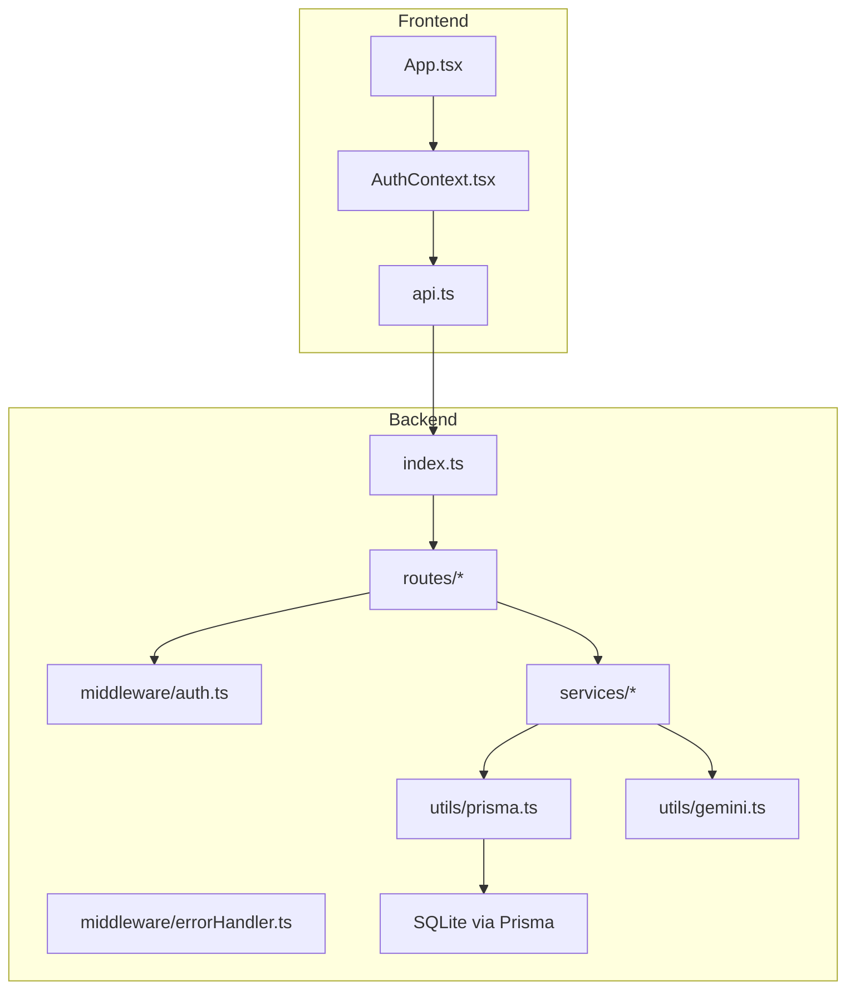
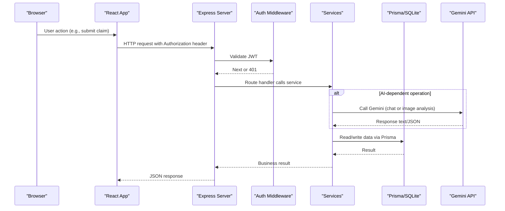
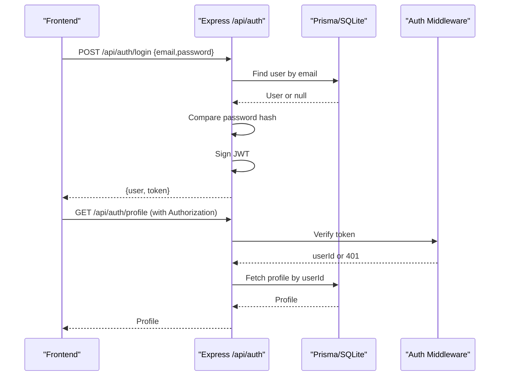
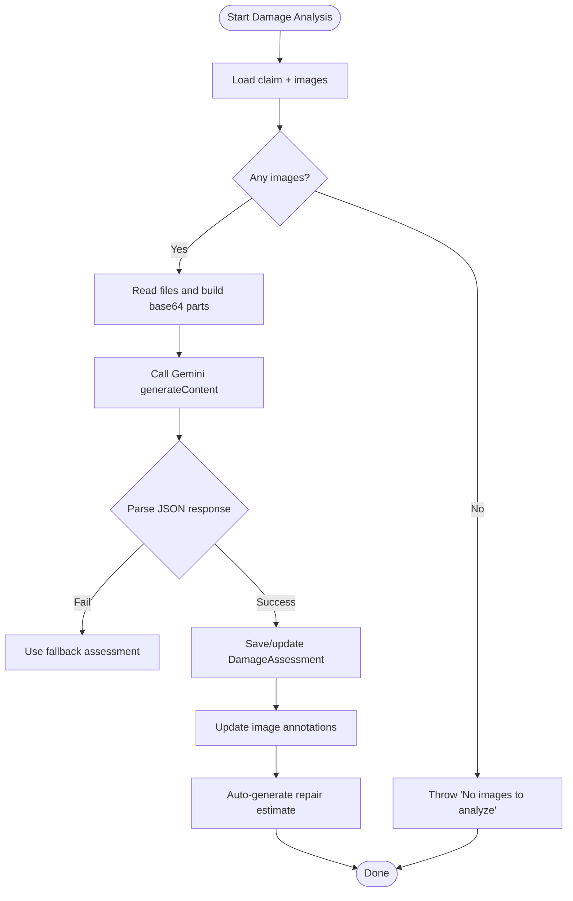
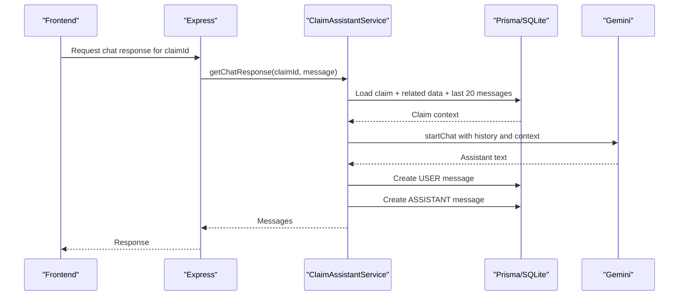
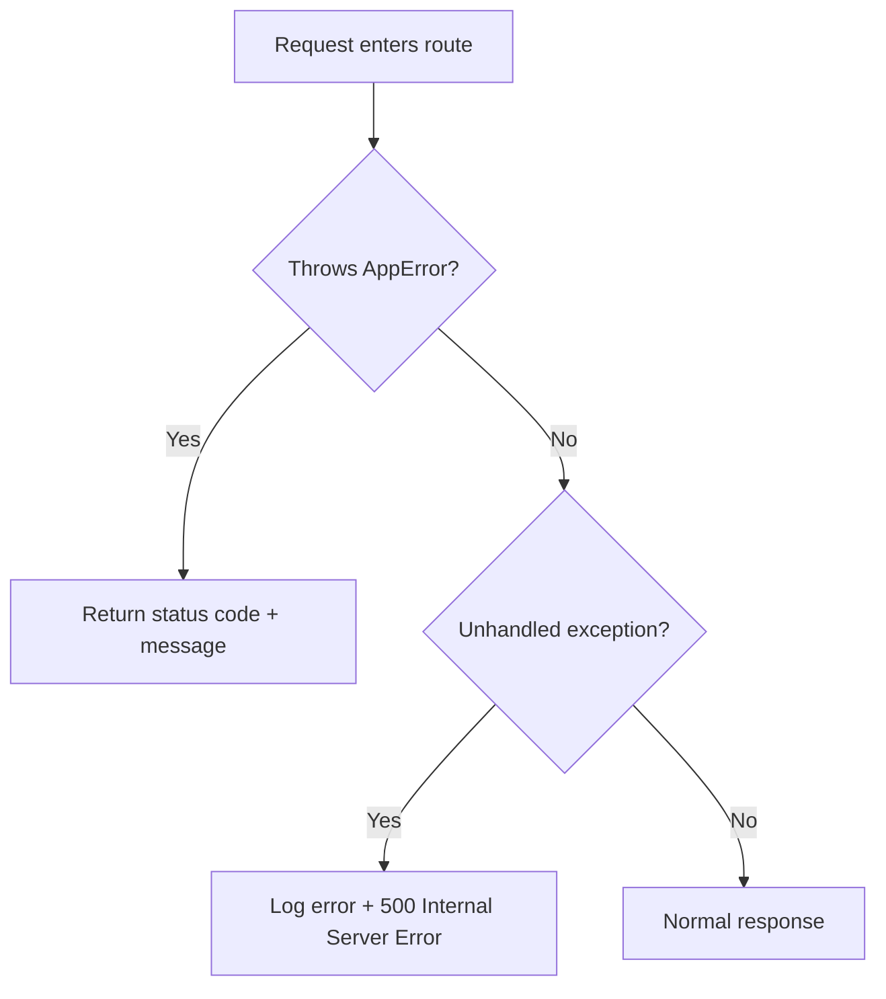
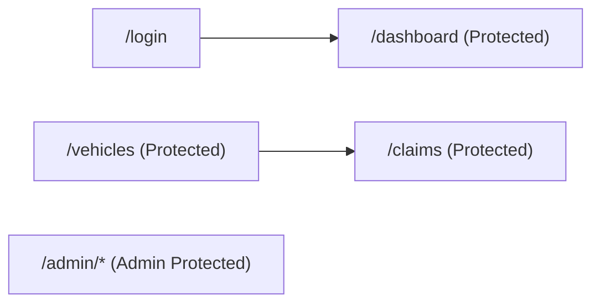
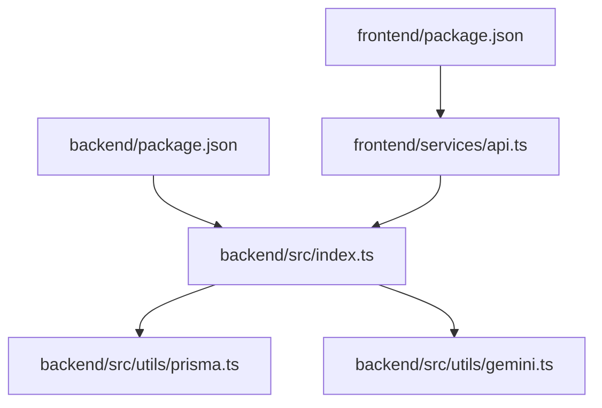

# Troubleshooting & FAQ

<cite>
**Referenced Files in This Document**
- [index.ts](file://backend/src/index.ts)
- [auth.ts](file://backend/src/middleware/auth.ts)
- [errorHandler.ts](file://backend/src/middleware/errorHandler.ts)
- [schema.prisma](file://backend/prisma/schema.prisma)
- [prisma.ts](file://backend/src/utils/prisma.ts)
- [gemini.ts](file://backend/src/utils/gemini.ts)
- [claimAssistantService.ts](file://backend/src/services/claimAssistantService.ts)
- [damageAnalysisService.ts](file://backend/src/services/damageAnalysisService.ts)
- [App.tsx](file://frontend/src/App.tsx)
- [AuthContext.tsx](file://frontend/src/context/AuthContext.tsx)
- [api.ts](file://frontend/src/services/api.ts)
- [package.json (frontend)](file://frontend/package.json)
- [package.json (backend)](file://backend/package.json)
</cite>

## Table of Contents
1. Introduction
2. Project Structure
3. Core Components
4. Architecture Overview
5. Detailed Component Analysis
6. Dependency Analysis
7. Performance Considerations
8. Troubleshooting Guide
9. Conclusion
10. Appendices

## Introduction
This document provides comprehensive troubleshooting and FAQ guidance for the Smart Vehicle Insurance Claim System across development, deployment, and production environments. It focuses on frequent issues such as authentication failures, database connectivity problems, AI service integration errors, slow queries, memory leaks, API response times, browser compatibility, mobile device issues, and network connectivity challenges. It includes diagnostic steps, log analysis techniques, debugging strategies for frontend and backend, error message interpretations, stack trace analysis, and resolution procedures.

## Project Structure
The system consists of:
- Backend: Express server with routes, middleware, services, Prisma ORM, and Gemini AI integration.
- Frontend: React application with routing, protected routes, auth context, and API client.

**Diagram sources**
- [index.ts:1-49](file://backend/src/index.ts#L1-L49)
- [App.tsx:1-56](file://frontend/src/App.tsx#L1-L56)
- [AuthContext.tsx:1-82](file://frontend/src/context/AuthContext.tsx#L1-L82)
- [api.ts:1-36](file://frontend/src/services/api.ts#L1-L36)
- [prisma.ts:1-6](file://backend/src/utils/prisma.ts#L1-L6)
- [gemini.ts:1-12](file://backend/src/utils/gemini.ts#L1-L12)

**Section sources**
- [index.ts:1-49](file://backend/src/index.ts#L1-L49)
- [App.tsx:1-56](file://frontend/src/App.tsx#L1-L56)

## Core Components
- Authentication flow: JWT-based login/register/profile endpoints with middleware validation.
- Data layer: Prisma client configured to a SQLite database defined by schema.
- AI integration: Gemini model used for claim assistant chat and damage analysis.
- Error handling: Centralized error handler with custom AppError class.
- Frontend auth state: Context manages token persistence and profile refresh.

Key responsibilities and interactions are mapped in the architecture overview below.

**Section sources**
- [auth.ts:1-23](file://backend/src/middleware/auth.ts#L1-L23)
- [errorHandler.ts:1-28](file://backend/src/middleware/errorHandler.ts#L1-L28)
- [schema.prisma:1-202](file://backend/prisma/schema.prisma#L1-L202)
- [prisma.ts:1-6](file://backend/src/utils/prisma.ts#L1-L6)
- [gemini.ts:1-12](file://backend/src/utils/gemini.ts#L1-L12)
- [AuthContext.tsx:1-82](file://frontend/src/context/AuthContext.tsx#L1-L82)

## Architecture Overview
End-to-end request flow from frontend to backend and external AI services:

**Diagram sources**
- [index.ts:17-42](file://backend/src/index.ts#L17-L42)
- [auth.ts:5-22](file://backend/src/middleware/auth.ts#L5-L22)
- [claimAssistantService.ts:19-129](file://backend/src/services/claimAssistantService.ts#L19-L129)
- [damageAnalysisService.ts:50-153](file://backend/src/services/damageAnalysisService.ts#L50-L153)
- [prisma.ts:1-6](file://backend/src/utils/prisma.ts#L1-L6)
- [gemini.ts:6-11](file://backend/src/utils/gemini.ts#L6-L11)

## Detailed Component Analysis

### Authentication Flow and Common Failures
- Login/Register: Creates or retrieves user, signs JWT, returns token to frontend.
- Protected routes: Middleware verifies Bearer token; invalid or missing tokens return 401.
- Frontend interceptors: Automatically attach token to requests; handle 401 by clearing storage and redirecting to login.

**Diagram sources**
- [auth.ts:10-105](file://backend/src/routes/auth.ts#L10-L105)
- [auth.ts:107-134](file://backend/src/routes/auth.ts#L107-L134)
- [auth.ts:136-165](file://backend/src/routes/auth.ts#L136-L165)
- [auth.ts:5-22](file://backend/src/middleware/auth.ts#L5-L22)
- [AuthContext.tsx:22-45](file://frontend/src/context/AuthContext.tsx#L22-L45)
- [api.ts:7-33](file://frontend/src/services/api.ts#L7-L33)

Common issues and resolutions:
- 401 Unauthorized: Missing or invalid Authorization header; ensure token is present and valid. Check CORS configuration if cross-origin requests fail.
- Token not persisted: Confirm localStorage usage and that 401 interceptor clears stale tokens.
- CORS errors: Ensure server allows frontend origin and credentials.

**Section sources**
- [auth.ts:5-22](file://backend/src/middleware/auth.ts#L5-L22)
- [auth.ts:10-105](file://backend/src/routes/auth.ts#L10-L105)
- [api.ts:7-33](file://frontend/src/services/api.ts#L7-L33)
- [index.ts:17-23](file://backend/src/index.ts#L17-L23)

### Database Connectivity and Schema Issues
- Configuration: Prisma uses an environment variable for the database URL; ensure it points to a valid SQLite file or connection string.
- Schema mismatches: If migrations or pushes fail, verify schema definitions match actual data.
- Connection errors: Check permissions to the SQLite file path and disk space.

Diagnostic steps:
- Validate DATABASE_URL environment variable.
- Run Prisma generate and migrate commands to ensure client and schema are in sync.
- Inspect logs for Prisma connection errors.

Resolution procedures:
- Fix DATABASE_URL and restart backend.
- Re-run prisma generate and prisma migrate/push as needed.
- Ensure upload directory exists and is writable when storing images.

**Section sources**
- [schema.prisma:5-8](file://backend/prisma/schema.prisma#L5-L8)
- [prisma.ts:1-6](file://backend/src/utils/prisma.ts#L1-L6)
- [index.ts:25-27](file://backend/src/index.ts#L25-L27)

### AI Service Integration Problems (Gemini)
- API key missing or invalid: Ensure GEMINI_API_KEY is set.
- Model selection: Default model name can be passed; confirm availability and quota.
- Image processing: Images are read from disk and sent inline; ensure correct paths and MIME types.

**Diagram sources**
- [damageAnalysisService.ts:50-153](file://backend/src/services/damageAnalysisService.ts#L50-L153)
- [gemini.ts:6-11](file://backend/src/utils/gemini.ts#L6-L11)

Common issues and resolutions:
- Invalid API key: Set GEMINI_API_KEY in environment.
- Quota exceeded: Monitor usage and adjust quotas or models.
- Parsing failures: The service attempts to extract JSON from markdown blocks; if parsing fails, a fallback is used—inspect raw responses in logs.

**Section sources**
- [damageAnalysisService.ts:50-153](file://backend/src/services/damageAnalysisService.ts#L50-L153)
- [gemini.ts:1-12](file://backend/src/utils/gemini.ts#L1-L12)

### Chat Assistant Flow
- Loads claim context and recent messages, builds conversation history, sends to Gemini, persists both user and assistant messages.

**Diagram sources**
- [claimAssistantService.ts:19-129](file://backend/src/services/claimAssistantService.ts#L19-L129)
- [gemini.ts:6-11](file://backend/src/utils/gemini.ts#L6-L11)

Common issues and resolutions:
- Claim not found: Ensure claimId exists before calling chat.
- Message persistence failures: Check DB connectivity and constraints.
- Long conversations: Limit history size to control payload size and latency.

**Section sources**
- [claimAssistantService.ts:19-129](file://backend/src/services/claimAssistantService.ts#L19-L129)

### Error Handling and Logging
- Centralized error handler logs errors and returns structured JSON responses.
- Custom AppError allows controlled status codes.

**Diagram sources**
- [errorHandler.ts:1-28](file://backend/src/middleware/errorHandler.ts#L1-L28)

Common issues and resolutions:
- Generic 500 errors: Inspect server logs for stack traces; fix underlying exceptions.
- Unexpected payloads: Validate inputs at route boundaries to reduce runtime errors.

**Section sources**
- [errorHandler.ts:1-28](file://backend/src/middleware/errorHandler.ts#L1-L28)

### Frontend Routing and Protected Routes
- Routes define public and protected pages; protected routes rely on auth context.
- Redirects ensure unauthenticated users go to login.

**Diagram sources**
- [App.tsx:23-52](file://frontend/src/App.tsx#L23-L52)

Common issues and resolutions:
- Blank page after login: Ensure token stored and profile fetch succeeds.
- Admin routes inaccessible: Verify admin privileges and protected route logic.

**Section sources**
- [App.tsx:23-52](file://frontend/src/App.tsx#L23-L52)

## Dependency Analysis
Key dependencies and their roles:
- Express server configures CORS, JSON parsing, static uploads, and mounts routes.
- Prisma client connects to SQLite based on environment configuration.
- Gemini SDK integrates AI capabilities for chat and image analysis.
- Frontend Axios client attaches Authorization headers and handles 401 redirects.

**Diagram sources**
- [package.json (frontend):1-32](file://frontend/package.json#L1-L32)
- [package.json (backend):1-43](file://backend/package.json#L1-L43)
- [api.ts:1-36](file://frontend/src/services/api.ts#L1-L36)
- [index.ts:1-49](file://backend/src/index.ts#L1-L49)
- [prisma.ts:1-6](file://backend/src/utils/prisma.ts#L1-L6)
- [gemini.ts:1-12](file://backend/src/utils/gemini.ts#L1-L12)

**Section sources**
- [package.json (frontend):1-32](file://frontend/package.json#L1-L32)
- [package.json (backend):1-43](file://backend/package.json#L1-L43)
- [api.ts:1-36](file://frontend/src/services/api.ts#L1-L36)
- [index.ts:1-49](file://backend/src/index.ts#L1-L49)

## Performance Considerations
- Slow queries:
  - Use Prisma query profiling to identify bottlenecks.
  - Optimize include/select to fetch only necessary fields.
  - Add indexes where appropriate (if migrating to a relational engine).
- Memory leaks:
  - Avoid large in-memory objects; stream large files when possible.
  - Ensure proper cleanup of resources and avoid retaining references to large datasets.
- API response times:
  - Cache frequently accessed data (e.g., policy details) if applicable.
  - Paginate large lists and limit chat history length.
  - Offload heavy AI operations to background jobs if needed.

[No sources needed since this section provides general guidance]

## Troubleshooting Guide

### Authentication Failures
Symptoms:
- 401 Unauthorized on protected endpoints.
- Redirected to login unexpectedly.

Diagnostics:
- Verify Authorization header format: "Bearer <token>".
- Check token expiration and validity.
- Confirm CORS settings allow credentials and origin.

Resolutions:
- Re-login to obtain a fresh token.
- Ensure frontend interceptor sets Authorization correctly.
- Adjust CORS_ORIGIN and credentials settings on the server.

**Section sources**
- [auth.ts:5-22](file://backend/src/middleware/auth.ts#L5-L22)
- [api.ts:7-33](file://frontend/src/services/api.ts#L7-L33)
- [index.ts:17-23](file://backend/src/index.ts#L17-L23)

### Database Connection Issues
Symptoms:
- Prisma errors on startup or queries.
- Uploads fail due to missing directories.

Diagnostics:
- Validate DATABASE_URL environment variable.
- Check SQLite file permissions and disk space.
- Ensure uploads directory exists and is writable.

Resolutions:
- Correct DATABASE_URL and restart backend.
- Create required directories and set permissions.
- Regenerate Prisma client and run migrations.

**Section sources**
- [schema.prisma:5-8](file://backend/prisma/schema.prisma#L5-L8)
- [prisma.ts:1-6](file://backend/src/utils/prisma.ts#L1-L6)
- [index.ts:25-27](file://backend/src/index.ts#L25-L27)

### AI Service Integration Problems
Symptoms:
- Chat responses empty or incorrect.
- Damage analysis fails or returns fallback results.

Diagnostics:
- Verify GEMINI_API_KEY is set.
- Check model availability and quotas.
- Inspect raw AI responses in logs when parsing fails.

Resolutions:
- Set or rotate API keys as needed.
- Adjust model names and retry logic.
- Improve prompt formatting and validate outputs.

**Section sources**
- [gemini.ts:1-12](file://backend/src/utils/gemini.ts#L1-L12)
- [damageAnalysisService.ts:50-153](file://backend/src/services/damageAnalysisService.ts#L50-L153)
- [claimAssistantService.ts:19-129](file://backend/src/services/claimAssistantService.ts#L19-L129)

### Slow Queries and API Latency
Symptoms:
- High response times for list endpoints or complex queries.
- Timeouts during AI calls.

Diagnostics:
- Profile Prisma queries and examine included relations.
- Measure AI call durations and payload sizes.
- Review network conditions and CDN/static assets.

Resolutions:
- Reduce included relations; use selective field fetching.
- Implement pagination and caching where suitable.
- Consider asynchronous processing for long-running tasks.

[No sources needed since this section provides general guidance]

### Memory Leaks and Resource Usage
Symptoms:
- Increasing memory usage over time.
- Out-of-memory crashes under load.

Diagnostics:
- Use process monitoring tools to track heap growth.
- Identify large object retention in services.
- Check for unclosed streams or excessive logging.

Resolutions:
- Stream large files instead of loading into memory.
- Avoid holding references to large datasets in closures.
- Implement periodic garbage collection checks and resource cleanup.

[No sources needed since this section provides general guidance]

### Browser Compatibility and Mobile Device Problems
Symptoms:
- Features not working on certain browsers or devices.
- File upload issues on mobile.

Diagnostics:
- Test on multiple browsers and devices.
- Check console for JavaScript errors.
- Validate FormData handling and Content-Type headers.

Resolutions:
- Polyfill features if necessary.
- Ensure multipart uploads are handled correctly by removing explicit Content-Type for FormData.
- Provide fallbacks for unsupported APIs.

**Section sources**
- [api.ts:13-18](file://frontend/src/services/api.ts#L13-L18)

### Network Connectivity Challenges
Symptoms:
- Requests failing due to CORS or network errors.
- Intermittent timeouts.

Diagnostics:
- Inspect network tab for failed requests and headers.
- Verify proxy/firewall rules.
- Check server logs for CORS preflight failures.

Resolutions:
- Configure CORS_ORIGIN appropriately.
- Ensure credentials are allowed when using cookies or tokens.
- Retry logic for transient network errors.

**Section sources**
- [index.ts:17-23](file://backend/src/index.ts#L17-L23)

### Error Message Interpretations and Stack Trace Analysis
- 401 Unauthorized: Indicates missing or invalid token; check Authorization header and token expiry.
- 500 Internal Server Error: Indicates unhandled exceptions; inspect server logs for stack traces.
- AppError: Custom error with specific status codes; review route handlers to ensure proper usage.

Resolutions:
- Add detailed logging around critical sections.
- Normalize error responses and provide actionable messages.
- Use structured logging to capture context (request IDs, user IDs).

**Section sources**
- [errorHandler.ts:1-28](file://backend/src/middleware/errorHandler.ts#L1-L28)

## Conclusion
This guide consolidates common issues and solutions for the Smart Vehicle Insurance Claim System, covering authentication, database connectivity, AI integration, performance, and platform-specific challenges. By following the diagnostic steps and resolutions outlined here, developers and operators can quickly identify root causes and restore functionality. For persistent issues, leverage structured logging, profiling tools, and incremental changes to isolate problems effectively.

## Appendices

### Environment Variables Checklist
- PORT: Backend server port.
- CORS_ORIGIN: Allowed frontend origin.
- UPLOAD_DIR: Directory for uploaded files.
- DATABASE_URL: SQLite connection string.
- JWT_SECRET: Secret for signing JWTs.
- GEMINI_API_KEY: Key for Gemini AI access.

[No sources needed since this section provides general guidance]

### Frequently Asked Questions (FAQ)
- Why do I get 401 on protected routes?
  - Ensure Authorization header is set with a valid Bearer token and CORS allows credentials.
- How do I reset the database?
  - Clear the SQLite file and re-run Prisma migrations/push.
- What happens if AI parsing fails?
  - The system falls back to a safe assessment; inspect logs for raw responses.
- Can I disable AI features?
  - Yes, guard AI calls behind feature flags and provide manual workflows.
- How do I improve performance?
  - Optimize queries, paginate lists, cache where appropriate, and consider async processing for heavy tasks.

[No sources needed since this section provides general guidance]